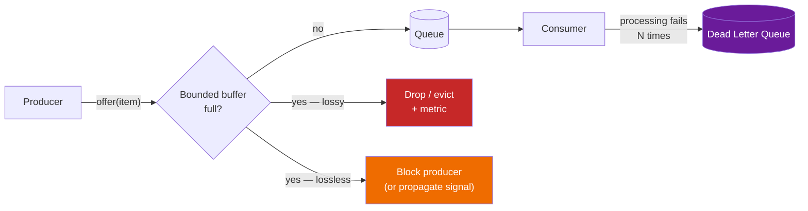

# Backpressure

**Prerequisites:** [Reliability Overview](index.md)

---

## Why This Exists

A rate limiter answers "is this caller allowed to send this much?" A circuit breaker answers "is it pointless to even try right now?" Neither answers the question that shows up the moment a queue or a stream sits between a fast producer and a slower consumer: **the consumer is falling behind, and something has to give. What?**

That something is one of exactly two things: the *producer* slows down, or *some of the data* doesn't survive. There is no third option — a consumer that's structurally slower than its producer cannot process everything at the producer's rate no matter how the buffer between them is engineered. **Backpressure is the deliberate choice of which of those two you accept, made explicit, instead of discovering it by accident when a queue runs out of memory.**

Without that choice made explicitly, the default is an unbounded queue — and an unbounded queue doesn't remove the problem, it just converts "the consumer is behind" into "the process is about to OOM," on a delay.

---

## Mental Model

```
Producer: 10,000 msg/s                Consumer: 6,000 msg/s
                                       (this gap does not close itself)

No backpressure (unbounded buffer):
Producer ──→ [ growing queue ] ──→ Consumer
             memory climbs forever, then OOM — a crash, not a decision

Lossy backpressure (bounded buffer, drop policy):
Producer ──→ [ 6,000-slot ring ] ──→ Consumer
             new arrivals evict old ones (or get rejected) — data is lost,
             on purpose, so the process stays alive and latency stays bounded

Lossless backpressure (bounded buffer, propagate signal):
Producer ──╳ (blocked / told to wait) ──→ [ full buffer ] ──→ Consumer
           the producer itself slows to 6,000 msg/s — nothing is lost,
           but the slowdown now propagates to whoever is upstream of it
```

Every backpressure strategy is a specific answer to "what happens when the buffer between these two is full," and the two families above are the only real answers. Everything else — which policy, which threshold, which signal — is detail on top of that choice.

---

## Lossy Backpressure: Drop Something, Keep Moving

The buffer is bounded. When it's full, new work is dropped (or old work is evicted) rather than accepted and queued indefinitely.

```python
"""Bounded queue with a drop policy — lossy backpressure."""

from collections import deque
from dataclasses import dataclass


@dataclass
class DropStats:
    accepted: int = 0
    dropped: int = 0


class DropOldest:
    """Ring buffer: newest data matters most (metrics, live video, GPS pings).
    Full buffer evicts the oldest entry to make room for the newest."""

    def __init__(self, capacity: int):
        self.buffer: deque = deque(maxlen=capacity)  # maxlen auto-evicts oldest
        self.stats = DropStats()

    def offer(self, item) -> None:
        if len(self.buffer) == self.buffer.maxlen:
            self.stats.dropped += 1  # deque will silently evict; we just count it
        self.buffer.append(item)
        self.stats.accepted += 1


class DropNewest:
    """Full buffer rejects the incoming item instead. Use when early data
    matters more than recent data (e.g. the start of an audit trail)."""

    def __init__(self, capacity: int):
        self.buffer: deque = deque()
        self.capacity = capacity
        self.stats = DropStats()

    def offer(self, item) -> bool:
        if len(self.buffer) >= self.capacity:
            self.stats.dropped += 1
            return False  # rejected, caller decides what to do (log it, sample it)
        self.buffer.append(item)
        self.stats.accepted += 1
        return True
```

**Where lossy backpressure is the right call:** high-volume telemetry, metrics, live video/audio frames, GPS pings — anywhere the *next* data point makes the lost one irrelevant, and where blocking the producer (a sensor, a video encoder, a real-time client) would be worse than losing a sample. A dropped metric point degrades a dashboard's resolution for one second; a blocked video encoder freezes the stream for everyone watching.

**The non-negotiable part:** a drop is silent by default. It has to be made visible — a `dropped_total` counter, a sampling rate exposed to the consumer of the data — or you've traded an OOM crash for silent, undetected data loss, which is arguably worse because nobody gets paged for it.

---

## Lossless Backpressure: Slow the Producer Down

The buffer is still bounded, but instead of dropping on overflow, the system signals the producer to stop or slow down until there's room. Nothing is lost; latency is what absorbs the mismatch instead.

```python
"""Bounded blocking queue — lossless backpressure via backward signaling."""

import queue
import threading


class BackpressuredPipeline:
    """A full queue blocks put() — the producer's thread stalls until the
    consumer drains space. No data is dropped; the producer pays in latency."""

    def __init__(self, capacity: int):
        self.queue: queue.Queue = queue.Queue(maxsize=capacity)

    def produce(self, item) -> None:
        # Blocks here if the queue is full — this IS the backpressure signal.
        # A network protocol does the equivalent by shrinking a TCP receive
        # window or, in HTTP/2, pausing a stream via flow-control frames.
        self.queue.put(item, block=True)

    def consume(self):
        return self.queue.get(block=True)
```

This is exactly what TCP's receive window and HTTP/2's per-stream flow control do at the network layer, and what reactive-streams libraries (Project Reactor, RxJava, Akka Streams) do at the application layer: the consumer advertises how much it can absorb, and the producer is mechanically prevented from exceeding it. Kafka's own consumer model is lossless by construction for a different reason — the broker is a durable log, not a bounded in-memory buffer, so a slow consumer just falls behind on its offset instead of forcing a drop-or-block decision; the trade-off shows up later, as retention expiring data the consumer never got to (see [Kafka's retention/offset model](../messaging/kafka.md#how-it-works-internally)).

**Where lossless backpressure is the right call:** anything where losing an item is a correctness bug, not a resolution trade-off — payment events, inventory decrements, order state transitions, anything already covered by [outbox / idempotent consumer](../messaging/patterns.md#outbox-pattern-reliably-publishing-alongside-a-db-write) guarantees elsewhere in this repo. If the event must eventually be processed exactly because it changes money or state, you cannot drop it to relieve pressure — you have to slow down instead.

**The cost that's easy to miss:** blocking a producer doesn't make the slowness disappear, it *relocates* it. If the producer is itself a consumer of something further upstream, that something now backs up too — this is the same head-of-line-blocking mechanism as [stream-processing backpressure](../architecture-patterns/stream-processing.md#3-backpressure) propagating operator-to-operator through a Flink pipeline. Lossless backpressure without a bound on how far upstream you're willing to propagate a slowdown just moves the OOM risk to a different, often less obvious, box.

---

## Architecture: Where This Sits Relative to Rate Limiting and DLQs



These three mechanisms are easy to conflate because they all show up as "the queue is doing something unexpected," but they answer different questions:

| Mechanism | Question it answers | Trigger |
|---|---|---|
| **Rate limiter** | Should this caller be allowed to send more right now? | Request rate exceeds a quota |
| **Backpressure** | The buffer between producer and consumer is full — drop or block? | Sustained throughput mismatch |
| **Dead-letter queue** | This *specific* message keeps failing — quarantine it | Processing failure, not volume |

A rate limiter prevents the mismatch from forming in the first place, at the edge. Backpressure is what you fall back on once a mismatch exists between two systems you don't control the edge of (an internal producer and consumer, or a queue and a downstream service). A DLQ doesn't relieve volume at all — it's for the message that would keep failing at *any* volume, including one message a day. A system under load commonly needs all three at once: rate limiting at the ingress, backpressure between internal stages, and a DLQ so a malformed message doesn't masquerade as a backpressure problem and get silently dropped by a lossy policy that was never meant to hide bugs.

---

## Failure Modes

### Unbounded Queue as the Default

The most common version of this failure isn't picking the wrong policy — it's never picking one. A `List` or plain in-memory queue with no `maxsize` behaves fine in every load test that doesn't sustain the mismatch long enough to matter, then OOMs in production during the first real traffic spike or the first time the consumer has a bad day.

**Fix:** every producer→consumer buffer gets an explicit bound and an explicit policy, decided at design time — not `queue.Queue()`, always `queue.Queue(maxsize=N)` with a stated reason for `N` and for what happens when it's hit.

### Silent Data Loss From an Unmonitored Lossy Policy

A drop policy without a `dropped_total` metric is indistinguishable from a bug. Six months later someone notices a gap in historical data and has no way to tell whether it was backpressure working as designed or a real outage.

**Fix:** every drop increments a counter with the reason attached; alert on a *rate* of drops (a policy occasionally shedding a burst is fine), not on the mere existence of any drop.

### Lossless Backpressure Propagating Into a Cascading Stall

Blocking the producer is correct locally and can be catastrophic globally: if the producer is a request-handling thread and it blocks on a full queue, the thread pool serving unrelated requests exhausts, and one slow consumer takes down endpoints that have nothing to do with it.

**Fix:** bound *how far* lossless backpressure is allowed to propagate — a timeout on the blocking `put()`, converted into a `503`/`429` at the boundary, rather than an indefinite block. This is the same instinct as [decreasing timeouts down the stack](index.md#timeouts-request-deadlines-vs-idle): a stall has to surface as a fast, explicit failure at some layer, or it just moves until it finds the least monitored one.

### Thundering Herd When Backpressure Releases

Producers that were blocked (or clients that were shedding requests) often retry or resume in a synchronized burst the moment the consumer catches up, re-triggering the exact overload that caused the backpressure in the first place.

**Fix:** the same defense as any synchronized-retry problem — jitter the resume, and ramp back up rather than releasing the full backlog at once. See [why jitter is not optional](index.md#why-jitter-is-not-optional).

---

## Production Debugging

```
Symptom: consumer lag is climbing, or producer-side p99 latency spiked.

1. Is this actually a sustained rate mismatch, or a transient blip?
   → producer rate vs. consumer throughput over the last hour, not the last minute
2. What's the buffer's policy right now?
   → bounded or unbounded? lossy (which eviction rule) or lossless?
3. If lossy: what's the drop rate, and is it visible anywhere?
   → dropped_total by reason; if this metric doesn't exist, that's the bug
4. If lossless: how far upstream did the block propagate?
   → check thread pool saturation / request queue depth on the blocked producer,
     not just the buffer itself — the real damage is usually one hop further up
5. Is a DLQ absorbing what should be a backpressure signal (or vice versa)?
   → a message failing because it timed out under load isn't a poison
     message; retrying it after load drops should succeed
```

---

## Trade-offs

| | Lossy | Lossless |
|---|---|---|
| Data loss | Yes, by design | No |
| Producer impact | None — producer never slows down | Producer stalls or is throttled |
| Blast radius if mismatch is sustained | Contained to the dropped data | Can propagate upstream indefinitely without a bound |
| Right for | Metrics, telemetry, live media, sampling-tolerant data | Payments, state transitions, anything requiring durability |
| Requires | Visible drop metrics, or it's silent data loss | A propagation bound (timeout), or it's a cascading stall |

---

## Interview Questions

=== "Basic"
    **Q: What is backpressure, and why can't you just use a bigger queue?**

    "Backpressure is what a system does when a consumer can't keep up with a producer's rate — the buffer between them will fill up, and something has to happen when it does. A bigger queue doesn't solve the mismatch, it just delays it: if the consumer is structurally slower than the producer, an unbounded queue grows forever and the process eventually runs out of memory. The queue was never the problem; the rate mismatch is, and you have to decide explicitly whether to drop data (lossy) or slow the producer down (lossless) once the buffer is full."

=== "Senior"
    **Q: When would you choose lossy backpressure over lossless, and how do you avoid it turning into silent data loss?**

    "Lossy backpressure is right when losing an individual item is acceptable and blocking the producer would be worse — high-volume metrics, live video frames, GPS pings, anywhere the next data point makes the dropped one nearly irrelevant. Lossless is right when every item matters for correctness — payment events, order state changes — where dropping is a bug, not a trade-off. The failure mode with lossy backpressure specifically is that a drop policy with no metric is indistinguishable from a silent bug: six months later there's a gap in the data and nobody can tell if it was the policy working as intended or a real outage. So the drop has to increment a counter with a reason, and you alert on the *rate* of drops, not on their mere existence — an occasional burst getting shed is the system working correctly."

=== "Staff"
    **Q: You have a request-handling service that writes to an internal queue feeding a slower downstream processor. Under load, p99 latency on unrelated endpoints spikes. Diagnose and fix.**

    "This smells like lossless backpressure propagating somewhere it shouldn't. If the internal queue is a bounded blocking queue and the downstream processor falls behind, the request-handling threads calling `put()` block waiting for space — and if those are the same thread pool serving *all* endpoints, one slow downstream processor is now starving unrelated request handlers of threads, which is exactly the bulkhead problem this section's reliability page describes. The fix has two parts: first, bound how long a producer will block — a timeout on the enqueue that converts into a fast 503 instead of an indefinite stall, so backpressure surfaces as an explicit failure instead of a silent latency cliff. Second, isolate the queue-writing path into its own thread pool or bulkhead so a stall there can't consume the capacity serving unrelated endpoints. I'd also check whether this workload can tolerate lossy backpressure instead — if the downstream processor is doing something like analytics ingestion rather than a correctness-critical write, switching to a bounded ring buffer with a drop policy removes the propagation risk entirely, at the cost of the dropped data needing to be an accepted trade-off with the product owner, not an implementation detail."

---

## Key Takeaways

!!! success "Remember"
    1. When a consumer is slower than its producer, something must give: the producer slows down, or some data is dropped. An unbounded queue just delays that choice until it becomes an OOM crash.
    2. **Lossy backpressure** trades correctness for producer throughput — right for metrics, telemetry, live media. It must expose a drop-rate metric or it's silent, undetected data loss.
    3. **Lossless backpressure** trades producer throughput for correctness — right for payments and state transitions. It must have a propagation bound (a timeout at the enqueue point), or a slow consumer stalls everything upstream of it, including unrelated work sharing the same thread pool.
    4. Backpressure, rate limiting, and DLQs solve three different problems: rate limiting stops a mismatch from forming at the edge; backpressure handles a mismatch that already exists between two internal stages; a DLQ quarantines a message that fails regardless of volume.
    5. Releasing backpressure is itself a thundering-herd risk — ramp back up with jitter, don't release the full backlog at once.
