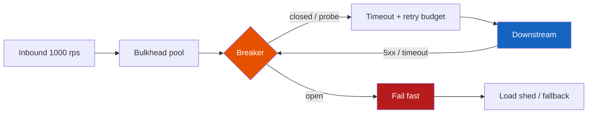

# Circuit Breakers

**Prerequisites:** [Reliability Overview](index.md), [Tail Latency](../performance/tail-latency.md)

[← Reliability](index.md) | [Next: Rate Limiting →](rate-limiting.md)

---

## Why This Exists

Payments API calls Fraud. Fraud's p99 is 80ms. You set no timeout. Fraud's DB locks. Threads pile up. Payments p99 becomes "however long Fraud is sad." The fleet is **latched** to a dead dependency.

You add retries: 3 tries, no backoff.

```
1000 rps inbound
Fraud times out
each request × 3 tries  → 3000+ rps at Fraud
Fraud was 80% sick      → you just made it 100% dead
your thread pool        → also dead (retries hold slots)
```

Timeouts, backoff, jitter, then a **circuit breaker** — not as decoration, as the thing that stops you from murdering a recovering service.

!!! tip "Mental Model"
    A fuse in a house. Closed: current flows. Too many faults: **open** — fail fast, lights out in *one room*, house lives. After a cool-down, **half-open**: one probe. Success → close. Fail → open again.

    `timeout bounds the wait` · `retry is a loan` · `breaker is the credit limit` · `bulkhead is the room`

---

## Naive System → What Breaks

**Unlimited retries, 30s HTTP client, one thread pool for all deps.**

| Pressure | Break |
|----------|--------|
| Dep 5s hang, no timeout | Pool = QPS × 5s (Little's Law). 200 rps × 5s = 1,000 threads |
| Retry ×3 immediate | 200 → 600 rps at the dep; thundering herd on recovery |
| Synchronized retry | All pods retry on the same 1s boundary → **retry storm** |
| One pool | Fraud death starves *shipping* on the same executor |
| Breaker copied from a blog, 5 failures | One deploy blip opens breaker for 30s × every pod = self-DDoS of errors |

---

## The Concept

Layer the defenses. **Do not start at the breaker.**

1. **Timeout** — every outbound call has a deadline < caller SLO. If Fraud SLO is 200ms p99, timeout 100–150ms, not 30s.
2. **Retry only if safe** — GET, idempotent PUT, or a request-id. Never blind-retry `POST /charge`.
3. **Backoff + jitter** — `sleep = min(cap, base * 2^attempt) + random`. Jitter stops lockstep.
4. **Budget** — retry at most X% extra load (e.g. 10%). Budget exhausted → fail.
5. **Circuit breaker** — closed / open / half-open on *that dependency*.
6. **Bulkhead** — separate pools / queue lengths per dependency.
7. **Load shed** — when *we* are sick, drop low-priority work cheaply (503 + `Retry-After`).

Breaker states:

| State | Behavior |
|-------|----------|
| **Closed** | Calls pass. Count failures in a window (count or %). |
| **Open** | Calls fail *locally* (fast 503). Timer runs. |
| **Half-open** | Allow N probes. Success → closed. Fail → open. |

---

## Architecture



---

## Mechanics

**Failure definition.** Timeouts, 5xx, connection errors. **Not** 4xx (except 429, which is a *signal* to back off, not a reason to trip for everyone). Mixing 404s into the failure rate opens the breaker because of bad clients.

**Window.** Count (5 failures) is simple and twitchy. Percentage in a sliding window (e.g. 50% of ≥20 calls) needs a minimum throughput or a cold pod trips itself.

**Open duration.** 1–30s typical. Too short: you hammer the dep. Too long: you extend the outage past recovery.

**Half-open.** One probe per pod × 200 pods = 200 rps hammer. **Global** or **per-cluster** half-open (or a tiny probe % ) or you recreate the storm.

**Fallback.** Cached response, default, or "degraded UI." A fallback that hits the same DB is not a fallback.

**Bulkhead sizes.** `pool = peak_rps × timeout_s × headroom`. Fraud: 200 rps × 0.15s × 2 ≈ 60. Shipping: its own 60. Shared 60 means one dep takes them all.

---

## Realistic Example With Numbers

Checkout: 1,000 rps. Fraud p50=20ms, p99=80ms. Timeout 150ms. 3 retries, no jitter.

```
Healthy:     downstream ≈ 1,000 rps     amp 1.0×
Fraud 80% timeout:
  attempts   ≈ 1 + 0.8 + 0.8² ≈ 2.44    (if all retry)
  downstream ≈ 2,400 rps                amp 2.4×
  plus 3rd retry                        → ~3,000 rps
  threads    1,000 × 0.15 × 2.4         ≈ 360 vs pool of 80 → 503s at the edge
```

Breaker: 50% fail over 20 calls, 5s open.

```
~40 ms to trip (20 calls at 1k rps is 20 ms, plus eval)
open: checkout fails fraud-check fast (~1 ms)
fallback: allow checkout < $50 on cached score; hold the rest
half-open: 1 probe / 2s / cluster, not / pod
recovery: Fraud at 200 rps of probes, not 3,000 retries
```

That is the difference between a 6-minute Fraud blip and a 40-minute company outage.

---

## Interactive Explainer

Trip the breaker with 80% failures, then heal. Then run the retry-storm view: slow the downstream and watch amplification.

<div class="sim-container">
  <div class="sim-title">Circuit Breaker</div>
  <div class="sim-controls">
    <button class="sim-btn success" onclick="window._cb && window._cb.run()">Run traffic</button>
    <button class="sim-btn" onclick="window._cb && window._cb.pause()">Pause</button>
    <button class="sim-btn" onclick="window._cb && window._cb.reset()">Reset</button>
    <button class="sim-btn danger" onclick="window._cb && window._cb.injectFailure(0.8)">Fail 80%</button>
    <button class="sim-btn success" onclick="window._cb && window._cb.injectFailure(0)">Healthy</button>
  </div>
  <canvas id="cb-canvas" class="sim-canvas" style="width:100%;height:220px;"></canvas>
  <div class="sim-stats">
    <div class="sim-stat"><div class="sim-stat-label">State</div><div class="sim-stat-value" id="cb-state">CLOSED</div></div>
    <div class="sim-stat"><div class="sim-stat-label">Failures</div><div class="sim-stat-value" id="cb-fail">0</div></div>
    <div class="sim-stat"><div class="sim-stat-label">Rejected</div><div class="sim-stat-value" id="cb-rej">0</div></div>
  </div>
  <div class="sim-log" id="cb-log"></div>
</div>

<div class="sim-container">
  <div class="sim-title">Retry Storm</div>
  <div class="sim-controls">
    <button class="sim-btn success" onclick="window._retry && window._retry.run()">Run</button>
    <button class="sim-btn" onclick="window._retry && window._retry.pause()">Pause</button>
    <button class="sim-btn" onclick="window._retry && window._retry.reset()">Reset</button>
    <button class="sim-btn danger" onclick="window._retry && window._retry.slowDownstream()">Slow downstream</button>
  </div>
  <canvas id="retry-canvas" class="sim-canvas" style="width:100%;height:220px;"></canvas>
  <div class="sim-stats">
    <div class="sim-stat"><div class="sim-stat-label">Client RPS</div><div class="sim-stat-value" id="retry-in">1000</div></div>
    <div class="sim-stat"><div class="sim-stat-label">Downstream RPS</div><div class="sim-stat-value" id="retry-out">1000</div></div>
    <div class="sim-stat"><div class="sim-stat-label">Amplification</div><div class="sim-stat-value" id="retry-amp">1.0×</div></div>
  </div>
  <div class="sim-log" id="retry-log"></div>
</div>

---

## Failure Modes

| Mode | Symptom | Fix |
|------|---------|-----|
| Retry storm | Dep RPS ≫ inbound; both red | Jitter, budget, breaker, hedge only on idempotent |
| Breaker flap | State flips 1 Hz | Wider window, min requests, hysteresis |
| Per-pod half-open stampede | Recovery killed every N seconds | Cluster probe limiter |
| 4xx trips breaker | Auth bug "takes down" payments | Count only 5xx + timeout |
| Fallback to same DB | Breaker open, DB still dying | Fallback must be a *different* failure domain |
| Bulkhead too small | Healthy dep 429s | Size from Little's Law, not folklore "8 threads" |
| No deadline | Breaker never sees failure, pool sticks | Timeout is the sensor |

!!! warning "Production Trap"
    A circuit breaker without a timeout is a thermometer in a fireproof box. The call never "fails"; it just occupies a thread until the user hangs up. Always pair: deadline → failure metric → breaker → bulkhead.

---

## Production Debugging

```
CPU         20% and 503s           breaker open or pool exhausted — not "need more CPU"
Memory      thread / connection leak  hung calls without timeout
Disk        usually innocent       unless the dep is your disk
Network     reset / timeout %      the failure signal you should already export
Queue depth inbound vs outbound    outbound >> inbound ⇒ retries
Lag         not Kafka — *in-flight age*
Pools       active=max, wait>0     the outage shape; dump stack, find the dep
p50/p95/p99 p50 20ms p99 3s        timeout set at 3s; cut it
Error rate  503 local vs 502 dep   open breaker vs dep still reached
Timeouts    rate ≈ fail rate       good — they are working
Retries     retry_ratio > 1.2      storm; page on this, not just 5xx
GC          pause → timeout → retry  GC caused a retry storm
Locks       dep lock + our pool     two systems, one deadlock
```

Dashboards that pay rent: `breaker_state`, `calls_rejected`, `retry_ratio` (out/in), `pool_active/max`, `dep_p99`, `timeout_rate`.

---

## Scaling Limits

- Breakers are **per dependency, per cluster** — 40 microservices × 5 deps = 200 policies. Unowned policies rot to defaults.
- They do not add capacity. Open breaker = **user-visible error** unless you have a real fallback.
- Retry budget is a global scarce resource. Ten layers of "3 retries" is 3^10 in the worst cartoon, and 2–4× in real meshes. Cap at the edge.
- Sidecar (Envoy/Istio) breakers see sockets; app breakers see business errors. You often need both, with the same timeout story.
- Multi-tenant: one tenant's 80% errors must not open the breaker for everyone — isolate or you built a cross-tenant kill switch.

---

## Trade-offs

| Dimension | No protection | Timeouts + jittered retry | Breaker + bulkhead + shed |
|-----------|---------------|---------------------------|---------------------------|
| Latency | Unbounded p99 | Bounded by timeout | Fail-fast when open |
| Throughput | Collapses with dep | Amplifies when sick | Preserves *other* traffic |
| Availability | Coupled to worst dep | Worse during blips | Higher for the *system* |
| Consistency | — | Duplicate side effects | Fewer duplicates if fail-fast |
| Durability | — | At-least-once storms | Needs idempotency still |
| Complexity | Low | Medium | High (tuning) |
| Cost | Outage cost | Extra dep capacity | Engineering + false opens |
| Ops | One giant page | Retry dashboards | State machine to explain |

---

## Interview Questions

=== "Foundation"
    **Q: What is a circuit breaker and when does it open?**

    "It's a per-dependency switch. Closed, we call normally and record timeouts/5xx. If the failure rate crosses a threshold we open and fail fast so we stop amplifying the outage and free our own threads. After a sleep we half-open, send a probe, and close on success. It sits on top of timeouts — without a timeout there is no failure to count."

=== "Senior"
    **Q: 1000 rps, 3 retries, downstream melting. What do you do in the first 15 minutes?**

    "Disable or cap retries at the edge (feature flag / Envoy retry budget). Confirm `downstream_rps / inbound_rps`. Drop timeout to the SLO, add jitter if anything still retries. If the dep is truly down, open the breaker and serve fallback or 503 with Retry-After. After the fire: idempotency keys, retry only on idempotent methods, bulkhead that pool, page on retry_ratio. I would not 'scale Fraud to 3×' as the first move — we created 3×."

=== "Staff"
    **Q: 200 pods half-open at once and knock Fraud over every 10s. Design the control plane.**

    "Per-instance half-open is the bug. I want a cluster-wide probe quota: a small sidecar or mesh policy that allows ~1% or N rps of attempts while OPEN/HALF_OPEN, coordinated via a shared counter (Redis) or Envoy's outlier detection with ejection, not 200 independent state machines. I'd also jitter open-duration so pods don't synchronize. Org: one SLO and one owner per dependency, breaker config in the same repo as the client, load test the *recovery* path, not just the happy path. Multi-tenant Fraud gets a breaker per tenant shard so one bad tenant cannot fail closed for checkout globally."

---

## Reasoning Exercises

1. Inbound 2,000 rps, 2 retries, 30% timeout. Estimate downstream RPS and thread count if timeout=1s and you have no breaker.
2. Is retrying `POST /pay` after a 504 correct? What exactly must the provider guarantee?
3. Your breaker opens on 10% errors. A client bug sends 20% 401s. What happens? How do you classify failures?
4. Draw bulkheads for Checkout → {Fraud, Inventory, Tax, Email}. Email is slow; who dies if the pool is shared?

---

## Key Takeaways

!!! success "Remember"
    1. Timeout first; retries are load you chose to create.
    2. 1000 rps × 3 retries is a 3000 rps attack on a sick peer.
    3. Closed / open / half-open stops the attack; half-open must be cluster-scoped.
    4. Bulkheads stop one dep from taking the process with it.
    5. Load shed on the way *in* when *you* are the sick dep.

**Previous:** [Reliability](index.md) | **Next:** [Rate Limiting](rate-limiting.md)

!!! info "Staff Engineer Lens"
    Reliability is a budget of extra load and extra latency you are willing to spend to hide faults. Staff engineers publish that budget (`retry_ratio < 1.2`, `timeout < 30% of SLO`) as SLOs on *clients*, not just servers. The circuit breaker is policy. If only one senior knows the thresholds, you do not have a platform — you have folklore.

!!! note "Interview Insight 🎯"
    Start from Little's Law and retry math, then name the breaker. Interviewers are hunting for "retries amplify outages." If you jump to Hystrix states without numbers, you sound like a docs page. If you say "3 retries, jitter, 10% budget, fail-fast when open," you sound like you have been on-call.
