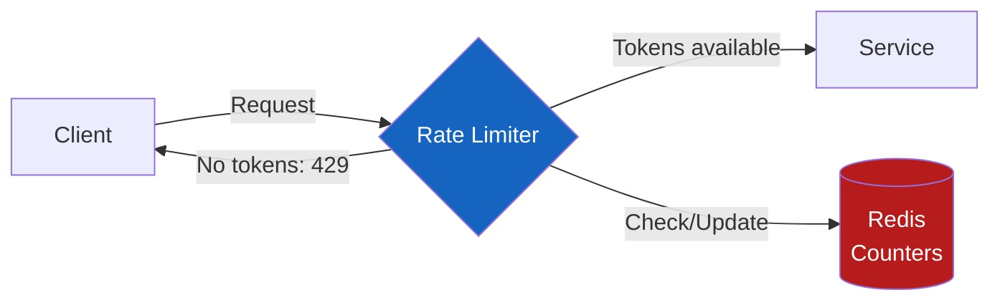
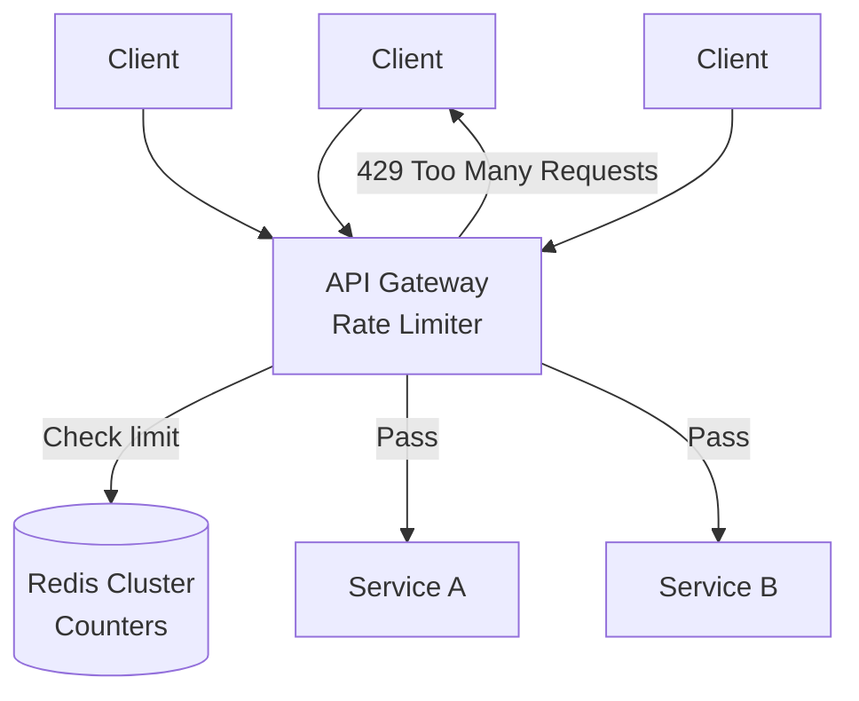

# Rate Limiting

**Prerequisites:** [Reliability Overview](index.md)

---

## Why This Exists

Without rate limiting:
- One misbehaving client can exhaust server resources, degrading service for everyone
- A DDoS attack can bring down your entire system
- Runaway scripts can generate millions of API calls

Rate limiting ensures **fairness** (everyone gets their share), **stability** (the system doesn't overload), and **economics** (you don't serve unlimited free requests).

---

## Mental Model

Think of a rate limiter as a **token bucket** at the entrance of a nightclub. The club issues 10 tokens per second. Each person needs 1 token to enter. When tokens run out, people wait or leave.

---

## Architecture



---

## Interactive Simulation

<div class="sim-container">
  <div class="sim-title">🚦 Rate Limiter Simulator</div>

  <div class="sim-controls">
    <button class="sim-btn success" onclick="window._rl && window._rl.start()">▶ Start Traffic</button>
    <button class="sim-btn danger" onclick="window._rl && window._rl.stop()">⏹ Stop</button>
    <button class="sim-btn danger" onclick="window._rl && window._rl.burst()">💥 Burst (200 req)</button>
  </div>

  <div style="margin:0.75rem 0">
    <strong style="color:#90caf9">Algorithm:</strong>
    <button class="sim-btn" onclick="window._rl && window._rl.setAlgorithm('token-bucket')">Token Bucket</button>
    <button class="sim-btn" onclick="window._rl && window._rl.setAlgorithm('fixed-window')">Fixed Window</button>
    <button class="sim-btn" onclick="window._rl && window._rl.setAlgorithm('sliding-window')">Sliding Window</button>
  </div>

  <div id="rl-canvas"></div>

  <div class="sim-stats">
    <div class="sim-stat">
      <div class="sim-stat-label">Tokens</div>
      <div class="sim-stat-value" id="rl-tokens">20</div>
    </div>
    <div class="sim-stat">
      <div class="sim-stat-label">Allowed</div>
      <div class="sim-stat-value" id="rl-allowed">0</div>
    </div>
    <div class="sim-stat">
      <div class="sim-stat-label">Rejected (429)</div>
      <div class="sim-stat-value" id="rl-rejected">0</div>
    </div>
    <div class="sim-stat">
      <div class="sim-stat-label">Effective Rate/s</div>
      <div class="sim-stat-value" id="rl-rate">0</div>
    </div>
  </div>

  <div class="sim-log" id="rl-log"></div>
</div>

**Try:** Inject a burst of 200 requests. Observe how token bucket handles it vs fixed window.

---

## Algorithms

### 1. Token Bucket

```
Bucket capacity: 20 tokens
Refill rate: 10 tokens/second

Every second: add 10 tokens (up to max 20)
Each request: consume 1 token
If no tokens: reject with 429
```

```python
import time
import threading

class TokenBucket:
    def __init__(self, rate: float, capacity: int):
        self.rate = rate          # tokens per second
        self.capacity = capacity  # max tokens
        self.tokens = capacity    # start full
        self.last_refill = time.time()
        self.lock = threading.Lock()

    def allow(self) -> bool:
        with self.lock:
            now = time.time()
            elapsed = now - self.last_refill
            self.tokens = min(
                self.capacity,
                self.tokens + elapsed * self.rate
            )
            self.last_refill = now

            if self.tokens >= 1:
                self.tokens -= 1
                return True
            return False

# Usage
limiter = TokenBucket(rate=10, capacity=20)
if limiter.allow():
    process_request()
else:
    return Response(status=429, headers={"Retry-After": "0.1"})
```

**Best for:** Smoothing bursty traffic while allowing controlled bursts.

### 2. Fixed Window Counter

```
Window: 1 second
Limit: 10 requests per window

[00:00.000 - 00:01.000]: 10 requests allowed
[00:01.000 - 00:02.000]: counter resets → 10 more allowed
```

**Problem:** A client can send 10 requests at 00:00.999 and 10 more at 00:01.001 — 20 requests in 2ms, 2× the rate limit.

```python
import redis
import time

def allow_fixed_window(user_id: str, limit: int = 10) -> bool:
    r = redis.Redis()
    window = int(time.time())  # current second
    key = f"rate:{user_id}:{window}"

    count = r.incr(key)
    if count == 1:
        r.expire(key, 2)  # expire after 2 windows
    return count <= limit
```

### 3. Sliding Window Log

Track exact timestamps of recent requests:

```python
def allow_sliding_window(user_id: str, limit: int = 10, window_sec: int = 1) -> bool:
    r = redis.Redis()
    now = time.time()
    key = f"rate_log:{user_id}"

    pipe = r.pipeline()
    # Remove requests older than window
    pipe.zremrangebyscore(key, 0, now - window_sec)
    # Count remaining requests in window
    pipe.zcard(key)
    # Add current request
    pipe.zadd(key, {str(now): now})
    pipe.expire(key, window_sec + 1)
    results = pipe.execute()

    return results[1] < limit  # count before adding current
```

**Pros:** Accurate, no boundary spike issue
**Cons:** Memory-intensive (stores every request timestamp)

### 4. Sliding Window Counter (Approximate)

Combines accuracy with efficiency using two fixed windows:

```
Current window count + Previous window count × (remaining fraction of previous window)

Example:
- Limit: 100/minute
- Previous window (last minute): 80 requests
- Current window (this minute): 30 requests, 25 seconds elapsed
- Fraction of current window elapsed: 25/60 = 0.42

Estimated rate = 30 + 80 × (1 - 0.42) = 30 + 46.4 = 76.4 → under limit ✓
```

---

## Distributed Rate Limiting

For a service running across multiple pods/servers, each pod maintaining its own counter doesn't work — 10 pods with a limit of 100/pod = 1000 effective requests.

### Redis-Based Distributed Rate Limiting

```python
import redis
import time

r = redis.Redis(host='redis-cluster')

def allow_distributed(user_id: str, limit: int = 100) -> bool:
    key = f"rate:{user_id}:{int(time.time())}"

    # Atomic increment + expire using Lua script
    script = """
    local current = redis.call('INCR', KEYS[1])
    if current == 1 then
        redis.call('EXPIRE', KEYS[1], 2)
    end
    return current
    """
    count = r.eval(script, 1, key)
    return count <= limit
```

**Why Lua?** The INCR + EXPIRE must be atomic — otherwise two requests could both see count=0, both set EXPIRE, and both pass.

### Architecture: Rate Limiter in API Gateway



**Levels of rate limiting:**
1. **IP-based**: prevent DDoS (coarse, can affect NAT users)
2. **User/API key**: per-customer limits
3. **Endpoint**: different limits for different APIs (`/search` vs `/checkout`)
4. **Tenant**: large tenant limits separate from small tenant limits

---

## Failure Modes

### Rate Limiter Redis Failure
- **Behavior depends on policy:** fail-open (allow all traffic) vs fail-closed (deny all traffic)
- **Production choice:** Fail-open — a brief period of unthrottled traffic is better than complete service outage
- **Detection:** Redis connectivity metric; alert when rate limiter is in fail-open mode

### Retry Storms Amplified by Rate Limiting
- Client gets 429 → retries immediately → 429 → retries → ... → amplifies load
- **Fix:** Clients must implement exponential backoff with jitter; include `Retry-After` header in 429 response

### Thundering Herd at Window Reset
- Fixed window: all throttled clients retry exactly when the window resets → burst at window boundary
- **Fix:** Sliding window, or add jitter to `Retry-After`

---

## Production Debugging

```
Symptom: High 429 rate for a specific customer

1. Check customer's actual request rate
   → rate_limiter_requests metric, filter by customer_id
2. Check what limit is configured
   → Rate limit config service / Redis key
3. Check if limit is appropriate
   → Is customer on right tier? Did usage legitimately grow?
4. Check for retry amplification
   → Is the customer's client retrying aggressively on 429?
5. Check for misconfiguration
   → Is rate limit applied per-instance instead of globally?

Headers to include in 429 response:
  X-RateLimit-Limit: 100
  X-RateLimit-Remaining: 0
  X-RateLimit-Reset: 1704067200
  Retry-After: 45
```

---

## Trade-offs

| Algorithm | Burst handling | Memory | Accuracy | Complexity |
|-----------|---------------|--------|----------|------------|
| Token Bucket | ✅ Allows burst | Low | High | Low |
| Fixed Window | ❌ Boundary spike | Very Low | Medium | Very Low |
| Sliding Window Log | N/A | High | Exact | Medium |
| Sliding Window Counter | Approximate | Low | High | Low |

---

## Interview Questions

=== "Basic"
    **Q: Explain how a token bucket rate limiter works.**

    "A token bucket maintains a counter (the 'bucket') with a maximum capacity. Tokens are added at a fixed rate (e.g., 10/second up to a max of 20). Each incoming request consumes one token. If the bucket is empty, the request is rejected with 429. This allows bursts up to the bucket capacity while enforcing a long-term average rate equal to the refill rate."

=== "Senior"
    **Q: How would you implement rate limiting in a distributed system across 50 servers?**

    "Each server maintaining its own counter doesn't work — you'd allow N×limit requests. The standard approach: use Redis as a shared counter. Use INCR + EXPIRE atomically (via Lua script or Redis transactions) to track requests per user per time window. For performance: use a sliding window counter (efficient in memory) or token bucket stored in Redis with pipelining to reduce round trips. For high throughput: local in-memory rate limiter with occasional Redis sync — this allows brief overages but reduces Redis load. The trade-off is accuracy vs latency/availability."

=== "Staff"
    **Q: Design a rate limiting system for an API with 100M users, 1M req/s, and different limits per customer tier.**

    "Requirements: 100M users, different limits per tier (free: 100/min, paid: 10K/min, enterprise: custom). At 1M req/s, Redis needs to handle that throughput. Architecture: (1) API Gateway layer does the rate limiting — keeps it out of business logic; (2) Redis Cluster for distributed counters — shard by user_id; (3) For free tier, use sliding window counter (memory-efficient); (4) For enterprise, per-account quotas stored in Redis Hash with custom limits from config service; (5) Local token bucket in API Gateway instances as L1 — reduces Redis hits by ~90%, occasional Redis sync for accuracy; (6) On Redis failure: fail-open with circuit breaker + alert; (7) Metrics: 429 rate by customer tier, p99 rate limiter latency, Redis hit rate. For 1M rps: with 10 gateway instances each handling 100K rps, and 90% local hits, Redis sees ~100K rps — manageable with a 10-node Redis cluster."

---

## Key Takeaways

!!! success "Remember"
    1. Token bucket: allows bursts, smooth long-term rate — most practical
    2. Fixed window: simple but has boundary spike vulnerability
    3. Sliding window counter: best accuracy/memory trade-off for distributed systems
    4. Distributed rate limiting requires centralized store (Redis) — fail-open on store failure
    5. Always return Retry-After header; clients must implement exponential backoff
    6. Layer rate limits: IP → API key → endpoint → tenant

