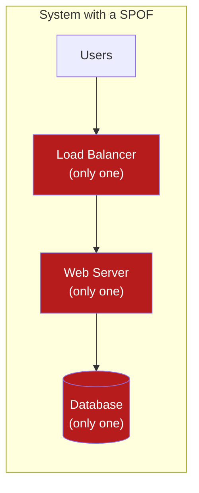
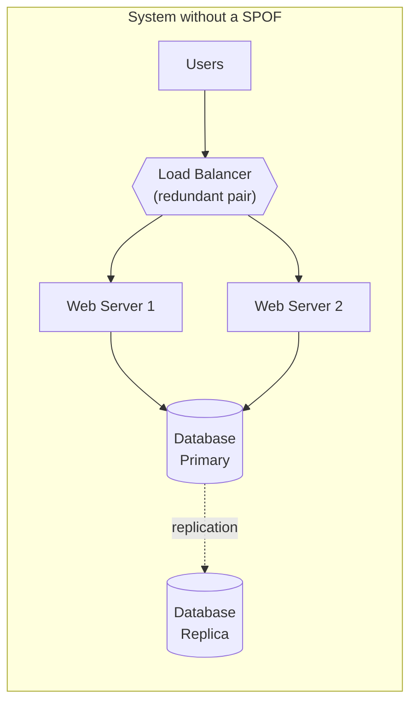

# Single Points of Failure

**Prerequisites:** [Reliability Overview](index.md)

[← Reliability](index.md) | [Next: Circuit Breakers →](circuit-breakers.md)

---

## Why This Exists

Every outage retrospective eventually reaches the same sentence: **"and there was only one of it."** One database with no replica. One load balancer with no standby. One person who knew how to restart the payment service. A single point of failure (SPOF) isn't a bug — it's a design decision, usually made implicitly by never asking "what happens when this dies," and it's the cheapest thing in this whole curriculum to find if you actually look for it before an incident does.

The skill being tested — in an interview and in a real architecture review — is not "do you know what SPOF means." It's: **given this diagram, can you point at the one box whose failure takes the whole system down, before anyone else in the room does?**

!!! tip "Mental model"
    Trace every request path through your architecture. At each box, ask: **"if this one instance disappeared right now, does the request still complete?"** If the honest answer is no, and there's exactly one of that box, you've found a SPOF. This is the same discipline as [failure analysis in the design framework](../foundations/framework.md) (step 11) — SPOF-hunting is that step applied specifically to "how many of this do we have."

---

## What Makes Something a SPOF

A SPOF is any component or system whose failure stops the entire (or a critical) function — not because it's important, but because **there is no backup path around it.**

In the left diagram, every box is red because *every box* only has one instance — the load balancer, the web server, and the database are each a SPOF in their own right, and the system's actual availability is the **product** of all three, not the availability of the weakest one alone. In the right diagram, redundancy at each tier means one failure at any tier still leaves a healthy path from user to data.

!!! warning "Redundancy at one tier doesn't remove SPOFs at the others"
    A common half-measure: teams add a second web server (cheap, stateless, easy) and stop, leaving one database and one load balancer. The system is still exactly as fragile as before for anything that touches the database or the LB — redundancy has to be evaluated **per component**, not as a property of "the system" in aggregate.

---

## Where SPOFs Actually Hide

The obvious ones (one server, one database) get caught in any review. The ones that cause real incidents are usually less obvious:

| Category | Example | Why it's easy to miss |
|---|---|---|
| Single network device | One switch/firewall/NAT gateway everything routes through | It's "infrastructure," not "the app" — doesn't show up in an application architecture diagram |
| Single power/rack/AZ | Every "redundant" instance happens to live in the same availability zone | Redundancy count looks fine (3 instances!) until you check *where* |
| Single DNS record or config | One DNS entry, TTL cached everywhere, pointing at a resource with no failover | Invisible until the thing it points to dies and every client's cache is stale |
| Single CI/CD or deploy credential | One person's expiring token is the only thing that can deploy a hotfix | Never appears in an architecture diagram at all — it's a process SPOF |
| Single admin account / credential | One shared root credential for a critical system | Security review catches "shared credential"; reliability review often doesn't connect it to availability risk |
| Single ISP / upstream provider | One network provider for the whole datacenter | Looks like "someone else's problem" until their outage is yours |

This is why a SPOF audit has to walk the **actual dependency graph**, not the boxes on the architecture slide — the network switch and the deploy credential are both real dependencies of "can we serve traffic," even though neither is an application component.

---

## Common SPOFs in a Typical Application

- Single application server (no horizontal scaling)
- Single database instance, no replica
- Single network device (switch, router, firewall) everything routes through
- Single power supply / single rack
- Single storage volume (disk failure = data loss, not just downtime)
- Single DNS server or record with no failover
- Single code repository or CI/CD server with no backup
- Single admin or person holding critical access nobody else has

Notice that only about half of this list is a "server" in any normal sense — the rest is infrastructure, process, and people, which is exactly why a SPOF audit run purely against an application architecture diagram misses half the real risk.

---

## The Five Levers That Remove or Manage a SPOF

None of these are new concepts on this site — SPOF elimination is really "apply the pattern you already know, to the box you haven't gotten around to yet." The first four actually **remove** the SPOF's availability impact — the system keeps serving traffic through the failure. The last one, monitoring, does not: it **detects** the failure faster so a human or automation can respond, but a monitored SPOF is still a SPOF until something on the "remove" side of this table also exists.

| Lever | What it does | Where it's covered in depth |
|---|---|---|
| **Redundancy** *(removes)* | Run N ≥ 2 of the component instead of 1 | [Replication](../distributed-systems/replication.md) (data tier), horizontal scaling generally |
| **Load balancing** *(removes)* | Distribute traffic across the redundant instances, and route around a dead one | [Load Balancing](../networking/load-balancing.md) |
| **Failover** *(removes)* | Automatic promotion of a standby when the primary dies | [Replication](../distributed-systems/replication.md) — leader election, failover time |
| **Replication** *(removes)* | Keep multiple live copies of data, not just multiple live copies of compute | [Consistency Models](../distributed-systems/consistency-models.md) for what you give up doing this |
| **Monitoring + alerting** *(detects, doesn't remove)* | Shrink time-to-detection below "a user complains," so the failure gets a faster response — it does not make the underlying single instance survive the failure | [Observability](../observability/debugging-playbook.md) |

**Regular backups** belong on this list too, but answer a different question than the other five: redundancy and failover keep the system *available* through a failure; backups are what saves you when the failure is **data corruption or deletion**, which replicates just as faithfully as good data does. A replica of corrupted data is still corrupted data — this is why backups (point-in-time, ideally with a delay or immutability window) are not optional even in a fully redundant, fully replicated system.

---

## Redundancy Isn't Free — Name the Cost

Removing a SPOF is a trade-off, not a strict improvement, and an interviewer will probe whether you know what you paid:

| Choice | Win | Cost |
|--------|-----|------|
| Redundant app servers behind a LB | No single-instance outage | More instances to patch/monitor; the LB itself is now the thing that needs redundancy |
| Database replica + failover | Survives primary loss | Replication lag (see [Consistency Models](../distributed-systems/consistency-models.md)); failover isn't instant — there's a real RTO |
| Multi-AZ deployment | Survives a whole zone loss | Cross-AZ network cost and latency; more complex deploy/rollout coordination |
| Multi-region | Survives a whole region loss | Significant cost and complexity; data residency and cross-region consistency become real problems, not edge cases |
| Backups | Survives corruption/deletion, not just hardware loss | Storage cost; restore time (RTO) is often much worse than failover RTO — test restores, not just backup jobs |

!!! tip "The senior answer"
    "High availability" isn't a single toggle — it's a series of redundancy decisions, each with its own cost, and the right amount of redundancy is set by the requirement (an RTO/RPO target, an availability SLO), not by "more is always better." A candidate who says "just make everything multi-region" without naming the cost is showing the same lack of judgment as one who names CQRS on a 100-user system (see [Architecture Patterns](../architecture-patterns/index.md)).

---

## Interview Questions

=== "Foundation"
    **Q: How would you identify single points of failure in an existing system?**

    "I'd walk the request path end to end and, at every component, ask 'if this specific instance died right now, does the request still succeed?' Anywhere the answer is no and there's only one of that component, that's a SPOF. I'd also deliberately look past the application diagram — network devices, DNS records, the CI/CD credential that can deploy a hotfix, even a single person who knows how to restart a legacy service — because those cause outages just as often as a database with no replica, and they don't show up if I only look at application architecture."

=== "Senior"
    **Q: Your team added a second application server for redundancy, but the last outage still took the whole system down. Why might that be, and what would you check?**

    "Redundancy at one tier doesn't remove SPOFs at the others — a second app server does nothing if the load balancer routing to both of them is still a single instance, or if both app servers point at one database with no replica. I'd check every tier independently: LB, app, database, and also the less obvious ones — are both 'redundant' instances actually in the same availability zone, so a single AZ outage takes both down anyway? Redundancy has to be verified per component and per failure domain, not assumed because the word 'redundant' appears somewhere in the architecture doc."

=== "Staff"
    **Q: Leadership wants to eliminate 'all single points of failure' company-wide after a bad outage. How do you turn that into an actual program, not just a slogan?**

    "'Eliminate all SPOFs' isn't achievable or even well-defined without a cost bound — redundancy is a spending decision, and spending it on every component equally is wasteful, since not every component's failure has the same blast radius or probability. I'd start by tying the effort to actual availability targets: what's the SLO per critical user journey, and what RTO/RPO does the business actually need for each. Then I'd run a SPOF audit that walks real dependency graphs, not architecture diagrams — including the process and people SPOFs (single admin credentials, single people who can deploy a hotfix), which tend to get missed entirely. I'd prioritize by (probability of failure) × (blast radius) × (cost to fix), not by which team shouts loudest, and I'd make 'test the failover, not just build it' a hard requirement — an untested failover path is very often a SPOF wearing a disguise, since 'we have a replica' and 'we have successfully failed over to the replica in the last quarter' are different claims."

---

## Key Takeaways

!!! success "Remember"
    1. A SPOF is defined by the absence of a backup path, not by importance — ask "if this one instance died, does the request still complete?" at every hop
    2. Redundancy has to be checked per component — one redundant tier doesn't protect the others, and "3 instances" isn't redundant if they share an AZ
    3. The real audit walks the dependency graph, not the architecture diagram — network devices, DNS, deploy credentials, and single admins are SPOFs too
    4. The five levers (redundancy, load balancing, failover, replication, monitoring) are patterns you already know from elsewhere on this site, applied deliberately to the box you haven't gotten to yet
    5. Backups answer a different question than failover — they're what saves you from corrupted/deleted data, which replicates just as reliably as good data
    6. Redundancy is a cost you name against an actual RTO/RPO/SLO target, not a default to maximize everywhere

**Previous:** [Reliability](index.md) | **Next:** [Circuit Breakers](circuit-breakers.md)
