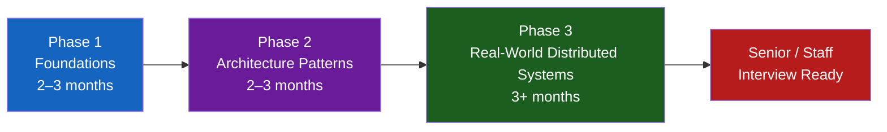
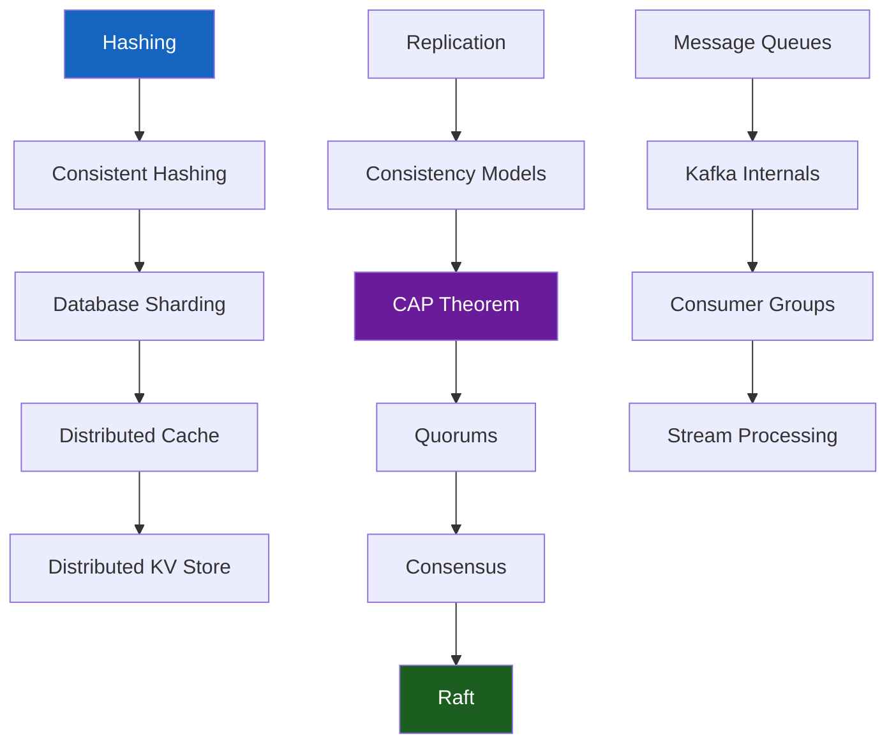

# Senior Engineer Roadmap

## The Journey

---

## Phase 1 — Foundations (2–3 months)

**Goal:** Design simple, scalable systems.

### Topics

- [x] Distributed Systems Concepts (CAP, consistency, replication)
- [x] Databases at Scale (sharding, consistent hashing, SQL vs NoSQL)
- [x] Kafka & Messaging
- [x] Networking Fundamentals (HTTP, TCP, DNS, TLS)
- [x] Caching (Redis, strategies, invalidation)
- [x] API Design (REST, gRPC, GraphQL, idempotency)
- [x] System Design Framework (requirements → estimation → API → data model → bottlenecks)

### Exit Criteria

> Can you design a URL shortener, rate limiter, or notification system with clear trade-offs?

---

## Phase 2 — Architecture Patterns (2–3 months)

**Goal:** Identify the right architectural patterns from requirements.

### Topics

- [ ] Event-Driven Architecture
- [ ] Event Sourcing & CQRS
- [ ] Saga Pattern (choreography & orchestration)
- [ ] Caching Strategies (stampede, penetration, avalanche)
- [ ] Reliability Engineering (circuit breakers, retries, bulkheads)
- [ ] API Gateway & Service Mesh
- [ ] Observability (metrics, tracing, SLI/SLO)
- [ ] Microservices vs Monolith

### Exit Criteria

> Given a set of requirements, can you identify which patterns apply and explain why?

---

## Phase 3 — Real-World Distributed Systems (3+ months)

**Goal:** Reason about complex systems, failures, and operations.

### Topics

- [ ] Raft Consensus & Leader Election
- [ ] Multi-Region Architecture & Disaster Recovery
- [ ] Tail Latency & Performance Engineering
- [ ] Production Debugging (p99, connection pools, GC, HOL blocking)
- [ ] Cost Engineering & FinOps
- [ ] AI-Native System Design
- [ ] Architecture Reviews (scalability, reliability, security, cost)
- [ ] Architecture Decision Records (ADRs)

### Exit Criteria

> Can you reason about a system's failure modes, debug production issues, and evolve architecture as scale grows?

---

## Interview Readiness by Level

=== "Senior Engineer (₹40–50 LPA)"
    - Design complete systems with clear trade-offs
    - Identify bottlenecks and scaling strategies
    - Reason about failure modes
    - DSA: medium/hard LeetCode patterns fluently
    - Behavioural: STAR stories with measurable impact

=== "Staff Engineer (₹60–80 LPA)"
    - Start from ambiguous requirements
    - Evaluate multiple architectures with constraints
    - Production debugging mindset
    - Organizational influence and cross-team design
    - DSA: pattern recognition + optimal complexity analysis

=== "Principal / Distinguished"
    - Multi-year system evolution
    - Cost, compliance, zero-downtime migration
    - Define engineering standards across teams
    - Technical strategy and roadmap

---

## Weekly Study Plan

| Week | Focus | Output |
|------|-------|--------|
| 1–2 | System Design Framework + Capacity Estimation | Design 2 simple systems |
| 3–4 | CAP, Consistency, Replication | Explain trade-offs clearly |
| 5–6 | Databases: Sharding + Consistent Hashing | Shard a write-heavy system |
| 7–8 | Kafka + Messaging Patterns | Design an event pipeline |
| 9–10 | Caching + Reliability patterns | Handle cache stampede scenarios |
| 11–12 | Design 3 exercises (URL Shortener, Rate Limiter, WhatsApp) | End-to-end designs |
| 13–16 | DSA Patterns (sliding window, DP, graphs) | Solve 30+ problems |
| 17–20 | Behavioural + System Design interview practice | Mock interviews |

---

## Knowledge Graph

