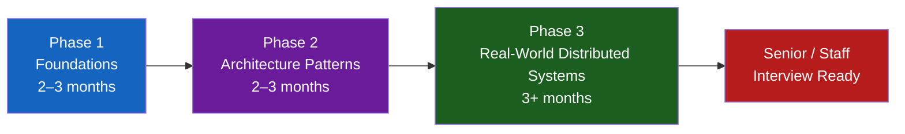
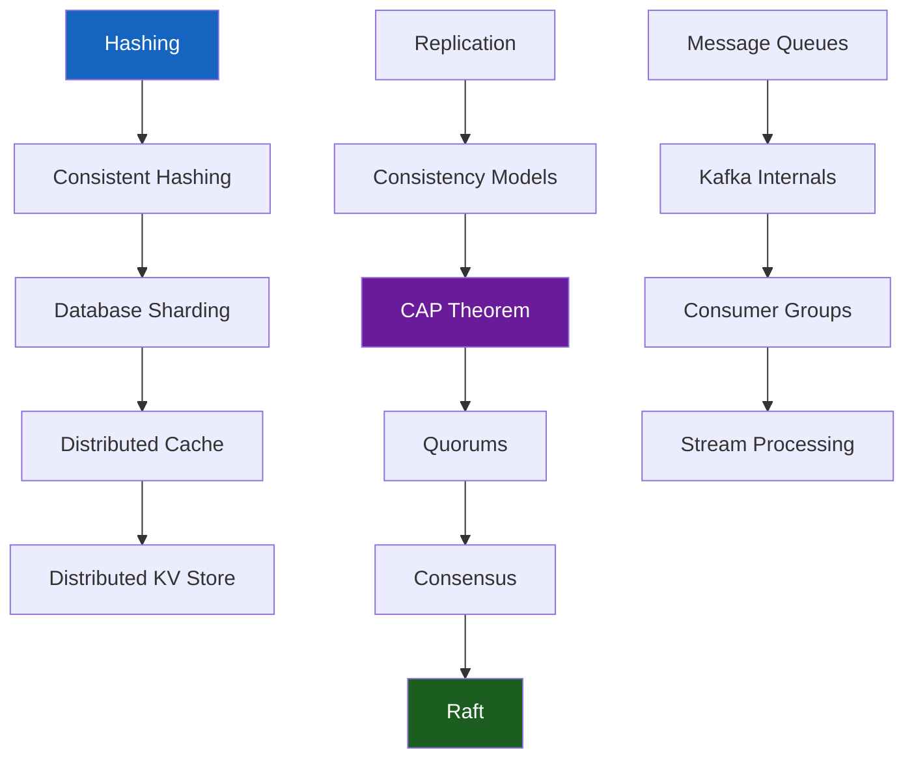

# Senior Engineer Roadmap

## Your Progress Through the Phases

Bars below reflect pages **you** have marked complete, via the **Mark this page complete** button under each page title.

!!! note "Two different things are tracked on this page"
    The bars above are **your** study progress. The `[x]` checkboxes in each phase below mark whether **the content itself** has been written yet — see [Project Status](project-status.md).

---

## The Journey

---

## Phase 1 — Foundations (2–3 months)

**Goal:** Design simple, scalable systems.

### Topics — content availability

- [x] Distributed Systems Concepts (CAP, consistency models, replication)
- [x] Databases at Scale (sharding, consistent hashing, indexing, SQL vs NoSQL)
- [x] Kafka consumer groups + broader messaging patterns (queues, pub/sub, DLQs)
- [x] Networking first slice (HTTP/TCP/DNS + load balancing sims)
- [x] Cache stampede + full cache-strategy catalog (cache-aside, write-through/behind, eviction)
- [x] API Design (REST, gRPC, GraphQL, idempotency)
- [x] System Design Framework + capacity calculator
- [x] Low-Level Design fundamentals (OOP, SOLID, design patterns, concurrency) + 15 worked exercises, Parking Lot through Task Scheduler

### Exit Criteria

> Can you design a URL shortener, rate limiter, or notification system with clear trade-offs — and, at the class level, a Parking Lot or Rate Limiter with clean OOP and correct concurrency?

---

## Phase 2 — Architecture Patterns (2–3 months)

**Goal:** Identify the right architectural patterns from requirements.

### Topics — content availability

- [x] Event-Driven Architecture
- [x] Event Sourcing & CQRS
- [x] Saga Pattern (first-release orchestrator simulator)
- [x] Distributed Transactions (2PC/3PC/TCC/XA) — `architecture-patterns/distributed-transactions.md`
- [x] API Architectural Styles (REST/GraphQL/gRPC/SOAP/Webhooks) — `architecture-patterns/api-architectural-styles.md`
- [x] Cache stampede + cache-strategy catalog (cache-aside/read-through/write-through/write-behind/write-around/refresh-ahead)
- [x] Circuit breaker + retry storm + failure-mode library (cascading failures, resource exhaustion, split brain)
- [x] API Gateway & Service Mesh — Modern Protocols & Service Mesh shipped; API Gateway pattern now covered in `foundations/api-design.md`, exercise-format deep dive in `system-design-exercises/api-gateway.md`
- [x] Observability (metrics, tracing, SLI/SLO) — debugging playbook + production reliability practices (chaos engineering, load testing, postmortems) shipped
- [x] Microservices vs Monolith

### Exit Criteria

> Given a set of requirements, can you identify which patterns apply and explain why?

---

## Phase 3 — Real-World Distributed Systems (3+ months)

**Goal:** Reason about complex systems, failures, and operations.

### Topics — content availability

- [x] Raft consensus & leader election (simulator)
- [x] Multi-Region Architecture & Disaster Recovery — including hybrid cloud↔datacenter failover
- [x] Tail latency (simulator + debugging playbook)
- [x] Production debugging (high p99, Kafka lag)
- [x] Cost Engineering & FinOps
- [ ] AI-Native System Design — model serving shipped; RAG/vector DBs/agents deliberately out of scope, see `ai-native/index.md`
- [x] Architecture Reviews (scalability, reliability, security, cost)
- [x] Architecture Decision Records (ADRs)

### Exit Criteria

> Can you reason about a system's failure modes, debug production issues, and evolve architecture as scale grows?

---

## Interview Readiness by Level

=== "Senior Engineer (₹40–50 LPA)"
    - Design complete systems with clear trade-offs
    - Identify bottlenecks and scaling strategies
    - Reason about failure modes
    - LLD: model a Parking Lot, ATM, or LRU Cache with correct OOP and thread safety
    - DSA: medium/hard LeetCode patterns fluently
    - Behavioural: STAR stories with measurable impact

=== "Staff Engineer (₹60–80 LPA)"
    - Start from ambiguous requirements
    - Evaluate multiple architectures with constraints
    - Production debugging mindset
    - Organizational influence and cross-team design
    - LLD: justify pattern choices under follow-up pressure (why Strategy not Factory, why per-spot not global locking)
    - DSA: pattern recognition + optimal complexity analysis

=== "Principal / Distinguished"
    - Multi-year system evolution
    - Cost, compliance, zero-downtime migration
    - Define engineering standards across teams
    - Technical strategy and roadmap

---

## Weekly Study Plan

Previously a 20-week outline that only covered a slice of Phase 1 — it never reached Phase 2, Phase 3, or LLD. This version spans all three phases end to end, at a pace consistent with each phase's stated duration above.

!!! note "Start DSA in parallel from week 1"
    Weeks 29–32 are for volume and fluency, not first contact. Interview loops mix LeetCode with design from day one — practice sliding window, BFS, and DP alongside Phase 1 instead of parking all DSA until Phase 3.

**Phase 1 — Foundations (weeks 1–12, ~3 months)**

| Week | Focus | Output |
|------|-------|--------|
| 1–2 | System Design Framework + Capacity Estimation | Design 2 simple systems |
| 3–4 | CAP, Consistency, Replication | Explain trade-offs clearly |
| 5–6 | Databases: Sharding + Consistent Hashing | Shard a write-heavy system |
| 7–8 | Kafka + Messaging Patterns | Design an event pipeline |
| 9–10 | Caching + Reliability patterns | Handle cache stampede scenarios |
| 11–12 | Design 3 exercises (URL Shortener, Rate Limiter, WhatsApp) | End-to-end designs |

**Phase 2 — Architecture Patterns (weeks 13–24, ~3 months)**

| Week | Focus | Output |
|------|-------|--------|
| 13–14 | Event-Driven Architecture + Event Sourcing/CQRS | Design an event-sourced order pipeline |
| 15–16 | Saga Pattern + Circuit Breakers/failure-mode library | Handle a cascading-failure scenario |
| 17–18 | API Gateway, Service Mesh, Observability | Instrument a design with SLIs/SLOs |
| 19–20 | LLD fundamentals (OOP, SOLID, patterns, concurrency) | Read all 4 concept pages before touching an exercise |
| 21–22 | LLD Beginner + Intermediate (Parking Lot → Car Rental) | Solve 9 exercises unaided, then compare |
| 23–24 | LLD Advanced (LRU Cache → Task Scheduler) | Solve remaining 6 exercises unaided, then compare |

**Phase 3 — Real-World Distributed Systems (weeks 25–36+, 3+ months)**

| Week | Focus | Output |
|------|-------|--------|
| 25–26 | Raft consensus + leader election | Trace a leader-election failure scenario |
| 27–28 | Tail latency + production debugging (p99, Kafka lag) | Debug a synthetic high-latency incident |
| 29–32 | DSA Patterns (sliding window, DP, graphs, backtracking, tries) | Solve 40+ problems across patterns |
| 33–34 | Behavioural interview practice | 5+ mock interviews with STAR stories |
| 35–36+ | Full mock loop: system design + LLD + DSA + behavioural | Simulate the actual interview day |

---

## Knowledge Graph

