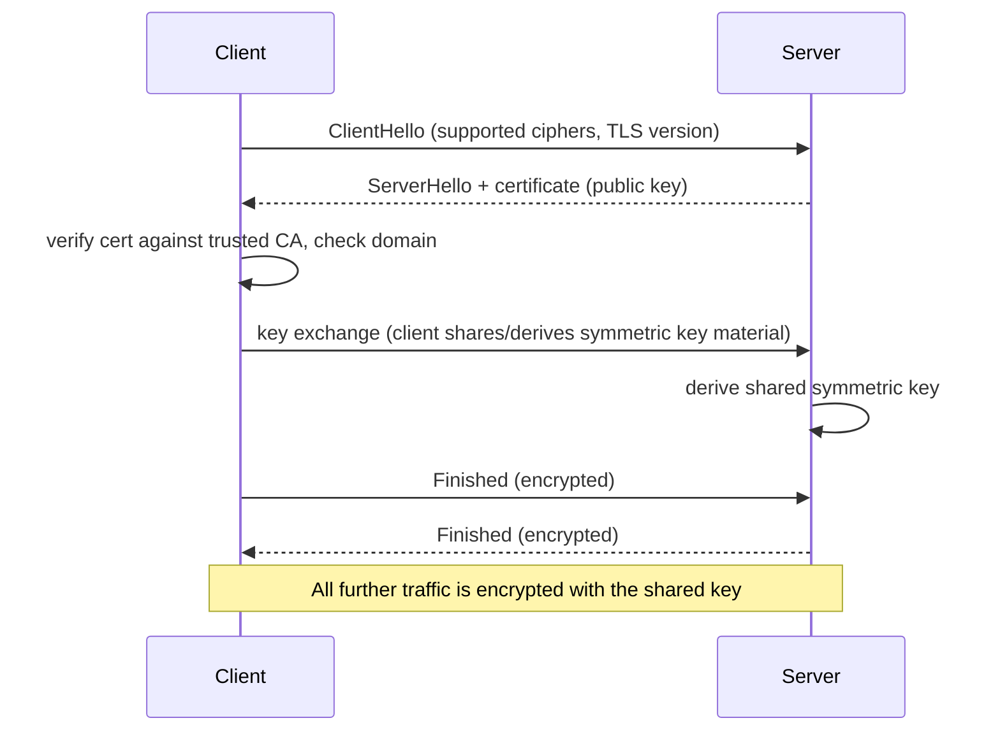
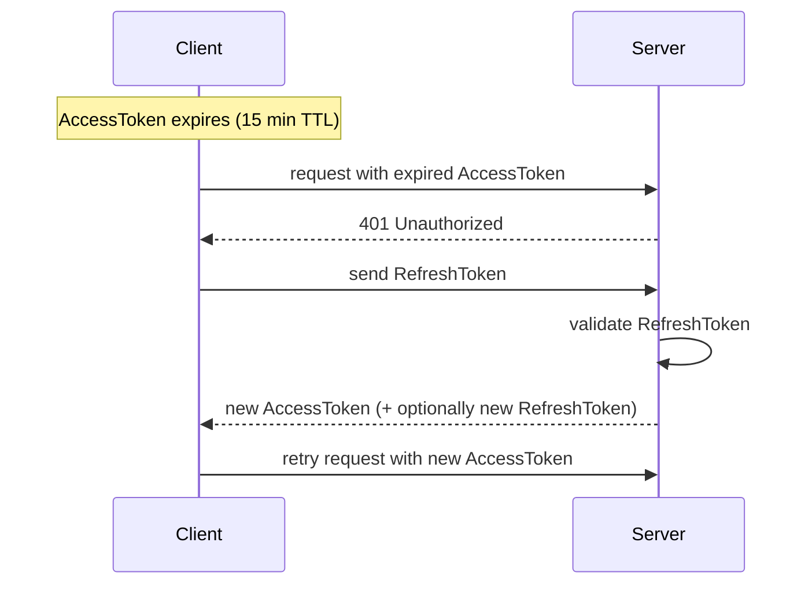
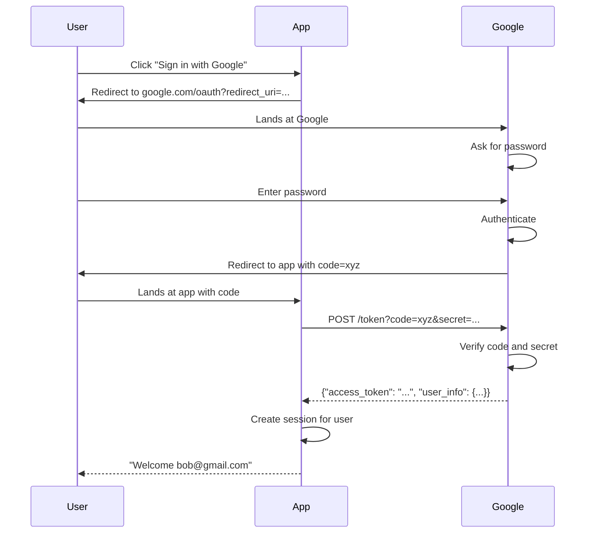

# Authentication & Authorization Fundamentals

**Prerequisites:** none (foundational)

[← Security](index.md)

---

## Why This Exists

Two problems:
1. **Authentication:** How do I know you are who you claim to be?
2. **Authorization:** Now that I know who you are, what are you allowed to do?

Get either wrong, and users see each other's data or transactions.

---

## The Model: AuthN → AuthZ

```
User: "I am alice@example.com"
       ↓
System: "Prove it" (ask for password, TOTP, etc.)
       ↓ [Authentication]
System: "OK, you are alice. Now, what do you want?"
       ↓
User: "GET /accounts/alice/balance"
       ↓
System: "Is alice allowed to read alice's balance?" (check permissions)
       ↓ [Authorization]
System: "Yes. Here's the balance."
```

---

## TLS: Encrypting the Wire

**Problem:** An attacker on the network reads your password in plain text.

**Solution:** Encrypt the connection with TLS (Transport Layer Security).

### How TLS Works (Simplified)



```
1. Client connects to server
   Client: "Hi, I want to talk securely"
   Server: "Here's my public key" [certificate]
   
2. Client verifies certificate
   Client checks: "Is this certificate signed by a trusted CA?"
   Client checks: "Does the domain match?"
   
3. Client and server agree on an encryption key
   (TLS 1.3 uses ECDHE: both sides contribute ephemeral key material.
    The certificate authenticates the server; it is not RSA key-transport of the session key.)
   
4. All traffic is now encrypted
   Client → Server: [encrypted]
   Server → Client: [encrypted]
   Attacker on the network sees only gibberish
```

### Why Certificates Matter

A certificate says: "I am example.com" and is signed by a trusted Certificate Authority (CA).

```
Certificate:
  Domain: example.com
  Public Key: [long hex string]
  Signed by: DigiCert (a trusted CA)
  Signature: [CA's digital signature]
  Expires: 2026-01-01

Attacker creates a fake certificate:
  Domain: example.com
  Public Key: [attacker's key]
  Signed by: Nobody
  
Browser checks: "Is this signed by a trusted CA?"
Browser: "No signature from DigiCert. Reject it."
Connection fails.
```

### Common TLS Mistakes (Interviews)

```python
# ✗ Bad: Accept self-signed certificates in production
requests.get(
    "https://api.example.com",
    verify=False  # NEVER in production
)

# ✓ Good: Verify certificate
requests.get(
    "https://api.example.com",
    verify=True  # Default; checks certificate validity
)

# ✗ Bad: Hardcode bypass for testing
if environment == "prod":
    verify = True
else:
    verify = False

# ✓ Good: Always verify; use a test CA for testing
verify = True  # Always
```

---

## Encryption at Rest: Protecting Stored Data

**Problem:** An attacker gains physical access to the hard drive or database backups.

**Solution:** Encrypt data before storing it.

### Symmetric Encryption (Fast, Same Key)

```python
# AES-256-GCM: Industry standard
key = secrets.token_bytes(32)  # 256 bits
plaintext = "alice's credit card: 4111-1111-1111-1111"

cipher = AES.new(key, AES.MODE_GCM)
ciphertext, tag = cipher.encrypt_and_digest(plaintext.encode())

# To decrypt later:
cipher = AES.new(key, AES.MODE_GCM, nonce=cipher.nonce)
plaintext = cipher.decrypt_and_verify(ciphertext, tag)
```

The key question: **Where do you store the key?**

- ✗ Hardcoded in code → attacker reads source
- ✗ In the same database → useless (if someone has the DB, they have the key)
- ✓ In a secrets manager (HashiCorp Vault, AWS Secrets Manager, Google Secret Manager)
- ✓ Rotated regularly → old keys still decrypt old data, but new data uses new keys

### Asymmetric Encryption (Slow, Different Keys)

```
Alice has: Public Key (share with anyone), Private Key (keep secret)

Alice publishes her public key.
Bob wants to send alice a secret.
Bob encrypts with alice's public key.
Only Alice (with the private key) can decrypt.

Alice can sign messages with her private key.
Anyone can verify the signature with her public key.
Proof: "only Alice could have signed this"
```

Typical **JWTs are signed, not encrypted** (JWS: HS256 symmetric HMAC, or RS256/ES256 with a private key). Signing proves authenticity and integrity; anyone can still *read* the payload. Encrypting a JWT is a different spec (JWE) and is uncommon for access tokens. Do not file "JWT" under asymmetric encryption — RS256 is asymmetric **signing**.

---

## JWT: Signed Tokens That Clients Carry

**JWT = JSON Web Token**

A JWT is a digitally signed JSON object. The signature proves it was issued by the server and hasn't been tampered with.

### Structure

```
JWT = Header.Payload.Signature

Header:     {"alg": "HS256", "typ": "JWT"}
Payload:    {"user_id": 42, "email": "alice@example.com", "exp": 1700000000}
Signature:  [computed from header + payload + secret key]

Full JWT:   eyJhbGciOiJIUzI1NiIsInR5cCI6IkpXVCJ9...
```

### Why It's Clever

```
Server issues JWT:
  Token = sign({"user_id": 42}, secret_key)
  Send to client
  
Client keeps the token and sends it on every request:
  GET /api/profile
  Header: Authorization: Bearer [JWT]
  
Server receives request:
  Verify signature: sig == sign({"user_id": 42}, secret_key)?
  If valid: "This token is real and hasn't been forged"
  If invalid: "Reject it"

Benefit: Server doesn't need to store a session table.
Cost: The server can't revoke tokens until they expire.
```

### JWT Expiration (The Hard Part)

```python
import jwt
import time

# Create token
payload = {
    "user_id": 42,
    "email": "alice@example.com",
    "exp": time.time() + 3600,  # Expires in 1 hour
    "iat": time.time(),  # Issued at
}
token = jwt.encode(payload, "secret", algorithm="HS256")

# Verify token
try:
    decoded = jwt.decode(token, "secret", algorithms=["HS256"])
    # Token is valid and not expired
except jwt.ExpiredSignatureError:
    # Token expired
    return Response(status=401)  # client must re-authenticate
except jwt.InvalidSignatureError:
    # Token was tampered with
    return Response(status=401)  # reject it
```

**The tradeoff:** 
- Short expiration (15 min) → must re-authenticate often
- Long expiration (1 week) → if token is stolen, attacker has a week to use it

**Solution:** Use refresh tokens:



```
AccessToken (15 min): Short-lived, carries user_id
RefreshToken (7 days): Longer-lived, stored securely, only used to get new AccessToken

If AccessToken expires:
  Client sends RefreshToken
  Server validates it and issues a new AccessToken
  
If RefreshToken is stolen:
  Attacker MINTS new access tokens until rotation, reuse-detection, or revocation
  stops them. They do *not* need the current AccessToken — the refresh is how
  they get one. Short access TTL only bounds each stolen access token.
```

**Going deeper:** this covers JWTs at intro depth — enough to reason about expiration and refresh tokens. It doesn't cover cookie security attributes, session fixation/hijacking, sliding vs. absolute expiration, or the full "why can't you revoke a JWT" trade-off against server-side sessions. See [Session Management Deep Dive](session-management.md) for that.

---

## OAuth2: The "Sign In With" Protocol

**Problem:** You don't want to store passwords. You want to let Google / GitHub / Apple sign users in.

**Solution:** OAuth2 — a protocol where a trusted provider authenticates the user for you.

### OAuth2 Flow (4 Parties, 6 Steps)

```
1. User: "I want to log in"
   App: "Click 'Sign in with Google'"

2. App redirects user to Google
   App → User → Google: "This app wants your permissions"
   Google: "What's your password?"
   User: [enters password]

3. Google authenticates user
   Google: "I verified this is bob@gmail.com"
   Google → User: [redirect to app with auth code]
   
4. App talks to Google (backend-to-backend)
   App: "Here's the auth code, give me an access token"
   (App includes its own credentials to prove it's real)
   
5. Google validates app
   Google: "This is a real app and that code is valid"
   Google → App: "Here's the access token and user info"
   
6. App creates session for user
   App: "Welcome, bob@gmail.com"
```

**Diagram:**



### Why This Is Safer Than Passwords

- ✓ Passwords never leave Google → can't be stolen from your app
- ✓ You trust Google's security, not your own
- ✓ User can revoke your app's access anytime
- ✗ If your app is hacked, attacker can't change your Google password

**Going deeper:** this is OAuth2 at intro depth — enough to explain the "Sign in with Google" flow at a high level. It skips PKCE, why two of the grant types are deprecated, what JWT validation actually requires (signature, `iss`, `aud`, `exp`, `nbf`, `nonce`), refresh token rotation, and the OAuth2/OIDC distinction. See [OAuth2 & OIDC Deep Dive](oauth2-oidc.md) for that.

---

## RBAC: Role-Based Access Control

**Problem:** "Is alice allowed to delete this order?" The answer depends on alice's role.

**Solution:** Define roles and assign permissions to roles.

```python
# Define roles
ROLES = {
    "customer": ["read_own_order", "cancel_own_order"],
    "support": ["read_any_order", "refund_order"],
    "admin": ["read_any_order", "modify_any_order", "delete_any_order"],
}

# Assign role to user
users[alice_id].role = "customer"

# Check permission
def can_delete_order(user_id, order_id):
    user = users[user_id]
    order = orders[order_id]
    
    # Is alice allowed to delete?
    if "delete_any_order" in ROLES[user.role]:
        return True
    
    # Or is this her own order?
    if "delete_own_order" in ROLES[user.role] and order.user_id == user_id:
        return True
    
    return False
```

### The Complexity: ABAC (Attribute-Based)

RBAC breaks when permissions depend on context:

```
# RBAC (simple but inflexible):
"Can alice refund orders?"
"Yes if alice is support"

# ABAC (attribute-based, complex but flexible):
"Can alice refund order 42?"
"Yes if alice.role == 'support' AND order.amount < 1000 AND order.status == 'processing'"
```

### Principle of Least Privilege

Give users the minimum permission they need:

```python
# ✗ Bad: Everyone is admin
user.role = "admin"

# ✗ Bad: Everyone is customer with wildcard permission
user.permissions = ["*"]

# ✓ Good: Customer can only read their own data
ROLES = {
    "customer": ["read_own_orders", "read_own_profile"],
}

# ✓ Good: Batch job has permission for one specific task
batch_token = issueToken(["write_s3_bucket/invoices"])
```

---

## Secrets Management: Keys, Passwords, API Keys

**Problem:** Your database password is in a config file that someone could steal.

**Solution:** Store secrets in a secrets manager, not in files or environment variables (in most cases).

### Where NOT to Store Secrets

```python
# ✗ Hardcoded
DB_PASSWORD = "mysecretpassword123"

# ✗ Environment variable (inherited by child processes; in /proc/PID/environ
#   for the same user or root — not in `ps aux`, which shows argv)
import os
DB_PASSWORD = os.getenv("DB_PASSWORD")

# ✗ Config file in the repo
# config.yaml: db_password: "mysecretpassword123"
# (and committed to git forever)
```

### How to Store Secrets

**Option 1: Secrets Manager (AWS Secrets Manager, Google Secret Manager, HashiCorp Vault)**

```python
import boto3

client = boto3.client("secretsmanager")
secret = client.get_secret_value(SecretId="db-password")
DB_PASSWORD = secret["SecretString"]
```

Benefits:
- ✓ Secrets never stored on disk
- ✓ Automatic rotation
- ✓ Audit log of who accessed the secret
- ✓ Separate access control

**Option 2: Kubernetes Secret (etcd encryption at rest)**

A normal `Secret` is not Sealed Secrets. Sealed Secrets / SOPS encrypt the *manifest* so it can sit in git; the object below is just a Secret. Enable encryption at rest in the API server if you care about etcd theft.

```yaml
# Ordinary Secret (stringData). Not a SealedSecret.
apiVersion: v1
kind: Secret
metadata:
  name: db-secret
type: Opaque
stringData:
  password: mysecretpassword123
```

### Rotation: The Part Everyone Forgets

```
Day 1: Current key = key-v1
       New key = key-v2
       
Day 2: Old data was encrypted with key-v1
       New data is encrypted with key-v2
       System can decrypt both
       
Day 7: key-v1 is deleted
       Attacker can no longer brute-force the old key
```

**Interview signal:** "When I mentioned secrets, did you automatically think 'and we rotate them'?"

---

## Common Security Mistakes (Interviews)

### 1. Storing Passwords in Plain Text

```python
# ✗ Bad
users.insert({"email": "alice@example.com", "password": "correct-horse-battery-staple"})

# ✓ Good: Use bcrypt or argon2
import bcrypt
hashed = bcrypt.hashpw("correct-horse-battery-staple".encode(), bcrypt.gensalt())
users.insert({"email": "alice@example.com", "password_hash": hashed})

# Verify:
bcrypt.checkpw("user-entered-password".encode(), stored_hash)
```

### 2. Timing Attacks on Passwords

```python
# ✗ Bad: Reveals password length via timing
if user_password == provided_password:
    return "Correct"
else:
    return "Incorrect"

# Short password: fast comparison failure (7 chars)
# Long password: slower comparison failure (50 chars)
# Attacker times the responses and guesses password length

# ✓ Good: Constant-time comparison
import hmac
if hmac.compare_digest(stored_hash, computed_hash):
    return "Correct"
else:
    return "Incorrect"
```

### 3. Tokens Without Expiration

```python
# ✗ Bad: Token never expires
token = issue_token(user_id)  # No expiration

# If token is stolen, attacker has forever

# ✓ Good: Token expires
token = issue_token(user_id, exp=time.time() + 3600)

# Attacker can use token for 1 hour, then it's worthless
```

### 4. Logging Secrets

```python
# ✗ Bad
logger.info(f"Connecting to DB with password={db_password}")

# ✓ Good
logger.info(f"Connecting to DB with user={db_user}")
# Never log passwords, API keys, tokens
```

---

## Real Production Case: Payment System Auth

**Requirements:**
- Customer logs in with email + password
- Customer can see their orders and payment history
- Customer cannot see other customers' orders
- Support staff can view any order
- PCI compliance: never see the full credit card number

**Design:**

```python
# 1. Authentication (verify who they are)
POST /auth/login
  email: alice@example.com
  password: "..."
  
  → Verify password against bcrypt hash
  → Issue JWT with user_id and role
  → Return: {"access_token": "jwt...", "expires_in": 3600}

# 2. Authorization (check what they can do)
GET /orders?user_id=42
  Header: Authorization: Bearer [JWT]
  
  → Verify JWT signature and expiration
  → Decode: user_id = 42, role = "customer"
  → Check: "Can user 42 read orders for user 42?"
  → If role == "customer": only return user's own orders
  → If role == "support": return any orders (with audit log)
  
  → Return: [{order_id: 1, total: 99.99, status: "delivered"}, ...]

# 3. Data Protection
GET /orders/42/payment-method
  → Return only last 4 digits: "****-****-****-1111"
  → Never return full card number (even internally log it truncated)
```

---

## Interview Questions

=== "Foundation"
    **Q: What's the difference between authentication and authorization?**
    
    "Authentication is proving who you are (password, OAuth2, etc.). Authorization is checking what you're allowed to do (permissions, roles). You need both: authentication tells you 'this is alice,' then authorization checks 'is alice allowed to see this order?'"

=== "Senior"
    **Q: A user reported their payment history is visible to other users. Walk me through the diagnosis.**
    
    "First, confirm the bug: can I reproduce it? Likely authorization issue. I'd check: is the order list query filtered by user_id? `SELECT * FROM orders WHERE user_id = current_user_id`? Or is it returning all orders? If the JWT is decoded correctly but the filtering is wrong, that's a data leak. I'd check: does JWT carry the user_id? Is the query using it? Are there any admin_mode flags that might bypass the filter? I'd check the access logs to see if this was one user or a widespread issue. Then I'd run tests to ensure the fix (adding the user_id filter) works and doesn't break support staff viewing."

=== "Staff"
    **Q: Design auth for a system where users must access different data based on their organization, and must rotate credentials regularly.**
    
    "I'd use OAuth2 for the initial sign-in (leveraging Google/company IdP) and issue short-lived JWTs. The JWT carries user_id, org_id, and roles. Every query includes org_id as a parameter (or inferred from the JWT). Database has a column org_id on every sensitive table, and queries always filter by org_id. For credential rotation, I'd implement refresh tokens with a max age (7 days) and require periodic re-authentication for sensitive actions (payments, settings changes). I'd also add audit logging: who accessed what, when, from where. The audit table itself is sensitive — support can't see other orgs' audit logs either."

---

## Key Takeaways

!!! success "Remember"
    1. **TLS encrypts the wire** — prevents password theft on the network
    2. **Encryption at rest protects stored data** — but the key must be stored securely
    3. **JWT is a signed token** — the signature proves authenticity, but the token can be forged if the key is weak
    4. **OAuth2 lets you delegate authentication** — users never give you their passwords
    5. **RBAC assigns permissions by role; ABAC is context-aware** — start with RBAC; graduate to ABAC if needed
    6. **Secrets belong in a secrets manager, not in files or env vars**
    7. **Hash passwords with bcrypt/argon2; never store plain text**
    8. **Use constant-time comparison to avoid timing attacks**
    9. **Tokens must expire** — short-lived access tokens + longer-lived refresh tokens
    10. **Authorization belongs in every query** — `SELECT * FROM orders WHERE org_id = ?` (never without the filter)

**Previous:** [Security](index.md)
