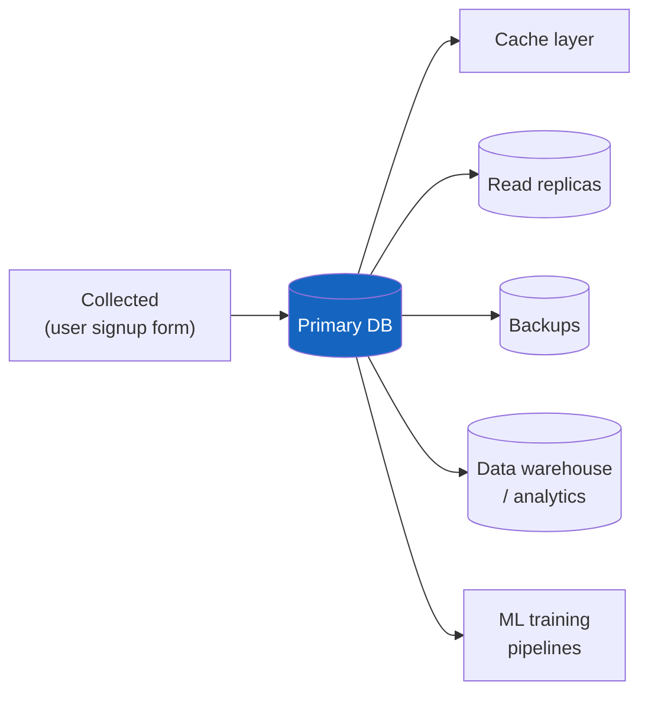

# Data Privacy & Compliance Architecture

**Prerequisites:** [Security Overview](index.md), [Threat Modeling](threat-modeling.md)

[← Security](index.md)

---

## Why This Exists

Most security content on this site is about keeping attackers out. This page is about a different problem: **the data is already inside the system, legitimately, and the question is what the system is obligated to do with it** — where it can live, who can see it, and what happens when a user asks for it to be deleted. Getting this wrong isn't a breach in the traditional sense; it's a compliance violation (GDPR, CCPA, HIPAA, or a sector-specific regulation) that can carry real fines and, worse for a systems-design conversation, **is often architecturally expensive to retrofit** — a "delete this user's data" request that has to chase copies through twelve services, four caches, and a data warehouse is a design failure baked in months earlier when nobody asked "where does this field end up."

The interview signal here isn't "do you know GDPR" — it's whether you treat data privacy as a **first-class architectural constraint, decided at design time**, the same way you'd decide a consistency model, rather than a legal-team checkbox applied after the system is built.

---

## Mental Model: Data Has a Lifecycle, Not Just a Location

Every piece of personal data a system touches goes through: **collected → stored → replicated (caches, backups, read replicas, warehouses) → processed (analytics, ML training) → eventually deleted or retained past its useful life.** A compliance architecture has to answer the question at *every stage*, not just at the database — a field that's correctly access-controlled in the primary database but freely copied into an analytics warehouse with no equivalent controls has not actually been protected, it's been protected in exactly one of its five locations.

A "delete my data" request has to reach every one of those boxes, not just the primary database — this diagram is the actual scope of a right-to-erasure request, and most of the boxes past the primary DB are the ones teams forget until an audit or a real request surfaces the gap.

---

## PII Classification: Not All Fields Are Equal

The first architectural decision is classifying data by sensitivity, because uniform treatment ("encrypt everything the same way, log access to everything the same way") is both wasteful and imprecise — it under-protects the highest-risk fields while adding friction to fields that don't need it.

| Class | Examples | Typical requirement |
|---|---|---|
| **Direct identifier** | Name, email, government ID, phone number | Encryption at rest, access logging, subject to erasure requests |
| **Sensitive/special category** | Health data, biometric data, precise location, financial account numbers | Everything direct identifiers require, plus often stricter access controls, separate storage, and explicit consent tracking |
| **Indirect identifier (quasi-identifier)** | ZIP code + birth date + gender (can re-identify someone combined with other data) | Often needs aggregation or generalization before analytics use — the risk is in combination, not any single field |
| **Non-personal / aggregate** | Daily active user counts, anonymized event totals | No special handling — the point of anonymization is exactly to move data out of the regulated categories |

**A field's classification should be decided once, tagged in the schema (a column comment, a data catalog entry), and propagated — not re-derived by every team that touches a copy of the data.** This is the same discipline as [threat modeling](threat-modeling.md)'s trust boundaries applied to data sensitivity instead of network trust.

---

## Data Residency

Some regulations (GDPR for EU citizens' data, various national data-localization laws) require that certain data physically stay within a jurisdiction's borders — not just that access is controlled, but that the *bytes never leave*. This is a harder constraint than access control because it shapes infrastructure topology directly:

- A global user base with per-region residency requirements typically means **per-region data stores**, not a single global database with regional access control — the constraint is about physical location, not permission.
- This interacts directly with [multi-region architecture](../distributed-systems/multi-region-dr.md): a DR replica in a different jurisdiction than the primary can itself be a compliance violation if it holds regulated data — "we replicate everything to our US DR region" is a real design decision that can conflict with "EU user data must stay in the EU," and the two have to be reconciled explicitly, not discovered during an audit.
- Metadata and derived data (an aggregate count, a hashed identifier) often has a different residency requirement than the raw data it's derived from — worth checking, not assuming the strictest rule applies uniformly.

---

## Right-to-Erasure as a Systems Problem

"Delete my data" (GDPR's Right to Erasure, CCPA's Right to Delete) sounds like a single `DELETE` statement and is almost never that simple in a real distributed system:

- **Replicated copies** — every read replica, every cache entry, every backup that contains the record needs to eventually reflect the deletion. Backups specifically are hard: you generally can't selectively edit an immutable backup, so the common pattern is either encrypting per-user data with a key that gets destroyed (crypto-shredding — deleting the key makes the backup's copy unrecoverable without needing to touch the backup itself) or accepting a bounded retention window after which old backups age out naturally.
- **Downstream systems** — anything that ingested the data (an analytics warehouse, an ML training set, a third-party integration the data was shared with) is now also in scope, and the original system's team frequently doesn't have visibility into every downstream consumer unless data lineage was tracked from the start.
- **Event-sourced systems** — see [Event Sourcing & CQRS](../architecture-patterns/event-sourcing-cqrs.md) — have a structural tension with erasure: the whole point of an event log is immutability, but erasure requires removing specific data. The common resolution is storing the erasable PII *outside* the event log (a reference/lookup table that can actually be deleted) and keeping the event log free of raw PII, referencing it by ID instead.
- **A realistic SLA** — "fully propagated within 30 days" is a defensible target for most systems; "instantly, everywhere, including cold backups" usually isn't technically achievable without crypto-shredding, and claiming it without that mechanism in place is a compliance risk of its own (promising something the architecture can't deliver).

---

## Encryption: At Rest and In Transit

- **In transit:** TLS between every network hop that could otherwise expose data on the wire — not just the public-facing edge. A common gap: TLS terminates at the load balancer, and internal service-to-service traffic inside the VPC runs unencrypted on the (correct but incomplete) assumption that the VPC boundary is sufficient — [zero trust architecture](zero-trust-architecture.md) is the deeper treatment of why "inside the network" isn't automatically trusted.
- **At rest:** database-level or disk-level encryption is standard and usually cheap (most managed databases offer it as a flag, not a redesign) — the harder decision is *field-level* encryption for the highest-sensitivity data, where even someone with raw database access shouldn't see plaintext. Field-level encryption trades query flexibility for that stronger guarantee — you generally can't index or `WHERE`-filter on an encrypted field the same way, which shapes schema design around it.
- **Key management** is the part that actually determines whether encryption means anything: if the encryption key lives next to the encrypted data with the same access control, encryption adds compliance-checkbox value but little real protection against the access patterns that actually cause incidents (a compromised application credential that can read both). A separate key management service (KMS) with its own access control and audit log is what makes "encrypted at rest" a real statement rather than a formality.

---

## Interview Questions

=== "Foundation"
    **Q: What's the difference between encryption at rest and encryption in transit, and do you need both?**

    "In transit protects data while it's moving across a network — TLS between a client and server, or between two internal services. At rest protects data while it's sitting in storage — a database, a disk, a backup. They protect against different things: in-transit encryption doesn't help if someone gets direct access to the database file, and at-rest encryption doesn't help if traffic between services is sniffable on the network. You need both, and a common real gap is TLS at the public edge but unencrypted internal service-to-service traffic, on the assumption the internal network is safe — which zero trust architecture treats as a bad assumption."

=== "Senior"
    **Q: Product wants to add a 'right to delete my account' feature. What's actually involved beyond deleting the database row?**

    "The database row is the easy part. I'd map every place that data actually lives — read replicas, caches, backups, any data warehouse or analytics pipeline it's been copied into, and any third-party service it was shared with. Replicas and caches usually catch up on their own once the primary is deleted, but backups are the hard case — you generally can't selectively edit an immutable backup, so I'd look at crypto-shredding (encrypt per-user data with a destroyable key, so deleting the key makes old backups' copies unrecoverable) rather than promising instant deletion everywhere, which usually isn't achievable without that mechanism. And if there's an event-sourced system in the pipeline, I'd flag that raw PII in an immutable event log is a structural conflict with erasure — the PII needs to live in a separate, actually-deletable store, referenced by ID from the log."

=== "Staff"
    **Q: The company is expanding into the EU and needs GDPR-compliant data residency, but the current architecture is a single global database with one primary region. How do you approach this?**

    "First I'd separate two different constraints that get conflated: access control (who can see the data) and residency (where the bytes physically live) — GDPR residency requirements are about the latter, and access control alone doesn't satisfy it no matter how well implemented. That means the real answer is likely per-region data stores for EU user data, not a global database with row-level EU flags, because the constraint is about the storage location itself.

    I'd scope this as a genuine architecture change, not a patch: which data actually needs residency (probably not all of it — aggregate metrics likely don't), how the application layer routes reads/writes to the correct regional store based on user residency, and critically, how this interacts with any existing DR strategy — if the current DR replica for EU data sits in a US region, that's a second compliance conflict that has to be resolved as part of the same effort, not discovered separately later. I'd also push to get data classification and residency requirements formalized and tagged at the schema level as part of this work, specifically so the *next* region expansion doesn't require rediscovering the same scope from scratch."

---

## Key Takeaways

!!! success "Remember"
    1. **Data privacy is an architectural constraint decided at design time, not a legal-team checkbox applied after the system is built** — retrofitting it (especially erasure) is expensive because data has already spread to caches, replicas, backups, and warehouses.
    2. **Classify data by sensitivity once, at the schema level, and propagate the classification** — uniform treatment of all fields is both wasteful and imprecise.
    3. **Data residency is about physical location, not access control** — it usually forces per-region data stores, and it can directly conflict with a DR strategy that replicates across jurisdictions.
    4. **Right-to-erasure is a distributed-systems problem** — replicas, caches, backups (via crypto-shredding), and downstream/event-sourced systems are all in scope, not just the primary database row.
    5. **Encryption only means something if key management is separate from the data it protects** — same-access-control key-and-data is a compliance formality, not real protection.

**Back to:** [Security](index.md)
