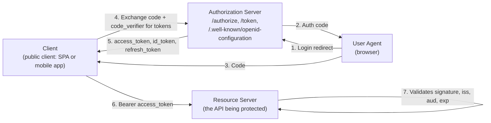
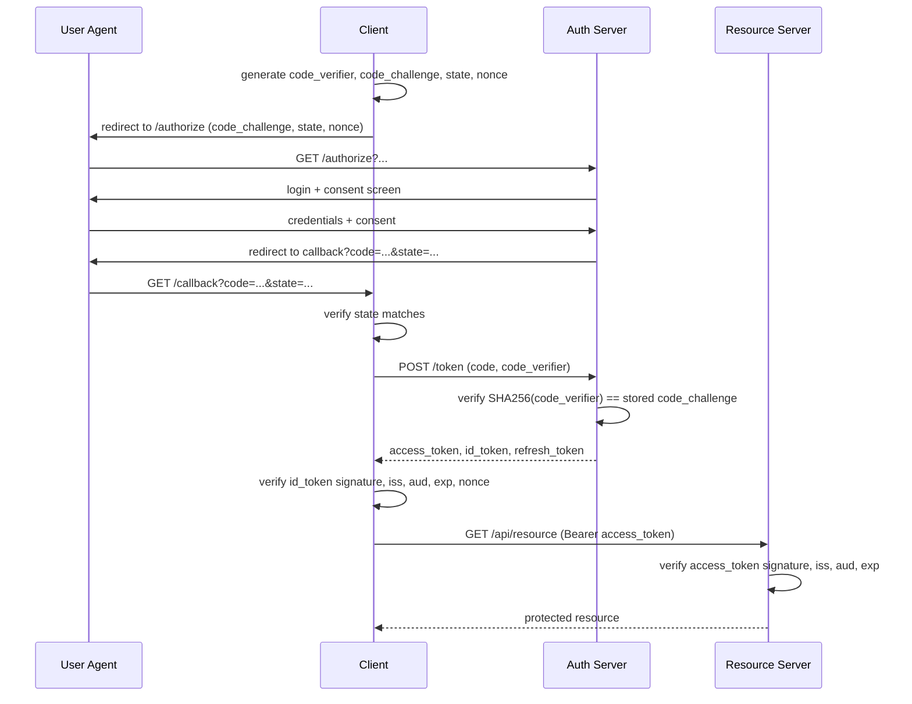

# OAuth2 & OIDC Deep Dive

**Prerequisites:** [Authentication & Authorization Fundamentals](authentication-authorization.md)

[← Security](index.md)

---

## Why This Exists

[Authentication & Authorization Fundamentals](authentication-authorization.md#oauth2-the-sign-in-with-protocol) covers OAuth2 at intro depth: click "Sign in with Google," get redirected, come back with a token. That's enough to pass a foundation-level question. It is not enough to design or debug a real integration, because the intro version skips exactly the parts that break in production:

- Which of OAuth2's five-ish grant types should you actually use, and why are two of them dead?
- What is PKCE, and why did it move from "mobile app nice-to-have" to "required for every public client"?
- What's inside a JWT access token, and what specifically has to be checked before you trust it?
- How do you revoke a token, and why is that harder than it sounds?
- What's the difference between OAuth2 and OIDC — isn't OAuth2 already "login with X"?

**The one-sentence distinction that resolves most confusion:** OAuth2 is an **authorization** protocol — it answers "can this app act on my behalf against this API?" It was never designed to answer "who is this user?" OpenID Connect (OIDC) is a thin identity layer bolted on top of OAuth2 that adds a standardized answer to that second question: the **ID token**.

```
OAuth2 alone:  App gets an access_token → can call Google's API as the user
               But the app never gets a verified, structured claim of
               *who* the user is — it has to infer it by calling an API
               (e.g. /userinfo) and hoping that endpoint isn't spoofed.

OIDC:          App gets an access_token AND an id_token (a JWT).
               The id_token is a signed, verifiable assertion:
               "This person authenticated at 14:02:03, their subject
               ID is 8f3a..., issued by accounts.google.com, for this
               client_id, expiring at 15:02:03."
```

Every "Sign in with Google/GitHub/Microsoft" button you've used is OIDC, not bare OAuth2 — even though everyone calls it "OAuth login."

---

## Mental Model: The Valet Key

A valet key starts your car, but it won't open the trunk or the glovebox. You hand it to a stranger without handing over your house keys, your car's title, or unlimited access.

```
Full car key (your password)   → total access, forever, to everything
Valet key (OAuth2 access token) → limited access (drive only), for a
                                   limited time, revocable, to one "car"
                                   (one API's scopes)

Valet's ID badge (OIDC id_token) → separately proves who the valet *is*,
                                    so the garage can log "this specific
                                    person parked this car at 2pm"
```

The access token is the valet key: it grants a scoped, revocable capability. The ID token is a separate, signed statement of identity — it doesn't grant any access to anything; it just answers "who authenticated." Conflating the two (using an access token as proof of identity, or an ID token to call an API) is the single most common OAuth2/OIDC implementation bug.

---

## Architecture



Four roles, always: **Resource Owner** (the user), **Client** (your app — public if it can't keep a secret, like a SPA or mobile app; confidential if it can, like a backend server), **Authorization Server** (issues tokens — Auth0, Okta, Google, your own Keycloak), **Resource Server** (the API that accepts the token).

---

## How It Works Internally

### The Grant Types, and Which One to Actually Use

```
Authorization Code + PKCE   ✓ Use this for ANY user-facing app —
                               web, SPA, mobile, native. No exceptions
                               in 2026.

Client Credentials          ✓ Use this for machine-to-machine (M2M):
                               a backend service calling another
                               service, no user involved.

Device Code                 ✓ Use this for input-constrained devices:
                               smart TVs, CLI tools — user authorizes
                               on a *second* device (phone/laptop).

Implicit                    ✗ Deprecated. Returned the access_token
                               directly in the URL fragment, no code
                               exchange. Token ends up in browser
                               history, referrer headers, server logs.
                               PKCE + Auth Code replaces it entirely,
                               even for SPAs.

Resource Owner Password     ✗ Deprecated. The app collects the user's
                               password directly and trades it for a
                               token. Defeats the entire point of
                               OAuth2 (never handling the password) —
                               only ever excusable for a legacy first-
                               party migration path, never third-party.
```

### Authorization Code + PKCE, Step by Step

PKCE (Proof Key for Code Exchange, pronounced "pixy") exists to close one specific hole: a **public client** (SPA, mobile app) cannot hold a `client_secret` — it ships in the browser or the APK, so any secret embedded in it is not a secret. Without PKCE, anyone who intercepts the authorization code (a malicious app registering the same custom URL scheme, a compromised network) can trade that code for tokens themselves, no secret required. PKCE fixes this by binding the code to a one-time secret only the legitimate client instance knows.

```
1. Client generates a random `code_verifier` (43–128 char random string)
   code_verifier = "dBjftJeZ4CVP-mB92K27uhbUJU1p1r_wW1gFWFOEjXk"

2. Client derives `code_challenge = BASE64URL(SHA256(code_verifier))`
   (S256 method — plain method exists but skip it, defeats the purpose)

3. Client redirects the user to the Authorization Server:
   GET /authorize?
       response_type=code
       &client_id=abc123
       &redirect_uri=https://app.com/callback
       &scope=openid profile email
       &state=xyz789          ← CSRF defense, see Failure Modes
       &code_challenge=E9Melhoa2OwvFrEMTJguCHaoeK1t8URWbuGJSstw-cM
       &code_challenge_method=S256
       &nonce=n-0S6_WzA2Mj    ← OIDC replay defense, bound into id_token

4. User authenticates at the Authorization Server (password, MFA, etc.)
   and consents to the requested scopes.

5. Authorization Server redirects back with a one-time code:
   GET https://app.com/callback?code=SplxlOBeZQQYbYS6WxSbIA&state=xyz789

6. Client verifies `state` matches what it sent in step 3.

7. Client exchanges the code for tokens — this call includes the
   ORIGINAL code_verifier (never sent before now):
   POST /token
       grant_type=authorization_code
       &code=SplxlOBeZQQYbYS6WxSbIA
       &redirect_uri=https://app.com/callback
       &client_id=abc123
       &code_verifier=dBjftJeZ4CVP-mB92K27uhbUJU1p1r_wW1gFWFOEjXk

8. Authorization Server recomputes SHA256(code_verifier), compares to
   the code_challenge stored against that code. Match → issue tokens.
   Mismatch → reject. An attacker who only intercepted the code (step 5)
   never saw the code_verifier and cannot complete this exchange.
```

### Sequence Diagram: Authorization Code + PKCE



### Token Types

```
access_token    Grants API access. Opaque string OR JWT (both valid).
                Short-lived (minutes to ~1 hour). Sent as
                `Authorization: Bearer <token>`. Scoped ("read:orders").

refresh_token   Long-lived (days to weeks). Used ONLY to get a new
                access_token, never sent to a resource server. Stored
                server-side or in a secure, non-JS-accessible location.

id_token        OIDC only. Always a JWT. Proves identity, not access.
                Never send it to a resource server as a bearer token —
                it's not scoped for API access and mixing the two is
                a classic confused-deputy bug.
```

### JWT Structure and What Validation Actually Means

A JWT access/ID token is `base64url(header).base64url(payload).base64url(signature)`. Anyone can *decode* it — it's not encrypted, just signed. "Validating" a JWT means checking six things, and skipping any one of them is a real vulnerability class:

```
1. Signature   — verify against the Authorization Server's public key
                  (fetched from the JWKS endpoint, cached, rotated).
                  Proves the token wasn't forged or altered.

2. iss (issuer) — does it match the expected Authorization Server?
                  Prevents a token from a different, untrusted issuer
                  being accepted (confused deputy).

3. aud (audience) — does it match THIS resource server's identifier?
                  Prevents a token issued for Service A being replayed
                  against Service B — critical when one Authorization
                  Server issues tokens for many APIs.

4. exp (expiry) — is it in the past? Reject if expired. Allow a small
                  clock-skew tolerance (30–60s), not more.

5. nonce (OIDC id_token only) — does it match the nonce the client
                  sent in the original /authorize request? Prevents
                  replay of a stolen id_token from an unrelated session.

6. nbf (not before) — is the current time before this? Reject if so.
                  Rare in practice, but a token deliberately issued
                  for future use (e.g. a scheduled credential rollout)
                  must not be accepted early.
```

```python
# Correct validation — every check is load-bearing
import jwt

decoded = jwt.decode(
    token,
    key=jwks_client.get_signing_key_from_jwt(token).key,
    algorithms=["RS256"],          # ← pin this; see alg:none below
    audience="https://api.example.com",
    issuer="https://auth.example.com/",
    options={"require": ["exp", "iss", "aud"]},
)
```

### Refresh Token Rotation and Revocation

```
Naive refresh:  same refresh_token reused indefinitely until its own
                (long) expiry. If stolen, attacker refreshes forever.

Rotation:       every refresh call issues a NEW refresh_token and
                invalidates the old one. The old one is now single-use.

Reuse detection: if a refresh_token that was already rotated-out gets
                presented again, that's a signal it was stolen (client
                and attacker both had a copy, one of them already used
                it). Authorization Server response: revoke the ENTIRE
                token family, force full re-authentication.

Revocation:     the whole reason to keep refresh tokens server-side
                and rotated — you can invalidate a compromised session
                immediately, unlike a bare access-token-only JWT setup
                where nothing can be revoked before natural expiry.
```

!!! note "DPoP: closing the bearer-token gap"
    Everything above bounds the *blast radius* of a stolen token — it doesn't stop a stolen token from working. A plain bearer access token is usable by anyone who has it, full stop, for as long as it's valid. DPoP (Demonstrating Proof-of-Possession, RFC 9449) closes that gap by binding the token to a private key the client holds: each request carries a signed proof made with that key, and the resource server rejects the token if the proof doesn't match. Steal the token alone — via a logged header, an XSS read, a leaky proxy — and it's useless without the client's private key.

---

## Realistic Example

A mobile banking app, 2M monthly active users, access tokens are JWTs (RS256, 10-minute expiry), refresh tokens rotate on every use and are stored in platform secure storage (Keychain/Keystore).

```
User opens app after 3 days away:
  - Cached access_token: expired (10 min TTL, obviously stale)
  - Cached refresh_token: still valid (14-day TTL)
  - App silently calls POST /token with grant_type=refresh_token
  - Auth server: refresh_token valid, not previously rotated-out
    → issues new access_token + new refresh_token (rotation)
    → old refresh_token marked used
  - App proceeds, user never sees a login screen

Attacker scenario: phone is jailbroken, malware exfiltrates the
refresh_token from Keychain, uses it once to mint an access_token.
  - Legitimate app later also tries to use its (now stale, because
    rotated) copy of the same refresh_token
  - Auth server sees reuse of an already-rotated token
  - Reuse-detection fires → entire token family revoked
  - Both attacker and legitimate app are forced to re-authenticate
  - Security team gets an alert: "refresh token reuse detected,
    user_id=..., possible compromise"
```

10-minute access token TTL bounds the blast radius of a stolen access token to 10 minutes of API abuse. Reuse detection bounds the blast radius of a stolen refresh token to one API call before detection, not 14 days.

---

## Failure Modes

```
Open redirect via unvalidated redirect_uri
  Auth server accepts ANY redirect_uri, or matches it loosely
  (prefix match instead of exact match). Attacker registers a client,
  sets redirect_uri to an attacker-controlled domain, tricks a user
  into an auth flow, and the authorization code (or worse, an
  implicit-flow token) lands on the attacker's server.
  Fix: exact-match allowlist of redirect_uris per registered client,
  no wildcards, no prefix matching.

CSRF via missing or predictable `state`
  Attacker starts their OWN OAuth flow, gets a valid auth code for
  their own account, then tricks the victim's browser into completing
  the callback with the attacker's code. If the client doesn't check
  `state`, it links the attacker's account to the victim's session —
  "login CSRF." Fix: state must be unguessable, tied to the user's
  browser session, and verified on callback.

Authorization code interception
  On mobile, a malicious app can register the same custom URL scheme
  and intercept the redirect carrying the code. Without PKCE, that
  code can be exchanged for tokens by the malicious app. PKCE makes
  the intercepted code alone useless — the code_verifier never
  crosses the network until the legitimate client's token exchange.

alg:none / algorithm confusion JWT attack
  A JWT's header declares its own signing algorithm. A naive verifier
  that trusts the header will accept a token with `"alg":"none"` (no
  signature required) or will accept an RS256-signed token verified
  as HS256 using the RSA public key as an HMAC secret (both are
  public knowledge). Fix: server pins the expected algorithm(s)
  explicitly in code — never derive the algorithm from the token
  itself.

Confused deputy (missing audience check)
  One Authorization Server issues tokens for many APIs (Orders API,
  Admin API). If Orders API doesn't check `aud`, a token legitimately
  issued for Orders API — obtained by any normal user — could be
  replayed against Admin API if Admin API also only checks the
  signature and skips `aud`. Fix: every resource server checks aud
  against its own identifier, always.

Overly broad scopes
  App requests `scope=full_access` because it's easier than figuring
  out which scopes it needs. A breach of that app now compromises
  everything the user's account can do, not just what the app
  actually uses. Fix: request the minimum scope needed, per endpoint.
```

---

## Production Debugging

```bash
# Decode a JWT without verifying (inspect claims only — never trust
# this for authorization, it's for debugging)
echo "$JWT" | cut -d. -f2 | base64 -d 2>/dev/null | jq .

# Check the issuer's public config — confirms endpoints, supported
# algorithms, and where to fetch signing keys
curl -s https://auth.example.com/.well-known/openid-configuration | jq .

# Fetch the current JWKS (signing keys) — compare `kid` in the
# JWT header against what's actually being served; a mismatch
# usually means key rotation happened and your cache is stale
curl -s https://auth.example.com/.well-known/jwks.json | jq '.keys[].kid'

# Common "token invalid" triage order:
#  1. Is it expired? decode payload, compare `exp` to current epoch
#  2. Does `iss` match what THIS service expects?
#  3. Does `aud` match THIS service's identifier?
#  4. Does the `kid` in the header exist in the current JWKS?
#     (stale cache after key rotation is the #1 cause of a sudden
#     spike in 401s across an entire fleet, not a real attack)
#  5. Clock skew — is the validating server's clock more than
#     ~60s off from the Authorization Server's? `date -u` on both.
```

```
Decision tree: "users randomly getting logged out"
  Is it ALL users at once? → suspect JWKS rotation + stale cache,
    or refresh-token-rotation reuse-detection false-triggering
    (e.g. two app instances racing to refresh the same token)
  Is it ONE user, repeatedly? → check their refresh token's reuse-
    detection history; likely a real compromised-device scenario,
    or a client bug refreshing from two places (web + mobile) with
    the same rotating token
  Is it correlated with a deploy? → check if the deploy changed
    clock sync, JWKS caching TTL, or issuer/audience config
```

---

## Trade-offs

### Grant Types

| Grant | Use case | Client type | Key property |
|---|---|---|---|
| Authorization Code + PKCE | Any user-facing app | Public or confidential | Only standard choice today |
| Client Credentials | Service-to-service, no user | Confidential only | No user context, just app identity |
| Device Code | TVs, CLIs, IoT | Public | Auth happens on a second device |
| Implicit | — | — | Deprecated; token exposed in URL |
| Resource Owner Password | Legacy first-party migration only | Confidential | Defeats OAuth2's purpose |

### JWT vs Opaque Access Tokens

| | JWT access token | Opaque token |
|---|---|---|
| Resource server validation | Local — verify signature, no network call | Must call Authorization Server's introspection endpoint |
| Revocation before expiry | Not possible without a blocklist (defeats statelessness) | Immediate — Authorization Server just deletes the record |
| Payload visibility | Anyone can decode and read claims (not encrypted) | Opaque — no information leak |
| Scales to many resource servers | Well — no shared state needed | Introspection endpoint becomes a bottleneck/SPOF |
| Best fit | Short-lived tokens, many independent resource servers | Long-lived tokens, or when instant revocation matters |

---

## Interview Questions

=== "Foundation"
    **Q: What's the difference between OAuth2 and OIDC?**

    "OAuth2 is authorization — it answers 'can this app act on my behalf against an API,' and hands out an access_token scoped to that. It was never designed to prove identity. OIDC is a thin identity layer on top of OAuth2 that adds a standardized, signed id_token — a JWT that says who authenticated, when, and for which client. Every 'Sign in with Google' button is really OIDC, even though people call it OAuth login."

    **Q: What is PKCE and why do you need it?**

    "PKCE closes the gap for public clients — SPAs and mobile apps — that can't hold a client_secret, because anything shipped to the browser or the APK isn't actually secret. The client generates a random code_verifier, sends its SHA256 hash (code_challenge) up front, and only reveals the verifier when exchanging the authorization code for tokens. If an attacker intercepts the code in transit, they can't complete the exchange without the verifier, which never crossed the network until that final step."

=== "Senior"
    **Q: A resource server just checks the JWT signature and expiry. What's missing, and what could go wrong?**

    "It's missing the issuer and audience checks. Without `iss`, a token from a completely different (possibly untrusted) Authorization Server that happens to be signed with a key this server also trusts would pass. Without `aud`, a token legitimately issued for one API — say Orders API — could be replayed against a more sensitive API, like an Admin API, if that API shares the same Authorization Server and also skips the audience check. That's the confused-deputy pattern: the resource server can't tell 'a valid token' from 'a valid token that was actually meant for me.'"

    **Q: Why rotate refresh tokens instead of just using a long-lived one?**

    "A static long-lived refresh token that gets stolen is valid until its full TTL — days or weeks of API access for an attacker, silently. Rotation makes each refresh token single-use: every refresh call invalidates the old one and issues a new one. That gives you reuse detection for free — if an already-rotated-out token gets presented again, both the legitimate client and an attacker had a copy, which is a strong signal of compromise. The server can then revoke the entire token family and force re-authentication, bounding the blast radius to one API call instead of the full TTL."

=== "Staff"
    **Q: Design token validation for a platform with one Authorization Server issuing tokens for 30 independent microservices, several of which handle sensitive data (payments, admin actions).**

    "First, every resource server validates independently and locally — signature via cached JWKS, `exp`, and critically `aud` scoped to that specific service's identifier, not a shared value. That's the single control that prevents a token minted for the low-sensitivity notifications API from being replayed against the payments API — without per-service audiences, one compromised low-value client effectively has access to everything behind the same Authorization Server.

    Second, JWKS caching needs a sane TTL with fallback: cache signing keys for maybe 10–15 minutes, but on a `kid` miss, force a refetch before rejecting — otherwise a routine key rotation causes a fleet-wide 401 spike the moment the old key is dropped.

    Third, for the sensitive services (payments, admin), I wouldn't rely solely on a long-lived JWT's baked-in scopes — I'd add a short access-token TTL (2–5 minutes) plus step-up authentication for high-risk actions (re-auth or MFA challenge before an admin action), because a stolen JWT with broad scopes and a 1-hour TTL is a bigger blast radius than the org should accept for anything touching money.

    Finally, I'd standardize on the `.well-known/openid-configuration` and JWKS endpoints across all 30 services so validation logic is one shared library, not 30 reimplementations — that's usually where the audience-check gets silently dropped in service #14 because someone copy-pasted an older, incomplete example."

---

## Key Takeaways

!!! success "Remember"
    1. **OAuth2 is authorization; OIDC adds identity.** The id_token (OIDC) proves who; the access_token (OAuth2) grants scoped API access — never use one for the other's job.
    2. **Authorization Code + PKCE is the only flow to use for user-facing apps in 2026.** Implicit and Resource Owner Password are both deprecated for good reasons (token exposure, password handling).
    3. **JWT validation means six checks, not one:** signature, `iss`, `aud`, `exp`, `nbf`, and (for id_tokens) `nonce`. Skipping `aud` is the confused-deputy hole; skipping `iss` lets in tokens from the wrong issuer.
    4. **Refresh token rotation turns theft into a detectable event.** Reuse of an already-rotated token is a compromise signal — revoke the whole token family, not just that one token.
    5. **JWT vs opaque tokens is a real trade-off, not a default choice:** JWTs validate locally but can't be revoked before expiry; opaque tokens need an introspection call but revoke instantly.

**Previous:** [Authentication & Authorization Fundamentals](authentication-authorization.md) · **Next:** [Session Management](session-management.md)
