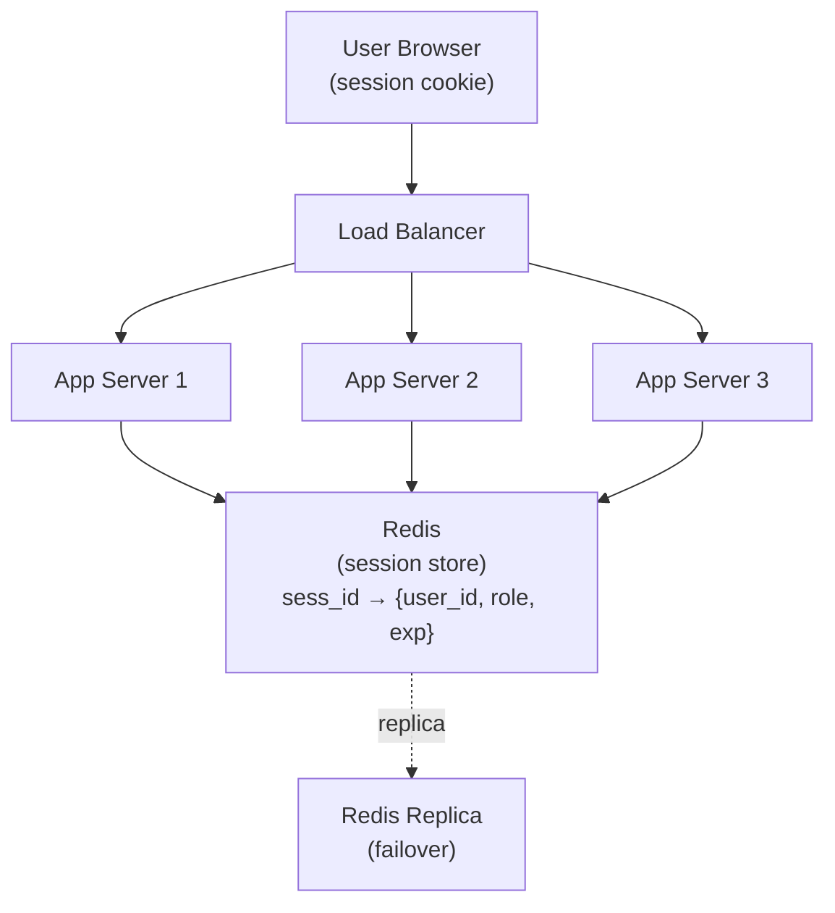

# Session Management Deep Dive

**Prerequisites:** [Authentication & Authorization Fundamentals](authentication-authorization.md), [OAuth2 & OIDC](oauth2-oidc.md)

[← Security](index.md)

---

## Why This Exists

HTTP is stateless by design — every request arrives with no memory of the last one. But almost every real application needs the opposite: "this request and the last ten came from the same logged-in user." That gap — **stateless protocol, stateful application need** — is what session management exists to bridge.

Get it wrong in either direction and you get a real incident:

- Session IDs that don't rotate on login → **session fixation**, an attacker pre-sets a victim's session ID before they authenticate.
- Cookies without `HttpOnly` → one XSS bug anywhere on the site becomes full account takeover, because JavaScript can just read the session token and exfiltrate it.
- A JWT-only design with no revocation path → a stolen token, a fired employee, or a compromised laptop stays valid until natural expiry, no matter what you do on the backend.
- A single Redis session store with no replica → it goes down, and every logged-in user on the platform gets logged out simultaneously.

None of this is exotic. It's the default failure mode if you pick a session strategy without understanding what you're trading away.

---

## Mental Model: The Coat-Check Ticket

You hand your coat to a coat-check attendant. They give you a numbered ticket — the ticket itself is worthless, it's just a number. The *coat* (your actual identity and permissions) stays in the back room. Every time you present the ticket, the attendant looks up that number in the back room and hands you your coat.

```
Server-side session:  Cookie = "sess_a1b2c3" (meaningless number)
                       Server looks up "a1b2c3" in Redis →
                       {user_id: 42, role: "admin", logged_in_at: ...}
                       The coat (your identity) never leaves the back room.
                       Lose the ticket? Attendant can void that number
                       instantly — the coat is still safe in the back.
```

A JWT is a different model entirely: it's not a ticket, it's a **notarized photograph of your coat that you carry yourself**. Anyone who checks the photo's signature can verify it's real without calling the coat-check counter at all — but if you drop that photo, whoever picks it up can wave it around as proof they own that coat until the photo's stamped expiration date, and there's no "back room" to revoke it from.

---

## Architecture: Sessions Across Multiple App Servers



Any app server can serve any request, because none of them hold session state locally — they all read/write the same centralized store. This is what makes horizontal scaling of a session-based app trivial: add a fourth app server, it just needs the Redis connection string, nothing to synchronize.

---

## How It Works Internally

### Server-Side Sessions

```
1. User logs in with credentials.
2. Server creates a session record:
   session_id = cryptographically random 128+ bit value
   Redis: SET sess:a1b2c3... {user_id: 42, role: "admin"} EX 1800
3. Server sends the session_id back as a cookie.
4. Every subsequent request: browser auto-sends the cookie.
5. Server: Redis GET sess:a1b2c3... → looks up identity, proceeds.
6. Logout: Redis DEL sess:a1b2c3... → session is immediately gone,
   from every app server, instantly.
```

The session_id itself carries zero information — it's a lookup key, not a payload. This is the opposite design choice from a JWT, and it's why revocation is trivial here and hard there.

### Stateless JWT Sessions

```
1. User logs in. Server issues a signed JWT containing claims directly:
   {user_id: 42, role: "admin", exp: 1735689600}
2. Client stores the JWT (cookie, or memory + Authorization header).
3. Every request: server verifies the JWT's signature and claims —
   no database or Redis lookup required.
4. Logout: ...there's no server-side record to delete. The token
   is still cryptographically valid until `exp`. This is "the JWT
   revocation problem," covered below.
```

### Cookie Attributes — the Part Everyone Gets Wrong

```
Set-Cookie: sess_id=a1b2c3; Secure; HttpOnly; SameSite=Strict; Path=/; Domain=app.example.com

Secure       Cookie is only sent over HTTPS. Without it, the cookie
             leaks in plaintext the moment a user is on an HTTP
             connection (open wifi, downgrade attack).

HttpOnly     JavaScript CANNOT read this cookie (document.cookie
             won't show it). This is the single most important
             defense against session-token theft via XSS — even if
             an attacker injects a script, `document.cookie` returns
             nothing for this cookie.

SameSite     Controls whether the cookie is sent on cross-site
             requests:
               Strict → never sent cross-site, even a legitimate
                        link from another site to yours won't carry it.
                        Best CSRF defense; can break some login flows.
               Lax    → sent on top-level navigation (clicking a link)
                        but not on cross-site POSTs, images, iframes.
                        Good default for most session cookies.
               None   → sent everywhere, must be paired with Secure.
                        Needed for legitimate cross-site use (embedded
                        widgets, some OAuth redirect flows).

Domain/Path  Scopes exactly which hosts/paths receive the cookie.
             Domain=example.com (no leading dot needed in modern
             browsers) sends the cookie to all subdomains — only
             set this broadly if you actually need subdomain sharing;
             otherwise scope it tightly.
```

### Session Fixation

```
Attack:
  1. Attacker visits the site, gets session_id=xyz (unauthenticated).
  2. Attacker tricks victim into using that same session_id — e.g. a
     URL like https://site.com/login?sessionid=xyz on a site that
     accepts session IDs from the URL, or by setting the cookie via
     a subdomain XSS if Domain scoping is too broad.
  3. Victim logs in. If the server keeps using session_id=xyz and just
     attaches the victim's identity to it, the attacker's copy of
     xyz is now a valid, authenticated session for the victim.

Defense: regenerate the session_id on every privilege change, most
critically on login. Never keep the same session_id from
pre-authentication into the authenticated state.

  Redis: DEL sess:xyz (the old, pre-auth session)
         SET sess:NEW_RANDOM_ID {user_id: 42, ...}
         Set-Cookie: sess_id=NEW_RANDOM_ID
```

### Session Hijacking and XSS Token Theft

```
Hijacking: attacker obtains a valid session_id through network
sniffing (no TLS), a logged session_id in a proxy/access log, or
XSS reading document.cookie. With the raw session_id, the attacker
IS the user until the session expires or is invalidated.

Why HttpOnly specifically matters here: an XSS bug is common —
one unescaped user input, one vulnerable dependency. Without
HttpOnly, that single XSS bug reads document.cookie and exfiltrates
the session_id to an attacker-controlled endpoint in one line of
injected JavaScript. With HttpOnly, the same XSS bug can still do
damage (DOM manipulation, CSRF-adjacent tricks) but cannot read or
exfiltrate the session cookie directly — it has to trick the browser
into making authenticated requests instead of stealing the credential.
```

### Scaling Sessions: Three Strategies

```
Sticky sessions (session affinity)
  Load balancer routes a given client always to the same app server,
  which holds the session in local memory.
  ✓ No shared store needed, low latency
  ✗ Server restart = every session on it is gone
  ✗ Uneven load if some users are much more active than others
  ✗ Autoscaling is awkward — new servers get no traffic until old
    servers' sessions expire

Centralized store (Redis)
  Every app server is stateless; session lives in Redis, accessible
  from any server.
  ✓ Any server handles any request; clean horizontal scaling
  ✓ Instant revocation (DEL the key)
  ✗ Redis is now a dependency on the critical path of every request
  ✗ Redis outage = every session becomes unreachable, mass logout
    (mitigate with replicas + sane failover, but it's still a
    centralized dependency that didn't exist before)

Stateless JWT
  No shared store at all; identity travels in the token.
  ✓ Zero session-store infrastructure, zero lookup latency
  ✓ Trivially scales across any number of servers, any region
  ✗ Can't revoke before expiry without reintroducing a store
    (a blocklist), which quietly turns this back into "centralized
    store," just for revocations instead of full sessions
```

### The JWT Revocation Problem

This is the crux of the server-side-session-vs-JWT decision, and it's worth stating precisely: **a stateless JWT's entire value proposition is "no server-side lookup required." Revocation requires a server-side lookup.** These two properties are in direct tension, and every "JWT revocation" scheme is really a compromise between them, not a solution.

```
Option 1: Just wait it out
  Set exp short (5-15 min). A stolen or compromised token is only
  dangerous for that window. This is the real-world default — you
  don't get true revocation, you get bounded exposure instead.

Option 2: Blocklist
  Maintain a store of revoked token IDs (jti claim) that haven't
  yet naturally expired. Every request checks: "is this jti
  blocklisted?" You've reintroduced a centralized lookup on every
  request — you no longer have a stateless system, you have a JWT
  with extra steps.

Option 3: Short-lived access token + server-tracked refresh token
  The pattern everyone actually converges on (see OAuth2 & OIDC:
  Refresh Token Rotation). Access token (JWT, 5-15 min, stateless,
  unrevocable) does the high-frequency work. Refresh token (server-
  tracked, revocable, in Redis/DB) is checked only when minting a
  new access token, which happens far less often. "Revoke" a user
  really means: delete their refresh token record. Their current
  access token is still valid for whatever's left of its short TTL,
  then it can't be renewed.
```

### Sliding vs Absolute Expiration

```
Absolute expiration:  session dies exactly 30 min after login,
                       no matter how active the user is. Simple,
                       predictable, occasionally annoying (kicks out
                       an actively-working user mid-task).

Sliding expiration:   session's TTL resets on every request/activity.
                       An active user never gets logged out; an idle
                       one expires 30 min after their LAST action.
                       Better UX, but needs a max absolute cap too —
                       otherwise a session that's active forever
                       (a bot, a compromised token being replayed
                       periodically) never expires at all.

Best practice: sliding expiration bounded by an absolute maximum
  (e.g. slides on activity, but hard-caps at 12 hours regardless —
  forces periodic re-authentication even for continuously active
  sessions, which limits the value of a long-lived stolen token).
```

---

## Realistic Example

An e-commerce platform, 500K daily active sessions, server-side sessions in Redis (single primary + 2 read replicas), sliding expiration (30 min idle timeout, 12-hour absolute cap).

```
Normal load: ~500K active sessions, each Redis key ~200 bytes
             (user_id, role, cart_id, last_activity) → ~100MB total,
             comfortably fits in memory with room to spare.

Login surge (flash sale, 10K logins/min for 20 min):
             10K new SET operations/min to Redis — trivial for a
             single Redis primary (handles 100K+ ops/sec easily).

Redis primary fails (no failover configured, hypothetically):
             Every app server's session lookup starts failing.
             500K users appear logged out simultaneously — not
             because their sessions were deleted, but because the
             lookup itself has nowhere to go. This is why "session
             store outage" and "mass logout" are the same incident
             in a centralized-store design.

Mitigation actually in place: Redis Sentinel promotes a replica to
primary within ~10-30 seconds of primary failure. App servers
reconnect via the same logical endpoint. Brief lookup failures
during the failover window get retried; most requests succeed on
retry within the outage window rather than hard-failing to a login
screen.
```

---

## Failure Modes

```
Session store outage → cascading mass logout
  Centralizing sessions in Redis means Redis is now a single point
  of failure for "is anyone logged in, anywhere." Mitigate with
  replicas + automated failover (Sentinel/Cluster), and design app
  servers to retry-with-backoff on lookup failure rather than
  immediately treating a lookup error as "not authenticated."

JWT secret/key leak = total compromise
  If the HMAC secret (or private signing key) leaks, an attacker can
  forge a valid JWT for ANY user, with ANY role, with no server-side
  record of it ever happening — because validation never touches a
  database. This is categorically worse than a leaked session_id
  (which only compromises the one session it names). Mitigate with
  asymmetric signing (RS256, not HS256) so the resource servers only
  ever hold the PUBLIC key, and rotate signing keys on a schedule.

Clock skew
  A JWT's exp/iat/nbf claims are only meaningful if the validating
  server's clock roughly agrees with the issuing server's. A server
  whose clock has drifted forward will reject valid, unexpired
  tokens early; drifted backward, it'll accept tokens past their
  intended expiry. NTP-synced infrastructure makes this rare, but
  it's a real, previously-seen cause of "random valid users getting
  401s" incidents.

Session fixation left unfixed
  Not regenerating the session_id on login means any pre-auth
  session_id an attacker can plant becomes valid the moment the
  victim authenticates on it.

Overly broad Domain scoping
  Setting Domain=.example.com when only app.example.com needs the
  cookie means every subdomain — including lower-security ones like
  a marketing microsite or a staging environment — can read and send
  that cookie, widening the XSS attack surface to any subdomain.
```

---

## Production Debugging

```bash
# Server-side sessions: check Redis health and session count
redis-cli PING
redis-cli DBSIZE
redis-cli INFO replication          # confirm replica is in sync
redis-cli TTL sess:a1b2c3...        # confirm expiry is what's expected

# "Users randomly logged out" — check for a recent Redis failover
redis-cli INFO server | grep run_id # run_id changes across failover/restart

# JWT-based: confirm clock sync between issuing and validating hosts
date -u                             # run on both auth server and API server
                                     # compare directly; NTP drift > ~60s is a real problem

# Decode a JWT to inspect exp/iat without verifying (debugging only)
echo "$JWT" | cut -d. -f2 | base64 -d 2>/dev/null | jq '.exp, .iat, .nbf'

# Cookie not being sent — inspect what the browser actually received
curl -sI https://app.example.com/login | grep -i set-cookie
# check for: Secure (on HTTPS deploys), HttpOnly, SameSite value,
# and that Domain/Path match the request being made
```

```
Decision tree: "spike in logged-out users"
  Correlates with a deploy? → check for an unintentional cookie
    Domain/Path change, or a JWT signing-key rotation without a
    grace period for tokens signed by the old key
  Correlates with a Redis event? → check INFO replication / failover
    logs; likely a primary failover, sessions briefly unreachable
  One geographic region only? → check for a regional cache/CDN
    stripping Set-Cookie headers, or a clock-sync issue isolated
    to that region's hosts
  Single user, repeatedly? → likely legitimate (their device's clock
    is wrong, or they're bouncing between two session stores behind
    a misconfigured LB without sticky routing on a sticky-session setup)
```

---

## Trade-offs

### Server-Side Sessions vs Stateless JWT

| | Server-side sessions (Redis) | Stateless JWT |
|---|---|---|
| Revocation | Instant — delete the key | Not possible before `exp` without a blocklist |
| Per-request cost | Network round-trip to store | Local signature verification, no I/O |
| Horizontal scaling | Easy, but store is now shared infra | Trivial — no shared state at all |
| Single point of failure | Yes — the store | No — but a leaked signing key is worse than a leaked session ID |
| Payload size in transit | Small (just an opaque ID) | Larger (claims travel with every request) |
| Best fit | Systems that need real-time revocation, admin "kill session" controls | Systems spanning many independent services, or extreme scale with no shared store |

---

## Interview Questions

=== "Foundation"
    **Q: Why can't you revoke a JWT the way you can revoke a server-side session?**

    "A server-side session is a lookup key pointing at a record the server controls — deleting that record ends the session everywhere, instantly. A JWT is self-contained: the server verifies it by checking a cryptographic signature, with no database lookup at all. That's the whole performance benefit. But it means there's no server-side record to delete — the token stays valid to anyone who can verify the signature until its `exp` claim says otherwise. Real revocation before that point requires reintroducing some server-side state, like a blocklist, which gives back some of the statelessness you adopted JWTs for in the first place."

    **Q: What does the HttpOnly cookie attribute actually protect against?**

    "It prevents JavaScript from reading the cookie via document.cookie. The practical value: if the site has an XSS vulnerability anywhere — one unescaped input, one compromised third-party script — an attacker's injected JavaScript still cannot read or exfiltrate the session cookie. Without HttpOnly, the same XSS bug is a direct path to full session theft in one line of injected code."

=== "Senior"
    **Q: You're seeing a spike in support tickets: 'I keep getting logged out.' How do you debug it?**

    "First I'd separate server-side sessions from JWT-based auth, because the failure modes are different. For server-side sessions, I'd check Redis health first — INFO replication, run_id changes indicating a failover, DBSIZE dropping unexpectedly. A recent primary failover that briefly breaks lookups fleet-wide is the most common cause of a sudden spike, versus one user reporting it repeatedly (more likely a client-side cookie issue — Domain/Path mismatch after a recent deploy, or SameSite blocking the cookie on some navigation path).

    For JWT-based auth, I'd check for a recent signing-key rotation without a grace period — if the new key rotated in without keeping the old public key valid for tokens signed just before rotation, every token issued in that window becomes unverifiable. I'd also check clock sync between the auth server and whichever service is rejecting the tokens; drift is subtle because it usually only affects requests near the expiry boundary, which looks exactly like 'random' logouts."

    **Q: When would you choose server-side sessions over JWTs for a new system, and vice versa?**

    "Server-side sessions when you need real revocation as a first-class feature — an admin 'force logout' button, compliance requirements to kill a session on suspicious activity, or a security team that wants confidence a compromised credential can be shut off immediately. JWTs when the system spans many independent services that would otherwise all need round-trips to a shared session store on every request, or when there's no natural place to put centralized session infrastructure — genuinely stateless, horizontally distributed services. In practice a lot of systems end up hybrid: short-lived JWT access tokens for the high-frequency path, backed by a server-tracked, revocable refresh token for the actual security boundary."

=== "Staff"
    **Q: Design session management for a platform that needs both massive horizontal scale (millions of concurrent users, globally distributed) and the ability to instantly kill a compromised account's access.**

    "I'd use the hybrid pattern, tuned for global distribution. Short-lived JWT access tokens (2-5 minutes) carry identity and are verified locally at the edge in every region — no cross-region network call on the hot path, which is what makes this scale globally. Signing keys are asymmetric (RS256) and distributed to edge nodes via a JWKS cache with a short TTL, so a region can verify tokens even during a partial network partition from the home region.

    The actual revocation boundary is the refresh token, tracked in a regional-but-globally-replicated store (something like DynamoDB Global Tables or a Redis-backed store with cross-region replication) — 'kill this account's access' means deleting or flagging their refresh token record. Because access tokens are short-lived, the maximum exposure window after a kill command is the current access token's remaining TTL, typically under 5 minutes, not zero — I'd be explicit about that trade-off with whoever owns the security requirement rather than promise instant revocation that the architecture can't actually deliver.

    For truly must-be-instant kills (a confirmed account takeover, not routine logout), I'd add a small, deliberately non-scalable blocklist keyed by user_id, checked only on the rare high-privilege action path (payments, admin actions) rather than every request — accepting the lookup cost only where the risk justifies it, instead of reintroducing a global lookup on the entire request volume."

---

## Key Takeaways

!!! success "Remember"
    1. **Server-side sessions are a lookup key; JWTs are a self-contained, signed claim.** That one distinction explains almost every trade-off between them.
    2. **HttpOnly, Secure, and SameSite are not optional extras** — each closes a specific, common attack: XSS token theft, plaintext network capture, and cross-site request forgery respectively.
    3. **Always regenerate the session ID on login (and on any privilege change).** Reusing a pre-auth session ID after authentication is session fixation, full stop.
    4. **JWTs can't be truly revoked before expiry without reintroducing server-side state.** The real-world answer is short-lived access tokens plus a revocable, server-tracked refresh token — not "wait it out" alone, and not a global blocklist that defeats the point of JWTs.
    5. **A centralized session store is a single point of failure by design.** Plan for its outage (replicas, failover, graceful degradation) — the incident is "mass logout," not a subtle bug.

**Previous:** [OAuth2 & OIDC](oauth2-oidc.md) · **Next:** [Zero Trust Architecture](zero-trust-architecture.md)
