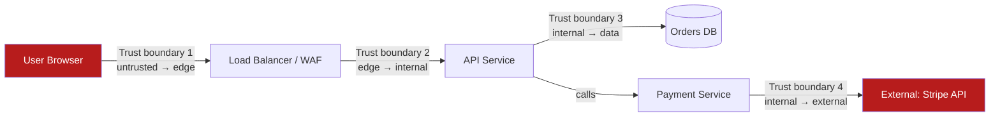
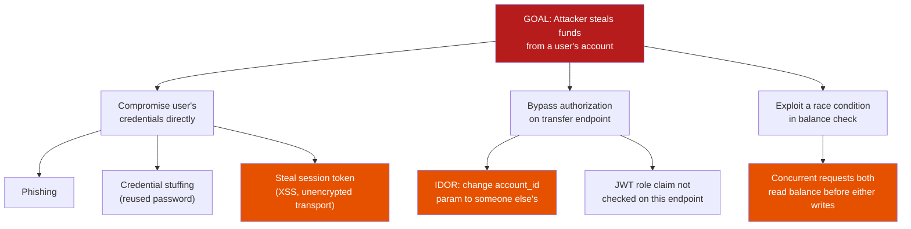

# Threat Modeling

**Prerequisites:** [Authentication & Authorization Fundamentals](authentication-authorization.md), [Zero Trust Architecture](zero-trust-architecture.md)

[← Security](index.md)

---

## Why This Exists

Most security reviews happen the wrong way around: a design gets built, then someone asks "is this secure?" — a question too vague to answer. **Threat modeling** flips this: before (or while) you design a system, you systematically ask "what could go wrong here, specifically, and what's the actual damage if it does?"

```
Wrong question: "Is our payment system secure?"
  → Answer: "...I think so?" (unfalsifiable, not actionable)

Right questions:
  "Can an attacker who steals a JWT impersonate another user?"
  "Can a compromised service account read data outside its own team's tables?"
  "If the payment-service database leaks, what does the attacker actually get?"
  → Each has a concrete, checkable answer, and a concrete fix if the answer is bad.
```

The output of threat modeling isn't "secure" or "not secure" — it's a **list of specific threats, ranked by how bad and how likely**, each with a decision: fix it, mitigate it, or consciously accept the risk. That list is what a senior engineer produces in a design review that a junior engineer doesn't.

---

## Step 1: Draw the System With Trust Boundaries

You can't threat-model a system you haven't drawn. The critical addition beyond a normal architecture diagram is marking **trust boundaries** — every place where data crosses from one level of trust to another.



**Why boundaries matter more than the boxes**: an attacker doesn't care about your service names — they care about *where they can inject something unexpected*. Every arrow crossing a trust boundary is a place where input must be validated, identity must be checked, and "what if this is malicious?" must be asked. Arrows *within* a trust boundary (say, two internal services that already mutually authenticate via mTLS per [Zero Trust Architecture](zero-trust-architecture.md)) carry a different, lower level of required scrutiny — not zero, but different.

```
✗ Common mistake: threat-modeling only the "front door" (user → API)
  and assuming everything internal is automatically safe.

✓ Correct: every trust boundary gets modeled — including internal service
  → internal service, and internal service → external third party (Stripe,
  a vendor webhook, an npm package's phone-home behavior).
```

---

## Step 2: STRIDE — A Checklist So You Don't Rely on Memory

Staring at a diagram and asking "what could go wrong?" tends to surface only the threats you already know about. **STRIDE** is a checklist that forces you through six categories systematically, so you catch the ones you wouldn't have thought of unprompted.

| Letter | Threat | Question to ask at each trust boundary |
|---|---|---|
| **S** — Spoofing | Can an attacker pretend to be someone/something else? | "Can I prove this request really came from who it claims to be from?" |
| **T** — Tampering | Can data be modified in transit or at rest without detection? | "Can an attacker change this value and I wouldn't notice?" |
| **R** — Repudiation | Can a user deny having done something, with no way to prove otherwise? | "If alice denies making this transaction, can I prove she did?" |
| **I** — Information Disclosure | Can data be exposed to someone who shouldn't see it? | "Who can read this, and should they be able to?" |
| **D** — Denial of Service | Can the system be made unavailable? | "Can one bad actor make this unusable for everyone else?" |
| **E** — Elevation of Privilege | Can a low-privilege actor gain higher privilege? | "Can a normal user become an admin, or a service account escape its scope?" |

### Walking STRIDE Through One Trust Boundary

Take Trust Boundary 2 from the diagram above (edge → internal API):

```
Spoofing:
  Threat: attacker forges a request that looks like it's from an authenticated user.
  Check: is every request's identity verified via signed JWT (not just a
  client-supplied user_id header)? → see Authentication & Authorization Fundamentals.

Tampering:
  Threat: attacker on a compromised network path modifies the request body
  (e.g. changes order amount from $10 to $1) between client and server.
  Check: is the connection TLS-encrypted end to end? Is there a WAF stripping
  and re-forwarding TLS (SSL termination) — if so, is THAT hop also protected?

Repudiation:
  Threat: a support agent refunds an order, then denies doing it when asked.
  Check: is every mutating action logged with who/when/what, in a log the
  actor themselves cannot alter or delete?

Information Disclosure:
  Threat: an error message leaks internal details (stack trace, DB schema,
  internal hostnames) to an unauthenticated caller.
  Check: do 500 errors return a generic message externally, full detail only
  in internal logs?

Denial of Service:
  Threat: no rate limiting → one client can exhaust API capacity for everyone.
  Check: is there a rate limiter in front of the API, scoped per-client-identity
  (not just per-IP, which is trivially spoofed/rotated)?

Elevation of Privilege:
  Threat: a bug in the authorization check lets a "customer"-role JWT access
  an admin-only endpoint because the endpoint only checks "is this JWT valid?"
  not "does this JWT's role permit this endpoint?"
  Check: does EVERY endpoint check role/permission, or only some?
```

**This is the actual deliverable of a threat model**: six categories × every trust boundary, each either checked-off with an existing mitigation, or flagged as an open risk with an owner and a decision.

---

## Step 3: Rank What You Found — Not Everything Gets Fixed

A real system will surface a long list of theoretical threats. Fixing all of them isn't realistic (or even correct) — you rank by **likelihood × impact** and make an explicit call on each.

```python
# A lightweight scoring model (DREAD-style, simplified)
def risk_score(damage, reproducibility, exploitability, affected_users, discoverability):
    # Each scored 1-10; damage and affected_users matter most
    return (damage * 2 + reproducibility + exploitability +
            affected_users * 2 + discoverability) / 6

threats = [
    {"name": "JWT secret hardcoded in repo",        "damage": 10, "repro": 10, "exploit": 9, "users": 10, "discover": 8},
    {"name": "Verbose error message leaks stack trace", "damage": 3, "repro": 10, "exploit": 10, "users": 2, "discover": 9},
    {"name": "No rate limit on password reset endpoint", "damage": 5, "repro": 10, "exploit": 8, "users": 5, "discover": 6},
]

for t in threats:
    score = risk_score(t["damage"], t["repro"], t["exploit"], t["users"], t["discover"])
    print(f"{t['name']}: {score:.1f}")

# JWT secret hardcoded in repo: 9.5   → fix immediately, blocks release
# No rate limit on password reset:  7.2   → fix this sprint
# Verbose error message:            6.5   → fix, but not release-blocking
```

**The three real outcomes for any threat found**, and all three are legitimate engineering decisions:

```
1. Fix it: the risk is high enough and the fix is cheap enough — just do it.
2. Mitigate it: can't eliminate the threat, but reduce its impact
   (e.g. can't stop all DDoS, but rate-limiting + autoscaling bounds the damage).
3. Accept it: genuinely low risk, or the fix cost outweighs the exposure —
   document this explicitly, with an owner and a reason, so it's a conscious
   decision and not a gap nobody noticed.
```

**What separates a senior engineer here**: not fixing everything (impossible), but being able to articulate *why* a given risk was accepted rather than fixed, backed by an actual likelihood/impact estimate — not "we didn't get to it."

---

## Step 4: Attack Trees — Modeling a Specific Adversary Goal

STRIDE finds threats per-component. **Attack trees** work backward from a specific attacker goal, mapping every path that could achieve it — useful when you need to reason about one high-value target in depth (e.g. "how could someone steal money from this system") rather than surveying everything.



**Reading this tree**: each leaf is a concrete, testable attack. The orange leaves are the ones worth a closer look here — an unencrypted session token (mitigated by TLS + httpOnly cookies), an IDOR (Insecure Direct Object Reference — check `account_id` in a request always belongs to the authenticated caller, never trust a client-supplied ID unchecked), and a race condition on balance checks (mitigated by the transaction isolation mechanisms from [DDIA Concepts](../databases/ddia-concepts.md#part-3-transactions-consistency-in-the-face-of-concurrency) — this is exactly the "write skew" scenario SSI is built to catch).

```python
# The IDOR leaf (B1), concretely:

# ✗ Bad: trusts the client-supplied account_id
@app.route("/transfer")
def transfer(account_id, amount, to_account):
    account = db.get_account(account_id)   # any account_id accepted!
    account.balance -= amount
    ...

# ✓ Good: account_id is derived from the authenticated identity, never from input
@app.route("/transfer")
def transfer(amount, to_account):
    account = db.get_account(current_user.account_id)   # from the verified JWT
    account.balance -= amount
    ...
```

**When to use STRIDE vs. attack trees**: STRIDE for systematic coverage across a whole system or trust boundary (breadth). Attack trees for going deep on one specific high-value target once you already know it matters (depth) — e.g. "we're about to launch a payments feature, model every path to unauthorized fund transfer" is an attack-tree question, not a STRIDE-the-whole-system question.

---

## Common Mistakes (Interviews)

### 1. Threat Modeling After the Design Is Final

```
✗ "We built it, now let's check if it's secure" — by this point, fixing a
  fundamental flaw (e.g. no trust boundary between two components that
  should have one) means reworking the architecture.

✓ Threat model during design, alongside the architecture diagram — it's much
  cheaper to add a trust boundary check on paper than to retrofit one into
  a shipped system.
```

### 2. Only Modeling the Happy-Path Actors

```
✗ Threat model only considers "a user" and "an admin" as actors.

✓ Also model: a malicious user, a compromised third-party dependency, an
  insider with legitimate but excessive access, an attacker who has already
  gained a foothold on one internal service (see Zero Trust's lateral-movement
  scenario) and is now probing from the inside.
```

### 3. Treating "We Use HTTPS" as a Complete Answer

```
✗ "Is this secure?" "Yes, we use HTTPS and hash passwords."
  (Answers Tampering and part of Information Disclosure. Says nothing about
  Spoofing, Repudiation, Denial of Service, or Elevation of Privilege.)

✓ Walk all six STRIDE categories explicitly, even the ones that feel like
  "obviously fine" — Repudiation and Elevation of Privilege are the two
  categories most often skipped, and where real incidents hide.
```

### 4. No Explicit Risk Acceptance

```
✗ A known threat sits in a backlog forever with no decision recorded —
  six months later nobody remembers if it was assessed as low-risk or
  just never triaged.

✓ Every identified threat gets one of: fixed (with a date), mitigated
  (with the specific mitigation), or accepted (with a reason and an owner
  who can be asked "why" later).
```

---

## Interview Questions

=== "Foundation"
    **Q: What is STRIDE and why use a checklist instead of just brainstorming threats?**

    "STRIDE is six threat categories — Spoofing, Tampering, Repudiation, Information Disclosure, Denial of Service, Elevation of Privilege. Free-form brainstorming tends to surface only the threats you already have in mind; walking a fixed checklist against every trust boundary forces you to consider categories you might otherwise skip — Repudiation and Elevation of Privilege are the two people forget most often."

=== "Senior"
    **Q: Walk me through threat-modeling a new feature: users can now upload a profile picture.**

    "First, draw the trust boundary: untrusted file from the user's browser crossing into our infrastructure. Then STRIDE it: Spoofing — is the upload tied to the authenticated user, not a client-supplied user_id? Tampering — could someone overwrite another user's existing image by guessing/manipulating the storage key? Repudiation — probably low relevance here. Information Disclosure — is the storage bucket public by default, and could someone enumerate other users' private images by guessing URLs? Denial of Service — is there a file-size limit and rate limit, or can one user exhaust storage/bandwidth? Elevation of Privilege — could a crafted file (e.g. a polyglot file, or an SVG with embedded script) execute code when rendered back to other users, i.e. stored XSS? I'd flag storage enumeration and stored-XSS-via-SVG as the two highest-risk findings, and either fix (randomized non-guessable storage keys, strip/re-encode uploaded images server-side rather than serving the raw file) or explicitly accept with a documented reason."

=== "Staff"
    **Q: How do you scale threat modeling across an organization with hundreds of services and teams, without becoming a bottleneck?**

    "Centralized threat modeling for every service doesn't scale — one team becomes a queue everyone waits behind. I'd do three things: first, build a lightweight self-serve template (trust boundary diagram + STRIDE checklist) that teams run themselves for their own services, with a security team reviewing only the flagged high-risk items, not every line. Second, invest in the systemic mitigations that make whole categories of threat harder to introduce in the first place — this is where Zero Trust's mTLS-everywhere and centrally enforced policy pays off, because it means 'Spoofing' and 'Elevation of Privilege' are largely handled by the platform rather than needing to be re-solved per-service. Third, require threat modeling as a gate specifically for high-risk changes (new trust boundary, new external integration, handling payment/PII data) rather than every change — that keeps the security team's attention on where the actual risk concentrates instead of spreading thin across everything."

---

## Key Takeaways

!!! success "Remember"
    1. **Threat modeling starts with a diagram that marks trust boundaries** — every place data crosses from one trust level to another is where scrutiny is required
    2. **STRIDE (Spoofing, Tampering, Repudiation, Information Disclosure, Denial of Service, Elevation of Privilege) is a checklist, not a brainstorm** — it catches the threats you wouldn't think to ask about unprompted
    3. **The output is a ranked list, not a verdict** — "secure" or "not secure" is the wrong question; "here are the threats, ranked, with a decision on each" is the right one
    4. **Every threat gets fixed, mitigated, or explicitly accepted** — an undocumented gap is worse than a documented, consciously accepted risk
    5. **Attack trees go deep on one high-value goal**; STRIDE goes broad across a whole system — use the right tool for whether you need depth or coverage
    6. **Model during design, not after** — retrofitting a missing trust boundary into a shipped system is far more expensive than catching it on a diagram
    7. **Repudiation and Elevation of Privilege are the most commonly skipped categories** — "we use HTTPS and hash passwords" answers Tampering and Information Disclosure, and nothing else
    8. **This connects directly to Zero Trust and Authentication fundamentals** — the mitigations for most STRIDE findings (verified identity, policy enforcement, short-lived credentials) are exactly what those two pages build

**Previous:** [Zero Trust Architecture](zero-trust-architecture.md)
