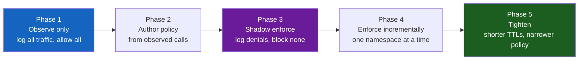

# Zero Trust Architecture

**Prerequisites:** [Authentication & Authorization Fundamentals](authentication-authorization.md)

[← Security](index.md)

---

## Why This Exists

For twenty years, the standard security model was: **build a strong perimeter (firewall, VPN), and trust everything inside it.**

```
Internet ←[Firewall]→ Corporate Network ←→ Every internal service trusts every other service
                        (VPN required to get in)
```

Once an attacker is inside — a phished laptop, a leaked VPN credential, a compromised third-party library — **there is nothing left to stop them.** Internal services accept requests from "inside the network" with little or no additional verification. This is why breaches like Target (2013, HVAC vendor credentials → full network access) and countless "lateral movement" incidents happen: the perimeter is strong, but the interior is soft.

**Zero Trust's premise:** never trust a request because of *where it came from* (inside vs. outside the network). Verify every request, every time, based on *who is making it* and *what they're allowed to do* — the same principle you already use for external API auth, now applied to every service-to-service call too.

```
Old model: "You're on the corporate VPN → I trust you"
Zero Trust: "You're on the corporate VPN AND you have a valid service identity
             AND your device passes a posture check AND this specific action
             is permitted by policy → I trust this one request"
```

---

## The Core Shift: Identity Replaces Location

### Perimeter Model

```
Service-A (inside network) calls Service-B (inside network)
  Service-B: "Are you on the internal network? Yes → proceed"
  No further check. Network location IS the credential.
```

**Failure mode**: an attacker who compromises *any* internal machine — a build server, a forgotten test box, a contractor's laptop — inherits implicit trust for every internal service, with no additional barrier.

### Zero Trust Model

```
Service-A (anywhere) calls Service-B (anywhere)
  Service-B: "Prove your identity" (cryptographic, not IP-based)
  Service-A presents a certificate: "I am Service-A, issued by our internal CA"
  Service-B: "Verified. Now, is Service-A allowed to call this specific endpoint?"
  Policy check: "Service-A → Service-B:/refund is allowed. Service-A → Service-B:/admin is not."
  Service-B: "Proceed" or "403 Forbidden"
```

**Network location is now irrelevant.** Being on the corporate VPN gets you nothing on its own; every service still demands proof of identity and a policy check, whether the caller is in the next rack or on the public internet.

---

## Building Block 1: Service Identity via mTLS

Zero Trust requires every workload to have a **verifiable identity**, not just users. This is done with mutual TLS (mTLS) — both sides present a certificate, not just the server.

```
Normal TLS (what your browser does):
  Client → Server: "Prove who you are" (server sends cert)
  Client verifies server's cert. Client identity: not verified.

mTLS:
  Client → Server: "Prove who you are" (server sends cert)
  Server → Client: "You too" (client sends cert)
  Both sides verify each other's cert against a trusted CA.
  Now BOTH identities are cryptographically proven.
```

```
Service-A's certificate:
  Subject: spiffe://prod/payments/order-service
  Issued by: internal-ca
  Valid: 24 hours

Service-B receiving a request:
  1. TLS handshake: Service-A presents its cert
  2. Service-B verifies: signed by internal-ca? Not expired? Not revoked?
  3. Service-B extracts identity: "this is order-service, in prod, in the payments team"
  4. Service-B checks policy: "can order-service call me?"
```

**Why short-lived certificates (hours, not years) matter**: if a cert is compromised, the blast radius is bounded by its lifetime, not by how long it takes someone to notice and manually revoke it. This mirrors the short-lived-JWT-plus-refresh-token pattern from [Authentication & Authorization Fundamentals](authentication-authorization.md#jwt-signed-tokens-that-clients-carry) — same idea, applied to machine identity instead of user identity.

### SPIFFE/SPIRE: Standardizing Workload Identity

Issuing and rotating certificates for thousands of services by hand doesn't scale. **SPIFFE** (Secure Production Identity Framework for Everyone) defines a standard identity format; **SPIRE** is the reference implementation that issues and rotates the certificates automatically.

```
SPIFFE ID format: spiffe://<trust-domain>/<path>
  spiffe://prod.example.com/payments/order-service
  spiffe://prod.example.com/payments/refund-worker

SPIRE agent runs on every node:
  1. Verifies a workload's identity via node attestation (e.g. "this process
     was started by Kubernetes, in namespace 'payments', with this pod spec")
  2. Issues a short-lived SVID (SPIFFE Verifiable Identity Document — an
     X.509 cert or JWT) bound to that identity
  3. Automatically rotates it before expiry — the workload never handles
     a long-lived secret at all
```

**The key property**: identity is derived from *how the workload was deployed* (its Kubernetes service account, its cloud IAM role, its process attestation), not from a secret baked into a config file that could leak. This closes the exact hole described in the secrets-management section of the Auth fundamentals page — there's no static credential to steal in the first place.

---

## Building Block 2: Policy Enforcement

Identity alone only answers "who is this?" You still need "what are they allowed to do?" — enforced consistently, everywhere, not just at the network edge.

```
Policy: "order-service can call inventory-service:/reserve"
Policy: "order-service can call inventory-service:/admin/purge" → DENIED
Policy: "any service in 'analytics' namespace can call inventory-service:/reserve" → DENIED
         (analytics has no business calling this endpoint, even if it's on the same cluster)
```

### Where Policy Gets Enforced

```
Option 1: In application code
  if caller_identity not in ALLOWED_CALLERS:
      return 403
  Problem: every service reimplements this; easy to forget, easy to get wrong,
  hard to audit consistently across hundreds of services.

Option 2: Sidecar proxy (service mesh)
  Every service gets a sidecar (Envoy, etc.) that intercepts all traffic.
  Policy is defined once, centrally, and enforced identically for every service —
  application code never sees an unauthorized request; the sidecar rejects it first.
```

```
Request flow with a sidecar:
  Service-A → [Envoy sidecar on A] → network → [Envoy sidecar on B] → Service-B

  Sidecar-A: attaches mTLS identity, encrypts the connection
  Sidecar-B: verifies mTLS identity, checks policy ("is A allowed to call B:/refund?")
             → if denied, request never reaches Service-B's application code at all
```

This is the same mechanism covered in [Modern Protocols & Service Mesh](../networking/modern-protocols-service-mesh.md) — Zero Trust is the *security motivation* for running a mesh; mTLS-everywhere and centralized policy are the *mechanism*.

### Policy as Code

Centralizing policy means it can be versioned, reviewed, and tested like any other code — instead of living as tribal knowledge in a firewall rule someone configured three years ago and nobody remembers why.

```yaml
# Example: authorization policy (Open Policy Agent style)
apiVersion: security.example.com/v1
kind: AuthorizationPolicy
metadata:
  name: inventory-service-policy
spec:
  target: inventory-service
  rules:
    - from: order-service
      allow: ["/reserve", "/release"]
    - from: admin-console
      allow: ["/admin/*"]
    - from: "*"
      allow: []   # deny by default
```

**Deny by default is the load-bearing detail.** A policy that allows everything except a blocklist will always drift — new services get added, someone forgets to lock them down, and the default is "trusted." Deny-by-default means a newly deployed service can reach nothing until someone explicitly grants it access, which is exactly the direction you want the failure mode to point.

---

## Building Block 3: Context-Aware Access (Beyond Just "Who")

Full Zero Trust goes further than service identity — it also evaluates the *context* of a request before granting access, especially for human users.

```
Request: alice tries to access the admin console

Context checked:
  - Identity: is this really alice? (MFA-verified)
  - Device posture: is alice's laptop running the required security agent,
    fully patched, disk encrypted?
  - Location/network: is this from an expected geography, or a new country
    alice has never logged in from?
  - Behavior: is this consistent with alice's normal access pattern, or
    is she suddenly requesting bulk data export at 3 AM?

Any one of these being anomalous can trigger a step-up challenge (re-verify
with MFA) or an outright deny, even though alice's password was correct.
```

**Interview signal**: "Authentication proves identity once, at login. Zero Trust treats every subsequent request as a fresh authorization decision — a valid session doesn't mean unconditional trust for whatever the user does next."

---

## Migrating a Perimeter System to Zero Trust: The Hard Part

The concepts are simple. **Rolling this out without an outage on an existing system with hundreds of services and years of implicit trust is the actual engineering problem.**

### Why "Just Turn It On" Fails

```
Day 1: Enable mTLS enforcement across the mesh, deny-by-default policy live.

Result: every service call that wasn't explicitly allow-listed starts failing.
  → Service-X has been silently calling Service-Y for two years; nobody
    remembers, it's not in any documentation, and it just went dark.
  → Full outage. Rollback. Trust is now damaged for the next attempt.
```

### The Actual Migration Path



```
Phase 1 — Observe, enforce nothing
  Deploy the mesh/sidecars in "audit only" mode: log every service-to-service
  call, but allow everything, exactly as before.
  → Build a real map of who actually calls whom. This map is always bigger
    and messier than anyone's mental model or architecture diagram.

Phase 2 — Author policy from observed traffic
  Turn the observed call graph into explicit allow rules.
  → "Service-X really does call Service-Y — that's legitimate, allow it."
  → Flag anything surprising for a human to confirm it's intentional before
    it becomes a permanent policy (this is often where you *find* the
    accidental/legacy paths that shouldn't exist and quietly remove them).

Phase 3 — Enforce in shadow mode
  Turn on deny-by-default, but only LOG what would have been denied —
  don't actually block it yet.
  → Catch any traffic the observation window missed (e.g. a monthly batch
    job that only runs once and wasn't captured in Phase 1's window).

Phase 4 — Enforce for real, one namespace/team at a time
  Flip enforcement on incrementally, starting with the lowest-risk,
  best-understood services. Never a global switch flip.
  → If something breaks, the blast radius is one team's services, not
    the whole platform, and rollback is fast and localized.

Phase 5 — Ratchet down default cert lifetimes and tighten policy
  Once stable, shorten certificate TTLs, narrow allow-rules from broad
  ("anything in payments namespace") to specific ("only order-service").
```

**Why this sequencing matters for the interview**: the naive answer to "how would you implement Zero Trust" is architecturally correct but operationally naive. The senior answer is the migration sequencing above — observe before enforcing, shadow-mode before real enforcement, incremental rollout before a global flip. This is the same "expand before contract" instinct as [Deployment Strategies](../cloud/deployment-strategies.md) and the backward/forward-compatibility discipline in schema migrations — you're changing a load-bearing assumption (implicit trust) that hundreds of services depend on, so the rollout itself has to be designed with the same care as the target state.

---

## Common Mistakes (Interviews)

### 1. Treating Zero Trust as "Just Add a VPN Alternative"

```
✗ "We replaced the VPN with per-service mTLS" — that's a component, not the model.
✓ Zero Trust requires: identity for every workload, policy enforced at every
  hop (not just the edge), and context-aware decisions — not just swapping
  which technology sits at the perimeter.
```

### 2. Long-Lived Service Credentials

```
✗ Bad: Service-A has a static API key, valid indefinitely, stored in a config file.
       If leaked, valid forever until someone notices and manually rotates it.

✓ Good: Service-A's identity is a short-lived cert (SPIFFE/SPIRE), auto-rotated
       every few hours, with no static secret to leak in the first place.
```

### 3. Allow-by-Default Policy "Just to Get It Working"

```
✗ "We'll lock it down later" — later never comes, and every service added
  in the meantime inherits implicit trust by default, recreating the exact
  perimeter-model problem Zero Trust exists to fix.

✓ Deny by default from day one of Phase 4 enforcement; new services must
  request explicit policy grants before they can call anything.
```

### 4. No Context on Human Access

```
✗ Bad: Once alice authenticates, every subsequent action for the session's
  lifetime is trusted equally — including a 3 AM bulk export from a new device.

✓ Good: Sensitive actions (bulk export, admin console, payment refunds) trigger
  a fresh, context-aware check, even mid-session.
```

---

## Interview Questions

=== "Foundation"
    **Q: What's the actual difference between a perimeter model and Zero Trust?**

    "Perimeter model: strong firewall/VPN at the edge, implicit trust for anything inside the network. Zero Trust: every request is verified based on cryptographic identity and policy, regardless of network location — 'inside the network' confers no trust on its own. The practical mechanism is usually mTLS between every service plus a centrally enforced policy, often via a service mesh sidecar."

=== "Senior"
    **Q: A service was compromised and the attacker is trying to move laterally to other internal services. How does Zero Trust limit the damage compared to a perimeter model?**

    "In a perimeter model, once inside, the attacker's compromised service can call any other internal service — network location was the only check, and they're now 'inside.' Under Zero Trust, the compromised service's identity (its SPIFFE ID / cert) only has policy grants for the specific services it legitimately needs to call. It can't reach unrelated services because there's no policy allowing that identity to call them — the blast radius is bounded to whatever that one service was actually authorized for, not the whole network. I'd also check: was the compromised service's certificate short-lived? If so, even the compromised identity itself expires and needs re-attestation, further limiting the window."

=== "Staff"
    **Q: You're asked to migrate a 200-service platform from a perimeter/VPN model to Zero Trust, with zero tolerance for an outage. Walk me through the plan.**

    "I wouldn't touch enforcement first. Phase 1: deploy sidecars/mesh in observe-only mode to build a real service-to-service call graph — the actual traffic, not the architecture diagram, because those always diverge after a few years. Phase 2: turn observed traffic into explicit allow-policies, and use this as an opportunity to flag and remove legacy/accidental call paths that shouldn't exist. Phase 3: shadow-enforce — log what deny-by-default would reject, without actually rejecting, to catch anything the observation window missed (monthly batch jobs, etc.). Phase 4: enforce for real, one namespace at a time, starting with the best-understood, lowest-risk services, so a mistake has bounded blast radius and a fast rollback path. Throughout, identity itself moves from static long-lived credentials to SPIFFE/SPIRE-issued short-lived certs. The whole migration is measured in months, not a single cutover — the risk isn't the target architecture, it's the transition."

---

## Key Takeaways

!!! success "Remember"
    1. **Zero Trust replaces network location with cryptographic identity as the basis of trust** — being "inside the network" grants nothing on its own
    2. **Every workload needs a verifiable identity**, not just users — mTLS with short-lived certs (SPIFFE/SPIRE) is the standard mechanism
    3. **Policy should be enforced centrally and consistently** (service mesh sidecar), not reimplemented ad hoc in every service's application code
    4. **Deny by default** — a new service should be able to reach nothing until explicitly granted access
    5. **Context matters beyond identity** — device posture, location, and behavior can trigger step-up checks even for an already-authenticated session
    6. **Short-lived credentials bound the blast radius of a leak** — the same principle as short-lived JWTs, applied to machine identity
    7. **Migrating an existing system requires observe → shadow-enforce → incremental rollout**, never a global "turn it on" switch — the transition is the hard engineering problem, not the target model
    8. **Zero Trust doesn't eliminate the need for authorization logic** — it moves "who can call whom" from implicit (network topology) to explicit (policy), which is what makes it auditable

**Previous:** [Authentication & Authorization Fundamentals](authentication-authorization.md) · **Next:** [Threat Modeling](threat-modeling.md)
