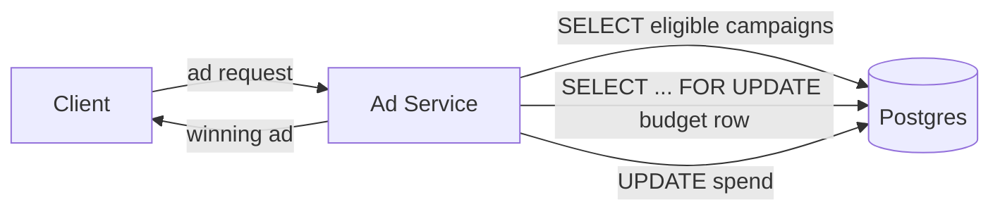
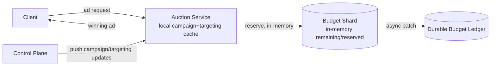
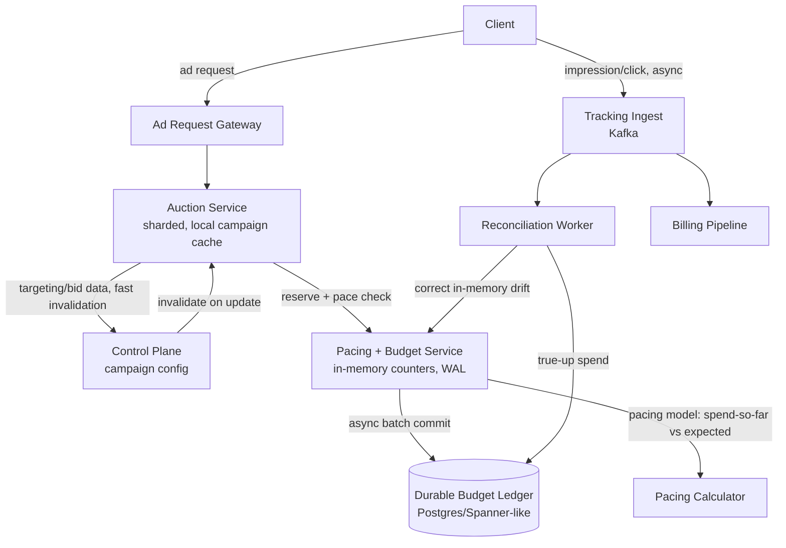

# Design: Ad Serving System

**Difficulty:** Senior → Staff | **Time:** 60 minutes

!!! note "Instructions"
    Cover each section and work it yourself first. Before every "Version N" reveal there is a `???` box — commit to an answer before you open it. The value of this exercise is not the diagram; it's predicting *why* the previous version breaks.

---

## 1. Problem Statement

Design the system that decides which ad to show when a page or app requests one. A publisher's page loads, hits an ad slot, and fires an ad request. Within a hard latency budget, the system must: find every advertiser campaign eligible to fill that slot (targeting match), run an auction among them, confirm the winner still has budget remaining, and return a single winning ad — all before the page finishes rendering.

The defining constraint is not "rank well." It's that **three things must all be true inside single-digit milliseconds**: the auction must consider many eligible bidders, the winner's budget must be checked and reserved, and a response must go out — because the ad slot is rendering *right now*, on a page the user is actively loading. Miss the window and the slot renders blank or falls back to a lower-value house ad; publisher revenue and user experience both degrade in real time.

Contrast this with a recommendation system: recommendations optimize *relevance* — which items best match a user's taste — typically inside a 100–200ms budget, and getting a suggestion 2% less relevant costs nothing measurable. Ad serving optimizes an *auction* under a hard budget constraint with real money changing hands on every decision, inside a latency budget 10–20x tighter. A recommendation service that's briefly stale serves a slightly worse list. An ad system that's briefly wrong either overspends an advertiser's money (a billing incident) or underspends it (a broken promise to a paying customer) — and it has roughly 5-10ms to get the decision right, not 100-200ms.

---

## 2. Clarifying Questions

??? question "What questions should you ask?"
    - **Auction format:** First-price (winner pays their bid) or second-price (winner pays one increment above the runner-up)?
    - **Budget shape:** Daily cap only, or lifetime cap, or both? Can the advertiser set a pacing preference (spend evenly vs. spend fast)?
    - **Billing event:** Pay per impression (CPM) or per click (CPC)? This changes what "spend" even means at decision time.
    - **Targeting dimensions:** Geography, device, user segment/interest, contextual keywords, frequency capping (don't show the same ad to the same user 20x/day)?
    - **Latency budget:** What's the actual number — 5ms? 10ms? Is this a header-bidding waterfall (multiple sequential calls) or a single real-time auction?
    - **Fallback:** If the auction times out or no bidder qualifies, what fills the slot — a house ad, blank, or a lower-priority default campaign?
    - **Scale:** Ad requests/second, number of active campaigns, advertisers competing per request?
    - **External demand:** Internal advertisers only, or do we also solicit bids from external demand-side platforms (RTB)?
    - **Fraud:** Are we responsible for detecting bot impressions/clicks before they count against budget?

---

## 3. Functional Requirements

- Accept an ad request (slot metadata, user/context signals) and return a winning ad within the latency budget
- Filter campaigns to those eligible: targeting match, budget remaining, active date range, frequency cap not exceeded
- Run an auction among eligible campaigns and select a winner (plus clearing price)
- Record impressions and clicks, and deduct spend against the correct campaign's budget
- Support advertisers creating/pausing/updating campaigns, bids, and budgets without a deploy
- Never serve a campaign whose budget is exhausted

## 4. Non-Functional Requirements

| Property | Requirement | Reasoning |
|----------|-------------|-----------|
| Decision latency | < 10ms p99, target < 5ms | Slot is rendering now; this is 10–20x tighter than a rec-system's ~150ms |
| Budget correctness | Must never let a campaign spend beyond its cap | Real money; overspend is a billing incident, not a UX blemish |
| Availability | 99.95%+ on the ad-request path | Every failed request is lost revenue, not a retryable background job |
| Scale | 500K ad requests/sec peak, 200K active campaigns | Eligibility filtering and budget checks must be sub-millisecond each |
| Tracking durability | Every billable impression/click must eventually be reconciled to spend — no silent loss | Advertisers audit invoices against served-ad logs |
| Pacing | Budget should spend smoothly across its active window, not exhaust in the first minutes | A $1,000/day budget spent by 9am shows only morning users, breaks "run all day" intent |

!!! tip "Interview Insight 🎯"
    Say the tension out loud early: "never overspend" pulls toward a synchronous, strongly-consistent check; "sub-10ms" pulls toward doing zero synchronous cross-service calls. You cannot fully satisfy both — the resolution (conservative in-memory reservation + async reconciliation) is the spine of this whole design. Naming this trade-off in minute five is worth more than any diagram.

---

## 5. Capacity Estimation

```
Ad requests:
  500K requests/second peak, 100K/s average
  Each request evaluates against targeting-filtered eligible set

Eligible advertisers per request (after targeting filter):
  200K active campaigns total, but geo/device/segment targeting
  typically narrows this to 50-500 eligible bidders per request
  Auction only ranks the narrowed set, not all 200K

Campaigns:
  200K active campaigns, ~20K updating budget/targeting per hour (self-serve UI)

Budget-check operations:
  1 check-and-reserve per ad request (for the eventual winner) = 500K ops/sec peak
  Plus periodic reconciliation writes from the tracking pipeline (impressions/clicks)
  ~500K impression events/sec + ~5K click events/sec (1% CTR) feeding back into spend

Memory for in-memory eligibility/auction data:
  200K campaigns x ~2KB (targeting rules + bid + budget state) = 400MB
  Fits entirely in RAM per auction-service replica — no DB call in the hot path

Latency budget allocation (10ms total):
  Network in/out: ~2ms
  Eligibility filter (in-memory index scan): ~1-2ms
  Auction (rank + pick winner among ~500 candidates): ~1-2ms
  Budget reserve (in-memory, local shard): ~1ms
  Buffer: ~2-3ms
```

!!! abstract "Mental Model"
    You are running the rate limiter's "shared mutable integer under contention" problem — but the integer is *money*, it must never go negative in the customer-facing sense, and you have a fraction of the rate limiter's latency budget to check it. Every version below is about making that integer local enough to read in microseconds while still being true enough to trust for billing.

---

## 6. API Design

```
# Ad request — called synchronously while the page/app is loading
POST /v1/ad-request
Request:
{
  "slot_id": "homepage-banner-300x250",
  "user_context": { "geo": "US-CA", "device": "mobile", "segments": ["sports", "auto-intent"] },
  "auction_type": "second_price"
}
Response (< 10ms):
{
  "ad_id": "camp_9182_creative_4",
  "clearing_price_cents": 42,
  "impression_token": "opaque-signed-token",   # required on the tracking callback
  "creative_url": "https://cdn.example/ads/..."
}
Status: 200 (won), 204 (no fill — no eligible bidder cleared reserve price)

# Tracking callbacks — fired by the client/SDK rendering the ad, async, not on the critical path
POST /v1/track/impression
{ "impression_token": "opaque-signed-token", "ts": "..." }

POST /v1/track/click
{ "impression_token": "opaque-signed-token", "ts": "..." }

# Control plane (advertiser self-serve, internal-authenticated)
PUT /internal/campaigns/{campaign_id}
{ "daily_budget_cents": 100000, "bid_cents": 50, "targeting": {...}, "status": "active" }
GET /internal/campaigns/{campaign_id}/spend   # near-real-time spend dashboard
```

!!! warning "Production Trap ⚠️"
    Do not deduct budget on the `/v1/ad-request` response alone — a returned ad is not a guaranteed impression (the page can be closed before the creative renders). Reserve budget optimistically at auction time, but true up against the impression-tracking callback; a reservation with no matching impression within N seconds must be released back to the campaign.

---

## 7. Data Model

```sql
-- Durable campaign config + budget ledger. Not the hot path for reads.
CREATE TABLE campaigns (
    campaign_id     BIGINT PRIMARY KEY,
    advertiser_id   BIGINT NOT NULL,
    bid_cents       INT NOT NULL,
    daily_budget_cents    BIGINT NOT NULL,
    lifetime_budget_cents BIGINT,
    status          VARCHAR(16) NOT NULL,   -- active | paused | exhausted
    start_at        TIMESTAMPTZ NOT NULL,
    end_at          TIMESTAMPTZ,
    updated_at      TIMESTAMPTZ NOT NULL
);

-- Durable ledger: source of truth for spend, reconciled from tracking events
CREATE TABLE budget_ledger (
    campaign_id     BIGINT NOT NULL,
    day             DATE NOT NULL,
    spend_cents     BIGINT NOT NULL DEFAULT 0,
    last_reconciled_at TIMESTAMPTZ NOT NULL,
    PRIMARY KEY (campaign_id, day)
);

-- Targeting rules, indexed for fast eligibility filtering
CREATE TABLE targeting_rules (
    campaign_id     BIGINT NOT NULL,
    dimension       VARCHAR(32) NOT NULL,   -- geo | device | segment | keyword
    value           VARCHAR(128) NOT NULL,
    INDEX idx_dim_value (dimension, value)  -- inverted index: value -> campaigns
);

-- Billing-grade event log (append-only, high volume)
CREATE TABLE ad_events (
    impression_token VARCHAR(64) PRIMARY KEY,
    campaign_id     BIGINT NOT NULL,
    event_type      VARCHAR(16) NOT NULL,   -- impression | click
    clearing_price_cents INT NOT NULL,
    ts              TIMESTAMPTZ NOT NULL,
    INDEX idx_campaign_ts (campaign_id, ts)
);
```

Hot state (not SQL — see Version 2):

```
budget:{campaign_id}:{day}   → { remaining_cents, reserved_cents }  in-memory, sharded
targeting_index              → inverted index, value -> [campaign_id], cached locally per auction node
```

---

## 8. Version 1 — simplest thing that works

One service. Per request: filter eligible campaigns from Postgres, rank by bid, synchronously read-check-write the winner's budget row in the same database, return the winner.



```python
def handle_ad_request(context) -> dict | None:
    eligible = db.query(
        "SELECT * FROM campaigns c JOIN targeting_rules t ON c.campaign_id = t.campaign_id "
        "WHERE t.dimension = %s AND t.value = %s AND c.status = 'active'",
        "geo", context.geo,
    )
    ranked = sorted(eligible, key=lambda c: c.bid_cents, reverse=True)

    for candidate in ranked:
        with db.transaction():
            row = db.query_one(
                "SELECT remaining_cents FROM budget_ledger WHERE campaign_id=%s AND day=%s FOR UPDATE",
                candidate.campaign_id, today(),
            )
            if row.remaining_cents >= candidate.bid_cents:
                db.execute(
                    "UPDATE budget_ledger SET remaining_cents = remaining_cents - %s WHERE campaign_id=%s AND day=%s",
                    candidate.bid_cents, candidate.campaign_id, today(),
                )
                return {"ad_id": candidate.campaign_id, "clearing_price_cents": candidate.bid_cents}
    return None  # no fill
```

This is correct — every decrement is transactional, budget can never go negative. Ship it, measure it, then find the bottleneck.

---

## 9. Identify the bottleneck

???+ question "At 500K requests/second, what breaks first, and why doesn't the rate limiter's answer apply here?"
    This is the same shape of problem as the [rate limiter](rate-limiter.md): many stateless request handlers mutating a shared counter. The rate limiter's answer at scale was "make it approximately correct — a token bucket that's occasionally a few requests over is an acceptable trade for speed." **That answer does not transfer here.**

    - `SELECT ... FOR UPDATE` on a budget row serializes every request that targets the same popular campaign. A campaign eligible for 50K requests/second cannot run 50K row-locked transactions/second on one Postgres row — this is strictly worse than the rate limiter's `INCR`, because it's a full transaction with a row lock, not an atomic increment.
    - The rate limiter can be *probabilistically* correct — a sliding window a few requests over the limit is a shrug. A budget system that's probabilistically correct **overspends real advertiser money**, which is a support ticket and a refund, not a shrug. So you need the same "make the shared integer local and fast" fix as the rate limiter, but you cannot also relax correctness — you have to get both tighter latency *and* stricter correctness at the same time.
    - Two round trips (eligibility query + locked budget transaction) per request cannot fit inside 10ms once network and queueing are added — Postgres transaction latency alone is commonly 2-5ms under contention, before the eligibility query even runs.
    - The eligibility query itself — a join across targeting rules for every request — is a full relational scan pattern that does not belong in a single-digit-millisecond hot path.

---

## 10. Version 2 — in-memory auction, in-memory budget, async reconciliation

Move everything off the synchronous DB path. Each auction-service node caches campaign/targeting data locally (pushed from a control plane, invalidated fast on update). Budget lives in a sharded, in-memory store keyed by `campaign_id`, mutated with a fast in-process or single-hop operation — no relational transaction per request.



```python
# budget shard: one process per shard, campaign_id hashed to a shard
class BudgetShard:
    def __init__(self):
        self.remaining = {}  # campaign_id -> cents, loaded from ledger at boot

    def try_reserve(self, campaign_id: int, cents: int) -> bool:
        if self.remaining.get(campaign_id, 0) >= cents:
            self.remaining[campaign_id] -= cents
            return True
        return False

def handle_ad_request(context) -> dict | None:
    eligible = local_targeting_index.lookup(context)      # in-memory inverted index, no network call
    for candidate in sorted(eligible, key=lambda c: c.bid_cents, reverse=True):
        shard = budget_shard_for(candidate.campaign_id)     # local or one fast RPC hop
        if shard.try_reserve(candidate.campaign_id, candidate.bid_cents):
            emit_async(reservation_event(candidate, context))  # off critical path
            return {"ad_id": candidate.campaign_id, "clearing_price_cents": candidate.bid_cents}
    return None
```

The auction now touches zero synchronous databases. Eligibility is a local index lookup; budget is a local map mutation. Reservation events stream asynchronously to a durable ledger that periodically true-ups each shard's in-memory number.

---

## 11. Identify the next bottleneck

???+ question "Two campaigns are misbehaving in different ways. What's wrong with each, and what fixes it?"
    - **Campaign A** has a $1,000/day budget and is fully spent by 9am because morning traffic happens to be heavy. The advertiser wanted exposure all day, not a morning-only campaign. A hard cutoff at the daily cap is *correct* per the budget rule but *wrong* per intent — you need a **pacing algorithm**: throttle the effective win-rate for a campaign based on spend-so-far vs. expected-spend-by-this-hour (e.g., a smoothed/probabilistic throttle, not "accept every winning bid until the counter hits zero").
    - **Campaign B** is a high-QPS target spread across many auction-service replicas talking to the same budget shard. Under bursty traffic, in-memory reservations across replicas can outpace how fast the async reconciliation to the durable ledger runs — if a shard crashes before its reservations are flushed, remaining budget on restart is computed from stale ledger data, silently permitting a burst of overspend. The in-memory number is a *reservation*, not gospel; it needs a bounded window of drift and a recovery path that's conservative (reload from ledger + replay a recent write-ahead log of reservations), not "trust whatever was in memory."

---

## 12. Version 3 — production architecture



Key production decisions:

- **Auction stays 100% in-memory.** Campaign config, targeting index, and bid data are cached on every auction-service replica, pushed from the control plane on change with a fast invalidation (sub-second) rather than pulled per request.
- **Budget/pacing service is the rate limiter's token bucket, but billing-grade.** Same shape as [rate-limiter.md](rate-limiter.md)'s in-memory-slice-with-reconciliation pattern — each shard holds a working balance, writes a local write-ahead log of every reservation before acknowledging, and asynchronously batches those reservations into the durable ledger. The WAL is what the rate limiter didn't need: losing a reservation record there was a mild inconvenience; here it's the difference between "reconcile in 30 seconds" and "lose track of real money."
- **Pacing runs as a probability multiplier, not a gate.** At any point in the day, the pacing calculator computes `expected_spend_by_now` from the campaign's daily budget and a delivery curve, and throttles win eligibility (e.g., admit this campaign to the auction with probability `min(1, target_pace / actual_pace)`) rather than an on/off switch — this is what prevents a $1,000/day budget from vanishing in the first traffic spike.
- **Tracking pipeline is fully async**, fed by Kafka. It never blocks the ad-request path; it feeds the reconciliation worker, which is the actual source of truth for billed spend and the mechanism that corrects any drift in the in-memory budget shards.

---

## 13. Failure analysis

=== "In-memory budget shard crashes"
    Uncommitted reservations (already promised to winning ads, not yet flushed to the durable ledger) are lost on restart. On its own this *under*-counts spend, which sounds safe — but if the shard restarts from stale ledger data and the WAL wasn't replayed, it can also **re-open budget that was actually already spent**, risking overspend on the campaigns that shard owned. **Mitigation:** WAL every reservation before acking; on restart, replay the WAL against the last durable checkpoint before serving traffic; treat a shard that can't replay cleanly as failed, not degraded — better to no-fill that shard's campaigns briefly than serve on unverified budget.

=== "Click/impression tracking pipeline lags"
    Kafka consumer lag pushes the reconciliation worker minutes behind. In-memory budget shards keep operating on their own reservations (fine, they're self-consistent), but the *durable ledger* — and therefore advertiser-facing spend dashboards and cross-shard true-up — falls behind. **Mitigation:** alert on consumer lag directly; the in-memory reservation mechanism is designed to tolerate this (it doesn't depend on the ledger being current), but a sustained multi-minute lag risks the shard's local "remaining" number drifting further from reality than the bounded tolerance assumes — treat lag beyond a threshold as a signal to tighten pacing conservatively until it clears.

=== "A popular ad slot's auction service is overloaded"
    A single high-traffic publisher slot (e.g., a viral article) sends a disproportionate share of requests to whichever auction shard/replica owns that slot's hash. Latency creeps toward the 10ms wall, then over it. **Mitigation:** shard by request hash, not by slot, so no single replica owns a hot slot's entire traffic; scale auction replicas horizontally (they're stateless besides local cache, so this is cheap); shed load past a latency threshold and return 204 (no fill) rather than a slow 200 — a late ad is worse than no ad for page load time.

=== "Campaign targeting data goes stale after an advertiser update"
    An advertiser pauses a campaign or slashes its budget in the control plane, but auction replicas are still serving from a cached copy that hasn't seen the invalidation yet. **Consequence:** a paused campaign keeps winning auctions and accumulating reservations for a window of staleness. **Mitigation:** push-based invalidation with a bounded max staleness (e.g., 1-2 seconds), not pull-on-TTL; critical fields like `status=paused` and budget exhaustion should propagate on a fast path separate from routine targeting-rule updates, since the cost of staleness there is directly billable.

---

## 14. Consistency considerations

The core tension: **"must never overspend"** argues for a synchronous, strongly-consistent check before every ad is served. **"must respond in single-digit milliseconds"** argues for zero synchronous cross-service calls in the hot path. Both cannot be fully true at 500K requests/second — pick which one bends, and by how much.

The resolution used throughout this design is a **conservative in-memory reservation with async true-up**:

- Each budget shard holds a working balance that is *pessimistic by construction* — it only ever reserves budget it currently believes is available, and it writes that reservation to a local WAL before acknowledging the auction.
- The durable ledger is the eventual source of truth, updated asynchronously from the WAL and from the tracking pipeline (which confirms the reservation actually turned into a billable impression).
- **Worst case is a brief, bounded overspend** — not unbounded, not silent, and not permanent. It's bounded by the reconciliation interval (seconds, not hours) and by keeping each shard's authority scoped to campaigns it owns, so a single shard's drift can't compound across the whole system. This is a deliberate trade: "never overspend, ever, with zero exception" is not achievable at this latency budget without a synchronous cross-shard check that itself would blow past 10ms; "never overspend by more than a few seconds' worth of traffic, and always reconcile" is achievable and is what advertisers actually get in production ad systems.
- Contrast with the rate limiter's stance: a rate limiter can shrug off a similar-shaped overshoot forever, because the cost is "a few extra API calls." Here the same overshoot is real money, so the reconciliation loop that corrects it — not just tolerates it — is a first-class part of the design, not an afterthought.

---

## 15. Observability

```
Metrics:
  auction_decision_latency_p50/p99/p999   (SLO: p99 < 10ms)
  auction_no_fill_rate{reason}
  budget_reservation_rejects (shard says "no budget" - track separately from no eligible bidder)
  budget_shard_wal_replay_time_on_restart
  pacing_actual_vs_target_ratio{campaign_id top-K}
  tracking_pipeline_consumer_lag_seconds
  reconciliation_drift_cents{campaign_id top-K}   (in-memory remaining vs ledger truth)

Alerts:
  auction_decision_latency_p99 > 10ms
  reconciliation_drift_cents > threshold for any campaign
  tracking_pipeline_consumer_lag_seconds > 60s
  budget_shard_crash_without_clean_wal_replay
  no_fill_rate > baseline + N%  (revenue signal, not just an error signal)

Traces:
  span per auction covering eligibility filter, ranking, budget reserve — attribute campaign_count_considered
```

---

## 16. Cost analysis

```
Auction service fleet (stateless, in-memory cache, sized for 500K rps): ~$15,000/mo
Budget/pacing service (sharded, WAL-backed, memory-optimized instances): ~$6,000/mo
Durable ledger (Postgres cluster, billing-grade durability):            ~$3,000/mo
Tracking ingest (Kafka cluster, ~500K events/sec):                      ~$8,000/mo
Control plane + campaign config store:                                 ~$500/mo
Total:                                                                  ~$32,500/mo

Cost lever: eligibility narrowing (targeting filter before ranking) keeps the
auction's per-request candidate set at ~500 instead of 200K — this is what
makes the auction-service fleet size linear in traffic, not in campaign count.
```

---

## 17. Alternative architectures

=== "First-price vs. second-price auction"
    First-price: winner pays their own bid. Simpler, but incentivizes bid-shading (advertisers systematically underbid to avoid overpaying), which makes the marketplace less efficient and harder to reason about. Second-price: winner pays one increment above the runner-up's bid. Encourages advertisers to bid their true value, since paying less than their bid is more likely — most large ad exchanges converged on some form of second-price or hybrid. The auction *mechanism* is a config choice on top of the same eligibility/reservation architecture — pick it, but don't let it change your budget-consistency design.

=== "Real-time bidding via external exchanges (RTB) vs. closed internal marketplace"
    A closed marketplace (this design, internal advertisers only) controls its own latency budget entirely. RTB means soliciting bids from external demand-side platforms over the network *within the same 10ms window* — now your latency budget has to be split across an external RTT you don't control, which is why real RTB systems typically carve out a much smaller sub-budget (e.g., 3-4ms) for external bid callbacks with an aggressive timeout, and always have an internal fallback bid ready so a slow external bidder never causes a no-fill.

---

## 18. Staff Engineer Extensions

=== "100x traffic (50M requests/sec)"
    Eligibility filtering becomes the first wall — even an in-memory inverted index scanning against 200K campaigns per request needs sharding by targeting dimension (geo-sharded indexes) so no single node evaluates the full campaign set per request. Budget shards scale horizontally by campaign_id hash already; the harder problem is the tracking pipeline — 50M requests/sec implies tens of millions of impression events/sec, which pushes Kafka partition count and consumer parallelism into territory where reconciliation latency itself becomes the thing you're optimizing, not just throughput.

=== "Multi-region (global budget)"
    This is the genuinely hard problem, harder than a naturally shardable case like ride-hailing (which shards cleanly by city — a ride in Austin never contends with a ride in Berlin). An ad campaign's budget is a **single global number** that requests from every region draw down simultaneously — a campaign running in US, EU, and APAC must not spend $1,000 in each region for a $1,000 *global* daily budget. Two workable approaches, both lossy compared to a single-region synchronous check: (1) **partition the global budget into regional sub-budgets** (e.g., $1,000 split 40/30/30 by expected regional traffic share), accepting that a region running hotter than predicted exhausts its slice early and under-delivers there while another region has budget to spare — correct in aggregate over the day, occasionally wrong in the moment; (2) **a home-region authority for each campaign** with other regions holding a cached, conservative allowance that's replenished on a fast async cycle (seconds) — better global accuracy, but every non-home region is now bounded by cross-region replication lag on its allowance refresh. Neither gives you a true global atomic counter at single-digit-millisecond local latency — say so explicitly, and pick the sub-budget partitioning approach as the default unless the interviewer pushes for tighter global accuracy.

=== "Data residency / privacy (GDPR, CCPA)"
    Ad targeting runs directly on user segment and behavioral data — exactly the category GDPR and CCPA regulate most heavily. Consent state (has this user opted into interest-based targeting?) must be checked *before* a user's segments are used for eligibility filtering, which means consent status needs to be as fast to check as everything else in the hot path — cache it locally per user/session rather than a synchronous consent-service call. EU user data and the targeting indexes derived from it should be region-pinned; a US auction replica serving an EU user either routes to an EU-resident auction service or falls back to context-only targeting (no user segment data) rather than pulling EU user data across the residency boundary.

=== "Zero-downtime migration of the auction/budget mechanism"
    Changing the pacing algorithm or budget-shard implementation while campaigns are actively spending real money in production: run the new mechanism in shadow mode first (compute what it *would* have decided, log it, don't act on it), compare shadow decisions against production decisions for spend accuracy and pacing smoothness over a full daily cycle (pacing bugs often only show up over 24h, not in a 10-minute canary), then cut over a small percentage of campaigns (not requests — keep a given campaign's traffic wholly on one mechanism to avoid split-brain on its budget), and only retire the old path once the ledger shows zero reconciliation discrepancies for the migrated cohort across several full days.

---

## 19. Interview follow-ups

1. **"Why can't you just add a cache in front of the Postgres budget check, like the rate limiter's Redis?"** — A cache read-through still round-trips over the network; at 500K rps and a 10ms budget, even a fast Redis call (~1ms) eats a meaningful fraction of your latency, and you still need the write path to be atomic. The actual fix is eliminating the network hop from the hot path entirely — budget state has to live in the same process (or a co-located shard) as the auction, not just be cached in front of a database.
2. **"How do you handle a campaign that wins an auction but the ad never actually renders (page closed, network drop)?"** — This is why budget is *reserved* at auction time and only confirmed at the impression-tracking callback. A reservation with no matching impression event within a short window (seconds) is released back to the campaign's available budget by the reconciliation worker — otherwise budget silently leaks away on impressions that were never actually served.
3. **"What's different about pacing for a campaign with a $10/day budget vs. a $1M/day budget?"** — The small campaign gets vastly fewer auction opportunities, so the pacing throttle has to work at low sample counts without either starving it entirely early in the day or blowing the whole budget on the first few auctions it wins — probabilistic throttles need a floor/ceiling adjustment for low-volume campaigns, not just the same smoothed curve used for high-volume ones.
4. **"How would you detect and stop click fraud before it drains a campaign's budget?"** — Click events feeding the reconciliation worker should pass through fraud-scoring (velocity per IP/device, known bot signatures) before counting as billable spend; flagged clicks get excluded from the ledger write and ideally refunded if already reserved — this has to happen in the async tracking pipeline, not the synchronous auction path, since fraud scoring is too slow and too uncertain to gate a 10ms decision.

---

## Self-Assessment

- [ ] I can state the three things that must all happen within single-digit milliseconds and why that's tighter than a rate limiter or recommendation system
- [ ] I can explain why the rate limiter's "approximately correct is fine" answer breaks down for budget, and what has to change instead
- [ ] I can describe pacing as a probability throttle, not a hard cutoff, with a concrete scenario showing why
- [ ] I can walk through the in-memory-reservation-with-async-true-up trade-off and state precisely what the worst case looks like
- [ ] I can explain why global budget tracking across regions is harder than ride-hailing's per-city sharding, and name at least one concrete mitigation
