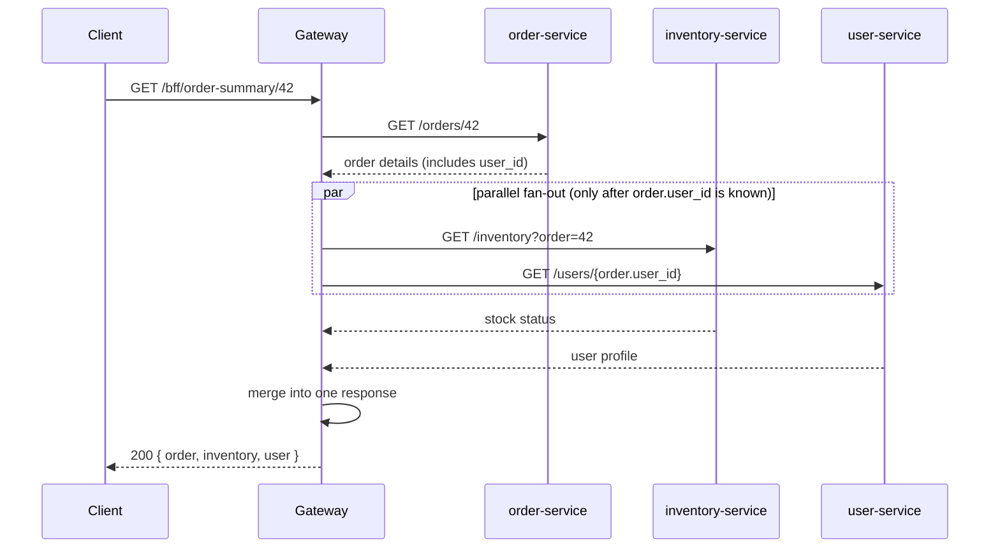
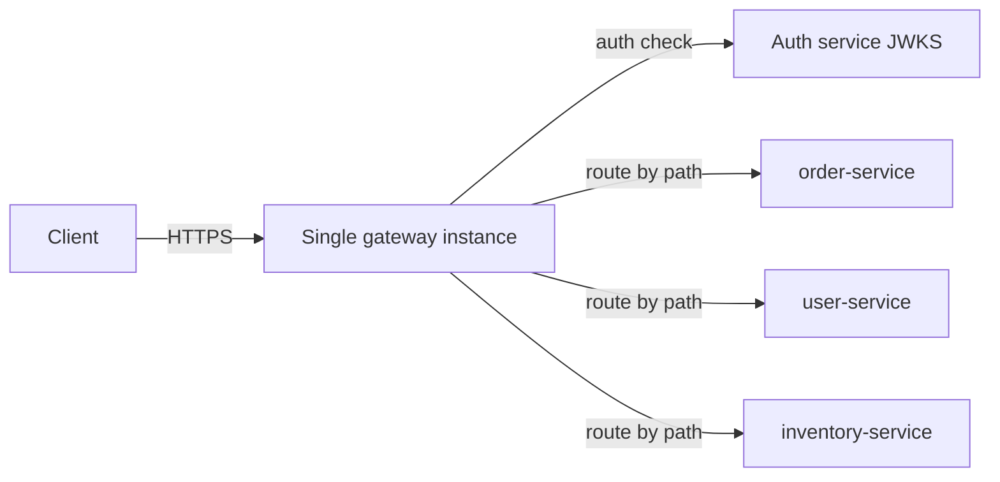
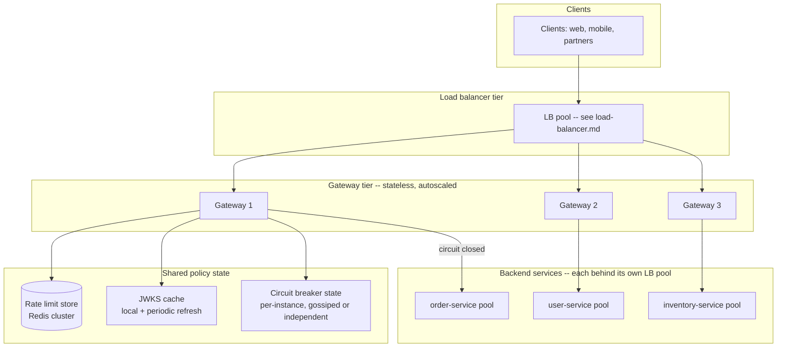

# Design: API Gateway

**Difficulty:** Senior | **Time:** 60–75 minutes

!!! note "Instructions"
    **Cover the solution sections** and work through each step yourself first. This exercise assumes you've already designed a [Load Balancer](load-balancer.md) and a [Rate Limiter](rate-limiter.md) — the gateway composes both, plus routing, auth, and circuit breaking, into one edge tier.

---

## 1. Problem Statement

Design an API gateway that sits in front of a set of backend microservices (orders, users, inventory, payments — pick your own decomposition). External clients (web, mobile, partners) talk only to the gateway; it authenticates the caller, routes to the correct backend service, enforces per-client rate limits, protects the fleet from unhealthy backends, and optionally aggregates multiple backend calls into one response for mobile clients. The gateway is now on the critical path of *every* request — treat its own availability as a first-class requirement, not an afterthought.

---

## 2. Clarifying Questions

Practice asking these before designing:

??? question "What questions should you ask?"
    - **Client types:** Public third-party API, first-party mobile/web, or both? Different auth and rate-limit needs.
    - **Routing basis:** Path-based (`/orders/*` → order-service), host-based (`orders.api.com`), or both?
    - **Auth model:** Who issues tokens? Does the gateway validate them, or forward to an auth service per request?
    - **Aggregation:** Do any endpoints need to fan out to multiple backends and merge responses (BFF pattern)?
    - **Protocol translation:** Does the gateway need to speak REST externally and gRPC internally?
    - **Backend churn:** Are backend instances added/removed frequently (autoscaling, deploys)?
    - **Latency budget:** How much added latency is acceptable at the gateway hop?
    - **Failure policy:** If a backend is down, fail fast with an error, or degrade gracefully with cached/partial data?

---

## 3. Functional Requirements

- Route each request to the correct backend service by path and/or host
- Authenticate the caller (validate token) before forwarding
- Enforce per-client, per-API-key rate limits
- Transform requests/responses (header rewriting, protocol translation, response shaping)
- Detect unhealthy backend services and circuit-break rather than forward to a known-bad target
- Support aggregation/fan-out for BFF-style composite endpoints
- Stay available and horizontally scalable — no single gateway instance is a hard dependency

## 4. Non-Functional Requirements

| Property | Requirement |
|----------|-------------|
| Added latency | < 10ms p99 for pass-through routing, < 50ms p99 for aggregation endpoints |
| Availability | 99.99% — every backend service is unreachable if the gateway layer is down |
| Scale | 150K requests/second, 50K distinct API keys active |
| Auth check cost | < 2ms p99 (token validation must not dominate the request) |
| Isolation | One noisy/broken backend must not degrade requests to unrelated backends |

!!! tip "Interview Insight 🎯"
    An API gateway is three separate concerns wearing one coat: **routing** (a reverse proxy problem), **policy enforcement** (auth, rate limiting — a control problem), and **resilience** (circuit breaking, retries — a distributed-systems problem). Naming which one you're solving in each part of the design reads as staff-level; conflating them into "the gateway does stuff" does not.

---

## 5. Capacity Estimation

```
Traffic:
  150K rps sustained, 5x peak -> 750K rps
  Avg backend call fan-out: 1.3 (most requests hit 1 service, some BFF endpoints hit 2-4)
  Effective backend-call rate: ~195K calls/sec at sustained load

Gateway compute:
  Auth (JWT signature verify, no network call): ~0.1-0.3ms CPU per request
  Routing + rate limit check + forward: ~1-2ms per request
  ~30-40K rps per gateway core (CPU-bound on TLS + JSON, similar to an L7 LB)
  150K rps / 35K rps-per-core ~= 5 cores sustained, provision for peak = ~25 cores

Rate limiter state (see rate-limiter.md for the full design):
  50K active API keys x 32 bytes (token bucket state) ~= 1.6MB -> trivially cached

Aggregation endpoints:
  Assume 10% of traffic is BFF fan-out, avg 3 backend calls, called in parallel
  Added latency = slowest of the 3 calls, not the sum -> budget backend p99, not p50

Config / route table:
  ~200 routes x 500 bytes each = 100KB, held in memory on every gateway instance
```

!!! tip "Interview Insight 🎯"
    Fan-out latency is `max(backend calls)` if done in parallel, `sum(backend calls)` if sequential. This single design choice is often the difference between a BFF endpoint meeting its SLO and blowing it by 3x — always state whether your aggregation is parallel and what happens when one leg is slow.

---

## 6. API Design

```
# External surface — what clients call
GET  /orders/{id}          -> routed to order-service
POST /users                -> routed to user-service
GET  /bff/order-summary/{id}
     -> gateway fans out to order-service + inventory-service + user-service,
        merges into one response

Headers required on every request:
  Authorization: Bearer <jwt>
  X-API-Key: <client-issued key>          # for rate limiting, separate from auth token

Headers the gateway adds before forwarding downstream:
  X-Forwarded-For, X-Request-Id
  X-User-Id, X-User-Roles                  # extracted from validated JWT claims
                                            # backends TRUST these — never re-parse the token

Response on auth failure:
  401 { "error": "invalid_or_expired_token" }
Response on rate limit:
  429 { "error": "rate_limit_exceeded" }, Retry-After: 3
Response on backend circuit open:
  503 { "error": "service_unavailable", "service": "inventory-service" }

# Control plane (internal, admin-auth only)
PUT  /internal/routes/{path_prefix}   { "service": "order-service", "timeout_ms": 500 }
PUT  /internal/api-keys/{key}         { "rate_limit": 100, "roles": ["partner"] }
```

!!! warning "Production Trap ⚠️"
    Passing `X-User-Id` downstream unauthenticated is a privilege-escalation bug waiting to happen — a backend service reachable *any other way* than through the gateway (internal tooling, a misconfigured mesh route) will trust a forged header. Backends must only accept these headers from a network path that is provably gateway-only (mTLS between gateway and services, or a private network with no other ingress).

---

## 7. Routing

=== "Path-based"
    `/orders/*` → order-service, `/users/*` → user-service, one public hostname. Simplest operationally — one DNS entry, one TLS cert. Route table is a prefix trie; longest-prefix-match wins. Works well when all services share a security/versioning posture.

=== "Host-based"
    `orders.api.shop.com` → order-service, `partners.api.shop.com` → a restricted partner-facing route set. Lets you apply different rate limits, auth requirements, or even different gateway *deployments* per audience (public vs partner vs internal) without path collisions. Costs more certs/DNS to manage.

=== "Header/version-based"
    `Accept: application/vnd.api+json;version=2` or a `X-API-Version` header selects a route variant. Useful for API versioning without URL churn, but push interviewers to ask whether this belongs at the gateway or one layer down — mixing routing logic with API version negotiation gets messy past 2-3 versions.

**Recommended:** path-based for internal service routing, host-based for splitting public/partner/internal audiences, each audience getting its own rate-limit and auth policy set.

---

## 8. Authentication and Authorization at the Edge

Keep this self-contained and practical — the gateway validates, it does not run a full identity provider.

```
Request arrives with: Authorization: Bearer <jwt>

Gateway auth path (no network call per request):
1. Parse JWT header -> get key id (kid)
2. Look up the matching public key from a LOCALLY CACHED key set
   (fetched from the auth service's JWKS endpoint periodically, e.g. every 10 min,
   NOT on every request -- this is the #1 latency trap in edge auth)
3. Verify signature against the cached public key
4. Check exp (expiry) and nbf (not-before) claims
5. Check iss (issuer) and aud (audience) match expected values
6. On success: extract claims (user_id, roles, scopes) -> set as
   X-User-Id / X-User-Roles headers, forward to backend
7. On failure (bad sig, expired, wrong issuer): 401, do not forward
```

```python
# sketch — signature + claims check, no network call on the hot path
def authenticate(token: str, jwks_cache: dict) -> dict | None:
    header = jwt.get_unverified_header(token)
    key = jwks_cache.get(header["kid"])
    if key is None:
        return None  # unknown kid -> force a JWKS refresh, then retry once
    try:
        claims = jwt.decode(token, key, algorithms=["RS256"],
                             audience="api.shop.com", issuer="auth.shop.com")
    except jwt.ExpiredSignatureError:
        return None
    except jwt.InvalidTokenError:
        return None
    return claims
```

**Authorization** (what the caller is allowed to do) stays coarse at the gateway — reject requests whose `scope`/`role` claim clearly doesn't cover the route (e.g. a `read-only` scope hitting a `POST`), and push fine-grained, resource-level authorization ("can this user edit *this* order") down to the owning service, which has the data to decide correctly. The gateway is a first filter, not the authorization system of record.

!!! warning "Production Trap ⚠️"
    Fetching the JWKS (public key set) on every request turns your auth service into the gateway's rate limiter, inverted — every request now depends on a network call to a service that was supposed to be out of the hot path. Cache keys locally with a TTL and background refresh; only force a synchronous refetch on an unknown `kid`, and rate-limit even that.

---

## 9. Rate Limiting Per Client

Full algorithm trade-offs (token bucket vs sliding window vs leaky bucket) and the Redis/Lua implementation live in [Design: Distributed Rate Limiter](rate-limiter.md) — reuse that design as a component here rather than re-deriving it.

What's specific to the gateway context:

- **Key is the API key or client id, not IP** — the same considerations from the rate limiter exercise apply (NAT/CGNAT collapse IPs). Extract the client identity from `X-API-Key` or from a validated JWT claim, not the connection's source IP.
- **Rate limit check happens after auth, before routing** — an unauthenticated request should get 401, not consume rate-limit budget meant for real clients.
- **Different tiers, same gateway:** free/paid/partner plans map to different `(rate, burst)` pairs looked up from the same quota config the rate-limiter design uses; the gateway is just the enforcement point, not the source of truth for plan limits.
- **Local admission first:** at gateway scale (150K rps across many stateless gateway instances), do the same local-token-slice optimization described in the rate limiter's V3.1 — hitting a shared Redis cluster on every single request at this volume is the same mistake twice.

---

## 10. Request/Response Transformation

| Transformation | Example | Why at the gateway |
|----------------|---------|---------------------|
| Header rewriting | Strip `Authorization`, inject `X-User-Id` | Backends trust gateway-asserted identity, never see the raw token |
| Protocol translation | External REST/JSON → internal gRPC | Backends standardize on gRPC internally without exposing it publicly |
| Response shaping | Strip internal fields (`internal_notes`) before returning to client | One enforcement point instead of every service remembering to filter |
| Compression | gzip/brotli response before returning to client | Offload from every backend; do it once at the edge |
| Error normalization | Map assorted backend error shapes to one consistent client-facing error envelope | Clients integrate against one contract, not N |

Keep transformation logic declarative (config-driven field mappings) rather than embedding per-route business logic in the gateway — the moment the gateway starts making product decisions instead of shape decisions, it has become an undeclared service with none of the ownership clarity of one.

---

## 11. Circuit Breaking to Unhealthy Backends

Full mechanics (states, thresholds, half-open probing) live in [Circuit Breakers](../reliability/circuit-breakers.md) — the gateway is the natural place to *host* per-backend-service circuit breakers, since it already sees every call to every service.

```
Gateway maintains one circuit breaker per downstream SERVICE (not per instance --
that's the load balancer's job, one layer down):

CLOSED (normal) --[error rate > threshold over window]--> OPEN
OPEN --[cool-down timer elapses]--> HALF_OPEN
HALF_OPEN --[trial requests succeed]--> CLOSED
HALF_OPEN --[trial requests fail]--> OPEN (reset cool-down)

While OPEN: gateway fails fast with 503 for that service's routes,
does NOT forward -- protects the already-struggling backend from more load
and gives the CALLER a fast, honest failure instead of a slow timeout.
```

This composes with the load balancer underneath: the LB (see [Design: Load Balancer](load-balancer.md)) already removes individual dead *instances* of a service from rotation; the gateway's circuit breaker acts one level up, protecting against an entire *service* being unhealthy (e.g. its DB is down, so every instance is slow) where per-instance health checks would just keep failing over between equally-bad instances.

!!! tip "Interview Insight 🎯"
    A common mistake: implementing circuit breaking *only* in the load balancer, per-instance. If all 20 instances of `payments-service` are unhealthy because its database is down, per-instance failover just round-robins the caller through 20 different flavors of timeout. A service-level circuit breaker at the gateway fails fast after the first few, instead of after twenty.

---

## 12. Aggregation / Fan-out for BFF-style APIs



Design rules for aggregation endpoints:

- **Fan out in parallel, not sequentially**, unless one call's output is a required input to another (e.g. need `order.user_id` before calling user-service — that leg is sequential, the rest aren't).
- **Per-leg timeout, shorter than the endpoint's overall SLO.** If the endpoint budget is 200ms, no individual backend call should be allowed to consume all of it.
- **Decide partial-failure policy per endpoint.** Order summary missing "inventory status" might degrade gracefully (return `null`, client shows "checking stock..."); missing the order itself is a hard failure. Don't apply one blanket policy to every aggregation endpoint.
- **Aggregation logic belongs in a distinct layer/service ("BFF layer") if it grows complex** — a gateway doing deep business-logic merging for a dozen composite endpoints is really a service wearing a gateway's clothes; keep the core gateway (routing/auth/rate-limit/circuit-break) generic and push heavy composition to purpose-built BFF services that themselves sit behind the gateway.

---

## 13. Basic Architecture (V1)



One gateway process: parses the route table, validates JWTs against a locally cached key set, forwards to the right backend. No rate limiting yet, no circuit breaking, no redundancy. Enough to demonstrate the routing and auth core.

---

## 14. Identify Bottlenecks

???+ question "Where does V1 break under real load and real failures?"
    - **Single gateway instance is a SPOF and a throughput ceiling** — exactly the same problem a [load balancer](load-balancer.md) has, because a gateway *is* an L7 load balancer with extra policy layers.
    - **No rate limiting** — one misbehaving or malicious client can consume the whole fleet's capacity; there's no per-client fairness.
    - **No circuit breaking** — if `inventory-service` starts timing out, the gateway keeps forwarding to it and every caller waits out the full timeout instead of failing fast.
    - **JWKS fetched inline** — if step 2 of auth becomes a synchronous per-request call to the auth service, the gateway's latency and availability are now coupled to a service that was supposed to be decoupled.
    - **Aggregation calls are probably sequential in a naive V1** — BFF endpoint latency is the sum of every backend call, not the max.

---

## 15. Scaled Architecture (V2)



The gateway tier is itself stateless and horizontally scaled behind a load balancer — the same pattern from [Design: Load Balancer](load-balancer.md) applies one layer up. Rate-limit counters live in a shared store (per [rate-limiter.md](rate-limiter.md)); circuit breaker state can be per-gateway-instance (each instance independently learns a backend is unhealthy within a few failed calls — slight redundancy in detection, but no shared-state dependency on the failure-detection hot path).

---

## 16. Failure Modes

=== "Gateway tier instance dies"
    - Same as any stateless service behind a load balancer: LB health check catches it, in-flight requests through that instance fail, new requests route around it.
    - **Mitigation:** N+1 headroom on gateway instance count, fast autoscaling, no gateway-local state that isn't reconstructible on a fresh instance.

=== "Auth service (JWKS source) is down"
    - Gateway's cached keys still work for existing tokens; new/rotated keys can't be fetched.
    - **Impact:** Requests signed with a key the gateway hasn't cached yet fail auth even though the token is valid.
    - **Mitigation:** Long JWKS cache TTL (10-60 min) with background refresh; serve stale keys rather than failing open or closed abruptly; alert on JWKS fetch failures well before the cache would expire.

=== "One backend service (e.g. inventory-service) is completely down"
    - Without a circuit breaker: every request routed there times out at the full timeout budget, backing up gateway threads/connections and potentially starving unrelated requests.
    - **Mitigation:** Per-service circuit breaker (Section 11) fails fast; bulkhead the connection pool per backend service so one exhausted pool doesn't starve calls to healthy services.

=== "Rate limiter store (Redis) is unavailable"
    - Gateway can't check quota before forwarding.
    - **Impact:** Fail-open floods backends with unmetered traffic; fail-closed rejects all legitimate traffic.
    - **Mitigation:** Same policy split as the rate-limiter exercise — fail-open with a conservative local emergency cap for low-risk routes, fail-closed for sensitive ones (payments, auth-adjacent); local token slices reduce how often this matters at all.

=== "Aggregation endpoint: one leg hangs"
    - `/bff/order-summary` calls 3 services in parallel; `inventory-service` never responds.
    - **Impact:** Without a per-leg timeout, the whole aggregated response hangs on the slowest/stuck leg.
    - **Mitigation:** Hard per-leg timeout well inside the endpoint SLO; treat timeout as a partial-failure input to the merge logic (Section 12), not as a fatal error for the whole request.

---

## 17. Consistency Considerations

- **Rate-limit counters are AP** — same reasoning as the rate limiter exercise: an occasional slightly-over-quota burst during a Redis failover is acceptable; incorrectly billing/blocking a client for traffic that never happened is not.
- **Circuit breaker state does not need to be globally consistent** — each gateway instance independently tripping its breaker for a given backend within a few requests of each other is fine; forcing synchronized breaker state across the fleet adds a coordination dependency for no real benefit.
- **Auth claims must be read-consistent within a token's lifetime** — once a JWT is issued, the gateway trusts its claims until expiry; if a user's role changes mid-session, that's an intentional trade-off (short token TTL + refresh) not a bug to fix at the gateway.
- **Route table changes need read-your-writes for operators** — after an admin `PUT`s a new route, the next deploy/test against it should see it, which means route config needs the same propagation discipline as backend membership in the load balancer exercise (push model, bounded lag, explicit sync state).

---

## 18. Observability

```
Key metrics:
- gateway_request_latency_p50/p95/p99 (by route)
- gateway_5xx_rate vs backend_5xx_rate (separate LB-tier faults from backend faults)
- auth_failure_rate (spike = credential stuffing or a client-side bug, worth distinguishing)
- rate_limit_deny_ratio (per API key tier)
- circuit_breaker_state{service} (closed/open/half_open per downstream)
- aggregation_leg_latency{endpoint, backend} (find the slow leg, not just the total)
- jwks_cache_age / jwks_fetch_failures

Alerts:
- gateway healthy_instance_count below N+1 threshold
- any circuit_breaker in OPEN state > 5 minutes (page — a whole service is down)
- auth_failure_rate > 5x baseline (possible credential stuffing)
- rate_limit_deny_ratio > 20% globally (you are the outage, same trap as the rate limiter)
- p99 latency on any aggregation endpoint > SLO
```

---

## 19. Cost Analysis

```
Gateway tier (25 vCPU sustained, autoscaled to peak):     ~$1,200/month
Rate limiter Redis cluster (shared w/ rate-limiter.md):    ~$800/month  (amortized)
Circuit breaker state: in-process, no extra infra          $0
JWKS cache: in-process, refreshed from auth service          negligible
Load balancer tier in front of gateway:                    ~$400/month
Total:                                                       ~$2,400/month

Cost per million requests:
  Monthly request volume: 150K rps x 2.6M sec/month = 390 billion requests/month
  $2,400 / 390,000,000,000 requests ~= $0.0000000062 per request (6.2 x 10^-9)
  ~= $0.0062 per million requests
  Aggregation endpoints cost ~3x more per request (3 backend calls) --
  worth tracking per-route cost if BFF traffic grows disproportionately
```

---

## 20. Alternative Architectures

=== "Managed API gateway (Kong, AWS API Gateway, Apigee)"
    Skip building routing/auth/rate-limiting yourself. Faster to stand up, built-in HA. Trade-off: less control over circuit-breaking behavior and aggregation logic, per-request pricing can dominate at high volume, and complex BFF-style fan-out often needs a custom Lambda/function anyway — you end up building the interesting part regardless.

=== "Service mesh instead of a centralized gateway"
    Push routing, retries, and circuit breaking to sidecars (Envoy) at each service, with a thin edge gateway only for external auth/rate-limiting. Removes the centralized gateway as a fan-out bottleneck for service-to-service calls; still need *something* at the edge for external clients, since a mesh is an internal-traffic pattern.

=== "GraphQL gateway instead of REST aggregation"
    Replace bespoke `/bff/*` aggregation endpoints with a GraphQL layer that lets clients specify exactly the fields/relations they need, resolved by per-type resolvers hitting backends. Removes the need to hand-build every composite endpoint; costs you N+1 query problems and harder rate-limiting (query *cost* varies per request, same complexity called out in the rate limiter exercise's GraphQL follow-up).

---

## 21. Staff Engineer Extensions

=== "100x Traffic"
    At 15M rps, a single gateway tier's CPU cost (mostly TLS + auth + JSON) becomes the dominant infra line item. Push auth token validation and coarse rate limiting to the CDN/edge layer where possible; shard the gateway tier by API key range or by service domain so no one gateway deployment needs global route-table knowledge; move from synchronous JWKS refresh entirely to a push-based key rotation notification so cold caches never happen under load.

=== "Cut Cost 30%"
    Move TLS termination and static rate-limit checks to a cheaper CDN/edge layer ahead of the gateway; consolidate circuit breaker and rate limiter state stores if they're separately provisioned; right-size gateway instance count to measured p99 rps with fast autoscaling rather than static peak provisioning, same lever as the load balancer exercise.

=== "Global Expansion"
    Each region runs its own full gateway stack (gateway tier + rate limiter store + JWKS cache), fronted by the same GSLB pattern from [load-balancer.md](load-balancer.md). Auth tokens must be valid globally (shared signing keys across regions, or regional issuers with cross-region trust) since a user's session shouldn't break because GSLB routed them to a different region mid-trip.

=== "Data Residency"
    Route EU-origin traffic exclusively to an EU gateway + backend stack via GSLB/host-based routing; rate-limit and auth state for EU clients stays in EU infrastructure. Aggregation endpoints must not silently call a non-EU backend instance as a fallback — route tables need residency awareness, not just health awareness.

=== "Regional Failure"
    If a region's backend fleet or gateway tier goes dark, GSLB stops directing traffic there (same mechanism as the load balancer exercise). In-flight aggregation requests with legs already dispatched to the dying region fail those legs; the partial-failure policy (Section 12) determines whether the client sees a degraded response or a hard error. Auth tokens issued by the failed region's issuer must still validate elsewhere if cross-region key trust was set up correctly — verify this in the failover runbook, don't assume it.

=== "Zero-Downtime Deploy"
    Roll new gateway instances behind the LB tier the same way as any backend fleet (see load-balancer.md's drain sequence) — readiness-gate new instances, drain old ones, never restart the whole tier at once. Route table and rate-limit config changes should be feature-flagged/percentage-rolled rather than applied atomically to 100% of the fleet, so a bad route config change is caught on 1% of traffic, not all of it.

---

## 22. Interview Follow-ups

1. **"Why validate JWTs at the gateway instead of each backend service?"** — One enforcement point, one place to get token validation correct, backends trust gateway-asserted identity via headers over a trusted network path instead of each reimplementing JWT parsing (and each potentially getting the expiry/audience check subtly wrong).
2. **"How is this different from a plain load balancer?"** — A load balancer picks a healthy instance; a gateway additionally authenticates, enforces policy (rate limits, quotas), transforms payloads, and can aggregate across services. A gateway is a load balancer plus a policy and composition layer — every gateway needs a load balancer underneath it, not the other way around.
3. **"What happens to an in-flight aggregation request during a gateway deploy?"** — If the gateway instance handling it is draining (Section on zero-downtime deploy), in-flight requests should complete before that instance is terminated; the LB tier stops sending *new* work to a draining gateway instance the same way it would for any backend.
4. **"How would you rate-limit the aggregation endpoints differently from simple pass-through routes?"** — Weight the rate-limit cost by the number of backend calls a route triggers (an aggregation endpoint costing 3x a simple GET), the same "cost per request varies" problem called out for GraphQL in the rate limiter exercise.

---

## Self-Assessment

- [ ] Can I explain why JWKS must be cached, not fetched per request?
- [ ] Can I justify circuit breaking at the gateway level vs only at the load balancer level?
- [ ] Can I design a partial-failure policy for a specific aggregation endpoint?
- [ ] Can I explain how the gateway tier avoids becoming its own single point of failure?
- [ ] Can I distinguish which parts of this design reuse the load balancer and rate limiter exercises verbatim, and which are gateway-specific?
