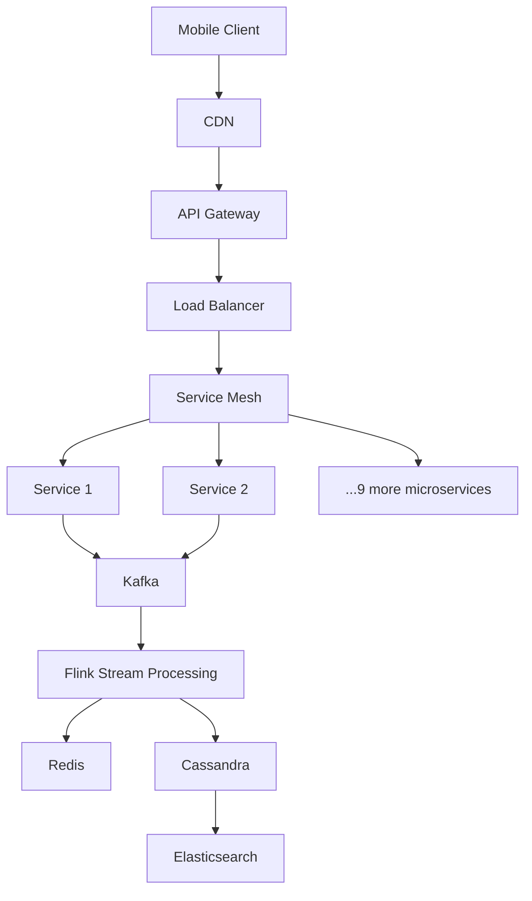
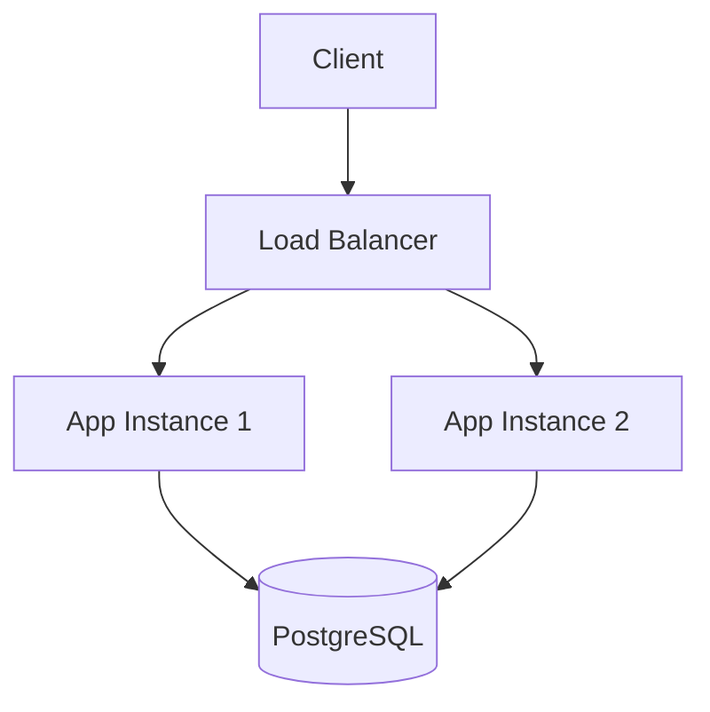

# Exercise: Architectural Subtraction

**Difficulty:** Senior / Staff | **Time:** 30–45 minutes

!!! note "This exercise runs backwards"
    Every other exercise in this section starts from nothing and earns each box. This one starts from a fully-built, plausible-looking architecture and asks you to defend deleting most of it. Both skills are senior-level — this one is rarer, and interviewers notice its absence: a candidate who only ever adds boxes hasn't shown they know what a box costs.

---

## 1. The Requirements

- 5,000 daily active users
- 20 requests/sec at peak
- 200 GB total storage, growing slowly
- Single region
- 99.9% availability target (≈ 8.7 hours of downtime/year is acceptable)

Hold these numbers in your head. Every component you evaluate below gets checked against them, not against what a large-scale system would need.

---

## 2. The Proposed Design

This is what a candidate — or a real team, padding a design to look impressive — proposed for the requirements above:



Twelve microservices, a service mesh, an event-streaming pipeline with a stream processor, three separate data stores. Nothing here is a bad technology — Kafka, Flink, Cassandra, and Elasticsearch are all excellent at what they do. The question is not "is this good engineering," it's **"does anything here eliminate a bottleneck that these requirements actually produce."**

---

## 3. Your Task

For every component, answer one question: **what breaks at 20 req/sec, 5,000 DAU, and 200 GB if this component is removed?**

If you cannot name a concrete failure — a specific saturated resource, a specific latency budget blown, a specific availability requirement unmet — the component doesn't belong. "It would help at scale" is not a justification; these requirements are not that scale.

??? question "Work through it yourself before expanding the solution"
    Go component by component: CDN, API Gateway, Load Balancer, Service Mesh, 12 microservices, Kafka, Flink, Redis, Cassandra, Elasticsearch. For each, write one sentence: keep or cut, and why.

---

## 4. Solution: What Survives

=== "CDN"
    **Cut.** A CDN caches content geographically close to users to reduce latency and origin load for static/cacheable assets at meaningful request volume. At 20 req/sec single-region, there is no origin-load problem to solve and no evidence of a global user base to justify edge presence. Revisit if the product adds a multi-region user base or heavy static asset delivery (images, video).

=== "API Gateway"
    **Cut, for now.** A gateway earns its place when you have many services that need centralized auth, rate limiting, or request routing across a nontrivial API surface. With a single application (see below), the app itself can do auth and rate limiting. Revisit if the service count actually grows past a handful and cross-cutting concerns start getting duplicated.

=== "Load Balancer"
    **Keep — but as a plain reverse proxy, not a fleet.** 99.9% availability with a single instance means every deploy and every crash is an outage. A load balancer in front of 2 app instances (for redundancy, not throughput — 20 req/sec is nothing) is the cheapest way to remove that single point of failure. This is the one piece of the "impressive" diagram that a small system actually needs, and it needs it for availability, not scale.

=== "Service Mesh"
    **Cut.** A mesh (mTLS between services, fine-grained traffic policy, service-to-service observability at scale) solves problems that only exist once you have many services calling each other under real load. With one application, there is no service-to-service traffic to manage.

=== "12 Microservices"
    **Cut down to one application.** Microservices solve organizational scaling (independent teams, independent deploy cadences) and specific runtime bottlenecks (one component needs to scale independently of the rest). Neither applies here: 20 req/sec doesn't saturate anything, and nothing suggests multiple teams. Twelve services also means twelve things to deploy, monitor, and keep available for a 99.9% target — that math gets harder, not easier, with more moving parts. A modular monolith gets the code organization benefits without the distributed-systems tax.

=== "Kafka"
    **Cut.** Kafka earns its place when you need to decouple producers from slow/unreliable consumers, fan out one event to many independent consumers, or buffer a write spike beyond what a synchronous path can absorb. At 20 req/sec there is no write spike to buffer and, with one application, no cross-service fan-out to decouple. A direct function call or a synchronous DB write does the same job with zero new failure modes (consumer lag, rebalancing, broker capacity) to operate.

=== "Flink"
    **Cut.** Stream processing exists to compute things continuously over unbounded, high-volume event streams. There is no stream here — Kafka was already unjustified, and Flink depends on Kafka's presence to make sense at all.

=== "Redis"
    **Cut, provisionally.** A cache earns its place when a specific, measured read path is both hot and expensive enough that a database can't serve it directly at the required latency/cost. At 20 req/sec, a correctly indexed PostgreSQL instance will serve reads with room to spare. Keep this one on a watchlist — of everything cut, it's the most likely to come back, and cheaply, if a specific query starts showing up slow in production.

=== "Cassandra"
    **Cut.** Cassandra buys write-heavy horizontal scalability and multi-region availability at the cost of weaker consistency and operational complexity (repair, compaction, tuning). 200 GB fits comfortably on a single PostgreSQL instance with room for years of the stated growth rate, with transactions and joins available for free.

=== "Elasticsearch"
    **Cut.** A dedicated search cluster earns its place when full-text search volume or corpus size makes a database's built-in search too slow or too limited. Nothing in the requirements mentions search at all — this component was justifying itself, not the requirements.

---

## 5. What's Left



One application (two instances for availability), one load balancer, one database. This serves the stated requirements with an enormous amount of headroom, a small number of failure modes, and a team that can understand the whole system by reading two files.

---

## 6. Now Defend the Cuts

A design review doesn't end at "I removed it." For each cut component, be ready to answer:

**What future constraint would bring it back?**

| Component | Comes back when... |
|---|---|
| CDN | Multi-region users, or heavy static/media asset delivery |
| API Gateway | Service count actually grows and cross-cutting concerns (auth, rate limiting) start duplicating across services |
| Service Mesh | Enough services exist that service-to-service traffic needs policy and observability of its own |
| Microservices | A specific component's load or team ownership genuinely diverges from the rest — not "we might grow" |
| Kafka | A specific write path needs to survive a burst beyond what a synchronous write can absorb, or a specific event needs independent fan-out to multiple consumers |
| Flink | Kafka is justified *and* there's a continuous computation over that stream that a periodic batch job can't do |
| Redis | A specific, measured query is both hot and too slow/expensive against the database directly |
| Cassandra | Write volume or storage genuinely exceeds what a well-tuned single-writer database can hold, with a workload that tolerates weaker consistency |
| Elasticsearch | Full-text search becomes a real product feature at a volume the database's native search can't serve |

---

## 7. A Bottleneck-Driven ADR, for Each Addition

When a cut component eventually comes back, don't just add it — write it down in this shape (a system-design-flavored variant of the standard [ADR](../foundations/adrs.md) format):

```markdown
Measured bottleneck:      [the specific metric that crossed a threshold]
Chosen mechanism:         [the component being added]
Alternative considered:   [what else could have solved it]
Why rejected:             [why the alternative was worse for this bottleneck]
New failure mode:         [what can now break that couldn't before]
Operational cost:         [what this adds to run/monitor/on-call]
Telemetry required:       [what you need to watch to know it's working / failing]
Removal condition:        [what would make this unnecessary again]
```

This format forces the same discipline as the subtraction exercise, in reverse: a component only gets added when there's a named, measured bottleneck to point at — and it comes with an honest ledger of what it costs, not just what it buys.

---

## 8. Self-Assessment

Try answering these at increasing depth — a senior candidate should be comfortable at all five levels:

1. **Explain:** What problem does a cache solve, in one sentence?
2. **Predict:** Traffic to this trimmed design doubles overnight while the database's capacity stays fixed. What breaks first, and what's the cheapest fix?
3. **Diagnose:** Six months later, one endpoint is consistently slow under load while everything else is fine. What's the likely cause, and what would you check first?
4. **Design:** Resolve that slow endpoint while preserving the system's current simplicity — don't reach for the whole rejected diagram at once.
5. **Defend:** Why is your targeted fix better than "just add Redis and Kafka in front of everything," given what you now know about what each of those costs to operate?

---

## Key Takeaways

- **A component earns its place by eliminating a *named* bottleneck at the *actual* scale — not by being good technology in general.**
- **"It would help at scale" is true of almost everything and justifies nothing** — the requirements in front of you define the scale, not the scale you might have someday.
- **The senior skill this exercise tests is subtraction, not addition.** Anyone can draw twelve boxes; defending zero of them is harder and rarer.
- **Every cut should come with a stated condition for reversing it** — that's what turns "we don't need Kafka" from a guess into a decision you can revisit on evidence.

**See also:** [Requirements & Capacity Estimation](../foundations/requirements-estimation.md) | [Architecture Decision Records](../foundations/adrs.md) | [System Design Framework](../foundations/framework.md)
