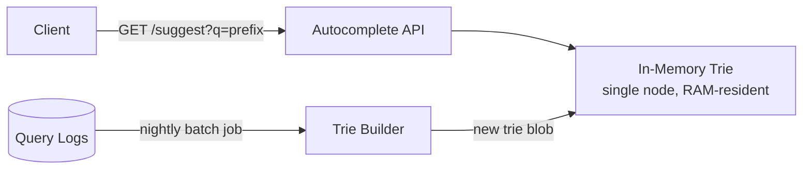
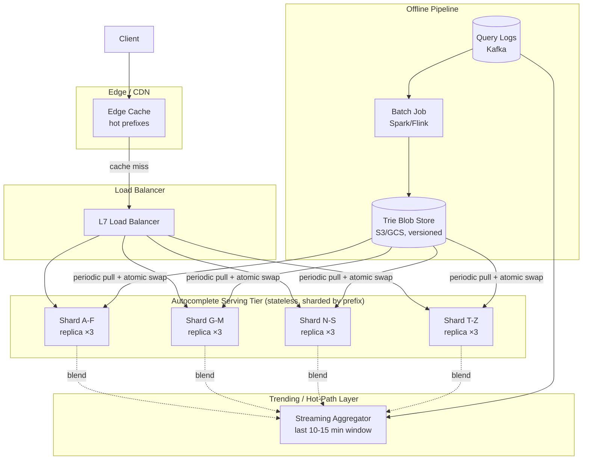

# Design: Autocomplete / Typeahead

**Difficulty:** Senior | **Time:** 60–75 minutes

!!! note "Instructions"
    **Cover the solution sections** and work through each step yourself first. Use "Hint" tabs if stuck. Practice explaining out loud — the way you communicate matters as much as the solution.

---

## 1. Problem Statement

Design a search-box autocomplete (typeahead) service like Google Search suggestions. As a user types into a search box, the service returns the top-K most likely completions of what they're typing, updated on every keystroke, fast enough to feel instantaneous.

---

## 2. Clarifying Questions

Practice asking these before designing:

??? question "What questions should you ask?"
    - **Scale:** How many distinct queries does the system see historically? How many keystrokes/second at peak?
    - **Latency:** What's the target — this is a per-keystroke UX feature, so how tight is "fast"?
    - **Freshness:** Do suggestions need to reflect trending queries within minutes, or is daily/hourly refresh acceptable?
    - **Personalization:** Are suggestions global (same for everyone) or personalized per user (search history, location)?
    - **Ranking signal:** Is it pure frequency, or do we weight by recency, click-through, or business rules (e.g., boosting certain results)?
    - **Language/locale:** Single language or multi-language with different tokenization rules?
    - **Cold start:** What do we return for a prefix nobody has searched before, or a brand-new trending query?
    - **Content moderation:** Do we need to filter offensive or sensitive completions?

---

## 3. Functional Requirements

- Given a prefix (partial query string), return the top-K (typically 5-10) most likely full query completions
- Suggestions update as the user types each additional character
- Suggestions reflect real-world query popularity (frequency-ranked)
- Optional: personalization, typo tolerance, trending-query boosts

## 4. Non-Functional Requirements

| Property | Requirement |
|----------|-------------|
| Latency | < 100ms p99 end-to-end per keystroke (network + lookup + render budget) |
| Availability | 99.99% — a broken autocomplete degrades UX on every search, on the critical path of the product |
| Read/Write ratio | Effectively read-only online (~10,000,000:1) — writes happen offline in batch |
| Scale | 10B distinct historical queries logged, 500K query-prefix lookups/second at peak |
| Freshness | Trending queries reflected within ~10-15 minutes; long-tail ranking refreshed daily |

---

## 5. Capacity Estimation

```
Query log volume:
  5B searches/day, average query length 20 characters
  5B / 86,400s ≈ 58,000 searches/second (avg), ~300K/s peak

Autocomplete lookups (far more frequent than searches — one per keystroke):
  Avg query = 20 characters typed → ~15-20 keystrokes trigger a lookup
  (client-side debouncing cuts this down, assume ~8 effective lookups/query after debounce)
  58,000 searches/s × 8 ≈ 460,000 lookups/second (avg), ~2M/s at peak with debounce+multiplier

Distinct query corpus (from logs):
  10B historical distinct queries, but power-law distributed:
  Top 100M queries cover >95% of real traffic — this is the number that matters for the served trie

Trie size:
  100M queries × avg 20 bytes (compressed prefix sharing across a trie is far denser than raw strings)
  Rough serving-index estimate: ~15-25 GB for a compressed trie of the top 100M queries + top-K per node
  Comfortably fits in RAM on a handful of nodes, or shardable across dozens for headroom

Bandwidth:
  Each response: top-10 suggestions × ~30 bytes avg ≈ 300 bytes
  2M lookups/s × 300 bytes ≈ 600 MB/s at peak — meaningful, but CDN/edge-cacheable for hot prefixes
```

!!! tip "Interview Insight 🎯"
    The load-bearing number here is the **10B raw queries vs. 100M served queries** gap. It tells the interviewer you understand the Zipfian/power-law nature of search traffic — you don't need to serve the tail of one-off typos and rare phrasings from a hot, low-latency index. That gap is exactly what justifies splitting this system into an offline batch layer (processes all 10B) and an online serving layer (serves only the dense head).

---

## 6. API Design

```
GET /api/v1/suggest?q={prefix}&limit=10
Response: {
  "prefix": "syst",
  "suggestions": [
    { "text": "system design interview questions", "score": 0.94 },
    { "text": "system design primer", "score": 0.81 },
    { "text": "systemd service file example", "score": 0.62 },
    ...
  ]
}
Status: 200 OK (empty suggestions array on no match, never an error)

GET /api/v1/suggest?q={prefix}&limit=10&user_id={id}
Response: same shape, blended with personalized signals (recent searches, location)

POST /api/v1/log-selection   (fire-and-forget, async)
Request: { "prefix": "syst", "selected": "system design interview questions", "position": 0 }
```

!!! note "Why suggestions are never an error"
    A `500` or empty state from autocomplete shouldn't ever block the user from just pressing Enter and searching for their raw input. Design the client to treat autocomplete as pure enhancement — timeout fast (e.g., 50ms) and fail open to "no suggestions shown," never block the search box.

---

## 7. Deep Dive: The Trie as the Core Data Structure

The natural fit for "give me everything that starts with this prefix, ranked" is a **trie (prefix tree)** — each node represents one character, and a path from root to node spells out a prefix. See [DSA Foundations](../dsa/foundations.md) for the trie data structure fundamentals (node structure, insert/search complexity) if you need a refresher; this section focuses on how it's adapted for ranked, served autocomplete at scale rather than the base data structure itself.

A plain trie only tells you *whether* a prefix exists. For autocomplete we need each node to already know its **top-K completions**, so a lookup is `O(prefix length)` to reach the node, then an `O(1)` read of a precomputed list — not a tree walk over every descendant at query time.

```
Node structure (serving-optimized trie):
{
  children: Map<char, Node>,
  top_k: [ {query: "system design...", score: 0.94}, ... ]   # precomputed, sorted
}
```

**Why precompute top-K per node instead of walking the subtree live?** A prefix like `"a"` can have millions of descendant queries. Walking that subtree on every keystroke, for every user, at 2M lookups/second, is not viable — even an `O(log n)` heap-based walk per request is too much aggregate CPU. Precomputing top-K at every node during the offline build turns the online read into a pointer-chase plus a constant-size list copy.

```
Build (offline, per node, bottom-up):
  top_k(node) = merge(node.own_query_score_if_terminal,
                       top_k(child) for child in node.children)[:K]
  # classic "merge K sorted lists, keep top K" — O(children × K) per node
```

This offline/online split — and *why* you can't recompute top-K live — is the single most important idea to say out loud early in this interview.

---

## 8. Deep Dive: Offline Build vs. Online Serving

=== "Why not compute live?"
    Computing "top 10 completions for this prefix" live, per request, means either (a) scanning every query matching the prefix and sorting — infeasible at 2M req/s with millions of candidates per popular prefix — or (b) maintaining a live-updated ranked structure under concurrent writes from every search happening system-wide, which turns a read-heavy problem into a write-contention problem on the hottest, most valuable part of the system. Neither is necessary: query popularity for a given prefix changes slowly (hours, not milliseconds), so recomputing it in a batch job and serving a frozen snapshot is both correct enough and vastly simpler.

=== "Offline: build the ranked trie"
    A batch pipeline (e.g., Spark/Flink job) runs periodically:

    1. Aggregate query logs over a trailing window (e.g., last 7 days, with recency weighting so today's queries count more than day-7's)
    2. Score each distinct query — base frequency count, decayed by recency, adjusted by click-through rate on past suggestions (from the `log-selection` endpoint)
    3. Build the trie bottom-up, computing and storing top-K at every node
    4. Serialize the trie to an immutable, versioned blob (e.g., `trie-v20260813-0300.bin`)
    5. Push the new blob to serving nodes; each node atomically swaps to the new version (load fully in the background, then flip a pointer — never serve a half-loaded trie)

=== "Online: serve read-only"
    Serving nodes hold the current trie **entirely in memory**, read-only. A request is: walk `O(prefix length)` characters down the trie, return the node's precomputed `top_k` list. No writes happen on the serving path at all — this is what makes sub-100ms, millions-of-req/s serving tractable. The only "write" a serving node ever does is atomically swapping in a new trie version pushed from the offline pipeline.

=== "Closing the freshness gap"
    A pure batch-every-few-hours pipeline misses genuinely new trending queries (a breaking news event) for hours, which is a real UX gap. Fix: run a **secondary hot-path counter** (e.g., a Redis sorted set or streaming aggregation over the last 10-15 minutes) that tracks queries spiking right now, and blend its top results into the response *on top of* the base trie's answer, rather than trying to rebuild the whole trie in real time. This gives near-real-time trending coverage without abandoning the batch-built trie for the 99% of traffic that doesn't need it.

---

## 9. Deep Dive: Ranking

| Signal | What it captures | Trade-off |
|--------|-------------------|-----------|
| Raw frequency | How often this exact query has been searched historically | Simple, stable, but slow to reflect new trends and ignores intent quality |
| Recency decay | Weight recent occurrences more than old ones (exponential decay over the aggregation window) | Keeps the corpus current; needs a decay half-life tuned per domain |
| Click-through rate | Of users shown this suggestion, how many selected it vs. kept typing or picked another | Better proxy for "was this actually useful" than raw search count, but requires the `log-selection` feedback loop and enough volume per query to be statistically meaningful |
| Personalization | Blend global top-K with the user's own recent searches / location / language | Improves relevance for the individual, but adds a second lookup (user history) and a merge step to every request — extra latency budget to spend carefully |
| Business boosting | Manually promote/demote specific completions (e.g., safety, legal, promoted content) | Necessary in practice; keep it as a small override layer on top of the ranked trie, not baked into the base scoring, so it can be changed without a full rebuild |

**Global vs. personalized:** the pragmatic default is to serve the global top-K trie for the vast majority of the latency-critical path, then optionally re-rank or blend in a small number of personalized candidates (from a much smaller, per-user recent-history structure) as a fast secondary step — not to build a separate full trie per user, which doesn't scale.

---

## 10. Basic Architecture (Version 1)



This handles moderate scale — one node holding the whole trie, rebuilt nightly. **Identify the bottleneck** before adding more components.

---

## 11. Identify Bottlenecks

???+ question "Where does this design break at 2M lookups/second?"
    - **Single node throughput:** one machine, however fast, tops out well below 2M req/s once you account for network handling, not just the trie lookup itself
    - **Single point of failure:** the whole autocomplete feature goes dark if that one node dies
    - **Memory ceiling:** the full top-100M-query trie may not comfortably fit alongside serving overhead on one box as the corpus grows
    - **Freshness:** a nightly-only rebuild misses same-day trending queries entirely
    - **Geographic latency:** users far from the single node's region pay round-trip latency that eats into the 100ms budget

---

## 12. Scaled Architecture (Version 2)



**Sharding the trie by prefix:** split the root's children across shards (e.g., `A-F`, `G-M`, `N-S`, `T-Z`, or finer-grained by two-character prefix as the corpus grows). A request for prefix `"syst"` routes only to the shard owning `s*`. This is different from consistent-hashing a random key — the shard boundary is chosen along the trie's own structure (alphabetic ranges), so the router just needs a static, small lookup table of prefix-range → shard, not a hash ring. Each shard is independently replicated (×3) for both throughput and availability.

**Caching hot prefixes:** short, extremely common prefixes (`"a"`, `"th"`, `"how"`) receive a disproportionate share of traffic. Front the serving tier with a CDN/edge cache and an in-process LRU cache on each serving node for the top few thousand prefixes — see [Cache Strategies](../performance/cache-strategies.md) for TTL and invalidation patterns. Since the underlying trie only changes on a batch swap (not per-request), cache TTL can safely be set to the batch refresh interval, and invalidated wholesale on each new trie version rather than per-key.

---

## 13. Failure Modes

=== "One Shard Down"
    - Requests for that prefix range fail or time out
    - **Mitigation:** ×3 replication per shard behind the load balancer; failed replica is removed from rotation by health checks; client falls back to "no suggestions" (fail open) rather than blocking search

=== "Trie Blob Store Unavailable"
    - New trie versions can't be pushed to serving nodes
    - **Mitigation:** serving nodes keep serving the last successfully loaded trie indefinitely — staleness degrades gracefully, it doesn't take the feature down; alert on "trie age > N hours" rather than failing requests

=== "Bad Trie Build (corrupted or garbage data)"
    - A buggy batch job pushes a trie with nonsensical or offensive suggestions
    - **Mitigation:** validate the built trie against a canary set of known-good prefixes before promoting it cluster-wide; canary-roll the new version to a small percentage of serving nodes first; keep the previous N versions available for instant rollback

=== "Hot-Path Aggregator Falls Behind"
    - The trending-query streaming layer lags or crashes
    - **Mitigation:** this is purely additive to the base trie — on failure, simply stop blending trending results and serve the base trie's top-K; never let the hot path be a hard dependency for the base response

=== "Thundering Herd on a Breaking-News Prefix"
    - A sudden spike (e.g., a major news event) sends enormous traffic to one specific prefix on one shard
    - **Mitigation:** same hot-key handling as any distributed system — edge/CDN caching absorbs most of it since the answer barely changes second-to-second; if needed, replicate that specific hot node's data across additional serving replicas temporarily

---

## 14. Consistency Considerations

- **Eventual consistency is the entire design, not a compromise.** The served trie is a point-in-time snapshot; it's stale by definition between builds. This is fine because "top completions for a prefix" doesn't need to be linearizable — no user is harmed by seeing a suggestion list computed 10 minutes ago.
- **Atomic version swap, not incremental mutation.** Serving nodes never partially apply a new trie — they load the new version fully off the serving path, then atomically swap the pointer. This avoids ever serving a torn/inconsistent read from a half-updated structure.
- **Selection logging is async and best-effort.** The `log-selection` call that feeds click-through ranking doesn't need to be durable per-event — losing a small percentage of these events under load has no user-visible effect and only marginally affects rank quality over the aggregation window.

---

## 15. Observability

```
Key metrics:
- suggest_latency_p50/p95/p99 (SLO: p99 < 100ms)
- suggest_empty_rate (percentage of requests returning zero suggestions — signals cold-start gaps)
- trie_age_seconds (time since current trie version was built — freshness signal)
- shard_request_distribution (detect skew — one shard getting disproportionate traffic)
- cache_hit_rate (edge + in-process)
- click_through_rate (selections / impressions, by rank position — feeds ranking quality)

Alerts:
- p99 latency > 150ms
- trie_age_seconds > 6 hours (batch pipeline stalled)
- suggest_empty_rate spikes (possible trie corruption or routing bug)
- any single shard > 2x average request rate (hot shard, needs rebalancing)
```

---

## 16. Cost Analysis

```
Serving tier (12 nodes: 4 shards × 3 replicas, r6g.xlarge, 32GB RAM):  ~$1,800/month
Edge/CDN caching (2M req/s peak, cache-offloaded):                     ~$600/month
Batch pipeline (Spark cluster, runs a few hours/day):                  ~$400/month
Streaming hot-path aggregator (small Flink/Kafka Streams cluster):     ~$300/month
Blob storage (trie versions, S3, with lifecycle cleanup):              ~$50/month
Total:                                                                  ~$3,150/month

Cost per lookup:
  $3,150 / (2.6M seconds/month equiv at avg load) — using avg 460K lookups/s:
  460K/s × 2.6M s/month ≈ 1.2B lookups/month → $3,150 / 1.2B ≈ $0.0000026 per lookup
```

---

## 17. Alternative Architectures

=== "Elasticsearch Completion Suggester"
    Use Elasticsearch's built-in FST-based completion suggester instead of a hand-rolled trie service. Gets you a mature, battle-tested implementation with less custom code. Trade-off: less control over custom ranking/blending logic (trending, personalization), and you inherit ES's operational overhead and cluster-management complexity for what is otherwise a narrowly-scoped read path.

=== "Precomputed Redis Sorted Sets per Prefix"
    Store `ZADD prefix:sy score query` for every prefix length up to some cap, and serve with `ZREVRANGE`. Simpler mental model, reuses existing Redis infrastructure. Trade-off: storage blows up fast (every prefix of every query is a separate key), and it doesn't naturally support the top-K-merge structure a trie gives you for free — better suited to a smaller corpus or as a bridge before building the dedicated trie service.

---

## 18. Staff Engineer Extensions

=== "100× Traffic"
    At ~46M lookups/second, edge/CDN caching becomes the primary lever — most traffic is a small set of very hot prefixes and should never reach the serving tier at all. Shard count grows (finer-grained prefix ranges), and each shard needs enough replicas to absorb its slice. The offline build pipeline itself doesn't need to scale 100× — corpus growth is much slower than traffic growth.

=== "Cut Cost by 30%"
    Push cache TTLs higher for less-volatile prefixes (rare/long-tail prefixes change rank far less often than the head), consolidate shard replica count from ×3 to ×2 in low-traffic regions with a documented availability trade-off, and move the batch pipeline to spot/preemptible compute since it's a scheduled, restartable job with no latency SLO of its own.

=== "Global Expansion"
    Each region builds and serves its own trie from its own regional query logs — completions are inherently locale- and language-specific, so this is a natural partition, not an added complexity. Cross-region replication of trie blobs isn't needed; only the offline pipeline's raw log ingestion might aggregate globally if you want to detect worldwide trends before they're locally significant.

=== "Data Residency"
    Query logs (which reveal what users searched) are sensitive under GDPR/regional privacy law. Keep raw logs and the derived trie for EU users built and served entirely within EU infrastructure; the batch pipeline runs per-region on region-local data rather than a single global job, reinforcing the same regional-split architecture used for expansion.

=== "Regional Failure"
    If a region's serving tier or its regional trie pipeline goes down, route that region's traffic to the nearest healthy region's serving tier as a degraded fallback (accepting slightly less locale-tuned suggestions over "no suggestions at all"), while the origin region's offline pipeline recovers and rebuilds.

=== "Zero-Downtime Ranking Algorithm Change"
    1. Build the new-algorithm trie alongside the existing one (dual-build, not dual-write, since this system has no online writes)
    2. Canary-serve the new trie to a small percentage of serving nodes / traffic
    3. Compare click-through rate and empty-result rate between old and new
    4. Roll forward gradually across shards and regions
    5. Keep the old trie version available for instant rollback until the new one is validated at full scale

---

## 19. Interview Follow-ups

1. **"How would you support typo tolerance (e.g., 'gooogle' → 'google')?"** — This is fundamentally a fuzzy-matching problem, not a prefix-matching one. Common approaches: generate a bounded set of edit-distance-1/2 variants of the typed prefix and probe the trie for each (cheap for short prefixes, expensive for long ones), or maintain a secondary phonetic/n-gram index (e.g., BK-tree or a symmetric-delete index) alongside the trie specifically for fuzzy lookups, falling back to it only when the exact-prefix trie returns few or no results.
2. **"How do you prevent offensive or manipulated completions?"** — A moderation/denylist layer sits between the ranked trie output and the response — filter or demote flagged terms at serve time (fast to update, no rebuild needed) in addition to excluding them at build time from the training corpus.
3. **"How would you personalize without a full per-user trie?"** — Keep a small, fast per-user recent-search list (a few hundred entries, cached in Redis or client-side) and merge it with the global trie's top-K at request time — a lightweight blend step, not a second trie.
4. **"What happens to ranking quality if click-through data is sparse for long-tail prefixes?"** — Fall back to raw frequency-only scoring below a minimum-impressions threshold; don't let a low-volume signal (CTR from 3 impressions) dominate over a stable one (frequency from 10,000 occurrences) — this is a general small-sample-size trap worth naming explicitly.

---

## Self-Assessment

- [ ] Can I explain why top-K is precomputed per trie node instead of walked live at request time?
- [ ] Can I justify the offline-build/online-serve split and what freshness gap it creates?
- [ ] Can I describe how the trie is sharded and why that differs from hashing a random key?
- [ ] Can I walk through what happens end-to-end when the batch pipeline is delayed for hours?
- [ ] Can I sketch at least one approach to typo tolerance without over-engineering the base design?
