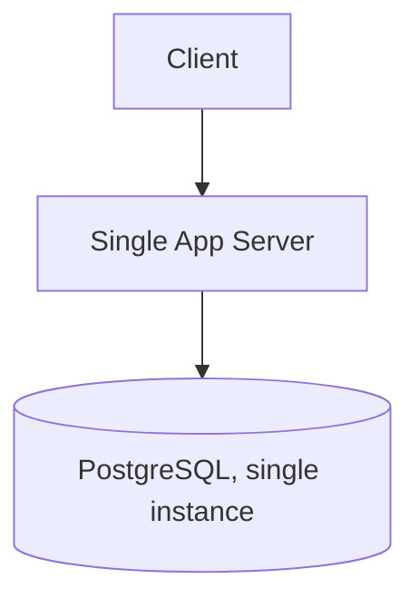
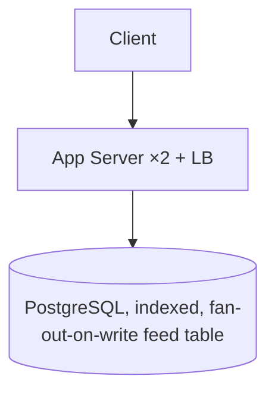
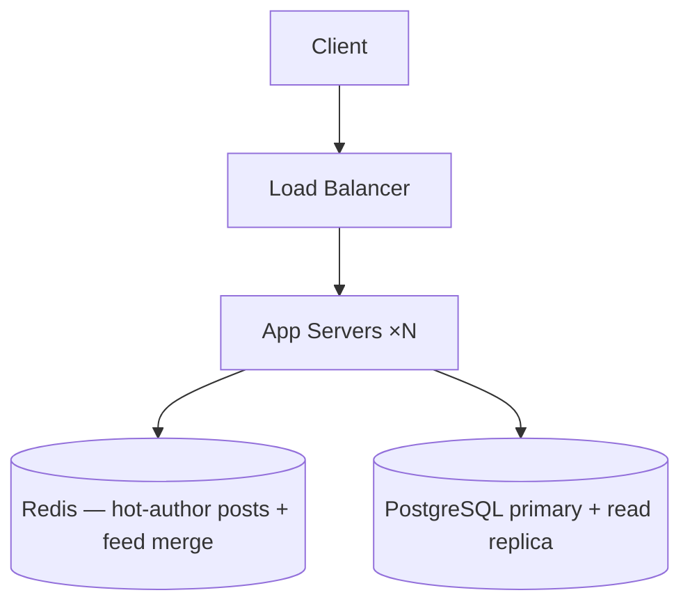
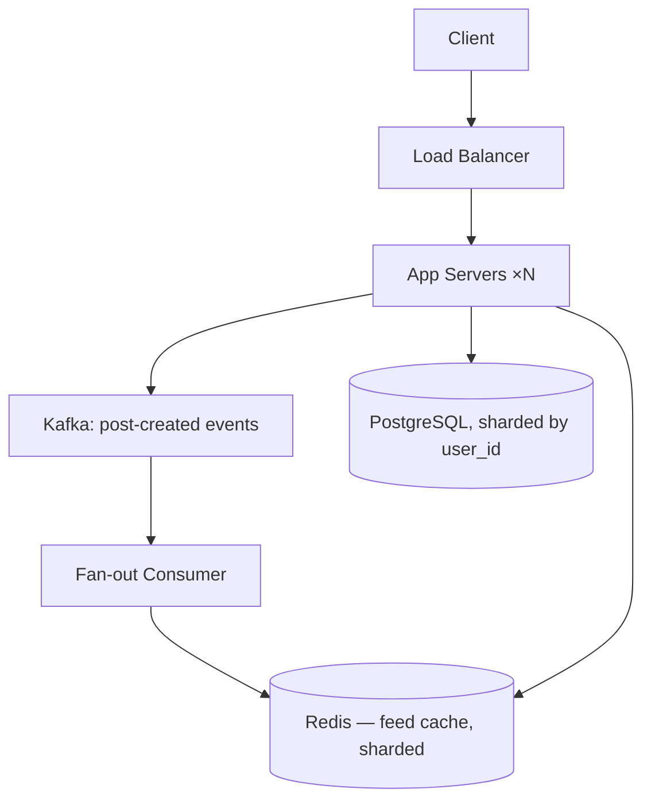
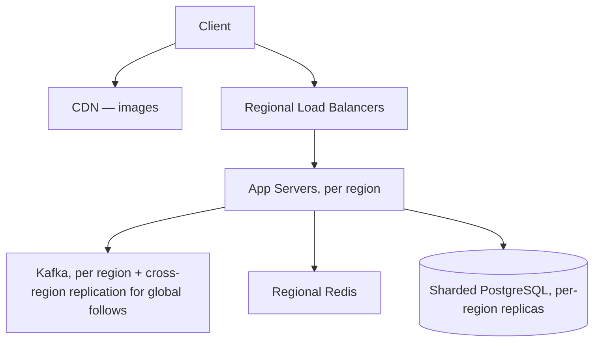

# Capstone: The Scaling Journey (1K → 100M Users)

**Difficulty:** Staff | **Time:** 2–3 hours (or one stage per sitting)

!!! note "This is the academy's exit exam"
    Every other exercise here designs one system at one scale. This one is the doctrine of the whole academy compressed into a single walkthrough: **start simple, estimate load, predict the bottleneck, observe failure, choose the minimal mechanism, name the new failure modes it introduces, measure the operational cost, and defend what you didn't add.** If you can do this five times in a row without reaching for a component you can't justify, you're ready for a Staff-level design interview.

---

## The Product

A blogging platform. Users write posts, other users read and comment on them. Deliberately boring — the point is not the product, it's the discipline of only adding what the numbers force.

**Fixed at every stage:** posts are text + images, comments are threaded one level deep, users follow authors and get a feed of new posts from who they follow.

---

## Definition of Done, Per Stage

Repeat this loop at every stage before moving to the next:

```
start simple
   ↓
estimate load
   ↓
predict bottleneck
   ↓
observe failure
   ↓
choose minimal mechanism
   ↓
identify new failure modes
   ↓
measure operational impact
   ↓
remove unjustified complexity
   ↓
defend tradeoffs
```

A stage is not "done" when the diagram looks impressive. It's done when you can say, out loud, which single number forced each box you added — and which boxes from the *next* stage you are deliberately not adding yet.

---

## Stage 1 — 1,000 Users

**Estimate:**
1,000 users, generously 10% DAU writing/reading daily → 100 DAU. At 2 posts read per session and a handful of sessions/day, this is comfortably under **1 request/sec** even at a generous peak multiplier. Storage: 1,000 users × maybe 20 posts × 2 KB each ≈ 40 MB. This is not a systems problem yet.

**Bottleneck:** none. There is no number here that a single machine can't absorb.



**What's deliberately not here:** a cache (nothing is hot enough to need one), a CDN (no meaningful static asset volume), a queue (nothing async needed), more than one app instance (no redundancy requirement stated yet — if 99.9% uptime matters even at this size, that's a load-balancer-plus-second-instance decision, not a scaling one).

**Defend it:** at this scale, every additional box is pure operational cost with no offsetting benefit. The interview mistake here is drawing microservices "because that's what a real system looks like" — a real system looks like whatever the load requires, and at 1K users that's one box.

---

## Stage 2 — 100,000 Users

**Estimate:**
100K users, 15% DAU → 15,000 DAU. Say 5 feed-reads/session, 1.5 sessions/day → ~110K reads/day ≈ **1.3 reads/sec average**, call it 5–10/sec at a 5× peak. Writes (posts + comments) are maybe 1/50th of reads. Storage grows to low GBs/year with images. Still not saturating anything on a modern single database — but a specific pattern starts to matter: the **feed read** is now the dominant query, and it's a join/scan across "posts by everyone I follow," not a lookup by ID.

**Bottleneck:** the feed query. A naive `SELECT * FROM posts WHERE author_id IN (following) ORDER BY created_at DESC` gets slower as follow-lists and post counts grow, and it's now running on every session.

**Mechanism:** add an index on `(author_id, created_at)`, and denormalize slightly — a `feed_items` table populated on post-create (fan-out-on-write for this user count is cheap; a "celebrity" problem doesn't exist yet because nobody has enough followers to make fan-out expensive). No cache yet — the working set of "recent posts from people you follow" doesn't repeat across users the way a global hot key would.



**New failure mode:** fan-out-on-write means a post-create now does N writes (one per follower) instead of one. For most users N is small; it's a footgun waiting for stage 3, not a problem yet.

**Deliberately not added:** Redis, a search service, a CDN, sharding. None of these numbers demand them yet.

---

## Stage 3 — 1,000,000 Users

**Estimate:**
1M users, 20% DAU → 200K DAU. Reads: 5 reads/session × 1.5 sessions ≈ 1.5M reads/day ≈ **17 reads/sec avg**, 100–170/sec peak. This is within a single well-tuned Postgres primary's range — the numbers alone don't yet force a new data store. What changes is **shape**: a small number of accounts now have thousands of followers, and fan-out-on-write for those accounts means a single post triggers thousands of writes.

**Bottleneck:** the hot-author fan-out-on-write spike, not aggregate read/write QPS.

**Mechanism:** hybrid fan-out — fan-out-on-write for normal accounts (still cheap), fan-out-on-read (merge at query time) for accounts above a follower threshold. Add a read-through cache (Redis) specifically for hot authors' recent posts and for the merged feed of users who follow them — this is the first cache in the system, and it's justified by a named hot path, not "caches are good practice."



Also add a **read replica** — read:write ratio is now lopsided enough that routing feed reads off the primary buys real headroom, and replication lag is tolerable for a feed (a few seconds of staleness on "new post appeared" is not a correctness problem the way a stale balance would be).

**New failure modes introduced:** cache staleness (a hot author's post can lag behind the DB — needs a short TTL or write-through invalidation), replica lag (a user might not see their own post immediately if routed to a lagging replica — mitigate with read-your-writes routing: read your own recent writes from the primary).

**Operational cost:** a cache is now a thing that can go down, get evicted under memory pressure, or serve stale data — it needs its own monitoring (hit rate, eviction rate) that didn't exist in stage 2.

**Deliberately not added yet:** sharding the database (a single primary + replica still has headroom at this QPS), a message queue (nothing here needs async decoupling — fan-out is synchronous and fast enough at this size), microservices (one app, still).

---

## Stage 4 — 10,000,000 Users

**Estimate:**
10M users, 25% DAU → 2.5M DAU. Reads ≈ 15M/day ≈ **170/sec avg**, 800–1,700/sec peak. Writes (posts + comments) maybe 300K/day ≈ 3.5/sec avg, single-digit hundreds at peak. The read replica + cache from stage 3 is now genuinely under pressure — not because the numbers are impossible for Postgres in the abstract, but because the **working set** (recent posts across millions of active follow-graphs) no longer fits comfortably in cache or in a hot in-memory index, and write volume plus fan-out-on-write for the long tail of medium accounts is now enough to want to decouple it from the request path.

**Bottleneck:** two, named separately — (1) write-path latency, because synchronous fan-out-on-write is now blocking post-create for a meaningful slice of users, and (2) database write capacity, because a single primary is now close to its ceiling for this write volume plus replication overhead.

**Mechanism:**
- Move fan-out-on-write off the request path into an async queue (Kafka or equivalent) — post-create writes the post and returns immediately; a consumer does the fan-out. This is the first place in the journey a queue earns its place: it exists specifically to decouple a slow, bursty, non-blocking-safe operation (fan-out) from a latency-sensitive one (post-create ack).
- Shard the posts/comments tables by `user_id` — write volume plus storage growth now justifies it; a single primary's write throughput is the actual measured ceiling, not a guess about future scale.



**New failure modes:** consumer lag (a post can take seconds to appear in followers' feeds under load — needs a lag alert, not just a queue-depth metric), a hot shard (one prolific or high-follower user's shard gets disproportionate load — needs the same salting/rebalancing discussion as any sharded system), and now genuinely two systems (queue + sharded DB) whose combined failure modes multiply rather than add.

**Operational cost:** on-call now needs to reason about consumer lag, shard hot-spotting, and cache-vs-DB staleness simultaneously — this stage is where the system stops being reasoned about by one person in an afternoon.

**Deliberately not added yet:** microservices (the app is still one deployable unit talking to a queue and a sharded DB — splitting it into services would add coordination overhead without removing a bottleneck), a dedicated search service (search hasn't been named as a requirement at any stage — don't add Elasticsearch because "big systems have it").

---

## Stage 5 — 100,000,000 Users

**Estimate:**
100M users, 25% DAU → 25M DAU. Reads ≈ 150M/day ≈ **1,700/sec avg**, 8,000–17,000/sec peak. This is the range where "benchmark before design" matters most — the actual ceiling depends on query shape, shard count, and cache hit rate, not a memorized number. Multi-region is now a real requirement too: a 100M-user product plausibly has meaningful DAU on multiple continents, and cross-continent RTT (~150ms) is now large enough relative to the latency budget to matter.

**Bottleneck:** cross-region latency for a global user base, plus the metadata/coordination overhead of a much larger shard count becoming its own bottleneck (this is the point where "horizontal scaling has no ceiling" stops being true in practice — shard count, rebalancing cost, and cross-shard query fan-out start dominating).

**Mechanism:**
- Regional read replicas / regional caches so most reads never leave the user's region; writes still go to a home region per user (avoids the multi-leader conflict-resolution problem from [Replication](../distributed-systems/replication.md) unless the product specifically needs multi-region writes for the same user).
- CDN for images now clearly earns its place — static asset volume at this scale is real, and cutting origin load and latency for it is a named, measured win.
- Elevate specific hot subsystems (feed generation, search if it's actually a requirement) into separately-scaled services **only if** they show independent load profiles from the rest of the app — not as a blanket "microservices at scale" move.



**New failure modes:** cross-region replication lag (a follow made in one region may take longer to be visible in another), regional outage handling (does a region failure degrade gracefully or take down global writes for its users?), and shard-rebalancing operations that are now big enough to be a scheduled, monitored event rather than a quick script.

**Operational cost:** this is now a platform, not an app — dedicated on-call rotations, regional dashboards, a rebalancing runbook, and a real incident-response process for partial-region failures.

**Deliberately not added even here:** a bespoke consensus system, a graph database for the follow-graph (unless a specific query pattern — "friends of friends," recommendation traversal — actually demands graph traversal Postgres/Redis can't do reasonably), or splitting into a dozen microservices "because that's what companies this size do." Every addition at this stage still has to answer the same question stage 1 asked: what breaks without it, at the load that's actually measured?

---

## What This Capstone Is Testing

Not whether you can name Kafka, Redis, sharding, CDN, and multi-region — every candidate at Staff level knows those words. It's testing whether you can say, for each one, **the specific number that justified it, the mechanism it replaced, the failure mode it introduced, and the stage before which it would have been premature.** A Staff-level graduate should be equally comfortable saying:

> "We do not need Kafka here."

and

> "We need Kafka because fan-out-on-write is now blocking the request path at 2.5M DAU, and a queue is the minimal mechanism that decouples it."

---

## Self-Assessment

For each stage transition (1→2, 2→3, 3→4, 4→5), answer:

1. **Explain:** What was the single number that changed between the two stages?
2. **Predict:** If that number is wrong by 5×, does the stage's mechanism choice still hold?
3. **Diagnose:** Given a graph of "requests/sec vs. p99 latency" that bends sharply upward at some point, which stage's bottleneck does that inflection point correspond to?
4. **Design:** Propose an alternative mechanism for that stage's bottleneck, and argue for or against it versus what was chosen.
5. **Defend:** Name one component from a *later* stage that a candidate might be tempted to add early, and explain exactly why it would be premature at the earlier stage's numbers.

**See also:** [Architectural Subtraction](architectural-subtraction.md) | [Requirements & Capacity Estimation](../foundations/requirements-estimation.md) | [Replication](../distributed-systems/replication.md) | [Sharding](../databases/sharding.md) | [Kafka](../messaging/kafka.md)
