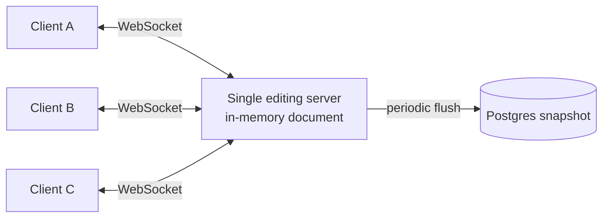
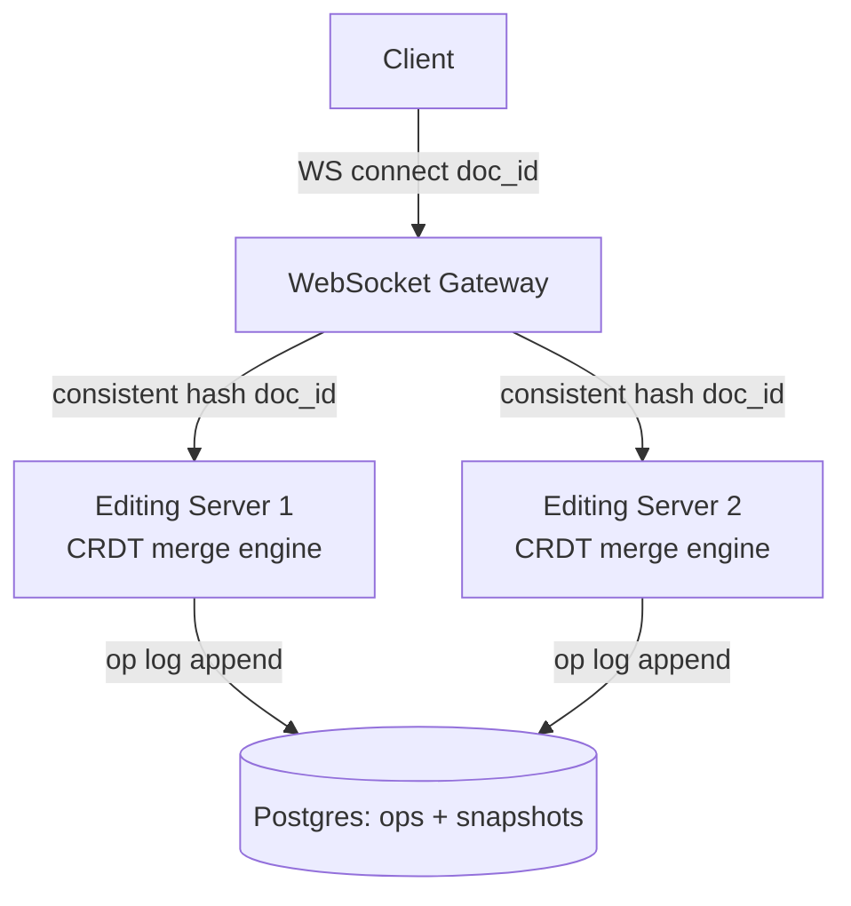
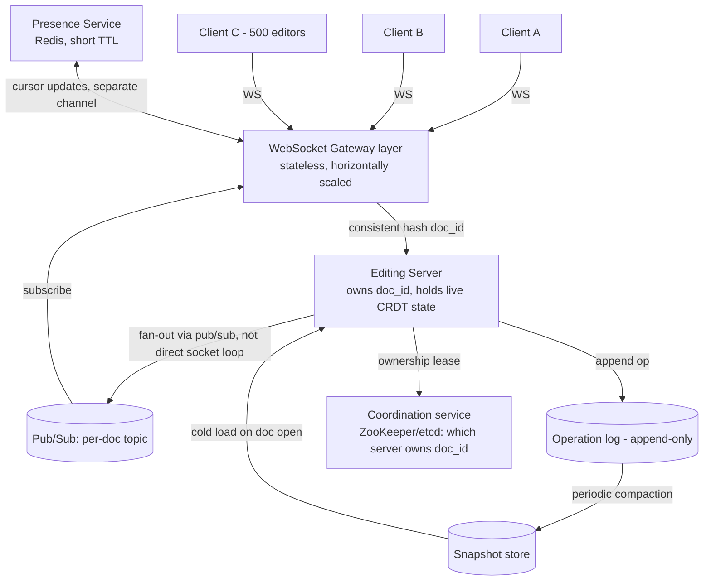

# Design: Collaborative Document Editor (Google Docs)

**Difficulty:** Senior → Staff | **Time:** 60–75 minutes

!!! note "Instructions"
    Cover each section and work it yourself first. Before every "Version N" reveal there is a `???` box — commit to an answer before you open it. This exercise leans hard on [CRDTs](../architecture-patterns/crdts.md) — read that page's RGA section before Version 2 if you haven't already; this page will not re-derive the algorithm, only decide where it lives in the architecture.

---

## 1. Problem Statement

Design a collaborative document editor like Google Docs: multiple users open the same document and type simultaneously, each seeing the others' keystrokes appear in near-real time, with visible cursors showing where everyone else is working.

Every other exercise on this site is either **request/response** (rate limiter, pastebin) or **eventual convergence of independent writes made at different times** (a CRDT counter that syncs on reconnect). This is neither. Two users can be typing in the *same paragraph, at the same moment*, and both edits must land, in an order every client agrees on, within about 100ms of being typed — with no central server holding a lock and no user ever seeing their keystroke silently vanish because someone else typed first. The problem is not "the data eventually agrees." It's "the data is being mutated by multiple writers *right now*, live, in front of both users' eyes, and it still has to converge."

Do not reach for "just use a database with row locking." A lock held for the duration of a keystroke destroys the product — nobody will type through 100ms locks contested by a stranger.

---

## 2. Clarifying Questions

??? question "What questions should you ask?"
    - **Granularity:** Character-level operations, or line/block-level (like Notion's block model)? Assume character-level plain text first; rich text/formatting is a follow-up.
    - **Concurrency scale:** How many simultaneous editors on one document — 2, 20, or 500 (a doc shared to a whole company)?
    - **Offline support:** Can a client keep editing while disconnected and merge later, or is this strictly online, always-connected?
    - **Cursor/presence:** Do we need to show *where* other people are (cursor position, selection, name/color), or just the merged text?
    - **History:** Does the product need version history / "who wrote this line" (blame), or just current state?
    - **Consistency for the typist:** Must a user always see their *own* keystrokes instantly, even before the round trip to the server confirms them? (Yes — local echo is non-negotiable for typing to feel responsive.)
    - **Durability:** If the server crashes mid-session, how much unsaved typing is acceptable to lose — none, or a few hundred ms?
    - **Scale:** Documents created per day, average concurrent editors per active doc, peak "viral doc" fan-in?

---

## 3. Functional Requirements

- Multiple users open the same document and edit concurrently
- Every keystroke from any editor is visible to all other connected editors, in a consistent merged order
- Show live cursor position and selection range for each connected user
- Local edits appear instantly for the typist (no waiting on the network)
- Reconnect after a brief disconnect without losing local unsynced edits or duplicating them
- Persist the document so it survives server restarts and can be reopened later

## 4. Non-Functional Requirements

| Property | Requirement | Reasoning |
|----------|-------------|-----------|
| Concurrent edit convergence | All connected clients converge to the *same* text within ~100ms of any keystroke, even with two people typing in the same region simultaneously | This is the product — "feels real-time" and "never loses a keystroke" are both hard requirements, not one traded for the other |
| Local echo latency | < 16ms (one frame) for the typist's own input | The user must never feel their own typing lag, regardless of network state |
| Presence/cursor freshness | Cursor positions refresh at ~20–30Hz per active user, staleness tolerated up to ~200ms | Cursors are UX sugar, not correctness-critical — can degrade gracefully under load, unlike the text itself |
| Availability | A single slow/reconnecting peer must not block anyone else's typing | No client-side lock-step; degrade that one client's view, not everyone's |
| Durability | No committed keystroke is lost on a server crash; at most the last few hundred ms of unpersisted ops | Losing a user's paragraph to a server restart is a trust-ending bug |
| Scale | 5M documents opened/day, up to 500 concurrent editors on a single viral doc | Fan-out per document, not just aggregate request rate, drives the design |

!!! tip "Interview Insight 🎯"
    Say the sentence that reframes the whole problem out loud: *"this isn't eventual consistency, it's real-time consistency with no coordinator."* Every prior exercise on this track (rate limiter, pastebin) either serializes through one store or tolerates staleness. Here staleness beyond ~100ms is a visibly broken product, and a coordinator (global lock) is a UX-killing bottleneck. That tension — low latency *and* strong convergence *and* no lock — is what makes CRDTs (or OT) the answer instead of "just use Postgres transactions."

---

## 5. Capacity Estimation

```
Documents:
  5M documents opened/day
  Avg session length: 8 minutes → ~800K documents "open" concurrently at peak (rough, power-law skewed)
  Of those, most are single-editor (someone alone in a doc) — only a fraction are truly multi-editor

Concurrent editing sessions (the interesting number):
  Assume 5% of open documents have >=2 concurrent editors → ~40K actively co-edited docs at peak
  Avg concurrent editors per actively co-edited doc: ~2.5
  Viral tail: ~50 documents at any moment with 100-500 concurrent editors (all-hands doc, shared spec)

WebSocket connections at peak:
  ~800K open docs × ~1.3 avg connections/doc (most solo, some multi) ≈ 1M concurrent WebSocket connections

Keystrokes:
  Average typist: ~5 keystrokes/second while actively typing, but only ~20% of connected time is active typing
  1M connections × 5 keys/s × 20% active ≈ 1M operations/second system-wide at peak (before batching)
  Batched into ~50ms send windows client-side → ~20 op-batches/second/active typist, not 5 raw sends/s

Presence/cursor updates:
  ~200K actively-in-a-shared-doc users × 5 updates/s (200ms cadence) = 1M presence msgs/s
  Presence is far higher volume than the text ops themselves and must NOT compete with them for bandwidth/priority

Storage:
  Avg document: 20 KB of text, plus operation log
  5M new/edited docs/day × ~5 KB of new ops/day/doc ≈ 25 GB/day of raw op-log before compaction
  Snapshot-compacted storage: ~5M docs × 20 KB ≈ 100 GB total resident text
```

!!! abstract "Mental Model"
    You are not scaling a request queue. You are scaling **a live, mutable, shared object with a fan-out of up to 500 simultaneous writers-and-readers**, where every participant needs a consistent view within one human-perceptible instant. The number that should worry you is not total documents — it's concurrent editors on a *single* document, because that's the fan-out one server instance must broadcast to.

---

## 6. API Design

```
# Open a document / establish the real-time channel
WS  /v1/docs/{doc_id}/connect
    → on connect: server sends { "snapshot": "...", "version": 4821, "presence": [...] }
    Client then sends and receives operations over this socket for the session's duration.

# Client → server: an edit operation (batched, not one frame per keystroke)
{
  "type": "op",
  "doc_id": "abc123",
  "client_id": "u42-session9",
  "base_version": 4821,
  "ops": [ { "insert": "h", "pos_id": "<crdt-position-id>" }, ... ]
}

# Server → all connected clients (including a version for the sender's own reconciliation)
{
  "type": "op_broadcast",
  "doc_id": "abc123",
  "from": "u42-session9",
  "ops": [ ... ],
  "version": 4822
}

# Presence — separate, lower-guarantee channel, same socket
{ "type": "presence", "client_id": "u42-session9", "cursor_pos": 118, "selection": [118, 130], "color": "#3a7" }

# REST — document lifecycle, not the hot edit path
POST /v1/docs                          → create, returns doc_id
GET  /v1/docs/{doc_id}                 → latest snapshot (for non-realtime preview / SEO / export)
GET  /v1/docs/{doc_id}/history         → version snapshots for time-travel
```

!!! warning "Production Trap ⚠️"
    Sending one WebSocket frame per keystroke sounds "most real-time" but destroys the 100ms budget under load — 500 concurrent typists each firing a raw per-key frame is 2,500 msgs/s fan-out *per document* before you've broadcast anything. Batch client-side into ~30–50ms windows; you lose nothing perceptible and cut message volume by an order of magnitude.

---

## 7. Data Model

Same split instinct as [Pastebin](pastebin.md) — separate the hot mutable object from its durable record — but here the "hot object" is actively being co-mutated, not just read.

```sql
-- Durable snapshot: the document as of the last compaction point. Not the hot path during active editing.
CREATE TABLE document_snapshots (
    doc_id        VARCHAR(32) PRIMARY KEY,
    content       TEXT NOT NULL,           -- or CRDT-serialized structure, not raw text, if compaction keeps CRDT metadata
    version       BIGINT NOT NULL,         -- monotonic, matches last applied op in the log
    updated_at    TIMESTAMPTZ NOT NULL
);

-- Operation log: append-only, replayable, source of truth between snapshots
CREATE TABLE doc_operations (
    doc_id        VARCHAR(32) NOT NULL,
    version       BIGINT NOT NULL,         -- monotonic per doc
    client_id     VARCHAR(64) NOT NULL,
    op_payload    JSONB NOT NULL,          -- CRDT op: {insert/delete, position_id, value}
    applied_at    TIMESTAMPTZ NOT NULL,
    PRIMARY KEY (doc_id, version)
);
```

```
Presence: ephemeral, never persisted to durable storage.
  presence:{doc_id} → Redis hash, one field per connected client_id
    { cursor_pos, selection_range, color, display_name, last_seen_ts }
  TTL'd aggressively (2-3s) — a disconnected client's cursor should vanish fast, not linger as a ghost.
```

The operation log is the CRDT's real substance — it's what lets a reconnecting or newly-joining client replay from a snapshot to current state, and what makes "two edits landed in the same region" resolvable instead of a last-writer-wins coin flip.

---

## 8. Version 1 — simplest thing that works

One server process holds the document in memory. Every connected client's WebSocket routes through it. Edits broadcast to everyone else. Conflicting edits: last-writer-wins by arrival order at the server.



```python
# V1 — single process, last-writer-wins on overlapping edits
class DocSession:
    def __init__(self, doc_id, initial_text):
        self.text = initial_text
        self.clients = {}   # client_id -> websocket

    def apply_edit(self, client_id, pos: int, insert: str, delete_len: int):
        # last writer wins: whoever's edit reaches this line last simply
        # mutates self.text at `pos` as given, with no regard for what
        # another concurrent edit already did to the indices around it
        self.text = self.text[:pos] + insert + self.text[pos + delete_len:]
        self.broadcast(client_id, pos, insert, delete_len)

    def broadcast(self, from_client, pos, insert, delete_len):
        for cid, ws in self.clients.items():
            if cid != from_client:
                ws.send({"pos": pos, "insert": insert, "delete_len": delete_len})
```

This works for the demo: two people, low latency, edits in different parts of the document. Ship it behind a flag for small teams before adding any infrastructure.

---

## 9. Identify the bottleneck

???+ question "Two people type in the same sentence at the same moment. What breaks, and separately, what happens at 50 concurrent editors?"
    - **Correctness bug, not a scale bug:** if A inserts at position 10 and B, concurrently (before seeing A's edit), also inserts at position 10, both operations were computed against the *same* `pos` in the *pre-edit* string. Applying B's edit after A's shifts everyone's downstream text into the wrong place, or — worse — B's edit silently overwrites the range A just typed into, because "last write wins" was never designed to represent "both of these are valid, apply both." **A keystroke can vanish with no error, on two devices typing normally in the same paragraph.** This is the CRDT counter's "likes disappear" failure mode from a moment ago, except now it happens to a human's real-time typing in front of their eyes.
    - **Single point of failure:** the server holding `self.text` in memory is the *only* copy while it's running. It crashes, every connected client loses in-flight edits and the session state.
    - **Ceiling on concurrent docs:** every open document lives on exactly one process's memory and CPU. A viral doc with 500 editors pins one process broadcasting O(n²)-ish fan-out (every edit relayed to every other client) while every *other* document is fighting the same process for CPU if you're naively running one process per fleet node rather than per-doc isolation.
    - The lesson: fix correctness first. A perfectly available, perfectly scaled system that still drops keystrokes under concurrent typing is not a smaller version of the right system — it's the wrong system.

---

## 10. Version 2 — CRDT-based merge and horizontal sharding

**The core fix: replace "apply blindly, last write wins" with a merge function that makes concurrent edits at the same position both survive, deterministically, on every replica.** Two established approaches exist:

- **Operational Transformation (OT):** the original Google Docs approach. Every operation is transformed against every concurrent operation it might have raced with, so it can be reapplied correctly regardless of arrival order. Requires a central server to establish a canonical operation order (or a carefully specified transform function per operation pair) — the transform functions are notoriously easy to get subtly wrong, and correctness has historically required extensive testing against adversarial interleavings.
- **CRDT (specifically an RGA-family sequence CRDT):** each character gets a unique `(replica_id, logical_counter)` identity plus a reference to its logical predecessor, as covered in [CRDTs — RGA](../architecture-patterns/crdts.md#concrete-crdt-types). Concurrent inserts at the same position are ordered by a deterministic tie-break rule every replica applies identically, so both A's and B's characters survive, in a consistent order, with **no central server required to establish canonical order** — merge is just "apply the op, compare IDs on ties."

**Recommendation for a from-scratch design: CRDT (RGA).** OT is what Google Docs shipped in 2010 because CRDTs for text were less mature then, but for a new system today, CRDT is the more robust choice — the merge logic is a local, structural comparison instead of a transform function that must be proven correct against every pairwise operation interleaving, and it degrades gracefully to offline/async use (a client can queue ops locally and merge on reconnect using the *same* merge function used for live typing, which OT does not give you for free). See [CRDTs](../architecture-patterns/crdts.md) for the full mechanics — this page won't re-derive `(replica_id, counter)` tie-breaking here.

**Horizontal scaling: shard documents across editing server instances.** One process can no longer hold every open document. Route each `doc_id` to an owning server via [consistent hashing](../databases/consistent-hashing.md) — adding or removing editing servers reshuffles only `~1/N` of documents instead of every open session, which matters because a full reshuffle would disconnect every active editor simultaneously.



```python
# V2 sketch — RGA insert, replica-tagged, deterministic tie-break
def apply_insert(doc: RGA, op: InsertOp):
    # op.id = (replica_id, logical_counter); op.after = predecessor element id
    # concurrent inserts with the same `after` are ordered by comparing
    # (replica_id, logical_counter) — every replica applies the same rule,
    # so A's and B's concurrent characters both land, in the same order everywhere
    doc.insert_after(op.after, op.id, op.value)
```

Two clients typing in the same spot at the same moment never blindly overwrite each other — both inserts land, and the tie-break rule is what guarantees every replica orders them identically without asking a server which one "won":

```mermaid
sequenceDiagram
    participant CA as Client A (replica_id=A)
    participant CB as Client B (replica_id=B)
    participant ES as Editing Server (CRDT merge)

    note over CA,CB: both start from the same base state,\ncursor at the same position (after element X)

    CA->>ES: InsertOp { id: (A, 7), after: X, value: "!" }
    CB->>ES: InsertOp { id: (B, 4), after: X, value: "?" }

    ES->>ES: apply (A,7) — no existing child of X yet, insert
    ES->>ES: apply (B,4) — X already has child (A,7); both are\nconcurrent inserts "after X" — tie-break by comparing\n(replica_id, counter): B < A, so (B,4) sorts before (A,7)
    note over ES: deterministic order: X -> (B,4) "?" -> (A,7) "!"

    ES-->>CA: broadcast (B,4) "?" (A already has its own op)
    ES-->>CB: broadcast (A,7) "!" (B already has its own op)

    note over CA,CB: both clients apply the same tie-break rule locally\nand converge to identical text: ...X?! — no coordinator involved,\nand no server-imposed "who typed first"
```

---

## 11. Identify the next bottleneck

???+ question "A company all-hands doc hits 500 concurrent editors. Separately, a doc has been open and edited for 6 months straight. What breaks?"
    - **500 concurrent editors, one shard:** even with correct CRDT merge, one editing server instance broadcasting every op to 500 sockets is O(n) fan-out per keystroke — at even modest typing rates this saturates one process's outbound bandwidth and event loop. Consistent hashing put the *document* on one server; it did nothing to spread *fan-out* for that single hot document across servers.
    - **Unbounded operation log:** a document edited daily for 6 months accumulates an operation for every keystroke ever typed, forever, if nothing compacts it. Replaying the full op log to reconstruct state for a new client joining today means replaying months of history before they see the current text — latency that grows without bound over the document's lifetime, and storage that grows the same way.
    - Both are scale bugs this time, not correctness bugs — Version 2 got correctness right; Version 3 has to get fan-out and log growth under control.

---

## 12. Version 3 — production architecture



Key production decisions:

- **WebSocket gateway is stateless and separate from the editing server.** Gateways terminate client connections and route to whichever editing server owns the doc's shard; they hold no document state, so they scale independently of document count and can restart without affecting document ownership.
- **Fan-out via pub/sub, not a direct per-socket loop on the editing server.** At 500 concurrent editors, having the editing server iterate 500 socket writes itself blocks it from processing new incoming ops. Publish merged ops to a per-document topic; gateways holding connections to that doc's clients subscribe and push to their own sockets. This decouples "how many editors" from "how much CPU the merge engine itself burns."
- **Ownership lease via a coordination service**, not just a hash ring lookup — a hash ring tells you *which* server *should* own a doc, but you still need a lease (ZooKeeper/etcd, similar to leader election) to guarantee exactly one server actually holds authoritative in-memory state for it at a time, so a network hiccup doesn't produce two servers both believing they own the same document and diverging.
- **Periodic compaction of the operation log into snapshots** (e.g., every 500 ops or every 60 seconds, whichever first) bounds replay cost for a client joining a long-lived document to "load the latest snapshot + a small tail of recent ops," not "replay six months of keystrokes." Old ops past the compaction point can be archived to cold storage for history/blame features, not kept in the hot replay path.
- **Presence is a fully separate, lower-durability channel.** It shares the WebSocket transport but never touches the operation log or the CRDT merge engine — losing a cursor update for 200ms is invisible; losing a text operation is not. Keeping them architecturally separate stops presence traffic (which, per the capacity estimate, is *higher volume* than text ops) from competing for priority with actual document mutations.

---

## 13. Failure analysis

=== "Editing server crashes mid-session"
    The server holding a document's live CRDT state and its socket-adjacent pub/sub connection dies. Every gateway routed to it for that doc loses its upstream. **Recovery:** the coordination service's lease expires (or is explicitly released on crash detection), a new editing server acquires ownership, loads the latest snapshot plus any ops appended to the log after that snapshot, and rebuilds live state by replay. Clients reconnect (their WebSocket to the gateway dropped, or the gateway detects the upstream is gone and signals a rejoin) and resync from `base_version` — any of their locally-queued unacked ops get resent and merged, safely, because CRDT merge is idempotent, so even a duplicate resend from a client that's unsure whether its last op landed does no harm.

=== "WebSocket gateway disconnects, losing in-flight ops"
    A client's op left its device but the gateway dropped before confirming receipt to the editing server, or before relaying the broadcast back down. **Recovery:** clients track their own unacknowledged ops locally (an outbox) and never discard one until the server-assigned version number for it comes back. On reconnect (to any gateway — gateways are stateless, so this doesn't have to be the same one), the client resends its outbox against its last known `base_version`; CRDT merge's idempotency means a duplicate that already landed is a harmless no-op on replay, not a double-insert.

=== "Network partition — two users diverge and must reconverge"
    A's gateway can't reach the editing server (or the editing server itself is partitioned from the coordination service) while B keeps editing normally. A keeps typing locally — local echo means A's UI never blocks — queuing ops in their outbox. **Recovery:** once the partition heals, A's queued ops replay against the editing server's current state. Because the merge is a CRDT (commutative, associative, idempotent — see [CRDTs](../architecture-patterns/crdts.md)), applying A's queued ops now, potentially "out of order" relative to wall-clock time, still converges to the same final document every client agrees on — this is the exact guarantee the whole architecture was chosen for. What does *not* silently resolve: if A and B both edited the *same* piece of rich-text formatting concurrently as an LWW field rather than a proper CRDT (see the alt-architecture "OT vs CRDT" discussion below), that specific field can still silently pick a winner — flag this explicitly if the interviewer pushes on formatting.

=== "Operation log corruption or gap"
    A crash mid-write leaves a torn or missing entry in the operation log, or a replica reads a corrupted row. **Recovery:** operations are versioned and monotonic per doc; a consumer detecting a version gap (expected 4822, got 4824) treats it as a signal to fall back to the last known-good snapshot and request a fresh full state transfer from a healthy replica of the editing server's in-memory state, rather than attempting to replay through a hole. This is why compaction snapshots matter beyond performance — they're also the recovery floor when the log itself can't be trusted end-to-end.

---

## 14. Consistency considerations

**Convergence guarantee: strong eventual consistency (SEC) via CRDT merge**, exactly the property described in [CRDTs — Mental Model](../architecture-patterns/crdts.md#mental-model-convergent-merge-not-conflict-resolution). In plain terms for an interviewer: *every client that has received the same set of operations — regardless of the order they arrived in, even with duplicates — ends up displaying the byte-identical document.* This is stronger than "eventually all replicas agree on something" (which LWW also technically satisfies) — it specifically guarantees the merged result reflects *every* concurrent edit, not a coin-flip winner.

What this buys, concretely:
- A user never sees their own confirmed keystroke silently disappear because someone else typed nearby at the same instant.
- Reconnecting after a partition needs no special-cased conflict-resolution logic — it's the *same* merge function used for live, connected typing.
- Presence/cursor state deliberately does **not** carry this guarantee — it's best-effort, TTL'd, and allowed to be stale or briefly wrong, because the cost of that relaxation (a ghost cursor for 200ms) is far cheaper than making cursor updates travel the same durable, ordered path as text.

What it does not buy: a global invariant that spans the whole document (e.g., "total word count must never exceed 10,000" enforced live across concurrent editors) is not expressible purely through CRDT merge, for the same reason a CRDT can't enforce "balance never goes negative" — that needs a check against global state before allowing a local write, which is exactly the coordination this architecture is built to avoid needing for the common case.

---

## 15. Observability

```
Metrics:
  editor_ws_connections_active (per gateway, per shard)
  crdt_merge_latency_ms p50/p99   (op received → merged → broadcast)
  op_broadcast_fanout_ms p99      (per-document, watch the 500-editor tail)
  presence_update_rate / dropped_presence_pct
  oplog_length{doc_id}            (top-K longest — compaction candidates)
  compaction_lag_seconds
  ownership_lease_churn           (editing servers losing/reacquiring shards)
  client_reconnect_rate, client_outbox_replay_count

Alerts:
  crdt_merge_latency_p99 > 100ms          (the core SLA)
  oplog_length > compaction_threshold × 3  (compactor falling behind)
  ownership_lease_churn spike              (coordination service instability, or a hot shard flapping)
  single_doc_fanout_ms p99 > 150ms         (a viral doc outgrowing its shard)
```

---

## 16. Cost analysis

```
WebSocket gateway fleet (1M concurrent connections, stateless, horizontally scaled): ~$3,000/month
Editing server fleet (CRDT merge, sharded by doc_id, CPU-bound on fan-out): ~$2,500/month
Coordination service (etcd/ZooKeeper cluster, small, high-availability):    ~$300/month
Pub/sub for fan-out (per-doc topics, high message rate, low payload size):  ~$800/month
Operation log storage (append-only, ~25 GB/day pre-compaction):            ~$400/month
Snapshot storage (compacted, ~100 GB resident):                            ~$50/month
Presence store (Redis, short-TTL, ephemeral, moderate size):               ~$200/month
Total:                                                                     ~$7,250/month

Cost lever: presence update rate is the highest-volume traffic (1M msgs/s estimated) but
carries no durability requirement — batching/coalescing presence updates more aggressively
(e.g. 100ms instead of 200ms→lower, or coalescing multiple cursor moves per window) cuts
pub/sub and gateway CPU cost with zero correctness risk, unlike text ops which cannot be
coalesced away without risking a lost keystroke.
```

---

## 17. Alternative architectures

=== "OT vs CRDT"
    OT (Google Docs' original 2010 approach) requires a central server to sequence operations and transform each one against every concurrent operation it could have raced with — this gives correct results *if* the transform functions are proven correct, but that proof is notoriously hard and historically a source of subtle bugs (Google's own OT implementation took years to harden). CRDT (RGA-family) makes merge a local, structural comparison with no central sequencer required, and the *same* merge function handles live typing and offline/reconnect sync — no separate code path. The trade-off: CRDT sequence types carry more per-character metadata (replica id + logical counter + predecessor reference) than raw text, which is a real memory/bandwidth cost OT avoids. For a from-scratch design today, CRDT is the safer choice specifically because "coordination-free, offline-friendly, one merge function" outweighs the metadata overhead — but say the trade-off out loud rather than presenting CRDT as a free upgrade.

=== "Central lock per paragraph (naive)"
    Grant each user an exclusive lock on the paragraph they're editing; release on idle timeout. This sounds like it "solves" concurrent-edit conflicts by preventing them, but it fails the actual product requirement: two people legitimately co-editing the same paragraph (the entire point of "collaborative") get blocked from each other, one user's stalled connection holds a lock hostage until timeout, and lock acquisition/release round-trips blow the 100ms local-echo budget — the user has to wait on a network round trip just to *start* typing where someone else recently was. This is the same mistake as reaching for row-level database locking: it trades away the product's core promise (simultaneous co-editing) for a correctness guarantee the CRDT approach already provides without blocking anyone.

---

## 18. Staff Engineer Extensions

=== "100× traffic"
    ~100M concurrent WebSocket connections and viral docs with 50,000 concurrent editors. Gateway and editing-server fleets scale horizontally (consistent hashing already assumed many shards), but a single document with 50K editors breaks the "one editing server owns this doc" model outright — no single process can merge and fan out at that rate. At this extreme, split fan-out into a tree (editing server → regional relay nodes → gateways) so broadcast is O(log n) hops instead of one server pushing to every gateway directly, and consider read-only "viewer" mode with a lower consistency bar for the long tail of the 50K who are watching, not typing.

=== "Multi-region (genuinely hard here)"
    Real-time typing has a physical latency floor: round-trip between a client in Tokyo and an editing server in `us-east` is 150-200ms — already blowing the 100ms convergence budget before any processing. You cannot centralize the editing server for a document with editors in multiple regions and hit the SLA. The fix: **local echo already decouples the typist's own perceived latency from the network** (they see their keystroke instantly regardless), so the 100ms budget is really about *other* editors seeing your edit, not about you seeing your own. Route each editor's ops to their nearest regional edge, apply optimistic local merge against replicated CRDT state, and use inter-region replication of the CRDT op stream (async, since CRDT merge tolerates arbitrary delivery order) to converge across regions — cross-region convergence will realistically be 150-300ms, not 100ms, for editors on opposite sides of the globe. Say this bound out loud rather than claiming a global 100ms SLA is achievable; it isn't, for the same speed-of-light reasons the rate limiter's "global quota" extension runs into.

=== "Data residency"
    An EU-authored document's content must stay in EU storage and EU-region editing servers. Route by `doc_id`'s home region (assigned at creation, like the pastebin exercise's residency tag) for the operation log and snapshot storage. The harder wrinkle versus pastebin: a non-EU user *co-editing* an EU-resident document still needs to send ops to the EU-region editing server to keep one authoritative merge point — you cannot shard the *same* document's live CRDT state across regions without either accepting cross-region merge latency (see above) or violating residency by processing EU content outside the EU. Pick one and say which; there's no version of this that's simultaneously residency-compliant, low-latency, and single-authoritative-copy for a cross-region document.

=== "Zero-downtime migration of the merge algorithm"
    Switching CRDT implementations (e.g., a new RGA variant with better tombstone GC) on documents that are open and being actively edited right now is the hard version of a migration — you cannot simply "flip a flag" mid-keystroke. Approach: version the CRDT format per document; new documents (or documents reaching a natural break — reopened after being closed) get created on the new implementation. For open documents, run the new merge engine in shadow mode alongside the old one (apply every incoming op to both, compare resulting text, alert on divergence) before cutting over that document's *next* session to the new engine — never mid-session. This mirrors the rate limiter's "dual-run, compare, flip per tenant" pattern, but the unit of migration here is "per document, at a natural session boundary," not "per tenant, at any time," because a document's live in-memory CRDT state is stateful and can't be hot-swapped mid-edit without a resync.

---

## 19. Interview follow-ups

1. **"Why not just use OT since that's what Google Docs actually shipped?"** — OT is a valid, proven answer; the honest trade-off is that OT needs a correctly-specified transform function per operation-pair (hard to prove correct) and a central sequencing server, while CRDT trades some per-character metadata overhead for a coordination-free merge that also handles offline/reconnect for free. Either is defensible; the interview signal is whether you can name the trade-off, not which one you pick.
2. **"How do you handle rich text formatting (bold, italic), not just plain characters?"** — Character-level RGA handles insert/delete of text content; formatting needs its own CRDT (e.g., a range-based attribute CRDT, or treating each formatting toggle as its own OR-Set-like marker attached to a span) layered on top — naively modeling "bold" as an LWW field on a text run reintroduces the silent-conflict problem this whole design was built to avoid.
3. **"How do you support undo/redo in a multi-user document?"** — Naive undo ("revert my last op") is wrong once someone else has edited since, because reverting can conflict with their intervening edit. Real implementations track a causal history and compute an *inverse* operation relative to current state (not a blind revert to a prior snapshot), which is significantly more complex than single-user undo — worth flagging as a known-hard extension rather than hand-waving it.
4. **"What's actually different about this versus the CRDT counter/task-list exercise?"** — Here, convergence must happen within ~100ms while multiple people are simultaneously typing and *watching* the result live; the task-list CRDT exercise's users are typically not staring at the same field at the same literal instant. That live, sub-second, multi-writer-watching-each-other requirement is what forces the fan-out/pub-sub/gateway architecture on top of the CRDT — the CRDT alone solves correctness, not the real-time delivery problem.

---

## Self-Assessment

- [ ] I can explain why this problem is neither request/response nor "eventual convergence of independent writes," and why that distinction changes the architecture
- [ ] I can name the specific correctness bug last-writer-wins introduces (silently dropped keystrokes) and reproduce the exact interleaving that triggers it
- [ ] I can justify CRDT over OT for a from-scratch design while stating OT's real trade-off, not dismissing it
- [ ] I can explain why presence/cursor state is architecturally separate from the operation log, with the volume numbers to justify it
- [ ] I can state the multi-region latency floor honestly (150-300ms cross-region) instead of claiming a global 100ms SLA
