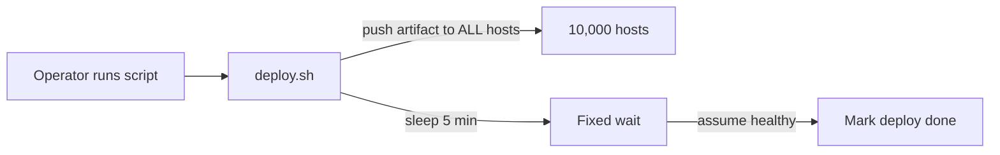
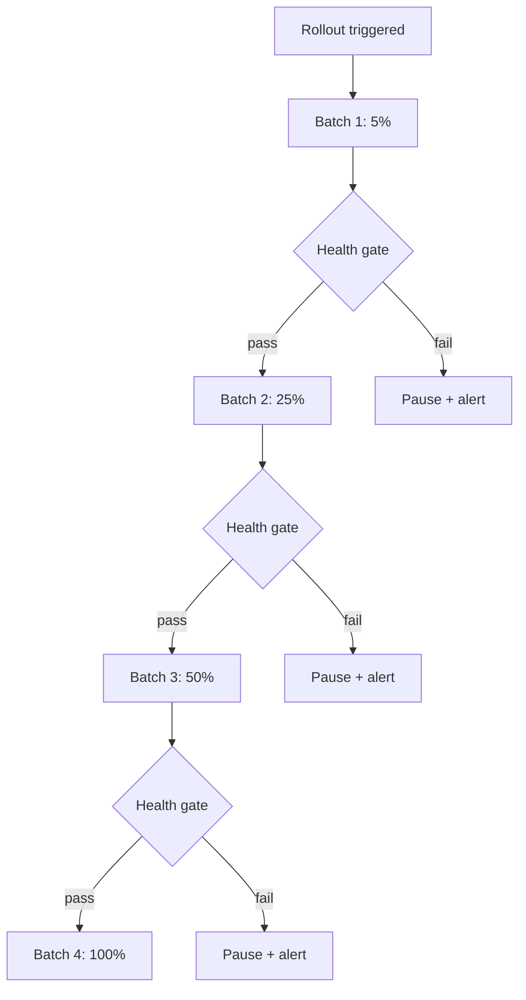
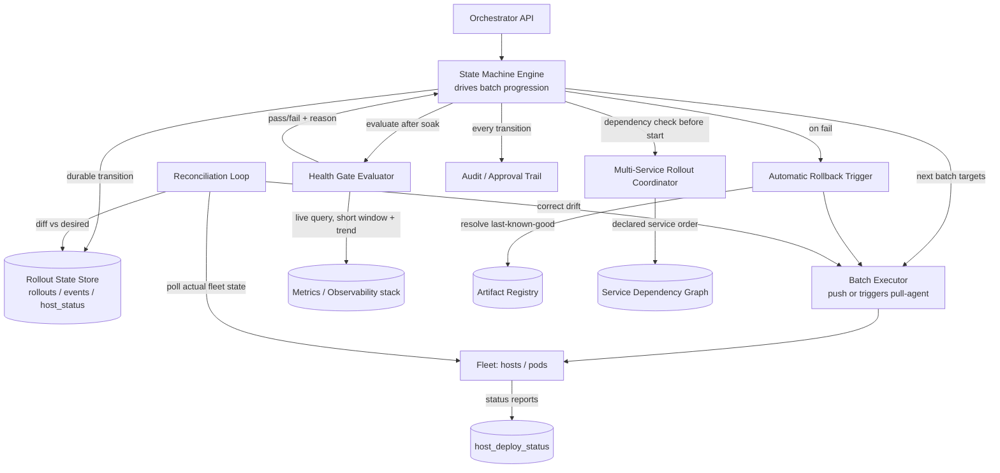

# Design: Code Deployment / Release Orchestration System

**Difficulty:** Senior → Staff | **Time:** 45–60 minutes

!!! note "Instructions"
    Cover each section and work it yourself first. Before every "Version N" reveal there is a `???` box — commit to an answer before you open it. This exercise assumes you already know *what* rollout strategies exist; the value here is building the *system* that executes one safely, unattended, across thousands of hosts.

---

## 1. Problem Statement

[CI/CD](../cloud/cicd.md) and [Deployment Strategies](../cloud/deployment-strategies.md) already cover *what* a rollout strategy is and *why* you'd pick canary over blue-green over rolling. Do not re-derive that here — link to it. This exercise is different: given that you've decided "canary, then widen," **who or what actually executes that decision across 10,000 hosts, minute by minute, without a human staring at a dashboard?**

That "who" is the deployment orchestrator: a system that takes an artifact and a target fleet, sequences the rollout into batches, watches real health signals after each batch, and *automatically* decides whether to proceed, pause, or roll back — fast enough that a bad deploy touches a small fraction of the fleet, not all of it, before anyone notices from an alert.

Design that system. Not the strategy. The engine that runs the strategy.

---

## 2. Clarifying Questions

??? question "What questions should you ask?"
    - **Fleet shape:** VMs, containers on Kubernetes, or both? Bare-metal edge nodes with slow provisioning?
    - **Unit of rollout:** Per-host, per-pod, per-region, per-cell? Does the orchestrator understand service topology or just a flat host list?
    - **Health signal source:** Who owns error rate / latency — a metrics system the orchestrator queries, or does the orchestrator ingest raw events itself?
    - **Multi-service coordination:** Do rollouts ever need to happen in a specific cross-service order (schema migration before the service that reads the new column)?
    - **Rollback semantics:** Roll back to "previous version" or to "last version confirmed healthy," which may not be the same thing if two bad deploys happened back to back?
    - **Human override:** Can an on-call engineer pause/abort mid-rollout, and does that require the orchestrator to be interruptible mid-batch, not just between batches?
    - **Blast radius tolerance:** What's the maximum percentage of the fleet allowed to be on an unverified version at any moment?
    - **Change control:** Do regulated deploys need an approval step recorded before batch 1 even starts?
    - **Scale:** How many hosts, how many independent services, how many deploys/day across the whole org?

---

## 3. Functional Requirements

- Accept a deployment request: artifact version + target fleet (service, environment, region) → start a rollout
- Sequence the rollout into batches with an increasing percentage of the fleet
- Query real health signals (error rate, latency, saturation) after each batch and gate progression on them automatically
- Pause the rollout automatically when a gate fails; roll the affected batch (and any batch ahead of it) back to the last known-good artifact automatically
- Support manual pause / resume / abort / force-rollback at any point, without corrupting orchestrator state
- Track and expose live rollout status: which batch, what percentage deployed, gate pass/fail history
- Coordinate rollouts across multiple services that declare a required ordering (e.g. schema-owner before schema-reader)
- Maintain a durable, queryable record of every deploy: who/what triggered it, every state transition, every gate decision

## 4. Non-Functional Requirements

| Property | Requirement | Reasoning |
|----------|-------------|-----------|
| Blast radius | ≤ 5% of fleet on an unverified version before auto-halt | First batch must be small enough that a total failure there is a non-event for the service overall |
| Rollback speed | Detected-bad → traffic off the bad version in < 2 minutes | The whole point of automation; a human-speed rollback (10–15 min) defeats the design goal |
| Detection speed | Health-gate signal must reflect batch reality within 30–60s of that batch completing | A slow signal lets the next batch launch on stale "all clear" data |
| Orchestrator availability | Orchestrator control plane 99.9%; in-flight rollouts must survive an orchestrator restart | A crashed orchestrator must not leave the fleet half-deployed with no record of where it stopped |
| State durability | Rollout/host state survives orchestrator crash with zero loss of "what's currently deployed where" | Acting on stale state means double-deploying or silently skipping hosts |
| Throughput | Support hundreds of concurrent independent rollouts across different services | A large org deploys constantly; rollouts are not one-at-a-time events |
| Auditability | Every state transition and gate decision retained ≥ 1 year, immutable | Postmortems and compliance both need "what did the system decide, and why, at 03:14" |

!!! tip "Interview Insight 🎯"
    Interviewers are listening for you to separate two different systems that get conflated: the thing that **builds and packages** an artifact (CI/CD, already covered) and the thing that **decides, batch by batch, whether it's safe to keep going** (this exercise). Naming that split early signals you're not just reciting "canary deployment" from memory.

---

## 5. Capacity Estimation

```
Fleet:
  10,000 hosts (mix of VM and k8s pod targets), ~500 distinct services
  Avg service: 20 hosts/pods; largest service: 2,000 pods

Deploy volume:
  500 services × ~3 deploys/week average → ~1,500 deploys/week ≈ 215/day
  Peak business hours: ~30 concurrent active rollouts at once

Rollout duration budget:
  Small service (20 hosts, 4 batches): ~15–20 min end to end
  Large service (2,000 pods, 6–8 batches, larger fleet = more caution): 45–90 min
  Emergency hotfix path: single larger batch, ~10 min, higher risk accepted explicitly

Health-check signal volume during a rollout:
  Each batch evaluation queries ~5 signals (error rate, p99 latency, saturation, restart count, custom SLI)
  Poll every 10s during an active batch, batch takes ~2–5 min to stabilize → ~15–30 gate evaluations/batch
  30 concurrent rollouts × ~6 batches × 20 evaluations × 5 signals ≈ 18,000 metric queries/hour system-wide
  — this rides on the existing metrics backend; the orchestrator is a heavy *query* client, not a metrics store

State writes:
  Per-host status transition: ~215 deploys/day × ~20 hosts avg per deploy ≈ 4,300 per-host
  state writes/day from rollout progression alone. Each host typically transitions through
  several states per rollout (pending → deploying → health-checking → healthy, or a rollback
  path) — call it ~4 transitions/host/deploy ≈ 17,000 total state-transition writes/day.
  Trivial volume for an OLTP store either way; the earlier metric-query volume (~18,000/hour,
  so ~430,000/day) is the actual read-heavy component of this system, not the state writes.
```

!!! abstract "Mental Model"
    The orchestrator is a **state machine engine**, not a metrics system and not a deployment mechanism. It doesn't push bits to hosts (kubectl / an agent does that) and it doesn't compute error rates (the metrics stack does that). Its job is exclusively: *decide the next state, given the current state and the latest signal, and make that decision durable before acting on it.*

---

## 6. API Design

```
# Trigger a deployment
POST /v1/rollouts
{ "service": "checkout-api", "artifact_version": "sha256:a1b2...", "environment": "prod",
  "strategy": "canary", "batch_plan": [5, 25, 50, 100] }
→ 202 Accepted { "rollout_id": "ro_9f3e", "state": "pending" }

# Get rollout status
GET /v1/rollouts/{rollout_id}
→ {
    "rollout_id": "ro_9f3e", "state": "in_progress", "current_batch": 2,
    "batch_plan": [5, 25, 50, 100],
    "batches": [
      { "index": 1, "pct": 5,  "state": "completed", "gate_result": "pass" },
      { "index": 2, "pct": 25, "state": "in_progress", "hosts_done": 480, "hosts_total": 2000 }
    ],
    "artifact_version": "sha256:a1b2...", "last_known_good": "sha256:9e7c..."
  }

# Manual control (idempotent, requires reason)
POST /v1/rollouts/{rollout_id}/pause   { "reason": "on-call investigating latency blip" }
POST /v1/rollouts/{rollout_id}/resume
POST /v1/rollouts/{rollout_id}/abort   { "reason": "..." }         # stop, leave current state as-is
POST /v1/rollouts/{rollout_id}/rollback { "target_version": "sha256:9e7c..." }  # optional explicit target

# Fleet-facing (internal — pull or push agent uses this)
GET  /v1/hosts/{host_id}/desired-state
POST /v1/hosts/{host_id}/report        { "artifact_version": "...", "healthy": true }
```

!!! warning "Production Trap ⚠️"
    A `pause` or `abort` call that only flips a flag in memory is worthless the moment the orchestrator process restarts mid-rollout. Every control action must be a durable state transition, written before it's acknowledged — see the state machine below.

---

## 7. Data Model

The rollout state machine is the core object. Model it explicitly — do not let "in progress" be a single opaque status string that hides which batch, which gate, and which decision got you there.

```
pending → in_progress(batch=1) → gate_evaluating(batch=1)
   → [pass] → in_progress(batch=2) → gate_evaluating(batch=2) → ...
   → [fail] → paused(failed_health_gate, batch=N) → rolling_back → rolled_back
   → completed (all batches passed at 100%)

Manual: any in_progress/gate_evaluating/paused → paused (manual)
        any non-terminal state → aborted
        any state → rolling_back (manual force-rollback)
```

```sql
CREATE TABLE rollouts (
    rollout_id       VARCHAR(32) PRIMARY KEY,
    service          VARCHAR(128) NOT NULL,
    environment      VARCHAR(32) NOT NULL,
    artifact_version VARCHAR(128) NOT NULL,
    last_known_good  VARCHAR(128) NOT NULL,   -- captured at rollout start, immutable per rollout
    batch_plan       JSONB NOT NULL,          -- [5, 25, 50, 100]
    current_batch    INT NOT NULL DEFAULT 0,
    state            VARCHAR(32) NOT NULL,    -- see state machine above
    triggered_by      VARCHAR(128) NOT NULL,
    approval_id      VARCHAR(64),             -- nullable; required for regulated services
    created_at       TIMESTAMPTZ NOT NULL,
    updated_at       TIMESTAMPTZ NOT NULL
);

CREATE TABLE rollout_events (          -- append-only audit trail
    rollout_id   VARCHAR(32) NOT NULL,
    seq          BIGINT NOT NULL,      -- monotonic per rollout, enforces ordering
    from_state   VARCHAR(32),
    to_state     VARCHAR(32) NOT NULL,
    reason       VARCHAR(256),         -- "gate_pass", "gate_fail:error_rate=4.2%", "manual:on-call"
    actor        VARCHAR(128),         -- system or user id
    ts           TIMESTAMPTZ NOT NULL,
    PRIMARY KEY (rollout_id, seq)
);

CREATE TABLE host_deploy_status (      -- per-host/per-pod tracking
    host_id          VARCHAR(64) NOT NULL,
    rollout_id       VARCHAR(32) NOT NULL,
    batch_index      INT NOT NULL,
    artifact_version VARCHAR(128) NOT NULL,
    status           VARCHAR(16) NOT NULL,  -- pending | deploying | healthy | unhealthy | rolled_back
    last_report_at   TIMESTAMPTZ,
    PRIMARY KEY (host_id, rollout_id)
);

CREATE TABLE artifact_registry (       -- version registry, per service
    service          VARCHAR(128) NOT NULL,
    artifact_version VARCHAR(128) NOT NULL,
    built_at         TIMESTAMPTZ NOT NULL,
    marked_good_at   TIMESTAMPTZ,      -- set when a rollout of this version reaches 100% + gate pass
    PRIMARY KEY (service, artifact_version)
);
```

`last_known_good` is captured **once, at rollout start**, from `artifact_registry` — not recomputed mid-rollout, so a rollback target can't shift under you while you're mid-decision.

---

## 8. Version 1 — simplest thing that works

One script. Deploy to every host in the fleet at once (or one giant batch), sleep a fixed interval, declare success. No health gating, no batching.



```python
def deploy(service: str, version: str, hosts: list[str]):
    for host in hosts:                      # every host, no batching
        push_artifact(host, version)
        restart_service(host)
    time.sleep(300)                         # "wait and hope"
    print(f"deploy of {version} complete")  # no verification at all
```

This is what most teams actually start with — a Jenkins job or a shell script wrapping `ssh` in a loop. It works, until the artifact is bad.

---

## 9. Identify the bottleneck

???+ question "What breaks first, and why does 'wait 5 minutes' not save you?"
    - **Zero blast-radius containment.** Every host gets the new artifact in the same pass. A bad artifact — crash loop, bad config, broken dependency — takes down **100% of capacity simultaneously**. There is no such thing as "a small canary failed" in this design; there is only "the whole service is down."
    - **The fixed wait verifies nothing.** Sleeping 5 minutes and declaring success checks that the script didn't crash, not that the service is healthy. A memory leak that OOMs at minute 6, a slow-burning error rate, a dependency that times out under real traffic — none of it is caught. "Wait and hope" is not a health check; it just delays discovering the outage by five minutes.
    - **No rollback path.** When it does fail, someone has to notice (usually via a paging alert, not the deploy script), find the previous artifact, and manually re-run the script in reverse — at 2 AM, under pressure, by hand.

---

## 10. Version 2 — batched rollout with an automated health gate

Split the fleet into increasing batches (e.g. 5% → 25% → 50% → 100% — the canary/progressive-delivery pattern from [Deployment Strategies](../cloud/deployment-strategies.md); this page doesn't re-derive *why* that shape works, only how to execute it). After each batch, **query real health signals** — error rate, latency, saturation — from the metrics stack (see [Observability](../observability/index.md) for where those signals come from) and require them to stay within bounds before the next batch is allowed to start.



```python
def health_gate(service: str, batch_hosts: list[str], baseline: dict) -> bool:
    time.sleep(SOAK_SECONDS)                       # let metrics accumulate post-deploy
    m = metrics_client.query(service=service, hosts=batch_hosts, window="2m")
    return (
        m.error_rate <= baseline.error_rate * 1.5 and
        m.p99_latency_ms <= baseline.p99_latency_ms * 1.3 and
        m.restart_count == 0
    )

def run_rollout(rollout_id: str, batch_plan: list[int]):
    baseline = metrics_client.query(service=..., window="10m")  # pre-deploy healthy baseline
    for pct in batch_plan:
        batch_hosts = select_next_batch(rollout_id, pct)
        deploy_to(batch_hosts, artifact_version)
        set_state(rollout_id, "gate_evaluating", batch=pct)
        if not health_gate(service, batch_hosts, baseline):
            set_state(rollout_id, "paused_failed_health_gate", batch=pct)
            page_oncall(rollout_id)
            return
        set_state(rollout_id, "in_progress", batch=pct)
    set_state(rollout_id, "completed")
```

This is a real improvement: a bad artifact at 5% affects 5% of capacity, not 100%, and it stops automatically instead of waiting for a page.

---

## 11. Identify the next bottleneck

???+ question "The gate works in a demo. What breaks it in production?"
    - **Signal lag.** Metrics pipelines typically aggregate over rolling windows (30–60s) and have their own ingestion delay. If the gate checks *immediately* after a batch finishes deploying, it's reading data from *before* the new version was even fully live. A batch can look "clean" at the 2-minute soak mark and then start erroring at minute 3 — by which point the orchestrator has already greenlit the next, larger batch. The bad version can be at 50% before the gate "notices" the problem that started at 5%.
    - **Single-service tunnel vision.** Real deploys aren't always one service in isolation. A schema-changing deploy might require the writer service to roll out and stabilize *before* the reader service starts picking up the new column — and a batch-per-service model has no concept of "wait for a different rollout to reach `completed` before starting mine." Two rollouts proceeding independently, each individually passing its own gate, can still leave the fleet in a state where two services disagree about a contract.

    Both point to the same lesson: a health gate is only as good as the freshness of what it reads, and "safe" is sometimes a property of the *fleet*, not of one service's batch.

---

## 12. Version 3 — production architecture



Key production decisions:

- **Health gate reads a trend, not a point-in-time snapshot.** Instead of one query at the end of a fixed soak, the gate polls every 10–15s through the soak window and requires the trend to be flat/improving, not just "under threshold right now." A gate that fails on *rate of change* (error rate climbing 3 points in 60s) catches a problem before it crosses an absolute threshold — this directly answers the signal-lag bottleneck from Version 2.
- **Rollback is automatic and targets a specific artifact, not "pause."** On gate failure, the Rollback Trigger reads `last_known_good` from the rollout row (captured at start, not recomputed) and redeploys it to every host in the failed batch — and any earlier batches still on the new version — through the same Batch Executor path used for forward deploys. Rollback is a deploy, not a special-cased operation, which halves the code paths that can have bugs.
- **Multi-service coordinator enforces declared order before a rollout is even allowed to start its first batch.** Services declare dependencies (`checkout-api` depends on `payments-schema-migrator` reaching `completed`); the coordinator blocks a dependent rollout in `pending` until the upstream rollout's state satisfies the declared condition. This is a **gate at rollout start**, cheaper than trying to detect incompatibility after the fact.
- **Reconciliation loop is a separate, always-running process — not just the ordinary batch executor path.** It periodically diffs `host_deploy_status` (what the orchestrator believes is deployed) against actual host reports and infrastructure APIs (what's really running), and corrects drift. This is what makes the state store authoritative rather than aspirational.

---

## 13. Failure analysis

=== "Health-gate signal lag lets a bad batch through"
    Metrics ingestion lags 45s; the gate's soak window closes and reads a false "healthy" just before the real error spike lands. Batch 2 (25%) launches on bad data.
    **Mitigation:** require the trend check above, not a snapshot; also re-evaluate the *previous* batch's signal continuously in the background even after it "passed" — a late-arriving regression on batch 1 should immediately pause batch 2 regardless of batch 2's own gate result.

=== "Orchestrator crashes mid-rollout"
    The state machine process dies between "batch 3 deployed" and "batch 3 gate evaluated." Does the fleet end up half-deployed with no record of where it stopped?
    **Mitigation:** every transition is written to the durable store *before* the corresponding action is taken (deploy, then durably mark `gate_evaluating`, then evaluate) — so on restart the engine reads `rollouts` + `host_deploy_status`, finds any rollout stuck in a non-terminal state past a staleness threshold, and resumes from the last durable checkpoint rather than restarting or silently abandoning it. This requires the executor's actions to be idempotent (redeploying an already-correct host is a no-op) since "did the push actually happen before the crash" can't always be known with certainty.

=== "Automatic rollback itself fails or is slow"
    `last_known_good` in the artifact registry is stale — it points to a version that was itself later found to have a slow-burning issue, or the registry write for "mark this version good" never completed because *that* rollout also crashed before reaching `completed`.
    **Mitigation:** only mark a version `marked_good_at` after it has been at 100% *and* passed a post-completion soak (e.g. 30 min at full traffic, not just the last batch gate) — this closes the "declared good too early" gap. If the registry's `last_known_good` is itself unreachable/unhealthy at rollback time (rare but possible — two bad deploys in a row), fail loud: page a human rather than rolling back to a second bad version silently.

=== "Multi-service rollout partially completes"
    The schema-migrator rollout reaches `completed`, but the dependent `checkout-api` rollout gets manually aborted at batch 2 by an on-call engineer responding to an unrelated alert — leaving two services on versions of a contract that were never meant to ship independently.
    **Mitigation:** the coordinator records the *pairing*, not just each rollout's individual state; a manual abort on a coordinated rollout raises a distinct alert ("this abort leaves declared-incompatible versions live") rather than the generic "rollout aborted" notice, and the coordinator refuses to let a *new*, unrelated rollout of either service start until the pairing is explicitly resolved (roll the migrator back too, or resume checkout-api).

---

## 14. Consistency considerations

- **The orchestrator's state must be authoritative, not aspirational.** "What's deployed where" cannot be a best-effort log of intents — if the orchestrator believes host `h-4821` is on the new version but a network blip meant the push never landed, the next batch calculation (which hosts remain) is wrong, and you either double-deploy or silently skip a host forever.
- **This is why the reconciliation loop is not optional.** A fire-and-forget push ("I told the host to deploy, moving on") drifts from reality the moment any single push silently fails. The reconciliation loop closes that gap by periodically comparing declared state (`host_deploy_status`) against a ground-truth read from the fleet itself (agent heartbeat, or a direct query to the orchestration substrate like the Kubernetes API for pod spec/image), and re-issuing the deploy action for any host found out of sync — the same pattern GitOps controllers use for the broader "declared vs. actual" cluster problem (see [CI/CD § GitOps](../cloud/cicd.md)).
- **Ordering within a rollout must be strict.** `rollout_events.seq` is monotonic per rollout so that a delayed/retried state-transition write can never be applied out of order (e.g. a late "batch 1 passed" message arriving after "batch 2 failed" must not resurrect batch 2's progression).
- **Manual control actions must win a race against automatic ones.** If an on-call engineer calls `abort` at the exact moment the gate evaluator is about to advance to the next batch, the abort must be checked and honored atomically as part of the same state transition — not lost because the automatic path already had its next action queued.

---

## 15. Observability

```
Rollout-specific metrics (first-class, not derived from generic infra metrics):
  rollout_batch_progress{rollout_id,batch} (0-100% of batch's hosts confirmed healthy)
  rollout_gate_result{service,result=pass|fail} (count, by reason)
  rollout_time_to_detect_seconds  (bad-deploy-live → gate correctly flags it)
  rollout_time_to_rollback_seconds (gate fail → 100% of affected hosts back on last-known-good)
  rollout_state_transitions_total{from,to}
  orchestrator_reconciliation_drift_hosts (hosts whose actual state != declared state)
  orchestrator_stuck_rollouts (non-terminal state older than expected batch duration × 2)

Alerts:
  rollout_time_to_rollback_seconds > 120s (violates the NFR directly)
  rollout_gate_result{result=fail} rate spike across multiple unrelated services (suspect the gate itself, not the artifacts)
  orchestrator_reconciliation_drift_hosts > 0 for > 5 minutes (state store is lying to you)
  orchestrator_stuck_rollouts > 0 (crashed mid-rollout and didn't resume)

Traces:
  span per batch, child spans for deploy-push and gate-evaluation, tagged with rollout_id
```

---

## 16. Cost analysis

```
Orchestrator control plane (state machine engine, HA, 3 nodes):     ~$600/month
Rollout state store (Postgres, small rows, high write rate):        ~$250/month primary + replica
Health-gate evaluator (query load against existing metrics stack):  ~$0 marginal (rides shared infra)
Reconciliation loop (periodic fleet scan, 10K hosts every ~2 min):  ~$150/month compute
Audit trail storage (append-only events, 1yr retention):             ~$50/month
Total incremental infra:                                             ~$1,050/month

Cost avoided: the thing being priced against is not "no orchestrator" (nobody runs 10K hosts by hand
long-term) — it's outage cost from unthrottled bad deploys. One prevented full-fleet outage
(minutes of downtime on a revenue service) typically dwarfs a year of this system's run cost.
```

---

## 17. Alternative architectures

=== "Push-based orchestration"
    Central orchestrator holds an SSH/agent connection (or calls the Kubernetes API directly) and actively tells each host what to run, when. Simple mental model, immediate feedback per host, easiest to reason about for the batch/gate logic in this exercise. Weakness: the orchestrator needs standing credentials/connectivity to every host, and if it's down, nothing new deploys *and* it's harder to tell "host didn't get the memo" from "host is fine but unreachable."

=== "Pull-based / GitOps"
    Each host or in-cluster agent (ArgoCD/Flux-style) continuously reconciles itself against a declared desired state in Git — see [CI/CD § GitOps](../cloud/cicd.md) for the full pattern. No standing orchestrator-to-host credentials; drift detection is built in, since reconciliation *is* the mechanism, not an add-on. Weakness: the fine-grained "5%, wait, check gate, then 25%" batch sequencing this exercise needs isn't native to a simple GitOps controller — you'd need the orchestrator to progressively rewrite the desired-state manifest per batch, which works but adds a layer of indirection between "decision" and "effect."

=== "Fully automated rollback vs. auto-pause-and-page"
    Full auto-rollback (this page's default) minimizes blast radius and time-to-mitigate without waiting on a human, but a false-positive gate failure (metrics blip unrelated to the deploy) triggers an unnecessary rollback with its own risk. Auto-pause-and-page keeps a human in the loop before reverting anything, safer against false positives, but violates a sub-2-minute rollback NFR for any incident that happens outside instant on-call response. Reasonable middle ground: auto-rollback for clear-cut gate failures (hard error-rate threshold breach), auto-pause-and-page for ambiguous ones (trend degrading but not yet over threshold).

---

## 18. Staff Engineer Extensions

=== "100× fleet size (1M+ hosts)"
    A single state-machine engine polling and sequencing batches for every rollout org-wide becomes the bottleneck itself. Shard the orchestrator by service or by fleet cell, each shard owning its own rollouts independently; the reconciliation loop becomes hierarchical (per-cell reconcilers reporting up) rather than one process scanning a million hosts every 2 minutes. Batch sizes for the largest services stop being fixed percentages and become capped absolute counts (5% of 1M is 50,000 hosts — no gate soak window safely bounds a batch that large; cap at, say, 2,000 hosts per batch regardless of percentage).

=== "Multi-region"
    Never deploy to all regions simultaneously, no matter how good the per-region batching looks — a region-correlated failure (a bad artifact that only breaks under a specific region's traffic mix, or a region-scoped dependency) must not be able to take every region down in one rollout. Sequence rollouts region-by-region, and always hold at least one region back as the last to receive the change — a "break-glass" capacity buffer that's provably never touched by an in-flight bad deploy. This mirrors the "never take the last healthy region" principle from other reliability exercises: the orchestrator's own rollout plan is itself a single point of failure if it can target every region at once.

=== "Data residency → regulatory change-control"
    Data residency isn't directly relevant to a deployment system, but the analogous constraint is real: regulated environments (finance, healthcare) often require a recorded *approval* before a rollout is allowed to leave `pending`, not just an audit trail after the fact. Add an `approval_id` gate at the `pending → in_progress` transition — the state machine refuses to advance without a linked, verified approval record, which is a stronger requirement than "we logged what happened," closer to "the system provably cannot proceed without one."

=== "Zero-downtime migration of the orchestrator itself"
    Deploying a new version of the deployment system must not corrupt or strand a rollout that's currently in flight — the classic "who deploys the deployer" problem. The state machine engine must be stateless-and-restartable by design (all state lives in the durable store, never in-process memory), so a rolling update of the orchestrator's own pods simply means: in-flight rollouts pause briefly (no new batch/gate action dispatched) while the old orchestrator pod drains and a new one picks up the same durable state and resumes. This is exactly why "every transition is durable before it's acted on" (Version 3, Section 13) isn't just a crash-recovery feature — it's what makes the orchestrator safely deployable by its own kind of system.

---

## 19. Interview follow-ups

1. **"How is this different from just describing canary deployment?"** — Canary/blue-green (see [Deployment Strategies](../cloud/deployment-strategies.md)) is the *shape* of the rollout. This exercise is the *engine*: durable state transitions, an automated gate that reads a trend not a snapshot, automatic rollback to a specific artifact, and a reconciliation loop that keeps the engine's belief about the fleet honest. Say that split explicitly.
2. **"What happens if the health-gate evaluator itself is down?"** — Fail closed: a rollout cannot advance past a batch without a gate result, so no gate service means the rollout stalls at its current batch (not proceeds blindly, not auto-rolls-back on missing data). Alert on `orchestrator_stuck_rollouts` catches this.
3. **"How do you test the rollback path without waiting for a real bad deploy?"** — Chaos-test it: periodically trigger a synthetic rollout of a known-bad artifact against a non-production or shadow fleet and assert `rollout_time_to_rollback_seconds` stays under budget — the same "game day" instinct as testing any other automated failure response.
4. **"Two rollouts of the same service, triggered a minute apart — what happens?"** — The state machine must serialize on `(service, environment)`: reject or queue the second trigger while one rollout is non-terminal, otherwise two batch executors race on the same host set and `host_deploy_status` writes conflict.

---

## Self-Assessment

- [ ] I can explain what's new here versus the deployment-strategies concept page in one sentence
- [ ] I can justify the trend-based health gate over a single snapshot check, with the lag scenario that motivates it
- [ ] I can describe why rollback targets a specific `last_known_good` artifact instead of "undo the last action"
- [ ] I can explain why the reconciliation loop, not just the batch executor, is what makes fleet state trustworthy
- [ ] I can name the failure mode where the orchestrator's own crash mid-rollout is handled safely, and why idempotent redeploys matter there
