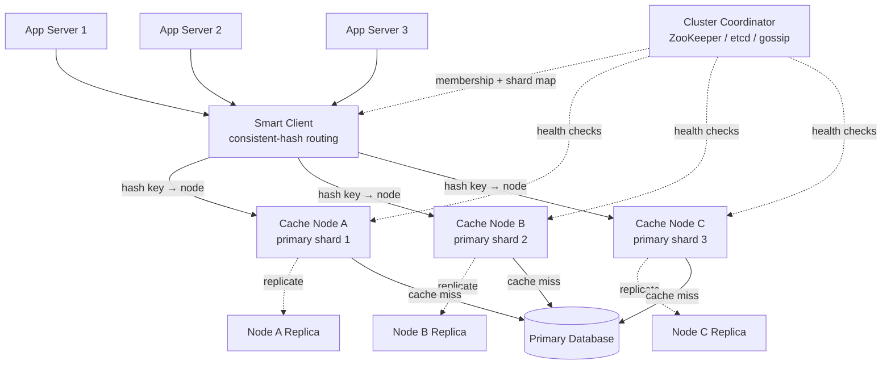

# Design: Distributed Cache

**Difficulty:** Intermediate | **Time:** 60–75 minutes

!!! note "Instructions"
    **Cover the solution sections** and work through each step yourself first. Use "Hint" tabs if stuck. Practice explaining out loud — the way you communicate matters as much as the solution.

---

## 1. Problem Statement

Design a distributed, in-memory cache system — the kind of thing a company builds (or buys, as Redis/Memcached) to sit in front of a slower primary data store. Clients `GET`, `SET`, and `DELETE` keys; the cache is horizontally scaled across many nodes and survives individual node failures without becoming globally unavailable.

---

## 2. Clarifying Questions

Practice asking these before designing:

??? question "What questions should you ask?"
    - **Consistency:** Is stale data acceptable for a short window, or must reads always see the latest write?
    - **Data size:** What's the typical value size? KB-scale (session data) or MB-scale (rendered pages)?
    - **Access pattern:** Read-heavy, write-heavy, or mixed? Uniform key access or skewed (hot keys)?
    - **TTL:** Do all keys expire, or is this closer to a durable store with caching semantics?
    - **Durability:** Is data loss on a node failure acceptable (it's "just a cache," source of truth is elsewhere) or does the cache itself need to survive restarts?
    - **Client count:** How many application servers connect to this cluster? Single datacenter or multi-region?
    - **Eviction:** When memory is full, what should happen — reject writes, or evict something?

---

## 3. Functional Requirements

- `GET(key) → value` — retrieve a value by key
- `SET(key, value, ttl?)` — store a value, optionally with a TTL
- `DELETE(key)` — remove a value
- Keys expire automatically after their TTL
- Optional: atomic increment/decrement, batch get (`MGET`)

## 4. Non-Functional Requirements

| Property | Requirement |
|----------|-------------|
| Latency | GET/SET < 1ms p99 (in-memory, same-datacenter) |
| Availability | 99.99% — a cache outage should degrade, not take down the whole app |
| Consistency | Eventual is acceptable; cache is not the source of truth |
| Scale | 500M keys, 10 TB total data, 2M ops/second peak |
| Durability | Best-effort — losing a node's data on crash is acceptable if the source of truth (DB) still has it |

!!! tip "Interview Insight 🎯"
    The single biggest design decision in this exercise is stated right there in the NFR table: **consistency is eventual, durability is best-effort.** That's what lets you throw out a huge amount of complexity a database would need (WAL, synchronous replication, strict quorum reads) and instead optimize purely for latency and availability. Say this out loud early — it tells the interviewer you understand *why* a cache is architecturally simpler than a database, not just that you memorized Redis's feature list.

---

## 5. Capacity Estimation

```
Data:
  500M keys × avg value size 2KB (mix of small session objects, larger fragments)
  Total data ≈ 500M × 2KB = 1 TB raw
  With per-key overhead (~100 bytes metadata: TTL, pointers) ≈ 1.05 TB
  Target 10 TB headroom (growth + working set larger than "hot" subset) → provision for 10 TB

Ops:
  2M ops/second peak, ~80:20 read/write ratio
  Reads:  1.6M ops/sec
  Writes: 0.4M ops/sec

Nodes:
  A single cache node (e.g., r6g.2xlarge class, 64GB RAM) can serve
  ~100K-150K ops/sec and hold ~50GB of usable data (after overhead/headroom)

  By memory:  10 TB / 50 GB per node  ≈ 200 nodes
  By throughput: 2M ops/sec / 120K ops/sec per node ≈ 17 nodes

  Memory is the binding constraint → provision ~200 nodes,
  which comfortably covers the throughput requirement too (200 × 120K = 24M ops/sec capacity)

Network:
  Avg value 2KB × 2M ops/sec ≈ 4 GB/sec cluster-wide bandwidth
  Per node: 4 GB/sec / 200 nodes ≈ 20 MB/sec — trivial for modern NICs
```

!!! tip "Interview Insight 🎯"
    Notice which constraint binds: here it's **memory**, not throughput. That single number — "we need 200 nodes for capacity, and that happens to give us 10× the throughput we need" — tells you where to spend your design effort. If throughput had bound instead, you'd be talking about read replicas and request coalescing before you ever mentioned partition count.

---

## 6. API Design

```
GET /keys/{key}
Response: { "value": "...", "ttl_remaining": 42 }
Status: 200 OK, or 404 Not Found (cache miss)

PUT /keys/{key}
Request:  { "value": "...", "ttl_seconds": 300 }
Response: 200 OK

DELETE /keys/{key}
Response: 204 No Content

POST /keys/batch-get
Request:  { "keys": ["a", "b", "c"] }
Response: { "a": "...", "b": null, "c": "..." }
```

In practice, clients talk to the cache over a lightweight binary protocol (RESP for Redis, a custom protocol for Memcached) rather than HTTP — HTTP's per-request overhead is too high at sub-millisecond latency targets. The REST shape above is useful for reasoning about the interface; assume a smart client library that maintains persistent connections and speaks the wire protocol underneath.

---

## 7. High-Level Design



Three moving parts do all the work: **the client's routing logic** (which node owns this key), **the shard's own storage engine** (an in-memory hash table with TTL eviction), and **the coordinator** (tracks which nodes exist and are healthy, so routing stays correct as nodes join/leave).

There are two deep sub-problems that make this design non-trivial, both covered below: how you route a key to a node without a full reshuffle every time the cluster resizes, and what you do when a node goes away.

---

## 8. Deep Dive: Partitioning Strategy

??? question "Why not just hash(key) % num_nodes?"
    Because `num_nodes` changes — nodes fail, get added for capacity, get replaced. `hash(key) % N` remaps *almost every key* when `N` changes by even one node, which means a single node addition triggers a near-total cache flush and every request becomes a cache miss simultaneously — exactly the thundering-herd scenario a cache exists to prevent.

**Consistent hashing** solves this: nodes and keys are placed on a hash ring (typically `hash % 2^32`), and a key is owned by the first node clockwise from its position. Adding or removing one node only remaps the keys between that node and its neighbor — roughly `1/N` of the keyspace, not all of it.

The full mechanics — virtual nodes to prevent hot spots, ring rebalancing, and the "cascading failure on removal" gotcha — are covered in [Consistent Hashing](../databases/consistent-hashing.md). The short version for this design: each physical node is placed on the ring as 100-200 virtual nodes so that when a node leaves, its keyspace is spread evenly across many surviving nodes rather than dumping the whole load onto one unlucky neighbor.

```
200 physical nodes × 150 virtual nodes each = 30,000 points on the ring
Losing one physical node redistributes ~1/200th of keys,
spread across ~150 different neighbors instead of 1 — no single node absorbs a spike
```

---

## 9. Deep Dive: Replication for Availability

A pure partition-with-no-replication design means losing one node loses that node's entire slice of the keyspace — for a cache, that's "acceptable" in the sense that the DB still has the data, but it produces a synchronized wave of cache misses hitting the database for every key that node owned, which can itself take down the database (see [Thundering Herd](../reliability/failure-library.md) in the failure library).

**Design:** each shard has a primary and 1-2 replicas, placed on different physical nodes (and ideally different availability zones). Writes go to the primary; the primary asynchronously propagates to replicas.

=== "Async replication (recommended)"
    Primary acknowledges the write immediately, then streams it to replicas. **Pro:** doesn't add replica round-trip latency to the write path — keeps writes sub-millisecond. **Con:** a primary crash right after ack, before replication completes, loses that write. Acceptable here because the source of truth is the database, not the cache.

=== "Sync replication"
    Primary waits for at least one replica to acknowledge before returning success to the client. **Pro:** no data loss on primary failure. **Con:** adds a network round-trip to every write, which for a cache targeting sub-millisecond latency is often not worth it — you're paying database-grade write latency for cache-grade durability guarantees.

**Recommended:** async replication, because the failure mode it accepts (losing the last few milliseconds of writes on a primary crash) is cheap — the application re-fetches from the database and repopulates the cache. This is the core trade-off that makes caches architecturally different from databases: you can choose the fast, lossy option because there's always a slower, durable fallback underneath.

On primary failure, the coordinator promotes a replica to primary (see [Failure Handling](#11-failure-handling) below) and updates the shard map so clients route to the new primary.

---

## 10. Deep Dive: Eviction, Hot Keys, and Invalidation

### Eviction policy

Memory is finite; when a node's memory fills, something has to go before a new `SET` can be accepted.

| Policy | Behavior | When to use |
|--------|----------|--------------|
| **TTL-based** | Evict keys whose TTL has expired, checked lazily on access + a background sweep | Always run this first — it's free capacity recovery |
| **LRU (Least Recently Used)** | Evict the key that hasn't been accessed longest | Default for general caching — approximates "what won't be needed again soon" |
| **LFU (Least Frequently Used)** | Evict the key accessed least often | Better when access frequency is a stronger signal than recency (e.g., reference data) |
| **Random** | Evict a random key among candidates | Cheapest to implement, surprisingly competitive at scale, avoids LRU's bookkeeping overhead |

Real systems (Redis) implement **approximate LRU** — sampling a handful of keys and evicting the oldest among the sample — because exact LRU requires a full linked-list update on every access, which is too expensive at millions of ops/second.

### Hot keys

A single key (a viral post, a trending product) can receive far more traffic than any one node — even with perfect partitioning — can serve, because consistent hashing distributes *keys* evenly, not *traffic per key*.

**Mitigations:**

- **Client-side local caching**: cache the hottest keys in the application server's local process memory for a few seconds, absorbing the majority of requests before they even reach the cache tier.
- **Key replication**: detect keys crossing a request-rate threshold and replicate them to multiple nodes (not just the primary/replica set), so reads for that one key are spread across N nodes instead of 1.
- **Read-through fan-out**: for extremely hot keys, shard the *key itself* into `key:0` through `key:9` and have clients pick a shard randomly on read, writing to all shards on update.

This is the same problem described generally as [Hot Partition / Hot Key](../reliability/failure-library.md) in the failure library — a distributed cache is one of the places it shows up most visibly, because the whole point of the system is to serve very skewed access patterns fast.

### Invalidation across a cluster

When the underlying data changes, stale cache entries need to go. Three strategies, in increasing order of consistency and decreasing order of simplicity:

1. **TTL-only**: don't invalidate explicitly, just accept staleness up to the TTL window. Simplest, works for most product surfaces where a few seconds of staleness is invisible to users.
2. **Explicit delete on write**: the write path calls `DELETE` on the cache key whenever the underlying row changes. Requires every write path to remember to do this — a common source of stale-cache bugs is a new write path that forgets.
3. **Pub/sub invalidation broadcast**: the primary datastore (or a CDC stream off it) publishes invalidation events; all cache nodes (or a dedicated invalidation service) subscribe and evict matching keys cluster-wide. More moving parts, but removes the "did every write path remember to invalidate" foot-gun.

!!! warning "Production Trap"
    The classic bug is invalidating the cache *before* the database write commits: `DELETE cache key` → write to DB fails or is still in flight → a concurrent reader repopulates the cache from the *old* DB value → now the cache is stale until the next TTL expiry, potentially for the full TTL window. Always invalidate **after** the write is confirmed committed, and consider a short "negative cache" lock on the key during the write to prevent the repopulation race entirely.

---

## 11. Failure Handling

=== "Node Failure"
    - Coordinator's health check misses N consecutive heartbeats → marks node dead
    - For that node's shards: promote a replica to primary, update the shard map
    - Clients pick up the new shard map (via coordinator push or periodic poll) and route to the new primary
    - **Gap:** requests in flight during the failover window (typically 1-5 seconds) get errors or timeouts — client should fail those reads through to the database rather than blocking
    - **Mitigation:** keep failover detection fast (short heartbeat interval) and make the client's fallback-to-DB path automatic, not something the application has to remember to implement per call site

=== "Network Partition"
    - A subset of cache nodes can't reach the coordinator (or each other)
    - **Risk:** if both sides of the partition independently think they're the primary for a shard, you get split-brain writes that diverge — see [Network Partitions & Split Brain](../reliability/failure-library.md)
    - **Mitigation:** the coordinator (ZooKeeper/etcd) itself runs with a quorum requirement — a shard's primary designation is only valid if confirmed by a quorum-backed coordinator, so a minority-side node degrades to read-only or refuses writes rather than accepting them under a stale "I'm still primary" belief

=== "Coordinator Unavailable"
    - Cache nodes and clients continue operating on the **last known good shard map** — a cache should degrade to "can't rebalance or fail over" rather than "can't serve any traffic"
    - New node joins/leaves can't be processed until the coordinator recovers, but existing traffic keeps flowing
    - **Mitigation:** never make read/write path availability depend on a live coordinator connection — only topology *changes* should depend on it

=== "Cache Cluster Fully Down"
    - All requests fall through to the database
    - At 2M ops/sec normally cached, this is almost certainly a database-melting event
    - **Mitigation:** this is exactly the [Circuit Breakers](../reliability/circuit-breakers.md) scenario from the application's perspective — the app should circuit-break on the cache and apply request coalescing / load shedding in front of the database rather than letting 2M rps hit it directly; a full cache outage should be a rare, drilled-for scenario with a documented degraded-mode runbook, not a surprise

---

## 12. Consistency Considerations

- **Cache is never the source of truth** — the database (or whatever system the cache fronts) always wins on conflict. This is what makes async replication and best-effort durability acceptable choices throughout this design.
- **Read-your-writes** is *not* guaranteed by default: a client that writes to shard primary A and then reads might get routed to a replica that hasn't caught up yet. If a specific use case needs read-your-writes (e.g., a user immediately viewing their own just-updated profile), route that client's reads to the primary for a short window after their write, or read from the primary unconditionally for that key type.
- **Cross-key consistency** is out of scope for a cache like this — if an application needs multiple keys to update atomically, that's a transactional database concern, not something the cache layer should be asked to solve. Say this explicitly in an interview: it signals you know where the boundary of "cache" ends and "database" begins.

---

## 13. Trade-offs

| Dimension | Single node (no partitioning) | Partitioned, no replication | Partitioned + replicated (this design) |
|-----------|-------------------------------|------------------------------|------------------------------------------|
| Latency | Lowest (no routing hop) | Low | Low (replicas don't add write latency with async) |
| Throughput | Capped by one machine | Scales with node count | Scales with node count |
| Availability | Single point of failure | Node loss = data loss for that shard until DB repopulates it | Node loss = fast failover to replica, minimal disruption |
| Consistency | Trivially consistent | Trivially consistent per-key | Eventual between primary and replica (async) |
| Durability | None beyond process lifetime | None | Slightly better (replica survives primary crash) but still best-effort |
| Operational complexity | Minimal | Moderate (rebalancing on resize) | Higher (failover logic, replica lag monitoring) |
| Cost | Lowest | Moderate | ~2-3× partitioned-only (replica nodes) |

---

## 14. Interview Follow-ups

1. **"How would you handle a value too large to fit comfortably in one node's memory?"** — Chunk large values across multiple keys/nodes, or route large-object storage to a separate blob store with the cache holding only a reference/pointer.
2. **"How do you resize the cluster without a big latency spike?"** — Add virtual nodes to the ring gradually, throttle the rate of key migration between nodes, and let the old node continue serving migrated keys as a fallback until migration completes (dual-read during transition).
3. **"How would you add multi-region support?"** — Each region runs its own independent cache cluster (cache is cheap to duplicate since it's not authoritative); avoid cross-region cache replication for a plain KV cache — the latency cost isn't worth it when each region can independently repopulate from its local database replica on a miss.
4. **"What changes if this needs to support pub/sub or a message queue, not just KV?"** — That's a materially different consistency and delivery-guarantee problem (ordering, at-least-once vs exactly-once, consumer groups) — flag explicitly that you'd treat it as a different system, not an extension of this one, even if it reuses the same node infrastructure.

---

## Self-Assessment

- [ ] Can I explain why `hash(key) % N` breaks down and what consistent hashing fixes?
- [ ] Can I justify async over sync replication given the NFRs (eventual consistency, best-effort durability)?
- [ ] Can I describe at least two distinct mitigations for a hot key?
- [ ] Can I walk through what happens end-to-end when a primary node dies mid-traffic?
- [ ] Can I explain why a fully-down cache cluster is a circuit-breaker problem for the application, not just a cache problem?
