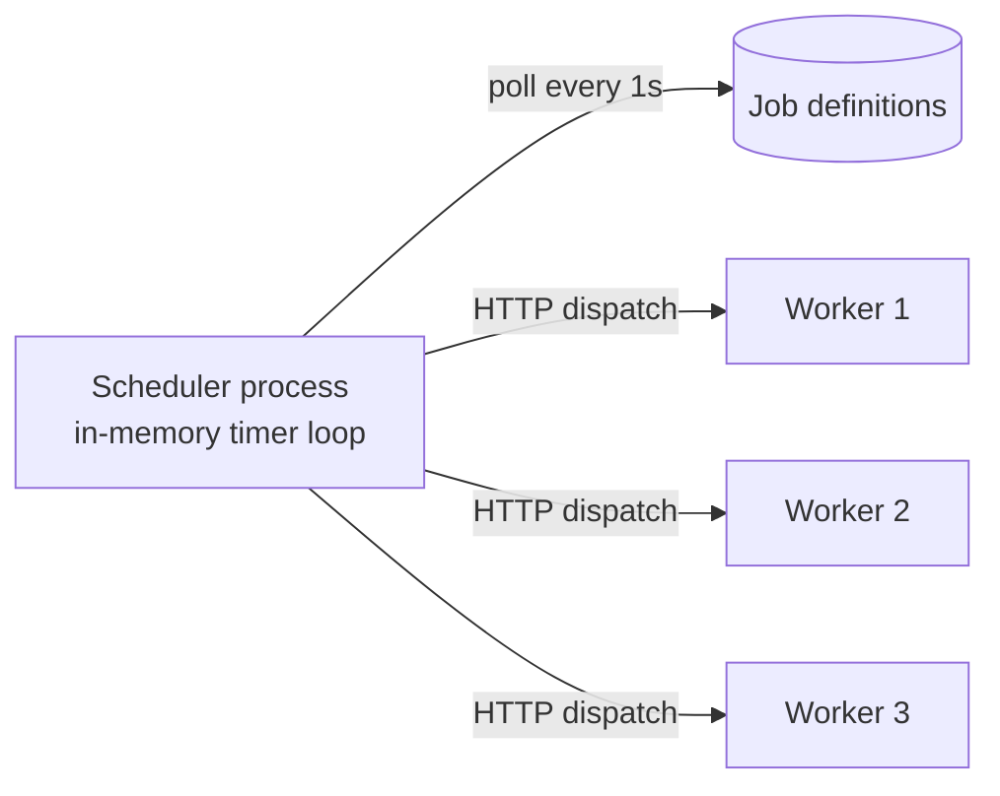
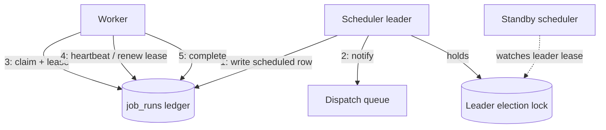
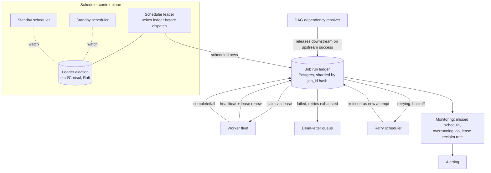

# Design: Distributed Job Scheduler (cron/Airflow at scale)

**Difficulty:** Senior → Staff | **Time:** 60–75 minutes

!!! note "Instructions"
    Cover each section and work it yourself first. This design leans hard on [Distributed Fundamentals](../distributed-systems/fundamentals.md) (leases, leader election) and [Raft](../distributed-systems/raft.md) (consensus mechanics) — read those first if the terms are unfamiliar. The value here isn't the diagram; it's predicting exactly where "the job runs once" stops being true.

---

## 1. Problem Statement

Build a scheduler like cron, but distributed: users register recurring jobs (`0 * * * *`, "every hour") and one-off jobs ("run at 2026-08-20T03:00Z"), a fleet of workers executes them, and the system must give a **specific correctness guarantee**: each scheduled firing runs **exactly once** — not zero times because a coordinator died at the wrong instant, and not twice because two schedulers both believed they owned that trigger.

Three sub-problems, not one:

1. **Trigger correctness.** A single process with an in-memory timer is trivially correct until it crashes — then every job whose fire time passed during the outage is *silently gone*, not late. That's worse than a slow response; nothing indicates the job should have run at all.
2. **Execution correctness.** A worker can crash mid-job. Does the job retry? On what basis do you decide a retry is safe — does retry risk running the job's side effects twice (charging a customer twice, sending a duplicate email)?
3. **Dependency correctness.** Real workloads aren't independent cron lines — they're DAGs (Airflow's shape): `extract → transform → load`, where `transform` must not start until `extract` succeeds, and must not run at all if `extract` failed and there's no meaningful data to transform.

Do not reach for "just use a cron library and a queue." First decide where the durable record of "what should have fired" lives, because that record — not the timer — is what makes exactly-once possible at all.

---

## 2. Clarifying Questions

??? question "What questions should you ask?"
    - **Are jobs idempotent, and can we require them to be?** This is the single most consequential answer in the whole design — it decides whether "exactly-once" is achievable or whether you're really building "at-least-once dispatch, safe under retry."
    - **Do jobs have dependencies (a DAG), or are they independent cron entries?** A DAG needs a dependency resolver and a notion of a "run" (one DAG instance per trigger) that plain cron never needs.
    - **What counts as job success?** Exit code 0, an explicit callback, a timeout with no signal?
    - **How precise does "on time" need to be?** Financial settlement at exactly midnight vs. "sometime in the next 5 minutes" for a cache warmer are different systems.
    - **What happens on missed schedule** — catch up (run once for the whole missed window), run once per missed tick, or skip and alert?
    - **Retry policy per job?** Fixed retries, exponential backoff, dead-letter after N failures?
    - **Multi-tenant?** Can one tenant's 50,000-job backlog starve another tenant's time-critical job?
    - **Execution environment:** shell command, container, or a call into another service?
    - **Scale:** how many distinct job definitions, how many triggers fire per minute at peak, how many concurrent workers?

---

## 3. Functional Requirements

- Register a recurring job (cron expression) or a one-off job (specific timestamp)
- Register a DAG: a set of jobs plus edges (`job_b` depends on `job_a`)
- Trigger each job at (or as close as SLA allows to) its scheduled time
- Execute the job on a worker, capture success/failure and output/logs
- Retry failed jobs per a configured policy; dead-letter after exhausting retries
- Query the status of a specific run and the run history of a job
- Pause/resume/delete a job definition without losing history

## 4. Non-Functional Requirements

| Property | Requirement | Reasoning |
|----------|-------------|-----------|
| Trigger correctness | Every scheduled firing dispatches **at least once**, and job execution is **idempotent** so at-least-once dispatch behaves as exactly-once in effect | True exactly-once trigger-and-execute without idempotency is not achievable across a crash — be explicit about this trade, don't paper over it |
| Scheduling precision | p99 dispatch within 5s of scheduled time for minute-granularity jobs; sub-second for the leader's in-memory hot path when healthy | Cron users expect "on the hour," not "within the hour" |
| Availability | Scheduler control plane 99.95%; a coordinator crash must cause zero missed triggers, only bounded delay | Missed is a correctness bug; late is an SLA number |
| Durability | Job definitions and run history survive any single node failure | The record of "what should have fired" is the whole design |
| Scale | 500K registered job definitions, 50K triggers/minute at peak, 10K-worker fleet | Drives sharding of the scheduler's own responsibility, not just workers |
| Idempotency | Job execution must tolerate at-least-once delivery; the platform provides a dedupe key (`run_id`) per attempt | Pushes correctness to a boundary jobs can actually implement |

!!! tip "Interview Insight 🎯"
    If you say "exactly-once" and stop there, that's a mid-level answer. The senior answer names the mechanism: *at-least-once dispatch* (a durable ledger guarantees the trigger decision survives a crash and gets replayed) *plus idempotent execution* (the job itself is safe to run twice). Say both halves out loud — it's the same honesty [distributed-message-queue.md](distributed-message-queue.md) applies to queue delivery semantics, and for the same underlying reason: a crash between "decided to fire" and "confirmed it ran" is unavoidable in an async system.

---

## 5. Capacity Estimation

```
Job definitions:
  500K registered jobs (cron + DAG nodes)
  Average job definition: ~1 KB (cron expr, command, retry policy, DAG edges)
  → 500 MB of definitions, trivially cacheable in the leader's memory

Trigger volume:
  50K triggers/minute at peak ≈ 830 triggers/second
  Most jobs are hourly/daily — peak clusters at :00 and midnight boundaries
  Minute-boundary spike: jobs scheduled "every minute" (~5% of fleet) all fire
    within the same second → 25K of the 50K can land in one wall-clock second

Job execution duration (long-tailed):
  p50: 2 seconds (cache warmers, health pings)
  p90: 45 seconds (report generation, small ETL steps)
  p99: 20 minutes (large batch transforms)
  max: unbounded — must have a hard timeout, not "unbounded" in practice

Worker fleet:
  10K workers, each handling ~5 concurrent job slots → 50K concurrent job capacity
  At 830 triggers/s and avg 2s duration → ~1,660 concurrent jobs steady state
  Peak minute-boundary burst (25K jobs in ~5s window) needs burst capacity,
    not steady-state sizing — this is the number that decides queue depth, not fleet size

Run history:
  50K triggers/min × 1440 min/day = 72M run records/day
  ~500 bytes/record (job_id, run_id, state transitions, timestamps) → 36 GB/day
  Retain hot (queryable) for 30 days ≈ 1 TB; archive older to cold storage
```

!!! abstract "Mental Model"
    Rate limiter buys a cheap shared integer. Pastebin buys cheap blob storage. This buys a **durable decision log**: for every tick of every job, something must write down "this should fire" *before* dispatching it, so a crash between the decision and the dispatch is replayable instead of lost.

---

## 6. API Design

```
# Job registration
POST /api/v1/jobs
Request: {
  "name": "nightly-report",
  "schedule": { "type": "cron", "expression": "0 3 * * *" },
  "command": "run_report.sh",
  "timeout_s": 1200,
  "retry_policy": { "max_attempts": 3, "backoff": "exponential", "base_s": 30 },
  "depends_on": []              -- non-empty means this job is a DAG node
}
Response: { "job_id": "job_a1b2", "next_run_at": "2026-08-18T03:00:00Z" }

POST /api/v1/jobs/{job_id}/trigger        -- manual/one-off trigger, bypasses schedule
GET  /api/v1/jobs/{job_id}                -- definition + next_run_at
PATCH /api/v1/jobs/{job_id}                -- pause, resume, update schedule
DELETE /api/v1/jobs/{job_id}

# Run status
GET /api/v1/jobs/{job_id}/runs?limit=50
GET /api/v1/runs/{run_id}
Response: {
  "run_id": "run_9f3e",
  "job_id": "job_a1b2",
  "scheduled_for": "2026-08-18T03:00:00Z",
  "state": "running",           -- scheduled|claimed|running|succeeded|failed|retrying|dead_letter
  "attempt": 1,
  "claimed_by": "worker-042",
  "lease_expires_at": "2026-08-18T03:05:00Z"
}

# Worker protocol (internal)
POST /internal/workers/{worker_id}/heartbeat  { "capacity_free": 3 }
POST /internal/runs/claim                     { "worker_id": "worker-042" }
  Response: { "run_id": "run_9f3e", "command": "...", "lease_s": 300 }
POST /internal/runs/{run_id}/lease/renew       { "worker_id": "worker-042" }
POST /internal/runs/{run_id}/complete          { "worker_id": "worker-042", "status": "success", "output_ref": "..." }
```

!!! warning "Production Trap ⚠️"
    `POST /trigger` and the scheduled path must produce the same `run_id` derivation logic and go through the same durable-ledger-then-dispatch flow. A "quick manual trigger" that bypasses the ledger is exactly the kind of shortcut that turns into an untracked, unretried, silently-lost execution during an incident.

---

## 7. Data Model

```sql
-- Job definitions: cron jobs and DAG nodes share one table.
-- depends_on makes this a DAG; empty array is plain independent cron.
CREATE TABLE jobs (
    job_id        VARCHAR(32) PRIMARY KEY,
    name          VARCHAR(200) NOT NULL,
    schedule_type VARCHAR(16) NOT NULL,     -- cron | one_off | dag_child
    cron_expr     VARCHAR(64),              -- null for one_off / dag_child
    run_at        TIMESTAMPTZ,              -- for one_off
    dag_id        VARCHAR(32),              -- groups jobs that form one DAG
    depends_on    TEXT[],                   -- job_ids that must succeed first
    command       TEXT NOT NULL,
    timeout_s     INT NOT NULL,
    retry_policy  JSONB NOT NULL,
    status        VARCHAR(16) NOT NULL,     -- active | paused | deleted
    next_run_at   TIMESTAMPTZ,              -- computed, indexed — the scheduler's work queue
    INDEX idx_next_run (next_run_at) WHERE status = 'active'
);

-- The durable run ledger. Every trigger decision is a row here BEFORE dispatch.
-- This table IS the exactly-once mechanism: it's what a crashed scheduler replays.
CREATE TABLE job_runs (
    run_id          VARCHAR(32) PRIMARY KEY,
    job_id          VARCHAR(32) NOT NULL REFERENCES jobs(job_id),
    dag_run_id      VARCHAR(32),            -- groups all runs of one DAG instance
    scheduled_for   TIMESTAMPTZ NOT NULL,   -- the tick this run corresponds to
    state           VARCHAR(16) NOT NULL,   -- scheduled|claimed|running|succeeded|failed|retrying|dead_letter
    attempt         INT NOT NULL DEFAULT 1,
    claimed_by      VARCHAR(64),            -- worker_id
    lease_expires_at TIMESTAMPTZ,
    created_at      TIMESTAMPTZ NOT NULL DEFAULT now(),
    updated_at      TIMESTAMPTZ NOT NULL DEFAULT now(),
    UNIQUE (job_id, scheduled_for, attempt),  -- dedupe key: same tick can't be logged twice
    INDEX idx_lease (state, lease_expires_at) WHERE state IN ('claimed', 'running')
);

-- Worker registry: a lease, exactly like service-discovery registration
-- (see distributed-systems/fundamentals.md#service-discovery)
CREATE TABLE workers (
    worker_id     VARCHAR(64) PRIMARY KEY,
    capacity      INT NOT NULL,
    capacity_free INT NOT NULL,
    last_heartbeat TIMESTAMPTZ NOT NULL,
    lease_expires_at TIMESTAMPTZ NOT NULL
);
```

**State machine for `job_runs.state`:**

```
scheduled → claimed → running → succeeded
                             ↘ failed → retrying → claimed (next attempt)
                                     ↘ dead_letter (retries exhausted)
claimed → scheduled            (lease expired before work started — reclaim)
running → scheduled            (lease expired mid-execution — reclaim)
```

The `UNIQUE (job_id, scheduled_for, attempt)` constraint is what makes replaying the ledger safe: if the scheduler recomputes "job X should have fired at 03:00" twice (once before a crash, once after recovery), the second insert is a no-op conflict, not a duplicate trigger.

---

## 8. Version 1 — simplest thing that works

Single scheduler process. In-memory timer loop scans job definitions, computes next-fire times, and dispatches directly to a fixed worker pool over HTTP when a time arrives.



```python
# V1 — single process, in-memory, no durability
import time, heapq

class Scheduler:
    def __init__(self, jobs, workers):
        self.jobs = jobs          # list of Job(cron_expr, command, next_run_at)
        self.workers = workers    # round-robin pool
        self.heap = [(j.next_run_at, j) for j in jobs]
        heapq.heapify(self.heap)

    def run_forever(self):
        while True:
            now = time.time()
            while self.heap and self.heap[0][0] <= now:
                _, job = heapq.heappop(self.heap)
                worker = self.workers.pick()
                worker.dispatch(job.command)              # fire and forget
                job.next_run_at = job.compute_next(now)
                heapq.heappush(self.heap, (job.next_run_at, job))
            time.sleep(1)
```

This handles the demo case fine — one process, predictable ticks, no coordination overhead. **Do not add leader election or a ledger yet — find the actual failure mode first.**

---

## 9. Identify the bottleneck

???+ question "The scheduler process crashes at 02:58 and restarts at 03:04. What happened to the 03:00 job?"
    - **It never ran, and nothing knows that.** The `heap` was in memory. On restart, `compute_next()` looks at the *current* time, sees the next tick is 04:00, and moves on. The 03:00 firing isn't late — it's erased. This is strictly worse than a slow response, because nothing alerts, retries, or even records that it should have happened.
    - **This is a single point of failure by construction, not by bad luck.** Any single in-memory process, however reliable, has a nonzero crash probability, and every crash in this design has the same failure mode: silent loss of every tick that fell inside the downtime window.
    - **Even while healthy, nothing survives a worker crash.** `worker.dispatch()` is fire-and-forget — if the worker dies mid-job, the scheduler has already moved on and there is no lease, no retry, no reassignment. A job that dies at 40% through a 20-minute batch job just... doesn't finish, and nobody notices until someone checks the output.
    - The fix for both problems is the same primitive: **write the trigger decision down before acting on it**, so "what should have fired" is a fact that survives a process crash, and turn worker dispatch into a claim with a deadline instead of a one-way HTTP call.

---

## 10. Version 2 — durable ledger, leader election, lease-based claiming

Three changes, each closing one specific hole from V1:

1. **Durable run ledger.** Before dispatching *anything*, the scheduler writes a `job_runs` row with `state = scheduled`. Dispatch reads from this table, not from the in-memory heap. On restart, the scheduler's first act is: "find every `active` job whose `next_run_at` has passed and has no corresponding `job_runs` row yet, and insert one." That's the replay — it turns "what should have fired" from a fact that lived only in RAM into a fact that lived in a table.
2. **Leader election among multiple scheduler instances**, so there is always exactly one process deciding triggers, and a crash triggers automatic failover instead of total silence. Use Raft-style leader election (see [Raft](../distributed-systems/raft.md) and [leader election in Distributed Fundamentals](../distributed-systems/fundamentals.md#leader-election-choosing-one-decision-maker)) — a term-based election with randomized timeouts backed by etcd/Consul in practice, not hand-rolled.
3. **Worker claim via lease**, replacing fire-and-forget dispatch. A worker claims a `job_runs` row (`scheduled → claimed`, sets `claimed_by` and `lease_expires_at`), must renew the lease periodically while running, and if it doesn't renew or complete in time, the run's lease simply expires and any other worker can reclaim it — exactly the lease mechanics in [Distributed Fundamentals — Leases](../distributed-systems/fundamentals.md#leases-a-lock-with-a-built-in-expiry-contract): nobody has to detect the crash, the clock bounds the damage.



```python
# V2 — leader writes durably before dispatching; worker claims via lease
def leader_tick(db, now):
    due = db.query("""
        SELECT job_id, next_run_at FROM jobs
        WHERE status = 'active' AND next_run_at <= %s
    """, now)
    for job_id, scheduled_for in due:
        db.execute("""
            INSERT INTO job_runs (run_id, job_id, scheduled_for, state, attempt)
            VALUES (%s, %s, %s, 'scheduled', 1)
            ON CONFLICT (job_id, scheduled_for, attempt) DO NOTHING
        """, gen_run_id(job_id, scheduled_for), job_id, scheduled_for)
        db.execute("UPDATE jobs SET next_run_at = %s WHERE job_id = %s",
                    compute_next(job_id, scheduled_for), job_id)

def worker_claim(db, worker_id, lease_s=300):
    row = db.query_one("""
        UPDATE job_runs SET state='claimed', claimed_by=%s,
               lease_expires_at = now() + interval '%s seconds'
        WHERE run_id = (
            SELECT run_id FROM job_runs
            WHERE state = 'scheduled' ORDER BY scheduled_for LIMIT 1 FOR UPDATE SKIP LOCKED
        )
        RETURNING *
    """, worker_id, lease_s)
    return row

def reclaim_expired_leases(db):
    # Runs on the leader on a timer. Any claimed/running run whose lease lapsed
    # goes back to 'scheduled' — no crash detection needed, just a clock check.
    db.execute("""
        UPDATE job_runs SET state = 'scheduled', claimed_by = NULL
        WHERE state IN ('claimed', 'running') AND lease_expires_at < now()
    """)
```

The `ON CONFLICT DO NOTHING` on `(job_id, scheduled_for, attempt)` is what makes replay idempotent at the ledger layer: a new leader recomputing "what should have fired" after failover will attempt the same insert the old leader already made, and it's a safe no-op.

---

## 11. Identify the next bottleneck

???+ question "Two scheduler instances briefly both believe they're leader during a network partition. What actually happens?"
    - If leader election is done correctly (quorum-based, term-numbered, exactly as in [Raft](../distributed-systems/raft.md#mechanics)), only one side of a partition can hold a *majority* and thus a valid term — the minority side's "leader" cannot win re-election and, per the Raft rule, must step down the moment it observes a higher term. The dangerous window is the gap between "the minority side stops being able to reach quorum" and "the minority side notices and steps down" — during that gap it may still believe it's leader and attempt to write ledger rows.
    - This is why the `job_runs` INSERT needs the unique constraint, not just careful application logic: even if both sides briefly attempt to insert a `scheduled` row for the same `(job_id, scheduled_for)`, only one insert wins and the other is a harmless conflict. **The safety net is the database constraint, not the assumption that only one leader ever acts.**
    - **DAG dependency stalls are the second failure mode at this stage.** A naive resolver that polls "are all my `depends_on` jobs `succeeded`?" either stalls the whole DAG if it checks too rigidly and one leaf job is skipped/paused, or races ahead if it checks "not currently failed" instead of "succeeded." The fix: a DAG run is its own row (`dag_run_id` groups all `job_runs` in one DAG instance), and a downstream job only transitions out of `scheduled` when every upstream dependency in the *same* `dag_run_id` is `succeeded` — a failed upstream explicitly marks all downstream nodes `dead_letter` (skipped) rather than leaving them stuck in `scheduled` forever.

---

## 12. Version 3 — production architecture



Key production decisions:

- **Sharded ledger by `job_id` hash**, not one Postgres primary. At 50K triggers/minute the ledger write path, not the timer logic, is the throughput ceiling — shard the same way the rate limiter shards its counter store, because this is again "many independent writers hitting one integer-shaped resource."
- **DAG resolver as a separate consumer of the ledger**, not baked into the leader's dispatch loop. It subscribes to `succeeded`/`failed` state transitions and only then inserts `scheduled` rows for downstream jobs in the same `dag_run_id` — this keeps "when does X fire" (the scheduler's job) separate from "is X allowed to fire yet" (the resolver's job), so DAG complexity doesn't bloat the leader's hot path.
- **Retry with backoff is a re-insertion, not a mutation.** A failed run's next attempt is a new `job_runs` row (`attempt = attempt + 1`) inserted after a backoff delay, not an in-place retry of the same row — this keeps the full attempt history intact for debugging and keeps the lease semantics simple (each attempt has its own lease).
- **Dead-letter after exhausting retries**, visible via the same status API, with an explicit alert — a job silently dead-lettering with nobody watching is the DAG-shaped version of V1's silent loss.
- **Monitoring is first-class, not bolted on** — see Section 16. A missed schedule or an overrunning job is exactly as bad as a wrong answer; both need paging, not a log line.

---

## 13. Failure analysis

=== "Scheduler leader crashes mid-dispatch-decision"
    The leader has decided job X should fire at 03:00 but crashes between deciding and writing the `job_runs` row (or between writing the row and notifying workers). **Does the job fire zero times or twice on failover?**
    If the crash is *before* the ledger write commits: the write never happened, so on failover the new leader's replay logic (`next_run_at <= now AND no job_runs row exists`) sees the job is still due and inserts it — fires once, just late. If the crash is *after* the ledger write commits but *before* a worker claims it: the row already exists in `scheduled` state; the new leader's replay query correctly skips it (the `ON CONFLICT DO NOTHING` insert is a no-op), and a worker claims the already-durable row — fires once. **The ledger write is the atomic commit point; anything before it is "never happened," anything after it is "will happen, possibly late." There is no window where it fires twice from the scheduler side alone** — duplication can only come from the worker side (next tab).

=== "Worker crashes mid-execution, lease expires"
    A worker claims a run, starts executing, and dies at minute 12 of a 20-minute job with a 5-minute lease (renewed every 90s). It misses its next renewal; the lease expires; `reclaim_expired_leases` flips the row back to `scheduled`; another worker claims and re-executes it **from the start**.
    **This is the crux of the idempotency requirement.** The job ran partially once, then fully once — if it wrote non-idempotent side effects in that first 12 minutes (partial file writes, a charge already issued), the second full run can double those effects. The platform's only lever here is the lease bound (limits how much partial work can happen before reclaim) and a `run_id`/`attempt` passed to the job so *it* can dedupe (`INSERT ... ON CONFLICT` on its own output keyed by `run_id`, or checking a "already charged this run_id" table). The platform cannot make an arbitrary job idempotent for you — it can only make the dispatch safe to retry and hand the job the identifiers it needs to protect itself.

=== "Split-brain during a network partition"
    Covered in Section 11 above: quorum-based election bounds the blast radius to "both sides briefly attempt the same ledger insert," and the `UNIQUE (job_id, scheduled_for, attempt)` constraint turns that into a harmless conflict rather than a duplicate trigger. The residual risk is a *stale* leader on the minority side continuing to run its `reclaim_expired_leases` sweep and prematurely reclaiming runs that are actually still healthy on the majority side's workers — mitigate by having workers refuse lease renewal/claim RPCs from a scheduler whose term is lower than the last term they've seen (the same "step down on higher term" rule Raft applies to leaders, applied here to workers rejecting stale coordinators).

=== "A DAG job fails and downstream dependents must be held or skipped"
    `extract` fails all 3 retries and dead-letters. `transform` depends on `extract`. A naive resolver that only checks "has `extract` reached a terminal state" and doesn't distinguish `succeeded` from `dead_letter` will happily release `transform` to run on missing data — silently wrong output is worse than a stalled pipeline.
    **Fix:** the resolver's release condition is specifically `all depends_on jobs in this dag_run_id have state = succeeded`; a `dead_letter` upstream causes the resolver to mark all *downstream* nodes in that `dag_run_id` as `dead_letter` too (transitively, not just the immediate child), with a distinct reason code (`upstream_failed` vs. `retries_exhausted`) so the status API and alerting can tell "this failed" from "this was never going to run."

---

## 14. Consistency considerations — what "exactly-once" actually means here

Be honest about this the way [distributed-message-queue.md](distributed-message-queue.md#14-consistency-considerations-delivery-semantics) is honest about queue delivery: **true exactly-once trigger-and-execute, end to end, across an arbitrary crash, is not achievable without idempotent jobs.** What this design actually delivers is:

- **At-least-once dispatch, durably.** The ledger write happens before dispatch and is the atomic commit point (Section 13). A crash before that write means the trigger simply hasn't happened yet and gets replayed; a crash after means it's already durable and will be claimed. This guarantees the trigger is never *silently lost* — but a worker crash after claiming (before completing, before the platform can observe the outcome) can still produce a second full execution once the lease expires and another worker reclaims the row.
- **Idempotent execution turns "at least once" into "effectively exactly once."** The platform's contribution is giving every attempt a stable `run_id` so the job *can* dedupe its side effects (`attempt`-scoped idempotency keys for payments, `INSERT ... ON CONFLICT` for data writes, checking "have I already sent this notification for this run_id" before sending). The platform cannot force a job's business logic to be idempotent — that's a contract with the job author, spelled out in the clarifying questions (Section 2) precisely because it changes what's achievable.
- **Read-your-writes on the status API:** after a worker calls `complete`, the next `GET /runs/{run_id}` must reflect the terminal state — write to the ledger's primary shard and read from the same shard for status queries immediately after a state change; replicas can lag for historical/analytics queries.
- **The DAG resolver's dependency check must be strongly consistent within one `dag_run_id`.** Two downstream jobs racing to read "has my dependency succeeded yet" from a stale replica is the DAG-shaped version of a lost-update bug — route dependency checks to the primary, not a replica, the same way burn-after-read in [pastebin.md](pastebin.md#14-consistency-considerations) needed an atomic check rather than a cached one.

---

## 15. Observability

```
Metrics:
  scheduler_ledger_write_latency_p99
  scheduler_leader_term (gauge; alerts on unexpected increments)
  jobs_missed_schedule_total{job_id}      -- scheduled_for passed, no job_runs row exists yet
  jobs_overrunning{job_id}                -- running longer than 2x historical p99 duration
  lease_reclaim_rate                      -- runs reclaimed after lease expiry, per minute
  dag_stalled_total{dag_id}               -- downstream nodes stuck in 'scheduled' beyond SLA
  dead_letter_rate{job_id}
  worker_claim_latency_p99                -- time between 'scheduled' and 'claimed'

Alerts:
  missed_schedule > 0 for any job tagged critical         -- page immediately, this is data loss
  overrunning_job exceeds 3x p99 duration                  -- likely stuck, investigate before it blocks downstream
  lease_reclaim_rate spike                                 -- worker fleet instability, not just one bad node
  leader_term increments > 2/hour                          -- election storm, check network/GC per raft.md
  dag_stalled > SLA                                        -- resolver bug or a silently-skipped dependency

Traces:
  span per ledger write, per claim, per lease renewal — attribute run_id, job_id, dag_run_id
```

"Missed schedule" and "overrunning job" are first-class, independently alertable conditions — not derived after the fact from a dashboard someone has to remember to check. A missed schedule is silent data loss; an overrunning job is a leading indicator of a stuck DAG blocking everything downstream of it.

---

## 16. Cost analysis

```
Ledger store (Postgres, sharded, 36 GB/day hot, 30-day retention ~1 TB):
  Primary + replica per shard, 4 shards:                    ~$1,600/mo
Leader election (etcd/Consul, 3-5 node cluster):             ~$300/mo
Worker fleet (10K workers, mostly reused compute
  from existing job workloads — marginal scheduler cost is
  the claim/heartbeat traffic, not the compute itself):      ~negligible incremental
Dead-letter / retry queue infra:                              ~$150/mo
Monitoring/alerting pipeline:                                 ~$200/mo
Total (excluding worker compute, which is workload-specific): ~$2,250/mo

Cost lever: cold-archive job_runs older than 30 days to object storage
  (same pattern as pastebin's lifecycle policy) — hot ledger stays small,
  cuts primary shard storage ~70%
```

---

## 17. Alternative architectures

=== "Centralized leader-based scheduler (this design)"
    One elected leader makes all trigger decisions; simple to reason about correctness (one place ledger writes happen), simple to debug (one leader's logs explain "why did/didn't X fire"). Ceiling: the leader's write throughput to the ledger, even sharded, is a single decision-making bottleneck at extreme scale (Section 19).

=== "Decentralized / gossip-based scheduling"
    No single leader; workers self-select ownership of a job via consistent hashing (`hash(job_id) mod ring`) and each independently decides when its owned jobs are due, gossiping membership changes so ring reassignment happens without a coordinator (see [gossip protocols](../distributed-systems/fundamentals.md#gossip-protocols-spreading-information-without-a-coordinator)). No SPOF for trigger decisions. Trade-off: much harder to get exactly-once-in-effect right, because "which node owns this job right now" is itself eventually consistent during a ring change — a brief window where two nodes both believe they own a job during rebalancing is structurally the same split-brain risk as Section 13, but without a quorum-based election to bound it. Reasonable when the ceiling of a single leader (Section 19) is a proven, current bottleneck, not a hypothetical one.

=== "DAG-based (Airflow-shape) vs. independent cron entries"
    Independent cron entries are simpler in every dimension when jobs genuinely don't depend on each other — no `dag_run_id`, no resolver, no transitive skip logic. The DAG shape earns its complexity only when a real dependency exists (`transform` needs `extract`'s output) — bolting DAG machinery onto jobs that are actually independent just adds a resolver that always trivially passes, for no benefit.

---

## 18. Staff Engineer Extensions

=== "100x traffic (job count grows 100x)"
    500K job definitions → 50M; 50K triggers/minute → 5M/minute (~83K/s). A single leader — even one only *deciding* triggers and delegating dispatch — cannot durably write 83K ledger rows/second through one election-bound coordinator. Shard the scheduler's own responsibility: partition the job namespace (by `job_id` hash or tenant) across N independent scheduler-leader groups, each with its own Raft group and its own ledger shard, rather than one leader for the whole fleet. This is the same move as sharding Redis in the rate limiter — the "one elected leader" model has a throughput ceiling, and the fix is more independent leaders, not a faster single one. Cross-shard DAGs (a job in shard A depends on a job in shard B) become the new hard problem — avoid them by keeping a `dag_id`'s jobs co-located on one shard whenever possible.

=== "Multi-region"
    Workers should run near the data/systems they act on; the scheduler leader for a given job should be regionally close to minimize claim/heartbeat latency, but the *decision* of "who's leader" must stay within one Raft group per shard — do not attempt cross-region consensus for the hot trigger-decision path (same WAN-latency trap called out in [raft.md](../distributed-systems/raft.md)). Route each job's ledger shard to its home region; a region outage pauses only that region's jobs, with clear alerting, rather than silently failing over triggers to another region's leader (which risks the same job firing from two regions during the failover window).

=== "Data residency"
    Job definitions and run history for EU-resident tenants must stay in EU storage — shard by tenant with a residency tag, same pattern as [pastebin.md's data residency extension](pastebin.md#18-staff-engineer-extensions), and keep it explicit that this conflicts with any cross-region DR replication for that tenant's shard unless the DR target is also EU-resident.

=== "Zero-downtime migration of the scheduling engine"
    Deploying a new scheduler version must not miss or double-fire jobs mid-migration. Sequence: 1) new scheduler version runs as a *standby* in the existing leader-election group, never winning leadership, purely validating it can read the ledger and compute the same `next_run_at` values as the current leader (shadow mode). 2) Once shadow output matches for a full schedule cycle (covers daily/weekly jobs, not just minutely ones), allow the new version to participate in elections. 3) Trigger a controlled leadership handover (old leader steps down cleanly, not a crash-induced election) during a low-trigger-volume window, and verify the new leader's first replay pass produces zero unexpected inserts. 4) Roll back by reversing step 3 if the new version's `next_run_at` computation disagrees with the old one for even one job — a scheduling engine bug found *after* it fires a wrong trigger is much more expensive than one caught in shadow mode.

---

## 19. Interview follow-ups

1. **"Why is at-least-once dispatch plus idempotent execution the honest answer, instead of just saying exactly-once?"** — Because the crash window between "decided to fire" and "confirmed execution completed" cannot be eliminated in an async system; the ledger write closes the *trigger-loss* half of that gap, but a worker dying mid-execution after claiming still requires either a job that tolerates re-execution or accepting occasional duplicate side effects. Naming both halves is what separates this from a queue-delivery-semantics trivia answer.
2. **"How is the lease duration chosen, and what happens if it's wrong?"** — Too short: healthy long-running jobs get reclaimed and duplicated because a worker under transient load misses a renewal. Too long: a genuinely crashed worker's job sits unclaimed for the full lease window before anyone else can pick it up, inflating missed-schedule-adjacent latency. Base it on the job's own p99 duration plus renewal margin, per-job if durations vary widely (a 2-second health check and a 20-minute batch job should not share a 5-minute lease).
3. **"How would you support 'catch up' semantics for a job that missed several ticks during an outage?"** — Depends on the clarifying answer in Section 2: catch-up-once means the replay logic inserts a single `scheduled` row for the *latest* missed tick and skips the rest (common for reports); catch-up-all means inserting one row per missed tick (common for time-series backfills) — the ledger's `UNIQUE (job_id, scheduled_for, attempt)` key naturally supports either, since `scheduled_for` values differ per missed tick.
4. **"What's the difference between this and a message queue with delayed delivery?"** — A queue's delayed-delivery feature gets you the timer, but not the DAG dependency resolution, not the "recompute next cron tick" logic, and not a run-history/status model keyed by scheduled time rather than message offset. You could build the ledger *on top of* a queue's storage layer, but the scheduling and dependency logic is a distinct layer above it — see [distributed-message-queue.md](distributed-message-queue.md) for what the queue layer alone guarantees.

---

## Self-Assessment

- [ ] I can explain why "exactly-once" is really "at-least-once dispatch + idempotent execution," and why the crash window makes true exactly-once unreachable without the job's cooperation
- [ ] I can walk through the ledger-write-before-dispatch mechanism and say precisely which side of that write a crash "never happened" vs. "will happen, possibly late"
- [ ] I can explain lease-based worker claiming and why it needs no explicit crash detection
- [ ] I can describe how split-brain during a partition is bounded by quorum election plus a unique constraint on the ledger, not by either mechanism alone
- [ ] I can explain why a DAG resolver must distinguish "succeeded" from "dead_letter" when deciding whether to release downstream jobs
- [ ] I can name the number that forces sharding the scheduler's own leader responsibility, not just the worker fleet, at 100x scale
