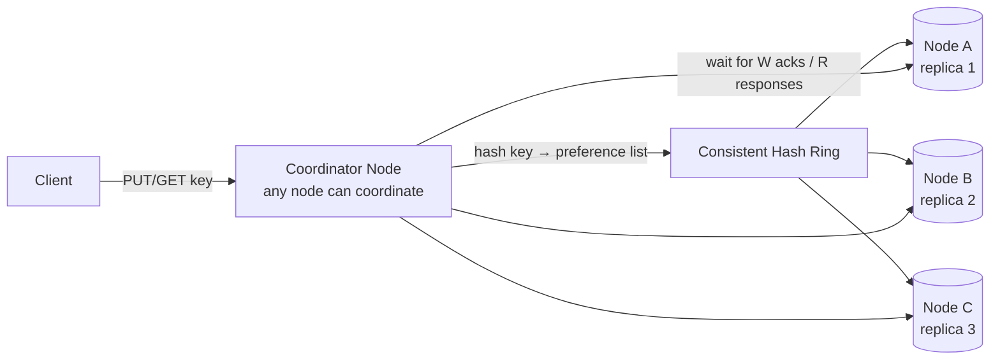
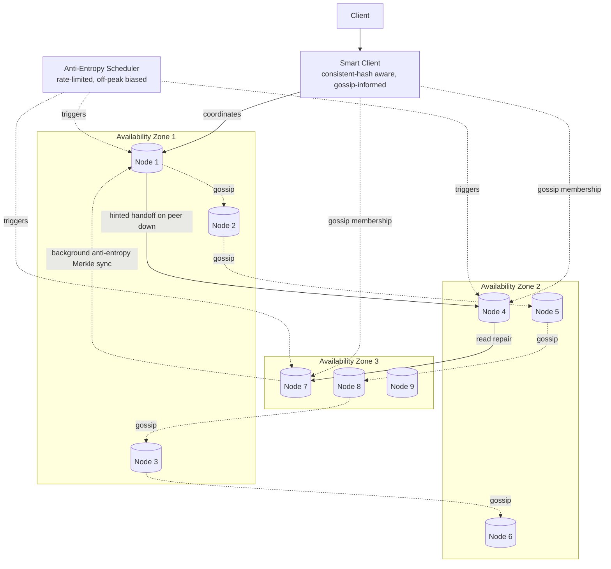

# Design: Distributed Key-Value Store

**Difficulty:** Staff | **Time:** 75–90 minutes

!!! note "Instructions"
    **Cover the solution sections** and work through each step yourself first. Use "Hint" tabs if stuck. Practice explaining out loud — the way you communicate matters as much as the solution.

---

## 1. Problem Statement

Design a distributed key-value store like Amazon DynamoDB or Cassandra's storage core — a horizontally scaled, always-writable, highly available datastore that is the **system of record** for its data, not a cache in front of one. Clients `PUT`, `GET`, and `DELETE` keys; the store partitions data across many nodes, replicates it for durability and availability, and must keep accepting writes even during network partitions.

!!! note "How this differs from Distributed Cache"
    This exercise is conceptually adjacent to [Distributed Cache](distributed-cache.md) — both partition data across nodes and both use consistent hashing — but the NFRs are almost inverted. A cache is disposable (durability best-effort, source of truth lives elsewhere, eviction is a feature); this store **is** the source of truth: data must never be silently lost, there is no upstream database to fall back to on a miss, and there's no eviction policy at all — data lives until explicitly deleted. That single difference cascades into nearly every design decision below: replication exists here for **correctness and durability**, not just to absorb read/write throughput.

---

## 2. Clarifying Questions

Practice asking these before designing:

??? question "What questions should you ask?"
    - **Consistency:** Does every client need strong consistency, or is tunable per-request consistency acceptable (some reads can be fast+stale, others must be fresh)?
    - **Availability vs. consistency under partition:** If the network splits, should the store keep accepting writes on both sides (AP), or refuse writes on the minority side (CP)?
    - **Data model:** Pure key-value, or do we need range queries, secondary indexes, structured values?
    - **Write conflict handling:** If two clients write the same key concurrently during a partition, who wins — last-write-wins, or does the application need to resolve conflicts itself?
    - **Durability guarantee:** How many replicas must acknowledge a write before it's considered durable? What data loss is acceptable on a node failure — none?
    - **Scale:** How many keys, what's the value size distribution, what's the read/write ratio and peak QPS?
    - **Multi-region:** Single datacenter, or does this need to survive a full region loss?

---

## 3. Functional Requirements

- `PUT(key, value)` — write a value, durably, with configurable consistency level
- `GET(key) → value` — read a value, with configurable consistency level
- `DELETE(key)` — remove a value (as a durable operation, not silent eviction)
- Data survives individual node failures with zero loss (given a satisfied write quorum)
- Optional: range scans, secondary indexes, TTL as an explicit, opt-in feature (not the default)

## 4. Non-Functional Requirements

| Property | Requirement |
|----------|-------------|
| Latency | GET/PUT < 10ms p99 (cross-node quorum, same-datacenter) |
| Availability | 99.995% — writes must be accepted even during partial node/network failure |
| Consistency | Tunable per-request; default eventual with read-repair, strong consistency available via quorum overlap |
| Scale | 1B keys, 50 TB total data (post-replication), 500K ops/second peak |
| Durability | **No data loss** once a write is acknowledged to the client — the defining requirement of this system |

!!! tip "Interview Insight 🎯"
    Say the durability line out loud early: **"once acknowledged, a write must never be lost."** That single sentence is what separates this system from the [Distributed Cache](distributed-cache.md) exercise and justifies every expensive choice that follows — synchronous replication to a quorum before ack, hinted handoff instead of just dropping writes to a dead node, anti-entropy instead of "the DB will repopulate it eventually." An interviewer listening for staff-level signal wants to hear you name this trade-off before you start drawing boxes.

---

## 5. Capacity Estimation

```
Data:
  1B keys × avg value size 2KB = 2 TB raw logical data
  Replication factor N=3 → 2 TB × 3 = 6 TB physically stored... but scale target says 50TB,
  so assume larger average value / secondary indexes / multi-table:
  1B keys × avg 16KB (larger structured values) × N=3 replicas ≈ 48 TB ≈ 50 TB — matches target

Ops:
  500K ops/second peak, ~70:30 read/write
  Reads:  350K ops/sec
  Writes: 150K ops/sec

Per-write replication amplification:
  Each logical write becomes N=3 physical writes (one per replica)
  150K writes/sec × 3 = 450K physical write ops/sec across the cluster

Nodes:
  A node (i5.2xlarge-class, NVMe SSD, 32GB RAM) sustains ~20-30K ops/sec and holds ~2TB usable
  By storage: 50 TB / 2 TB per node ≈ 25 nodes minimum
  By throughput: (450K physical writes + 350K reads) / 25K ops/sec per node ≈ 32 nodes
  Provision ~40-50 nodes for headroom, rebalancing overhead, and failure tolerance

Network (replication traffic):
  150K writes/sec × 16KB × 2 extra replica copies (N-1 fanout from coordinator) ≈ 4.8 GB/sec
  cluster-wide inter-node bandwidth just for replication — a real, first-class capacity line item,
  unlike a cache where replication is best-effort and secondary
```

!!! tip "Interview Insight 🎯"
    Notice the replication amplification line — it doesn't exist in the same way for a cache (async, best-effort, "fire and forget"). Here it's a hard multiplier on both storage *and* write throughput, because durability requires synchronous fan-out to a quorum before acknowledging. Naming this cost explicitly, and that it scales with N, shows you understand why Dynamo-style systems treat replication factor as a tunable dial with real cost, not a free availability upgrade.

---

## 6. API Design

```
PUT /keys/{key}?consistency=quorum
Request:  { "value": "...", "vector_clock": "optional, for conditional writes" }
Response: { "vector_clock": "opaque-token-for-next-write" }
Status: 200 OK, or 202 Accepted (if write succeeded at W replicas but below full N)

GET /keys/{key}?consistency=quorum
Response: {
  "values": [ { "value": "...", "vector_clock": "...", "timestamp": "..." } ]
  // >1 entry means unresolved sibling versions — see Conflict Resolution below
}
Status: 200 OK, or 300 Multiple Choices (siblings present, client/app must resolve)

DELETE /keys/{key}
Response: 204 No Content
(internally: a tombstone write, replicated like any other write — not an in-place row deletion)

Consistency levels (per-request, not global):
  ONE      — fastest, least consistent (ack from 1 replica)
  QUORUM   — R or W > N/2, balances latency and consistency
  ALL      — strongest, slowest (ack from all N replicas)
```

!!! note "Why GET can return multiple values"
    Under `ONE` or during a partition, two replicas can each accept a concurrent write to the same key and never agree on an order. Rather than silently picking a "winner" and losing data, the API surfaces both versions (siblings) and lets the client or application-level merge logic resolve them — this is the defining API-shape consequence of choosing availability-over-consistency for writes. See Conflict Resolution below.

---

## 7. Deep Dive: Partitioning via Consistent Hashing

Every key must map deterministically to a physical node, and that mapping must survive nodes joining and leaving without remapping the whole keyspace. This exercise uses the exact same **consistent hashing ring** mechanism as [Distributed Cache](distributed-cache.md) and the full mechanics — virtual nodes, ring rebalancing, the "cascading failure on removal" gotcha — are covered in depth in [Consistent Hashing](../databases/consistent-hashing.md). What's different here is *what the ring is used for*: in a cache, losing a node's slice of the ring means a wave of cache misses; in this store, the ring assignment directly determines **which physical nodes are legally allowed to hold a durable copy of this data** — get the ring wrong and you've silently reduced your replication factor.

**Try it below** — add/remove nodes and keys and watch how ownership boundaries shift on the ring:

<div class="sim-container">
  <div class="sim-title">🔄 Consistent Hashing Ring</div>

  <div class="sim-controls">
    <button class="sim-btn success" onclick="window._ch && window._ch.addNode('N' + (window._ch.nodes.length+1))">+ Add Node</button>
    <button class="sim-btn danger" onclick="window._ch && window._ch.nodes.length > 1 && window._ch.removeNode(window._ch.nodes[window._ch.nodes.length-1].name)">− Remove Node</button>
    <button class="sim-btn" onclick="window._ch && window._ch.addKey('key:'+Math.random().toString(36).substr(2,5))">+ Add Key</button>
    <button class="sim-btn danger" onclick="if(window._ch){window._ch.nodes=[];window._ch.keys=[];['N1','N2','N3'].forEach(n=>window._ch.addNode(n));['user:alice','user:bob','session:xyz','order:123'].forEach(k=>window._ch.addKey(k));}">Reset</button>
  </div>

  <canvas id="ch-ring" style="width:100%;height:280px;"></canvas>

  <div class="sim-stats">
    <div class="sim-stat">
      <div class="sim-stat-label">Nodes</div>
      <div class="sim-stat-value" id="ch-nodes">3</div>
    </div>
    <div class="sim-stat">
      <div class="sim-stat-label">Keys</div>
      <div class="sim-stat-value" id="ch-keys">4</div>
    </div>
  </div>

  <div class="sim-log" id="ch-log"></div>
</div>

**Try:** Add a node → observe that only some keys remapped. Remove a node → only those keys moved to the next node clockwise. In this system, "moved" means a background streaming process must copy that key range's data to its new owner before the old owner can safely drop it — unlike a cache, where the "old" copy can simply expire, here it must be transferred or replicated durably before being discarded.

**The N-replica extension:** a key isn't owned by one node on the ring — it's owned by the **first N distinct physical nodes** encountered walking clockwise from the key's position (skipping virtual nodes that map back to an already-selected physical node). This is what turns the ring from a pure sharding mechanism into a sharding-plus-replication mechanism in one structure.

---

## 8. Deep Dive: Replication Factor N and Quorum Reads/Writes

With replication factor **N**, every key is stored on N nodes (its "preference list," per Dynamo terminology). The system doesn't require all N to participate in every operation — it requires a **quorum**.

```
R = number of replicas that must respond to a read
W = number of replicas that must acknowledge a write
N = replication factor

Guarantee: if R + W > N, every read overlaps with every possible write quorum by
at least one node — so at least one replica in any read quorum has seen the most
recent successfully-acknowledged write. This is what gives "read-your-writes"-style
guarantees without requiring all N nodes to be involved in every operation.

Common configurations at N=3:
  W=1, R=1   → fastest, weakest (no overlap guarantee — availability-first)
  W=2, R=2   → R+W=4 > N=3 → strong-ish guarantee, tolerates 1 node down per op
  W=3, R=1   → strong write, fast read, but write unavailable if any replica is down
  W=1, R=3   → fast write, strong read, but read unavailable if any replica is down
```

The full theory behind this trade-off — what "tunable consistency" actually buys you, and where it breaks down — is covered in [Consistency Models](../distributed-systems/consistency-models.md) and the quorum mechanics specifically in [Replication](../distributed-systems/replication.md). The key design decision to surface in an interview: **this is a per-request dial, not a cluster-wide setting.** A financial-ledger write might use `W=3` (wait for full durability); a like-counter increment might use `W=1` (favor availability, tolerate rare loss). Exposing consistency as a request parameter — as the API design above does — is what makes this a *general-purpose* store rather than one hardcoded trade-off.

!!! tip "Interview Insight 🎯"
    A common trap: assuming `R+W > N` gives you linearizability. It doesn't — it guarantees you'll *see* the latest acknowledged write in your read quorum, but concurrent writes can still race each other and produce siblings (see below), and clock skew between nodes means "latest" by timestamp isn't necessarily "latest" by real-world order. Quorum overlap is a strong-*consistency-flavored* guarantee, not linearizability — naming that distinction precisely is a staff-level signal.

---

## 9. Deep Dive: Conflict Resolution

Because writes can be accepted independently by different replicas (especially under `W < N` or during a partition), the same key can end up with genuinely concurrent, conflicting versions. Two strategies, covered in more depth in [Replication § Conflict Resolution](../distributed-systems/replication.md#conflict-resolution):

=== "Last-Write-Wins (LWW)"
    Attach a timestamp to every write; on conflict, the write with the later timestamp wins and the other is discarded. **Pro:** simple, no client-side merge logic required, small metadata overhead. **Con:** relies on synchronized clocks (clock skew can silently pick the "wrong" winner) and **silently drops data** — a legitimate concurrent write just disappears. Acceptable for data where losing a stale update is low-cost (e.g., a "last seen" timestamp, a cache-adjacent counter) — not acceptable for data where every write matters (e.g., a shopping cart, a financial transaction).

=== "Vector Clocks"
    Each value carries a vector clock — a per-replica-coordinator counter — that lets the system determine whether one version **causally descends from** another (safe to discard the ancestor) or the two are **concurrent** (neither descends from the other — a real conflict). On a genuine conflict, the store does **not** pick a winner: it returns both sibling versions to the client (the `300 Multiple Choices` / multi-value `GET` response in the API above), and the application resolves them with domain knowledge (e.g., a shopping cart merges siblings as a set union of items rather than picking one). **Pro:** never silently loses data. **Con:** more complex, more storage/response overhead for the vector clock metadata, and pushes resolution work up to the application, which must be designed to handle it.

**Recommended default:** vector clocks with application-level merge, because the system's entire premise is "durability guarantee, never silently lose an acknowledged write" — LWW violates that premise on genuine concurrent conflicts. Offer LWW as an explicit opt-in for specific low-stakes key types where the operational simplicity is worth the risk.

---

## 10. Deep Dive: Hinted Handoff and Anti-Entropy

Even with quorum writes, the cluster must keep converging toward full replication after transient failures — this is where durability actually gets defended in practice, not just in the write path.

**Hinted handoff:** if a node that should receive a replica write is temporarily down, the coordinator writes to a substitute node instead, tagged with a "hint" saying which node it's really meant for. When the original node comes back, the hint is replayed to it and then discarded. This lets writes still succeed (satisfying `W`) during a transient single-node outage without permanently under-replicating the key — the alternative (just failing the write, or silently under-replicating with no record of it) is worse on both availability and durability.

**Read repair:** on a quorum read, if the replicas queried return divergent versions, the coordinator resolves them (via vector clocks) and pushes the correct version back to the stale replicas as part of serving the read — piggybacking convergence onto normal read traffic at near-zero extra cost.

**Anti-entropy (background):** hinted handoff and read repair only fix divergence for keys that get read or whose owning node comes back online quickly. Cold keys that are rarely read can silently drift out of sync indefinitely. A background anti-entropy process — typically comparing **Merkle trees** of each replica's key range — periodically finds and repairs divergence across all replicas, including ones that never get a live read. This is the mechanism that gives the system its **eventual** convergence guarantee even for data nobody's actively touching.

```
Merkle tree comparison (conceptual):
  Each replica builds a tree of hashes over its key range (leaves = hash of small key ranges,
  parents = hash of children)
  Two replicas exchange only the root hash first — if it matches, the whole range is in sync,
  no further comparison needed
  If it differs, recurse down the mismatched branches only — finds the actual diverging
  keys without transferring or comparing the entire dataset
```

---

## 11. Deep Dive: Gossip-Based Membership and Failure Detection

At Staff scope, how nodes learn about each other and detect failure matters as much as how they store data. Two common approaches:

=== "Centralized coordinator (like a cache's ZooKeeper/etcd)"
    A [Distributed Cache](distributed-cache.md)-style design leans on a coordinator to track membership and health. Simpler to reason about, but the coordinator becomes a scaling and availability bottleneck as cluster size grows, and it's an extra hard dependency for an already-critical-path durability system.

=== "Gossip protocol (Dynamo-style, used here)"
    Nodes periodically exchange state with a small random subset of peers ("I've heard node X is alive as of time T, node Y I haven't heard from in a while"). Membership and failure-suspicion information propagates epidemically through the cluster in `O(log N)` rounds without any single coordinator. Each node maintains a local view of cluster membership that's eventually consistent with every other node's view.

    **Failure detection:** rather than a binary alive/dead flag, nodes typically use a **phi accrual failure detector** — a continuously-valued suspicion level based on the statistical distribution of recent heartbeat intervals, rather than a fixed timeout. This adapts to network conditions (a node on a slower link isn't falsely marked dead just because its heartbeats are naturally a bit slower) and avoids the flapping that a hard timeout threshold produces under load.

**Why this matters at Staff level:** gossip removes the single coordinator as a scaling ceiling and as an availability dependency — the property this whole system is built around (keep accepting writes during partial failure) would be undermined by a hard dependency on a coordinator that itself needs quorum to stay available. It's a deliberate architectural choice, not an implementation detail, and worth naming as such.

---

## 12. Basic Architecture (Version 1)



Any node can act as coordinator for a given request (routing the key to its preference list via the ring) — there's no dedicated router tier, which is itself a durability-relevant choice: no single "routing service" is a point of failure for the write path.

---

## 13. Identify Bottlenecks

???+ question "Where does this design break at 500K ops/second with N=3?"
    - **Coordinator hotspotting:** if clients always route through the same node, that node's network/CPU becomes a bottleneck even though data is well-distributed — needs a smart client or load-balanced coordinator selection
    - **Cross-AZ replication cost/latency:** synchronous quorum writes across availability zones add real network latency to every write — placement of replicas matters, not just count
    - **Anti-entropy overhead:** Merkle tree comparison across 40-50 nodes at 50TB scale is not free — needs to be rate-limited and scheduled to avoid competing with live traffic
    - **Hot partition:** a single very popular key still lands on one preference list of N nodes — replication factor doesn't fix key-level hotspotting, only node-level failure tolerance
    - **Gossip convergence time:** at larger cluster sizes, gossip round count to reach full convergence grows — membership changes take longer to propagate, widening the window where some nodes have a stale view

---

## 14. Scaled Architecture (Version 2)



The preference list for any key is deliberately spread across availability zones (not just across nodes) — the ring placement algorithm skips virtual nodes that would put two replicas of the same key in the same AZ. This is the mechanism that lets the system survive a full AZ outage without losing any acknowledged write, as long as `W` was satisfied across at least two AZs.

---

## 15. Failure Modes

=== "Single Node Failure"
    - Coordinator's write to that node times out; hinted handoff kicks in — a substitute node accepts the write with a hint, `W` is still satisfied by the remaining replicas + substitute
    - Reads against the preference list still succeed via the remaining live replicas, as long as `R` is satisfiable
    - **Mitigation:** hinted handoff (write path) + read repair (read path) + gossip-driven fast failure detection to stop routing to the dead node quickly

=== "Network Partition (Split Brain Risk)"
    - Both sides of the partition may have clients that want to write the same key
    - Because this system is availability-first (AP-leaning, per CAP), **both sides keep accepting writes** rather than one side refusing — this is a deliberate choice, not a bug
    - **Consequence:** guaranteed sibling versions on that key once the partition heals — resolved via vector clocks + application merge logic (see Conflict Resolution)
    - **Mitigation:** this is the core trade-off of choosing Dynamo-style AP over a CP design (e.g., a Raft-based store like etcd, see [Raft](../distributed-systems/raft.md)) — the honest answer in an interview is "we chose to accept this and handle it at the conflict-resolution layer" rather than pretending it can be avoided

=== "Full Availability Zone Loss"
    - Because preference lists are AZ-aware, no key loses more than roughly 1/3 of its replicas (at N=3, one replica per AZ)
    - Writes with `W=2` continue succeeding using the two surviving AZs; `W=3` writes are blocked until the AZ recovers or `W` is relaxed
    - **Mitigation:** AZ-aware replica placement is the load-bearing design choice here — without it, an unlucky ring assignment could put 2+ replicas of a key in the same AZ, and that AZ's loss would violate the durability guarantee outright

=== "Anti-Entropy Falls Behind"
    - Cold, rarely-read keys accumulate un-repaired divergence between replicas
    - **Mitigation:** monitor Merkle tree sync lag as a first-class metric, not an afterthought; rate-limit anti-entropy to avoid starving live traffic, but never disable it — it's the only mechanism defending convergence for data that isn't being actively read

=== "Clock Skew (LWW-configured keys only)"
    - If any key types are configured for LWW instead of vector clocks, a node with a fast clock can cause an older write to incorrectly "win" over a logically later one
    - **Mitigation:** NTP-synchronized clocks across the fleet as a baseline; prefer vector clocks for anything where this failure mode is unacceptable — this is exactly why LWW is the opt-in exception, not the default, in this design

---

## 16. Consistency Considerations

- **Tunable, not fixed.** Unlike a cache (always eventual) or a traditional RDBMS (always strong), this system exposes `R`/`W`/`N` and lets each request choose its point on the consistency-latency-availability spectrum. See [Consistency Models](../distributed-systems/consistency-models.md) for the full spectrum this is drawing from.
- **`R + W > N` is a quorum-overlap guarantee, not linearizability** — see the Interview Insight in section 8. Don't oversell it in an interview; naming the precise guarantee it does and doesn't provide is the signal.
- **Durability is decoupled from consistency.** A `W=1` write is durable in the sense that it's on stable storage on one node (assuming that node fsyncs before acking) — it's just not yet *widely* replicated. The hinted-handoff/read-repair/anti-entropy machinery exists precisely to close that gap asynchronously without blocking the client on it.
- **Tombstones, not deletes.** A `DELETE` is itself a replicated write (a tombstone marker), not an in-place removal — otherwise a node that was down during the delete could "resurrect" the value during anti-entropy sync by reintroducing an old version. Tombstones are kept for a grace period (long enough for anti-entropy to propagate them everywhere) before being permanently garbage-collected.

---

## 17. Observability

```
Key metrics:
- put_latency_p50/p95/p99 and get_latency_p50/p95/p99, broken out by consistency level
- write_quorum_failure_rate (writes that couldn't reach W acks — availability signal)
- sibling_rate (percentage of reads returning >1 version — conflict-resolution load signal)
- hinted_handoff_queue_depth (per node — growing queue signals a node is down longer than expected)
- anti_entropy_lag (how far behind Merkle sync is, per node pair)
- gossip_convergence_time (how long membership changes take to propagate cluster-wide)
- replica_distribution_per_az (detect AZ-placement skew)

Alerts:
- write_quorum_failure_rate > 0.1%
- hinted_handoff_queue_depth growing unbounded on any node (likely a permanently dead node, not transient)
- anti_entropy_lag exceeding a defined SLA window (e.g., > 24h for any key range)
- sibling_rate spike (could indicate a partition event or a client-side bug generating spurious concurrent writes)
```

---

## 18. Cost Analysis

```
Storage nodes (45 nodes, NVMe SSD, ~2TB usable each, 32GB RAM): ~$13,500/month
Cross-AZ replication network traffic (quorum writes, ~4.8 GB/s sustained): ~$3,000/month
Anti-entropy background traffic (rate-limited, off-peak):                  ~$500/month
Gossip/membership overhead (lightweight, small messages):                  negligible
Total:                                                                      ~$17,000/month

Cost per operation:
  500K ops/sec × 2.6M seconds/month ≈ 1.3B ops/month
  $17,000 / 1.3B ≈ $0.000013 per operation

Compare to the Distributed Cache exercise's ~$0.0000008/op — the ~16× higher per-op cost here
is the direct, quantifiable price of durability: synchronous cross-AZ replication, SSD-backed
persistent storage instead of pure RAM, and anti-entropy traffic, none of which a best-effort
cache needs to pay for.
```

---

## 19. Alternative Architectures

=== "CP instead of AP (Raft/Paxos-consensus-based store)"
    Use a consensus protocol (see [Raft](../distributed-systems/raft.md)) so the cluster refuses writes on a minority partition rather than accepting divergent writes on both sides. Trade-off: strictly stronger consistency (no siblings, no application-level conflict resolution needed) at the cost of write unavailability during a partition — the opposite trade-off from this exercise's Dynamo-style design. Appropriate when correctness-under-partition matters more than write availability (e.g., leader election metadata, distributed locks) rather than general-purpose application data.

=== "Managed Service (DynamoDB / Cosmos DB)"
    Use a fully managed Dynamo-style store instead of operating the cluster yourself. Gets you the same architectural properties described here (partitioning, tunable consistency, quorum replication) without operating gossip, anti-entropy, or hinted handoff yourself. Trade-off: less control over placement/tuning, cost model shifts to pay-per-request/provisioned-throughput, and vendor lock-in on the specific API surface.

---

## 20. Staff Engineer Extensions

=== "100× Traffic"
    At 50M ops/second, node count scales roughly linearly for storage and throughput, but cross-AZ replication network cost becomes the dominant line item — consider whether every key type truly needs `W=2`+ cross-AZ, or whether some can be relaxed to `W=1` with async replication for keys where the durability requirement is genuinely lower than the default.

=== "Cut Cost by 30%"
    Segment key types by actual durability need rather than applying one global `N=3, W=2` policy to everything — low-value ephemeral data (rate-limit counters, session tokens) can run at `N=2` or even `N=1` with a shorter anti-entropy cadence, freeing capacity for the data that genuinely needs full durability. This tiering is only possible because consistency/durability were designed as per-request knobs from the start, not hardcoded.

=== "Global Expansion"
    Multi-region needs a second replication tier above the intra-region N-way replication described here: either async cross-region replication (each region has its own full N-way replica set, with cross-region as a slower, eventually-consistent layer — most Dynamo-style systems' actual global mode) or, for a smaller "global" key subset, extending the preference list across regions at the cost of much higher write latency. Be explicit in an interview that these are different consistency/latency trade-offs, not a trivial extension of the AZ-aware placement already in the design.

=== "Data Residency"
    Tag keys with a residency requirement and route their preference list construction to only consider nodes within the permitted region/country — this is a direct extension of the AZ-aware placement logic already used to spread replicas across AZs, just with a harder legal boundary instead of a soft availability-optimization boundary. Cross-region anti-entropy and gossip must also respect this boundary — a resident key's data must never even transiently land on a hinted-handoff node outside its region.

=== "Regional Failure"
    If replication is region-local (the common case, per the Global Expansion extension above), a full region loss means that region's data is unavailable until failover — mitigated by having a documented cross-region async replica for critical key types that can be promoted, accepting the RPO (data since last async replication) as a known, quantified gap rather than an assumed guarantee.

=== "Zero-Downtime Replication Factor Change (N=3 → N=5)"
    1. Update the ring/placement metadata to compute 5-node preference lists for new writes going forward
    2. Background-stream historical data to the two new replica positions per key range (the same mechanism used for node join/leave rebalancing)
    3. Track per-key-range replication completeness; don't consider a range "done" until confirmed at N=5
    4. Only after full backfill confirmation, start counting the new replicas toward quorum satisfaction for reads
    5. This is inherently gradual — unlike a stateless service redeploy, there's no way to atomically flip replication factor across 50TB of existing data

---

## 21. Interview Follow-ups

1. **"How is this different from just running Distributed Cache with persistence turned on?"** — Durability changes the write path fundamentally: synchronous quorum acknowledgment before returning success, hinted handoff instead of dropping writes to a dead node, anti-entropy instead of relying on an upstream source of truth, and no eviction. It's not a config flag on a cache — it's a different set of guarantees the whole system is built around.
2. **"What happens if `R + W ≤ N`?"** — You lose the quorum-overlap guarantee: a read can complete entirely against replicas that haven't seen the latest write. This is a valid, deliberate choice for read-heavy, latency-sensitive workloads that can tolerate staleness — but it should be a conscious per-key-type decision, not an accident of default configuration.
3. **"How do you handle a client that never resolves sibling versions?"** — Siblings accumulate and get returned on every subsequent read until resolved; the store can apply an eventual LWW fallback after a bounded time/version-count threshold as a safety valve, but this should be logged and alerted on since it indicates an application-layer bug in conflict handling.
4. **"Why gossip instead of just using ZooKeeper/etcd like the cache exercise did?"** — A coordinator-based design makes cluster membership availability depend on the coordinator's own quorum — acceptable for a cache (worst case, can't rebalance, but still serves traffic) but a poor fit here, where the entire point of the design is to keep accepting durable writes during partial failure; gossip removes that dependency at the cost of eventually-consistent (not instant) membership views.

---

## Self-Assessment

- [ ] Can I explain why replication here exists for durability/correctness, not just availability or throughput, and how that changes the write path versus a cache?
- [ ] Can I state precisely what `R + W > N` does and does not guarantee?
- [ ] Can I walk through vector clocks vs. last-write-wins and justify which is the safer default for this system?
- [ ] Can I explain hinted handoff, read repair, and anti-entropy as three distinct mechanisms defending convergence at different timescales?
- [ ] Can I justify gossip-based membership over a centralized coordinator given this system's core availability requirement?
- [ ] Can I walk through what happens end-to-end during a full availability zone loss, including which writes succeed and which don't?
