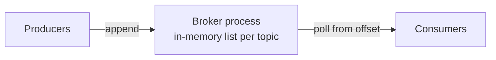
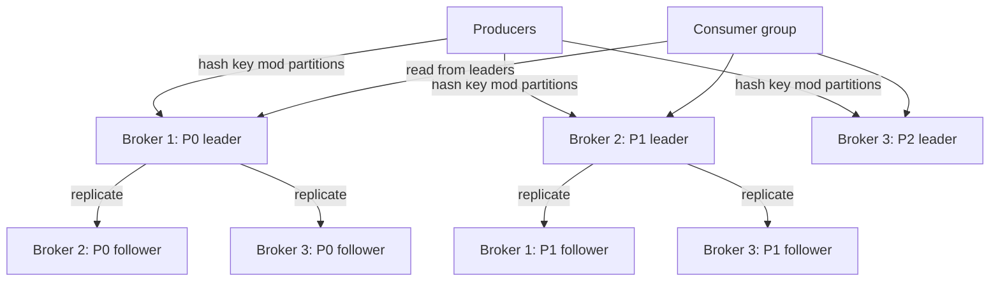
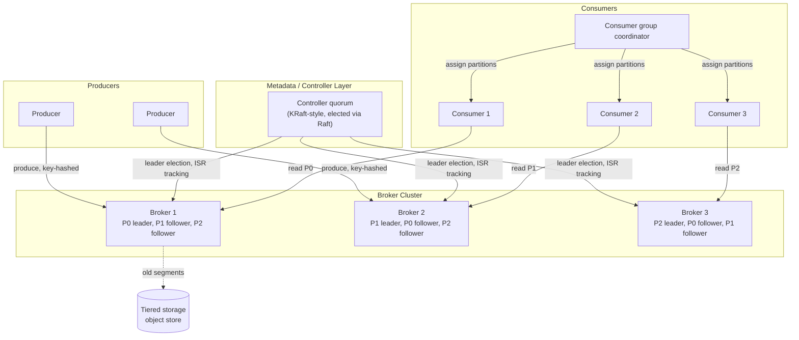

# Design: Distributed Message Queue (Kafka-like)

**Difficulty:** Senior → Staff | **Time:** 60–75 minutes

!!! note "Instructions"
    Cover each section and work it yourself first. The [Kafka Deep Dive](../messaging/kafka.md) and [Kafka Internals & Pulsar Comparison](../messaging/kafka-internals-pulsar-comparison.md) pages own the mechanics of ISR, rebalancing, and offset tracking — link to them for depth rather than re-deriving. This page is the *system design*: requirements, capacity, version-by-version evolution, and failure trade-offs.

---

## 1. Problem Statement

Design a distributed message queue like Kafka: producers write messages to named topics, topics are split into partitions for parallelism, and consumer groups read those partitions with tracked offsets.

Every other exercise on this site designs a system that *uses* infrastructure — a cache, a database, an object store — to serve its own users. This one is different: **the system itself is the durability and ordering guarantee that other systems depend on.** The [notification system](notification-system.md) and [web crawler](web-crawler.md) exercises both assume a queue like this sits underneath them — they are consumers of durable, ordered delivery, not builders of it. If this design silently drops a message, every system built on top of it inherits that bug without knowing it. If this design reorders messages within a partition, any consumer relying on per-key ordering (e.g. "process a user's events in the order they happened") is wrong in a way that's nearly impossible to detect downstream.

That asymmetry — the queue's correctness bugs are invisible until a consumer's business logic breaks weeks later — is what should drive every version below. Do not start with partitioning. Start with: what does "the message is safe" mean, and when are you allowed to say so to the producer?

---

## 2. Clarifying Questions

??? question "What questions should you ask?"
    - **Ordering scope:** Global order, or is per-key order (e.g. per user, per order id) sufficient?
    - **Durability bar:** Can we ever lose an acknowledged message? Under what failure (disk, single broker, whole rack)?
    - **Delivery semantics:** At-least-once, at-most-once, or exactly-once? Who owns idempotency — the queue or the consumer?
    - **Retention:** Delete after consumption (traditional queue) or keep for a fixed window regardless of consumption (log)?
    - **Throughput shape:** Steady stream, or bursty (e.g. batch jobs producing millions of events at once)?
    - **Message size:** Small events (hundreds of bytes) or larger payloads (KBs–MBs)? Affects segment sizing and network budget.
    - **Consumer fan-out:** One consumer group, or many independent groups reading the same topic (e.g. analytics + billing + audit all reading "orders")?
    - **Multi-region:** Single region, or does data need to exist in multiple regions for latency or residency?
    - **Schema evolution:** Do producers and consumers need compatibility guarantees on message format over time?

---

## 3. Functional Requirements

- Producers publish messages to a named topic, optionally with a partition key
- Topics are split into partitions; messages within a partition are strictly ordered
- Consumers join a named consumer group; partitions are distributed across the group's members
- Consumers track progress via a committed offset per partition, per group
- Messages are retained for a configurable period (or size), independent of whether they've been consumed
- Support replay: a consumer group can reset its offset and re-read history within the retention window

## 4. Non-Functional Requirements

| Property | Requirement | Reasoning |
|----------|-------------|-----------|
| Ordering | Strict order **within a partition**; no guarantee across partitions | Global order would serialize all writes onto one partition — kills throughput. This is the trade every real system like this makes. |
| Durability | Zero message loss for any message acknowledged with `acks=all`, surviving loss of any *one* broker | The queue is the durability contract other systems build on; a silent drop is worse than a visible error |
| Replication factor | RF=3 by default for durability-critical topics | Tolerates one broker failure without data loss (needs 2 of 3 to survive) |
| Throughput | 1M messages/sec sustained across the cluster | Realistic for a shared platform backing multiple services |
| Latency | Produce ack < 10ms p99 at `acks=1`; < 50ms p99 at `acks=all` | Producers are often in a request path (e.g. outbox pattern) |
| Consumer scalability | Add consumers up to partition count without a code change | Parallelism is the whole point of partitioning |
| Availability | Cluster survives loss of any single broker with no downtime for unaffected partitions | Broker failures are routine at this scale, not exceptional |

!!! tip "Interview Insight 🎯"
    Say the ordering trade-off out loud before anyone asks: "ordering is per-partition, not global, and that's a deliberate design choice, not a limitation I forgot about." Interviewers are listening for whether you understand *why* Kafka doesn't offer global ordering — it's the price of horizontal write throughput.

---

## 5. Capacity Estimation

```
Producers:
  1M messages/sec sustained, avg message size 1 KB, p99 size 10 KB
  Peak (3x): 3M messages/sec

Ingest bandwidth:
  1M msg/s x 1 KB = ~1 GB/s average, ~3 GB/s peak (this is what the producer
  sends to the leader — logical ingress, one copy)
  With RF=3: leader writes 1 copy locally + sends 2 copies to followers.
  Total physical disk-write volume across the cluster = 3x logical ingress
  ≈ 3 GB/s average, 9 GB/s peak — but "replication traffic" specifically
  (the network bytes the leader sends OUT to followers, separate from the
  producer→leader bytes it already received) is only the 2 follower
  copies ≈ 2x logical ingress ≈ 2 GB/s average, 6 GB/s peak. Don't double-
  count the leader's own local write as "replication" — it isn't network
  traffic, and the 3x figure is total disk-write volume, not network load.

Retention:
  7-day default retention window
  1 GB/s x 86,400 s/day x 7 days ≈ 605 TB of *logical* data
  With RF=3 (3 physical copies): ~1.8 PB of disk across the cluster

Partitioning:
  Target: no single partition exceeds ~10 MB/s of a broker's disk write bandwidth
  1 GB/s / 10 MB/s per partition ≈ 100 partitions minimum, provision 300-500 for headroom and future consumer parallelism

Brokers:
  Each broker: ~20 TB usable disk (multiple disks per node), ~500 MB/s sustained disk write budget
  1.8 PB / 20 TB per broker ≈ 90 brokers minimum just for storage
  9 GB/s peak total disk-write volume (not just network replication —
  every byte written to disk across the cluster, leader + follower copies)
  / 500 MB/s per broker ≈ 18 brokers minimum just for write bandwidth
  Storage is the binding constraint here: a cluster of 90-120 brokers at 20 TB each is a realistic target

Consumer fan-out:
  If 5 independent consumer groups each read the full topic (analytics, billing, audit, search, archival):
  Read bandwidth = 5 x 1 GB/s = 5 GB/s — reads are the multiplier, not writes
  This is why reads should come from OS page cache / follower reads, not force every read to the partition leader's disk
```

!!! abstract "Mental Model"
    A traditional queue (RabbitMQ-style) deletes a message once consumed — storage is bounded by backlog. This design keeps every message for a *time window regardless of consumption* — storage is bounded by **retention x throughput**, not by how fast consumers keep up. That single decision is what makes replay, multiple independent consumer groups, and "replay from yesterday" possible — and it's why capacity planning here is about disk, not about queue depth.

---

## 6. API Design

```
# Producer
POST /topics/{topic}/messages
Request:  { "key": "user:123", "value": "<bytes>", "headers": {...} }
Response: { "partition": 4, "offset": 918273, "timestamp": "..." }
  acks=0    → return immediately, no durability guarantee
  acks=1    → return after partition leader writes to its local log
  acks=all  → return after all in-sync replicas acknowledge

# Consumer group membership
POST /consumer-groups/{group}/join
Request:  { "consumer_id": "c-7", "topics": ["orders"] }
Response: { "assigned_partitions": [3, 4], "generation_id": 42 }

# Poll (long-poll style)
GET /consumer-groups/{group}/poll?partition=4&offset=918200&max_wait_ms=500&max_bytes=1MB
Response: { "messages": [ { "offset": 918200, "key": "...", "value": "..." }, ... ] }

# Offset commit
POST /consumer-groups/{group}/commit
Request:  { "partition": 4, "offset": 918273 }

# Admin
POST /topics                         { "name": "orders", "partitions": 200, "replication_factor": 3 }
GET  /topics/{topic}/partitions/{n}/watermark   → { "earliest": 800000, "latest": 918273 }
```

!!! warning "Production Trap ⚠️"
    Committing an offset *before* the message is fully processed (auto-commit on poll) is the single most common source of silent message loss reports. If the consumer crashes between commit and processing, that message is gone from the consumer's perspective forever — the queue did its job, the consumer lied about finishing. Commit *after* processing, or use a transactional read-process-write.

---

## 7. Data Model — the log-structured partition

A partition is not a queue data structure — it's an **append-only log on disk**, split into segment files so old data can be deleted or compacted in whole-file chunks instead of row-by-row.

```
Partition 4 directory:
  00000000000000000000.log   (offsets 0 - 499,999, sealed, immutable)
  00000000000000000000.index (offset → byte position, sparse)
  00000000000500000000.log   (offsets 500,000 - 999,999, sealed)
  00000000000500000000.index
  00000000001000000000.log   (offsets 1,000,000+, active — currently written to)
  00000000001000000000.index

Each record in a .log file:
  [offset: 8B][length: 4B][crc: 4B][timestamp: 8B][key][value][headers]

Producer append = O(1): fsync to the end of the active segment. No seeks, no random writes.
Consumer read = seek via sparse index to nearest byte offset, then scan forward — O(log n) to locate, O(1) per subsequent read.
```

Segment rolling: when the active segment hits a size or age threshold (e.g. 1 GB or 7 days), it seals and a new one opens. Retention deletes whole sealed segments once every record in them is older than the retention window — never a row-level delete.

Offset tracking per consumer group lives in a separate internal log (Kafka calls this `__consumer_offsets`), keyed by `(group, topic, partition) → committed_offset`, replicated the same way as any other partition — the offset store gets the same durability guarantee as the data it tracks.

---

## 8. Version 1 — simplest thing that works

Single broker process. Each topic has exactly one partition. Messages live in an in-memory list. No replication.



```python
# V1 — single broker, single partition per topic, in-memory
class Broker:
    def __init__(self):
        self.topics: dict[str, list[Message]] = {}

    def produce(self, topic: str, value: bytes) -> int:
        log = self.topics.setdefault(topic, [])
        offset = len(log)
        log.append(Message(offset=offset, value=value, ts=now()))
        return offset  # "acked" the instant it's appended — nothing durable yet

    def poll(self, topic: str, from_offset: int, max_msgs: int = 100) -> list[Message]:
        log = self.topics.get(topic, [])
        return log[from_offset:from_offset + max_msgs]
```

This handles a single service's event stream fine in a demo. Ship it, then find the actual bottleneck before adding infrastructure.

---

## 9. Identify the bottleneck

???+ question "What breaks first, and why?"
    - **The broker process crashes or restarts:** every message in the in-memory list is gone. There is no disk, so this isn't "some data loss" — it's *total* loss of everything since the last consumer read. For a system whose entire job is "don't lose messages," this is disqualifying, not a tuning problem.
    - **Single broker = throughput ceiling:** all producers and all consumers funnel through one process's CPU, memory, and NIC. There's no way to add capacity except a bigger machine — no horizontal scaling exists yet.
    - **Single partition per topic = no consumer parallelism:** even with many consumers in a group, only one can read a given partition's messages in order at a time (or you break ordering). Ten consumers reading a single-partition topic gives you the throughput of one.
    - **Single broker = single point of failure, full stop.** Any restart, deploy, or hardware fault takes every topic offline simultaneously.

    The fix for loss-on-crash is disk + replication. The fix for the throughput ceiling is more partitions across more brokers. These are two different problems and Version 2 addresses both, in that order, because durability comes before scale.

---

## 10. Version 2 — partitioning and replication

Split each topic into multiple partitions distributed across multiple brokers. Each partition gets a **leader** (handles all reads/writes for that partition) and N-1 **followers** replicating it. Producers hash the message key to pick a partition, so all messages for the same key land in the same partition — and therefore keep their order.



```python
import zlib

def choose_partition(key: bytes, num_partitions: int) -> int:
    # NOT Python's built-in hash(): CPython randomizes str/bytes hashing
    # per-process by default (PYTHONHASHSEED) for DoS-resistance, so
    # hash(key) % num_partitions would map the SAME key to DIFFERENT
    # partitions across producer restarts or across separate processes —
    # exactly the "same key -> same partition, always" guarantee this
    # function exists to provide would silently break.
    # Use a stable, seed-independent hash instead. CRC32 (used here, via
    # Python's stdlib zlib, purely for a self-contained example with no
    # extra dependency) works fine for this illustration. Kafka's own
    # Java client does NOT default to CRC32 for partition selection —
    # its DefaultPartitioner/StickyPartitioner uses Murmur2 specifically
    # (CRC32 shows up elsewhere in Kafka's protocol, for message
    # checksums, which is an easy mix-up). If you're actually replicating
    # Kafka's exact partition-assignment behavior rather than just
    # building a stable custom hash, use Murmur2 or xxHash, not CRC32.
    return zlib.crc32(key) % num_partitions  # same key -> same partition, always

def produce(topic: str, key: bytes, value: bytes, acks: str = "all") -> int:
    partition = choose_partition(key, num_partitions(topic))
    leader = leader_for(topic, partition)
    offset = leader.append(value)
    if acks == "0":
        return offset                              # fire and forget
    if acks == "1":
        return offset                              # leader wrote to its local log; return now
    # acks == "all": wait for every in-sync replica to confirm
    wait_for_isr_ack(topic, partition, offset)
    return offset
```

**Producer acks trade-off:**

| Setting | Waits for | Throughput | Durability |
|---------|-----------|------------|------------|
| `acks=0` | Nothing — send and move on | Highest | Message lost if send fails silently; no retry possible |
| `acks=1` | Leader's local write | High | Lost if leader crashes before followers replicate |
| `acks=all` | All in-sync replicas | Lower, higher latency | Survives loss of any single replica (with RF≥2 in ISR) |

For internals on ISR mechanics and how followers catch up, see [Kafka Deep Dive](../messaging/kafka.md#isr-in-sync-replicas) and [Kafka Internals](../messaging/kafka-internals-pulsar-comparison.md#in-sync-replicas-isr-the-source-of-truth).

---

## 11. Identify the next bottleneck

???+ question "Partitioning and replication are in place. What breaks next, and at what scale?"
    - **Hot partition:** one key (a single large tenant, a celebrity user id) generates 50x the traffic of every other key. Its partition's broker saturates CPU/disk while every other broker sits idle — adding more partitions doesn't help because that key still hashes to one partition. Every consumer assigned other partitions looks healthy while the one consumer on the hot partition falls further behind every second.
    - **Slow consumer, unbounded disk growth:** this design retains messages for a time window regardless of consumption — that's a feature (replay) until a consumer group stops committing offsets entirely (bug, or a dead downstream service) and nobody notices. Disk fills toward the retention limit on schedule, not on demand, so it looks fine until it silently isn't — the fix is monitoring consumer lag against retention headroom, not blindly growing disk.
    - **Rebalance storm:** partitions get reassigned every time a consumer joins or leaves the group, and during a rebalance the group stops consuming entirely. A consumer that's just slightly too slow to process a batch before `max.poll.interval.ms` gets kicked out, rejoins, triggers another rebalance, and repeats — turning one slow consumer into a repeating outage for the whole group. See [Kafka Internals — Rebalancing](../messaging/kafka-internals-pulsar-comparison.md#rebalancing-the-latency-killer) for the full mechanics and fix (`max.poll.interval.ms` tuning, cooperative rebalancing).

---

## 12. Version 3 — production architecture



Key production decisions:

- **Metadata/controller layer.** A small quorum (ZooKeeper historically, or a built-in KRaft-style Raft quorum in modern Kafka) tracks partition-to-broker assignment, the ISR set per partition, and runs leader election when a broker dies. The election mechanics themselves — quorum votes, terms, log matching — are exactly [Raft](../distributed-systems/raft.md); this layer is Raft applied to "who leads this partition," not a new consensus algorithm.
- **Consumer group coordinator.** One broker per group tracks membership and drives rebalances via heartbeats, deciding which consumer owns which partition and committing that assignment.
- **Retention and compaction.** Time/size-based retention deletes whole sealed segments; log compaction (for keyed topics like "latest account balance per user") instead retains only the most recent value per key indefinitely, trading history for a bounded, replayable snapshot.
- **Rack/AZ-aware replica placement.** Followers for a partition are placed in different availability zones than the leader, so a single AZ failure doesn't take out a majority of a partition's replicas at once.

---

## 13. Failure analysis

=== "Partition leader failure and failover"
    A partition's leader broker crashes. The controller detects the missing heartbeat, picks a replacement leader from the partition's in-sync replica set, and updates cluster metadata. Producers and consumers get a "not leader" error on their next request, refresh metadata, and redirect to the new leader. **Cost:** a brief window (typically low seconds) of unavailability for that partition only — other partitions on other brokers are unaffected. **Mitigation:** keep ISR healthy (min 2 replicas in sync) so failover always has a caught-up candidate; alert on `under_replicated_partitions > 0` before a failure, not after.

=== "Network partition causing split-brain on leadership"
    A broker is still alive but network-isolated from the controller quorum and its followers. Without a fencing mechanism, it might keep acting as leader while the controller elects a new one elsewhere — two brokers both believing they're the leader for the same partition, accepting writes independently. **Mitigation:** leadership is tied to a fencing token/epoch from the controller quorum (the same generation-number pattern used in Raft's term numbers); any write from a leader with a stale epoch is rejected by followers and by any client that refreshes metadata. The isolated broker can keep thinking it's leader, but nothing durable accepts its writes.

=== "Slow consumer causing disk pressure / retention violation"
    A consumer group stops committing offsets (crashed, or its downstream sink is stuck) but production continues at full rate. Disk usage climbs toward the retention ceiling; if it hits the limit, the oldest segments get deleted on schedule — including messages that slow consumer never read. From the queue's perspective this is working exactly as configured (retention is time-based, not consumption-based); from the business's perspective, data was lost. **Mitigation:** alert on consumer lag as a fraction of retention window (e.g. lag > 50% of retention time = page), not just lag in absolute message count; consider a longer retention safety margin for critical topics.

=== "Unclean leader election trade-off"
    All in-sync replicas for a partition are down (rare, but happens with correlated failures — e.g. an AZ outage) and only an out-of-sync replica remains reachable. `unclean.leader.election.enable=true` lets that stale replica become leader anyway — the partition comes back online, but every message written after that replica fell behind is silently gone. Setting it `false` keeps the partition unavailable (no writes, no reads) until an ISR member returns. **This is the availability-vs-durability knob for this entire system in one setting.** Default it to `false` for durability-critical topics (financial events, the outbox pattern) where a wrong answer is worse than no answer; consider `true` only for topics where staleness is preferable to downtime (e.g. best-effort metrics/logging).

---

## 14. Consistency considerations — delivery semantics

This is the question every interviewer will eventually ask directly: **what happens if a message is delivered twice, or not at all?**

- **At-most-once:** consumer commits its offset *before* processing. If it crashes mid-processing, that message is never retried — it's gone from the consumer's point of view even though the queue still has it. Simple, but silently drops work on crash. Rarely the right default.
- **At-least-once:** consumer commits its offset *after* successfully processing. If it crashes between processing and committing, the same message is redelivered on restart — the consumer must tolerate (or dedupe) duplicates. **This is the default for this design.** It's the only one of the three that never silently loses a message on the consumer side, and it composes with the producer-side `acks=all` guarantee to give end-to-end "no loss, possible duplicates" — which is a far safer failure mode than "no duplicates, possible loss."
- **Exactly-once:** achievable only within narrow, deliberately engineered boundaries — an idempotent producer (dedupes retries by sequence number) combined with a transactional read-process-commit-offset that treats the DB write and the offset commit as one atomic unit. It does *not* extend for free across an arbitrary external side effect (an HTTP call to a third party, for instance) — you cannot make a non-idempotent external effect exactly-once just because the queue promises it internally. See [Kafka Internals — Exactly-Once Semantics](../messaging/kafka-internals-pulsar-comparison.md#exactly-once-semantics-read-carefully) for the transactional API details.

**Design default: at-least-once delivery, with the expectation that consumers implement idempotent processing** (dedupe by message id or business key) rather than relying on the queue to guarantee exactly-once end-to-end. This mirrors real production Kafka usage — "exactly-once" is a narrow, opt-in mode, not the ambient default, because most systems have at least one non-transactional side effect somewhere in the pipeline.

---

## 15. Observability

```
Metrics:
  produce_latency_p50/p99{acks}
  consumer_lag_messages{group,topic,partition}     ← the single most important metric in the system
  under_replicated_partitions
  isr_shrink_count / isr_expand_count
  broker_disk_used_pct
  rebalance_count{group}
  unclean_leader_elections_total

Alerts:
  consumer_lag > 50% of retention window            (silent data loss risk, see Failure Analysis)
  under_replicated_partitions > 0 for > 5 min        (durability degraded, one more failure = loss)
  rebalance_count{group} > 3 in 10 min               (rebalance storm, see bottleneck section)
  broker_disk_used_pct > 80%
  unclean_leader_elections_total > 0                 (should page — durability was traded for availability)

Traces:
  span from produce() call through leader ack through ISR confirmation, tagged with acks level
```

---

## 16. Cost analysis

```
Broker cluster (100 brokers, 20 TB usable disk each, RF=3):   ~$115,000/month (compute + disk)
Controller quorum (5 small nodes, Raft-based):                 ~$1,500/month
Cross-AZ replication network transfer (RF=3, ~3 GB/s avg):
  3 GB/s × 2.6M sec/month ≈ 7.8M GB/month
  AWS bills BOTH sides of an inter-AZ transfer at ~$0.01/GB each (~$0.02/GB total)
  7.8M GB × $0.02/GB ≈ ~$156,000/month
Monitoring/metrics pipeline:                                   ~$1,500/month
Total:                                                          ~$274,000/month

Cross-AZ replication is now the single largest line item, ahead of the broker fleet itself —
worth calling out explicitly in an interview, since it's the cost that's easy to under-budget
if you only think in terms of "how many brokers do I need for this throughput."

Cost lever: tiered storage (offload segments older than 24h to S3/GCS)
  Local disk needed drops from 7-day retention to ~1-day hot window
  Broker disk requirement drops ~6x → broker count driven by throughput, not storage
  Estimated savings: ~$25,000/month on the storage line — cross-AZ replication cost is
  unaffected by tiered storage, since it's driven by write volume, not retention window
```

---

## 17. Alternative architectures

=== "Log-structured (Kafka-style) vs. traditional broker queue (RabbitMQ-style)"
    A traditional broker queue deletes a message once it's acknowledged by a consumer — storage is bounded by unconsumed backlog, and replay isn't a first-class feature (you'd need a dead-letter/archive strategy bolted on). It's simpler to reason about ("has this been handled? yes/no") and fits fan-out-to-one-consumer work queues (task processing) naturally. The log-structured model retains everything for a time window regardless of consumption, enabling multiple independent consumer groups to read the same stream at their own pace and replay history — but it means "delete" isn't a per-message operation, and a slow consumer doesn't shrink the backlog, it just risks running past retention (see Failure Analysis). Choose log-structured when multiple consumers need the same stream or replay matters; choose a traditional broker queue when you have one logical consumer and want "processed" to mean "gone."

=== "Tiered storage (cheap object storage) vs. all-local-disk"
    All-local-disk keeps every retained byte on broker-attached disk — simplest operationally, fastest reads, but disk cost scales linearly with retention x throughput and brokers must be sized for worst-case storage even though most reads hit only the last few hours of data. Tiered storage keeps a short hot window on local disk (fast, serves the vast majority of real-time reads) and offloads sealed segments older than that to object storage, decoupling storage cost/scaling from broker compute/network sizing. The trade-off is read latency on old data (an object-store fetch vs. a local disk read) and added operational complexity (offload jobs, a second read path). Worth it once retention x throughput makes local disk the dominant cost line, as it does at the scale estimated above.

---

## 18. Staff Engineer Extensions

=== "100x traffic (100M messages/sec)"
    Local disk write bandwidth per broker is the hard limit — you cannot brute-force this with more replication. Partition count needs to grow roughly proportionally (thousands of partitions across hundreds of brokers), which pushes on controller metadata size and per-broker file-handle limits (see [Kafka Deep Dive — Scaling Limits](../messaging/kafka.md#scaling-limits), rule of thumb <10K partitions per broker). At this scale, consider splitting into multiple independent clusters by tenant/use-case rather than one cluster with tens of thousands of partitions — a single controller quorum coordinating that many partition leaders becomes the new bottleneck.

=== "Multi-region (cross-region replication)"
    A MirrorMaker-style approach runs a consumer-then-producer pipeline that reads from the source region's cluster and republishes into the destination region's cluster as an independent topic — it is not a low-level replica of the source's partitions, so offsets are *not* preserved across regions (a consumer failing over to the mirrored topic cannot resume from its source-region offset numerically; it needs a timestamp- or checkpoint-based resume strategy). Replication lag is typically seconds, not milliseconds — real active-active with sub-second cross-region consistency is not achievable without giving up the local-region write latency this design is built around. Decide up front whether regions are active-passive (one region's writes mirror to a standby) or active-active with per-key regional ownership (each key's writes always go to its home region, avoiding conflicting writes to the same key from two regions).

=== "Data residency"
    EU-tagged topics must have every replica (leader and followers) physically placed on brokers in EU-only availability zones, and the controller's placement logic needs a residency constraint, not just a rack-awareness heuristic. Cross-region mirroring (added above) must explicitly exclude residency-tagged topics — these two extensions conflict by default and that conflict should be named explicitly if asked, the same tension as in the Pastebin exercise's [residency section](pastebin.md#18-staff-engineer-extensions).

=== "Zero-downtime migration: changing partition count on a live topic"
    Increasing partition count is disruptive because the key→partition hash changes for every key once the partition count changes (`hash(key) % N` gives a different answer for a different `N`) — messages for the same key produced before and after the change can land on different partitions, breaking the per-key ordering guarantee consumers rely on. Partition count also cannot be *decreased* at all without a full data migration, since you can't un-split a partition's history. **Safe path:** never repartition an existing topic in place for anything relying on key-based ordering. Instead, create a new topic with the target partition count, dual-write to both old and new topics from the producer side, backfill history from old to new via a one-time migration job, verify consumer parity on the new topic, then cut consumers over and retire the old topic once the retention window has fully elapsed on it. This is slower than an in-place resize but it's the only path that doesn't silently corrupt ordering for in-flight keys.

---

## 19. Interview follow-ups

1. **"Why is ordering only per-partition, not global?"** — Global ordering requires all writes to funnel through a single serialization point, which caps write throughput at whatever one node/log can sustain. Per-partition ordering with key-based routing gives you ordering *where it matters* (per user, per order) while still scaling writes horizontally across partitions. Name the trade-off explicitly rather than treating it as an oversight.
2. **"How would a system like the notification service or web crawler use this queue safely?"** — They should treat "consumed" as "processed and durably recorded, then committed" — commit-after-processing, not commit-on-read — and build their own idempotency (e.g. dedupe by notification id) because the queue's default is at-least-once, not exactly-once. See [notification-system.md](notification-system.md) and [web-crawler.md](web-crawler.md) for where the queue sits in each pipeline.
3. **"How do you detect a hot partition and what do you actually do about it?"** — Per-partition throughput/lag metrics reveal it (one partition's consumer pinned at 100% CPU while siblings idle). Fixes are application-level: salt the key with a random suffix to spread it across multiple partitions (loses strict ordering for that key, so only where acceptable), or give that one tenant/key a dedicated topic entirely.
4. **"Walk through what happens end-to-end if `min.insync.replicas=2`, RF=3, and the leader crashes right after acking a write."** — Tests whether the candidate actually understands ISR: the write was only acked because at least one follower had already confirmed it (2 of 3 replicas), so that follower is a valid failover candidate with the data intact — this is exactly why `acks=all` + `min.insync.replicas>=2` is the durability-safe combination, and why `acks=1` alone is not.

---

## Self-Assessment

- [ ] I can explain why ordering is per-partition and why that's a deliberate trade, not a limitation
- [ ] I can state the three delivery semantics, this design's default, and why
- [ ] I can walk through unclean leader election as an explicit availability-vs-durability choice
- [ ] I can explain why increasing partition count on a live topic breaks key-based ordering
- [ ] I can name at least two systems on this site that consume a queue like this rather than build one, and what they owe it (idempotency, commit-after-processing)
