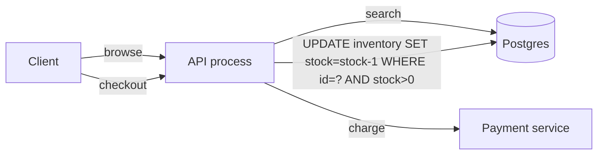
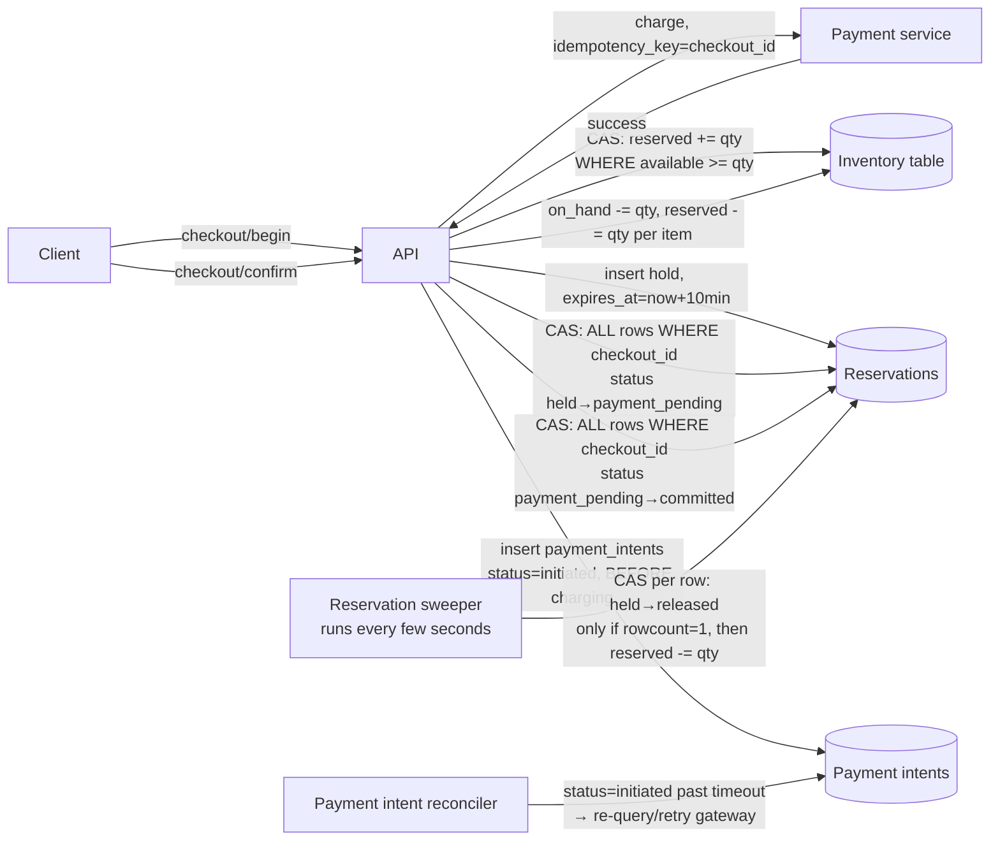
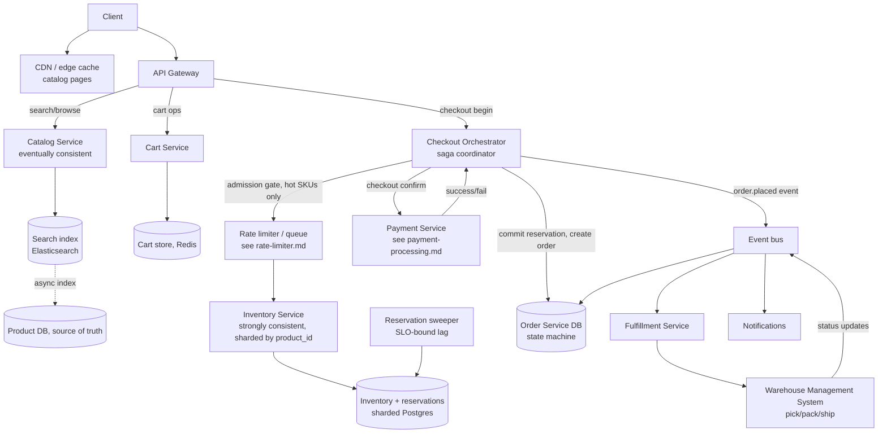

# Design: E-Commerce Platform (Amazon-style)

**Difficulty:** Senior/Staff | **Time:** 60–90 minutes

!!! note "Instructions"
    Cover each section and work it yourself first. Before every "Version N" reveal there is a `???` box — commit to an answer before you open it. Payment gateway integration, idempotency keys, and exactly-once charging are **not** re-derived here — see [Payment Processing](payment-processing.md) for that and cross-reference it during checkout.

---

## 1. Problem Statement

Design an e-commerce platform: users browse a product catalog, search, add items to a cart, check out, pay, and track their order to delivery. Think Amazon at small scale.

Most of this system is a read-heavy browse/search problem — similar in shape to other catalog- and feed-style exercises already on this site: index the catalog, cache aggressively, serve from replicas, done. **That is not the hard part, and treating it as the centerpiece is a mid-level answer.**

The hard part is one narrow, sharp problem: **inventory correctness under concurrent purchase contention.** A product has 1 unit left. Fifty people click "Buy Now" in the same second (a flash sale, a restock announcement, a doorbuster). Exactly one purchase must succeed. The other 49 must fail *before* a card is charged, not after. And the inverse failure mode is just as real: 200 people add that last unit to a cart and never check out — if you naively reserve stock on "add to cart," the item is now permanently unsellable even though nobody bought it.

This is the same *shape* of problem as the [rate limiter](rate-limiter.md) — a shared mutable integer under concurrent writes — but the correctness bar is inverted. A rate limiter can admit 3% too many requests under a race and nobody notices. Inventory cannot oversell by even one unit without a real customer getting a cancellation email, a refund, and a reason to never order from you again. Approximate is not an option here.

Payment capture, idempotency keys, retry-safe charging, and PSP webhook handling are a solved problem on this site — see [Payment Processing](payment-processing.md). This exercise assumes that system exists behind a `POST /payments` call and focuses on the part payment-processing.md doesn't cover: what has to be true about *inventory* before you're allowed to call it.

---

## 2. Clarifying Questions

??? question "What questions should you ask?"
    - **Catalog size and structure:** How many SKUs? Flat products, or variants (size/color) sharing a parent?
    - **Inventory model:** Single warehouse, or multiple fulfillment centers with region-specific stock?
    - **Overselling tolerance:** Zero-tolerance (strict reservation) for all products, or is backorder/refund-if-unfulfillable acceptable for some categories (e.g. print-on-demand)?
    - **Cart semantics:** Does adding to cart reserve stock, or is stock only checked at checkout?
    - **Cart lifetime:** How long does an abandoned cart hold a reservation, if any?
    - **Flash sales:** Does the platform run doorbuster/flash-sale events with known 100x spikes, or is traffic roughly steady?
    - **Order fulfillment:** In-house warehouse system, or third-party logistics (3PL) integration?
    - **Returns/cancellations:** Do they need to restock inventory synchronously?
    - **Scale:** Orders/day, peak orders/second, catalog size, read:write ratio on catalog vs. inventory?

---

## 3. Functional Requirements

- Browse and search the product catalog (filter by category, price, attributes)
- View product detail (price, stock status, images, description)
- Add/remove items in a cart; cart persists across sessions
- Checkout: reserve inventory, charge payment, create an order
- Track order status through fulfillment to delivery
- Cancel/return an order (restock inventory)

## 4. Non-Functional Requirements

| Property | Requirement | Reasoning |
|----------|-------------|-----------|
| Inventory correctness | Zero overselling, ever | A sold unit that doesn't exist is a refund, an apology, and churn |
| Catalog read latency | < 150ms p99 | Browse/search is the majority of traffic; must feel instant |
| Checkout latency | < 2s p99 (excluding payment gateway RTT) | Cart abandonment climbs sharply past a few seconds |
| Catalog consistency | Eventually consistent (seconds) is fine | A stale price/description for a few seconds is not a correctness bug |
| Inventory consistency | Strongly consistent | Money and physical goods; no "eventually" |
| Availability (catalog) | 99.99% | Browsing must survive backend hiccups |
| Availability (checkout) | 99.95%, fail toward "can't check out" not "oversold" | Correctness over uptime when they conflict |
| Scale | 10M SKUs, 500K orders/day, 50K orders/sec at flash-sale peak | Catalog is read-bound; checkout is write-bound and bursty |

!!! tip "Interview Insight 🎯"
    Interviewers are listening for whether you separate these two problems out loud: "catalog is a search/read-scaling problem I've solved elsewhere; inventory is a concurrency-correctness problem that needs its own service with different consistency guarantees." Collapsing them into one data store is the tell that you haven't hit this problem before.

---

## 5. Capacity Estimation

```
Catalog:
  10M SKUs, avg product doc 2 KB → ~20 GB searchable index
  Browse/search: 2M requests/day average, 5,000 rps peak (non-sale) → cache/CDN territory

Orders (steady state):
  500K orders/day → ~6 orders/second average, ~60/s at 10x peak

Flash sale / Black Friday:
  Traffic spikes 50-100x on a narrow set of SKUs (doorbusters)
  Site-wide: 50K orders/second peak for a ~10 minute window
  Single hot SKU: 5,000+ concurrent "buy" attempts against a stock count of, say, 200 units
  → 4,800 of those 5,000 requests MUST fail cleanly, fast, without touching payment

Inventory writes:
  Steady state: ~6 stock decrements/second, trivial for a single row
  Flash sale on one SKU: thousands of CAS attempts/second on ONE row — this is the number
  that breaks V1, not the site-wide aggregate

Cart:
  Assume 3x cart-creates per completed order (abandonment) → 1.5M cart events/day
  Cart data is small (product_id + qty), high write volume, short-to-medium lived
```

!!! abstract "Mental Model"
    The catalog is a **breadth** problem — millions of documents, read constantly, tolerant of staleness. Inventory is a **depth** problem — a handful of rows (the popular SKUs) hit by thousands of writers in the same second, zero tolerance for staleness. You will design two different systems and be tempted to merge them into one database. Don't.

---

## 6. API Design

```
# Catalog (read-heavy, cacheable)
GET  /v1/products/search?q=...&category=...&page=...
GET  /v1/products/{product_id}
  → { id, title, price, stock_status: "in_stock"|"low_stock"|"out_of_stock", ... }
  # stock_status is a hint, not a guarantee — always re-checked at reservation time

# Cart
POST   /v1/cart/items          { product_id, quantity }
DELETE /v1/cart/items/{id}
GET    /v1/cart

# Checkout — the section that matters
POST /v1/checkout/begin
  { cart_id }
  → { checkout_id, reserved_items: [...], expires_at }   # 201, or 409 if any item can't be reserved
POST /v1/checkout/{checkout_id}/confirm
  { payment_method }
  → { order_id, status: "confirmed" }                    # 200, or 402 payment_failed, 410 reservation_expired

# Orders
GET /v1/orders/{order_id}
  → { order_id, status: "placed"|"paid"|"picking"|"packed"|"shipped"|"delivered"|"cancelled", tracking }
```

!!! note "Two-phase checkout is not bureaucracy"
    `begin` reserves stock without charging; `confirm` charges and commits. Collapsing this into one call means you either reserve-then-hope-payment-works (fine) or charge-then-hope-stock-is-still-there (never do this — see §13, "payment succeeds but inventory commit fails").

---

## 7. Data Model

Three stores with different consistency needs — do not put them in the same table, or worse, the same row.

```sql
-- Catalog: search-optimized, denormalized, eventually consistent from a source-of-truth
-- In practice this is an Elasticsearch/OpenSearch document, not a normalized SQL table.
CREATE TABLE products (            -- source of truth; indexed async into search
    id            UUID PRIMARY KEY,
    title         TEXT NOT NULL,
    description   TEXT,
    price_cents   INT NOT NULL,
    category_id   UUID,
    attributes    JSONB,           -- size, color, etc.
    updated_at    TIMESTAMPTZ
);

-- Inventory: the correctness-critical table. A raw counter is not enough —
-- reservations need to be visible and expirable, separate from committed sales.
CREATE TABLE inventory (
    product_id       UUID PRIMARY KEY,
    on_hand          INT NOT NULL,           -- physically in the warehouse
    reserved         INT NOT NULL DEFAULT 0, -- held by in-flight checkouts
    available        INT GENERATED ALWAYS AS (on_hand - reserved) STORED,
    version          INT NOT NULL DEFAULT 0, -- optimistic lock / CAS
    updated_at       TIMESTAMPTZ
);

CREATE TABLE inventory_reservations (
    id            UUID PRIMARY KEY,
    product_id    UUID NOT NULL REFERENCES inventory(product_id),
    checkout_id   UUID NOT NULL,
    quantity      INT NOT NULL,
    expires_at    TIMESTAMPTZ NOT NULL,      -- TTL: auto-release if checkout never confirms
    status        VARCHAR(16) NOT NULL,      -- held | payment_pending | committed | released
                                              -- sweeper only ever touches 'held' — 'payment_pending' is
                                              -- deliberately excluded so a slow payment call can never race the TTL
    INDEX idx_expiry (status, expires_at),   -- sweeper scans this, not the whole table
    INDEX idx_checkout (checkout_id, status) -- confirm_checkout claims/commits every row for a checkout together
);

-- Written before the payment gateway is ever called; see §13's crash-recovery discussion.
CREATE TABLE payment_intents (
    idempotency_key  VARCHAR(64) PRIMARY KEY,  -- "checkout:{checkout_id}"
    checkout_id      UUID NOT NULL,
    status           VARCHAR(16) NOT NULL,     -- initiated | succeeded | failed
    payment_id       VARCHAR(64),              -- set once the gateway responds
    created_at       TIMESTAMPTZ NOT NULL,
    INDEX idx_stuck (status, created_at)       -- reconciler scans "initiated past a timeout"
);

-- Orders: state machine, append-only status history for auditability
CREATE TABLE orders (
    id            UUID PRIMARY KEY,
    user_id       UUID NOT NULL,
    status        VARCHAR(16) NOT NULL,  -- placed -> paid -> picking -> packed -> shipped -> delivered
                                          --        -> cancelled (from placed/paid only)
    total_cents   INT NOT NULL,
    payment_id    VARCHAR(64),           -- FK into payment-processing.md's system
    created_at    TIMESTAMPTZ,
    INDEX idx_user_created (user_id, created_at)
);

CREATE TABLE order_status_history (
    order_id      UUID NOT NULL,
    status        VARCHAR(16) NOT NULL,
    ts            TIMESTAMPTZ NOT NULL
);
```

??? question "Why `reserved` as a separate column instead of just decrementing `on_hand` at add-to-cart?"
    Because "reserved but never purchased" is the failure mode that permanently locks stock away. If add-to-cart decremented `on_hand` directly, an abandoned cart with the last unit makes that SKU unsellable forever — nothing ever puts the stock back unless you bolt on exactly the reservation-with-TTL mechanism below anyway. Model it explicitly from the start: `available = on_hand - reserved`, and reservations expire.

---

## 8. Version 1 — simplest thing that works

Single Postgres instance, synchronous checkout, no separate reservation step. Good enough until you have real concurrent contention on a single SKU.



```python
def checkout(product_id: str, qty: int, payment_method) -> Order:
    with db.transaction():
        # Atomic compare-and-set in one statement — the row lock IS the concurrency control
        updated = db.execute(
            "UPDATE inventory SET stock = stock - %s WHERE product_id = %s AND stock >= %s",
            qty, product_id, qty
        )
        if updated.rowcount == 0:
            raise OutOfStock()

        # Still inside the DB transaction: charge synchronously
        payment = payment_service.charge(payment_method, amount)  # see payment-processing.md
        if not payment.success:
            raise DBRollback()  # the UPDATE above rolls back, stock is restored

        order = db.insert_order(product_id, qty, payment.id, status="paid")
    return order
```

This correctly prevents overselling — the `WHERE stock >= qty` guard makes the decrement atomic and self-checking. Ship it for a catalog with no flash-sale traffic. Then find the actual bottleneck.

---

## 9. Identify the bottleneck

???+ question "A flash sale drops the price on one SKU with 200 units in stock. 5,000 people hit Buy in the same 10 seconds. What breaks, and what doesn't?"
    - **What doesn't break:** correctness. The `WHERE stock >= qty` guard is atomic — you will not oversell, ever, no matter how many requests pile up. This is the one thing V1 gets right by construction.
    - **What breaks:** the *row itself* becomes a serialization point. Every one of those 5,000 requests wants a row lock on the same tuple. Postgres processes them one at a time; the other 4,999 queue behind whichever transaction holds the lock, including its **synchronous call to the payment gateway inside the transaction**. If the payment gateway takes 800ms, you are now serializing 5,000 requests through an 800ms critical section — the tail request waits over an hour.
    - **The second failure mode, independent of the first:** if checkout instead reserved stock at "add to cart" (a design some teams reach for to "fix" the race), an abandoned cart holding the last unit locks it away with no purchase and no expiry — the SKU shows "out of stock" while sitting in a warehouse.
    - The fix is not "add more Postgres replicas" — replicas don't help a single hot row's write lock. The fix is: **get the payment call out of the inventory transaction**, and **make reservations expire**.

---

## 10. Version 2 — reservation with TTL, contention isolated from payment

Split checkout into `begin` (reserve, fast, no external call) and `confirm` (charge, then commit the reservation). A sweeper releases expired holds.



```python
def begin_checkout(cart_id: str) -> Checkout:
    # checkout_id is shared across every line item's reservation row — id remains each row's own
    # primary key (inventory_reservations.id), so a cart with 3 items produces 3 rows, all claimed
    # and committed together in confirm_checkout via WHERE checkout_id = %s, never WHERE id = %s.
    checkout_id = new_id()
    holds = []
    with db.transaction():
        for item in cart_items(cart_id):
            updated = db.execute(
                """UPDATE inventory SET reserved = reserved + %s
                   WHERE product_id = %s AND (on_hand - reserved) >= %s""",
                item.qty, item.product_id, item.qty
            )
            if updated.rowcount == 0:
                raise OutOfStock(item.product_id)   # rolls back holds taken so far in this txn
            db.insert_reservation(new_id(), checkout_id, item.product_id, item.qty,
                                   expires_at=now() + timedelta(minutes=10), status="held")
            holds.append(item)
    return Checkout(checkout_id, holds, expires_at=...)

def confirm_checkout(checkout_id: str, payment_method) -> Order:
    # Step 1: atomically claim EVERY reservation row for this checkout out of the sweeper's reach
    # before charging anything. Checking `expired` and then charging leaves a window where the
    # sweeper's TTL scan (WHERE status='held') can release a hold WHILE the payment call is in
    # flight; moving straight to 'payment_pending' — a status the sweeper's query never matches —
    # closes that window instead of just narrowing it. The rowcount check makes this all-or-nothing
    # across a multi-item cart: if any line's reservation already expired or was already claimed by
    # a concurrent confirm, none of them move to payment_pending.
    with db.transaction():
        items = db.query("SELECT * FROM inventory_reservations WHERE checkout_id = %s", checkout_id)
        claimed = db.execute(
            """UPDATE inventory_reservations SET status = 'payment_pending'
               WHERE checkout_id = %s AND status = 'held' AND expires_at > now()""",
            checkout_id
        )
        if claimed.rowcount != len(items):
            raise ReservationExpired()  # rolls back the whole claim — fail BEFORE charging, never charge for a partial cart
        reservations = db.query("SELECT * FROM inventory_reservations WHERE checkout_id = %s", checkout_id)
        total = sum(r.quantity * price_of(r.product_id) for r in reservations)

        # Durable idempotency record, written in the SAME transaction as the claim above and BEFORE
        # the gateway is ever called — this is what makes the reconciler in §13 possible. Without this
        # row, a crash between "gateway charged" and "any local write" is unrecoverable by definition;
        # with it, the reconciler always has something to scan even if this process never wakes up again.
        db.execute(
            """INSERT INTO payment_intents (idempotency_key, checkout_id, status, created_at)
               VALUES (%s, %s, 'initiated', now())""",
            f"checkout:{checkout_id}", checkout_id
        )

    # Charge OUTSIDE any inventory lock. Idempotency key is derived from checkout_id, not minted
    # fresh — a client retry (or a retry after a timeout where the first charge actually succeeded)
    # hits the payment gateway's dedup path instead of double-charging. See payment-processing.md.
    payment = payment_service.charge(payment_method, total, idempotency_key=f"checkout:{checkout_id}")
    db.execute(
        "UPDATE payment_intents SET status = %s, payment_id = %s WHERE idempotency_key = %s",
        "succeeded" if payment.success else "failed", payment.id, f"checkout:{checkout_id}"
    )

    if not payment.success:
        # Revert every claimed row to 'held' so the customer can retry confirm before the original
        # TTL — do NOT leave them stuck in 'payment_pending' (unsweepable forever) or silently drop
        # back to 'held' with a stale expires_at that's already passed; extend slightly if it has.
        db.execute(
            """UPDATE inventory_reservations SET status = 'held', expires_at = GREATEST(expires_at, now() + interval '2 minutes')
               WHERE checkout_id = %s AND status = 'payment_pending'""",
            checkout_id
        )
        raise PaymentFailed()

    with db.transaction():
        committed = db.execute(
            """UPDATE inventory_reservations SET status = 'committed'
               WHERE checkout_id = %s AND status = 'payment_pending'""",
            checkout_id
        )
        if committed.rowcount != len(reservations):
            # Should be unreachable — 'payment_pending' is never swept and only this function transitions
            # it — but treat it as a hard invariant violation, not a silent double-decrement: refuse to
            # touch inventory and hand off to the compensation path (refund; see §13).
            raise ReservationCommitConflict(payment_id=payment.id)
        for r in reservations:
            db.execute("""UPDATE inventory SET on_hand = on_hand - %s, reserved = reserved - %s
                           WHERE product_id = %s""", r.quantity, r.quantity, r.product_id)
        order = db.insert_order(checkout_id, reservations, payment.id, status="paid")
    return order

def sweep_expired_reservations():
    # status='held' only — 'payment_pending' is excluded by construction, so a reservation currently
    # mid-charge is never at risk of being released out from under an in-flight payment. But between
    # the SELECT below and the release, confirm_checkout could still win the held -> payment_pending
    # race on a row this sweeper already read — so the release itself must be a conditional CAS, not
    # an unconditional write, and inventory is only touched if that CAS actually took effect.
    candidates = db.query(
        "SELECT id, product_id, quantity FROM inventory_reservations "
        "WHERE status='held' AND expires_at < now() LIMIT 1000"
    )
    for r in candidates:
        with db.transaction():
            released = db.execute(
                "UPDATE inventory_reservations SET status='released' WHERE id=%s AND status='held'",
                r.id
            )
            if released.rowcount == 1:   # we actually won the race for this row
                db.execute("UPDATE inventory SET reserved = reserved - %s WHERE product_id = %s",
                           r.quantity, r.product_id)
            # rowcount == 0 means confirm_checkout claimed it first (held -> payment_pending) between
            # the SELECT and here — do nothing; that reservation is no longer this sweeper's problem
```

The conditional `WHERE id=%s AND status='held'` is what makes this safe against `confirm_checkout` — it's what actually closes the race, not the initial `SELECT`. Running multiple sweeper replicas in parallel is also safe because of it (two replicas racing the same row just means one gets `rowcount=1` and the other gets `rowcount=0`), but it's still wasted work for two replicas to select and attempt the same 1,000 candidate rows every cycle — select with `FOR UPDATE SKIP LOCKED` so concurrent sweeper instances each pull a disjoint batch instead of colliding on every row.

This is the same "shared mutable integer under contention" shape as the [rate limiter](rate-limiter.md)'s token bucket — many writers, one hot counter, atomic compare-and-set. The difference is the failure direction: a rate limiter that occasionally over-admits is a minor UX blip; inventory that oversells by one unit is a broken promise to a customer. You cannot approximate your way out of this one with a locally-cached slice the way the rate limiter's V3 does.

For the single hottest SKU in a flash sale, front the reservation write with a **queue or admission gate** (conceptually the rate limiter again): let requests past a coarse per-second cap reach the inventory row at all, and 429/queue the rest instead of letting 5,000 requests pile up on one row lock simultaneously.

---

## 11. Identify the next bottleneck

???+ question "Reservations now expire cleanly. What breaks next, separately, at flash-sale scale?"
    - **Catalog search falls over under read load**, independently of the inventory write contention above — Black Friday traffic hits the search/browse path (product listing, category pages) at 50-100x normal volume, and if catalog and inventory share infrastructure, a completely separate read-scaling problem now competes for the same DB connections as the write-critical inventory path.
    - **The sweeper falls behind.** If reservations are created faster than the sweeper releases expired ones (a plausible flash-sale pattern — thousands of `begin` calls, many customers never `confirm`), `reserved` climbs and `available` drops toward zero on a SKU that still has physical stock sitting in the warehouse. The product shows "out of stock" while units sit unsold — the exact failure this design was built to prevent, just moved from "overselling" to "underselling," and much harder to notice because it looks like success (no errors, no oversell) rather than a visible outage.
    - The lesson: solving the write-contention problem doesn't solve the read-scaling problem, and a sweeper that's "eventually correct" needs an SLO and an alert like anything else on the write path — "eventually" with no bound is a silent inventory leak.

---

## 12. Version 3 — production architecture



Key production decisions:

- **Catalog and inventory are different services with different consistency models**, deliberately. Catalog reads from a search index that lags the source of truth by seconds — fine, because a stale description or a "low stock" badge that's slightly wrong causes no harm. Inventory reads from the strongly-consistent, sharded-by-product service every single time at checkout, never from a cache, because that's the one number that must never lie.
- **Checkout is a saga**, not a distributed transaction, because it spans three independently-owned systems (inventory hold → payment charge → order creation → fulfillment kickoff) that cannot share a database transaction. See [Sagas](../architecture-patterns/sagas.md) for the orchestration/choreography trade-off and compensation pattern; here the compensation for "payment failed after reservation" is simply letting the TTL expire (or releasing it immediately), and the compensation for "fulfillment can't actually pick the item" (rare, but warehouses drift) is a refund + cancellation, not a rollback of the payment system.
- **The admission gate sits in front of inventory, not payment.** Rate-limit or queue at the reservation step for hot SKUs specifically — a virtual waiting room for a doorbuster — so the inventory row never sees more simultaneous writers than it can serialize through cleanly, and customers who are turned away never reach the payment gateway at all (protects payment-processing.md's system from load it shouldn't have to absorb either).
- **Inventory is sharded by `product_id`.** There is no cross-shard transaction needed for a single-item checkout; multi-item carts reserve each item's shard independently within the saga, and a partial reservation failure releases whatever succeeded (compensation, not rollback).
- **Fulfillment is async and event-driven.** `order.placed` triggers picking; the warehouse system publishes its own state transitions back onto the bus, and the order's `status` is a read model built from that stream, not something the checkout path blocks on.

---

## 13. Failure analysis

=== "Payment succeeds, inventory commit fails after"
    The `confirm_checkout` process crashes between the payment gateway returning success and the `status='payment_pending' → 'committed'` transaction committing — a pod dies mid-flight. Money has moved; the reservation is stuck in `payment_pending` (safe — the sweeper never touches it, so it can't be double-released), but nothing has told the customer they have a paid order, and nothing will retry the commit on its own.
    **Note what an outbox does and doesn't buy you here:** the payment gateway and the local database do not share a transaction, so there is no way to atomically "charge and write an outbox row" — if the process dies between the gateway responding and any local write, there is no outbox row to recover from, because none was ever written. The actual recovery mechanism, exactly as in [payment-processing.md](payment-processing.md), is that the **idempotency key is persisted locally *before* the gateway is ever called** (a `payment_intents` row: `idempotency_key`, `checkout_id`, `status='initiated'`), and the gateway call itself is safe to retry against that key. A background reconciler scans `payment_intents` rows stuck in `initiated` past a timeout and calls the gateway again with the *same* idempotency key — the gateway either returns "already succeeded, here's the existing charge" (safe — no double charge) or actually processes it for the first time. Once the reconciler has a confirmed `payment_id`, it drives the same `payment_pending → committed` transition `confirm_checkout` would have — replay the commit, never re-charge. The outbox pattern still matters *after* this point, for reliably publishing `order.placed` once the local commit succeeds, but it does not — and cannot — cover the gap between the external charge and the first local write.

=== "Reservation sweeper lag causes false 'sold out'"
    Sweeper falls behind during a traffic spike (see §11). `reserved` stays inflated, `available` reads artificially low or zero on SKUs with real stock in the warehouse.
    **Mitigation:** sweeper lag is a first-class SLO with its own alert (not just "is the process running"); sweep in small batches keyed off the `idx_expiry (status, expires_at)` index so it never table-scans and competes with live traffic; during a known flash-sale window, shorten reservation TTL (e.g. 2 minutes instead of 10) so lag self-corrects faster, and pre-scale sweeper concurrency ahead of the event.

=== "Flash-sale traffic spike overwhelms inventory service specifically"
    Site-wide traffic is fine (catalog absorbs it via CDN/cache); one SKU's shard is pinned at 100% because thousands of `begin_checkout` calls hit the same row (see §9/§10).
    **Mitigation:** the admission gate in front of hot SKUs (§12) caps concurrent writers reaching that row; identify "hot" ahead of time for planned sales (doorbusters are known in advance — pre-warm the gate) and detect it live for unplanned virality (sudden per-SKU QPS spike triggers an automatic gate).

=== "Warehouse fulfillment system out of sync with order state"
    The WMS marks an item unpickable (damaged, miscounted, lost) after the order shows `paid`, or a warehouse-side inventory count disagrees with the platform's `on_hand`.
    **Mitigation:** fulfillment failure is a saga compensation, not a special case — `order.status = cancelled_after_payment`, trigger an automatic refund through payment-processing.md's refund path, notify the customer, and reconcile `on_hand` against the WMS's physical count on a schedule (periodic audit job) since the two will drift over time regardless of how careful the write path is.

---

## 14. Consistency considerations

- **Inventory must be strongly consistent; catalog does not need to be.** The reason isn't dogma — it's what each number is used for. Catalog data (title, description, price display, "in stock" badge) informs a *decision* the customer is about to make; being seconds stale costs nothing because the real check happens at reservation time regardless. Inventory's `available` count is the thing that *is* the decision — if it's stale, you either oversell (customer harm) or falsely show sold-out (revenue loss). Different blast radius, different consistency budget.
- **The reservation-hold pattern is how you avoid a distributed transaction across "check stock" and "charge card."** You cannot open one ACID transaction spanning your database and a third-party payment gateway. Reservation with TTL is the bridge: reserve (fast, local, strongly consistent) → charge (slow, external, no lock held) → commit (fast, local). If the middle step fails or never happens, the TTL is the safety net that returns stock to the pool — this is a saga's compensating action, applied at the smallest possible scope.
- **Read-your-writes matters for the customer's own order status**, not for other customers' view of stock. After checkout, the buyer must immediately see "order placed" — route that read to the primary or return the order object directly from the confirm response rather than making the client re-fetch through a replica that might lag.
- **Multi-item cart checkout is not one atomic operation across items.** Reserving item A and item B in the same cart are two separate shard-local transactions; a partial success (A reserved, B out of stock) needs an explicit compensation (release A's hold) rather than an assumption that "the transaction" covers both.

---

## 15. Observability

```
Catalog:
  search_latency_p50/p99
  cache_hit_rate{layer=cdn|search_cache}
  index_lag_seconds (product DB -> search index)

Inventory (the metrics that actually page someone):
  reservation_conflict_rate{product_id}        -- CAS failures per SKU, spikes = contention
  reservation_hold_duration histogram
  reservation_sweeper_lag_seconds              -- alert > 60s during any sale event
  inventory_available_vs_on_hand_delta{product_id}  -- catches the "false sold out" pattern
  hot_sku_admission_gate_reject_rate

Checkout / orders:
  checkout_begin_to_confirm_latency_p99
  checkout_abandon_rate (begin without confirm within TTL)
  saga_compensation_count{reason}
  order_state_transition_lag{from,to}          -- e.g. paid -> picking taking too long

Alerts:
  reservation_sweeper_lag > 60s
  reservation_conflict_rate > threshold on any single SKU (flash-sale detector)
  available_inventory dropping to 0 while on_hand > 0 for > 5 min (sweeper-lag proxy)
  saga_compensation_count spike (fulfillment or payment desync)
```

---

## 16. Cost analysis

```
Search index (Elasticsearch, 10M docs, ~20GB + replicas):     ~$600/month
Product DB (Postgres, source of truth, small rows):           ~$200/month
Inventory service (sharded Postgres, low volume, high value): ~$400/month (over-provisioned for burst, not steady state)
Cart store (Redis):                                            ~$150/month
CDN (catalog pages, high cache-hit):                            ~$300/month
Order DB + event bus (Kafka/SNS-SQS):                           ~$500/month
Flash-sale burst capacity (autoscaled inventory/checkout pods, reserved but idle 355 days/year): ~$300/month amortized
Total:                                                          ~$2,450/month

Cost lever: the inventory service is deliberately over-provisioned relative to its
steady-state load (§5: ~6 writes/sec normally) because its cost driver is peak
contention-handling capacity, not average throughput — sizing it for the average
is exactly the mistake that oversells during a sale.
```

---

## 17. Alternative architectures

=== "Overselling with backorder"
    Skip the strict reservation entirely: accept the order past zero stock, notify the customer if it can't be fulfilled, offer a refund or a delayed-ship date. Valid for categories where a few days' delay is acceptable (print-on-demand, made-to-order, drop-shipped goods) and where the operational cost of occasional backorder emails is cheaper than building/operating the reservation system. Invalid for anything with a hard delivery promise or where "sorry, we don't actually have it" is unacceptable brand risk (electronics, limited-edition drops).

=== "Queue-based virtual waiting room"
    For known flash-sale events, put a queue in front of the entire checkout path (not just the inventory row) — admit customers at a fixed rate, each admitted customer gets a short-lived guaranteed reservation window. Trades "everyone hits refresh and 95% get an error" for "everyone waits in a visible queue and knows their odds." Complements, doesn't replace, the reservation-with-TTL mechanism underneath — the waiting room controls arrival rate; the reservation still needs to be correct once someone's let in.

=== "Optimistic UI, pessimistic backend"
    Show the item as available in the UI (don't round-trip to inventory on every product page view — that's what killed the read path), but always re-check with a real CAS at the reservation step. The customer sees "in stock" right up until the moment 50 other people beat them to it, then gets an honest "just sold out" at checkout. This is what most of the "stock_status is a hint" comment in §6's API design is describing — cheap optimism on read, expensive correctness on write.

---

## 18. Staff Engineer Extensions

=== "100x traffic (true flash sale / Black Friday)"
    This is the centerpiece scenario the whole design was built for. Site-wide 50x-100x traffic is mostly a catalog/CDN problem — solved by caching, and boring at this point. The actual risk is concentrated: a handful of doorbuster SKUs each see thousands of concurrent reservation attempts against a stock count in the hundreds. The admission gate (§12) becomes load-bearing, not optional — without it, the inventory row for that SKU is a hard bottleneck no amount of horizontal scaling elsewhere fixes, because horizontal scaling doesn't help a single row's lock contention. Pre-identify doorbuster SKUs before the event and pre-warm dedicated gate capacity + shortened reservation TTLs for exactly those product_ids; don't try to detect and react to a spike you already knew was coming. For genuinely unplanned virality, fall back to auto-detecting per-SKU conflict-rate spikes (already an observability metric) and applying the gate reactively, accepting a worse experience for the first several seconds.

=== "Multi-region"
    Shard inventory by **fulfillment warehouse region**, not by user region — the constraint that matters is where the physical goods are, not where the customer clicks from. A US customer ordering from a US warehouse and an EU customer ordering from an EU warehouse never contend on the same inventory row even if both are served by a globally load-balanced API layer. The hard case is a SKU stocked in only one region ordered from another — either route the reservation to the SKU's home region (added latency, but correctness stays local and simple) or replicate a conservative "reserved capacity" number per region and reconcile asynchronously (faster, but reintroduces exactly the overselling risk this whole design exists to prevent — justify it carefully if you propose it).

=== "Data residency"
    EU customer PII (orders, addresses, payment tokens) must stay in EU storage; product catalog data has no such constraint and can replicate globally for read performance. Route order and payment records to an EU-resident order service instance for EU customers; the catalog/search index stays a single global system since it holds no personal data. This mirrors the payment-processing.md residency discussion — don't re-derive it, just note that checkout's saga now has a "which region owns this order's system of record" decision baked into orchestration.

=== "Zero-downtime migration of the reservation mechanism"
    Say you're moving from TTL-based holds to a lease-renewal model (client must heartbeat to keep a reservation alive, useful for long checkout flows like financing applications). Dual-write both reservation records during migration; new checkouts use the new mechanism behind a flag, old in-flight reservations finish under the old mechanism's rules (don't migrate a hold mid-flight — let it expire or commit under the system it was created in); flip the flag to 100% only after confirming the sweeper/lease-expiry paths for the new system have run clean through a full flash-sale-scale load test, since this is precisely the code path you cannot afford to discover a bug in during a real sale.

---

## 19. Interview follow-ups

1. **"Why not just use a single `SELECT FOR UPDATE` and hold the row lock through the payment call?"** — Because the payment gateway's latency (hundreds of ms to seconds) becomes your row's lock duration. At flash-sale concurrency that serializes thousands of requests through an external network call, which is the exact bottleneck §9 identifies. Splitting reserve/charge/commit gets the external call *outside* any database lock.
2. **"How is the cart different from a reservation?"** — By default, nothing in the cart reserves stock; it's a wishlist. Reservation happens at `checkout/begin`, deliberately late and short-lived, specifically to avoid the "abandoned cart locks the last unit forever" failure mode. If product asks for "reserve at add-to-cart" (some retailers do, for high-demand items), that's a valid requirement — but it means the TTL and sweeper need to be tuned much more aggressively, since cart dwell time is far longer than checkout dwell time.
3. **"What happens to inventory correctness if the reservation service and the order service are eventually consistent with each other?"** — This is the saga's job, not a shared-database job. The reservation commit and the order-row insert happen in one local transaction (same service, same DB) specifically so they can't drift from each other; the order service publishing `order.placed` to fulfillment is where eventual consistency is acceptable, because fulfillment lagging by a few seconds costs nothing, while inventory and its own order record disagreeing costs money.
4. **"How would you test the overselling guarantee before a real sale?"** — Load test the exact contention shape: N concurrent workers hitting `checkout/begin` against one SKU with stock = K, assert exactly K succeed and N-K get a clean 409, not a 500 or a silent double-reserve. Run it against a stock count of 1 as the sharpest case. This is a correctness test, not a performance test — it should be in CI, not just a pre-launch fire drill.

---

## Self-Assessment

- [ ] I can explain why catalog is eventually consistent and inventory is strongly consistent, with a reason tied to what each number is used for
- [ ] I can describe the reservation-with-TTL pattern and why it replaces a distributed transaction across "check stock" and "charge card"
- [ ] I can name both inventory failure modes — overselling AND permanently-locked reserved stock — and the mechanism that prevents each
- [ ] I can explain why the row-lock bottleneck at flash-sale scale is about contention on one row, not aggregate site traffic
- [ ] I can distinguish this exercise's checkout saga from payment-processing.md's idempotency mechanism and say where each one's responsibility starts and ends
