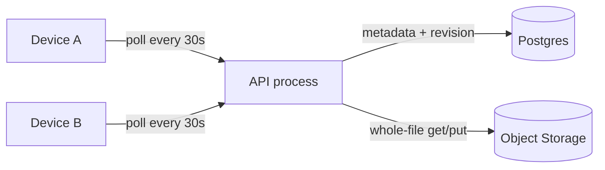
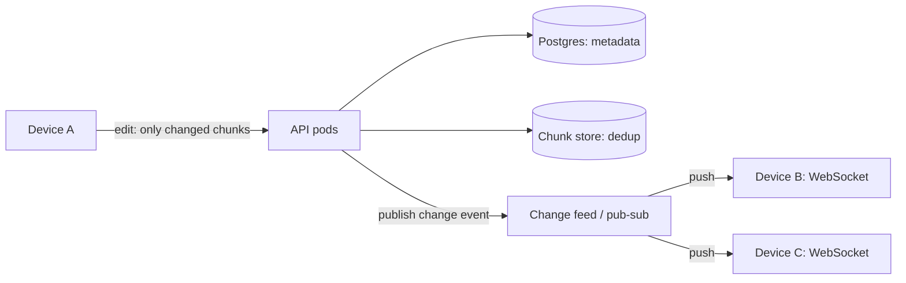
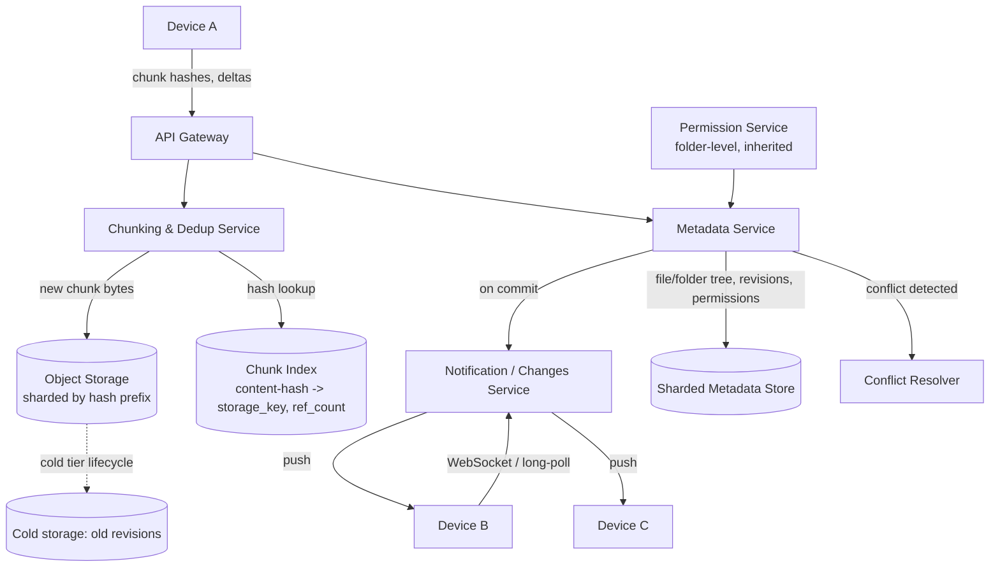

# Design: Google Drive / Dropbox (File Storage & Sync)

**Difficulty:** Senior | **Time:** 60–75 minutes

!!! note "Instructions"
    Cover each section and work it yourself first. Before every "Version N" reveal there is a `???` box — commit to an answer before you open it. This exercise shares its metadata/blob split with [Pastebin](pastebin.md); don't re-derive that part. Spend your time on what's actually new: **sync across devices that go offline**.

---

## 1. Problem Statement

Design a service like Google Drive or Dropbox: a user has files organized in folders, edits them from multiple devices (laptop, phone, a synced desktop folder), and expects every device to converge on the same state — automatically, without re-uploading gigabytes for a one-line edit.

**What's identical to [Pastebin](pastebin.md):** the metadata/blob split (small, hot, indexed rows in a fast store; large bytes in object storage) and the reasoning for why you don't stuff megabyte files into database rows. If you're re-deriving that split from scratch here, you're wasting interview time — cite it and move on.

**What's actually new — and the reason this is a harder exercise than Pastebin:**

1. **Efficient sync, not just storage.** A paste is written once and read many times. A file is *edited* — a user changes one paragraph in a 2 GB video project file, or one line in a config file. Re-uploading the whole object on every edit is the naive answer, and it is the thing that must break first in this interview. The real problem is **detecting and transferring only the changed bytes** (chunking + delta sync).
2. **Multi-device convergence under intermittent connectivity.** Devices go offline (laptop closed, phone in airplane mode) and reconnect later. Each device must catch up efficiently — not re-scan the whole account — and the system must decide what "catching up" means when the account changed while the device was gone.
3. **Conflict resolution.** Two devices can edit the *same file* while both are offline from each other. There is no way to prevent this; the design question is what happens when both reconnect and both have a legitimate, divergent version of the same file. Silent data loss ("last write wins" ate someone's afternoon of work) is the failure mode interviewers are listening for you to name.

Do not open with chunking. Start from the same "does the naive thing actually break, and at what scale" discipline as the other exercises — Version 1 will be whole-file upload/download with polling, and you'll be asked to find where it hurts before adding machinery.

---

## 2. Clarifying Questions

??? question "What questions should you ask?"
    - **File sizes:** Typical office doc (KB–MB) vs. video/design files (GB)? Is there a max file size?
    - **Edit pattern:** Do users edit files in place (text docs, code) where deltas are small, or mostly replace-whole-file (photos, videos) where chunking buys less?
    - **Real-time expectations:** Does "sync" mean seconds (collaborative doc) or is "eventually, within a minute" acceptable?
    - **Conflict tolerance:** Is losing a few seconds of an edit acceptable, or must every offline edit be preserved even if it means two files?
    - **Sharing model:** Personal files only, or shared folders with many collaborators (100K-file shared folder is a real Google Drive scenario)?
    - **Offline duration:** Minutes (phone in a tunnel) vs. weeks (a laptop in a drawer) — changes how much history the sync protocol must reconcile.
    - **Versioning:** Does the product need file history / "restore previous version"?
    - **Scale:** Users, files/user, devices/user, writes/second across the fleet?

---

## 3. Functional Requirements

- Upload and download files; organize into a folder hierarchy
- Share a file or folder with another user or via a link, with read/write permission levels
- Sync changes to all of a user's devices automatically
- Avoid re-transferring bytes that haven't changed
- Detect and resolve conflicting edits made offline on different devices
- Optional: version history, "restore previous version"

## 4. Non-Functional Requirements

| Property | Requirement | Reasoning |
|----------|-------------|-----------|
| Sync latency | Change visible on other devices in < 5s when online | Feels "live"; polling every 30s does not |
| Upload efficiency | Only changed bytes transferred on edit | A 1-line edit to a 2 GB file must not cost 2 GB |
| Availability | Reads/writes degrade gracefully offline | Local edits must queue, not fail |
| Conflict safety | No silent data loss on concurrent offline edits | Losing a user's edit is worse than a slow sync |
| Scale | 500M users, 100 files/user avg, 3 devices/user | Metadata service is the likely first bottleneck |
| Durability | 11 nines on stored bytes (object storage SLA) | Users trust this as their only copy |

!!! tip "Interview Insight 🎯"
    Pastebin's hard problem was "the object might be big." This exercise's hard problem is "the object *changes*, and multiple parties might change it *without talking to each other first*." That's a fundamentally different axis — size vs. concurrency — and it's why chunking and conflict resolution, not caching, dominate this design.

---

## 5. Capacity Estimation

```
Users and files:
  500M users, 100 files/user avg → 50B files total
  Avg file size: 2 MB (skewed: mostly docs/photos, some large media)
  Total logical storage: 50B × 2 MB = 100 PB (before dedup)

Devices and sync events:
  3 devices/user, 500M users → 1.5B device endpoints
  Assume 5% of users actively editing at any moment → 25M active devices
  Each active device: ~1 change/min while editing → ~420K sync events/second at peak

Chunking:
  Fixed/content-defined chunk size: 4 MB (Dropbox-scale default; smaller chunks
  = better dedup, more per-chunk overhead; 4 MB balances both)
  Avg file (2 MB) is often 1 chunk; large files (500 MB video) → ~125 chunks

Upload bandwidth (naive, whole-file):
  420K events/s × 2 MB avg = 840 GB/s  →  impossible
Upload bandwidth (delta, 1 chunk changed per edit avg):
  420K events/s × 4 MB (one changed chunk) worst case, realistically far less
  since most events are metadata-only (rename, move) → single-digit GB/s actual bytes

Metadata:
  50B file rows × ~300 bytes/row ≈ 15 TB — needs horizontal sharding, not one DB
  Notification fanout: 1 change in a 50-person shared folder → 50 device pushes
```

!!! abstract "Mental Model"
    Pastebin's numbers said "the object is big, split it from metadata." This exercise's numbers say "the object *changes* far more often than it's created, and most of the time only a sliver of it changes." Every version after V1 exists to shrink the bytes-moved-per-edit number and the devices-notified-per-edit latency.

---

## 6. API Design

```
# Upload a new file or a new revision
POST /api/v1/files
Request:  { "parent_folder_id": "...", "name": "report.docx", "chunk_hashes": ["h1","h2","h3"] }
Response: { "file_id": "...", "missing_chunks": ["h2"], "upload_urls": {"h2": "https://..."} }
Status: 201 Created

PUT /api/v1/chunks/{hash}          -- direct upload to object storage (pre-signed URL)

POST /api/v1/files/{file_id}/commit
Request:  { "revision": 7, "chunk_hashes": ["h1","h2","h3"] }
Response: { "revision": 8 }        -- fails 409 if client's base revision is stale

# Download
GET /api/v1/files/{file_id}?revision=latest
Response: { "chunk_hashes": [...], "chunk_urls": {...} }   -- client fetches only chunks it lacks locally

# Delta sync — the core sync primitive
GET /api/v1/changes?since_cursor={cursor}
Response: {
  "changes": [ { "file_id": "...", "type": "modified", "revision": 8, "chunk_hashes": [...] }, ... ],
  "next_cursor": "..."
}

# Real-time push (replaces polling in V2+)
WS   /api/v1/changes/stream        -- server pushes change events as they happen

# Sharing
POST /api/v1/files/{file_id}/share
Request:  { "grantee": "user@x.com" | "link", "role": "viewer" | "editor" }
Response: { "share_id": "...", "url": "https://..." }
DELETE /api/v1/shares/{share_id}   -- revoke
```

!!! note "Cursor, not timestamp"
    `since_cursor` is an opaque, monotonic server-issued token (like a Kafka offset), not a client timestamp. Clock skew between a phone and the server must not be able to make a device silently miss changes — a wall-clock `since=<ts>` API invites exactly that bug.

---

## 7. Data Model

```sql
-- File metadata: one row per file, versioned by revision number
CREATE TABLE files (
    file_id       UUID PRIMARY KEY,
    parent_id     UUID NOT NULL,          -- folder hierarchy, self-referential
    owner_id      UUID NOT NULL,
    name          VARCHAR(255) NOT NULL,
    revision      INT NOT NULL DEFAULT 1, -- incremented on every content change
    size_bytes    BIGINT NOT NULL,
    chunk_list    JSONB NOT NULL,         -- ordered list of chunk hashes composing this revision
    is_folder     BOOLEAN DEFAULT FALSE,
    is_deleted    BOOLEAN DEFAULT FALSE,
    updated_at    TIMESTAMPTZ NOT NULL,
    INDEX idx_parent (parent_id),
    INDEX idx_owner_updated (owner_id, updated_at)
);

-- Content-addressed chunk store: dedup key IS the hash
CREATE TABLE chunks (
    chunk_hash    CHAR(64) PRIMARY KEY,   -- SHA-256 of chunk bytes
    size_bytes    INT NOT NULL,
    ref_count     INT NOT NULL DEFAULT 0, -- how many file revisions reference this chunk
    storage_key   VARCHAR(128) NOT NULL,  -- pointer into object storage
    created_at    TIMESTAMPTZ NOT NULL
);

-- Folder hierarchy is just files table rows with is_folder=true;
-- parent_id chains form the tree. No separate table needed.

-- Permissions / sharing
CREATE TABLE shares (
    share_id      UUID PRIMARY KEY,
    file_id       UUID NOT NULL,
    grantee_id    UUID,                   -- NULL if link-based share
    link_token    VARCHAR(64),            -- set if shared via link
    role          VARCHAR(16) NOT NULL,   -- viewer | editor | owner
    inherited     BOOLEAN DEFAULT FALSE,  -- true if inherited from a parent folder share
    created_at    TIMESTAMPTZ NOT NULL,
    revoked_at    TIMESTAMPTZ,
    INDEX idx_file (file_id),
    INDEX idx_grantee (grantee_id)
);

-- Per-device sync cursor
CREATE TABLE device_sync_state (
    device_id     UUID PRIMARY KEY,
    user_id       UUID NOT NULL,
    last_cursor   VARCHAR(64) NOT NULL,
    last_sync_at  TIMESTAMPTZ NOT NULL
);
```

The `chunk_list` on `files` plus content-addressed `chunks` is what makes dedup and delta upload possible: two files (or two revisions of the same file) that share bytes point at the same `chunk_hash` rows, and `ref_count` tells you when a chunk's last reference disappears and its bytes can be garbage-collected.

---

## 8. Version 1 — simplest thing that works

Single API tier, Postgres for metadata, S3 for content, **whole file** as the unit of storage — no chunking. Devices **poll** for changes.



```python
def upload_file(user_id, parent_id, name, content: bytes) -> str:
    file_id = new_id()
    storage_key = f"{file_id}/v1"
    s3.put_object(Bucket="files", Key=storage_key, Body=content)
    db.execute(
        "INSERT INTO files (file_id, parent_id, owner_id, name, revision, size_bytes, storage_key, updated_at) "
        "VALUES (%s,%s,%s,%s,1,%s,%s,now())",
        file_id, parent_id, user_id, name, len(content), storage_key
    )
    return file_id

def poll_changes(user_id, since_ts) -> list:
    # every device asks this every 30s, whether or not anything changed
    return db.query(
        "SELECT file_id, revision, storage_key FROM files "
        "WHERE owner_id=%s AND updated_at > %s", user_id, since_ts
    )

def edit_file(file_id, new_content: bytes):
    # entire file re-uploaded, whichever device writes last wins
    storage_key = f"{file_id}/v{next_revision(file_id)}"
    s3.put_object(Bucket="files", Key=storage_key, Body=new_content)
    db.execute("UPDATE files SET storage_key=%s, revision=revision+1, updated_at=now() WHERE file_id=%s",
               storage_key, file_id)
```

This works for a single user with one device editing small files occasionally. **Do not add chunking yet — confirm where V1 actually breaks first.**

---

## 9. Identify the bottleneck

???+ question "A user edits a 2 GB video project file, saving every few minutes, from a laptop with modest upload bandwidth. What breaks?"
    - **Whole-file re-upload:** a 1-line metadata edit inside that project file re-uploads all 2 GB. At 10 Mbps upload, that's ~27 minutes per save — the user gives up on sync entirely.
    - **Polling doesn't scale to "feels live":** 30-second polling means changes on Device A take up to 30s to even be *noticed* by Device B, and every device polls every 30s whether or not anything changed — at 1.5B devices that's tens of millions of empty polls per minute hitting Postgres for nothing.
    - **Two devices editing offline silently clobber each other:** Device A edits the file on the plane; Device B edits the same file at home; both reconnect. "Last write wins" (whichever `UPDATE` lands second) means one edit vanishes with **no signal to either user** that it happened. This is the failure mode that erodes trust in a sync product fastest.
    - **What's not yet the bottleneck:** raw storage cost, S3 throughput for individual GETs/PUTs — object storage handles this volume fine. The problem is architectural (whole-object granularity + pull-based notification + no conflict awareness), not capacity.

---

## 10. Version 2 — chunking, dedup, and a change feed

Three changes, each aimed at one failure above.

**1. Chunking + delta sync.** Split every file into fixed-size (or content-defined) chunks and store each chunk once, addressed by its content hash. On edit, the client re-chunks the file locally, diffs the new chunk-hash list against the old one, and uploads only chunks whose hash isn't already known to the server.

```python
CHUNK_SIZE = 4 * 1024 * 1024  # 4 MB, fixed-size for V2 (content-defined chunking discussed below)

def chunk_file(content: bytes) -> list[tuple[str, bytes]]:
    chunks = [content[i:i+CHUNK_SIZE] for i in range(0, len(content), CHUNK_SIZE)]
    return [(hashlib.sha256(c).hexdigest(), c) for c in chunks]

def upload_revision(file_id, content: bytes, base_revision: int):
    new_chunks = chunk_file(content)
    hashes = [h for h, _ in new_chunks]
    known = set(chunk_store.exists(hashes))          # ask server which hashes it already has
    to_upload = [(h, c) for h, c in new_chunks if h not in known]

    for h, c in to_upload:                            # only the CHANGED chunks cross the wire
        s3.put_object(Bucket="chunks", Key=h, Body=c)
        chunk_store.upsert(h, size=len(c), ref_delta=+1)

    ok = db.execute(
        "UPDATE files SET chunk_list=%s, revision=revision+1, updated_at=now() "
        "WHERE file_id=%s AND revision=%s", hashes, file_id, base_revision
    )
    if not ok:
        raise ConflictError()   # someone else committed since base_revision — see Version 3
```

**Fixed-size chunking has a known flaw:** inserting one byte at the start of a file shifts every subsequent chunk boundary, so *every* chunk hash changes even though only one byte did. Production systems (Dropbox, rsync) use **content-defined chunking**: a rolling hash (e.g. Rabin fingerprint) scans the byte stream and declares a chunk boundary wherever the rolling hash matches a pattern (e.g. low N bits are zero), rather than at fixed offsets. Boundaries move *with* the inserted bytes instead of shifting everything after them, so an insert/delete in the middle of a file only changes the 1–2 chunks around the edit — the rest still dedup against the previous revision. You don't need to derive the rolling-hash math in an interview; naming *why* content-defined chunking beats fixed-size (insert-shift resistance) is the signal.

**2. Dedup by content hash.** Because chunks are addressed by `sha256(bytes)`, uploading the same photo to two folders, or two users saving an identical PDF, stores the bytes once and just adds a reference. This is a storage-cost lever, not just a sync-speed one (see §16).

**3. Change feed replaces polling.** Instead of every device asking "anything new?" every 30s, the server pushes changes over a long-lived connection (WebSocket or long-poll) the moment they happen.



---

## 11. Identify the next bottleneck

???+ question "Two devices for the same user go offline, both edit the same file, and both reconnect. Separately: a shared folder has 100K files and 50 collaborators. What breaks now?"
    - **Conflict on reconnect:** Device A's edit and Device B's edit both based their change on `revision=7`. Both try to commit. The `UPDATE ... WHERE revision=7` in the code above makes the *second* commit fail with a conflict — good, that's better than silent clobbering — but the design hasn't yet said **what happens next**. Does the second writer's edit just disappear? Retry-and-overwrite? The system needs an explicit policy (Version 3).
    - **Metadata service under a very large shared folder:** 100K files × 50 collaborators means a single folder-level permission check or a "list all files in this folder" call touches a lot of rows, and a single edit inside that folder potentially fans out a change-feed push to 50 devices simultaneously. A naive per-file permission row scan doesn't hold up; permissions need to be checked (and largely inherited) at the folder level, not recomputed per file.
    - **Chunk store hot keys:** a company-wide shared template (a logo, a boilerplate doc) referenced by thousands of files becomes a very high-`ref_count` chunk — fine for reads (object storage handles fan-out well) but the dedup index needs to handle high-cardinality reference counting without becoming a write hotspot itself.

---

## 12. Version 3 — production architecture



**Conflict resolution strategy — the decision that matters most in this design.** Three real options, and a pragmatic default:

- **Last-writer-wins (LWW):** simplest, but silently discards a user's edit — unacceptable once you've named "silent data loss" as the core failure mode in §9.
- **CRDT-based merge:** works well for structured, mergeable data (collaborative text docs — see [CRDTs](../architecture-patterns/crdts.md)) where the system can merge two edits automatically without asking the user. Does **not** generalize to arbitrary binary files (a video, a zip, a compiled binary) — there is no sane way to "merge" two divergent MP4s.
- **Versioned "conflicted copy" file (Dropbox's actual approach):** on a detected conflict (two commits against the same base revision), keep *both*. The losing commit is saved as `filename (Device B's conflicted copy 2026-08-17).ext` instead of being discarded, and both devices sync both files. No data is lost, no automatic merge is attempted, and the user resolves it manually.

**Default: conflicted-copy for general files, CRDT merge only for a narrow class of structured/collaborative document types where merge semantics are well-defined (see the collaborative-editing note below).** This is the same trade-off Dropbox and Google Drive both landed on: CRDT/OT-based merge only exists inside Google Docs' own document format, where the system controls the data model tightly enough to define "merge" — the general file-sync layer underneath still falls back to conflicted copies for anything it can't safely merge. Pick the general-purpose default in an interview and name the narrower exception; don't claim CRDTs solve conflict resolution for arbitrary files.

**Folder-level permission inheritance.** `shares` rows have an `inherited` flag; checking "can user X read file Y" walks up the `parent_id` chain only until it hits an explicit share, and that chain is cached per-subtree — so a 100K-file shared folder is one permission check at the folder root, not 100K row lookups.

---

## 13. Failure analysis

=== "Partial upload interrupted mid-chunk-transfer"
    Device uploads 40 of 60 changed chunks, then loses connectivity. **Mitigation:** chunk upload is idempotent (content-addressed — re-uploading the same hash is a no-op) and the file-level `commit` (the `UPDATE ... WHERE revision=base_revision`) only happens after *all* chunks in the new `chunk_list` are confirmed present server-side. A half-uploaded set of chunks never becomes a visible revision — the device resumes by re-asking which of its chunk hashes are still missing.

=== "Sync conflict from two offline edits"
    Both devices based their edit on revision 7; both try to commit. **Mitigation:** the metadata `UPDATE` is a compare-and-swap on `revision` — the second commit fails, the losing device is told to fetch latest and reconcile. Per §12, reconciliation means writing a conflicted-copy file, not discarding the edit or blind-overwriting.

=== "Metadata/blob store inconsistency after a crash"
    Chunk bytes are written to object storage, then the process crashes before the metadata `UPDATE` (or vice versa: metadata references a chunk hash that never finished uploading). **Mitigation:** write order matters — chunks are always durably stored *before* the metadata commit references them (mirrors Pastebin's write-blob-then-write-row ordering), so a crash mid-sequence leaves an orphaned chunk (garbage-collected later via `ref_count`), never a metadata row pointing at missing bytes. A reconciliation job periodically verifies every referenced `chunk_hash` resolves in object storage.

=== "Permission change not propagated before a stale share link is used"
    Owner revokes a share; a device (or a link) that cached the old permission continues to read/write for a window. **Mitigation:** permission checks must be enforced at the API gateway on every request against the current `shares` table (not cached client-side as a capability token with a long TTL); revocation writes to a fast-read permission store and invalidates any short-lived cached grant immediately, accepting the small latency cost of a permission check per request as the price of not leaking access after revoke.

---

## 14. Consistency considerations

- **Read-your-writes per device is required:** after Device A commits an edit, Device A's own next read must reflect it — write to the metadata primary and let the committing device read from primary for a short window.
- **Cross-device convergence is eventual, bounded by notification latency:** Device B seeing Device A's edit within seconds (via the change feed) is the target, not instant. State this bound explicitly rather than implying "sync" means synchronous.
- **The revision compare-and-swap is the one place strict consistency is non-negotiable:** it's what turns "two writers, one loses silently" into "two writers, one gets a detectable conflict." Treat it the same way Pastebin treats burn-after-read's atomic delete — the one hard consistency requirement in an otherwise eventually-consistent system.
- **Folder moves and permission changes must be linearizable per-subtree:** moving a folder while a share is being added to it concurrently must not leave the tree in a state where the new share silently doesn't apply.

---

## 15. Observability

```
Metrics:
  sync_latency_seconds (edit committed -> other device's push received), p50/p99
  chunk_dedup_ratio (bytes deduped / bytes logically stored)
  upload_bytes_actual vs upload_bytes_naive (delta-sync savings, tracked continuously)
  conflict_rate (conflicted commits / total commits)
  conflicted_copy_created_count
  change_feed_connection_count, reconnect_rate
  permission_check_latency_p99

Alerts:
  sync_latency_p99 > 30s
  dedup_ratio drops sharply (chunking bug, e.g. chunk boundaries not stabilizing)
  conflict_rate spikes for one account (bug in that client's revision tracking, not real conflicts)
  change_feed reconnect storm (backend issue, not client)
```

---

## 16. Cost analysis

```
Logical storage: 100 PB (from §5, before dedup)
Dedup savings: typical general-purpose file storage sees 20-40% reduction from
  cross-user dedup (shared templates, common installers, duplicate photos) plus
  intra-file delta savings on revisions. Assume 30% → ~70 PB physical.

Object storage (Standard, 70 PB):        ~$1.6M/month at $0.023/GB
Cold-tier lifecycle for old revisions:
  Most storage growth is OLD REVISIONS of edited files, not new files.
  A file with 50 saved revisions over a year: only the latest is read often;
  revisions older than ~30 days move to Infrequent Access / Glacier-class storage.
  IA tier: ~$0.0125/GB (roughly half of Standard); Glacier: ~$0.004/GB (roughly 1/6th)
  Moving 60% of physical bytes (old revisions, rarely restored) to IA:
  70 PB × 60% × ($0.023 - $0.0125)/GB ≈ ~$450K/month saved

Metadata store (sharded, 15 TB + indexes + replicas): ~$40K/month
Chunk index (hot, needs to be fast — likely a KV store, not the metadata DB): ~$60K/month
Notification/change feed infra (pub-sub, WebSocket fleet):                    ~$80K/month
```

!!! tip "Interview Insight 🎯"
    The two levers that actually move this bill are **dedup ratio** (fewer physical bytes for the same logical storage) and **cold-tiering old revisions** (same bytes, cheaper tier). Neither is "add more cache" or "add more replicas" — naming these two specifically, with numbers, is what separates this from a generic "put a CDN in front of it" answer.

---

## 17. Alternative architectures

=== "rsync-style delta algorithm vs. simple whole-chunk versioning"
    rsync's rolling-checksum diff can find byte-level deltas *between two specific versions* without either side needing to have pre-chunked the file — useful when you don't control the client. Content-defined chunking (this design) instead makes every version's chunk boundaries independently derivable from content, which is what makes cross-file, cross-user dedup possible (any two files anywhere that happen to share a chunk dedup automatically, not just two versions of the same file). rsync deltas are cheaper to compute once; content-defined chunking gives dedup as a side effect. Drive/Dropbox-scale systems pick chunking for the dedup win.

=== "CRDT-based real-time collaborative sync vs. simple file-level locking"
    File-level locking ("only one device may hold write access to a file at a time") eliminates conflicts entirely but kills offline editing — the whole point of a sync product — since a lock holder who goes offline blocks everyone else indefinitely. CRDTs (see [CRDTs](../architecture-patterns/crdts.md)) allow true concurrent editing with automatic merge, but only for data structures with well-defined merge semantics (text, some structured docs) — not arbitrary binary files. This design's default (§12) picks conflicted-copy files for the general case specifically because it needs to handle arbitrary file types, not just text.

---

## 18. Staff Engineer Extensions

=== "100× traffic"
    4.2M sync events/second. The metadata store must be sharded by `file_id` (or `owner_id`) well before this — a single Postgres primary caps out orders of magnitude earlier. The change feed becomes the harder problem: pushing to 150M simultaneous active devices needs a partitioned pub-sub (Kafka-style, sharded by user) with the WebSocket-holding edge tier scaled independently from the metadata tier, since connection count and write throughput scale differently.

=== "Multi-region"
    A user's devices might be in different regions (laptop in the US, phone roaming in the EU). Route a user's metadata writes to their home region (avoids split-brain on the revision compare-and-swap) while replicating chunk *reads* globally via CDN/edge caching of object storage — chunks are immutable and content-addressed, ideal for aggressive edge caching regardless of home region.

=== "Data residency / GDPR"
    Enterprise customers require EU user data to physically stay in EU storage. Because chunks are content-addressed, a naive global dedup pool would let an EU user's chunk get deduped against (and thus physically stored via) a US user's identical chunk in a US bucket — that's a residency violation even though the bytes are identical. **Fix:** partition the dedup pool by residency region; EU chunks only dedup against other EU chunks, accepting a lower dedup ratio for residency-tagged accounts as the cost of compliance. Call this trade-off out explicitly — it directly reduces the cost savings claimed in §16 for that segment of users.

=== "Zero-downtime migration of the chunking algorithm/chunk size"
    Changing chunk size (4 MB → 1 MB) or the chunking algorithm (fixed-size → content-defined) changes every chunk hash for every file — you cannot flip this in place. **Approach:** version the chunking scheme per file (`chunking_version` field alongside `chunk_list`); new writes use the new scheme; existing files keep their old `chunk_list` until their *next* edit re-chunks them under the new scheme (lazy migration, not a bulk rewrite). Old and new chunk stores coexist indefinitely; a background job only forces re-chunking of cold files if the old scheme is being fully decommissioned, rate-limited so it doesn't compete with live sync traffic — same pattern as Pastebin's zero-downtime storage backend migration.

---

## 19. Interview follow-ups

1. **"Why does this need chunking when Pastebin didn't?"** — Pastebin's objects are immutable once created; there's nothing to delta against. Files here are *edited* repeatedly, often with small changes to large objects — chunking is what makes "edit" cheap instead of "edit = re-upload."
2. **"How would you support real-time collaborative editing (multiple people typing in the same doc at once)?"** — This is a different problem from file sync: it needs operational transform or CRDTs operating on the document's structured content in near-real-time, not chunk-level delta sync on save. Say explicitly that this is Google Docs' problem, not Google Drive's — the two are often conflated in interviews.
3. **"How do you handle a user with 1M small files (a node_modules-style folder)?"** — Chunking overhead (hash computation, per-chunk metadata) dominates for many tiny files; batch small files' metadata operations and consider a higher fixed floor before chunking kicks in (e.g. don't chunk files under 1 MB — treat as one chunk) to avoid metadata overhead exceeding the savings.
4. **"What happens if the same file is shared into two different folders and one copy is deleted?"** — This is why `chunk_list` and `ref_count` exist: deleting one folder's reference decrements `ref_count` on its chunks but the file (and the chunks with remaining references) survive as long as the other folder's reference exists. Garbage-collect only when `ref_count` hits zero.

---

## Self-Assessment

- [ ] I can explain why re-uploading a whole file on every edit is the first thing that breaks, with a concrete example (2 GB file, 1-line edit)
- [ ] I can explain content-defined chunking's advantage over fixed-size chunking (insert-shift resistance) without deriving the rolling hash from scratch
- [ ] I can justify conflicted-copy files as the general-purpose conflict default and name the narrower case (structured/collaborative docs) where CRDT merge applies instead
- [ ] I can explain why the revision compare-and-swap is the one place this design needs strict consistency
- [ ] I can name the two cost levers that actually matter here (dedup ratio, cold-tiering old revisions) and why "more cache" isn't one of them
