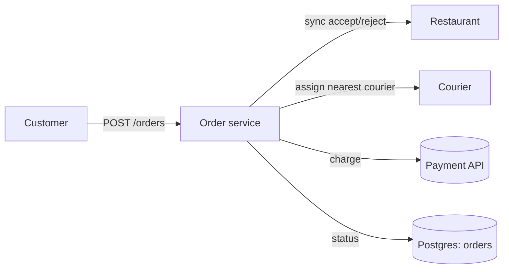
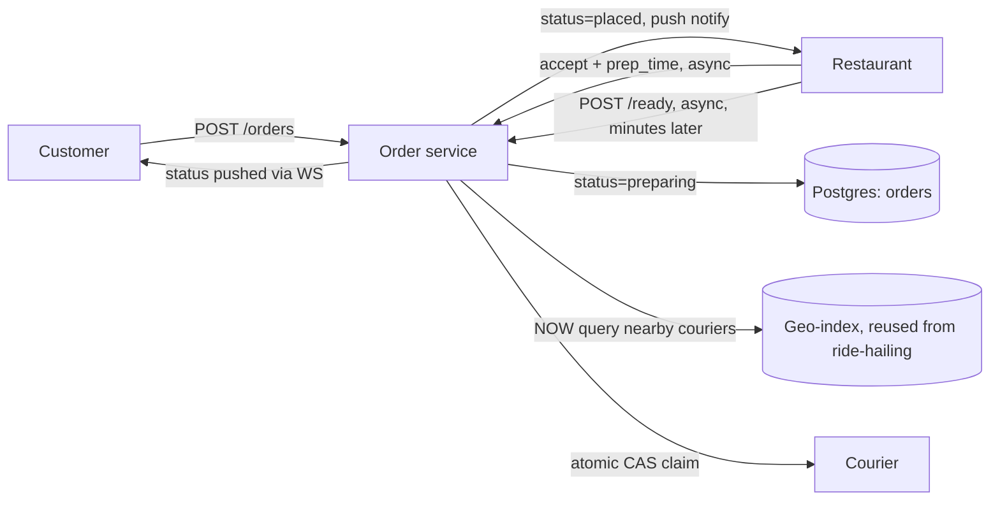
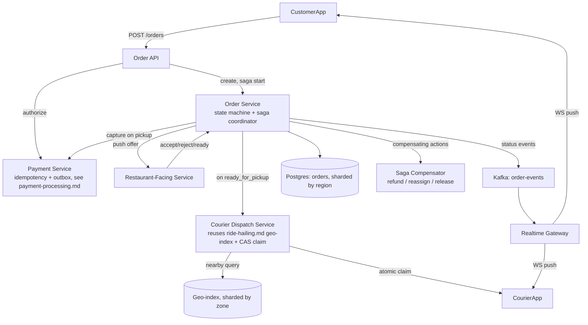

# Design: Food Delivery (DoorDash / Uber Eats)

**Difficulty:** Senior → Staff | **Time:** 60–75 minutes

!!! note "Instructions"
    Cover each section and work it yourself first. Before every "Version N" reveal there is a `???` box — commit to an answer before you open it. This exercise reuses two designs you should already know: courier-to-order matching is [ride-hailing.md](ride-hailing.md)'s driver-matching problem with a extra gate in front of it, and money movement follows [payment-processing.md](payment-processing.md)'s idempotency/outbox machinery. Do not re-derive either — cite them and spend your time on what's actually new here.

---

## 1. Problem Statement

Design a food delivery platform: a customer browses a restaurant's menu, places an order, the restaurant accepts and prepares it, a courier is matched and picks it up, and the customer tracks it to their door. Money moves from customer to platform to restaurant and courier.

[ride-hailing.md](ride-hailing.md) is a **two-party** real-time matching problem: rider and driver, matched once, tracked until drop-off. [payment-processing.md](payment-processing.md) is a **single financial actor**: charge a card, handle PSP failure, never double-charge. This exercise is neither alone — it's a **three-party state machine** (customer, restaurant, courier) where all three must agree before the order can proceed, and a failure by *any one* of them mid-flight must be unwound without losing the order or double-charging the customer.

The genuinely new problem: courier matching from ride-hailing.md assumed a driver was matchable the instant a rider requested. Here, matching is gated on something ride-hailing never had — **the restaurant's prep-time estimate**, which is uncertain, self-reported, and changes with how busy the kitchen is right now. Assign a courier too early and they idle at the counter, or worse, arrive before the food exists. Assign too late and the food sits out cooling — a stale order isn't just late, it's ruined. Get this timing wrong in either direction and you've either wasted a courier's trip or handed a customer cold food; both cost you the account.

---

## 2. Clarifying Questions

??? question "What questions should you ask?"
    - **Acceptance model:** Must the restaurant explicitly accept every order, or is it auto-accepted with an opt-out reject window?
    - **Prep-time source:** Restaurant-entered per order, a fixed per-restaurant default, or a model that learns from historical prep times?
    - **Dispatch timing:** Is the courier assigned at order placement (and waits), at restaurant acceptance, or closer to "food ready"?
    - **Batching:** Can one courier carry multiple orders (from the same restaurant, or a route through several) in one trip?
    - **Payment timing:** Authorize at order time, but when does the charge actually capture — at acceptance, at pickup, at delivery?
    - **Failure ownership:** If the restaurant is out of an item, whose job is substitution — the platform, the restaurant, or does the order just fail?
    - **Courier reliability:** What happens if an already-assigned courier goes offline or cancels mid-delivery?
    - **Customer unreachable:** Contactless drop-off default, or does a courier wait / attempt contact, and for how long before it's treated as a failed delivery?
    - **Scale:** Orders/day, peak concentration (dinner rush), restaurant density per delivery zone, average order value?
    - **Geography:** Same city-sharding assumption as ride-hailing, or can a delivery zone span a courier who's also available for rides on the same app?

---

## 3. Functional Requirements

- Customer browses a restaurant's live menu and places an order (items, address, payment method)
- Restaurant accepts or rejects the order, and supplies/confirms an estimated prep time
- System matches an available courier to the order once it's ready to be picked up
- Courier accepts the delivery, picks up from the restaurant, and delivers to the customer
- Customer and courier both see live order status; customer sees courier location once assigned
- Payment is authorized at order time and captured once the order is genuinely going to be fulfilled
- Order can fail cleanly at any stage (restaurant reject, no courier, customer unreachable) without a lost payment or a phantom charge

## 4. Non-Functional Requirements

| Property | Requirement | Reasoning |
|----------|-------------|-----------|
| Restaurant response SLA | Accept/reject within 90s or auto-timeout | An order nobody looks at is worse than a rejected one — the customer needs to know *now* |
| Matching latency | Courier assigned within 60s of "ready" signal | Food quality decays with counter-wait time, not with total order time |
| Order state durability | Every transition persisted before the next external call fires | This is a saga across 3 parties + money — losing a transition mid-flight either loses the order or double-books/double-charges |
| Availability | 99.95% for order placement and status updates | A down ordering path is a down business during dinner rush, same as ride-hailing's request path |
| Payment correctness | Exactly-once charge, refund on any fulfillment failure | Reuses payment-processing.md's guarantee — non-negotiable here too |
| Scale | 500K orders/day platform-wide, 40K orders/min at dinner-rush peak in aggregate across regions | Drives every downstream capacity number |

!!! tip "Interview Insight 🎯"
    Ride-hailing has one hard problem (geospatial matching) and payment-processing has one hard problem (exactly-once money movement). This exercise's hard problem is neither individually — it's that **all three parties must independently confirm before the platform can commit**, and any one of them can back out after the others already have. Say this out loud: it's a distributed saga with a human at each node, not just a database problem.

---

## 5. Capacity Estimation

```
Orders:
  500K orders/day platform-wide
  Dinner rush (6-8pm) captures ~35% of daily volume in a 2-hour window
  500K x 0.35 / 120 min ≈ 1,460 orders/min average during rush
  Concentrated peak (Friday night, a metro's dinner rush): ~40K orders/min platform-wide
    across ~30 metro regions ≈ 1,300 orders/min per metro at peak

Restaurants:
  ~50,000 active restaurants platform-wide
  Dense urban zone: ~800 restaurants per delivery zone (a few km radius)
  Each restaurant: 0-15 concurrent open orders during rush

Couriers:
  ~150,000 active couriers platform-wide at peak
  Per metro at peak: ~5,000 couriers online, ping every 4s (same cadence as ride-hailing)
  → 5,000 / 4 = 1,250 location writes/sec per metro, same geo-index shape as ride-hailing

Order lifecycle timing (why this isn't a caching problem):
  Accept window: up to 90s
  Prep time: 10-30 min, restaurant-supplied, revised mid-prep
  Courier travel to restaurant + wait + delivery: 15-40 min
  Total order lifetime: 25-70 min — long-lived state per order vs. ride-hailing's ~15-25 min trip

Order + menu storage:
  1.5M order records/day x ~3KB (items, addresses, timestamps, state history) ≈ 4.5 GB/day
  50K restaurants x ~200 menu items x 1KB ≈ 10 GB total, low write rate, high read rate (browsing)
```

!!! abstract "Mental Model"
    Ride-hailing's hot state (driver position) lives for the duration of one trip, ~20 minutes, and there's exactly one other party. Here, order state lives 25-70 minutes and has **three independent parties who can each unilaterally break it** — the restaurant can reject after 20 minutes of "preparing," the courier can go dark mid-route, the customer can be a locked building nobody warned you about. The system's job is less "route a query fast" and more "keep a long-lived, three-way handshake correctly synchronized under partial failure."

---

## 6. API Design

```
# Customer
POST /v1/orders
  { "restaurant_id": "r_1", "items": [...], "delivery_address": {...}, "payment_method_token": "tok_x" }
  → 201 { "order_id": "o_1", "status": "placed", "estimated_ready_by": null }

GET  /v1/orders/{order_id}
  → { "status": "preparing", "restaurant_eta_min": 18, "courier": null }

WS   /v1/orders/{order_id}/stream       # status changes + courier location once assigned

# Restaurant
POST /v1/restaurant/orders/{order_id}/respond
  { "response": "accept", "prep_time_min": 20 } | { "response": "reject", "reason": "item_unavailable" }
  → 200, or 409 if order already timed out / was cancelled

POST /v1/restaurant/orders/{order_id}/ready
  → 200   # signals food is at the counter — this is what unblocks courier dispatch, see V2

# Courier (reuses ride-hailing's offer/respond shape)
POST /v1/courier/offers/{offer_id}/respond
  { "response": "accept" | "reject" }
  → 200, or 409 if already claimed by another courier's accept

POST /v1/courier/orders/{order_id}/status
  { "status": "arrived_at_restaurant" | "picked_up" | "arrived_at_customer" | "delivered" }

# Internal
POST /v1/orders/{order_id}/cancel     # system or customer initiated, triggers refund/compensation
```

!!! warning "Production Trap ⚠️"
    Do not let `POST /orders/{id}/ready` be optional or inferred from a timer. If dispatch fires off the restaurant's *estimated* prep time instead of an explicit "ready" signal, every order where the kitchen runs 5 minutes behind (i.e., most of them during a rush) puts a courier standing at the counter for food that isn't there — and every order where the kitchen runs ahead leaves food cooling with no courier assigned yet. The explicit signal is cheap; the inferred one is wrong in both directions.

---

## 7. Data Model

**Order state machine — the coordination primitive for this whole design.**

| State | Entered when | Valid next states | Timeout / escalation |
|-------|---------------|--------------------|------------------------|
| `placed` | Customer submits order, payment authorized | `restaurant_accepted`, `restaurant_rejected`, `cancelled` | 90s no response → auto-reject, refund auth |
| `restaurant_accepted` | Restaurant accepts + supplies prep estimate | `preparing` | immediate |
| `preparing` | Kitchen begins prep | `ready_for_pickup`, `cancelled` (restaurant can't fulfill mid-prep) | prep_time_min + grace → alert ops, does not auto-cancel |
| `ready_for_pickup` | Restaurant sends explicit `ready` signal | `courier_assigned` | 3 min no courier found → widen search radius (see V3) |
| `courier_assigned` | Matcher claims a courier via atomic CAS | `courier_arrived_restaurant`, `courier_cancelled` | 5 min no restaurant-arrival ack → reassign |
| `courier_arrived_restaurant` | Courier checks in at restaurant | `picked_up` | — |
| `picked_up` | Courier confirms handoff, **payment captured here** | `delivered`, `delivery_failed` | — |
| `delivered` | Courier confirms drop-off (or contactless timer) | *(terminal)* | — |
| `restaurant_rejected` | Restaurant declines or auto-timeout | *(terminal, refunded)* | — |
| `delivery_failed` | Customer unreachable past threshold | *(terminal, compensating flow — §13)* | — |
| `cancelled` | Any party cancels before `picked_up` | *(terminal, refunded)* | — |

Two states don't exist in ride-hailing's trip machine and are the entire point of this design: `preparing` (courier deliberately not yet involved) and `ready_for_pickup` (the gate that turns "prep-time uncertainty" into an explicit signal instead of a guess).

```sql
CREATE TABLE orders (
    id                  VARCHAR(20) PRIMARY KEY,
    customer_id         VARCHAR(20) NOT NULL,
    restaurant_id       VARCHAR(20) NOT NULL,
    courier_id          VARCHAR(20),
    status              VARCHAR(30) NOT NULL,
    items               JSONB NOT NULL,
    total_cents         INT NOT NULL,
    payment_id          VARCHAR(20) NOT NULL,      -- FK into payment-processing.md's payments table
    prep_time_min       INT,
    placed_at           TIMESTAMPTZ NOT NULL,
    accepted_at         TIMESTAMPTZ,
    ready_at            TIMESTAMPTZ,
    picked_up_at        TIMESTAMPTZ,
    delivered_at        TIMESTAMPTZ,
    version             INT NOT NULL DEFAULT 0,    -- optimistic locking on state transitions
    INDEX idx_restaurant_status (restaurant_id, status),
    INDEX idx_courier_status (courier_id, status)
);

CREATE TABLE restaurant_menu_items (
    restaurant_id  VARCHAR(20) NOT NULL,
    item_id        VARCHAR(20) NOT NULL,
    name           VARCHAR(200),
    price_cents    INT NOT NULL,
    available      BOOLEAN DEFAULT TRUE,   -- restaurant toggles this off when 86'd mid-shift
    PRIMARY KEY (restaurant_id, item_id)
);
```

Courier live location and geo-index: identical mechanism to [ride-hailing.md §7](ride-hailing.md#7-data-model) — geohash-keyed hot store, `GEOSEARCH` for nearest-available. Not re-derived here; the only difference is *when* the query fires (gated on `ready_for_pickup`, not on order placement).

---

## 8. Version 1 — simplest thing that works

One order service. Restaurant confirms synchronously (customer waits on the request). Courier assigned by naive nearest-available the instant the restaurant accepts.



```python
def place_order(customer_id, restaurant_id, items, address, payment_token):
    payment = payment_service.authorize(customer_id, total(items), payment_token)
    order = db.insert(status="placed", payment_id=payment.id, ...)

    accept = call_restaurant_sync(restaurant_id, order.id, timeout_s=90)  # blocks the request
    if not accept.accepted:
        payment_service.void(payment.id)
        db.update(order.id, status="restaurant_rejected")
        return order

    db.update(order.id, status="preparing", prep_time_min=accept.prep_time_min)

    courier = find_nearest_available_courier(restaurant_location(restaurant_id))  # assign NOW
    assign_courier(courier.id, order.id)
    db.update(order.id, status="courier_assigned", courier_id=courier.id)
    return order
```

Ship this for a single-city pilot with a handful of restaurants. Do not add infrastructure yet — find the actual bottleneck first.

---

## 9. Identify the bottleneck

???+ question "At real restaurant volume, where does V1 actually break?"
    - **Restaurant doesn't respond within a reasonable window and the order is stuck.** V1's `call_restaurant_sync` blocks the customer's HTTP request for up to 90 seconds — no mobile client holds a connection open that long, and even if it did, the customer is staring at a spinner instead of a status they can watch change.
    - **The courier is assigned before the restaurant confirms prep time, so food isn't ready when they arrive.** V1 assigns the moment the restaurant *accepts*, not when the food is *ready*. A 20-minute prep time means the courier either idles at the counter for 20 minutes (burning their time, and yours, since they're not delivering anyone else) or the restaurant rushes the order to not waste the waiting courier — the wrong thing to optimize for a food-quality product.
    - **A courier can be double-assigned.** `find_nearest_available_courier` followed by a separate `assign_courier` call is a read-then-write with a gap — exactly the double-booking race ride-hailing.md solves with an atomic CAS. V1 has no such guard: two orders finishing prep at the same restaurant within the same second can both read the same "nearest available" courier before either assignment lands.
    - The fix to all three is the same shape: stop treating "restaurant confirms" and "courier assigned" as one synchronous step, and make the assignment itself atomic.

---

## 10. Version 2 — order state machine as the coordination primitive

Split the synchronous call into async state transitions, each with its own timeout. Courier assignment moves from "on accept" to "on ready," and the assignment step becomes the same compare-and-swap ride-hailing.md uses for driver claims.



```python
def on_restaurant_ready(order_id):
    order = db.get(order_id, expected_status="preparing")
    db.update(order_id, status="ready_for_pickup", ready_at=now())

    candidates = geo_index.nearest_available(restaurant_location(order.restaurant_id), radius_km=3)
    for courier in candidates:
        claimed = db.execute(
            "UPDATE couriers SET status='assigned', current_order_id=%s "
            "WHERE id=%s AND status='available' RETURNING id",
            order_id, courier.id
        )
        if claimed:  # single atomic conditional write — same CAS pattern as ride-hailing.md
            db.update(order_id, status="courier_assigned", courier_id=courier.id)
            notify_courier(courier.id, order_id)
            return
    schedule_retry(order_id, delay_s=30)  # no courier available right now — widen radius next pass
```

Every transition (`placed`, `preparing`, `ready_for_pickup`, `courier_assigned`, ...) now has its own timeout and its own escalation, matching the state table in §7. The customer-facing request returns immediately after `placed`; everything after that streams over the WebSocket, same pattern as ride-hailing's post-match tracking.

---

## 11. Identify the next bottleneck

???+ question "You gate dispatch on 'ready' and CAS the claim. What still breaks, and when?"
    - **A whole neighborhood orders at once and there's no available courier when a restaurant hits ready.** A cluster of orders finishing prep in the same few blocks (a Friday night in a dense restaurant row) can outstrip the couriers currently online in that geo-cell — structurally the same hot-cell problem as ride-hailing's stadium-letting-out scenario, but here the trigger is restaurant density plus synchronized dinner-rush timing rather than one event's end time. The `schedule_retry` loop above just spins forever if supply genuinely isn't there.
    - **A courier accepts, then goes offline mid-delivery.** Unlike ride-hailing where a dropped connection mid-trip degrades the *map* (§13 of that exercise), here it also strands **perishable food** at an unknown point between restaurant and customer — the order can't simply be "reconstructed from the stream" the way a ride can, because there's no fallback delivery method once food has left the counter.
    - **The restaurant rejects (or the kitchen has to abandon the order) after a courier is already assigned or en route.** Nothing in V2 handles "restaurant says no" arriving *after* a courier has committed travel time to it — the courier needs to be released and reassigned or paid a cancellation fee, and the customer needs a refund, not just a state flip.

---

## 12. Version 3 — production architecture



Key production decisions:

- **The order service is a saga coordinator, not a simple state machine owner.** Placing an order touches payment (authorize), restaurant (accept), and courier (assign) — three independent systems that cannot be wrapped in one database transaction. This is the exact shape [architecture-patterns/sagas.md](../architecture-patterns/sagas.md) describes: a sequence of local transactions, each with a defined **compensating action** if a later step fails. Order placement is: authorize payment → wait for restaurant accept (compensate: void authorization) → wait for ready → claim courier (compensate: release courier, keep order live for reassignment or refund) → capture payment on pickup (compensate: refund).
- **Payment: authorize at order placement, capture at pickup — not at delivery.** Authorizing at placement holds funds without moving them, so a restaurant rejection or a "no courier available" failure is a clean void with no refund plumbing needed. Capturing at *pickup* (not delivery) is the deliberate trade-off: by pickup, the restaurant has genuinely incurred the cost of making the food — the platform owes the restaurant regardless of what happens to the food between the counter and the door. Capturing at *delivery* instead would mean a customer-unreachable failure (§13) turns into a refund fight over food that's already been made and paid for by the restaurant's ingredients; capturing at pickup makes that a delivery-failure problem (handled via the courier/support flow) instead of a payment-reversal problem.
- **Courier dispatch is a separate service reusing ride-hailing.md's matching wholesale** — same geohash grid, same CAS claim, same offer/accept/timeout shape. The only new input is the *trigger*: dispatch fires on `ready_for_pickup`, not on order creation, and the candidate ranking should weight couriers already *near the restaurant* (they may be finishing another restaurant's pickup nearby) over pure distance-to-customer.
- **Restaurant-facing service is intentionally separate from the customer-facing order API.** Restaurants operate through a tablet/POS integration with very different reliability assumptions (spotty tablet wifi, staff not checking it) than a customer's phone app — isolating it means a restaurant integration outage degrades accept/ready signals for affected restaurants only, not the whole order pipeline.
- **Real-time tracking reuses ride-hailing.md's realtime gateway pattern** — WebSocket push from the moment of `courier_assigned`, not polling. Before that, `placed`/`preparing` status is low-frequency enough that a slower push cadence or client-side estimated-time countdown is fine.

---

## 13. Failure analysis

=== "Restaurant rejects after a courier is already assigned"
    A courier has claimed the order and is en route to the restaurant when the kitchen realizes it's out of a key ingredient and rejects (or calls in a cancellation).
    **Mitigation:** this is a saga compensation, not a state-machine dead end. Release the courier claim (`UPDATE couriers SET status='available' WHERE current_order_id=%s`), pay the courier a small cancellation fee if they'd already started travel (track `courier_assigned_at` vs `rejected_at` to decide), and void or refund the customer's payment depending on whether capture already happened. The customer sees `restaurant_rejected`, not a silent disappearance.

=== "Courier cancels mid-delivery and needs reassignment"
    Food is picked up, courier's app crashes or they go offline between restaurant and customer.
    **Mitigation:** if no status ping arrives for a threshold window while `picked_up`, mark the order `courier_unreachable` (not `delivered`, not `cancelled`) and alert ops immediately — unlike ride-hailing's "location goes stale but the ride is presumably still happening" fallback, food that's already left the counter cannot simply wait for a reconnect. Reassigning a *new* courier to physically relay food from wherever the first one was last seen is rarely practical; the realistic fallback is a support-initiated refund/credit plus flagging the courier's device state for investigation, not a system-level auto-reassignment.

=== "Payment capture fails after food is already prepared"
    The order reaches `picked_up`, capture is attempted (per §12, capture happens here), and the card is declined or the PSP times out — but the restaurant has already spent ingredients and staff time, and the courier is en route.
    **Mitigation:** do not unwind the delivery — the restaurant and courier commitments are sunk costs at this point, and pulling food back from a courier already driving is not a real option. Let the delivery complete, flag the payment as `capture_failed`, and retry capture asynchronously (same PSP-status-polling pattern as payment-processing.md §13); if capture never succeeds, it becomes a collections/write-off case handled outside the real-time order path, not a reason to fail the delivery.

=== "Customer unreachable at delivery"
    Courier arrives, no answer at the door, no response to calls/texts, contactless drop-off wasn't selected.
    **Mitigation:** define an explicit wait threshold (e.g. 5 minutes) after which the courier can mark `delivery_failed` with a photo/note. This triggers a compensating flow — not a card refund by default, since the food was genuinely delivered-to-location or genuinely made — usually a partial credit per policy, and the courier is released back to available. The order lands in `delivery_failed`, a distinct terminal state from `cancelled`, because the root cause and the appropriate compensation (support review, partial credit) differ from a mid-flow cancellation (full refund, no dispute).

---

## 14. Consistency considerations

This design has the same distributed-transaction shape as payment-processing.md's outbox pattern, extended across three external parties instead of one PSP:

- **No two-phase commit across services.** Order, payment, restaurant, and courier are independent systems with independent failure modes — the order service coordinates them as a **saga**: a sequence of local commits, each paired with a compensating action if a later step fails (see [sagas.md](../architecture-patterns/sagas.md)). Compensations must themselves be idempotent — a retry of "release courier" or "refund payment" must not double-refund or reassign twice.
- **Courier assignment is the one place strong consistency is non-negotiable**, identical to ride-hailing.md's argument: the CAS claim on courier status is a single atomic conditional write against one authoritative row. Everything else — menu freshness, ETA estimates, live location — tolerates seconds of staleness.
- **Payment idempotency is inherited wholesale from payment-processing.md**: idempotency key per authorize/capture/refund call, unique-constrained, so a retried capture after a network blip doesn't double-charge.
- **Read-your-writes for the customer:** after `POST /orders`, the customer must immediately see `status: placed` — write to primary and return the freshly-created order in the response, not a re-fetch.
- **Eventually consistent is fine for:** restaurant menu display (a few seconds of staleness on item availability is an acceptable trade against querying live inventory on every menu view), courier live location on the tracking map (same staleness budget as ride-hailing).

---

## 15. Observability

```
Metrics:
  order_state_transition_latency_ms{from_state,to_state}
  restaurant_response_time_p50/p99 (SLO: p99 < 90s)
  courier_claim_conflict_rate (CAS losses / attempts — same signal as ride-hailing)
  time_in_ready_for_pickup_before_assignment (the food-cooling-on-counter metric)
  orders_stuck{state} (age > expected threshold per state, grouped)
  payment_capture_failure_rate
  saga_compensation_rate{type=void|refund|reassign}
  delivery_failed_rate (customer-unreachable)

Alerts:
  restaurant_response_time_p99 > 90s for 10 min (a specific restaurant or platform-wide)
  time_in_ready_for_pickup > 5 min sustained (dispatch can't keep up with ready signals — supply shortfall)
  courier_claim_conflict_rate > 5% outside known rush windows
  saga_compensation_rate spike (something upstream is failing systematically, not just one order)
  orders_stuck{preparing} > 45 min (kitchen abandoned an order without signaling)
```

---

## 16. Cost analysis

```
Order service + Postgres (sharded by region, 500K orders/day, ~4.5GB/day):     ~$3,500/mo
Courier geo-index (reused ride-hailing infra, shared cost across products):    ~$0 marginal (shared fleet)
Restaurant-facing service (tablet/POS integrations, lower QPS, higher support):~$1,200/mo
Realtime gateway (WS fan-out, ~150K concurrent tracked orders at peak):        ~$2,000/mo
Payment processing (reuses payment-processing.md's stack, PSP fees dominate):  PSP fees ~2.9% + $0.30/txn, infra ~$1,500/mo
Kafka (order-events stream):                                                   ~$800/mo

Total infra (excluding PSP fees):                                             ~$9,000/mo

Cost lever: batching multiple orders per courier trip (see Alternative Architectures)
  cuts courier cost-per-order 20-35% during dense-restaurant-row rush windows
  at the cost of added delivery latency for the first order in the batch.
```

---

## 17. Alternative architectures

=== "Platform-initiated vs. restaurant-initiated dispatch"
    This design has the platform's dispatch service decide when and who to assign, triggered by the restaurant's `ready` signal — the restaurant is a data source (accept/prep-time/ready), not a decision-maker in matching. The alternative, common with large chain restaurants running their own logistics stack, lets the restaurant's POS *request* a courier directly and the platform just fulfills that request. Platform-initiated keeps matching quality and fairness consistent across all restaurants (same ranking logic ride-hailing.md uses: distance, heading, acceptance history); restaurant-initiated offloads the "when is it really ready" judgment to whoever has the best information (the kitchen) at the cost of losing centralized control over dispatch timing and courier utilization.

=== "Single-order trips vs. batched delivery"
    V3 assumes one courier carries one order at a time, same as a ride-hailing trip. Batching — one courier picks up 2-3 orders from the same restaurant or a tight cluster of restaurants, delivers them in sequence — improves courier earnings-per-hour and platform cost-per-delivery during dense-restaurant-row rush, but the order state machine must now track a courier who is simultaneously `courier_assigned` to multiple orders, and the CAS claim logic changes from "claim one courier for one order" to "claim capacity on a courier's current trip" — a meaningfully different (and harder) atomicity problem than ride-hailing's single-passenger claim. Batching also means the *second* order in a batch systematically waits longer, which needs to be an explicit, disclosed trade-off (a discount or faster-promised alternative) rather than a silent regression.

---

## 18. Staff Engineer Extensions

=== "100x traffic (major event / holiday demand spike)"
    Not uniform 100x — concentrated in specific metros and specific hours (a championship game, a snowstorm keeping everyone in). The response mirrors ride-hailing's event-footprint answer: pre-provision geo-index and dispatch capacity for known high-demand windows, and additionally here, **communicate expected prep-time inflation to customers before they order** (a restaurant's real prep time balloons under order-flood even if the kitchen never rejects), and temporarily widen the `ready_for_pickup` courier-search radius proactively rather than reactively when local supply visibly can't keep up.

=== "Multi-region"
    Like ride-hailing, this system shards naturally by delivery zone — a courier in Chicago never delivers an order placed against a Chicago restaurant from Denver's dispatch. Each region runs its own order service, dispatch, and restaurant-facing stack. The cross-region concerns are narrower than payment-processing's: customer accounts and payment methods need global visibility (a customer traveling to a new city should be able to order there), but order/menu/dispatch data stays region-local.

=== "Data residency"
    Falls out mostly for free from regional sharding, same as ride-hailing — EU orders, EU restaurant data, and EU courier location live in EU infrastructure because the region's shard is physically there. The one place to double-check: a cross-region fraud/ML pipeline scoring "is this a fake order" must not pull EU customer order history into a US-region training job without the same residency tagging discipline called out in ride-hailing.md's data residency section.

=== "Zero-downtime migration of the order state machine"
    Adding a new state — say, `awaiting_substitution_approval` between `preparing` and `ready_for_pickup`, to support "we're out of fries, is a side salad OK?" — without breaking orders already mid-flight. Deploy the new state's handling code first, but keep it dormant (feature-flagged off) until every service that reads `orders.status` (order API, restaurant-facing service, courier dispatch, the realtime gateway's WS payload mapping, analytics) has been updated to not choke on an unrecognized status value. Roll the flag out restaurant-by-restaurant rather than platform-wide, so a bug in the new transition affects a small, bounded set of live orders. Never let an in-flight order (one that started its saga before the new state existed) get routed through the new transition — key the behavior off `order.created_at` vs. the flag's flip time, not just the flag alone.

---

## 19. Interview follow-ups

1. **"Why does courier assignment wait for the restaurant's `ready` signal instead of assigning at order placement, like ride-hailing does at request time?"** — Ride-hailing has no "prep" phase; the driver *is* the fulfillment. Here, assigning early either strands a courier waiting at a counter (wasted courier-hours) or pressures the kitchen to rush (food quality). The explicit `ready_for_pickup` gate turns an estimate into a fact before spending courier capacity on it.
2. **"How would you decide whether to reassign a courier or refund the customer when a delivery fails mid-route?"** — Depends on where in the state machine it failed and whether the food is still viable. Lost/damaged food or an unreachable courier past a threshold: refund/credit, no reassignment (a second courier can't retrieve food from the first one's car reliably). A courier who cancels *before* pickup: reassign is straightforward, same claim mechanism as the original match.
3. **"Why capture payment at pickup instead of at delivery?"** — By pickup, the restaurant has already incurred the real cost of the order; the platform owes that regardless of what happens next. Capturing at delivery would make a customer-unreachable failure into a full refund dispute over food the restaurant already made, conflating a delivery-logistics failure with a payment-reversal decision — capture-at-pickup keeps those two problems separate.
4. **"How would batching change the courier claim's atomicity guarantee?"** — Single-order claim is a CAS on one row (`status='available' → 'assigned'`). Batching needs a claim against *remaining capacity* on an already-assigned courier's trip (e.g. `capacity_used < capacity_max`), which is a compare-and-increment rather than a compare-and-set on a boolean — same atomic-conditional-write principle, one more dimension of state to guard.

---

## Self-Assessment

- [ ] I can explain why this is a three-party saga, not a two-party match (ride-hailing) or a single financial actor (payment-processing)
- [ ] I can justify gating courier dispatch on an explicit `ready` signal instead of the restaurant's estimated prep time
- [ ] I can walk through the saga's compensating actions for a restaurant rejection after courier assignment
- [ ] I can defend authorize-at-order / capture-at-pickup with the specific failure it avoids
- [ ] I can distinguish `delivery_failed` from `cancelled` and explain why they need different compensations
