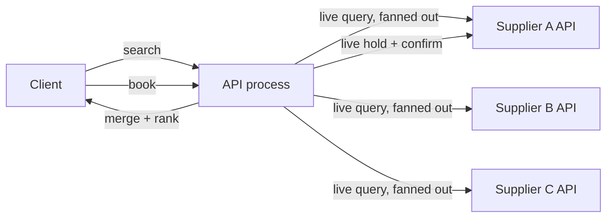
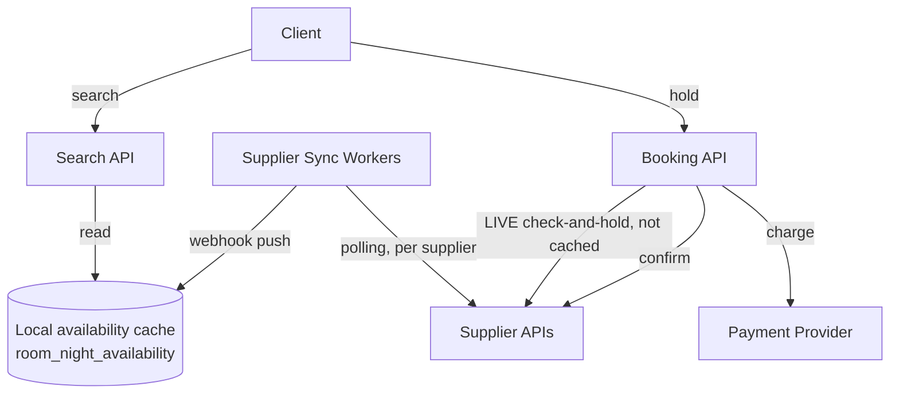
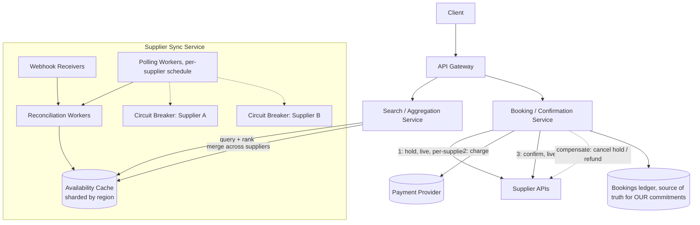
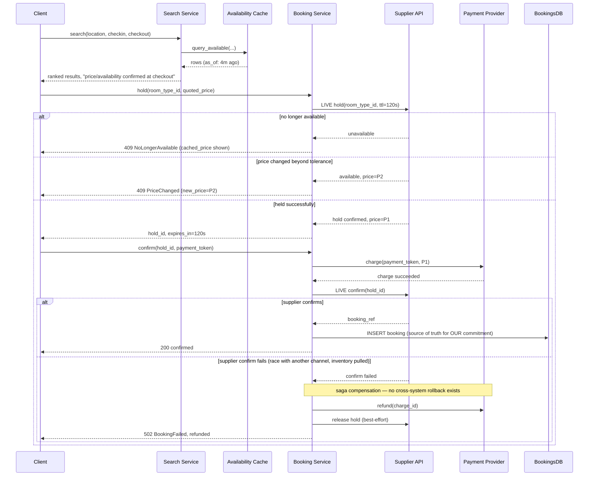

# Design: Hotel & Flight Booking (Expedia / Booking.com)

**Difficulty:** Senior → Staff | **Time:** 60–75 minutes

!!! note "Instructions"
    Cover each section and work it yourself first. Before every "Version N" reveal there is a `???` box — commit to an answer before you open it. This exercise looks like a seat-inventory problem; it is actually two harder problems wearing that costume — read Section 1 before you draw a single box.

---

## 1. Problem Statement

Design a booking aggregator like Expedia or Booking.com: a user searches "hotels in Austin, June 5–9" or "flights SFO→JFK, June 5", sees ranked results with prices, picks one, and books it. Payment is collected, a confirmation is issued, and the room/seat is no longer offered to other searchers.

Two things make this a different exercise from every other inventory system on this site, and both need to be named out loud before you design anything:

**(a) The inventory unit is a date range, not a point-in-time count.** A concert-ticket system asks "is seat 14C available, yes or no" — one boolean per seat. Here the question is "is room 204 available for check-in June 5 through check-out June 9" — a request to book June 6–7 must be checked against *every existing reservation whose range overlaps* those two nights, not against a single counter. A flight leg is a coarser version of the same problem (one flight, one date, but seat *classes* with counts that must not oversell) — but multi-night hotel stays are the sharper case and the one this exercise centers on.

**(b) You do not own the inventory.** In the agency/aggregator model, the hotel chain or airline is the system of record for their own rooms and seats. You hold a *cached, possibly stale* copy of their availability and price, refreshed on your own schedule, not theirs. Between the moment your search result renders and the moment the user clicks "book," the supplier's real inventory can change out from under you — someone booked directly on the hotel's own site, or another OTA sold the last room first. You did not cause that race, but your system has to detect and handle it gracefully every single time, because at meaningful scale it happens constantly, not as an edge case.

Everything from the data model to the saga in Version 3 is a consequence of these two facts.

---

## 2. Clarifying Questions

??? question "What questions should you ask?"
    - **Merchant or agency model?** Do you buy and resell inventory (own the risk, set your own price) or purely broker a supplier's live inventory (agency — most OTAs are a mix)?
    - **Which verticals?** Hotels (date ranges, per-room-type counts) and/or flights (per-leg seat classes, one-way vs round-trip vs multi-city)?
    - **Supplier integration style:** real-time API per search (GDS-style), or a locally cached/synced copy of supplier availability?
    - **Price volatility:** How often do supplier prices change? Do you need to honor a *quoted* price for some window (price-lock)?
    - **Cancellation policy:** Free cancellation, non-refundable, partial refund — this affects whether "confirmed" is really final.
    - **Payment timing:** Charge at booking, or authorize now and capture at check-in (hotels often do the latter)?
    - **Scale:** Searches/second, number of suppliers, properties/flights indexed, booking confirmations/second?
    - **Consistency expectation for search:** Is the user told "prices are indicative, confirm at checkout," or do we promise the displayed price is bookable?

---

## 3. Functional Requirements

- Search hotels/flights by location (or route) and date range, return ranked, priced results
- Show live-enough price and availability per result
- Reserve/hold a specific room-type or seat-class for a short window during checkout
- Confirm a booking: charge the customer and get a supplier confirmation number
- Cancel/modify a booking, propagating to the supplier where their policy allows
- Handle "no longer available" gracefully at booking time, not just show a generic error

## 4. Non-Functional Requirements

| Property | Requirement | Reasoning |
|----------|-------------|-----------|
| Search latency | < 800ms p99 for cached search, up to 3s for a live/fallback fan-out | Users abandon slow travel search fast, but a live supplier call is inherently slower than a rate-limiter-style lookup |
| Booking latency | < 5s p99 including supplier hold + payment | Correctness (don't double-charge, don't fail silently) matters more than shaving milliseconds here |
| Search consistency | Best-effort, bounded staleness (minutes) | You don't own the data; promising real-time accuracy across hundreds of suppliers is a lie |
| Booking consistency | Strongly consistent with the supplier at commit time | Money and a confirmed room are on the line — no "eventually correct" bookings |
| Availability | 99.9% for search, 99.95% for booking/payment path | Booking failures are refund headaches and lost trust; prioritize the write path |
| Scale | 5,000 hotel suppliers, 300 airlines, 50M search requests/day | Fan-out and rate limits dominate the design, not raw storage |

!!! tip "Interview Insight 🎯"
    Say the merchant-vs-agency distinction early. If you're the merchant (you bought blocks of rooms), you *are* the source of truth and this becomes closer to the ticket-booking exercise. If you're the agency (the common OTA case), the supplier is the source of truth and your entire architecture exists to manage staleness against a system you don't control. Most interviewers are testing for the agency case — it's the harder, more realistic one.

---

## 5. Capacity Estimation

```
Catalog:
  Hotels: 5,000 suppliers x avg 200 properties x avg 150 rooms ≈ 150M room-nights of state to represent
  (Represented as booked-range calendars per room-type, not per physical room — see Data Model)
  Flights: 300 airlines x ~3,000 daily flight legs x 365 days rolling ≈ ~330M leg-date rows in a 1-year window

Search traffic:
  50M searches/day → ~580/s average, ~5,800/s at 10x peak (holiday booking windows)
  Avg date range per hotel search: 3 nights
  Avg results shown per search: merged/ranked from 20-80 suppliers for a popular destination

Booking traffic:
  Booking:search conversion ~2% → ~12/s average confirmations, ~120/s peak
  Each confirmation = 1 supplier hold call + 1 payment call + 1 supplier confirm call (at least 3 external calls)

Supplier API budget:
  If search fanned out live: 5,800 searches/s x 40 suppliers avg = 232,000 supplier calls/s — no supplier grants this
  Most suppliers cap partners at 10-50 req/s each → local caching is not optional, it's the only viable design
  Sync budget instead: poll each of 5,000 suppliers every 5-15 min + webhook pushes ≈ ~10-15 calls/s aggregate for sync
```

!!! abstract "Mental Model"
    You are not building a database of rooms. You are building a **freshness pipeline** for 5,000 independent, uncooperative sources of truth, plus a narrow **strongly-consistent commit path** that talks to exactly one of them at the moment it matters. Every version below is about widening the gap between those two without letting the gap lie to the user.

---

## 6. API Design

```
GET /v1/search/hotels?location=Austin,TX&checkin=2026-06-05&checkout=2026-06-09&guests=2
Response: {
  "results": [
    { "hotel_id": "...", "room_type_id": "...", "supplier": "hilton",
      "price_total": 612.00, "currency": "USD", "as_of": "2026-08-17T10:02:00Z",
      "cancellation": "free_until_2026-06-01" }
  ]
}
# `as_of` tells the client (and the UI) exactly how stale this price/availability is.

GET /v1/search/flights?from=SFO&to=JFK&date=2026-06-05&return=2026-06-09

POST /v1/holds
Request:  { "supplier": "hilton", "room_type_id": "...", "checkin": "...", "checkout": "...", "quoted_price": 612.00 }
Response: { "hold_id": "h_123", "expires_at": "...+120s", "confirmed_price": 612.00 }
# Live supplier call. Price may differ from search's quoted_price — client must show the delta before charging.

POST /v1/bookings
Request:  { "hold_id": "h_123", "payment_token": "..." }
Response: { "booking_id": "b_456", "supplier_confirmation": "HH-9182ailored", "status": "confirmed" }
Status: 201 Confirmed, 409 Hold Expired / No Longer Available, 402 Payment Failed

DELETE /v1/bookings/{booking_id}   -- cancellation, subject to supplier policy
```

!!! warning "Production Trap ⚠️"
    Never let `/v1/bookings` accept a price directly from the client. Always re-derive it from the live hold. A stale cached price plus a trusting booking endpoint is a straightforward way to let users book last month's price.

---

## 7. Data Model — interval availability, not a counter

A room-type's availability is fundamentally a **set of booked date ranges**. The query you run constantly is: "for this room-type, does `[checkin, checkout)` overlap any existing booked range, and if not, is inventory count still > 0 for every night in it?" That's an interval-overlap problem, not a single-row decrement.

Two representations, with a real trade-off:

**Per-night counter (bitmap-style).** Store one row (or one bit in a bitmap) per room-type per night, holding remaining count.

```sql
CREATE TABLE room_night_availability (
    room_type_id  VARCHAR(64) NOT NULL,
    night_date    DATE NOT NULL,
    total_rooms   SMALLINT NOT NULL,
    booked_rooms  SMALLINT NOT NULL,
    PRIMARY KEY (room_type_id, night_date)
);
-- Checking a 4-night stay = 4 point reads (or one range query),
-- decrementing = 4 row updates. Simple, cheap, easy to reason about.
```

This is the pragmatic default: a stay of `N` nights becomes `N` simple row reads/writes (`SELECT ... WHERE room_type_id=? AND night_date BETWEEN ? AND ?`, then per-row `UPDATE ... SET booked_rooms = booked_rooms + 1 WHERE booked_rooms < total_rooms`). It scales to normal stay lengths trivially and every row is independently indexable and cacheable.

**Interval tree / range index.** Store actual booking ranges (`[checkin, checkout)` per reservation) and query with an interval-overlap structure (Postgres `tstzrange` + a GiST index, or an in-memory interval tree per room-type). This is more general — it handles arbitrary-length stays and irregular blackout ranges without materializing a row per night — but it's more complex to reason about under concurrent writes, and most real stays are short (1-14 nights), so the per-night counter's "N rows" is never actually large.

**Choice for this design:** per-night counters, backed by `tstzrange` + GiST as a secondary index for range-level queries (e.g. "show all fully-open 7+ night windows" for calendar UIs). The counter table is what the hot booking path touches; the range index serves richer search UX. Justify this the way pastebin justified splitting metadata from blob: pick the representation that matches your actual access pattern (mostly short, bounded-length stays) rather than the most general structure.

Flights are the simpler case — one date, a handful of fare classes per leg, each just a decrementing counter:

```sql
CREATE TABLE flight_leg_inventory (
    flight_id     VARCHAR(64) NOT NULL,
    flight_date   DATE NOT NULL,
    fare_class    VARCHAR(8) NOT NULL,   -- Y, J, F, etc.
    seats_total   SMALLINT NOT NULL,
    seats_booked  SMALLINT NOT NULL,
    PRIMARY KEY (flight_id, flight_date, fare_class)
);
```

**Supplier-sync layer (because you don't own the source of truth):**

```sql
CREATE TABLE supplier_sync_state (
    supplier_id       VARCHAR(64) PRIMARY KEY,
    sync_mode         VARCHAR(16),   -- webhook | polling | hybrid
    last_synced_at    TIMESTAMPTZ,
    last_success_at   TIMESTAMPTZ,
    consecutive_failures INT,
    circuit_state     VARCHAR(16)    -- closed | open | half_open
);
```

`room_night_availability` and `flight_leg_inventory` are *our cache*, not our ledger — they're populated and overwritten by the sync layer, never treated as authoritative for the booking commit itself (see Version 2/3).

---

## 8. Version 1 — simplest thing that works

One API process. Every search fans out synchronously to every relevant supplier's live API. Every booking calls the supplier live too. No local cache of availability at all.



```python
def search_hotels(location, checkin, checkout):
    suppliers = suppliers_for(location)              # e.g. 40 chains with a property here
    results = []
    for supplier in suppliers:                        # naive: sequential or thread-per-call
        resp = supplier.query_availability(location, checkin, checkout)
        results.extend(resp.rooms)
    return rank_and_merge(results)

def book(room_offer, payment_token):
    hold = room_offer.supplier.hold(room_offer.room_type_id, checkin, checkout)
    if not hold.available:
        raise SoldOut()
    charge(payment_token, hold.price)
    confirmation = room_offer.supplier.confirm(hold.hold_id)
    return confirmation
```

This works for a demo with three suppliers. Do not add caching yet — find the actual bottleneck first.

---

## 9. Identify the bottleneck

???+ question "At 5,800 searches/second fanned out to 40 suppliers each, what breaks first?"
    - **p99 latency = the slowest supplier's response time.** A synchronous fan-out to 40 suppliers is only as fast as the slowest one you wait on. One supplier having a bad day (2s response instead of 200ms) drags every search that includes them, not just their own traffic.
    - **Supplier rate limits get exhausted by your own traffic, not abuse.** From the capacity estimate: 5,800 searches/s x 40 suppliers = 232,000 calls/s. Real supplier partner APIs cap you at 10-50 req/s each. You will 429 yourself into a broken product within seconds of real load, with zero external attacker involved.
    - **Search-to-booking race is now on every single booking, not an edge case.** By the time a user reads results, compares three hotels, and clicks "book" (30-90 seconds later), the live-queried availability from search is already ancient — you re-query at booking time in V1, which papers over this, but it means search and booking are answering two completely decoupled questions and users see "sold out" disproportionately for anything popular.
    - This isn't a "add more servers" problem — no amount of horizontal scaling on *your* side fixes a hard external rate limit or a slow supplier's own latency.

---

## 10. Version 2 — local availability cache, live check at booking

Stop calling suppliers synchronously on every search. Sync a local copy of availability (webhook push where the supplier supports it, polling otherwise), search against that cache, and only go live to the supplier at the moment of booking.



```python
def search_hotels(location, checkin, checkout):
    rows = cache.query_available(location, checkin, checkout)   # local DB, no external call
    return rank_and_merge(rows, freshness_note=True)             # UI shows "as of Xm ago"

def hold(room_type_id, checkin, checkout, quoted_price):
    # Live call — the one place staleness is not acceptable.
    hold = supplier.hold(room_type_id, checkin, checkout, ttl_s=120)
    if not hold.available:
        raise NoLongerAvailable(cached_price=quoted_price)   # distinct from a generic error
    if abs(hold.price - quoted_price) > PRICE_TOLERANCE:
        raise PriceChanged(new_price=hold.price)
    return hold
```

Search TTL is short (5-15 minutes depending on supplier sync mode) and every result carries an explicit `as_of` timestamp. The UI's job is to set expectations: "price and availability confirmed at checkout" — this is the same hold-before-commit shape used in [`ticket-booking.md`](ticket-booking.md)'s Version 2 and in the ecommerce reservation pattern, but applied here to a supplier-owned resource instead of a resource you own outright: the hold call itself leaves your system and round-trips to the supplier, which is why it's the slow, live step rather than a local lock acquisition.

---

## 11. Identify the next bottleneck

???+ question "The cache absorbs search load fine. What's the new failure mode, and why is it different from a single hot item?"
    - **This isn't one viral seat map going stale — it's constant background staleness across the whole catalog.** Unlike a single popular concert where one row's cache goes hot and stale, here every one of 5,000 suppliers is independently pushing webhooks (or not) on their own schedule. A supplier's webhook delivery silently failing for six hours means their *entire* property catalog quietly drifts stale in your cache — no single alert fires because no single query looks "wrong," search just slowly gets worse for that supplier's properties, showing rooms that are actually sold and hiding ones that reopened.
    - **Popular-destination fan-out still exists, just moved.** A search for "hotels in Cancun, spring break week" still needs to merge/rank results across potentially hundreds of suppliers with properties there — that's now a local-cache aggregation and ranking cost (join + sort across many rows), not a network fan-out cost, but at high enough concurrency it can still overwhelm the aggregation service if ranking logic is expensive per result.
    - The fix has two independent parts: (1) monitor sync freshness *per supplier*, not just aggregate cache hit rate, and (2) isolate one supplier's sync failure from dragging down others — a naive shared sync worker pool means one supplier's slow/hanging API calls starve sync capacity for everyone else, which is the same "slowest dependency wins" failure as Version 1's search fan-out, just relocated to the background.

---

## 12. Version 3 — production architecture



Key production decisions:

- **Search/aggregation service never calls a supplier live.** It only reads the cache, ranks, and merges. This is what makes p99 search latency independent of any single supplier's health.
- **Per-supplier circuit breakers in the sync layer.** A hanging or error-prone supplier trips its own breaker and backs off; sync workers for the other 4,999 suppliers are unaffected. Reconciliation workers are pooled but rate-limited *per supplier*, not globally, so one bad actor can't starve the pool.
- **Booking is a saga, not a single transaction**, because it spans three independent systems (supplier, payment provider, your own ledger) that have no shared transaction coordinator: hold with supplier → charge customer → confirm with supplier. If confirm fails after charge succeeds, the compensating action is refund-and-release-hold, not a rollback (there's no rollback across systems you don't control). See [`architecture-patterns/sagas.md`](../architecture-patterns/sagas.md) for the general pattern this instantiates.
- **`BookingsDB` is your actual source of truth for your own commitments** — even though you don't own room/seat inventory, you must own an authoritative, durable record of what you promised each customer, independent of the availability cache, so a cache rebuild or supplier outage can never make a confirmed booking "disappear" from your side.

The topology diagram shows the components; the sequence below shows the three-phase **cache-then-verify-then-commit** flow a single booking actually walks through — cheap cached search, then a live re-check at hold time (because the cache can be stale), then a saga-style commit that must compensate if the supplier's live confirm disagrees with what was just held:



---

## 13. Failure analysis

=== "Supplier says unavailable after cached search showed it available"
    The cache said "available," the user clicked book, the live hold call at the booking service returns `NoLongerAvailable`. This is expected, not exceptional — it's the direct consequence of not owning the source of truth. **UX:** show "sold out" with the next-best alternative immediately (don't just error), and re-run a quick cache refresh for that specific room-type so the next search doesn't show the same stale row. **Recovery:** never blame the user's connection or retry blindly — this is a real state mismatch, log it as a `stale_cache_miss` metric per supplier so a supplier with a high rate becomes visible and actionable (maybe their sync needs tightening, or their webhook is unreliable).

=== "One supplier's API degrades and drags down aggregate search latency"
    Even with a cache-only search path, if a slow supplier's *sync* backs up, reconciliation workers pooled globally would stall on it. **Mitigation:** the per-supplier circuit breaker (Version 3) isolates this — after N consecutive slow/failed sync calls, that supplier's breaker opens, sync workers stop hammering it, and search serves last-known-good (increasingly stale, clearly labeled) data for that supplier's inventory rather than blocking anything else.

=== "Webhook delivery failure causes prolonged stale availability for a supplier"
    Supplier's webhook push silently stops (network blip on their end, a misconfigured endpoint after a deploy, whatever). Nothing in the request path errors because there's no request — it's an absence of pushes. **Mitigation:** never rely on webhook-only sync; every supplier also gets a polling fallback on a coarser interval (e.g. every 15 min) purely as a freshness backstop, and `supplier_sync_state.last_success_at` is alerted on directly — "no successful sync in > 30 minutes" fires independent of whether anyone noticed bad search results.

=== "Payment charged but supplier booking confirmation times out"
    The charge succeeded, but the final `confirm()` call to the supplier times out — ambiguous whether the supplier actually confirmed or not. **This is the most dangerous failure in the saga** because retrying blindly risks a double-booking on the supplier's side, and not retrying risks a customer who paid for nothing. **Mitigation:** the `confirm()` call must be idempotent (send a client-generated `idempotency_key` the supplier's API is contracted to dedupe on), retry with that same key on timeout, and if retries are exhausted, transition the booking to a `pending_manual_review` state rather than silently failing — never auto-refund on ambiguous supplier state without first re-querying the supplier's own booking-lookup endpoint to check if it actually went through.

---

## 14. Consistency considerations

- **Search is inherently best-effort and eventually consistent, bounded by supplier sync freshness — and that's a permanent property of this architecture, not a bug to eliminate.** You can tighten sync intervals and add webhooks, but you cannot make search strongly consistent with 5,000 independent suppliers without calling all of them live on every search, which Version 1 already showed is not viable at real traffic.
- **Booking confirmation must be strongly consistent with the supplier at the moment of commit.** The hold-and-confirm calls in the booking service are synchronous, live round trips specifically because this is the one place staleness is unacceptable — money changes hands here.
- **This gap between the two is unavoidable in an aggregator model**, and it's the single biggest architectural difference from [`ticket-booking.md`](ticket-booking.md): a system that owns its seat map outright can make the *search* step itself strongly consistent (check the authoritative seat map directly), collapsing search and booking consistency into one guarantee. An aggregator can never do that for search — the best you can do is make the gap small (short TTLs, webhooks) and honest (visible `as_of` timestamps, explicit "confirm at checkout" UX) rather than pretend it doesn't exist.
- **Read-your-writes applies to your own booking ledger, not to supplier inventory.** After a user books, they must immediately see "confirmed" reflecting your ledger — that's a normal single-system consistency guarantee and easy to satisfy; it's a different guarantee from "the cache now reflects this room as unavailable everywhere," which propagates on the sync layer's normal cadence.

---

## 15. Observability

```
Metrics:
  search_latency_p50/p99{path=cache_only}
  supplier_sync_freshness_seconds{supplier_id}       -- per-supplier, not just aggregate
  supplier_sync_last_success_age{supplier_id}
  supplier_circuit_state{supplier_id}
  stale_cache_miss_rate{supplier_id}                 -- "showed available, booking said no" rate
  booking_saga_step_latency{step=hold|charge|confirm}
  booking_saga_compensation_rate                      -- how often we had to unwind
  pending_manual_review_count                          -- ambiguous confirm-timeout bookings

Alerts:
  supplier_sync_last_success_age > 30min for any supplier
  stale_cache_miss_rate > 5% for any supplier (their sync needs tightening)
  supplier_circuit_state = open for > 15min (real partner outage, page their side too)
  booking_saga_compensation_rate spike (something upstream just broke)
  pending_manual_review_count growing unbounded
```

---

## 16. Cost analysis

```
Availability cache (sharded, ~150M room-nights + flight legs):    ~$1,800/month
Supplier sync workers (polling + webhook receivers, 5,000 suppliers): ~$600/month compute
Search/aggregation service (5,800 rps peak):                       ~$1,200/month
Booking/saga service + Postgres ledger:                            ~$400/month
Payment provider fees (2.5-3% of GMV — dwarfs infra, note separately)

Supplier API budget (the line item other exercises don't have):
  Most partner contracts cap free/included call volume; overage is often metered per call
  Polling 5,000 suppliers every 10 min ≈ 8.3 calls/s aggregate — usually within free tier
  Booking-time hold+confirm calls (120/s peak x 2 calls) ARE metered by most suppliers
  → budget ~$0.01-0.05/call for premium/GDS-style suppliers at booking volume
  → at 120 confirmations/s peak x 2 calls x $0.02 ≈ $4.80/s peak — this is why booking volume,
    not search volume, is the number suppliers actually care about in the partner contract
```

!!! tip "Interview Insight 🎯"
    Naming supplier API cost/rate-limit budget as its own line item — separate from infra — signals you understand this isn't a normal capacity-planning exercise. The bottleneck resource here is a contract with another company, not a server you can just add more of.

---

## 17. Alternative architectures

=== "Real-time supplier query (GDS-style)"
    The airline industry's actual approach for flights: Global Distribution Systems (Sabre, Amadeus) query airline inventory close to live for each search, because fares and seat maps change by the minute and airlines built infrastructure specifically to absorb this query volume from GDS partners. Works when suppliers *want* to be queried live and have built for it. Doesn't generalize to 5,000 independent hotel chains with wildly different API maturity.

=== "Cached-then-confirm (hotel OTA's typical approach)"
    What this design builds: search against a synced local cache, confirm live at booking. Necessary when suppliers can't or won't support high query volume — true for most hotel chains, especially smaller ones without GDS-grade infrastructure.

=== "Merchant model (own the inventory)"
    Buy blocks of rooms/seats outright and resell them. You become the authoritative source of truth for that inventory, collapsing the search/booking consistency gap entirely — this is architecturally much closer to `ticket-booking.md`. Trade-off: you now carry unsold-inventory risk and capital exposure instead of the supplier.

=== "Pure agency model (this design)"
    Broker the supplier's live inventory, no risk carried, but you inherit their staleness and rate limits as a permanent architectural constraint. Most real OTAs run a hybrid: merchant for a curated subset of high-volume properties (where the economics justify owning inventory), agency for the long tail.

---

## 18. Staff Engineer Extensions

=== "100x traffic (holiday search spike)"
    580K searches/s during a holiday sale. The cache-only search path already decouples this from supplier rate limits — the bottleneck moves to your own aggregation/ranking compute and cache read throughput. Shard the availability cache by region/geohash so a Cancun spike doesn't contend with unrelated Tokyo searches on the same shard. Booking volume rarely spikes 100x even when search does (conversion rate drops under load as users compare more), so the supplier-facing booking path is less exposed — verify that assumption with real data before assuming it, though.

=== "Multi-region"
    Search/aggregation and cache should be regional (serve EU searches from an EU cache replica) for latency. Supplier sync is trickier: a supplier's canonical inventory has one true state, so sync workers for a given supplier should have one active region (avoid two regions polling/reconciling the same supplier and racing on cache writes) while cache reads replicate out to all regions asynchronously.

=== "Data residency (supplier contracts/pricing can be region-specific)"
    Some supplier contracts prohibit showing their EU rates to non-EU searchers (regional pricing agreements), or require EU customer PII to stay in EU infrastructure. Tag suppliers and rate plans with residency/visibility rules at ingestion, filter at the aggregation layer before ranking — not as an afterthought at the UI. This is a real, common constraint in travel distribution contracts, distinct from the more familiar "user's own data must stay in-region" GDPR case: here it's the *supplier's* contractual terms restricting where their data can be shown at all.

=== "Zero-downtime migration: adding a new supplier integration"
    New supplier's sync worker ships first, writing into the same cache schema but flagged `visibility=internal` — verify freshness and correctness against their sandbox/live API without exposing results to real searches. Flip a feature flag to include them in production search for an increasing traffic percentage. Booking path integration is tested separately and later (hold/confirm/cancel against their sandbox), since a broken booking integration is a worse failure than a broken search result — never let a new supplier's booking calls go live before their sync has been stable in production for a full cycle (e.g. a week of successful polling/webhook reconciliation).

---

## 19. Interview follow-ups

1. **"How is this different from `ticket-booking.md`'s seat-map design?"** — There you own the authoritative seat map outright, so search itself can be strongly consistent with a single owned data store, and the whole problem is contention (many buyers, one on-sale moment). Here you don't own the inventory at all — the hard problem is staleness against many independent third parties, not contention, and search is permanently best-effort no matter how good your sync is.
2. **"Why is the hold step a live supplier call instead of a local reservation like a cached-lock system?"** — Because the room/seat itself lives in the supplier's system. A local hold only protects against *your own* users racing each other on your cached copy; it does nothing about the supplier selling the same room through their own site or another OTA at the same time. The live hold call is the only point where you're actually asking the source of truth.
3. **"How would you support a price-lock guarantee (quoted price honored for 24 hours)?"** — Requires the merchant model for that inventory subset, or a supplier contract that explicitly honors locked quotes — you cannot promise price stability on inventory you don't control unless the supplier agrees to back that promise contractually.
4. **"What happens if the same room gets double-booked because two OTAs both held it simultaneously and the supplier's own hold logic has a race?"** — Not your bug to fix, but your bug to handle: the supplier's `confirm()` call must return an unambiguous success/failure, and on failure after payment was charged, the saga's compensating action (refund) must fire — this is exactly the "payment charged but confirm times out" failure mode in Section 13, just triggered by the supplier's internal race instead of a network timeout.

---

## Self-Assessment

- [ ] I can explain why date-range availability needs an interval-overlap query, not a single counter, and why a per-night counter is the pragmatic choice over a full interval tree at typical stay lengths
- [ ] I can justify why search stays cache-only while booking must go live to the supplier, with a specific number showing why live-fanning-out search doesn't survive real traffic
- [ ] I can walk through the booking saga (hold → charge → confirm) and name the compensating action at each failure point
- [ ] I can explain why supplier sync staleness is a permanent, catalog-wide property here, not a single-hot-item problem like other caching exercises
- [ ] I can articulate the core difference from `ticket-booking.md`: contention over owned inventory vs. staleness over third-party inventory
