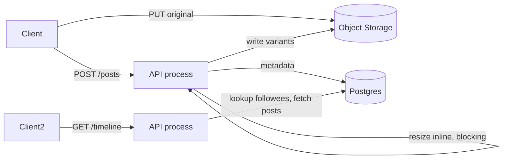
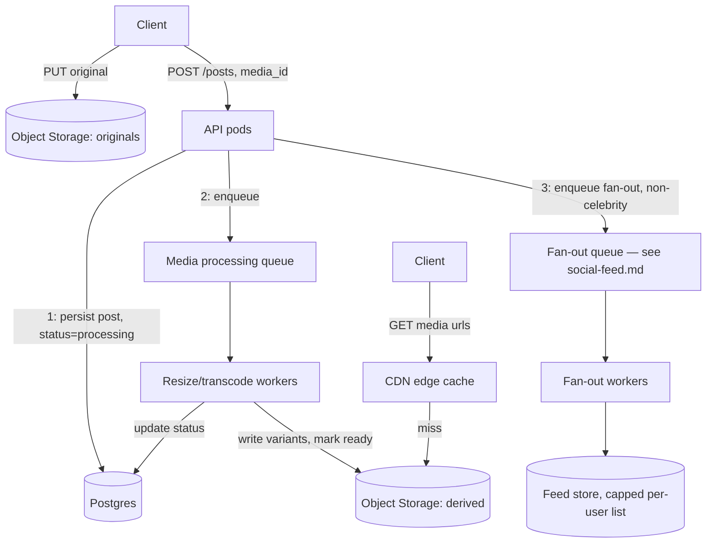
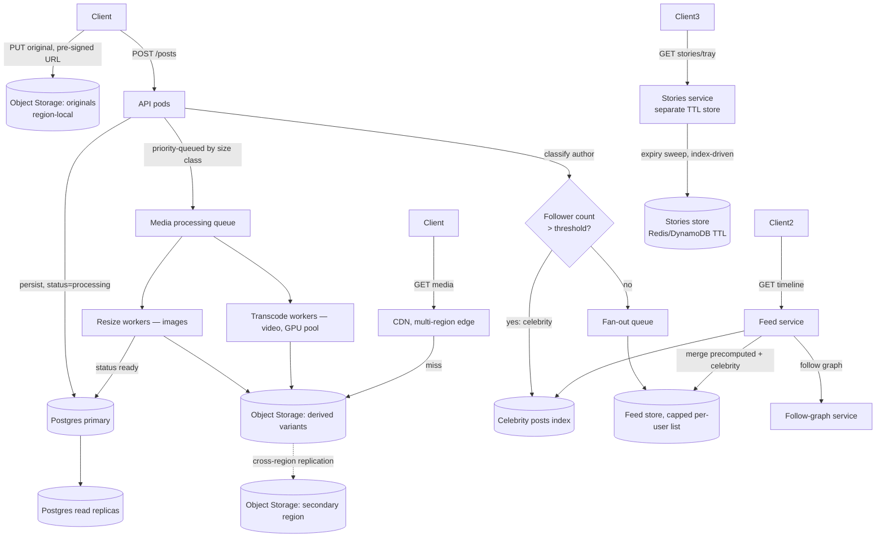

# Design: Instagram

**Difficulty:** Senior/Staff | **Time:** 60–75 minutes

!!! note "Instructions"
    Cover each section and work it yourself first. Before every "Version N" reveal there is a `???` box — commit to an answer before you open it. This exercise shares its fan-out mechanics with the [Social Feed](social-feed.md) exercise; don't re-derive those here — the value of *this* exercise is the media pipeline.

---

## 1. Problem Statement

Design a photo/video-sharing service like Instagram: a user uploads a photo or short video, it gets processed into multiple display sizes, and appears in their followers' feeds. Users can also post an ephemeral **story** that disappears after 24 hours. Anyone with access can view a profile's grid of past posts.

This looks like the Social Feed exercise. It is not, underneath. The follow graph, the celebrity fan-out problem, and the feed precompute/merge trade-off are **identical** — see [Social Feed](social-feed.md) for that mechanism; apply it here rather than re-deriving it. What's actually different: the payload is now a multi-megabyte image or video instead of 280 bytes of text, which means you now own **media storage and CDN delivery**, **aspect-ratio-aware thumbnail/transcode generation** (a photo isn't "done" until 4–5 derived resolutions exist), and **stories**, which introduce a TTL-based, self-expiring content type that a feed of permanent posts never has to handle.

---

## 2. Clarifying Questions

??? question "What questions should you ask?"
    - **Media types:** Photos only, or video too? What's the max video length (Reels-style short clips vs longer uploads)?
    - **Processing SLA:** Must all derived resolutions exist before the post is visible to anyone, or can the original show first while thumbnails generate async?
    - **Stories vs feed posts:** Confirm the TTL (24h is the product default) — is early deletion by the user allowed? Can a story be replied to/screenshotted?
    - **Aspect ratio / cropping:** Does the platform enforce a fixed feed aspect ratio (square, 4:5) or allow arbitrary ratios like the original app didn't at first?
    - **Read pattern:** How much of traffic is home feed vs profile grid vs a single post via direct link (shared outside the app)?
    - **Follow graph shape:** Same long-tail celebrity distribution as any social graph — confirm before assuming.
    - **Scale:** DAU, uploads/day, average media size, read:write ratio, peak-to-average multiplier?
    - **Multi-region and residency:** Where does media get stored, and does any jurisdiction require in-region storage?

---

## 3. Functional Requirements

- Upload a photo or short video, attach a caption, publish to followers
- Post a story (photo/video) that auto-expires after 24 hours
- View a home feed of posts from followees, and a profile grid of a user's past posts
- View stories from followees (as a ring/tray, separate from the feed)
- Follow / unfollow (reuse the graph mechanics from [Social Feed](social-feed.md))
- Serve each image/video at the resolution appropriate to the requesting device

Out of scope for V1: ranking model internals, comments/likes fan-out, Reels-style algorithmic discovery feed, DMs.

## 4. Non-Functional Requirements

| Property | Requirement | Reasoning |
|----------|-------------|-----------|
| Upload-to-visible latency | < 5s p99 for the original to appear; derived resolutions best-effort within 30s | Poster shouldn't wait on transcoding, but a blurry post for too long feels broken |
| Feed/media read latency | < 200ms p99 for feed metadata; media itself served by CDN, not the app tier | Feed load must feel instant even though images are heavy |
| Story availability | Expired story returns 404/410 within seconds of TTL, not "eventually" | Ephemerality is a product promise, not a suggestion |
| Availability | 99.95% read path (feed + media) | Feed and media are the product |
| Durability | Original upload never lost once ack'd, even if derived resolutions fail | Re-deriving thumbnails is cheap; re-uploading a lost original is not |
| Scale | 50M DAU, storage/bandwidth-bound (see estimation) | Media bytes dominate, not request count |

!!! tip "Interview Insight 🎯"
    In a text feed, the dominant cost is *requests*. Here, the dominant cost is **media bytes** — storage and CDN egress. A single photo upload can cost more in storage+bandwidth than 10,000 tweet-equivalent posts combined. Say this out loud before sizing anything; it's the number that pulls this architecture away from Social Feed's.

---

## 5. Capacity Estimation

```
50M DAU (smaller than the 300M-DAU Social Feed exercise — deliberately, so the
media math stays tractable in an interview; the fan-out shape scales the same way)

Uploads:
  50M DAU × 5% post/day ≈ 2.5M posts/day ≈ 29 posts/s average, ~10x peak ≈ 290/s
  Stories: 50M DAU × 15% post a story/day ≈ 7.5M stories/day ≈ 87/s average

Media size per upload (photo path):
  Original: ~3 MB (post-client-side-compression)
  Derived resolutions per photo: thumbnail (150x150, ~15KB), feed (1080px, ~200KB),
    profile-grid (320px, ~40KB), full-view (2048px, ~800KB) → ~1.05MB derived + 3MB original
  ≈ 4 MB stored per photo across all resolutions

Storage:
  2.5M photos/day × 4 MB ≈ 10 TB/day ≈ 3.65 PB/year (photos alone)
  Stories: 7.5M/day × 4 MB × (24h retention, but keep 1 extra day as a soft-delete buffer)
    ≈ 30TB live at any time — orders of magnitude smaller than the permanent feed store,
    because it self-deletes; this is the one place TTL actively SAVES you storage budget
  Compare: Pastebin's exercise landed at 3.65 TB/year total. Photos alone are 1000x that.

Bandwidth (the number that matters most):
  Read:write ratio ≈ 20:1 (browsing >> posting)
  50M DAU × 20 feed scrolls/day × ~15 media items seen ≈ 15B media views/day
  Even at a CDN cache-hit rate of 95%, origin still serves 5% × 15B × ~200KB (feed-res)
    ≈ 150TB/day from origin if uncached — this is why CDN hit rate, not server count,
    is the single lever that determines whether this system is affordable.
```

!!! tip "Interview Insight 🎯"
    The one number that most changes this architecture versus a text-only feed is **media bytes**, not request count. 15B feed-media-views/day at even a few hundred KB each dwarfs any request-count-driven sizing. Every later decision — CDN, cache-hit rate, resolution selection — traces back to this line, not to posts/second.

---

## 6. API Design

```
POST /v1/media/upload-url
  { media_type: "photo"|"video" }
  → { upload_url, media_id }        # pre-signed direct-to-object-storage PUT, bypasses app servers

POST /v1/posts
  { media_id, caption }
  → { post_id, created_at }         # only after client confirms the upload_url PUT succeeded

POST /v1/stories
  { media_id }
  → { story_id, expires_at }        # expires_at = created_at + 24h, set once, immutable

GET /v1/timeline/home?cursor=&limit=20
  → { posts: [{ post_id, author_id, caption, media: { thumb_url, feed_url, full_url }, created_at }] }

GET /v1/stories/tray                # followees with an unexpired story, ring order
  → { authors: [{ author_id, has_unseen, story_ids[] }] }

GET /v1/stories/{story_id}
  → 200 with media urls, or 404/410 if expired

GET /v1/users/{id}/posts?cursor=    # profile grid

POST /v1/follow/{user_id}           # same mechanics as Social Feed
DELETE /v1/follow/{user_id}

# Internal, not client-facing
POST /internal/media/process        # queue message: { media_id, media_type }
```

!!! note "Direct-to-storage upload"
    The client PUTs the original straight to object storage via a pre-signed URL — the app server never proxies megabytes of image bytes through itself. This is the media equivalent of Pastebin's blob-key indirection, but here it applies to the *write* path too, not just reads.

---

## 7. Data Model — metadata, media blobs, and the follow graph

Same split as [Pastebin](pastebin.md) (small hot metadata vs. large cold blobs), extended with **multiple derived resolutions per upload** and the **follow graph** needed for fan-out.

```sql
-- Post metadata: small, hot, indexed. Points at media, doesn't contain it.
CREATE TABLE posts (
    post_id       UUID PRIMARY KEY,
    author_id     UUID NOT NULL,
    media_id      UUID NOT NULL,
    caption       VARCHAR(2200),
    created_at    TIMESTAMPTZ NOT NULL,
    INDEX idx_author (author_id, created_at DESC)
);

-- One row per upload; one row per DERIVED RESOLUTION, not one blob_key per post.
CREATE TABLE media_assets (
    media_id      UUID NOT NULL,
    variant       VARCHAR(16) NOT NULL,   -- original | thumb_150 | feed_1080 | full_2048
    blob_key      VARCHAR(160) NOT NULL,  -- pointer into object storage
    width         INT NOT NULL,
    height        INT NOT NULL,
    format        VARCHAR(8) NOT NULL,    -- jpeg | webp | mp4 | hls_manifest
    status        VARCHAR(16) NOT NULL,   -- pending | ready | failed
    PRIMARY KEY (media_id, variant)
);

-- Stories: separate table, not a row-flag on posts, because the access pattern
-- (TTL-scan, ring-tray query "unexpired stories from my followees") is nothing
-- like the permanent-post query pattern.
CREATE TABLE stories (
    story_id      UUID PRIMARY KEY,
    author_id     UUID NOT NULL,
    media_id      UUID NOT NULL,
    created_at    TIMESTAMPTZ NOT NULL,
    expires_at    TIMESTAMPTZ NOT NULL,
    INDEX idx_author_expiry (author_id, expires_at),
    INDEX idx_expiry (expires_at)          -- sweeper, same pattern as Pastebin's TTL index
);

-- Follow graph: identical shape and reasoning to Social Feed's `follows` table.
-- See social-feed.md Section 7 for why it's sharded by user_id, not by post.
CREATE TABLE follows (
    follower_id   UUID NOT NULL,
    followee_id   UUID NOT NULL,
    created_at    TIMESTAMPTZ NOT NULL,
    PRIMARY KEY (follower_id, followee_id)
);
```

```
Blobs live in object storage, one key per (media_id, variant):
  s3://media-bucket/{media_id[:2]}/{media_id}/{variant}.{ext}
```

??? question "Why is a resolution a separate row instead of one JSON column of URLs on the post?"
    Because each variant has its own **lifecycle**: it's generated independently by a processing pipeline, can fail and retry independently, and needs its own `status`. A `feed_1080` variant failing shouldn't block the post from existing — the client falls back to the original or a lower-res variant while the missing one is regenerated. A single JSON blob column can't represent "3 of 4 variants ready" cleanly enough to drive that fallback logic.

---

## 8. Version 1 — simplest thing that works

Single API tier, Postgres for metadata, object storage for media, **synchronous** resize on upload. No CDN, no fan-out yet — feed reads query the follow graph directly, same starting point as [Social Feed's V1](social-feed.md#8-version-1-the-simplest-thing-that-works).



```python
def create_post(author_id: str, media_id: str, caption: str) -> str:
    original = s3.get_object(Bucket="media", Key=f"{media_id}/original")["Body"].read()
    for variant, (w, h) in VARIANT_SPECS.items():           # thumb_150, feed_1080, full_2048
        resized = resize_preserving_aspect(original, w, h)  # blocks the request thread
        s3.put_object(Bucket="media", Key=f"{media_id}/{variant}", Body=resized)
        db.execute("INSERT INTO media_assets (media_id, variant, blob_key, status) VALUES (%s,%s,%s,'ready')",
                   media_id, variant, f"{media_id}/{variant}")
    post_id = generate_id()
    db.execute("INSERT INTO posts (post_id, author_id, media_id, caption, created_at) VALUES (%s,%s,%s,%s,now())",
               post_id, author_id, media_id, caption)
    return post_id
```

This works for a demo. **Do not add infrastructure yet — find the bottleneck first.**

---

## 9. Identify the bottleneck

???+ question "At 290 posts/s peak, where does V1 actually break, and what doesn't matter yet?"
    - **Upload latency:** resizing 4 variants of a 3MB photo synchronously, in the request path, is 500ms–2s of CPU-bound work *before* the client gets an ack. At 290/s peak that's hundreds of concurrent resize jobs competing with API request-handling threads on the same boxes — the API tier becomes a thumbnailing farm that occasionally also serves HTTP.
    - **Video makes this categorically worse:** transcoding a short video isn't "resize a JPEG," it's minutes of CPU/GPU work. Doing that synchronously in an HTTP request handler is a non-starter, not just slow.
    - **No CDN:** every feed read fetches media straight from the app's origin bucket. At 15B media views/day this is enormous, repeated, cacheable-but-uncached bandwidth — this is the single biggest problem V1 has, bigger than the DB.
    - **What's NOT the bottleneck yet:** the `posts`/`follows` metadata tables are tiny rows and handle this write rate fine — same conclusion as Pastebin's V1. The problem is entirely in the *media path*, not the metadata path.
    - **Not yet relevant:** celebrity fan-out — V1 doesn't even have fan-out (it's fan-out-on-read, same starting point as Social Feed). That bottleneck is real but arrives in Version 2/3, layered on top of the media fixes.

---

## 10. Version 2 — async processing pipeline + CDN + hybrid fan-out

Three independent fixes, each justified by a specific number from Section 9: move resize/transcode off the request path, put a CDN in front of media reads, and apply the [hybrid fan-out](social-feed.md#11-version-3-hybrid-fan-out-production-grade) strategy from Social Feed for the follow-graph problem (unchanged mechanism, just applied here).



```python
def create_post(author_id: str, media_id: str, caption: str) -> str:
    post_id = generate_id()
    db.execute("INSERT INTO posts (...) VALUES (...)", post_id, author_id, media_id, caption)
    queue.enqueue("media.process", {"media_id": media_id, "variants": VARIANT_SPECS})
    if not is_celebrity(author_id):          # threshold policy identical to social-feed.md Section 11
        queue.enqueue("fanout", {"post_id": post_id, "author_id": author_id})
    return post_id                            # ack immediately — processing and fan-out are async

def process_media(media_id: str, variants: dict):
    original = s3.get_object(Bucket="media-originals", Key=f"{media_id}/original")["Body"].read()
    src_w, src_h = probe_dimensions(original)
    for variant, target in variants.items():
        box = fit_preserving_aspect(src_w, src_h, target)   # never stretch/distort
        s3.put_object(Bucket="media-derived", Key=f"{media_id}/{variant}", Body=resize(original, box))
        db.execute("UPDATE media_assets SET status='ready' WHERE media_id=%s AND variant=%s", media_id, variant)
```

!!! warning "Production Trap ⚠️"
    Cropping every upload to a fixed aspect ratio server-side (instead of fitting-with-letterbox or respecting the original ratio) silently destroys content the user framed intentionally. Compute the target box from the *source* aspect ratio; don't assume square.

**Client-side resolution selection:** the API returns all ready variant URLs; the client picks based on its viewport/density, same pattern as responsive `srcset`. If `feed_1080` isn't ready yet, fall back to `thumb_150` (usually ready first, since it's the cheapest resize) rather than blocking the post from appearing.

---

## 11. Identify the next bottleneck

???+ question "Processing pipeline and CDN are in place. What breaks next, and at what scale?"
    - **Thumbnail generation latency under burst:** a viral moment (many users posting during a live event) spikes the processing queue; feed_1080 variants lag behind, and posts sit in a visually-degraded state (thumbnail only) for longer than the 30s target.
    - **Celebrity fan-out storm:** identical shape to Social Feed's problem — a 20M-follower account posting means 20M feed-list writes if fanned out naively. The fix is the same hybrid threshold split; it's not re-derived here because nothing about media changes that mechanism.
    - **Stories expiry consistency:** a story readable a few minutes past its `expires_at` because the TTL sweeper lagged is a *trust* violation the same way Pastebin's burn-after-read was — but stories add a wrinkle Pastebin's `DELETE ... RETURNING` pattern didn't have: the story needs to disappear from the **tray/ring aggregate view** (a cached "does this author have any live story" flag) as well as from direct fetch, and those two can drift independently.
    - **CDN origin failure:** if the derived-media bucket's region has an outage, cache hits still serve stale-fine (immutable content) but every cache *miss* now 5xxs — at 5% miss rate on 15B views/day that's 750M failed loads/day, not a rounding error.

---

## 12. Version 3 — production architecture



Key production decisions, each tied to a Section 11 number:

- **Priority-queued processing by size class.** Thumbnails (cheap, needed first) and full transcodes (expensive, GPU-bound) get separate queues so a burst of video uploads doesn't starve every photo's thumbnail behind it — same "don't let big jobs block small ones" lesson as Social Feed's celebrity fan-out queue isolation.
- **Stories get their own store, not a TTL column on `posts`.** A Redis/DynamoDB store with native per-key TTL (not an app-level sweeper) means expiry is enforced at the storage layer itself — no lag window where a background job hasn't caught up yet. The tray/ring aggregate is a small derived cache (`has_live_story:{author_id}`) invalidated on the same TTL, kept in sync by using the storage engine's expiry as the single source of truth rather than two independent timers.
- **CDN with cross-region-replicated origin.** Cuts the 750M-failed-loads/day origin-outage exposure from Section 11 by giving the CDN a same-region fallback origin, not just a single origin bucket.
- **Fan-out and feed merge:** unchanged from [Social Feed V3](social-feed.md#11-version-3-hybrid-fan-out-production-grade) — apply that mechanism directly against this post store.

---

## 13. Failure analysis

=== "Media processing pipeline backs up"
    A burst of uploads (viral live event) queues faster than resize/transcode workers drain it; posts sit thumbnail-only past the 30s target.
    **Mitigation:** priority lanes (Section 12) so photo thumbnails never wait behind video transcodes; autoscale workers on queue depth; serve the *original* directly (unoptimized but correct) if no derived variant is ready yet, rather than showing nothing.
    **User-visible:** slightly blurrier feed images for a few minutes — acceptable degradation, not an outage.

=== "CDN origin (derived-media bucket) failure"
    Cache hits are unaffected (content is immutable, TTL can be long); cache misses now fail outright.
    **Mitigation:** cross-region replicated origin (Section 12) so the CDN has a same-region fallback; serve the *original* bucket as a last-resort fallback for a missing derived variant rather than a broken image.
    **Prevention:** alert on CDN origin error rate, not just origin latency — a fast 5xx looks healthy on a latency dashboard.

=== "Celebrity account fan-out storm"
    Same failure mode and mitigation as [Social Feed's fan-out queue backup](social-feed.md#13-failure-analysis) — separate queues by author-size class, celebrities skip fan-out-on-write entirely. Not re-derived here.

=== "Stories expiry consistency"
    The TTL-native store expires a story, but the tray aggregate (`has_live_story:{author_id}`) was cached with its own short TTL and hasn't invalidated yet — a follower's tray shows a ring for a story that 404s on tap.
    **Mitigation:** cap the tray-aggregate cache TTL well below the story TTL granularity (seconds, not minutes) so drift is bounded and short; on a 404 from a tapped story, the client should treat it as "already expired" and refresh the tray rather than showing an error.
    **Correctness line:** the *content* must never be servable past `expires_at` (enforced by the store's native TTL, non-negotiable); the *tray indicator* being briefly stale is cosmetic, not a trust violation, and can tolerate a short lag.

---

## 14. Consistency considerations

- **Post metadata durability is the line**, same as Social Feed: once a post is acked, it must never be lost even if variant processing fails — variants are regenerable from the original, the original is not regenerable from anything.
- **Read-your-own-writes for the author:** the author sees their own post (even thumbnail-only, mid-processing) immediately; don't make them wait for full resolution to confirm the post exists.
- **Feed visibility is eventually consistent**, identical reasoning to [Social Feed's consistency section](social-feed.md#14-consistency) — a follower may not see a post for a bounded fan-out window.
- **Story expiry must be strongly consistent on content, eventually consistent on the tray indicator** — this is the one place this design's consistency requirement is *stricter* than a permanent post's, because "still visible after the promised expiry" is a broken product promise, not just staleness.

---

## 15. Observability

```
Metrics:
  upload_ack_latency_ms                         p50/p99 (should be near-instant post-Section-10)
  media_processing_lag_s{variant, media_type}    time from upload → variant ready
  media_processing_queue_depth{class=photo|video}
  cdn_cache_hit_rate                             (the single most cost-sensitive number in this system)
  cdn_origin_error_rate
  story_tray_indicator_drift_s
  fanout_job_lag_s{author_size_class}            (reuse from social-feed.md)

Alerts:
  media_processing_lag_s p99 > 30s for photos, > 5min for video
  cdn_cache_hit_rate < 90%                       (bandwidth cost inflection point)
  cdn_origin_error_rate > 1%
  story served past expires_at (correctness alarm, should be structurally impossible — page immediately if seen)
```

---

## 16. Cost analysis

```
Object storage — originals (3.65 PB/year @ Standard, moving cold to IA after 90d): ~$45,000/month before lifecycle tiering
Object storage — derived variants (~1PB/year, high-access, keep in Standard):        ~$23,000/month
CDN egress (15B media views/day, ~95% cache hit → 5% × ~200KB origin fallback,
  ~750TB/month from origin; CDN edge delivery billed separately, dominant line):     ~$60,000–90,000/month (CDN delivery is the single biggest line item)
Processing compute (resize fleet + GPU transcode pool):                              ~$15,000/month
Stories store (TTL-native KV, ~30TB live working set, high churn):                   ~$4,000/month
Postgres (metadata only, small rows, same shape as Pastebin's):                      ~$1,500/month primary + replicas
Total (rough order of magnitude):                                                    ~$150,000–180,000/month
```

!!! tip "Interview Insight 🎯"
    Compare this to Pastebin's ~$635/month total. The gap isn't architecture sophistication — it's that **storage and CDN egress dominate** here in a way request-count-driven systems never see. The single biggest cost lever is CDN cache-hit rate: moving it from 90% to 98% cuts origin egress by 5x, which is a bigger win than any amount of server consolidation.

---

## 17. Alternative architectures

=== "Store everything in one blob per post (no per-variant rows)"
    Simplest metadata model — one blob_key, resize on read with an image-resizing CDN (e.g. on-the-fly transform at the edge) instead of pre-generating variants. Removes the processing pipeline entirely, shifts cost to per-request edge transforms. Works well at moderate scale; at 15B views/day, paying a transform cost per cache-miss instead of once per upload can flip the cost comparison — model both before choosing.

=== "User-generated video via third-party transcoding service"
    Offload video transcoding to a managed service (e.g. a cloud provider's media pipeline) instead of running your own GPU worker pool. Removes an operationally hard subsystem; trades it for per-minute-of-video pricing that can dominate cost at high upload volume — same trade Pastebin made choosing S3 over self-hosted storage, one level up the stack.

=== "Stories as a feed-store row with a TTL column instead of a separate service"
    Simpler to build (one less system) but reintroduces the exact problem Section 12 avoided: app-level TTL enforcement (a sweeper) instead of storage-native expiry, reopening the "served past expiry" consistency risk. Only reasonable at very small scale where a sweeper lag of seconds is genuinely tolerable.

---

## 18. Staff Engineer Extensions

=== "100× traffic"
    15B media views/day becomes 1.5T/day. CDN cache-hit rate stops being an optimization and becomes existential — even 1% miss rate is now origin-serving billions of requests/day. Push toward regional origin shields (a mid-tier cache between edge and origin bucket) so a cold object is fetched from origin once per region, not once per edge PoP. Processing pipeline needs the same author-size-class queue isolation as fan-out, now non-negotiable rather than a nice-to-have.

=== "Multi-region"
    Media originals write to the uploader's home region (lowest-latency upload path); derived variants replicate to all regions the CDN serves from asynchronously — immutable content makes this safe, same reasoning as Pastebin's cross-region blob replication. Stories, being short-lived, may not be worth replicating beyond the uploader's region and one CDN-adjacent cache tier — the replication lag budget for a 24-hour-lived object is much tighter than for a permanent post.

=== "Data residency / GDPR"
    A user's media (their photos, their stories) is personal data — home the *original* in-region per residency rules, same as Pastebin's EU-bucket routing. The harder case unique to this system: derived variants generated from that original also count as the user's data, and a naive "replicate all derived variants globally for CDN performance" policy conflicts with residency the same way Social Feed's cross-region replication does for follow-graph edges. Tag at upload, exclude residency-tagged originals *and* their variants from cross-region replication, and accept that a residency-tagged user's content may have a higher cache-miss rate for out-of-region viewers as the trade-off.

=== "Zero-downtime migration to a new media pipeline"
    1. Dual-process new uploads through old and new pipelines, serve from the old one. 2. Backfill derived variants for existing media in the background, rate-limited so it doesn't compete with live processing. 3. Verify variant checksums/dimensions match between pipelines for a sample. 4. Flip variant URLs to the new pipeline's output behind a flag, monitor client-side image-load error rate (not just server metrics — a subtly wrong crop is a client-visible bug, not a 5xx). 5. Decommission the old pipeline once flagged at 100% for a full processing-lag SLA window.

---

## 19. Interview follow-ups

1. **"How is this different from the Social Feed / Twitter-X exercise?"** — The follow graph, fan-out mechanics, and celebrity problem are identical; say so explicitly rather than re-deriving them. What's new is entirely in the media dimension: storage/CDN cost at a completely different order of magnitude, aspect-ratio-aware multi-resolution processing, and stories' storage-native TTL semantics. An interviewer listening for pattern-matching wants to hear you name which parts transfer and which don't.
2. **"Why not resize synchronously and just scale out more API servers?"** — CPU-bound resize/transcode work competing with request-handling threads on the same fleet means you're scaling the wrong resource; separating processing into its own worker pool lets you scale image-CPU and API-request-handling independently, and lets video (minutes of work) not block photos (milliseconds) in the same queue.
3. **"How would you support a permanent 'close friends' story audience, or story replies?"** — Both need per-viewer authorization at read time (same pattern as Social Feed's private-account filtering) rather than a public unauthenticated fetch; replies additionally need a lightweight messaging path outside this system's scope, similar to how comments/likes are called out as out-of-scope here.
4. **"What if a story needs to be pinned past 24 hours (e.g. Highlights)?"** — This breaks the "stories are ephemeral, TTL-native store" assumption cleanly: a Highlight is really a *copy* into the permanent post-like store (or a flag that cancels the TTL and migrates the row), not an extension of the existing TTL. Treating it as "just don't expire this one" inside the TTL store reintroduces exactly the sweeper/consistency complexity the TTL-native design was chosen to avoid.

---

## Self-Assessment

- [ ] I can state explicitly which parts of this design are identical to Social Feed and which are genuinely new
- [ ] I can justify why derived resolutions are separate rows instead of a JSON column, using the partial-failure argument
- [ ] I can explain why stories need a TTL-native store instead of an app-level sweeper, and where the "correctness vs cosmetic" line falls
- [ ] I can name CDN cache-hit rate as the single biggest cost lever and explain why, with the 5%-miss-rate origin-load number
- [ ] I can walk through why synchronous resize breaks first, before fan-out or the follow graph ever become the bottleneck
