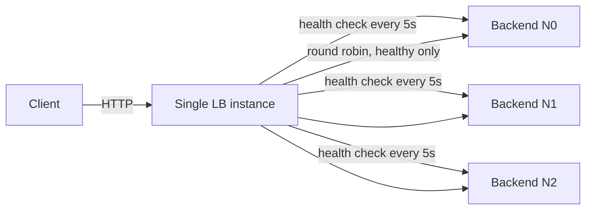
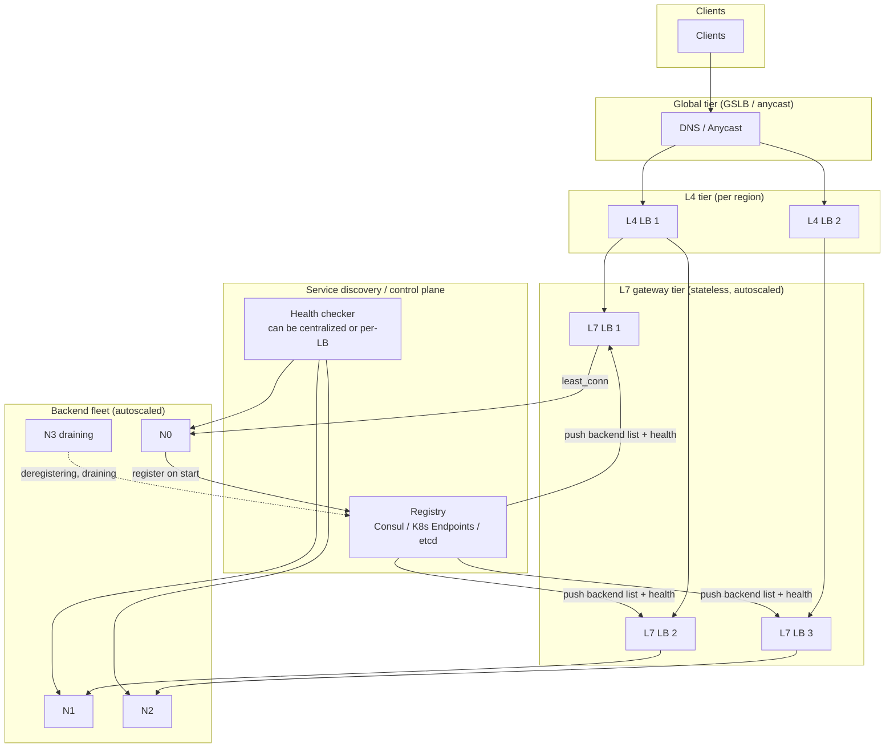

# Design: Load Balancer

**Difficulty:** Foundation | **Time:** 45–60 minutes

!!! note "Instructions"
    **Cover the solution sections** and work through each step yourself first. This exercise is the *systems design* companion to the [Load Balancing](../networking/load-balancing.md) concept page — that page teaches the algorithms and failure modes; this page asks you to build the service that runs them at scale.

---

## 1. Problem Statement

Design a load balancer service that sits in front of a fleet of backend servers and distributes incoming traffic across them. It must pick a healthy backend per request/connection, detect and remove dead backends without dropping in-flight work, and let operators add or remove capacity without a config-and-restart cycle. Assume this is a product you build and run — not a vendor black box — because an interviewer will ask what happens inside it.

---

## 2. Clarifying Questions

Practice asking these before designing:

??? question "What questions should you ask?"
    - **Protocol:** TCP/UDP passthrough (L4) or HTTP/gRPC-aware routing (L7)?
    - **Scope:** One region, or global with multiple points of presence?
    - **Backend churn:** Static fleet or autoscaling, with nodes added/removed every few minutes?
    - **Statefulness:** Do backends hold session state, or is everything externalized (Redis, DB)?
    - **Traffic shape:** Short request/response, or long-lived connections (WebSocket, gRPC streams)?
    - **Deploys:** How often do backends roll, and can we tolerate connection resets during rollout?
    - **Failure budget:** Is a brief 502 spike acceptable during a node death, or must it be masked entirely?
    - **Who owns health definitions?** Just TCP reachability, or a deep dependency check?

---

## 3. Functional Requirements

- Distribute incoming requests/connections across a pool of healthy backends
- Support multiple algorithms: round robin, weighted round robin, least connections, least latency, consistent hashing
- Detect unhealthy backends and remove them from rotation
- Detect recovered backends and add them back
- Support adding/removing backends dynamically (no restart)
- Drain connections from a backend being taken out of service (deploys, scale-down) without dropping in-flight requests

## 4. Non-Functional Requirements

| Property | Requirement |
|----------|-------------|
| Added latency | < 1ms p99 for L4, < 5ms p99 for L7 (TLS + parse included) |
| Availability | 99.99% — the LB is a single point of failure for everything behind it if not itself made redundant |
| Detection time | Dead backend removed from rotation within 10–15s of failure |
| Scale | 200K concurrent connections, 100K requests/second per LB tier |
| Config propagation | New/dead backend known to *every* LB instance within 5s |

!!! tip "Interview Insight 🎯"
    A load balancer is not a load-shedding config file — it is a **small distributed system**: multiple LB instances that must converge on the same view of "who is alive" without a single point of failure. Interviewers are listening for whether you notice the LB tier itself needs the same health-checking and redundancy thinking you're about to apply to the backends.

---

## 5. Capacity Estimation

```
Traffic:
  100K requests/second sustained, 10x burst → 1M rps peak
  Avg connection duration: 200ms (HTTP), some WebSocket at minutes

Connections:
  100K rps x 200ms avg duration ≈ 20,000 concurrent connections (Little's Law)
  Peak: 200,000 concurrent connections

LB instance capacity:
  L4 (Maglev/IPVS-style): ~1-2M packets/sec per core, connection-table bound
  L7 (Envoy/nginx-style): ~20-50K rps per core (TLS termination + HTTP parsing)
  100K rps / 30K rps-per-core ≈ 4 cores minimum, provision 3x for headroom = 12 cores

Backend pool:
  Assume 50 backend instances, each handling ~2K rps
  Health check interval: 5s, 3 backends probed per LB per tick
  50 backends x 1 LB instance x (1 probe / 5s) = 10 probes/sec per LB — trivial

Config propagation:
  Backend registry: 50-500 entries x 200 bytes ≈ 100KB, fits in memory on every LB
  Push to N LB instances on every membership change: N x 100KB, sub-second on a control plane
```

!!! tip "Interview Insight 🎯"
    The interesting number here isn't rps — it's **concurrent connections** (Little's Law: rps × duration). WebSocket and long-poll traffic can make concurrency the binding constraint even when request rate looks modest. Size connection tables, not just CPU.

---

## 6. API Design

The load balancer's "API" is mostly the data plane (proxying), plus a small control plane for operators and orchestration to register backends.

```
# Data plane — this is what clients actually call
ANY  https://api.shop.com/*        → proxied to a backend per algorithm + health

# Control plane (internal, authenticated)
POST /internal/backends
     { "id": "n42", "address": "10.0.4.12:8080", "weight": 100, "zone": "us-east-1a" }
     → 201 Created

DELETE /internal/backends/{id}
     → 202 Accepted (initiates connection drain, not immediate removal)

PUT /internal/backends/{id}/weight
     { "weight": 50 }

GET /internal/backends
     Response: [{ "id": "n42", "state": "healthy|draining|dead", "active_conns": 12, ... }]

PUT /internal/pool/algorithm
     { "algorithm": "least_conn" }
```

!!! note "Registration is not health"
    A backend `POST`ing itself into the registry only means "I exist." It still needs to pass active health checks before receiving traffic — otherwise a crash-looping pod during deploy gets full weight on registration.

---

## 7. Algorithm Choice and Trade-offs

The concept page ([Load Balancing](../networking/load-balancing.md#algorithms)) covers mechanics; here's how to *choose* one for this exercise.

=== "Round robin"
    Cycle through healthy backends in order. Correct default when backends are homogeneous and request cost is uniform. Breaks when one box is structurally slower — it still receives 1/N of traffic and queues.

=== "Weighted round robin"
    Same as RR, but bigger/faster instances get proportionally more traffic (`weight: 200` gets 2x the requests of `weight: 100`). Use during canary rollout (start a new version at weight 1, ramp up) and for heterogeneous instance types.

=== "Least connections"
    Route to whichever healthy backend has the fewest active connections. Self-correcting under uneven request cost — a backend doing slow work naturally receives less new work. The trade-off: it needs the LB to track live connection counts per backend, which is stateful and must be kept consistent across LB instances (or accepted as *per-instance* approximate state).

=== "Least latency"
    Route by an EWMA of observed response time per backend. Best for geo-distributed or mixed-hardware pools. Risk: a backend serving a cheap cached path looks fast and gets flooded, starving a backend correctly doing more expensive work.

=== "Consistent hashing"
    `hash(key) mod ring` maps the same client/session key to the same backend, giving cache locality or sticky-without-cookies. On membership change, only `~1/N` of keys remap (vs. all of them under modular hashing). Use for cache fleets, gRPC streaming, or WebSocket affinity. Trade-off: uneven key distribution needs virtual nodes; a hot key still pins one backend.

**Recommended default:** least connections for a general HTTP fleet; consistent hashing when cache hit rate or session affinity matters more than perfect load evenness.

---

## 8. L4 vs L7 — Which Do You Build?

| | **L4** | **L7** |
|--|--------|--------|
| Operates on | TCP/UDP 5-tuple | HTTP/gRPC after TLS termination |
| CPU cost | Cheap — no parsing | Expensive — decrypt + parse + route |
| Routing granularity | Per connection | Per request (path, header, host) |
| Can add headers / retry | No | Yes (`X-Request-Id`, retry idempotent GETs) |
| Failure blast radius on death | Whole connection resets | Can often retry the request on a new backend |

**In this exercise:** build an L7 gateway tier for the public API (routing, health-aware retries, header injection) sitting behind an L4 tier (cheap, high-PPS, absorbs volumetric load and TLS-agnostic traffic) — this two-tier pattern is what most large-scale deployments actually run, not a single layer doing everything.

**Global vs regional:**

- **Regional LB** — one VIP per region. Cheap, low RTT, simple. A full regional outage takes the VIP with it.
- **Global (GSLB / anycast)** — DNS-based (`api.shop.com` resolves to the nearest healthy region's IP, TTL-bounded failover of seconds-to-minutes) or anycast (same IP announced from multiple POPs, BGP converges faster but you now debug routing instead of HTTP). Use GSLB for multi-region DR; anycast when failover speed matters more than operational simplicity.

---

## 9. Health Checking — How a Dead Node Leaves the Pool

This is the load balancer's entire control plane for "who is alive," and it's the part interviewers probe hardest.

**Active vs passive:**

- **Active:** LB independently probes each backend (`GET /healthz`, TCP connect, gRPC health check) on an interval, independent of real traffic. Detects dead nodes even with zero traffic to them. Detection lag = `interval × consecutive_failure_threshold` (e.g. 5s × 3 = 15s of possible bad routing).
- **Passive:** LB observes real request outcomes — connection resets, timeouts, 5xx — and ejects a backend after N failures in a window (outlier ejection). Faster than active probing (reacts on the very next real request) but requires traffic to already be flowing to that backend, and a backend that returns fast 200s with garbage bodies looks healthy.

**Removing a node without dropping in-flight requests:**

1. Health check fails 3 consecutive times → backend marked `unhealthy`, removed from the *selection* pool immediately.
2. Requests **already in flight** to that backend are not migrated — the LB cannot move an established TCP connection. They fail (timeout/reset) and, if idempotent, get retried against a different healthy backend by the L7 tier.
3. New requests never route to the unhealthy backend once it's out of rotation — that's the win. The gap is only the detection window (step 1), during which some fraction of new requests still land there.

```
Timeline, 3 backends, N0 crashes at t=0:
t=0        N0 process dies. In-flight requests to N0: reset/timeout.
t=0-15s    LB still considers N0 healthy (probes haven't failed 3x yet).
           ~1/3 of NEW requests route to N0 and fail.
t=15s      3rd consecutive probe failure -> N0 marked dead, pulled from pool.
t=15s+     100% of new traffic goes to N1, N2. Capacity -33% until scale-out.
```

!!! tip "Interview Insight 🎯"
    Push for **readiness vs liveness as separate signals** if backends run in an orchestrator: readiness fails immediately at SIGTERM (removes from LB *before* the process is actually gone), while liveness/health probes catch unannounced crashes. Conflating them means a graceful shutdown looks identical to a kernel panic.

---

## 10. Basic Architecture (V1)



One LB process, in-memory backend list, active health checks on a timer, round robin over the healthy subset. Good enough to demonstrate the core loop — but the LB itself is now a single point of failure, and every backend add/remove requires touching that one process's memory.

---

## 11. Identify Bottlenecks

???+ question "Where does V1 break as the fleet grows?"
    - **Single LB instance is a SPOF.** It dies, everything behind it is unreachable — even though every backend is healthy.
    - **Single LB instance is a throughput ceiling.** One box tops out around tens of thousands of rps for L7; you need many LB instances, not one bigger one, past a point.
    - **In-memory backend list doesn't survive a restart** and isn't shared — a second LB instance has no way to learn what the first one knows about backend health.
    - **No connection draining.** Killing a backend for a deploy just severs its connections; no grace period for in-flight requests to finish.
    - **Config propagation is undefined.** If you add a second LB instance, how does *it* learn about a new backend, or that N0 just died? This becomes its own small distributed-systems problem (see next section).

---

## 12. Scaled Architecture (V2)



Key additions over V1: the LB tier itself is now a horizontally scaled, stateless fleet behind an L4 layer (so the LB isn't a SPOF); a shared **service discovery / control plane** is the single source of truth for backend membership and health, pushed to every LB instance instead of each LB independently guessing.

---

## 13. Config Propagation — the LB's Own Distributed Systems Problem

Every LB instance needs the *same* view of "which backends exist and are healthy" — this is a small consensus/propagation problem in its own right, and it's easy to hand-wave past in an interview.

=== "Push model (control plane broadcasts)"
    A central registry (Consul, etcd, K8s API server) holds backend state. On any change, it pushes updates to every LB instance (via gRPC streaming, xDS in Envoy's case, or long-poll). Fast (sub-second) convergence, but the registry itself needs to be highly available, and LB instances need a reconnect/resync path after a network blip.

=== "Pull model (LB polls)"
    Each LB instance polls the registry every N seconds and diffs. Simpler, more resilient to registry blips (worst case: stale by one poll interval), but propagation lag = poll interval, and N LB instances hammering the registry on the same schedule creates thundering-herd load — stagger polls or use long-polling.

=== "Gossip (peer-to-peer)"
    LB instances exchange health state directly with each other (SWIM-style), no central registry required. Removes the registry SPOF entirely, but convergence time grows with cluster size and you now own a harder correctness problem (eventual consistency, partition handling) than most teams need at this scale.

**Recommended:** push model via a registry with a streaming API (xDS-style) — this is what Envoy, and most production service meshes, actually do. Give every LB instance a **local health check** as a second signal even when using centralized discovery — don't route to a backend the registry says is "up" if this LB's own probes disagree; treat centralized state as *advisory*, local observation as *authoritative* for the final decision.

!!! tip "Interview Insight 🎯"
    A common failure: LB instance A restarts, reconnects to the registry, and briefly has an **empty** backend list before the initial sync completes — during that window it 503s everything instead of failing safely. Design explicit "not yet synced" vs "synced, zero healthy backends" states so a cold-start LB doesn't masquerade as a real outage.

---

## 14. Connection Draining During Deploys

Taking a backend out of rotation for a planned reason (deploy, scale-down) should never look like a crash to the client.

```
Drain sequence for backend N3:
1. Orchestrator sends SIGTERM to N3 (or control plane marks it "draining")
2. N3 (or the LB, depending on design) immediately fails readiness
   -> LB stops routing NEW requests/connections to N3 within one health-check tick
3. N3's IN-FLIGHT requests continue to completion (grace period, e.g. 30-60s)
4. LB removes N3 from its active set entirely once grace period elapses
   or in-flight count hits zero, whichever comes first
5. N3 process exits
```

The two failure modes to avoid: (a) killing the process before step 2-3 complete, which resets in-flight connections exactly like an unplanned crash; (b) never timing out the drain, which means one stuck long-lived connection (WebSocket that never closes) blocks a deploy indefinitely — always cap the grace period and force-close after it.

<div class="sim-container">
  <div class="sim-title">Load Balancer Visualizer</div>
  <div class="sim-controls">
    <button class="sim-btn success" onclick="window._lb && window._lb.run()">Run</button>
    <button class="sim-btn" onclick="window._lb && window._lb.pause()">Pause</button>
    <button class="sim-btn" onclick="window._lb && window._lb.reset()">Reset</button>
    <button class="sim-btn" onclick="window._lb && window._lb.addNode()">Add node</button>
    <button class="sim-btn danger" onclick="window._lb && window._lb.removeNode()">Remove node</button>
    <button class="sim-btn danger" onclick="window._lb && window._lb.killNode(0)">Kill N0</button>
    <select id="lb-algo" onchange="window._lb && window._lb.setAlgo(this.value)">
      <option value="rr">Round robin</option>
      <option value="wrr">Weighted</option>
      <option value="lc">Least connections</option>
      <option value="ch">Consistent hash</option>
    </select>
  </div>
  <canvas id="lb-canvas" class="sim-canvas" style="width:100%;height:260px;"></canvas>
  <div class="sim-stats">
    <div class="sim-stat"><div class="sim-stat-label">Algo</div><div class="sim-stat-value" id="lb-algo-stat">rr</div></div>
    <div class="sim-stat"><div class="sim-stat-label">Nodes</div><div class="sim-stat-value" id="lb-nodes">3</div></div>
    <div class="sim-stat"><div class="sim-stat-label">Routed</div><div class="sim-stat-value" id="lb-routed">0</div></div>
  </div>
  <div class="sim-log" id="lb-log"></div>
</div>

**Try:** Run, then Kill N0 — watch new requests skip it while in-flight work to it just errors. Switch to consistent hash and add a node — only a slice of keys should move, unlike round robin which reshuffles everyone. Full mechanics of each algorithm are in the [Load Balancing](../networking/load-balancing.md) concept page.

---

## 15. Failure Modes

=== "LB tier instance dies"
    - One of N stateless L7 instances crashes. The L4 tier (or DNS/anycast) stops routing to it once its own health check fails.
    - **Impact:** Connections pinned to that instance reset; capacity drops by 1/N until replaced.
    - **Mitigation:** Autoscaled, stateless L7 fleet behind L4; N+1 headroom; fast instance replacement (seconds, not minutes).

=== "Service discovery / registry unavailable"
    - LB instances can no longer learn about new or dead backends.
    - **Impact:** Stale view of the fleet — new backends never receive traffic, dead ones keep receiving it until local health checks (if present) catch it independently.
    - **Mitigation:** Local active health checks as a fallback signal, not just registry-sourced state; cache last-known-good backend list with a TTL rather than going empty; alert on stale-sync duration.

=== "All backends fail health checks simultaneously"
    - E.g. a shared dependency (auth service, DB) goes down and a *deep* health check reflects that on every backend at once.
    - **Impact:** Fail-closed → LB has zero healthy targets → 503 for all users, even though the app processes themselves are fine. Fail-open → traffic to backends that will just fail downstream anyway.
    - **Mitigation:** Keep health checks shallow (process is alive and can accept connections) rather than deep (all dependencies healthy); use a separate synthetic canary for deep dependency health; panic threshold that keeps the last-known-good pool instead of going to zero.

=== "Sticky sessions pinned to a dead backend"
    - Consistent-hash or cookie affinity keeps routing a client to a backend that's now marked unhealthy.
    - **Impact:** Affected users see repeated failures even though 90% of the fleet is fine.
    - **Mitigation:** LB must explicitly exclude dead members from the hash ring / cookie target, not just "prefer" them; fall back to a different healthy backend and update affinity.

=== "Config propagation lag causes split-brain routing"
    - LB instance A has learned about new backend N5; LB instance B hasn't yet (propagation lag).
    - **Impact:** Uneven load — some LB instances route to N5, others don't — briefly, until convergence.
    - **Mitigation:** Bound propagation lag with an SLO (e.g. < 5s); monitor divergence between LB instances' backend-set views; this is usually a tolerable, self-healing transient, not worth architecting away entirely.

---

## 16. Consistency Considerations

- **Backend membership is AP, not CP.** Every LB instance briefly disagreeing about whether N5 exists yet is fine — routing a request to a backend that's 2 seconds stale-dead is a transient error, not data corruption.
- **Health state is inherently eventually consistent** across a distributed LB tier — there is no practical way to make every instance agree instantaneously without adding latency to every request. Design for convergence within a bounded window, not for immediate agreement.
- **Connection-count state for least-connections** is naturally per-instance unless you centralize it (expensive, adds a hop to every routing decision). Accept per-LB-instance approximate counts; it self-corrects because each instance is still internally consistent.

---

## 17. Observability

```
Key metrics:
- healthy_backend_count / total_backend_count (per LB instance and aggregate)
- lb_5xx_rate vs backend_5xx_rate (distinguish LB-originated from backend-originated errors)
- request_latency_p50/p95/p99 added by the LB hop
- config_propagation_lag (time from registry change to all LB instances converging)
- active_connections per backend (skew across the pool = algorithm working or not)
- drain_duration and in_flight_at_forced_close (deploy health)

Alerts:
- healthy_backend_count == 0 (page immediately)
- healthy_backend_count < N+1 headroom threshold
- lb_5xx_rate > 1%
- config_propagation_lag p99 > 10s
- any single backend receiving > 2x its expected share (algorithm or weight bug)
```

---

## 18. Cost Analysis

```
L7 gateway tier (12 vCPU total, autoscaled 3-10 instances): ~$600/month
L4 tier (managed NLB or self-run IPVS, 2 instances):         ~$300/month
Service discovery cluster (Consul/etcd, 3 nodes):            ~$300/month
Health check traffic (negligible bandwidth):                 ~$10/month
GSLB / DNS (Route 53 style, health-checked routing):         ~$50/month
Total:                                                        ~$1,260/month

Cost per million requests:
  Monthly request volume: 100K rps x 2.6M sec/month = 260 billion requests/month
  $1,260 / 260,000,000,000 requests ≈ $0.0000000048 per request (4.8 x 10^-9)
  ≈ $0.0048 per million requests
  Dominant cost is the L7 CPU tier (TLS termination) — using a managed
  cloud LB (ALB/NLB) trades this line item for a per-request/per-LCU fee,
  often cheaper below ~50K sustained rps, more expensive above it.
```

---

## 19. Alternative Architectures

=== "Managed cloud LB (ALB/NLB, Cloud Load Balancing)"
    Skip building the L4/L7 tiers yourself — use a managed service. Handles health checking, TLS, autoscaling of the LB layer itself. Trade-off: less control over algorithm choice and draining semantics, per-request pricing at very high scale can exceed self-hosted cost, and you inherit the provider's failure modes and detection timings.

=== "Service mesh sidecar (Envoy per pod)"
    Instead of a centralized LB tier, every service instance runs a local Envoy sidecar that load-balances *outbound* calls to the destination service directly (client-side LB), informed by the same service-discovery control plane. Removes the centralized LB as a hop and a SPOF for service-to-service traffic. Still need an edge LB for external/public traffic.

=== "DNS-only load balancing"
    Multiple A records for one hostname, client picks one (or OS round-robins). Zero infrastructure, but no real health awareness (clients cache resolutions and keep hitting a dead IP for the TTL), no fine-grained algorithms. Fine for low-stakes internal tools, wrong for anything on the request-serving path of a product.

---

## 20. Staff Engineer Extensions

=== "100x Traffic"
    At 10M rps, a single-region L7 tier stops being viable at any reasonable cost — push more decisions to L4 and to anycast at the edge, terminate TLS closer to the user (CDN edge), and shard the backend fleet by key so no single LB decision needs global state. The L7 tier becomes many independent regional deployments, not one bigger one.

=== "Cut Cost 30%"
    Move TLS termination to a cheaper edge tier (CDN) so the L7 gateway fleet does less CPU-bound work per request; increase health-check interval for stable, low-churn backend pools (less registry chatter); right-size L7 instance count to actual p99 rps instead of provisioning for a peak that rarely occurs, backed by fast autoscaling instead of static headroom.

=== "Global Expansion"
    Add GSLB in front of regional LB tiers: DNS or anycast steers users to the nearest healthy region. Each region runs its own independent L4/L7/discovery stack — no cross-region dependency in the request path. Health checks feed back into GSLB so a regional outage removes that region from DNS answers within the TTL window.

=== "Data Residency"
    Backends and their LB tier for EU traffic must physically stay in EU infrastructure. GSLB routes EU-origin clients (by geo-IP or explicit hostname) exclusively to the EU regional stack; the discovery/control plane can replicate *aggregate health* globally for observability without ever routing EU user traffic through a non-EU LB instance.

=== "Regional Failure"
    If an entire region's backend fleet goes dark, GSLB detects the region's health check failing (synthetic canary, not just individual backend checks) and stops including it in DNS answers / withdraws its anycast route. In-flight requests to that region fail; new requests land on surviving regions once TTL/BGP converges. Document the acceptable failover window (seconds for anycast, up to DNS TTL otherwise) as an explicit SLO, not an assumption.

=== "Zero-Downtime Deploy of the LB Tier Itself"
    Roll new L7 gateway instances behind the L4 tier one batch at a time; each new instance must pass its own readiness check before the L4 tier sends it traffic. Never restart the entire L7 fleet simultaneously — that's a self-inflicted version of "all health checks fail at once." Config/algorithm changes go through the same drain-then-cutover discipline as a backend deploy, because the LB tier is, from the L4 layer's perspective, just another pool of backends.

---

## 21. Interview Follow-ups

1. **"How would you avoid the LB itself becoming a bottleneck?"** — Scale the LB tier horizontally behind a cheaper L4/anycast layer; keep it stateless so any instance can serve any request; push connection/health state to a shared control plane rather than per-instance memory.
2. **"What's the difference between service discovery and health checking?"** — Discovery answers "what backends exist and where," health checking answers "which of them can currently serve traffic." A backend can be discovered but unhealthy (starting up) or healthy but undiscovered (misconfigured registration) — they're separate signals that must both be true before routing.
3. **"How do you avoid retry storms when a backend gets slow, not dead?"** — Outlier ejection based on latency/error-rate thresholds (not just binary health), circuit breaking at the caller, and bounded retry budgets so failures don't amplify onto the remaining healthy backends.
4. **"Why is L4 'dangerous' for retries?"** — At L4 the LB doesn't know if bytes were already partially written to the dead backend; retrying blindly at the connection level can replay a non-idempotent operation. L7 can inspect the HTTP method/idempotency key before deciding to retry.

---

## Self-Assessment

- [ ] Can I explain the exact sequence of events, with timing, when a backend crashes?
- [ ] Can I justify least connections vs consistent hashing for a specific workload?
- [ ] Can I describe how a *second* LB instance learns about a new backend?
- [ ] Can I design a connection-drain sequence that survives a stuck WebSocket?
- [ ] Can I explain why the LB tier itself needs the same HA thinking as the backends it protects?
