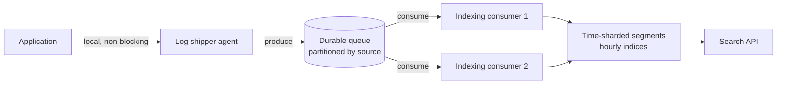
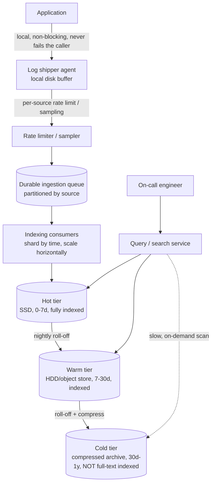

# Design: Log Aggregation System (Splunk / ELK at scale)

**Difficulty:** Senior → Staff | **Time:** 60–75 minutes

!!! note "Instructions"
    Cover each section and work it yourself first. Before every "Version N" reveal there is a `???` box — commit to an answer before you open it. The value of this exercise is not the diagram; it's predicting *why* the previous version breaks.

---

## 1. Problem Statement

Design a system like Splunk or the ELK/EFK stack: every service in a large fleet writes log lines (stack traces, request logs, debug output) to stdout or a file, and the system must collect all of it, make it **searchable by free text and structured fields**, and let an on-call engineer find the five relevant lines out of a firehose within seconds during an incident.

If you've done a [metrics/monitoring](metrics-monitoring.md) design, resist copying it. A metric is one small structured number emitted every 10–60 seconds per instrument. A log line is unstructured or semi-structured **text**, and a single incoming HTTP request can fan out into a dozen or more log lines across a handful of services. Fleet-wide, that's ~60× more bytes/second than the equivalent metrics pipeline (2M lines/s × 500 B vs ~1M points/s × 16 B — not 100–1000×), and the query pattern is fundamentally different too: metrics answer "what is the value of X over time" (aggregation over numbers), logs answer "show me every line mentioning request ID `abc123`" (search over text). That means you need something closer to the [search engine](search-engine.md)'s inverted index, not a time-series rollup — but built for a stream that is append-only, time-ordered, and enormous.

The other axis that dominates this design is economics. At real fleet scale, raw log volume is genuinely **petabyte-scale per year**, and every byte you index for full-text search costs several times more than the byte cost to just store it. The whole system is an exercise in deciding, continuously, what deserves to be searchable *now*, what can be searchable *later*, and what is only worth keeping as a cold, un-indexed archive you'd retrieve in the rare case someone needs it for compliance.

---

## 2. Clarifying Questions

??? question "What questions should you ask?"
    - **Volume:** How many hosts/containers, how many log lines/second fleet-wide, average line size?
    - **Structured or not?** Free-text stdout, or JSON structured logs with known fields (`level`, `service`, `trace_id`)?
    - **Freshness:** How fast must a log line be searchable after being emitted — is this for live incident debugging (seconds) or after-the-fact audit (minutes are fine)?
    - **Retention:** How long must logs be searchable, and how long must they merely be *retrievable* for compliance?
    - **Query shape:** Full-text grep-style search, structured field filters, or both? Time-range always required?
    - **Multi-tenancy:** Do teams need isolated access (RBAC per index/service)? PII in logs?
    - **Durability:** Can we drop a log line under extreme load, or is every line contractually required (audit logs, payment logs)?
    - **Failure mode of the *application*:** if the logging pipeline is unhealthy, is it acceptable for the app to buffer, drop logs, or must it never be affected at all?

---

## 3. Functional Requirements

- Every service/host ships its log lines to a central system, structured or unstructured
- Full-text search across log bodies, plus structured field filters (`service=checkout AND level=ERROR`)
- Time-range-scoped queries (last 15 min, last 24h, custom range) — this is nearly always paired with search
- Retention policy per log source/tenant, enforced automatically (delete or cold-archive past N days)
- Alerting on log patterns (e.g. error-rate spike, specific string match) — out of scope for the deep dive, noted for completeness

## 4. Non-Functional Requirements

| Property | Requirement | Reasoning |
|----------|-------------|-----------|
| Ingestion-to-searchable latency | < 30s p99 for hot tier | An on-call engineer debugging a live incident needs logs from *this minute*, not from an hour-old batch job |
| Ingest durability | No app-visible blocking; best-effort but low loss (< 0.01%) under normal load | A logging system must never slow down or crash the service it's monitoring |
| Availability (search) | 99.9% during business hours; degraded-but-alive during fleet-wide incidents | Search is most needed exactly when the fleet is unhealthy |
| Scale | 50K hosts, 2M lines/sec fleet-wide average (~10M peak in an incident), ~500 bytes/line avg | ~60× the byte rate of a comparable metrics pipeline, not 100–1000× |
| Retention | 7 days hot (fast, full-text), 30 days warm (searchable, slower), 1 year cold (archived, not indexed) | Retention length is the single biggest cost lever — must be explicit and tiered, not "keep everything forever" |
| Query latency | p99 < 2s for a single-day, single-service search; minutes acceptable for a cold-tier scan | Sets expectations for what's "live debugging" vs. "compliance retrieval" |

!!! tip "Interview Insight 🎯"
    Say the freshness number out loud early: "logs need to be searchable within 30 seconds because that's the debugging loop of an on-call engineer." That single requirement is what rules out any purely batch (hourly ETL) design and forces a streaming ingestion path.

---

## 5. Capacity Estimation

```
Fleet:
  50,000 hosts/containers, each emitting ~40 log lines/second average (10x peak during incidents)
  Fleet-wide average: 50,000 x 40 = 2,000,000 lines/sec average
  Fleet-wide peak (incident): easily 5-10x → 10-20M lines/sec is the nightmare case; design for 2M sustained average, headroom to ~10M peak

Per-line size:
  Avg log line: ~500 bytes (stack traces and JSON blobs push this up)

Raw ingestion volume:
  2M lines/sec x 500 bytes = ~1 GB/sec = ~86 TB/day = ~31 PB/year raw

Index overhead:
  A full-text inverted index (tokens + postings + stored source) typically runs 1.0-1.5x
  the raw text size, once you store the original line for context.
  86 TB/day raw -> roughly 100-130 TB/day if fully indexed hot.

This is why "index everything, forever" is not a real proposal at this scale -
see Section 17 (Cost) and the "index everything vs. sample" alternative in Section 18.

Retention tiers (see Version 3):
  Hot   (0-7d,  fully indexed, SSD):      86 TB/day x 7   = ~600 TB    (full-text searchable)
  Warm  (7-30d, indexed, slower disk):    86 TB/day x 23  = ~2 PB      (searchable, higher latency)
  Cold  (30d-1y, compressed, NOT indexed): 86 TB/day x 335 x 0.15 (compression) = ~4.3 PB
                                            (retrievable by time+source, not full-text)

Total steady-state footprint: ~7 PB, dominated by cold tier bytes, but cold tier
costs orders of magnitude less per byte than hot (Section 17).
```

!!! abstract "Mental Model"
    A metrics system stores few, small, structured numbers and optimizes for **aggregation over time**. A log system stores enormous volumes of unstructured text and optimizes for **retrieval over time + text**. The volume difference alone (2-3 orders of magnitude) means every component — ingestion, buffering, indexing, storage — has to be redesigned for write throughput first, query convenience second.

---

## 6. API Design

```
# Ingestion — called by every log shipper agent, never directly by application code
POST /v1/logs/ingest
Body (batched, newline-delimited or array):
  [
    { "ts": "2026-08-17T09:12:03.441Z", "host": "checkout-7f3a", "service": "checkout",
      "level": "ERROR", "trace_id": "abc123", "message": "payment gateway timeout after 3000ms" },
    ...
  ]
Response: 202 Accepted (fire-and-forget; shipper does not block on indexing completion)

# Search
GET /v1/logs/search
  ?query=payment gateway timeout
  &service=checkout
  &level=ERROR
  &from=2026-08-17T09:00:00Z
  &to=2026-08-17T09:30:00Z
  &limit=200
  &cursor=...
Response:
  { "hits": [ {...log line...}, ... ], "next_cursor": "...", "scanned_shards": 4, "took_ms": 340 }

# Retention / admin
PUT /v1/retention/{source}   { "hot_days": 7, "warm_days": 30, "cold_days": 365 }
```

!!! warning "Production Trap ⚠️"
    Never design the ingest endpoint to return only after the line is indexed and searchable — that couples app-facing latency (or shipper-facing latency) to indexing speed, and indexing is the part of this system most likely to be under load exactly when you need it most (a fleet-wide incident generates both more logs *and* more search queries at once).

---

## 7. Data Model — time-partitioned inverted index

Logs are almost always queried by **time range first**, then filtered by text/fields within that range. A single global inverted index (one big index for all time, like a classic search engine) would need to be edited in place for both new writes and old-data deletes — a poor fit for a stream that is overwhelmingly append-only and where "delete" really means "expire everything from three weeks ago in bulk."

Instead, shard the index by time: one index segment per hour (or per day, for lower-volume sources). This is conceptually the same inverted-index structure as [search-engine.md](search-engine.md) — term -> list of document postings — but partitioned so that:

- **Writes only ever touch the newest (currently open) segment.** Old segments are immutable once sealed, which makes them trivially compressible and cacheable.
- **A query first prunes by time range to a handful of segments**, then runs the text/field search only within those — turning "search the whole dataset" into "search the last 2 hours," which is orders of magnitude cheaper.
- **Retention becomes a segment-drop, not a row-delete.** Expiring 30-day-old logs means deleting whole sealed segment files, not scanning and deleting individual documents — O(segments) instead of O(documents).

```
Per-hour segment (sealed after the hour closes):
  logs-checkout-2026081709/
    postings.idx      -- term -> [(doc_id, offset), ...]
    fields.idx         -- field=value -> [doc_id, ...]  (service, level, host, trace_id)
    docs.store          -- raw log lines, compressed, doc_id addressable

Metadata catalog (small, hot, tells the query planner which segments to touch):
CREATE TABLE segments (
    segment_id   VARCHAR(64) PRIMARY KEY,
    source        VARCHAR(128) NOT NULL,   -- service or log source
    start_ts      TIMESTAMPTZ NOT NULL,
    end_ts        TIMESTAMPTZ NOT NULL,
    tier          VARCHAR(16) NOT NULL,     -- hot | warm | cold
    doc_count     BIGINT,
    size_bytes    BIGINT,
    INDEX idx_source_time (source, start_ts)
);
```

---

## 8. Version 1 — simplest thing that works

Application writes logs synchronously to a single indexing node over HTTP. One process, one full-text index, no tiering, no buffering.


```python
# V1 — application ships logs directly, blocking
def log(level: str, message: str, **fields):
    line = {"ts": now(), "level": level, "message": message, **fields}
    resp = requests.post("http://indexer:9200/logs", json=line, timeout=2)
    resp.raise_for_status()   # if this fails, the caller sees it
```

Fine for a handful of services on a laptop-scale demo. Do not add infrastructure yet — find the actual bottleneck first.

---

## 9. Identify the bottleneck

???+ question "At 2M lines/sec fleet-wide, where does V1 break, and how badly?"
    - **Ingestion volume overwhelms a single indexer immediately.** A single well-tuned indexing node handles maybe 20-50K lines/sec of full-text indexing. You are three to five orders of magnitude over capacity — this isn't a "scale it up a bit" problem, V1 doesn't survive contact with a real fleet at all.
    - **Synchronous shipping couples app health to indexer health.** If the indexer is slow (GC pause, disk saturation, a burst of writes), every application's `log()` call blocks on that `requests.post`. A logging system that can slow down or crash the very services it's supposed to help you debug is worse than no logging system — this is the cardinal sin of observability tooling.
    - **No time partitioning** means the single index grows without bound and both writes and reads degrade as it does — there's no way to cheaply expire old data.
    - This is a much higher write rate than the metrics case: one HTTP request into `checkout` might produce a request log line, three downstream service call logs, a payment-gateway retry log, and an error stack trace — five to ten log lines per one metric-worthy event.

---

## 10. Version 2 — decouple ingestion from indexing

Introduce a durable buffer between shipping and indexing, and shard the index by time. Log shippers push into a [distributed message queue](distributed-message-queue.md) (see that page for the queue mechanics — partitioning, consumer groups, offset tracking — rather than re-deriving it here); indexing consumers pull from it asynchronously and write into the current hour's segment.



```python
# V2 — shipper buffers locally, queue absorbs backpressure
class Shipper:
    def __init__(self):
        self.local_buffer = RingBuffer(max_bytes=64 * 1024 * 1024)  # bounded, oldest dropped

    def log(self, line: dict):
        self.local_buffer.append(line)   # never blocks the caller

    def flush_loop(self):
        while True:
            batch = self.local_buffer.drain(max_items=500)
            try:
                queue.produce(topic=f"logs.{batch.source}", records=batch, timeout=1)
            except QueueUnavailable:
                self.local_buffer.requeue(batch)  # keep trying; ring buffer caps memory
```

The queue gives you a durable cushion: a burst of logs (or a slow indexer) fills the queue rather than blocking or crashing the application, and indexing consumers can be scaled horizontally, independent of how many hosts are producing logs.

---

## 11. Identify the next bottleneck

???+ question "Queue + time-sharded indexing is running. What breaks next?"
    - **A single noisy service floods the pipeline.** A bug causing a retry loop can push one service from 40 lines/sec to 400,000 lines/sec. On a shared queue partition or shared indexing capacity, this one source can starve every other team's logs — the queue backs up, indexing lag for *everyone* spikes, and the noisy service is drowning out the incident someone else is trying to debug. This needs per-source rate limiting or sampling at the shipper (see [rate-limiter.md](rate-limiter.md) for the mechanism — apply it per log source, not globally).
    - **Wide time-range queries fan out slowly.** A search across 30 days touches ~720 hourly segments; querying them serially is unusable, and querying all of them in parallel against a small pool of segment-servers creates its own tail-latency problem (see [tail-latency.md](../performance/tail-latency.md) — the slowest of 720 parallel fetches sets your p99).

---

## 12. Version 3 — production architecture



- **Agent buffers to local disk, not memory-only.** Survives an agent restart without losing the last few minutes of logs, and a full local disk fails loud (agent alerts + drops oldest) rather than the application ever blocking.
- **Per-source rate limiting / sampling happens before the queue**, so one noisy service's excess volume never even reaches shared infrastructure — it's capped or sampled at the edge, closest to the source of the problem.
- **Indexing consumers are horizontally scaled and partitioned by time-shard**, so adding fleet capacity is a consumer-group scaling operation, not a re-architecture.
- **Hot/warm/cold is a scheduled roll-off**, not a query-time decision: a background job seals yesterday's hot segments into warm storage nightly, and a monthly job compresses and moves warm segments past 30 days into cold, dropping the full-text index (keeping only the time+source catalog entry so it's still retrievable, just not text-searchable without a restore).

---

## 13. Failure analysis

=== "Ingestion queue backs up during a fleet-wide incident"
    This is the worst possible moment — the exact time everyone needs logs, log volume is also spiking (error retries, verbose debug logging turned on). **Mitigation:** the queue is sized with headroom for a 5-10x burst (Section 5); indexing consumers autoscale on queue depth; shippers' local disk buffers absorb the gap without dropping recent data; if indexing lag still grows, shed the *lowest*-priority sources first (verbose debug logs) rather than losing ERROR-level lines fleet-wide.

=== "A noisy/buggy service floods logs"
    One service's bug causes 10,000x its normal log volume. **Mitigation:** per-source rate limiting (Section 12) throttles or samples at the shipper before the shared queue is touched; the offending service's own logs get dropped/sampled first — its problem doesn't become everyone else's outage; alert on `per_source_lines_dropped` so the team gets visibility that they're being throttled, not just silently truncated.

=== "An indexing consumer crashes mid-batch"
    Must resume without data loss (a log line silently vanishing during an incident is unacceptable) or duplication (double-counted error spikes mislead on-call). **Mitigation:** consumers commit queue offsets only after a batch is durably written to the segment store, and indexing writes are idempotent (deterministic doc_id from source+offset), so replaying an uncommitted batch after a crash overwrites rather than duplicates.

=== "A query spans cold storage and times out"
    A compliance request or a slow post-mortem search hits 300 days of un-indexed cold archive. **Mitigation:** the query API returns immediately with an estimated cost/time and requires explicit confirmation for cold-tier scans; cold retrieval is an async job (restore relevant compressed segments, decompress, grep) with a completion callback, not a synchronous request — never let a cold-tier query hold an HTTP connection open for minutes.

---

## 14. Consistency considerations

- **Logs are append-only and don't need cross-source consistency.** There's no "read-your-writes" requirement across services the way a database has — an engineer reading logs 20 seconds after an event occurred is the normal, expected experience.
- **Ordering within a single source's stream matters.** Debugging a causal sequence ("request came in, then the DB call timed out, then the retry fired") requires that one service's log lines stay in emission order. This is preserved by keeping one queue partition per source (or per host) and one consumer per partition at a time — cross-source ordering is explicitly *not* preserved (and not needed; that's what `trace_id` correlation is for, not wall-clock interleaving across services).
- **At-least-once delivery, deduplicated at index time.** Under retries (shipper reconnects, consumer replays after crash) a line may be produced twice; the indexing consumer's idempotent doc_id (Section 13) collapses duplicates rather than requiring exactly-once delivery from the queue, which is a much harder and slower guarantee to provide at this volume.

---

## 15. Observability

The hardest part of this system: you are building the tool that gets used *when everything else is broken*, so it has to be observable independent of the very fleet it monitors — a log pipeline that goes dark exactly when the fleet has an incident is a second, compounding outage.

```
Metrics (pipeline's own health, shipped through a path that doesn't depend on the main pipeline):
  shipper_local_buffer_depth_bytes{host}
  shipper_lines_dropped_total{host, reason=buffer_full|queue_unreachable}
  queue_depth{topic}, queue_consumer_lag_seconds{topic}
  indexer_ingest_rate{shard}, indexer_lines_per_sec
  ingest_to_searchable_latency_seconds (p50/p99) -- the core SLO
  per_source_rate_limit_triggered_total{source}
  segment_roll_off_lag (are hot->warm->cold jobs keeping schedule)

Alerts:
  ingest_to_searchable_latency_p99 > 60s
  queue_consumer_lag > 5 minutes
  shipper_lines_dropped rising on any host (someone's local buffer is full)
  a single source > 25% of total ingest volume (likely a noisy-neighbor event)

Design rule: the log pipeline's OWN metrics and alerts must go through a path
independent of the log pipeline itself (a separate metrics system, not "look at
the logs to see if logging is broken") — otherwise a log-pipeline outage is invisible
at exactly the moment someone is trying to use logs to diagnose it.
```

---

## 16. Cost analysis

Storage tiering is the dominant lever here, more than in almost any other exercise in this set, because raw volume is so large that a uniform storage class is unaffordable.

```
Using the Section 5 estimate (~86 TB/day raw, ~7 PB steady-state footprint):

Hot tier   (~600 TB, SSD, fully indexed):     ~$0.10-0.15/GB/mo -> ~$70-90K/month
Warm tier  (~2 PB, HDD/object, indexed):       ~$0.02-0.03/GB/mo -> ~$45-60K/month
Cold tier  (~4.3 PB, compressed archive,
            not indexed):                     ~$0.004/GB/mo (e.g. Glacier-class) -> ~$17K/month

Total storage: ~$130-170K/month at 7 PB, dominated by hot+warm (indexed) tiers
even though cold holds the most bytes -- indexing cost per byte is the real driver,
not raw storage.

Cost lever, in order of impact:
  1. Shorten hot-tier retention (7d -> 3d) -- hot is the most expensive tier per byte
  2. Sample/exclude low-value log sources from full-text indexing entirely (Section 18)
  3. Compress cold tier harder, accept slower restore times
  4. Move warm tier from indexed-searchable to indexed-on-demand (rebuild index only
     when a query actually needs that time range) -- trades query latency for steady-state cost
```

!!! tip "Interview Insight 🎯"
    If asked to cut cost 40%, the answer is almost never "compress harder" — it's "index less." Cutting hot retention from 7 days to 3, and moving 50% of DEBUG-level lines to cold-only (never indexed), typically saves far more than any storage-engine optimization, because indexing cost dominates raw storage cost at this volume.

---

## 17. Alternative architectures

=== "Index everything vs. sample/index-selectively"
    Indexing every line at full fidelity guarantees nothing is ever unsearchable, but costs scale linearly with total volume, which is punishing at petabyte scale. An alternative: index 100% of ERROR/WARN and a configurable sample (e.g. 5-10%) of INFO/DEBUG for full-text search, while still writing **100% of raw lines to cheap cold storage** (un-indexed, just retrievable by time+source). You lose "grep every DEBUG line from three weeks ago" but keep it technically retrievable via a slow cold-tier scan, at a fraction of the indexing cost.

=== "Structured (JSON) vs. unstructured logging"
    Structured logs (`{"level":"ERROR","service":"checkout","trace_id":"..."}`) index far more cheaply than free-text — field-value postings are smaller and more selective than tokenizing arbitrary prose, and structured filters (`service=checkout AND level=ERROR`) avoid full-text scan entirely. Free-text/unstructured logging is more flexible for developers (`print()`-style) but forces the indexer to tokenize everything, inflating both index size and query cost. Mature systems push teams toward structured logging specifically to cut indexing cost, not just for query convenience.

---

## 18. Staff Engineer Extensions

=== "100× traffic (or a simultaneous incident-driven spike)"
    The worst case isn't steady 100x growth — it's a fleet 10x larger *and* an incident causing another 10x spike in log verbosity at the same moment, i.e. exactly when the system is least able to absorb it. Mitigations compound: per-source rate limiting caps any one source's contribution regardless of fleet size; the queue and indexing tier both need to scale to the 100x sustained number, not just burst-absorb it; consider a hard fleet-wide "verbose logging" circuit breaker that automatically drops DEBUG-level ingestion fleet-wide once queue lag crosses a threshold, protecting ERROR/WARN visibility for the people actually debugging the incident.

=== "Multi-region"
    Logs stay regional by default — shipping every host's logs cross-region for indexing multiplies both latency and egress cost, and most debugging is regional anyway (a US-East incident is debugged with US-East logs). For a genuinely global incident, provide a federated query service that fans a search out to each region's local search API and merges results, rather than centralizing all raw log data into one region. Regional isolation also means a single region's log pipeline failure doesn't take down search capability everywhere.

=== "Data residency"
    Logs routinely contain PII (email addresses in error messages, user IDs, sometimes accidentally logged request bodies) — this is a real constraint, not a hypothetical. EU-origin logs must be indexed and stored in EU infrastructure, not just tagged after the fact. This means the shipper/rate-limiter layer needs to know the residency zone of its host at ingestion time and route to the correct regional queue, and cross-region federated search (from the multi-region case above) must exclude residency-restricted indices from a query originating outside that region unless the requester is explicitly authorized.

=== "Zero-downtime migration of the indexing engine"
    Changing the underlying index/search engine (e.g. migrating from one full-text engine to another) without losing search availability: dual-index new incoming data into both old and new engines behind the ingestion consumer; backfill historical hot/warm segments into the new engine as a rate-limited background job so it doesn't compete with live ingestion; run search queries against both and diff result sets before cutover; flip the query service to the new engine once parity is confirmed, keep the old engine read-only for a grace period, then decommission.

---

## 19. Interview follow-ups

1. **"How is this different from a metrics/monitoring system?"** — Data shape (unstructured text vs. small structured numbers), volume (2-3 orders of magnitude higher, since one request fans out into many log lines but typically one metric point per interval), and query pattern (full-text search over an inverted index vs. numeric aggregation over time). Say this explicitly — it's the whole premise of the exercise.
2. **"A single service is spamming logs and drowning out everyone else — what do you do, live, right now?"** — Per-source rate limit/sample at the shipper immediately (even a blunt fixed cap), verify queue lag is recovering, then investigate why that service is logging so much after the immediate bleeding is stopped. Don't wait for a root-cause fix before applying the cap.
3. **"How would you support 'show me everything for trace_id X across all services'?"** — Requires `trace_id` to be a structured, indexed field emitted consistently by every service (a logging-standard/convention problem as much as a system-design one), and the query fans out across per-service, per-time-shard segments filtered on that field — much cheaper than a full-text scan since it's an exact-match field lookup.
4. **"What breaks if you skip local disk buffering in the shipper agent and go straight memory-only?"** — A shipper process restart (deploy, crash, OOM) loses whatever's in memory; under sustained queue unavailability, an unbounded memory buffer OOMs the host running the application it's supposed to protect — the opposite of the "never take down the service you're monitoring" requirement.

---

## Self-Assessment

- [ ] I can explain, with numbers, why log volume is orders of magnitude higher than metrics volume for the same fleet
- [ ] I can justify why the index is time-sharded rather than one global inverted index
- [ ] I can describe the backpressure-safe shipping path and why synchronous shipping is disqualifying
- [ ] I can defend the hot/warm/cold tiering strategy with concrete cost numbers per tier
- [ ] I can explain why ordering matters within a source's stream but not across sources
- [ ] I can name the specific mitigation for a single noisy service flooding the pipeline
