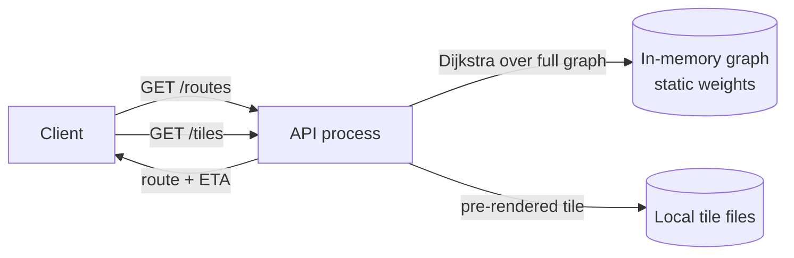
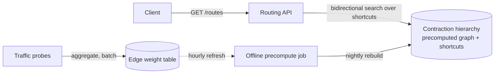
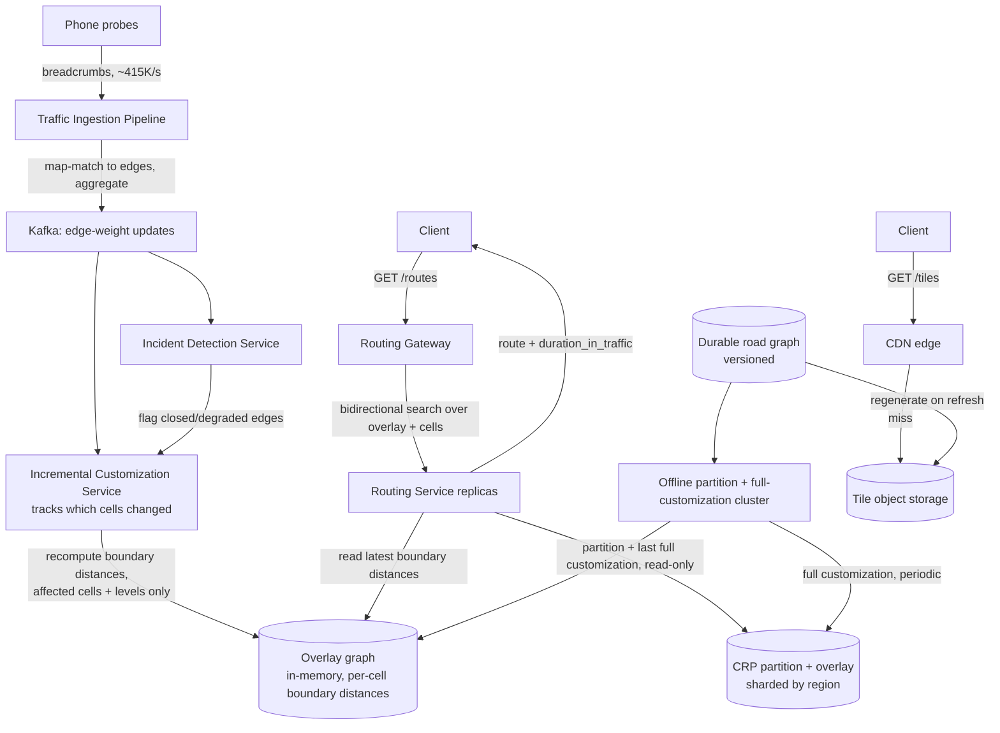

# Design: Maps & Navigation (Google Maps)

**Difficulty:** Senior → Staff | **Time:** 60–75 minutes

!!! note "Instructions"
    Cover each section and work it yourself first. Before every "Version N" reveal there is a `???` box — commit to an answer before you open it. This exercise shares spatial-indexing ground with the [ride-hailing exercise](ride-hailing.md); do not re-derive geohashing here — reference it and spend your time on what's actually new: **routing over a graph**.

---

## 1. Problem Statement

Design a mapping and navigation service: a user requests a route from point A to point B, the system returns the fastest path along with turn-by-turn directions and an ETA, the map itself renders as pannable/zoomable tiles, and ETAs stay accurate as live traffic changes the fastest path minute to minute.

The [ride-hailing exercise](ride-hailing.md) is the closest thing on this site to this one, and it's tempting to reuse its answer wholesale — it isn't the same problem. Ride-hailing's hard query is "who are the K nearest moving points to *this* point, right now?" — a nearest-neighbor search over a set of independent points, solved with geohash cells. This exercise's hard query is **"what is the cheapest path through a graph of a billion edges, where edge weight changes continuously?"** — a shortest-path problem, not a nearest-neighbor problem. Finding *a* driver near you and finding *the fastest way* from you to somewhere across a continent are different data structures with different failure modes: nearest-neighbor degrades with point density, shortest-path degrades with graph size and staleness of edge weights. Say this distinction early — reusing geohash intuition here (e.g. "just index road segments into geohash cells and scan nearby ones") solves point-location but does nothing for the actual graph-traversal cost, which is where this design lives or dies.

Road-segment **spatial indexing** (which tile or region a segment belongs to) does reuse ride-hailing's geo-partitioning ideas — reference that page rather than re-deriving it. What's new here is everything downstream of "I've found the relevant part of the graph": how you traverse billions of edges fast enough for a sub-200ms budget, and how you keep edge weights honest against traffic that changes every few seconds.

---

## 2. Clarifying Questions

??? question "What questions should you ask?"
    - **Routing scope:** Driving only, or also walking/cycling/transit? (Each has a different graph and different edge weights — scope to driving for this exercise.)
    - **Live traffic:** Does the route need to reflect traffic *right now*, or is a periodically-refreshed average acceptable?
    - **Re-routing:** Does the client get a live ETA that updates mid-trip, and does the route itself change if a faster path opens up (or a road closes) while driving?
    - **Geographic scope:** One country, or global? Cross-border routing?
    - **Map rendering:** Are we also serving the visual map tiles (imagery/vector tiles), or just the routing API? (Both — tiles are a distinct sub-problem from routing.)
    - **Alternate routes:** Return one route, or several (fastest / shortest / avoid tolls)?
    - **Freshness of the road graph itself:** How often does the underlying map data change (new roads, closures, speed limit changes) and how is that rolled out without breaking in-flight navigation?
    - **Scale:** Route requests/second, map data size (country vs global), traffic probe volume from phones?

---

## 3. Functional Requirements

- Compute the fastest route between two points, with turn-by-turn directions
- Serve renderable map tiles for panning/zooming at multiple zoom levels
- Ingest live location "breadcrumbs" from phones in transit as traffic probe data
- Reflect current traffic conditions in both the *route chosen* and the *ETA shown*
- Re-route or update ETA when conditions change materially mid-trip
- Support alternate routes (fastest, avoid tolls/highways)

## 4. Non-Functional Requirements

| Property | Requirement | Reasoning |
|----------|-------------|-----------|
| Route computation latency | < 200ms p99 | A navigation app that stalls before showing a route feels broken, not "computing" |
| Tile serving latency | < 50ms p99 (cache/CDN hit), < 300ms on origin miss | Panning must feel instant; tiles are the most frequent request type by far |
| Traffic freshness in routing | Edge weights reflect conditions from the last 1–2 minutes | Older than that and "avoid the jam" advice is actively wrong |
| Availability | 99.95% for route requests | Turn-by-turn failing mid-drive is a safety-adjacent outage, not a degraded feature |
| Route correctness under incidents | A closed road must never appear in a returned route | Routing someone into a closure is worse than a slow route |
| Scale | Global road graph, tens of millions of route requests/day, billions of tile requests/day | Drives every downstream capacity number |

!!! tip "Interview Insight 🎯"
    Two latency budgets exist here that must not be conflated, exactly like ride-hailing's matching-latency-vs-tracking-staleness split: **route computation** (a rare, expensive, graph-traversal query, budget ~200ms) and **tile serving** (an extremely frequent, cheap, cacheable query, budget ~50ms). Confusing them leads candidates to propose a CDN for routing (wrong — routes are personalized and traffic-dependent, not cacheable by URL) or a precomputed-hierarchy engine for tiles (wrong — tiles need caching, not graph algorithms).

---

## 5. Capacity Estimation

```
Road graph (global, driving-capable roads):
  ~700M road segments worldwide (OpenStreetMap-scale estimate)
  Each segment ≈ an edge; intersections ≈ nodes
  ~350M nodes, ~800M directed edges (segments are often one-way, or bidirectional = 2 edges)
  Per-edge storage: from_node(8B) + to_node(8B) + weight(4B) + geometry_ptr(8B) + road_class(1B) ≈ 30B
  800M edges x 30B ≈ 24 GB for the raw graph — fits in a single big-memory host,
    but NOT after adding precompute structures (see V2) which multiply this several-fold

Route requests:
  ~50M route requests/day globally → ~580/s average, ~6,000/s at rush-hour peak
  Each request: 1 shortest-path query over the relevant regional subgraph

Tile requests:
  Every pan/zoom/app-open fetches multiple tiles; billions/day globally
  ~2B tile requests/day → ~23,000/s average, ~150,000/s peak (evening commute + weekend travel)
  Tiles are near-static (road geometry changes slowly) → this is a caching problem, not a compute one

Traffic probe ingestion:
  Assume ~5% of active phones running the app or OS-level location sharing report a breadcrumb every ~10-15s
  100M concurrent-ish active devices globally (conservative) x 5% x (1 ping / 12s) ≈ 415,000 probes/second
  Each probe: ~40 bytes (device_hash, lat, lng, speed, heading, ts) → ~17 MB/s raw ingest
  This is the graph's "hot, constantly-mutating" workload — same shape as ride-hailing's driver pings,
    but here it feeds *edge weights*, not point positions on a map
```

!!! abstract "Mental Model"
    Three workloads with three different shapes: a **large, slowly-changing** graph (road topology — weeks between structural updates), a **continuous, high-volume** probe stream (traffic — feeds edge weights every few seconds), and a **massive, cacheable, read-only** tile corpus (map rendering — a CDN problem almost entirely separate from the other two). Conflating any pair of these into one storage/compute system is the recurring mistake in this design.

---

## 6. API Design

```
# Routing
GET /v1/routes?origin=lat,lng&destination=lat,lng&alternatives=2&avoid=tolls
  → 200 {
      "routes": [{
        "route_id": "rt_abc",
        "distance_m": 14200,
        "duration_s": 1080,
        "duration_in_traffic_s": 1340,
        "legs": [{ "instruction": "Turn right onto Main St", "distance_m": 300, ... }],
        "polyline": "encoded_geometry..."
      }]
    }
  → 400 if origin/destination unreachable, 503 if routing service degraded

# Tiles
GET /v1/tiles/{z}/{x}/{y}.pbf         # vector tile, standard z/x/y scheme
  → 200 tile bytes, Cache-Control: public, max-age=604800 (topology-only tiles)
  → 404 if out of bounds

# Live traffic probes (fire-and-forget, high volume)
POST /v1/probes
  { "device_hash": "d_9f2a", "lat": 37.77, "lng": -122.41, "speed_mps": 4.1, "heading": 90, "ts": 1755400000 }
  → 202 Accepted (never blocks the client on ingestion success)

# Live re-route / trip session
WS /v1/trips/{trip_id}/stream          # pushes updated ETA / re-route if conditions change materially
```

!!! warning "Production Trap ⚠️"
    Returning a single `duration_s` invites the wrong comparison — a client showing "18 min" that was computed from static weights while the road is actually jammed erodes trust fast. Always separate **free-flow duration** from **duration_in_traffic**; if you can only compute one live, make it the one the user actually sees before they commit to the route.

---

## 7. Data Model — road graph storage, spatial partitioning, and tile storage

**Road graph.** An adjacency-list representation: each node (intersection) stores outgoing edges (road segments), each edge stores a base weight (free-flow travel time), geometry (for rendering/instructions), and road class (highway vs residential — used both for weighting and for "avoid highways" filters).

```sql
-- Cold, durable graph source-of-truth (updated on the map-data refresh cadence, not per-request)
CREATE TABLE nodes (
    node_id      BIGINT PRIMARY KEY,
    lat          DOUBLE NOT NULL,
    lng          DOUBLE NOT NULL,
    region_id    INT NOT NULL,          -- spatial partition, see below
    INDEX idx_region (region_id)
);

CREATE TABLE edges (
    edge_id      BIGINT PRIMARY KEY,
    from_node    BIGINT NOT NULL REFERENCES nodes,
    to_node      BIGINT NOT NULL REFERENCES nodes,
    base_weight_s INT NOT NULL,          -- free-flow travel time, from speed limit + length
    road_class   SMALLINT NOT NULL,
    geometry     GEOMETRY NOT NULL,
    INDEX idx_from (from_node)
);
```

**Spatial partitioning of the graph.** The graph is partitioned into **regions** (roughly: countries, or sub-national tiles for large countries) so that (a) a route within one metro area never touches unrelated continents' data in memory, and (b) precompute jobs (V2) can run per-region in parallel and refresh independently. This is the same instinct as ride-hailing's per-city sharding — bound the blast radius of both storage and compute by geography — but here the partition boundary is a real complication the driver-matching problem never had: **routes cross region boundaries constantly** (a highway trip spans several regions), so regions need overlapping border buffers and a stitching step at query time, not the clean "a rider in Austin never matches a driver in Tokyo" independence ride-hailing enjoys.

**Live edge-weight overlay** (kept separate from the base graph — critical for V2/V3):

```
Hot store (in-memory, keyed by edge_id):
  traffic:{edge_id} → { current_weight_s, sample_count, updated_at }
  Refreshed continuously from aggregated probe data; base_weight_s in the durable table never changes
  from this — traffic is always a multiplier/overlay on top of the static graph, never a graph mutation
```

**Tile storage.** Pre-rendered (or pre-vectorized) tiles keyed by `{zoom}/{x}/{y}`, stored in object storage and fronted by a CDN. Regenerated on the map-data refresh cadence (weekly/monthly), not per-request — tiles do not encode live traffic, only road geometry and static labels, which is exactly why they're cacheable at CDN timescales while routes are not.

```
Object storage: tiles/{z}/{x}/{y}.pbf   (vector tiles; raster equivalent for imagery layers)
CDN in front, cache key = tile path, TTL = days (topology changes slowly)
```

---

## 8. Version 1 — simplest thing that works

Single region, full graph in memory, Dijkstra's algorithm run fresh per request, static (non-live) edge weights computed once from speed limits.



```python
import heapq

def dijkstra(graph: dict[int, list[tuple[int, float]]], source: int, target: int):
    # graph[node] = [(neighbor, weight_s), ...]
    dist = {source: 0.0}
    prev = {}
    pq = [(0.0, source)]
    visited = set()

    while pq:
        d, node = heapq.heappop(pq)
        if node in visited:
            continue
        visited.add(node)
        if node == target:
            break
        for neighbor, weight in graph.get(node, []):
            nd = d + weight
            if nd < dist.get(neighbor, float("inf")):
                dist[neighbor] = nd
                prev[neighbor] = node
                heapq.heappush(pq, (nd, neighbor))

    return reconstruct_path(prev, source, target), dist.get(target)
```

This returns a correct shortest path and works fine for a small graph (a single city, a few hundred thousand edges) queried at low volume. Do not add infrastructure yet — find the actual bottleneck first.

---

## 9. Identify the bottleneck

???+ question "At global scale — 800M edges, 6,000 route requests/second at peak — where does V1 actually break?"
    - **Dijkstra over the full graph is O((V + E) log V) per query.** Even a fast implementation touching a meaningful fraction of 350M nodes for a cross-country route takes seconds, not milliseconds — nowhere close to the 200ms budget. A short in-city route is fast; a long-haul route (the query type that matters most for a *navigation* product, not just local search) is the one that's catastrophically slow, and you can't tell which one you're getting until you've already started computing it.
    - **Loading 800M edges into every API process's memory doesn't scale horizontally** the way stateless services usually do — each process needs the (multi-GB, growing) graph resident, and every deploy/restart re-pays that load cost.
    - **Static weights are actively wrong during actual traffic.** A route computed from speed limits alone will confidently route someone onto a highway that's stopped, and there's no mechanism in V1 to know that.
    - The fix is not "make Dijkstra faster" in the abstract — it's recognizing that **most of the graph traversal work is repeatable across queries** (the shortest path from downtown to the highway on-ramp doesn't change between two different requests that both pass through there) and can be precomputed once instead of redone from scratch every request.

---

## 10. Version 2 — precomputed hierarchical routing + periodic traffic updates

Introduce a **contraction hierarchies**-style precompute: offline, iteratively "contract" nodes out of the graph in order of importance (a residential dead-end contracts early; a highway interchange contracts late), inserting **shortcut edges** that represent "the shortest path between these two important nodes, skipping everything unimportant in between." At query time, instead of exploring the full graph, a bidirectional search runs only through progressively "more important" shortcuts — most of the graph is never touched, because the shortcuts already encode what would have been thousands of hops.

Conceptually: think of it like pre-building the "if you're already on the highway, here's the fastest way between any two highway junctions" answer once, offline, so a query crossing a continent barely touches local streets at all — it hops onto shortcut edges almost immediately and only expands local detail near the origin and destination.



```python
# conceptual shape only — not a full CH implementation
def query_contraction_hierarchy(ch_graph, source, target):
    # forward search from source, backward search from target,
    # both restricted to edges going to "more important" nodes
    forward_dist = bidirectional_dijkstra_forward(ch_graph, source)
    backward_dist = bidirectional_dijkstra_backward(ch_graph, target)
    # shortest path = node minimizing forward_dist[n] + backward_dist[n]
    meeting_node = min(
        set(forward_dist) & set(backward_dist),
        key=lambda n: forward_dist[n] + backward_dist[n]
    )
    return unpack_shortcuts(meeting_node, forward_dist, backward_dist)
```

A subtlety that matters for what comes next: a shortcut edge's weight is not independent of the base edges it skips — it's the sum (or min, over possibly several represented paths) of weights along whatever it represents. Change a base edge's weight (a road gets slower) and every shortcut whose underlying path crosses that edge is now wrong until it's recomputed; you cannot just poke a new number into one edge and leave the rest of the hierarchy alone. This is why traffic weights are folded in via a distinct **customization** phase, not a raw edge-weight edit — and it's also why plain node-contraction CH, as sketched above, is the wrong tool for *frequent* reweighting: there's no cheap way to know which shortcuts a given base-edge change invalidates without re-deriving them.

The production answer (**Customizable Route Planning**, CRP) restructures the precompute around this exact requirement by splitting it into two genuinely independent phases instead of one:

1. **Partition (metric-independent, rebuilt rarely — weekly, on road-network changes).** Divide the graph into a hierarchy of *cells* — geographically contiguous chunks of a few thousand nodes each, grouped into progressively larger cells at higher levels (city block → district → region). This partition depends only on graph *topology*, never on edge weights, so it's stable across every traffic update.
2. **Customization (metric-dependent, cheap, run frequently).** For every cell, compute the shortest-path distance between every pair of its *boundary nodes* (the small number of nodes where the cell connects to its neighbors) using only that cell's internal edges and current weights — this is a small, local computation, independent per cell. Those boundary-to-boundary distances become the edges of an *overlay graph* at the next level up, and the same step repeats one level higher, using the level-below's boundary distances instead of raw edges. A full customization pass touches every cell once, bottom-up, and is far cheaper than a CH rebuild because each cell's computation is small and independent — seconds to low tens of seconds for a metro region, not minutes to hours.

The key property CRP buys that plain CH doesn't: **when only a handful of edges change, only the handful of cells containing those edges need their boundary distances recomputed** — and that recomputation only has to propagate up through the partition levels where the boundary distances actually changed, which for a single road segment is almost always one cell and rarely more than a couple of levels. This is what makes the next section's incident-response mechanism possible without the bitset-of-covered-edges idea an earlier draft of this page proposed (infeasible at this scale, and wrong besides — a shortcut's constituent path isn't a contiguous range of edge IDs, so "which edges does this shortcut cover" isn't a cheap membership check to begin with). CRP sidesteps the question entirely: it never asks "which shortcuts does this edge affect," it just recomputes the one or two cells the edge lives in.

---

## 11. Identify the next bottleneck

???+ question "Customization is far cheaper than a full CH rebuild and can, in principle, run on every incident. What still breaks?"
    - **A full region-wide customization pass, even at 'seconds to low tens of seconds,' is still too slow to trigger on every single incident report.** A metro area has an accident, a stall, or a lane closure somewhere every few seconds at rush hour — running a full bottom-up pass over every cell in the region for each one means the passes queue up behind each other and staleness climbs regardless of how cheap any single pass is. What's needed is customizing *only the one or two cells the incident actually touches*, not the whole region — and propagating that upward only as far as the change actually moves a boundary distance, which for a single lane closure is usually nowhere near the top level.
    - **Even a local, single-cell recompute isn't instant** (it's still a Dijkstra-scale computation over that cell's internal graph, just a small one) — a design needs an explicit target for "detected → cell recomputed → reflected in the overlay" and has to treat that latency as a first-class number, not an afterthought.
    - **Read fan-out on a popular corridor.** During evening rush hour, millions of route requests funnel through the same few highway interchanges (everyone leaving downtown converges onto 2-3 arterial roads). The overlay-graph edges representing those interchanges, and the servers holding them, see wildly disproportionate query volume compared to the graph average — a hot-key problem, structurally similar to ride-hailing's hot geohash cell during a stadium event, but here it's baked into the *shape of commuting*, not a one-off event.
    - The fix needs two different mechanisms: **incremental, cell-scoped customization** that recomputes only the cells an incident touches (not the whole region) and pushes the updated overlay distances live within seconds, plus horizontal scaling of the read path for hot corridors.

---

## 12. Version 3 — production architecture



Key production decisions:

- **Incident response is incremental customization scoped to the affected cells, not a query-time patch.** A closed edge or a sudden speed drop is mapped to the one or two cells it lives in, and the customization service recomputes *only those cells'* boundary-to-boundary distances (a small, local Dijkstra-scale computation) and propagates the change up through the partition levels only as far as a boundary distance actually moved — usually one or two levels for a single incident, not the whole region. The updated overlay distances are pushed live within seconds of detection, and every subsequent query simply reads the current overlay — there's no per-query decision about whether to trust a shortcut, because the overlay itself is kept correct rather than being read speculatively and checked against a separate flag list.
- **Incident detection** watches the aggregated probe stream for signatures a simple average wouldn't catch fast enough — a cluster of probes all reporting near-zero speed on an edge that's normally free-flowing — and proactively flags the edge as degraded/closed rather than waiting for enough individual probe updates to organically drag the average down, handing the flagged edge straight to the customization service as a priority recompute.
- **Routing service is stateless and horizontally scaled**, holding a read-only copy (or shard) of the hierarchy; hot corridors during rush hour are handled by scaling replica count, not by any special-casing of "popular" edges — unlike ride-hailing's hot geohash cell (which needs cell-splitting because it's a *write* hot spot), this is a *read* hot spot, so it's just more read replicas.
- **Tile serving is fully decoupled** — CDN with object storage origin, regenerated on the map-data refresh cadence, never touching the routing path.
- **The durable road graph is versioned**, and the offline precompute cluster builds each hierarchy version from a specific graph snapshot — this is what makes the graph-refresh failure mode (below) tractable.

---

## 13. Failure analysis

=== "Stale precomputed routes during an incident"
    An accident closes a lane; the affected cells haven't been recustomized yet (probe data hasn't accumulated, or incident detection hasn't fired), and the overlay still reflects free-flow for that segment. Routes continue sending drivers into the closure.
    **Mitigation:** treat detection-to-recustomization latency as a first-class SLO (target: incident reflected within 60-90s of enough probes reporting near-zero speed on an edge); accept official incident feeds (DOT closures, construction permits) as a faster, more authoritative trigger for an immediate cell recompute than waiting for probe density to build up organically — a scheduled closure should never depend on enough cars getting stuck first.

=== "Traffic ingestion pipeline lag"
    The probe stream backs up (a burst of reconnects after a regional network blip, similar to ride-hailing's ingestion backlog). Edge weights across an entire metro area stop updating.
    **Mitigation:** track `ingestion_lag_ms` per region; when lag exceeds a threshold, widen the confidence interval shown on `duration_in_traffic` rather than silently serving weights that are minutes stale as if they were current; shed low-priority probe volume (skip redundant pings from a device that hasn't moved) before shedding anything incident-related.

=== "Tile CDN origin failure"
    Object storage backing the CDN becomes unreachable in a region; cache hits still serve fine, but any tile miss (a user pans somewhere not recently cached, or a cache eviction) fails.
    **Mitigation:** CDN serves stale-while-revalidate for tiles (topology rarely changes fast enough for staleness to matter for hours); cross-region replication of tile storage, same pattern as pastebin's cross-region blob replication — tiles are immutable-until-next-refresh, ideal for aggressive redundancy.

=== "Road graph update/versioning causes route inconsistency"
    A weekly map-data refresh adds new roads and closes old ones. If the rollout isn't atomic, a single in-flight navigation session could get a route computed from the old graph version and a live ETA update computed against the new one — turn instructions can reference an edge that no longer exists in the version the client is now polling against.
    **Mitigation:** version the hierarchy (`graph_version` on every route response); a trip session pins to the graph version its initial route was computed from for its duration, and only adopts a new version at the next full re-route, never mid-instruction; never mutate a live hierarchy in place — always build the new version alongside the old and cut over atomically (see zero-downtime migration in Staff Extensions).

---

## 14. Consistency considerations

- **Graph topology is strongly versioned, weights are eventually consistent.** A route's *turns* must come from one consistent graph snapshot (mixing two versions mid-route risks referencing a segment that doesn't exist in one of them), but the *weight* used to rank candidate paths is allowed to be a few seconds to a couple of minutes stale — the same "structure needs correctness, weight tolerates staleness" split that makes V3 work.
- **Read-your-own-incident:** if a user reports a hazard (crowdsourced incident, in products that support it) they should see it reflected in their own subsequent route queries quickly, even if the wider population takes longer to converge — similar in spirit to pastebin's read-your-writes for the creator.
- **Tiles are eventually consistent across regions by design** — a newly added road showing up in Tokyo's tile cache a few minutes before it shows up in São Paulo's is an acceptable and unremarkable staleness window, unlike a closed-road routing correctness bug.
- **Incident data must never be strongly consistent at the cost of latency** — a route computed with a 2-second-old view of an incident is far preferable to one that blocks 500ms waiting for a guaranteed-fresh read; treat incidents as fast-converging eventual state, not a lock.

---

## 15. Observability

```
Metrics:
  route_latency_ms p50/p99 (SLO: p99 < 200ms)
  tile_latency_ms p50/p99, tile_cache_hit_rate (CDN)
  traffic_ingestion_lag_ms per region
  overlay_update_latency_ms (probe observed → weight applied)
  hierarchy_version_skew (fraction of active sessions on a non-latest graph version)
  incident_detection_time_s (probe anomaly → flagged edge)
  routing_replica_qps (detect hot-corridor read concentration)

Alerts:
  route_latency_p99 > 200ms for 5 min
  traffic_ingestion_lag > 3 min
  overlay_update_latency_p99 > 90s
  routes_through_flagged_closed_edge > 0  (should never happen — hard correctness alarm)
  hierarchy_version_skew: too many sessions stuck on an old version past its expected retirement window
```

---

## 16. Cost analysis

```
Routing service (stateless replicas holding sharded hierarchy, global):
  ~150 replicas x $400/mo (memory-heavy instances for graph shards): ~$60,000/mo

Offline precompute cluster (periodic full/partial rebuilds per region):
  Bursty batch compute, ~$8,000/mo amortized

Traffic ingestion (Kafka + aggregation, 415K probes/sec):
  ~$10,000/mo (comparable in shape to ride-hailing's location-ingestion cost, larger volume)

Tile storage + CDN (2B requests/day):
  Object storage: ~$2,000/mo
  CDN egress at this volume: ~$15,000/mo (dominant tile cost — this is the lever to pull first)

Total: ~$95,000/mo at global scale

Cost lever: CDN cache hit rate on tiles. Going from 90% to 98% hit rate on 2B requests/day
  cuts origin fetches (and CDN-to-origin bandwidth) by 5x — worth more than any routing-side optimization
  because tile volume outnumbers route volume by roughly 40:1.
```

---

## 17. Alternative architectures

=== "Contraction hierarchies vs. A* with landmarks (ALT)"
    Contraction hierarchies front-load cost into an offline precompute and make online queries extremely fast and largely traffic-agnostic in structure (only weights change). A* with landmarks precomputes distances to a fixed set of reference points and uses them as a search heuristic to prune Dijkstra's exploration — cheaper to precompute and easier to keep fresh under changing weights, but slower per-query than a mature contraction hierarchy at this scale. CH wins here because query volume (6,000/s peak) far outweighs precompute cost, and the graph's *structure* changes slowly enough (weekly) that amortizing precompute cost over millions of queries between rebuilds is a clear win — ALT is more defensible if edge weights change so fast that CH's precomputed shortcuts would need near-continuous rebuilding.

=== "Client-side route caching / pre-caching"
    Cache a computed route on-device for a commute pattern a user repeats daily, re-validating only the live-traffic overlay rather than recomputing the full route server-side each time. Cuts server-side query volume for predictable, repeat trips — but the client still needs a live overlay check (a closed road on a routine commute is exactly the case that must never be served from a stale client cache), so this reduces load, it doesn't remove the live-weight dependency.

=== "Single global hierarchy vs. per-region sharded hierarchies"
    A single hierarchy spanning the whole world simplifies cross-border routing (no stitching step) but makes every rebuild a global operation and puts unrelated regions' precompute on the same failure/rollout blast radius. Sharding by region (this design's choice) requires a border-stitching step for cross-region routes but lets regions rebuild, version, and fail independently — the right trade-off once the graph is large enough that a global rebuild is a multi-hour operation.

---

## 18. Staff Engineer Extensions

=== "100x traffic"
    6,000 → 600,000 route requests/second is not achievable by simply adding routing replicas linearly against a single sharded hierarchy — hot corridors (the same handful of highway interchanges everyone queries during rush hour) would need disproportionate replica counts. Cache *popular route segments* (not full personalized routes — origin/destination pairs are too varied to cache directly, but "fastest path across this specific highway interchange" is a highly reusable sub-result) as a middle layer between the live overlay and full hierarchy queries. Push tile serving further to the edge (already CDN-backed, but 100x tile volume means negotiating deeper edge PoP presence, not just scaling one CDN vendor).

=== "Multi-region (graph partitioned by region, cross-border routing)"
    Unlike ride-hailing's clean per-city independence, routing has genuine cross-region queries (a road trip from France to Germany). Each region owns its hierarchy shard; a cross-border route runs a stitching query — find the best border-crossing node(s) within a buffered overlap zone, compute each region's leg independently, join at the crossing. Border regions need larger overlap buffers precomputed on both sides specifically to make this join cheap; underestimate the buffer and cross-border routes silently miss the actual fastest crossing point.

=== "Data residency"
    EU regulations may require traffic probe data (which is location data tied to a device) to stay in EU infrastructure. Because the ingestion pipeline and live overlay are already sharded by region for latency/scale reasons, this mostly falls out for free — probes from EU devices route to EU-region ingestion and never leave. The graph *topology* (roads, not probe data) is not personal data and can replicate globally without residency concern; keep this distinction explicit, since it's easy to over-restrict non-sensitive graph data by conflating it with the actually-sensitive probe stream.

=== "Zero-downtime migration of the road graph data"
    Map data refreshes weekly/monthly and must not break routes already in progress. Build the new hierarchy version fully offline against the new graph snapshot, alongside the currently-serving version — never mutate a live hierarchy in place. New route requests get the new `graph_version` once the build passes validation (shadow-query a sample of recent real requests against both versions, compare route/duration deltas for anomalies). In-flight trip sessions keep their pinned version until their next full re-route, exactly as in the graph-versioning failure mode above. Retire the old version only after the longest reasonable trip duration has elapsed with zero new sessions pinned to it — never on a fixed timer that ignores whether anyone's still using it.

---

## 19. Interview follow-ups

1. **"How is this different from the ride-hailing exercise?"** — Ride-hailing's hard problem is nearest-neighbor search over independent moving points (geohash cells). This exercise's hard problem is shortest-path over a graph with continuously changing edge weights (contraction hierarchies + a live overlay). Point-location/spatial-indexing ideas transfer; the traversal algorithm and the precompute-vs-live split do not.
2. **"Why not just re-run Dijkstra but on a smaller graph — e.g. only major roads?"** — That's roughly what contraction hierarchies achieve, but done principledly: the hierarchy's shortcut edges *are* an automatically-derived "important roads only" view, generated per-region from the actual graph rather than a hand-maintained "highways only" subset that would miss a case where the fastest path genuinely goes through a local road.
3. **"How do you handle a road that's one-way, or a turn restriction (no left turn)?"** — Directed edges naturally encode one-way streets. Turn restrictions require the graph to model transitions between edges, not just nodes (a "no left turn from Main St onto 1st Ave" is a constraint on an edge-pair, not a node) — briefly mention this without deriving the full edge-expanded graph representation, it's a well-known extension.
4. **"What happens if two conflicting live updates arrive for the same edge near-simultaneously — a probe says it's clear, an official incident feed says it's closed?"** — Authoritative sources (DOT closure feeds, verified incident reports) should outrank aggregated probe inference — a single confirmed closure is a hard override, while probe-derived weight is a statistical estimate that should never silently contradict a known-true closure.

---

## Self-Assessment

- [ ] I can explain why this exercise's hard problem (graph shortest-path) is different from ride-hailing's (nearest-neighbor), not just superficially similar because both are "maps"
- [ ] I can describe, conceptually, what a contraction hierarchy precomputes and why that makes queries fast without deriving the full algorithm
- [ ] I can explain why structure (the hierarchy) and weight (traffic) are kept separate, and why that split is what makes incident response fast
- [ ] I can justify why tile serving and route computation have completely different latency/caching strategies despite being "the same product"
- [ ] I can walk through how a road-graph version refresh avoids breaking an in-flight navigation session
