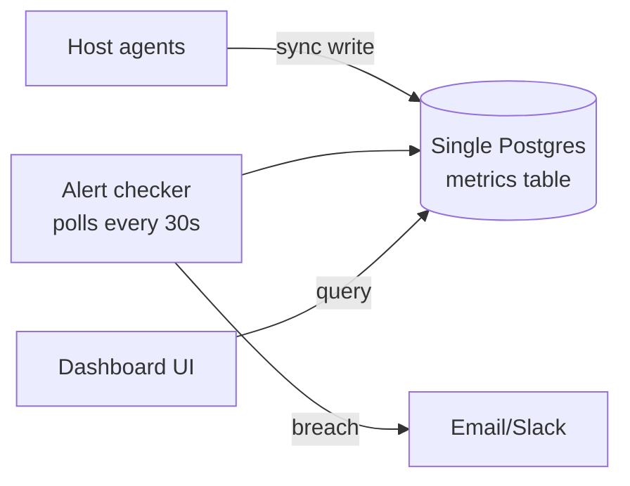
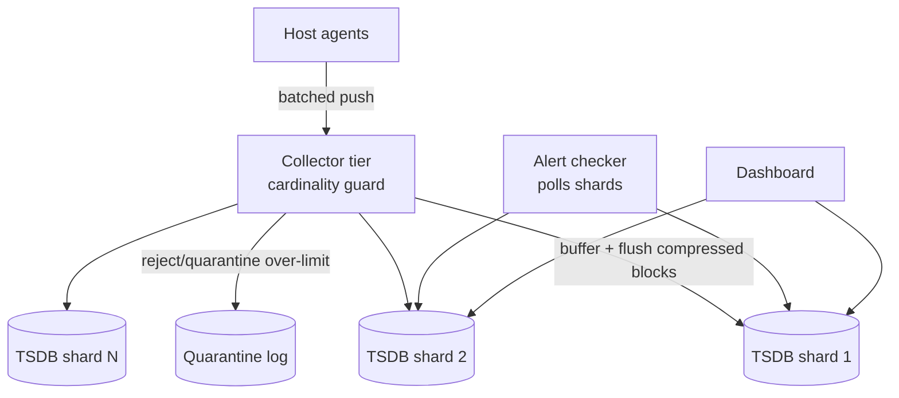
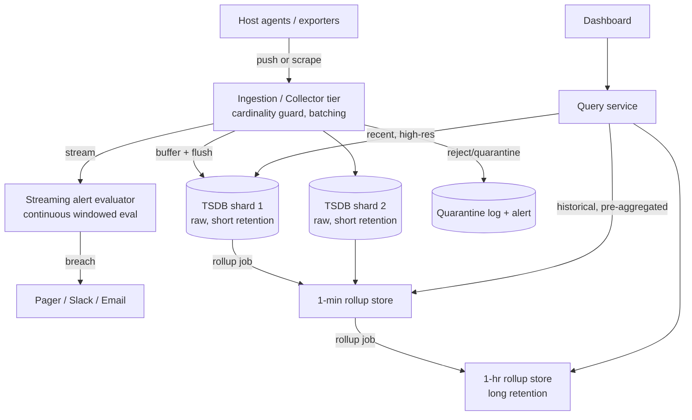

# Design: Metrics & Monitoring System (Datadog / Prometheus at scale)

**Difficulty:** Senior → Staff | **Time:** 60–75 minutes

!!! note "Instructions"
    Cover each section and work it yourself first. The [Observability](../observability/index.md) pages cover *why* metrics matter — SLIs, SLOs, error budgets, the cardinality trap conceptually. This exercise is the *system* underneath those concepts: what ingests millions of points/second, stores years of history cheaply, and pages someone within seconds of a threshold breach.

---

## 1. Problem Statement

Design a metrics platform like Datadog or Prometheus-at-scale: every host, container, and pod in a fleet emits numeric time-series data (`cpu.usage`, `http.requests`, `queue.depth`) tagged with labels (`host`, `region`, `endpoint`, `status_code`). The system must ingest this continuously, store it queryably for months, render dashboards, and fire alerts when a metric crosses a threshold.

Two things make time-series data a genuinely distinct storage problem, and most candidates only see the first:

1. **Extreme write volume of small, structured points.** A fleet of 50,000 hosts each emitting 200 metrics every 10 seconds is 1M writes/second before a single dashboard is opened. This looks like "just scale the database" — and it's the easy half of the problem.
2. **Cardinality explosion.** Every unique combination of metric name + label values is an independent time series. `http.requests{endpoint, status_code}` with 200 endpoints × 10 status codes is 2,000 series — fine. Add `user_id` or `request_id` as a label and you turn 2,000 series into tens of millions, because the storage engine allocates a new series (and its own index entry, its own compressed block, its own memory) for every distinct label combination it has ever seen. This is not a tuning problem you fix later — it is the difference between a design that works and one that falls over in production, and it is where nearly every real metrics-system outage actually comes from.

Do not reach for "just use Prometheus" or "just use InfluxDB" as an answer. Explain *why* a time-series-shaped store exists at all, and name the cardinality trap before an interviewer has to lead you to it.

---

## 2. Clarifying Questions

??? question "What questions should you ask?"
    - **Ingestion model:** Do agents push metrics to a collector, or does the server pull/scrape from targets? (Datadog vs. Prometheus — real architectural fork.)
    - **Cardinality bound:** Is there a fleet-wide limit on distinct label combinations per metric? Who enforces it — the client library, the agent, or the server?
    - **Retention:** How long must raw (per-second/10s) resolution live? How long do rolled-up (1min/5min/1hr) aggregates live?
    - **Alerting SLA:** How fast must a threshold breach become a page — seconds, or is a 1-minute delay acceptable?
    - **Query patterns:** Ad hoc dashboard queries over arbitrary label combinations, or a fixed set of known dashboards that can be pre-aggregated?
    - **Consistency tolerance:** Is a dropped data point acceptable? Is a dropped *alert* acceptable? (These are different answers.)
    - **Multi-tenancy:** One org's fleet, or many customers sharing infrastructure with isolation requirements?
    - **Scale:** Hosts/containers, metrics per host, emission interval, unique series count?

---

## 3. Functional Requirements

- Ingest metric data points: `(metric_name, labels, timestamp, value)`
- Query time-series data with aggregation (`sum`, `avg`, `p99`) over label filters and a time range
- Render dashboards: multiple time-series panels, often aggregating across thousands of hosts
- Define alert rules (`metric > threshold for duration`) and notify (page, Slack, email) on breach
- Retain data at declining resolution over time (raw → 1min → 1hr rollups)
- Reject or quarantine metric submissions that would blow up cardinality

## 4. Non-Functional Requirements

| Property | Requirement | Reasoning |
|----------|-------------|-----------|
| Ingestion throughput | Millions of points/second sustained, bursty at deploy time | This is the baseline write problem |
| Alerting latency | Breach → page in < 30s p99 | A 5-minute-late page for a production outage is a failed alerting system, not a slow one |
| Query latency (dashboard) | < 1–2s p95 for a 30-day, thousand-host aggregate panel | Must stay interactive during an incident, when it matters most |
| Cardinality ceiling | Configurable limit per metric (e.g. 10K–100K active series) | Without a ceiling, one bad label choice can consume unbounded memory |
| Durability | Raw points: best-effort, small loss tolerable. Alert evaluation: must not silently miss a breach | Asymmetric — see §14 |
| Retention | Raw: days. Downsampled: months to years | Storage cost scales with resolution × retention × cardinality |

!!! tip "Interview Insight 🎯"
    Two latency requirements above are easy to conflate but drive different architecture: **alerting latency** wants a streaming path close to ingestion. **Query latency** for dashboards wants pre-aggregated, indexed storage. Building one system that serves both requirements off the *same* code path is where V1 designs quietly become correct-but-slow.

---

## 5. Capacity Estimation

```
Fleet:
  50,000 hosts/containers/pods
  200 metrics/host (cpu, mem, disk, per-endpoint http counters, custom app metrics)
  Emission interval: every 10s

Raw write rate:
  50,000 hosts × 200 metrics / 10s = 1,000,000 points/second sustained
  Deploy-time / incident bursts: 2–3× → ~2.5M points/second peak

Cardinality (the number that actually decides the architecture):
  Well-labeled: metric_name + {host, region, az} → bounded by host count
  50,000 hosts × 200 metrics ≈ 10M active series — already large, still bounded
  One bad label (tag a counter by user_id, 5M users) →
  200 metrics × 5,000,000 ≈ 1 BILLION series from a single metric family
  This is 100× the entire fleet's legitimate cardinality from ONE mislabeled deploy.

Point size:
  ~16 bytes raw (8B timestamp + 8B value) once delta-encoded/compressed
  Uncompressed with label strings repeated: 100–200 bytes/point

Storage, raw resolution (10s, bounded 10M series):
  1M points/s × 16 bytes ≈ 16 MB/s ≈ 1.4 TB/day
  Retained 3 days raw ≈ 4.2 TB

Storage, downsampled (1min rollup, 90 days):
  1M points/s ÷ 6 (10s→1min) × 16 bytes ≈ 2.7 MB/s ≈ 230 GB/day → 21 TB / 90 days

Storage, downsampled (1hr rollup, 2 years):
  Further ÷60 → ~350 GB/year

Total steady state (bounded cardinality): low hundreds of TB with tiering.
The SAME numbers with the billion-series bad label: raw tier alone exceeds a
petabyte in hours. Cardinality, not fleet size, is the dominant cost variable.
```

!!! abstract "Mental Model"
    Raw traffic growth is *linear and predictable* — more hosts, more metrics. Cardinality growth is *combinatorial and accidental* — one engineer adds one high-variance label and the series count jumps by orders of magnitude overnight. Every version below is really about controlling one or both of these independently.

---

## 6. API Design

```
# Push-based ingestion (agent → collector)
POST /v1/metrics
Body (batched, one request per flush interval):
{
  "series": [
    { "metric": "http.requests", "labels": {"host":"web-042","endpoint":"/checkout","status_code":"200"},
      "points": [[1723500000, 1], [1723500010, 3]] }
  ]
}
Response: 202 Accepted, or 400 with per-series rejection reasons (cardinality_limit_exceeded)

# Pull-based alternative (server scrapes a target's /metrics endpoint) — see §18
GET /metrics   (on each monitored target, Prometheus exposition format)

# Query API
GET /v1/query?query=avg(cpu.usage{region="us-east"})&start=...&end=...&step=60s
Response: [{ "labels": {...}, "points": [[ts, value], ...] }]

# Alert rule definition
PUT /v1/alerts/{rule_id}
{
  "query": "avg(http.errors{service=\"checkout\"}) / avg(http.requests{service=\"checkout\"})",
  "threshold": 0.05, "comparison": ">", "for": "2m",
  "notify": ["pagerduty:oncall-checkout"]
}
```

!!! warning "Production Trap ⚠️"
    A `202 Accepted` on ingestion must not mean "guaranteed stored." If a cardinality guard silently drops a series, the *dashboard* querying it goes quiet — not error, just empty. That silence is indistinguishable from "the service that emits this metric is healthy and has nothing to report" unless you surface rejections explicitly (metric on the metrics system itself — see §16).

---

## 7. Data Model

A general relational row store is the wrong engine here: rows are optimized for point lookups and updates on a small number of columns, but a metrics workload is almost pure **append + range-scan-by-time + aggregate**, over data that is extremely repetitive (a `cpu.usage` value rarely differs much from the previous 10s sample). A time-series-optimized layout wins on three axes a row store doesn't:

- **Time-partitioned, columnar layout** — values for one series are stored contiguously and separately from timestamps, so a range scan over 30 days reads only the columns it needs, not whole rows.
- **Delta-of-delta / Gorilla-style compression** — timestamps are equally spaced (delta is nearly constant → near-zero bits), and values change slowly between samples (XOR-based delta-of-delta compression, as in Facebook's Gorilla paper, gets raw points down to ~1.3 bytes/point vs. 16 bytes naive). A relational row store has no way to exploit this regularity because it treats every row as independent.
- **Index is on the label set, not the value** — you look up "which series exist for `metric=cpu.usage, region=us-east`," then scan that series' compressed block by time. A B-tree on `value` (typical relational indexing) is useless here.

```
-- Conceptual layout (not literal SQL — a real TSDB stores this columnar/compressed)

Series index (the cardinality-critical structure):
  series_id  = hash(metric_name, sorted(labels))
  metric_name: "http.requests"
  labels: {host: "web-042", endpoint: "/checkout", status_code: "200"}
  → EVERY new distinct label combination allocates a new series_id here.
    This index is the thing a bad label choice blows up: it grows by
    O(unique label combinations), not O(hosts) or O(metrics).

Time-partitioned block store (per series_id, per time range):
  series_id | block_start_ts | compressed_points (delta-of-delta encoded)

Naive relational equivalent (V1 only — shown to make the contrast concrete):
CREATE TABLE metrics (
    ts           TIMESTAMP NOT NULL,
    metric_name  VARCHAR(128) NOT NULL,
    labels       JSONB NOT NULL,      -- {"host":"web-042","endpoint":"/checkout"}
    value        DOUBLE PRECISION NOT NULL,
    INDEX idx_lookup (metric_name, ts)
);
-- Every row repeats metric_name and label strings. No compression across
-- adjacent points. A JSONB label column can't be selectively indexed per
-- label without an index-per-label — which is itself a cardinality problem.
```

The label set is exactly where cardinality lives: the series index has one entry per *distinct combination*, so `labels: {host, region}` (bounded by fleet size) is safe, while `labels: {host, region, request_id}` is not — `request_id` is unbounded and never repeats, so every single point becomes its own permanent series.

---

## 8. Version 1 — simplest thing that works

Single node. One relational table (as sketched above) or a single-node TSDB. Agents write synchronously. A cron-style checker polls the table every N seconds and compares against thresholds.



```python
# V1 — naive synchronous ingestion + polling alert checker
def ingest(metric_name, labels, value, ts):
    db.execute(
        "INSERT INTO metrics (ts, metric_name, labels, value) VALUES (%s,%s,%s,%s)",
        ts, metric_name, json.dumps(labels), value
    )

def check_alerts():
    for rule in load_alert_rules():
        rows = db.query(
            "SELECT avg(value) FROM metrics WHERE metric_name=%s AND ts > %s",
            rule.metric, now() - rule.window
        )
        if breach(rows, rule.threshold):
            notify(rule)

while True:
    check_alerts()
    sleep(30)
```

This works for a handful of hosts and a dashboard nobody refreshes aggressively. Ship it, then find the real bottleneck instead of guessing.

---

## 9. Identify the bottleneck

???+ question "You roll this out to the full 50,000-host fleet. What breaks first, and what breaks worst?"
    - **Write throughput exceeds one node almost immediately.** 1M points/second synchronous inserts will not fit on a single Postgres primary — you'll saturate WAL and disk I/O long before you reach fleet scale, likely in the tens-of-thousands-of-points-per-second range on typical hardware.
    - **The canonical failure mode — accidental cardinality:** a routine deploy adds a `request_id` or `user_id` label to an existing metric "just for debugging." Instead of `200 metrics × 50,000 hosts ≈ 10M series`, that one metric alone now creates a new series *per request* — at even modest traffic, millions of new series appear within minutes. Each new series is a new row group / index entry / in-memory structure. The `metrics` table's index and the query planner both degrade sharply, dashboards for *unrelated* metrics slow down because they share the same index and cache, and in the worst case the node runs out of memory and the whole ingestion pipeline stops — for every metric, not just the offending one. This is the single most common way real metrics systems go down in production, and it is silent until it isn't: nothing in V1 rejects the bad label, it just quietly starts accepting it.
    - **The polling alert checker doesn't scale independently** — but that's a *secondary* bottleneck; the write path fails first.

---

## 10. Version 2 — sharded storage, write-optimized ingestion, cardinality guard

Three changes, each aimed at one failure above:

1. **Shard the time-series store** by `hash(metric_name + label_set)` so no single node owns the full series index or the full write volume.
2. **Write-optimized ingestion path**: agents batch points and send them to a collector tier; the collector buffers writes in memory and flushes to storage in sorted, compressed blocks — shaped like a log-structured merge write path (buffer → flush → compact) rather than a row-at-a-time `INSERT`.
3. **Cardinality guard at ingestion**: the collector tracks the number of distinct label combinations seen per metric name. Once a metric exceeds a configured limit (e.g. 100,000 active series), *new* label combinations for that metric are rejected or routed to a quarantine bucket — the metric keeps working for its existing, legitimate series, but a runaway label stops generating new ones instead of consuming unbounded storage.



```python
# V2 collector — batched, buffered, cardinality-guarded
class Collector:
    def __init__(self, cardinality_limit=100_000):
        self.series_count = defaultdict(int)   # metric_name -> distinct series seen
        self.known_series = defaultdict(set)   # metric_name -> {series_id}
        self.buffer = defaultdict(list)        # shard -> pending points

    def ingest_batch(self, points: list[Point]):
        for p in points:
            series_id = hash_series(p.metric_name, p.labels)
            if series_id not in self.known_series[p.metric_name]:
                if self.series_count[p.metric_name] >= self.cardinality_limit:
                    quarantine(p, reason="cardinality_limit_exceeded")
                    continue
                self.known_series[p.metric_name].add(series_id)
                self.series_count[p.metric_name] += 1
            shard = shard_for(series_id)
            self.buffer[shard].append(p)

    def flush(self):
        for shard, points in self.buffer.items():
            block = compress_delta_of_delta(sorted(points, key=lambda p: p.ts))
            storage.write_block(shard, block)
        self.buffer.clear()
```

The guard is deliberately per-metric, not global: a legitimate metric near its own limit shouldn't be starved by an unrelated metric's runaway labels.

---

## 11. Identify the next bottleneck

???+ question "Cardinality is now bounded and writes are sharded. A dashboard aggregating p99 latency across 2,000 hosts over 30 days is still slow, and the alert checker is still late during a traffic spike. Why?"
    - **Dashboard query cost:** aggregating raw 10s-resolution data across 2,000 series × 30 days is `2,000 × 259,200 points ≈ 500M points` scanned per panel load — even compressed, that's too much to do on demand every time someone opens a dashboard. Without pre-aggregation (rollups computed once, queried many times), every dashboard view redoes the same expensive scan.
    - **Polling doesn't scale with alert count or ingestion rate.** A checker polling raw storage every 30s has to re-run every rule's query against fresh data each cycle; during an ingestion spike (the exact moment an alert is most likely to matter — a deploy gone wrong, a traffic surge), storage is busiest and queries queue up, so the *real* incident's page arrives late. Alerting needs to consume the ingestion stream continuously, not poll a store that's contending with the same spike.

---

## 12. Version 3 — production architecture



**Retention tiers** (explicit, because this is the primary cost control — see §17):

| Tier | Resolution | Retention | Used for |
|------|-----------|-----------|----------|
| Raw | 10s | 3 days | Debugging a live incident, alert evaluation |
| Rollup 1 | 1 min | 30 days | Recent dashboards, week-over-week comparison |
| Rollup 2 | 1 hr | 2 years | Capacity planning, long-term trend dashboards |

Key production decisions:

- **Streaming alert evaluator, not a poller.** Alert rules subscribe to the ingestion stream and maintain a windowed aggregate (e.g. a 2-minute sliding sum) incrementally as points arrive, so a breach is detected within the ingestion latency itself, not on the next poll cycle. This is what makes the < 30s alerting SLA achievable even during an ingestion spike — evaluation cost scales with active rules, not with a full table scan.
- **Query service serves rollups, not raw data, for anything beyond the raw retention window.** A 30-day dashboard panel reads the 1-min rollup store directly — pre-aggregated, so query cost is independent of how many raw points existed.
- **Rollup jobs run continuously**, compacting raw blocks into the next tier down and expiring the source tier once the rollup is durable. This is a background pipeline, not something computed at query time.
- **Cardinality guard result (quarantine) is itself alertable** — a quarantine spike should page the platform team, not just the emitting service's team, because it's usually a bad deploy elsewhere in the fleet.

---

## 13. Failure analysis

=== "Cardinality explosion from a bad deploy"
    A new build adds a `session_id` label to `api.latency`, generating hundreds of thousands of new series in minutes. **Without the V2 guard:** ingestion memory and shard index size balloon, other metrics on the same shard degrade, and dashboards fleet-wide slow down. **With the guard:** the collector caps new series for `api.latency` at its configured limit, routes the excess to quarantine, and the metric keeps reporting for its pre-existing, legitimate series. The blast radius is contained to "that one metric stops gaining new series" instead of "ingestion falls over." Alert on quarantine volume so the offending deploy gets rolled back quickly, not discovered a day later in a cost review.

=== "Alert evaluator falls behind during an ingestion spike"
    A traffic surge doubles the point rate; the streaming evaluator's consumer lag grows because incremental window updates queue up behind the backlog. A real threshold breach (e.g. error rate spiking during the same surge) is detected late. **Mitigation:** alert evaluation is a separate, independently scaled consumer group from raw ingestion — scale it ahead of ingestion during known-risk windows (deploys), alert on evaluator lag itself as a first-class metric, and prioritize evaluation for high-severity rules if the consumer must shed load.

=== "Storage shard failure loses recent unflushed data"
    A shard node crashes before its in-memory buffer flushes to durable blocks — the most recent seconds to minutes of raw points for that shard's series are gone. **Mitigation:** this is within the "best-effort, lossy-tolerant" contract for raw storage (§14) — accept the gap, replicate the buffer to a second node before acknowledging ingestion if the loss window needs to shrink further, and make sure the *alert evaluator* consumed those points from the stream before the shard write, not after, so an alert doesn't depend on the same buffer that just got lost.

=== "Downsampling/rollup job failure causes gaps in historical dashboards"
    The 1-min → 1-hr rollup job crashes for a period; raw data ages out (3-day retention) before the rollup catches up, leaving a permanent gap in that time range for anyone querying beyond 3 days later. **Mitigation:** rollup jobs must be idempotent and resumable from a checkpoint; alert on rollup lag approaching the source tier's retention window (the real deadline, not an arbitrary one); consider holding the raw tier a few hours longer than strictly needed as a buffer against rollup job downtime.

---

## 14. Consistency considerations

Metrics systems are **inherently best-effort and lossy-tolerant on the data path, but not on the alert path** — and that asymmetry should directly shape where reliability investment goes.

- **A dropped raw data point is acceptable.** Losing one 10-second sample from one host during a shard failover barely changes a dashboard's shape and nobody pages over it.
- **A dropped alert is not acceptable.** If a threshold breach happens and nobody is paged, the entire system has failed at its actual job regardless of how well ingestion or storage performed. This is why the streaming alert evaluator is architected as its own consumer of the ingestion stream (with its own durability/replay guarantees) rather than a downstream reader of the same best-effort storage tier that raw dashboards use.
- **Practical split:** invest in replication and acknowledgment for the ingestion → alert-evaluator path (can replay from stream offset if the evaluator crashes); invest in cost-efficient, best-effort storage for the raw/rollup tiers used by dashboards.
- **Read-your-writes doesn't really apply here** the way it does in a CRUD system — metrics are append-only and read by aggregate, not by a client waiting to see its own last write reflected exactly.

---

## 15. Observability

Monitoring the monitoring system is not a throwaway section here — it's the practical answer to "what happens when the thing that's supposed to tell you something is broken doesn't tell you it's broken."

```
Metrics on the metrics system itself:
  ingestion_points_per_second, ingestion_batch_latency_p99
  cardinality_active_series{metric_name}       (top-K by series count)
  cardinality_quarantined_total{metric_name}   (the early-warning signal)
  alert_evaluator_consumer_lag_seconds
  rollup_job_lag_seconds{tier}
  shard_write_error_rate, shard_flush_latency_p99
  query_latency_p95{tier=raw|rollup_1m|rollup_1h}

Alerts:
  cardinality_quarantined_total spike            (bad deploy elsewhere in the fleet)
  alert_evaluator_consumer_lag > 30s              (the SLA itself, watched directly)
  rollup_job_lag approaching source retention     (imminent permanent data gap)
  ingestion_points_per_second drops sharply        (agents silently failing, not a quiet fleet)

Fallback when the monitoring system itself is down:
  A minimal, independent heartbeat/dead-man's-switch check (separate infrastructure,
  ideally a different provider or region) that pages if it stops hearing from the
  main system at all — because the main system cannot be trusted to alert on its own
  outage. This is the one piece of the design that deliberately does NOT depend on
  anything built in this exercise.
```

---

## 16. Cost analysis

```
Storage, cardinality-bounded (10M active series, tiered per §12):
  Raw (3 days):            ~4 TB   → cheap SSD-backed store
  1-min rollup (30 days):  ~21 TB  → standard object/block storage
  1-hr rollup (2 years):   ~0.7 TB → cold storage class
  Total: mid tens of TB, low thousands of $/month depending on backend

Storage, WITHOUT downsampling (raw kept for 90 days instead of rolling up):
  1.4 TB/day × 90 ≈ 126 TB of raw-resolution data — 5-6x the tiered cost
  for retention nobody queries at full resolution past the first few days.

Storage, with an uncontrolled cardinality incident (§9/§13):
  A single mislabeled metric hitting 1B series can multiply the series
  index and block count by 100x for as long as it runs unguarded —
  this dwarfs every other cost lever combined. Cardinality control is
  not a nice-to-have optimization; it is THE dominant cost variable.

Compute:
  Collector/ingestion tier, sized for peak (2.5M points/s):  moderate, horizontally scaled
  Streaming alert evaluator:                                 scales with rule count, not raw volume
  Rollup jobs:                                                batch, off-peak scheduling reduces cost

Primary cost levers, in order of impact:
  1. Cardinality guard (prevents the 100x blowout scenario entirely)
  2. Retention tiering / downsampling (5-6x reduction vs. flat raw retention)
  3. Cold storage class for the oldest rollup tier
```

---

## 17. Alternative architectures

=== "Push-based ingestion (Datadog-style agents)"
    Agents on every host batch and push metrics to a collector. **Pro:** works behind NAT/firewalls, no need for the server to discover and reach every target, agents can buffer locally during a network blip. **Con:** a misbehaving or compromised agent can push unbounded cardinality or volume — the server-side guard (§10) is not optional, it's the only backstop. **Failure mode:** agent can't reach the collector → local buffer fills → oldest points dropped (lossy, matches §14's tolerance for raw data).

=== "Pull-based scraping (Prometheus-style)"
    The server scrapes a known list of targets' `/metrics` endpoints on an interval. **Pro:** the server controls cardinality and rate directly — it decides what and how often, so a target can't overwhelm it just by emitting more; also trivially reveals "is this target even up" (a failed scrape *is* a signal). **Con:** doesn't work well through NAT/firewalls or for ephemeral serverless workloads without a gateway; requires service discovery to know what to scrape. **Failure mode:** target is unreachable → scrape fails → gap in that target's series, visible and explicit rather than silently absorbed by a buffer.

=== "Hybrid (most real large-scale systems)"
    Long-lived infrastructure (hosts, VMs) uses pull/scrape for its operational simplicity and built-in liveness signal; short-lived or push-friendly workloads (serverless functions, mobile/edge agents, batch jobs) push through a gateway that then gets scraped. Cardinality guard sits at the gateway/collector boundary regardless of which side originates the metric.

---

## 18. Staff Engineer Extensions

=== "100x traffic (fleet grows to 5M hosts)"
    Raw write volume grows roughly linearly to ~100M points/second — a hard but well-understood horizontal-sharding problem. **Cardinality growth is usually worse than linear**, because a 100x larger fleet also means 100x more engineers adding labels, 100x more services, and the same "accidentally tag by request_id" mistake now has 100x the blast radius before the guard catches it. At this scale, per-metric cardinality limits need to be provisioned per-team/per-service with quota, not one global number, so one team's mistake can't starve another's legitimate metrics of ingestion capacity.

=== "Multi-region (global fleet)"
    A fleet spread across regions shouldn't ship every raw point to one global store — cross-region bandwidth and latency make that both expensive and slow for regional dashboards. Use **federated/hierarchical aggregation**: each region runs its own full ingestion/storage/alerting stack for regional dashboards and regional alerting (fast, local), and only pre-aggregated rollups (not raw points) replicate to a global tier for fleet-wide dashboards and cross-region alert rules. Alert rules that must reason across regions (e.g. global error budget) subscribe to the aggregated stream, accepting the rollup interval as their evaluation latency floor.

=== "Data residency"
    Regulatory requirements (GDPR-style) may require a given region's metric data — including labels that could be personally identifying if mislabeled (another reason the cardinality guard matters: an unbounded label is also a residency/PII risk) — to stay in-region. Route ingestion and storage per region-of-origin, replicate only aggregated, label-scrubbed rollups globally, and exclude residency-tagged series from cross-region replication explicitly (same pattern as the pastebin exercise's residency/replication conflict — call out that they fight each other if asked).

=== "Zero-downtime migration of the storage engine"
    1. Dual-write: new points go to both old and new TSDB, with the *same* cardinality guard applied identically to both (a guard mismatch between engines is a silent data-shape divergence). 2. Backfill historical rollups into the new engine from the old, rate-limited so it doesn't compete with live ingestion. 3. Run the streaming alert evaluator against the new engine in shadow mode, compare breach decisions against the live evaluator for a full alerting cycle (days, to catch periodic patterns) before cutover. 4. Flip dashboard queries to the new engine behind a flag, monitor query latency and result parity. 5. Stop writing to the old engine only after retention on it has fully aged out or been migrated.

---

## 19. Interview follow-ups

1. **"A team's dashboard suddenly shows no data for a metric that used to work fine. How do you debug it?"** — This is the cardinality-explosion debugging path: check `cardinality_quarantined_total` for that metric first — if it's spiking, a recent deploy likely added an unbounded label and the guard is now rejecting new series (or the pre-guard system silently degraded). Confirm by checking the metric's active series count against its configured limit and correlate the timing with recent deploys to the emitting service.
2. **"Why can't you just index every label for fast ad hoc queries?"** — Because the index itself IS the cardinality cost; indexing an unbounded label (like `request_id`) doesn't make queries on it fast, it makes the index unbounded. Fast ad hoc queries on high-cardinality dimensions require a different tool (log/trace search), not the metrics store.
3. **"How would you support percentile aggregation (p99) across hosts if raw data is downsampled by then?"** — True percentiles can't be recomputed from already-averaged rollups; either store pre-computed histogram/sketch summaries (e.g. t-digest, HDRHistogram) at rollup time instead of a single averaged value, or accept that long-range historical percentiles are approximate.
4. **"Push vs. pull — which would you pick for a fleet of ephemeral serverless functions, and why?"** — Push, because pull requires the server to know a scrape target exists and reach it, which doesn't hold for functions that live for milliseconds; push through a gateway (see the hybrid alternative in §17) with the same server-side cardinality guard applied regardless.

---

## Self-Assessment

- [ ] I can explain, with a concrete number, how one bad label turns a bounded metric into a billion-series incident
- [ ] I can justify a columnar, time-partitioned, delta-compressed store over a general relational table
- [ ] I can describe the cardinality guard mechanism and why it's per-metric, not global
- [ ] I can explain why the alert evaluator is a streaming consumer of the ingestion stream, not a poller against storage
- [ ] I can state the lossy-data-vs-lossy-alert asymmetry and where it puts reliability investment
- [ ] I can name retention tiering as the primary lever for long-term storage cost, and cardinality control as the primary lever against catastrophic cost blowouts
