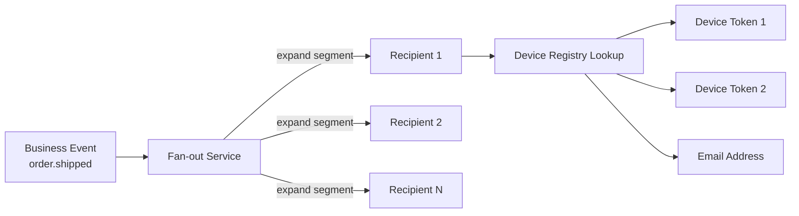
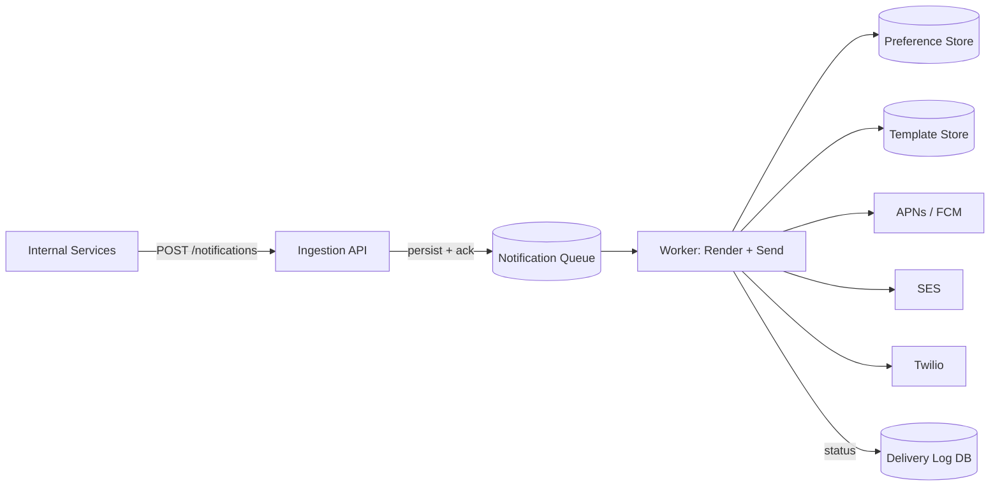
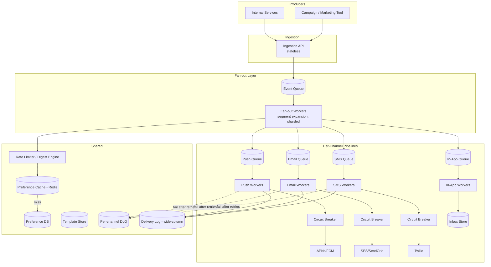

# Design: Notification System

**Difficulty:** Senior | **Time:** 60–75 minutes

!!! note "Instructions"
    **Cover the solution sections** and work through each step yourself first. Use "Hint" tabs if stuck. Practice explaining out loud — the way you communicate matters as much as the solution.

---

## 1. Problem Statement

Design a notification system for a large consumer app (e.g., an e-commerce or social platform) that delivers messages to users across multiple channels — push notifications (mobile), email, SMS, and in-app notifications. Example triggers: "your order shipped," "someone liked your post," "your password was changed," "flash sale ends in 1 hour." The system must fan out a single business event to potentially millions of recipients, respect each user's preferences, and provide delivery guarantees appropriate to the notification's importance.

---

## 2. Clarifying Questions

Practice asking these before designing:

??? question "What questions should you ask?"
    - **Scale:** How many notifications per day? Peak fan-out size (e.g., a broadcast to all users)?
    - **Channels:** Which channels are in scope — push, email, SMS, in-app, all four?
    - **Triggers:** Are notifications triggered by internal events (order shipped) or external campaigns (marketing blasts)? Both?
    - **Guarantees:** Do all notifications need "at least once" delivery, or is best-effort acceptable for low-priority ones?
    - **Ordering:** Does delivery order matter (e.g., "item shipped" before "item delivered")?
    - **Preferences:** Can users opt out per channel, per notification type, or set quiet hours?
    - **Localization:** Do we support multiple languages/locales?
    - **Rate:** Should we cap how many notifications a user receives per hour/day (anti-spam)?
    - **Read tracking:** Do we need read/unread state for in-app notifications?
    - **Latency:** Is this real-time (chat message) or can it tolerate seconds-to-minutes of delay (weekly digest)?

---

## 3. Functional Requirements

- Accept notification requests from internal services (order service, social service, security service) and marketing tools
- Fan out one event to one or many recipients, and one recipient to one or many registered devices
- Render notification content from templates, with localization
- Deliver via the appropriate channel(s) per user preference: push, email, SMS, in-app
- Track delivery status per notification (queued, sent, delivered, failed, opened)
- Respect user preferences, quiet hours, and rate limits
- Provide idempotent delivery — retries must not double-send

## 4. Non-Functional Requirements

| Property | Requirement |
|----------|-------------|
| Latency | Transactional (OTP, security alert): < 5s p99 end-to-end. Marketing/digest: minutes acceptable |
| Availability | 99.95% for the ingestion API; individual channel outages must not block others |
| Throughput | 50M notifications/day average, bursts to 10M in a single fan-out (flash sale) |
| Durability | No event silently dropped — must be persisted before ack to the producer |
| Idempotency | Exactly-once *effect* despite at-least-once delivery infrastructure |
| Ordering | Best-effort per-user ordering for related notifications; not globally required |

---

## 5. Capacity Estimation

```
Daily volume:
  50M notifications/day average
  50M / 86,400s ≈ 580 notifications/second (avg)
  Peak (campaign burst, 20×): ~12,000 notifications/second

Fan-out multiplier:
  Each "notification" may target 1–3 devices (push) + email + in-app
  Effective channel messages: 580 events/s × ~2.5 channels ≈ 1,450 channel sends/second (avg)
  Peak: ~30,000 channel sends/second

Storage (delivery log):
  Per delivery record: ~300 bytes (recipient, channel, status, timestamps, template id)
  50M/day × 2.5 channels × 300 bytes ≈ 37.5 GB/day
  Retained 90 days for support/debugging: ~3.4 TB (partition + TTL/archive to cold storage)

Provider cost drivers:
  Push (APNs/FCM): free
  Email (SES): ~$0.10 per 1,000 emails. 50M/day × 40% email-eligible = 20M emails/day
    → 20M / 1,000 × $0.10 = $2,000/day ≈ $60,000/month
  SMS (Twilio): ~$0.0075/message — roughly 75× the marginal cost of a single email ($0.0001) and effectively unbounded relative to push (free), so it must be reserved for high-priority/opt-in use
```

!!! tip "Interview Insight 🎯"
    The cost asymmetry across channels (SMS >> email > push, which is free) is a real design constraint, not a footnote. A senior candidate should proactively say: "SMS is expensive and rate-limited by carriers, so it's reserved for OTP/security alerts and opt-in critical updates — never for marketing." This single sentence signals cost-awareness that many candidates miss.

---

## 6. API Design

```
POST /api/v1/notifications
Request:
{
  "event_type": "order.shipped",
  "recipient_id": "user_123",           // or "audience": {"segment": "all_us_users"} for broadcast
  "template_id": "order_shipped_v2",
  "template_data": { "order_id": "O-9981", "carrier": "UPS" },
  "priority": "transactional",          // transactional | high | normal | low
  "channels": ["push", "in_app"],       // omit to use user's default preference resolution
  "idempotency_key": "order-9981-shipped"
}
Response: { "notification_id": "n_abc123", "status": "accepted" }
Status: 202 Accepted   (async — this is a queue, not a synchronous send)

GET /api/v1/notifications/{notification_id}/status
Response: { "status": "delivered", "channels": { "push": "delivered", "in_app": "read" } }

GET /api/v1/users/{user_id}/notifications?unread=true&cursor=...
Response: { "notifications": [...], "next_cursor": "..." }   // in-app inbox feed

PATCH /api/v1/users/{user_id}/preferences
Request: { "order_updates": {"push": true, "email": true, "sms": false}, "quiet_hours": {"start": "22:00", "end": "08:00"} }

POST /api/v1/users/{user_id}/notifications/{id}/read
Response: 204 No Content
```

!!! note "202, not 200"
    The ingestion endpoint must be asynchronous. A producer calling this API should never block on APNs, SES, or Twilio being slow. Accept, persist, ack, and process from a queue — this is the single most important architectural decision in this system.

---

## 7. Core Deep Dive: Fan-out, Templates, and Provider Abstraction

This is the heart of the system. There are two distinct fan-out problems, and candidates who conflate them lose points.

**Fan-out problem 1 — event to recipients.** A single business event (`flash_sale.started`) may target a segment of millions of users. This fan-out must not be done synchronously in the request path; it is itself a queued job that expands into per-recipient tasks.

**Fan-out problem 2 — recipient to devices.** A single user may have 3 registered mobile devices (old phone, new phone, tablet) plus an email address. Sending "push" means looking up the user's device registry and sending to each token, handling stale/uninstalled-app tokens (APNs/FCM return an "unregistered" error — this is the signal to prune the token).



**Template rendering and localization.** Notifications are never hand-authored per send. A template (`order_shipped_v2`) is versioned, stored with locale variants (`order_shipped_v2.en`, `order_shipped_v2.es`), and rendered with `template_data` at send time. The renderer resolves the user's locale (from profile or Accept-Language history), falls back to a default locale if the translation is missing, and produces channel-specific output — push has a ~178-character body limit, email supports full HTML, SMS is plain text and billed per 160-character segment.

**Provider abstraction.** Each channel is behind an interface so the send pipeline doesn't know or care whether push goes through APNs or FCM:

```
interface ChannelProvider:
    def send(recipient, rendered_content) -> DeliveryResult
    def health() -> bool

Implementations: APNsProvider, FCMProvider, SESProvider, SendGridProvider, TwilioProvider
```

This abstraction pays off in two ways: (1) you can dual-source a channel (SES + SendGrid) and failover between them, and (2) each provider call is wrapped in a **circuit breaker** — if APNs starts timing out, the breaker trips, the worker stops hammering a failing dependency, and messages route to the retry queue instead of piling up on live connections. See [Circuit Breakers](../reliability/circuit-breakers.md) for the trip/half-open/reset mechanics that apply directly here — a per-provider breaker is exactly the "protect yourself from a slow downstream" scenario that pattern exists for.

**When a provider is down.** The send worker doesn't retry inline. A failed send is nack'd back onto a retry queue with exponential backoff (1s, 5s, 30s, 2m, 10m), and after N attempts it lands on a per-channel dead-letter queue for inspection or, for high-priority notifications, automatic failover to a secondary provider or channel (e.g., push failed repeatedly → escalate to SMS for a security alert). The full queue/retry/backoff/DLQ mechanics — including how to avoid retry storms and how DLQ messages get replayed once the provider recovers — are covered in [Message Queue Patterns](../messaging/patterns.md); this system is one of the canonical use cases for that pattern.

---

## 8. Basic Architecture (Version 1)



The ingestion API does the minimum: validate, persist, enqueue, ack. All the real work — preference lookup, template rendering, provider calls — happens in the worker, off the request path.

---

## 9. Identify Bottlenecks

???+ question "Where does this design break at 12,000 notifications/second peak?"
    - **Single queue, single worker pool:** A slow SMS provider call blocking a worker also delays push sends waiting behind it in the same pool — channels must be decoupled into separate queues/worker pools so one slow channel doesn't starve the others
    - **Preference store as a synchronous DB call per send:** At 30K channel-sends/second, a relational preference lookup per message becomes the bottleneck — needs caching (Redis) in front of the preference DB
    - **Fan-out to a large segment:** Expanding "all_us_users" (tens of millions) into individual tasks synchronously in one job will time out — fan-out itself must be paginated/sharded across many parallel fan-out workers
    - **Delivery log writes:** 30K writes/second to a single relational table for status tracking will bottleneck — needs a write-optimized store (wide-column or append log) and batched writes

---

## 10. Scaled Architecture (Version 2)



Key changes from V1: channels are fully decoupled queues, preference lookups are cached, fan-out is sharded, and every provider call sits behind its own circuit breaker with a dedicated DLQ.

---

## 11. Failure Modes

=== "APNs/FCM Down"
    - Push sends fail across the board
    - Circuit breaker trips after error-rate threshold, stops sending live traffic to the provider
    - Messages route to retry queue with backoff; high-priority ones (security alerts) failover to SMS/email after N failed push attempts
    - **Mitigation:** per-provider breaker, secondary channel failover for priority ≥ high, DLQ for post-recovery replay

=== "Preference Cache Miss Storm"
    - Redis cache for preferences goes cold (deploy, eviction) → every fan-out task hits the preference DB directly
    - At 30K sends/second this can overload the DB
    - **Mitigation:** cache warming on deploy, request coalescing (single DB fetch per user even if 10 workers ask concurrently), fallback to a conservative default preference (send via push only) if DB is also degraded

=== "Runaway Fan-out (Bad Segment Query)"
    - A campaign targets "all users" instead of "opted-in users" — 200M sends queued instantly
    - Downstream queues back up for hours, delaying transactional notifications behind marketing spam
    - **Mitigation:** separate queue/worker pool per priority tier so transactional traffic is never behind marketing traffic; segment size caps requiring manual approval above a threshold; kill switch on a campaign_id

=== "Duplicate Delivery on Retry"
    - Worker sends successfully to APNs, crashes before acking the queue message, message is redelivered, sent again
    - User gets the same push twice
    - **Mitigation:** idempotency key per (notification_id, channel, recipient) checked against the delivery log before send — see [Message Queue Patterns' idempotent consumer section](../messaging/patterns.md) for the general pattern this implements

---

## 12. Delivery Tracking and Idempotency

Every send is keyed by an **idempotency key** — typically `hash(notification_id + channel + recipient_id)`. Before a worker calls a provider, it performs a conditional write (`INSERT ... ON CONFLICT DO NOTHING`, or a Redis `SETNX`) against the delivery log using that key. If the row already exists with status `sent` or `delivered`, the worker skips the send.

**This narrows duplicate-send risk substantially, but it does not close the window on its own — there's a specific crash scenario it can't catch.** The conditional write happens *before* the provider call: worker marks the key as claimed, calls the provider, provider accepts and sends the push, and *then* the worker crashes before writing `sent` back to the delivery log. On redelivery, a new worker sees no `sent`/`delivered` row for that key (the crash happened before that write landed), concludes the send never happened, and sends again — a real duplicate, despite the conditional write being followed correctly. The conditional write protects against *concurrent* workers racing on the same key; it does not protect against *sequential* crash-after-send-before-ack, because the record of "provider already has this" only exists in the provider's system, not yet in ours.

Two ways to actually close this gap:

- **Provider-side idempotency keys**, where the provider supports them (Stripe-style `Idempotency-Key` header equivalents exist for some push/SMS providers) — the retry from our worker after a crash reuses the same key, and the provider itself recognizes "already sent this" and returns the prior result instead of sending twice. This is the only mechanism that closes the gap completely, because it makes the provider call itself idempotent, not just our bookkeeping around it.
- **Reconciliation against provider-side delivery status** — periodically query (or consume delivery webhooks from) the provider for what it actually sent, and cross-check against our delivery log; a send with no corresponding provider confirmation after some window gets retried, and a provider confirmation with no matching "we intended to send this" gets flagged for investigation.

Without one of these, "effectively-once" is the goal the idempotency key is *working toward*, not a guarantee it delivers by itself — say so explicitly in an interview, because claiming the conditional write alone achieves effectively-once is exactly the gap a good interviewer will probe. This is the same idempotent-consumer pattern described in [Message Queue Patterns](../messaging/patterns.md); the notification system is a textbook application of it because provider retries, worker crashes, and queue redelivery all independently create duplicate-send risk — and also a textbook example of why idempotent-consumer alone isn't sufficient when the side effect (the provider send) happens outside the system doing the deduplication.

Delivery status flows through discrete states: `queued → sent → delivered → opened` (or `failed → dead_lettered`) — but how much of that pipeline a given provider can actually confirm varies significantly, and it's worth being precise rather than assuming uniform delivery/open tracking across channels:

- **APNs (Apple):** the HTTP/2 response to a send request only confirms *acceptance* by Apple's servers (a 200, or a specific error like `BadDeviceToken`) — it is not a confirmation the device received or displayed the notification. APNs does not provide a general-purpose production webhook that reports device-level delivery or opens; Apple exposes only limited, developer-facing delivery-log tooling, not a per-notification production feedback channel comparable to what email providers offer. Getting real delivered/opened signal for push requires **application-level instrumentation** — the app itself pinging back on receipt (background push) or on open (foreground event) — or using FCM's cross-platform analytics/export pipeline where applicable, not an APNs-native webhook.
- **SES (email):** does provide genuine delivery/bounce/complaint feedback via configured event notifications — this is a real, documented webhook mechanism, closer to what the `sent → delivered` transition implies.
- **Open tracking (email):** via a tracking pixel, is a client-rendering signal (did the email client fetch the pixel image), not a delivery confirmation — it has its own well-known blind spots (image-blocking clients, privacy-preserving mail proxies that pre-fetch images regardless of whether a human opened the email).

So `sent → delivered → opened` is the state model to design toward, but only email (via SES) gets you close to it out of the box; push delivery/open confirmation is something you build via app-side instrumentation, not something APNs hands you.

---

## 13. User Preferences, Rate Limiting, and Digesting

Left unchecked, a chatty app (every like, comment, follow) will bury a user in push notifications and train them to disable notifications entirely — the actual failure mode to design against.

- **Per-type, per-channel opt-out:** users control `order_updates`, `social_activity`, `security_alerts`, `marketing` independently per channel
- **Quiet hours:** non-transactional notifications are held and released after the quiet window, using the user's local timezone
- **Rate limiting:** cap low-priority notification volume per user per hour (e.g., max 5 "someone liked your post" pushes/hour) using a sliding-window counter in Redis, keyed by `(user_id, notification_type)`
- **Digesting/batching:** instead of 20 individual "X liked your post" pushes, batch into "X and 19 others liked your posts" — this requires a short hold-and-coalesce window (e.g., 5 minutes) before the low-priority pipeline flushes a batch, trading a little latency for a dramatically better user experience
- **Security/transactional notifications bypass rate limits and digesting entirely** — a password-change alert must never be silently folded into a digest

---

## 14. Priority Tiers

Not all notifications deserve the same delivery guarantee. A senior design should explicitly define tiers:

| Tier | Example | Delivery guarantee | Channel behavior |
|------|---------|---------------------|-------------------|
| Transactional | OTP, password reset, security alert | At-least-once, < 5s p99, must succeed | Dedicated high-priority queue, immediate multi-channel failover (push → SMS) |
| High | Order shipped, payment failed | At-least-once, < 30s p99 | Retries with backoff, single-channel failover |
| Normal | Social activity (like, comment, follow) | Best-effort, minutes acceptable | Subject to rate limiting and digesting |
| Low | Marketing, re-engagement campaigns | Best-effort, hours acceptable | Subject to digesting, quiet hours, and aggressive rate limits; first to shed under backpressure |

Separate physical queues per tier (not just a priority field on one queue) matter in practice: a priority field on a shared queue still means a marketing burst of 10M messages sits ahead of some transactional messages enqueued moments later unless the queue implementation strictly reorders by priority — most don't at scale. Dedicated queues sidestep this entirely.

---

## 15. Consistency Considerations

- **Eventual consistency is the default:** delivery status, unread counts, and digest windows all tolerate seconds of lag
- **Read-your-writes for in-app inbox:** when a user marks a notification read, that state must be immediately visible on their next inbox fetch — route the read-state write and the immediately-following read to the same primary/session
- **At-least-once infrastructure, effectively-once delivery as the goal:** the idempotency key pattern (Section 12) narrows duplicate-send risk substantially and handles concurrent-worker races cleanly, but as Section 12 covers in detail, it does **not** close the crash-after-provider-accept gap by itself — that specific window needs provider-side idempotency keys or reconciliation against provider delivery status to actually reach effectively-once. Do not attempt exactly-once semantics across queue and provider API via distributed transactions — it doesn't exist; the realistic target is at-least-once infrastructure plus one of those two mechanisms, not the idempotency key alone.
- **Preference changes should apply immediately:** a user disabling marketing push mid-campaign should not receive further sends — preference cache invalidation on write, not just TTL expiry

---

## 16. Observability

```
Key metrics:
- notification_ingest_rate (events/second, by priority tier)
- fanout_lag (time from event ingestion to individual send task creation)
- send_latency_p50/p95/p99 (per channel)
- delivery_success_rate (per channel, per provider)
- provider_error_rate (triggers circuit breaker alerts)
- dlq_depth (per channel — growing DLQ means a provider or template is broken)
- digest_batch_size (avg notifications coalesced per digest)
- opt_out_rate (leading indicator of notification fatigue)

Alerts:
- p99 transactional send latency > 10s
- Circuit breaker open on any provider > 2 minutes
- DLQ depth growing without bound
- Delivery success rate < 98% on any channel
```

---

## 17. Cost Analysis

```
Push (APNs/FCM):                              $0 (free)
Email (SES, ~20M/day, matches §5 estimate):    ~$60,000/month  (20M/day ÷ 1,000 × $0.10 × 30)
SMS (Twilio, ~2M/day, transactional only):     ~$450,000/month  (2M/day × $0.0075 × 30)
Queue infra (Kafka/SQS, multi-topic):          ~$600/month
Worker fleet (autoscaled pods):                ~$800/month
Preference cache (Redis):                      ~$200/month
Delivery log storage (wide-column, 90d):       ~$300/month
Total:                                         ~$512,000/month

Cost per notification:
  ~$512,000 / (50M/day × 30 days) ≈ $0.00034 per notification
  SMS is the dominant cost by a wide margin, not queue/compute infra — the per-message provider
  fee, not the infrastructure, is what should drive gating SMS to transactional/opt-in use. Per
  unit, SMS ($0.0075) is ~75x the marginal cost of a single email ($0.0001, i.e. $0.10 per 1,000)
  and, since push is free, has no finite ratio against push at all — the honest framing is "push
  costs nothing but is rate-limited by the OS/carrier, email costs a small fraction of a cent,
  SMS costs meaningfully more than either," not a single multiplier across all three.
```

---

## 18. Alternative Architectures

=== "Managed Notification Platform (OneSignal/Braze/Courier)"
    Outsource the entire send pipeline — templates, preferences, provider abstraction, delivery tracking — to a SaaS platform. Fast to ship, no infra to run. Trade-off: vendor lock-in, less control over priority-tier routing logic, per-message pricing gets expensive at scale, and security-critical transactional sends (OTP) often still warrant an in-house path for latency/reliability guarantees.

=== "Single Shared Queue with Priority Field"
    Simpler to build — one queue, one worker pool, priority as metadata. Works fine at low-to-moderate scale. Breaks down under bursty marketing load unless the queue technology guarantees strict priority ordering under backpressure (most don't) — this is why V2 in this design uses separate physical queues per tier instead.

---

## 19. Staff Engineer Extensions

=== "100× Traffic"
    At 1.2M notifications/second peak: fan-out becomes the dominant cost — shard fan-out workers by recipient hash so segment expansion parallelizes linearly. Provider throughput becomes the hard ceiling (APNs/FCM/SES have per-account rate limits) — negotiate higher provider quotas or shard across multiple provider accounts. Delivery log writes move to a purpose-built time-series/wide-column store with pre-aggregated counters rather than per-event rows for read-heavy dashboards.

=== "Cut Cost by 90%"
    Push is already free — the lever is SMS and email. Enforce stricter SMS eligibility (opt-in + transactional only), move all social/marketing traffic to push+in-app only, batch email sends to reduce SES per-message overhead, and downgrade delivery log retention from 90 to 14 days with archival to cold object storage for compliance-only retrieval.

=== "Global Expansion"
    Deploy regional ingestion + fan-out + worker stacks (US, EU, APAC) so provider calls originate close to the recipient (lower latency, and some providers like SMS aggregators route better regionally). Templates and preferences replicate globally (read-heavy, low write volume); the delivery log stays regional to keep write locality and avoid cross-region write contention.

=== "Data Residency (GDPR)"
    EU user notification content and delivery logs must stay in EU infrastructure. Route based on user's registered region at the ingestion API layer before any queue enqueue. Template rendering (which embeds PII like order details) must happen in-region. Cross-region-shared components (provider abstraction code, not data) are fine; the data plane is what must be partitioned.

=== "Regional Failure"
    If the EU region goes down, EU users' notifications should either queue for delayed delivery once the region recovers, or (for transactional-only) failover to a DR region with a replicated preference store — accepting the residency trade-off temporarily for critical alerts only, with an explicit incident-driven policy decision, not silent automatic failover of PII across regions.

=== "Zero-Downtime Provider Migration (Twilio → alternate SMS provider)"
    1. Add the new provider behind the existing `ChannelProvider` interface
    2. Dual-send a small percentage of traffic to the new provider, compare delivery rates
    3. Ramp traffic percentage while monitoring delivery_success_rate and cost
    4. Cut over fully once confidence is high; keep old provider integration as a failover path for one release cycle before removing it

---

## 20. Interview Follow-ups

1. **"How do you prevent a marketing campaign from delaying a security alert?"** — Separate physical queues per priority tier, not a shared queue with a priority field; transactional workers are never blocked behind low-priority backlog.
2. **"How do you handle a user with a stale/uninstalled push token?"** — APNs/FCM return an "unregistered" error on send; the worker catches this and prunes the token from the device registry rather than retrying.
3. **"What happens if the template rendering has a bug and crashes for one locale?"** — That send fails and DLQs rather than crashing the worker or blocking other messages; alert on template-specific error rate so it's caught quickly, and fall back to the default locale template if a locale variant is missing (not if it errors — a rendering bug should not attempt to reuse potentially-broken logic).
4. **"How would you support 'undo send' for a scheduled notification?"** — Hold scheduled/digested notifications in a delayed queue (or scheduled table polled by a dispatcher) rather than sending immediately; a cancel API removes the pending row before the dispatch window fires.
5. **"How do you test that notifications actually get delivered end-to-end?"** — Synthetic canary users per channel/region that receive a real notification every few minutes, with delivery-webhook confirmation feeding an SLO dashboard — this catches provider-side silent failures that server-side metrics alone would miss.

---

## Self-Assessment

- [ ] Can I clearly separate the two fan-out problems (event→recipients vs. recipient→devices)?
- [ ] Can I explain why the ingestion API must be async (202, not a blocking send)?
- [ ] Can I describe what the idempotency key *does* close (concurrent-worker races) and what it does *not* (crash after the provider accepts but before we record `sent` — §12)?
- [ ] Can I justify separate physical queues per priority tier instead of a single queue with a priority field?
- [ ] Can I explain the cost asymmetry across channels and why it drives SMS eligibility rules?
- [ ] Can I walk through what happens end-to-end when APNs is down for 10 minutes?
