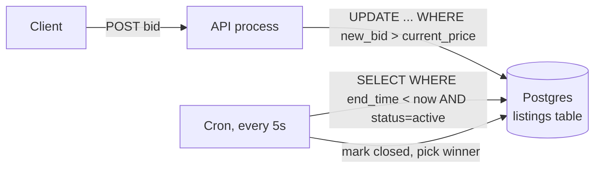
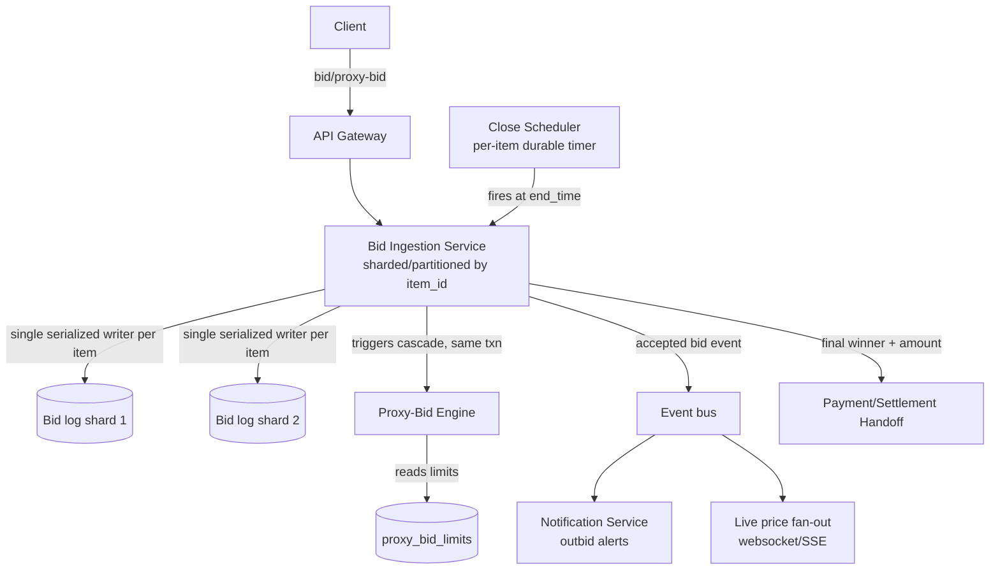

# Design: Online Auction (eBay-style bidding)

**Difficulty:** Senior | **Time:** 60–75 minutes

!!! note "Instructions"
    Cover each section and work it yourself first. Before every "Version N" reveal there is a `???` box — commit to an answer before you open it. This exercise is less about storage layout and more about **ordering under time pressure**: get the design right for the last 10 seconds of a hot auction, and the rest is easy.

---

## 1. Problem Statement

Design a service like eBay: sellers create listings, buyers place competing bids in real time, and the highest bid at a fixed close time wins. Two properties make this harder than most CRUD systems:

1. **Strict per-item bid ordering under concurrency.** A bid is valid only if it exceeds the current highest bid *at the moment it is evaluated*. Two bidders submitting near-simultaneously on the same popular item must be resolved deterministically — no double-acceptance, no lost higher bid, no ambiguity about who was actually leading when.
2. **A hard time boundary with a fairness problem baked in.** The auction closes at an exact `end_time`. Bids arriving in the final second are exactly as valid as bids from an hour earlier, but network jitter means a bidder with worse latency can have their *earlier, higher* intent arrive *after* a *later, lower* bid from someone closer to your servers — a race your system, not the network, is responsible for resolving fairly. This is the classic "sniping" problem: bidders wait until the last moment to bid, and an outbid buyer needs a real chance to respond, or the auction becomes a latency contest instead of a price contest.

Do not start with "just use a database with a highest-bid column." That handles requirement 1 badly and requirement 2 not at all. Decide first what "fair" and "final" actually mean before drawing boxes.

---

## 2. Clarifying Questions

??? question "What questions should you ask?"
    - **Auction format:** English (ascending, open) auction, or sealed-bid? (Assume English/open — it's what makes this exercise hard.)
    - **Anti-sniping:** Does the auction extend if a bid comes in during the last N seconds (anti-sniping)? By how much, and is there a cap on total extensions?
    - **Proxy bidding:** Can a bidder set a max and let the system auto-increment on their behalf (eBay's "automatic bidding"), or is every bid a manual, explicit action?
    - **Bid increments:** Fixed minimum increment, or seller-defined? Does a bid need to beat the current price by at least that increment, or just be higher?
    - **Reserve price:** Hidden minimum below which the item doesn't sell even if bid on?
    - **Currency of truth:** Is "current highest bid" something buyers see live (websocket push), or do they poll?
    - **What happens to losers' funds/holds?** Are bids authorization holds (like a credit card pre-auth) or just numbers until close?
    - **Scale:** Concurrent live auctions, bids/second on a single hot item in its closing seconds, listings created/day?
    - **Consistency need:** Can "current price" shown to a browsing user lag by a second, while the accept/reject decision on an actual bid submission cannot?

---

## 3. Functional Requirements

- Create a listing (title, description, images, starting price, reserve, `start_time`, `end_time`, bid increment rule)
- Place a bid on an active listing; reject if not strictly higher than current price (+ increment)
- View current price and full bid history for an item
- Support proxy/automatic bidding (bidder sets a max; system bids the minimum needed to stay ahead, up to that max)
- Close the auction at `end_time` and determine the winner, with anti-sniping extension if configured
- Notify outbid bidders in near-real-time so they can respond before close

## 4. Non-Functional Requirements

| Property | Requirement | Reasoning |
|----------|-------------|-----------|
| Bid acceptance latency | < 300ms p99 (accept/reject decision) | Bidders in a closing-second war feel every round trip; slow decisions themselves become an unfairness source |
| Durability ("no lost bid") | An accepted bid must never silently disappear | It's money and a legal/dispute record — "the system said I won" has to be provably true |
| Ordering correctness | 100% strict — no bid accepted that was not, at evaluation time, higher than the then-current price | This is the one place "eventually consistent" is unacceptable |
| Close precision | Auction closes within a tight, bounded window of `end_time` (not "eventually, whenever a cron runs") | A close that fires seconds late/early can flip the winner |
| Availability | 99.95%; reads (browsing) degrade before writes (bidding) do | A stale price display is annoying; a bid that silently fails to submit is a lost sale |
| Scale | 50K live auctions, 5K bids/sec on a single hot item in its final 10 seconds, 200K new listings/day | Concurrency is concentrated, not uniform |

!!! tip "Interview Insight 🎯"
    Say out loud: "the hard part isn't storing a number, it's that at T-1 second, dozens of clients each believe they're about to become the highest bidder, and the network delivers their attempts to me out of true chronological order." That framing is what separates this from a CRUD "update the max" exercise.

---

## 5. Capacity Estimation

```
Listings:
  200K new listings/day → ~2.3/s average, negligible write load

Live auctions:
  50K concurrently active auctions at peak

Bid traffic (steady state):
  Most auctions get a handful of bids over days — near-zero load
  Average across the platform: ~50 bids/second aggregate

Bid traffic (hot-item-closing-second spike):
  A popular item (rare sneaker drop, estate item) draws thousands of watchers
  In the last 10 seconds: up to 5,000 bid attempts on ONE item_id
  → 500 bids/sec on a single row/partition, for ~10 seconds
  This is the number that breaks a naive design — not the platform aggregate.

Reads:
  Browsing + live price polling/websocket: ~50K concurrent viewers on hot items
  Price update fan-out: 50K clients × 1 push per accepted bid ≈ bursty, but
  independent of write-path correctness (can be eventually consistent)

Bid log storage:
  Avg 20 bids/auction × 200K auctions/day × 200 bytes/bid ≈ 800 MB/day
  Trivial to store forever — this is the actual system of record, keep it all.
```

!!! abstract "Mental Model"
    You are not building "a number that goes up." You are building a **single-writer, strictly-ordered append log per item**, with a fan-out read path for everyone watching, and a **precise alarm clock** per item that must fire once, on time, per auction.

---

## 6. API Design

```
POST /api/v1/listings
Request:  { "title": "...", "starting_price": 10.00, "reserve_price": 50.00,
            "increment_rule": "min_increment", "start_time": "...", "end_time": "...",
            "anti_snipe_window_s": 30, "anti_snipe_extension_s": 60, "max_extensions": 10 }
Response: { "item_id": "abc123", "status": "scheduled" }

POST /api/v1/items/{item_id}/bids
Request:  { "amount": 105.00, "bidder_id": "u_42" }
Response 201: { "bid_id": "b_9981", "accepted": true, "current_price": 105.00, "sequence": 4821 }
Response 409: { "accepted": false, "reason": "bid_too_low", "current_price": 106.50 }
  -- 409, not 200-with-flag: a rejected bid is a distinct outcome the client must branch on

POST /api/v1/items/{item_id}/proxy-bids
Request:  { "max_amount": 150.00, "bidder_id": "u_42" }
Response: { "current_price": 105.00, "you_are_leading": true }
  -- system will auto-bid on the user's behalf up to max_amount as others bid

GET  /api/v1/items/{item_id}/price
Response: { "current_price": 105.00, "leading_bidder": "u_42" (masked), "end_time": "...", "extended": false }

GET  /api/v1/items/{item_id}/bids?limit=50
Response: [ { "bid_id": "b_9981", "amount": 105.00, "sequence": 4821, "ts": "...", "bidder": "u_4**" }, ... ]

WS   /ws/items/{item_id}   -- push current_price + outbid events to watchers

POST /internal/items/{item_id}/close   -- invoked by the close-scheduler, not clients
```

!!! warning "Production Trap ⚠️"
    Returning `200 OK` with `{accepted: false}` buried in the body invites clients to skip error handling. A rejected bid is functionally a 409 Conflict — the resource state (`current_price`) moved out from under the request. Make the client's happy-path/unhappy-path branch impossible to miss.

---

## 7. Data Model — the bid log is the source of truth, not a cache of it

A naive design stores only `current_highest_bid` on the listing row and overwrites it per bid. That throws away exactly the information you need most: who bid what, when, in what order, and whether a disputed "I was outbid unfairly" claim is true. Keep every bid, forever, as an append-only log.

```sql
CREATE TABLE listings (
    item_id         VARCHAR(20) PRIMARY KEY,
    seller_id       VARCHAR(20) NOT NULL,
    title           VARCHAR(200) NOT NULL,
    starting_price  NUMERIC(12,2) NOT NULL,
    reserve_price   NUMERIC(12,2),
    current_price   NUMERIC(12,2) NOT NULL,   -- DERIVED cache of the log's max; never the source of truth
    leading_bid_id  BIGINT,
    start_time      TIMESTAMPTZ NOT NULL,
    end_time        TIMESTAMPTZ NOT NULL,
    anti_snipe_window_s INT DEFAULT 30,
    anti_snipe_extension_s INT DEFAULT 60,
    extensions_used INT DEFAULT 0,
    max_extensions  INT DEFAULT 10,
    status          VARCHAR(16) NOT NULL,     -- scheduled | active | closing | closed | cancelled
    INDEX idx_end_time_status (end_time, status)
);

-- Append-only. Never UPDATEd, never DELETEd. This is the legal/audit record.
CREATE TABLE bids (
    bid_id       BIGSERIAL PRIMARY KEY,
    item_id      VARCHAR(20) NOT NULL,
    bidder_id    VARCHAR(20) NOT NULL,
    amount       NUMERIC(12,2) NOT NULL,
    sequence     BIGINT NOT NULL,          -- server-assigned, monotonic PER ITEM (not global)
    is_proxy_bid BOOLEAN DEFAULT FALSE,
    server_ts    TIMESTAMPTZ NOT NULL,     -- authoritative time; never trust client clocks
    accepted     BOOLEAN NOT NULL,         -- rejected bids are logged too, for dispute resolution
    reject_reason VARCHAR(32),
    UNIQUE (item_id, sequence),
    INDEX idx_item_seq (item_id, sequence)
);

CREATE TABLE proxy_bid_limits (
    item_id     VARCHAR(20) NOT NULL,
    bidder_id   VARCHAR(20) NOT NULL,
    max_amount  NUMERIC(12,2) NOT NULL,
    created_at  TIMESTAMPTZ NOT NULL,
    PRIMARY KEY (item_id, bidder_id)
);
```

??? question "Why log rejected bids and every proxy increment, not just the winning path?"
    Three reasons, all specific to auctions: **dispute resolution** ("I bid $200 at 3:59:58, why does the winner's bid show $195?" — you need the full sequence, including what was rejected and why, to answer this credibly). **Proxy bidding history** — a proxy bid isn't one event, it's a *policy* ("bid up to $200") that generates multiple log entries as it responds to competitors; without the full trace you can't show a user *why* the system spent their budget the way it did. **Audit/compliance** — auction fraud investigations (shill bidding, bid retraction abuse) need the complete, immutable timeline, not a derived summary that already discarded the losing bids.

---

## 8. Version 1 — simplest thing that works

Single Postgres row per item holding `current_highest_bid`. Accept a bid with a conditional update; a cron sweeps for closed auctions.



```python
def place_bid(item_id: str, bidder_id: str, amount: float) -> dict:
    row = db.execute("""
        UPDATE listings
        SET current_price = %s, leading_bidder = %s
        WHERE item_id = %s AND %s > current_price AND status = 'active'
        RETURNING current_price
    """, amount, bidder_id, item_id, amount)
    if row:
        return {"accepted": True, "current_price": row.current_price}
    return {"accepted": False, "reason": "bid_too_low_or_closed"}

# separate cron process, every 5 seconds
def sweep_closed_auctions():
    items = db.query("SELECT item_id FROM listings WHERE end_time < now() AND status = 'active'")
    for item in items:
        db.execute("UPDATE listings SET status = 'closed' WHERE item_id = %s", item.item_id)
        notify_winner(item.item_id)
```

The conditional `UPDATE ... WHERE amount > current_price` is atomic — Postgres row locking genuinely prevents two bids from both "winning" the same comparison. Ship this for low-traffic listings and find the real bottleneck before adding anything.

---

## 9. Identify the bottleneck

???+ question "A popular item is closing. What breaks in the last 10 seconds, and separately, what's wrong with the cron?"
    - **Arrival-order ≠ intent-order.** The `UPDATE ... WHERE amount > current_price` is *correctness*-safe (no two bids both win, no bid lost by a lost update) but it resolves ties by **request arrival time at your server**, not true chronological bid intent. A bidder on a fast connection who decided to bid *second* can still have their request *arrive* first and win — because network jitter reordered two near-simultaneous submissions. Compare-and-swap alone doesn't know or care what "really" happened first; it only knows what showed up first. That's a fairness bug, not a concurrency bug, and it's invisible in your logs because you overwrote the losing bid's evidence.
    - **You only kept the winner.** With just `current_price` on the row, you cannot even reconstruct what happened in that final second to investigate a fairness complaint. There's no append-only trail.
    - **The cron close is imprecise.** A 5-second polling interval means the auction can close *up to 5 seconds late or early* relative to its stated `end_time`. Late close: a bid placed after the true end_time still gets accepted — the seller and losing bidders are cheated of a clean cutoff. Early-ish effective close (if the cron just missed a bid landing microseconds before its own scan): a legitimate last-second bid is evaluated against a row already marked closed. When money and a contractual close time are involved, "close enough" is not a real answer.
    - **No anti-sniping at all.** Nothing stops the entire strategy space from collapsing into "everyone waits until 0.1 seconds before end_time," which the polling cron makes *worse*, not better, since your imprecision window overlaps exactly the window bidders are trying to snipe into.

---

## 10. Version 2 — append-only bid log as the source of truth

Every bid is written to the log with a server-assigned, per-item monotonic sequence number and an authoritative server timestamp. "Current price" is *derived* by querying the max of the log, not stored-and-raced independently. Bid acceptance becomes a conditional insert against the log's current max — same atomicity guarantee as V1's row update, but now every attempt (accepted or not) is durable and orderable. Auction close moves from polling to a precise per-item timer, with anti-snipe extension handled as a rule evaluated at insert time.

```mermaid
graph TD
    Client -->|POST bid| API[Bid API]
    API -->|1: INSERT ... WHERE amount > (SELECT MAX(amount) FROM bids WHERE item_id=X)| PG[(Postgres\nbids log, per-item serialized)]
    API -->|2: on accept, check anti-snipe window| Sched[Close Scheduler]
    Sched -->|reschedule timer if within window| Sched
    Sched -->|fires exactly at end_time| Close[Close handler]
    Close -->|SELECT MAX by sequence, mark closed, atomically| PG
```

```python
def place_bid(item_id: str, bidder_id: str, amount: float) -> dict:
    with db.transaction():                      # single serialization point per item
        listing = db.execute(
            "SELECT end_time, status FROM listings WHERE item_id=%s FOR UPDATE", item_id
        )
        if listing.status != 'active' or now() >= listing.end_time:
            return log_and_reject(item_id, bidder_id, amount, "closed")

        current_max = db.execute(
            "SELECT COALESCE(MAX(amount),0) AS m FROM bids WHERE item_id=%s AND accepted=true", item_id
        ).m
        if amount <= current_max:
            return log_and_reject(item_id, bidder_id, amount, "too_low")

        seq = next_sequence(item_id)             # monotonic counter, per item
        db.execute("""
            INSERT INTO bids (item_id, bidder_id, amount, sequence, server_ts, accepted)
            VALUES (%s,%s,%s,%s, now(), true)
        """, item_id, bidder_id, amount, seq)
        db.execute("UPDATE listings SET current_price=%s, leading_bid_id=%s WHERE item_id=%s",
                    amount, seq, item_id)

        # anti-sniping: extend if this bid landed inside the closing window
        remaining = (listing.end_time - now()).total_seconds()
        if remaining < listing.anti_snipe_window_s and listing.extensions_used < listing.max_extensions:
            new_end = now() + timedelta(seconds=listing.anti_snipe_extension_s)
            db.execute("UPDATE listings SET end_time=%s, extensions_used=extensions_used+1 WHERE item_id=%s",
                        new_end, item_id)
            close_scheduler.reschedule(item_id, new_end)

        return {"accepted": True, "current_price": amount, "sequence": seq}
```

The `SELECT ... FOR UPDATE` on the listing row is what gives you strict ordering: it's a **single serialization point per item**, so two bidders racing on the same item are forced through one at a time, in true database-commit order — the fairness question (who bid "first") is now answered by an authoritative server timestamp and sequence number instead of by whichever request happened to reach the socket first. That's still not perfect physical-world fairness (server receive time is still a proxy for "when the bidder clicked"), but it is now *provable, logged, and consistent*, which is the bar auctions actually need — you can show a disputing bidder the exact sequence.

**Close precision:** replace the cron with a scheduled timer per auction (a durable job scheduler — e.g. a per-item delayed job in a system like a Redis-backed timer wheel, SQS delay queues, or a dedicated scheduler service) that fires once at `end_time`, invoking `/internal/items/{item_id}/close` directly rather than being discovered by a periodic scan. Anti-snipe extensions reschedule that same timer forward rather than waiting for the next poll.

---

## 11. Identify the next bottleneck

???+ question "The append-only log and precise scheduler are in. What breaks next on a genuinely hot item?"
    - **Unbounded anti-snipe extension.** If a popular auction keeps drawing a bid inside its last `anti_snipe_window_s` every time it extends, the close can theoretically never happen — a bidding war with determined participants could extend forever, which is bad for UX (nobody can plan around it) and bad for your scheduler (an "eventually closes" auction is an operational anomaly). `max_extensions` in the schema above is exactly this cap — but you have to *decide and communicate* the cap, not just add the column. eBay's real behavior (fixed extension count or a hard outer close time) is a product decision to surface, not hide in code.
    - **Proxy bidding is its own concurrency problem, layered on top.** A proxy bid isn't a single log entry — it's a standing policy ("bid up to $200 for me") that the system executes reactively as *other* bids come in. Two proxy bidders can trigger a cascade: bidder A's proxy (max $150) responds to bidder B's manual bid, which triggers bidder B's own proxy (max $180) to respond back, and so on, potentially in the same request if you're not careful — the system must resolve the full proxy cascade to a stable equilibrium (both proxies exhausted or one wins outright) **inside the same transaction/serialization point** as the triggering bid, or you reopen the exact race condition the log was built to close. A proxy engine that reads `current_max`, computes a counter-bid, and writes it as a *separate* transaction can itself be raced by a concurrent manual bid landing in between.
    - **Edge case: a user's own proxy already maxed out.** If bidder A's proxy limit is $150 and the price is already at $150 (their own last proxy response), a new manual bid of $151 from someone else must *not* trigger A's proxy again — A is exhausted, not "always respond." The proxy engine must check `amount <= my_max` strictly, or you get an infinite bidding loop between two exhausted-but-still-firing proxies.

---

## 12. Version 3 — production architecture



- **Bid ingestion sharded by `item_id`.** Every item's bid stream has exactly one serialization point (the shard owning that item), so a hot item's bidding war contends only with itself — it never slows down bids on unrelated items. This is the direct fix for the "500 bids/sec on one item" spike: it's isolated to one shard/partition, sized for that load, while the other 49,999 auctions sit on shards doing almost nothing.
- **Proxy-bid engine runs inside the ingestion path's transaction**, not as a downstream async consumer — the cascade-resolution problem from the last bottleneck box requires it to see and react to the same serialization point a manual bid uses, or you're back to a race.
- **Close scheduler is a durable, per-item timer**, not a poller — see the reasoning in Version 2. Cross-reference: this is the same *why-not-cron* argument as scheduled jobs in other exercises — precision matters when the trigger itself is customer-facing.
- **Notification service** pushes outbid alerts so a losing bidder has a real chance to respond before close — this is what makes anti-sniping *meaningful*; extending the clock is pointless if the outbid party never finds out. See [Notification System](notification-system.md) for the delivery-guarantee design (push vs poll, retry, fan-out at scale).
- **Settlement handoff** on close hands the winning bid off to payment capture — see [Payment Processing](payment-processing.md) for the idempotency and hold-capture mechanics; the auction service's job ends at "here is the authoritative winner and amount," not at moving money.

---

## 13. Failure analysis

=== "Bid accepted but log write fails before ack"
    The `INSERT` into `bids` commits, but the process crashes (or the network drops) before the `200`/`201` response reaches the client. From the bidder's perspective: did their bid count? **Mitigation:** the client must retry with an idempotency key (`bid_id` generated client-side, or a request nonce); the ingestion service checks `(item_id, bidder_id, idempotency_key)` before inserting, so a retried request that actually succeeded returns the *original* accepted result instead of double-bidding or erroring. Never treat "no ack received" as "didn't happen" on either side — the log is the truth, the ack is just a notification of it.

=== "Close-scheduler fails to fire exactly at end_time"
    The timer service crashes, or the node holding a specific item's scheduled job dies. **Mitigation:** durable scheduler backed by persistent storage (not in-memory timers) — on recovery, replay any `end_time`s that passed during the outage immediately, oldest first. Belt-and-suspenders: a low-frequency reconciliation sweep (every 30s, *not* the primary close mechanism) that catches any `status=active AND end_time < now() - grace_period` as a safety net, paged as an incident since it means the primary path failed, not treated as normal operation.

=== "Proxy-bid engine loops on an already-exhausted limit"
    Bidder A's proxy max is $150, already spent. A new manual bid of $151 comes in. A buggy proxy engine re-evaluates A's standing order and, due to a stale read of "current max," thinks it still needs to respond, firing a bid it cannot actually back. **Mitigation:** proxy responses must be strictly `next_bid <= max_amount`, computed from the *just-written* log state inside the same transaction, and a proxy that would need to exceed its own max is marked exhausted (not retried on every subsequent bid) — write an `exhausted_at` marker so you're not repeatedly deciding the same "can I respond?" question inefficiently on every future bid on that item.

=== "Notification service down during a hot auction's final seconds"
    Bidder A gets outbid at T-8s but never receives the alert because the notification service is degraded; they don't respond, and lose an auction they'd have contested. **Mitigation:** this is a fairness failure, not just a UX one — treat notification-service health as a signal the close-scheduler/anti-snipe system can consult: if outbid-alert delivery latency is elevated during an active auction's closing window, widen the anti-snipe window automatically (more time compensates for slower notice) rather than closing on schedule against bidders who structurally couldn't have responded in time. Log notification delivery status per bid so post-hoc disputes ("I never got alerted") are verifiable, not he-said-she-said.

---

## 14. Consistency considerations

- **Bid acceptance needs strong consistency and strict ordering, per item — not eventual.** The core requirement ("a bid is valid only if higher than the current highest bid at evaluation time") is a linearizability requirement: every accept/reject decision must be made against a value that reflects every previously accepted bid, with no window where two concurrent bids could each be evaluated against a stale price and both get accepted. Eventual consistency here doesn't mean "slightly stale," it means "money changes hands based on a fiction."
- **Sharding by `item_id` is what makes strong-per-item consistency tractable at scale.** You don't need one global total order over all bids on the platform — you need one total order *per item*. Partitioning by `item_id` gives each item a single serialization point (one shard, one row lock, one queue — whichever mechanism you pick) while different items don't contend with each other at all. This is why 500 bids/sec concentrated on one hot item is a sizing problem for *that shard*, not a platform-wide bottleneck: the other 49,999 concurrently active auctions are unaffected.
- **Everything else can be eventually consistent.** The `current_price` shown to a browsing user, the websocket price feed, the "trending auctions" list — all fine to lag by hundreds of milliseconds. Draw this line explicitly in an interview: strong consistency is expensive and you're paying for it only where the requirement actually demands it (the accept/reject decision), not everywhere the word "bid" appears.
- **Read-your-writes for the bidder who just placed a bid** — return the accepted state directly in the `POST /bids` response rather than making the client re-poll `GET /price`, which might briefly lag behind their own write.

---

## 15. Observability

```
Metrics:
  bid_accept_latency_p50/p99{item_id_bucket=hot|normal}
  bid_reject_rate{reason=too_low|closed|duplicate}
  bid_log_write_failures
  active_auctions_extended_count / extensions_used_histogram
  close_scheduler_fire_delta_ms (actual fire time - scheduled end_time)
  proxy_engine_cascade_depth (bids triggered per incoming bid)
  notification_delivery_latency_p99{during=closing_window}
  hot_shard_bids_per_sec (top-K item_ids by shard load)

Alerts:
  close_scheduler_fire_delta_ms > 500ms   (close precision SLO breach)
  bid_accept_latency_p99 > 300ms
  bid_log_write_failures > 0              (durability incident, page immediately)
  proxy_engine_cascade_depth > 20         (possible loop, investigate before it's a fairness incident)
  extensions_used == max_extensions       (auction hit the anti-snipe cap, verify close fires on schedule)
```

---

## 16. Cost analysis

```
Bid log storage (800 MB/day, kept forever, cheap append-only writes):  ~$40/month (grows slowly, retention is an asset not a cost)
Bid ingestion compute (sharded, sized for aggregate + hot-shard headroom): ~$600/month
Durable scheduler (per-item timers, 50K concurrent + churn):           ~$150/month
Notification fan-out (websocket connections, 50K concurrent watchers on hot items): ~$300/month
Postgres (listings + proxy limits, small hot tables):                  ~$250/month primary + replica
Total:                                                                  ~$1,340/month

Cost lever: most of the 50K "live" auctions have near-zero bid traffic —
  autoscale shard capacity per-item based on recent bid rate, not a flat
  per-item reservation, or you're paying hot-item capacity for cold items.
```

---

## 17. Alternative architectures

=== "Vickrey / sealed-bid auction"
    Bidders submit one hidden bid; highest wins, often pays the second-highest price. No real-time bidding war, no sniping problem, no anti-snipe mechanism needed at all — this is a fundamentally different, *easier* system (just a deadline and a reveal step). Worth naming explicitly in an interview: if the product actually wanted sealed-bid, most of this design's complexity (append-only ordering, proxy engine, anti-snipe) evaporates. The hard parts here exist *because* the product chose English/open auction.

=== "English open-outcry (this design)"
    Bidders see the current price and react to each other in real time. Maximizes engagement and final price (competitive psychology) but creates every problem this exercise solves: ordering races, sniping, the need for anti-snipe extensions and proxy bidding to keep it fair and usable.

=== "Centralized sequencer per item vs. distributed consensus"
    This design uses a single serialization point per item (one DB row/shard owning that item's writes) — effectively a lightweight centralized sequencer, acceptable because each item's write volume, even at 500 bids/sec, is well within what one shard can serialize. A distributed-consensus approach (Raft/Paxos over multiple nodes agreeing on bid order) buys survivability if that one shard's host dies mid-auction, at the cost of added latency per bid (consensus round trip) and real implementation complexity. Justify the extra cost only if a single-shard-host failure mid-auction is unacceptable to the business — for most auction platforms, "failover to a warm standby with the log already replicated" is cheaper and good enough.

---

## 18. Staff Engineer Extensions

=== "100× traffic (a viral item closing)"
    5,000 bids/sec on one item becomes 500,000/sec. A single shard's row lock cannot serialize that. You need to either (a) batch and coalesce: accept bids into a small in-memory queue per item with a dedicated single-threaded worker draining it against the log, amortizing lock overhead, or (b) rate-limit *effective* bid rate per bidder client-side/at the gateway (a genuine human cannot meaningfully out-click 500K/sec — the load is bots/scripts) and reject excess before it reaches the serialization point at all. Say explicitly: true strict ordering at 500K/sec on one logical item is a hard physical limit on any single serialization point — the real fix is treating it as an abuse/rate-limit problem, not a bigger-lock problem.

=== "Multi-region (a global auction site)"
    Where does the authoritative sequencer for one item's bids live? It must live in exactly one region (the item's "home region," chosen at listing creation, e.g. seller's region) — you cannot have two regions each serializing the same item's bids independently without reconciling conflicting orders after the fact, which reopens the exact fairness problem this whole design solves. Bidders in other regions pay cross-region latency to reach that sequencer. **This is a real fairness cost**: a bidder in Tokyo bidding on a US-home-region item is structurally slower to have their bid evaluated than a US bidder, through no fault of their own — worth surfacing to product as an explicit trade-off (accept it, or offer a longer anti-snipe window to compensate, or don't route all traffic through one global winner-take-all item and instead accept regional listings only).

=== "Data residency"
    EU bidders' personal data (bidder identity, payment hold info) must stay in EU storage even if the item's authoritative bid sequencer lives in the US (home region of the seller). Split the bid log's *ordering-relevant* fields (amount, sequence, timestamp — not obviously personal) from bidder PII, similar to the metadata/content split in the pastebin exercise: the ordering log can replicate globally for read purposes, while bidder identity resolution stays region-pinned and is joined in only when needed, behind an access-controlled service boundary.

=== "Zero-downtime migration of the bid-ordering mechanism"
    Migrating from, say, a Postgres-row-lock sequencer to a sharded log-based system (or vice versa) mid-flight, without breaking any *currently active* auction. Never migrate an auction that's mid-flight — gate the migration at listing-creation time: new listings created after a cutover point use the new mechanism; existing active auctions finish out their lifecycle on the old one. Dual-run only the *read* path (serve current price from both, compare) to validate correctness before cutover; never dual-write the accept/reject decision itself across two mechanisms, since that reintroduces exactly the two-serialization-points race this design exists to prevent.

---

## 19. Interview follow-ups

1. **How would you design the anti-sniping mechanism, and why does it need a cap?** Every accepted bid inside the last `anti_snipe_window_s` extends `end_time` by `anti_snipe_extension_s`, up to `max_extensions`. Without a cap, a determined pair of bidders (or a bug) can make the auction extend indefinitely — bad for planning, bad for the scheduler's assumption that every auction eventually closes. Say the cap explicitly and that it's a product decision, not an implementation detail.
2. **How do you prevent shill bidding (seller bidding on their own item to drive up price)?** The append-only log is what makes this detectable after the fact — audit for bidder accounts linked to the seller (device fingerprint, payment method overlap, IP) bidding on their own listings; block at the ingestion layer if a bidder_id matches the seller_id outright, and flag suspicious patterns (a low-history account repeatedly bidding just above the reserve then disappearing) for review.
3. **What if two bids for the exact same amount arrive "simultaneously"?** They can't both be accepted under strict `>` comparison — the second one to reach the serialization point (row lock / shard writer) is rejected as `too_low` even if the amounts are equal, since it wasn't *higher* than the now-current price set by the first. This is why the single-serialization-point design matters: there's no ambiguity, because there's no moment where both requests are evaluated "at the same time" — the lock forces a total order even for ties.
4. **How would you test the ordering guarantee itself?** Inject synthetic concurrent bid storms (hundreds of near-simultaneous requests with known intended order) against a single item and assert: exactly the bids that were truly higher than the running max at their true evaluation point are accepted, the final price matches the true maximum submitted, and the log's sequence numbers are gap-free and monotonic. Chaos-test the close scheduler by killing the node holding a scheduled timer mid-window and asserting it still fires within SLO after recovery.

---

## Self-Assessment

- [ ] I can explain why request-arrival-order and true-bid-intent-order are different things, and why that matters at scale
- [ ] I can justify the append-only bid log over a single mutable "current highest bid" column, with the dispute-resolution/proxy/audit reasoning
- [ ] I can explain why the close mechanism must be a precise timer, not a polling cron, and what "up to N seconds late" actually costs
- [ ] I can describe the anti-sniping extension mechanism and why it needs a hard cap
- [ ] I can explain why sharding by item_id gives strong per-item consistency without a global bottleneck
