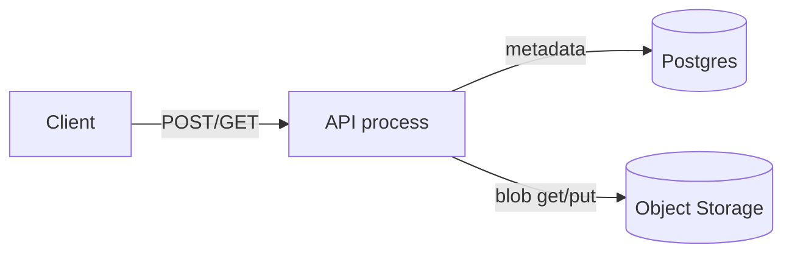
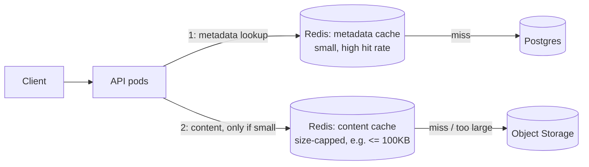
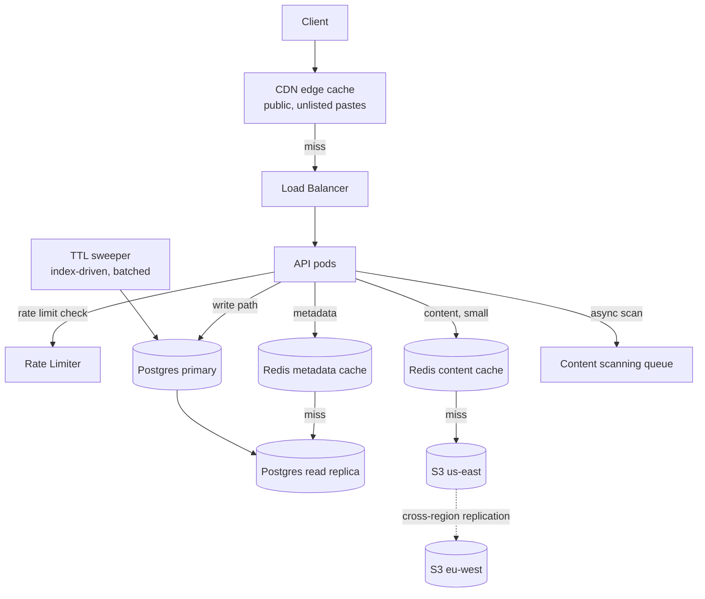

# Design: Pastebin

**Difficulty:** Foundation | **Time:** 45–60 minutes

!!! note "Instructions"
    Cover each section and work it yourself first. Before every "Version N" reveal there is a `???` box — commit to an answer before you open it. The value of this exercise is not the diagram; it's predicting *why* the previous version breaks.

---

## 1. Problem Statement

Design a service like Pastebin: a user pastes text, gets back a short URL, and anyone with that URL can read the text back. Optional: expiration, syntax highlighting, private pastes, burn-after-read.

This looks like the URL shortener. It is not. A shortened URL points *away* from you; a paste's content *is* your storage problem. Do not reuse the shortener's architecture without checking which assumptions still hold.

---

## 2. Clarifying Questions

??? question "What questions should you ask?"
    - **Size:** What's the max paste size — 1 KB snippets, or multi-MB log dumps?
    - **Lifetime:** Do pastes expire by default? Can the user set a TTL or "burn after read"?
    - **Mutability:** Once created, can a paste be edited? (Usually no — simplifies caching enormously.)
    - **Visibility:** Public (guessable/listed) vs unlisted (only via link) vs private (auth required)?
    - **Read pattern:** Mostly read-once-and-done, or do popular pastes (a stack trace shared in a channel) get reread thousands of times?
    - **Abuse:** Do we scan content (malware, credentials, illegal content)? Who's liable for what's hosted?
    - **Scale:** Pastes/day, average size, read:write ratio?

---

## 3. Functional Requirements

- Create a paste (text body, optional title, optional TTL) → get a short URL
- Retrieve a paste by its short URL
- Optional: custom expiration, burn-after-read, syntax highlighting hint, private (auth-gated) pastes

## 4. Non-Functional Requirements

| Property | Requirement | Reasoning |
|----------|-------------|-----------|
| Latency | Read < 100ms p99, write < 200ms p99 | Read is the common case; must feel instant |
| Availability | 99.9% reads (writes can tolerate brief 5xx more than reads) | A broken link shared in a bug report is worse than a slow paste form |
| Read/Write ratio | ~10:1 (lower than URL shortener — pastes are often read once, by one person) | Changes the caching bet vs. the shortener |
| Scale | 1M pastes/day, avg 10 KB, p99 size 1 MB | Storage-bound, not request-bound |
| Durability | Paste must survive as long as its TTL says it will — no silent loss | It's the *only* copy in most cases |

!!! tip "Interview Insight 🎯"
    The URL shortener's whole design leans on "the object is tiny (a URL), so keep it in the hot path's database row." Here the object can be a **megabyte**. That single fact — not access pattern — is what pulls the architecture apart from the shortener's. Say this out loud early; it tells the interviewer you're not pattern-matching from memory.

---

## 5. Capacity Estimation

```
Writes:
  1M pastes/day → ~12 writes/second average, ~120/s at 10× peak

Storage:
  Avg paste: 10 KB, p99: 1 MB, max: 10 MB (assume a hard cap)
  1M pastes/day × 10 KB avg ≈ 10 GB/day ≈ 3.65 TB/year
  This does NOT fit "cache everything" the way 30 GB of URLs did.

Reads:
  10:1 ratio → ~10M reads/day ≈ 115 reads/second average, ~1,150/s peak
  Mostly cold (read-once) — cache hit rate will be LOWER than a URL shortener's.

Bandwidth:
  Write: 120/s × 10 KB avg ≈ 1.2 MB/s (bursty up to 120 x 10MB if abused)
  Read:  1,150/s × 10 KB avg ≈ 11.5 MB/s
```

!!! tip "Interview Insight 🎯"
    Two numbers should change your design versus the URL shortener: **3.65 TB/year** (blob storage, not a DB row) and a **lower cache hit rate** (read-once objects don't stay hot). If you propose "cache everything in Redis" here, an interviewer should stop you — that's copying the wrong exercise's answer.

---

## 6. API Design

```
POST /api/v1/pastes
Request:  { "content": "...", "title": "optional", "ttl_seconds": 86400, "visibility": "unlisted" }
Response: { "paste_id": "a1B2c3D", "url": "https://paste.io/a1B2c3D", "expires_at": "..." }
Status: 201 Created, 413 Payload Too Large if over the size cap

GET /{paste_id}
Response: raw text or rendered HTML page
Status: 200, 404 (not found or expired), 410 Gone (burned)

DELETE /api/v1/pastes/{paste_id}   -- creator only, requires ownership token or auth
```

!!! note "Ownership without accounts"
    Anonymous pastes still need a delete/edit path. Return a one-time **ownership token** in the create response (not derivable from `paste_id`) and require it for mutation. Losing the token means losing control — that's an acceptable trade for not forcing signup.

---

## 7. Data Model — split metadata from content

The URL shortener kept everything in one row because a URL is ~200 bytes. A paste can be 10 MB. Putting that in a relational row bloats indexes, wrecks buffer-pool cache efficiency, and makes every backup/replication cycle drag megabytes of blob through a system built for rows.

```sql
-- Metadata: small, hot, indexed. Lives in a fast KV/relational store.
CREATE TABLE pastes (
    id            VARCHAR(12) PRIMARY KEY,
    owner_token   VARCHAR(64),          -- hashed
    title         VARCHAR(200),
    size_bytes    INT NOT NULL,
    blob_key      VARCHAR(128) NOT NULL, -- pointer into object storage
    visibility    VARCHAR(16) DEFAULT 'unlisted',
    burn_after_read BOOLEAN DEFAULT FALSE,
    created_at    TIMESTAMP DEFAULT NOW(),
    expires_at    TIMESTAMP,
    INDEX idx_expires (expires_at)
);
```

```
Content: large, write-once, read-rarely-hot. Lives in object storage (S3/GCS), keyed by blob_key.
  s3://pastes-bucket/{shard}/{blob_key}
```

??? question "Why not store content in Postgres as TEXT/BLOB and skip the split?"
    You can, up to a point — it works for the shortener because objects are tiny. Here: large rows fragment the buffer pool, `pg_dump`/replication now moves gigabytes of blob traffic every cycle, and a hot metadata table (indexes, `expires_at` scans for TTL cleanup) is competing for cache with cold blob bytes. Splitting means the metadata table stays small enough to live mostly in memory, and blob storage handles what it's built for: cheap, durable, infinitely scalable byte storage.

---

## 8. Version 1 — simplest thing that works

Single API process, Postgres for metadata, S3 for content. No cache yet.



```python
def create_paste(content: bytes, ttl_s: int) -> str:
    paste_id = generate_id()  # base62, 7 chars, same scheme as URL shortener
    blob_key = f"{paste_id[:2]}/{paste_id}"   # prefix shard avoids hot S3 partitions
    s3.put_object(Bucket="pastes", Key=blob_key, Body=content)
    db.execute(
        "INSERT INTO pastes (id, blob_key, size_bytes, expires_at) VALUES (%s,%s,%s,%s)",
        paste_id, blob_key, len(content), now() + ttl_s
    )
    return paste_id

def read_paste(paste_id: str) -> bytes:
    row = db.query_one("SELECT blob_key, expires_at FROM pastes WHERE id=%s", paste_id)
    if not row or row.expires_at < now():
        raise NotFound()
    return s3.get_object(Bucket="pastes", Key=row.blob_key)["Body"].read()
```

This handles the average case fine. **Do not add a cache yet — find the actual bottleneck first.**

---

## 9. Identify the bottleneck

???+ question "At 1,150 reads/second, where does V1 actually hurt, and where does it not?"
    - **Small pastes (< 50 KB, the majority):** a Postgres lookup + an S3 GET *each* costs a network round trip. Two round trips per read is the real latency tax, not throughput — S3 handles 1,150 rps trivially.
    - **A viral paste** (someone shares a stack trace in a 10,000-person Slack): thousands of reads hit the *same* blob_key. S3 handles this fine (it's built for hot reads), but you're now paying two round trips **times** thousands of readers, and Postgres is doing thousands of identical `SELECT`s for metadata that never changes.
    - **What's NOT the bottleneck:** write throughput (120/s is nothing), storage cost (S3 is cheap), Postgres write load (metadata rows are tiny and infrequent).
    - The lesson: unlike the shortener, your problem isn't "DB can't take the read load" — it's **round-trip latency on the common path**, concentrated on a small number of very-hot objects.

---

## 10. Version 2 — cache metadata AND content, but sized correctly

Two caches, deliberately different from each other, because metadata and content have different sizes and different hit-rate curves.



```python
def read_paste(paste_id: str) -> bytes:
    meta = metadata_cache.get(paste_id) or load_and_cache_metadata(paste_id)
    if meta.expired:
        raise NotFound()
    if meta.size_bytes <= CONTENT_CACHE_MAX:          # e.g. 100 KB
        cached = content_cache.get(meta.blob_key)
        if cached:
            return cached
        blob = s3.get_object(Bucket="pastes", Key=meta.blob_key)["Body"].read()
        content_cache.set(meta.blob_key, blob, ttl=300)
        return blob
    return s3.get_object(Bucket="pastes", Key=meta.blob_key)["Body"].read()  # large: always S3, use range/streaming
```

!!! warning "Production Trap ⚠️"
    Caching *every* blob regardless of size will let one 10 MB viral paste evict thousands of small hot ones from Redis. Cap what goes in the content cache by size, and stream large objects straight from S3 (which has its own edge caching if fronted by a CDN) instead of fighting it for Redis memory.

---

## 11. Identify the next bottleneck

???+ question "You cap content cache at 100 KB and things improve. What still breaks, and at what scale?"
    - **Global users:** a paste created in `us-east` is read from Tokyo at 200ms+ RTT to S3 in `us-east`, cache or not — the cache is regional, the latency floor isn't.
    - **TTL cleanup:** `expires_at` scans on Postgres (`DELETE WHERE expires_at < now()`) become a background job that competes with live traffic if pastes accumulate faster than they expire; you need a cleanup strategy that doesn't table-scan.
    - **Abuse:** nothing stops someone scripting 100,000 writes/minute of illegal or malicious content — V1/V2 have no rate limiting or content scanning.
    - **Burn-after-read races:** two simultaneous reads of a burn-after-read paste — without a mechanism, both can succeed before either marks it consumed.

---

## 12. Version 3 — production system



Key production decisions:

- **CDN in front of reads.** Unlisted/public pastes are immutable once created — perfect for aggressive CDN caching (`Cache-Control: immutable`, keyed by paste_id). This solves the global-latency problem better than replicating your own cache fleet.
- **TTL cleanup via index, not table scan.** `idx_expires (expires_at)` lets a sweeper batch-delete `WHERE expires_at < now() LIMIT 1000` cheaply, repeated. Never a full scan.
- **Rate limiting at the edge** (see the [rate limiter exercise](rate-limiter.md) for the mechanism) — cap creates per IP/account before they hit Postgres or S3 at all.
- **Async content scanning.** Don't block the write path on malware/abuse scanning. Accept, store, return the URL, scan asynchronously, and yank (`visibility = 'removed'`) if flagged. Blocking writes on a scanning service turns their outage into yours.
- **Burn-after-read via atomic conditional delete.** `DELETE FROM pastes WHERE id=%s AND burn_after_read=true RETURNING blob_key` — the row is gone after the first successful delete; a second concurrent read finds nothing and 404s. No separate lock needed.

---

## 13. Failure analysis

=== "S3/object storage region down"
    Reads for blobs in that region fail even though metadata (replicated to Postgres replicas) is fine. **Mitigation:** cross-region replication for content (async is fine — it's write-once, immutable data); serve a "temporarily unavailable, retry" instead of a false 404 so it isn't mistaken for deletion.

=== "Redis metadata cache down"
    Every read falls through to Postgres. At 1,150 rps this is survivable on a replica, but it removes your latency cushion. **Mitigation:** read from Postgres replica directly on cache miss (already the fallback); circuit-break and shed load rather than queue.

=== "TTL sweeper falls behind"
    Expired pastes remain readable (stale metadata) or unreadable-but-not-cleaned (wasting storage). Correctness bug: a paste readable after its promised expiry is a trust violation, not just a cost issue. **Mitigation:** check `expires_at` at read time regardless of sweeper state (already in the read path) so *visibility* is always correct even if *cleanup* lags; alert if sweeper lag exceeds N minutes.

=== "Hot key beyond cache capacity"
    A paste goes viral beyond what a single Redis key's replicas can serve. **Mitigation:** CDN should already have absorbed this (public, immutable, cacheable) — if it didn't, check `Cache-Control` headers are actually being set on that visibility tier.

=== "Content scan queue backs up"
    Malicious content stays live longer than intended. **Mitigation:** priority queue by visibility (public > unlisted); alert on queue depth; do not let scan backlog silently grow unbounded.

---

## 14. Consistency considerations

- **Read-your-writes required:** the creator must see their own paste immediately — write to primary, and either read from primary for a short window post-create or return the content directly in the create response so the client doesn't need to re-fetch at all.
- **Eventual consistency acceptable for everyone else:** a few hundred ms before a paste is globally cacheable/replicated is fine.
- **Burn-after-read must be strongly consistent:** this is the one place "eventually" is wrong — use the atomic conditional delete shown above, not a read-then-delete two-step (which races).

---

## 15. Observability

```
Key metrics:
- read_latency_p50/p95/p99 (SLO: p99 < 100ms)
- write_latency_p99
- cache_hit_rate{cache=metadata|content}
- s3_get_latency_p99
- ttl_sweeper_lag_seconds
- scan_queue_depth
- paste_size_distribution (catches abuse: sudden shift toward max-size pastes)

Alerts:
- p99 read latency > 250ms
- cache hit rate (metadata) < 90%
- ttl_sweeper_lag > 15 minutes
- scan_queue_depth growing for > 10 minutes
```

---

## 16. Cost analysis

```
S3 storage (3.65 TB/year, growing):        ~$85/month (Standard) or less w/ lifecycle → IA/Glacier for expired-soon
S3 requests (10M reads + 1M writes/day):    ~$150/month
Postgres (metadata only, small rows):       ~$200/month primary + 1 replica
Redis (metadata + capped content cache):    ~$150/month
CDN (10M reads/day × 30 ≈ 300M requests/month): ~$1,500/month (at $0.005/1K requests, blended)
Total:                                      ~$2,085/month
```

!!! tip "Interview Insight 🎯"
    Notice storage cost here is small relative to the shortener's *request* cost profile — because reads are lower-volume and content is offloaded to S3, which is priced for exactly this. The lever that would actually move this number is **lifecycle policies** (move pastes past their TTL grace period to cheaper storage classes before deleting), not caching harder.

---

## 17. Alternative architectures

=== "Store everything in Postgres (no S3 split)"
    Fine below ~100K pastes or if every paste is small. Once p99 size grows or volume compounds over years, table bloat and backup time make this a migration project waiting to happen. Split early if you expect either dimension to grow.

=== "DynamoDB / single NoSQL store for both metadata and small content"
    Store content inline in the metadata item for anything under DynamoDB's item size practicalities (~a few hundred KB), fall back to S3 pointer above that. Removes one moving part (no separate content cache) at the cost of a size-based branch in the write path.

=== "Client-side encryption (zero-knowledge pastes)"
    Encrypt in the browser before upload; server stores ciphertext only, never sees plaintext. Enables a genuine "we cannot read your paste" claim. Trade-off: no server-side content scanning is possible, which conflicts with an abuse-scanning requirement — pick one.

---

## 18. Staff Engineer Extensions

=== "100× traffic"
    115K reads/second: CDN absorbs the overwhelming majority (public/unlisted, immutable — ideal cache material). Metadata cache scales horizontally trivially (sharded Redis). The real question becomes S3 request cost at that volume — batch/edge-cache aggressively rather than paying per-GET at 100× scale.

=== "Multi-region writes"
    Users in the EU want low-latency creates too, not just reads. Region-local S3 bucket + async cross-region replication for durability; metadata write still needs a single source of truth per paste (route by paste_id hash to a home region) to avoid split-brain on delete/burn-after-read.

=== "Data residency (GDPR)"
    EU users' content must stay in EU storage. Tag at creation, route blob writes to the EU bucket, and make sure cross-region replication (added for the multi-region case above) *excludes* residency-tagged content — these two features actively conflict; call that out explicitly if asked.

=== "Zero-downtime migration to a new storage backend"
    1. Dual-write new pastes to old + new backend. 2. Backfill existing blobs in the background (rate-limited so it doesn't compete with live traffic). 3. Verify checksums between stores. 4. Flip reads to new backend behind a flag, monitor error rate. 5. Stop writing to the old backend once flag is at 100% and a grace period has passed.

---

## 19. Interview follow-ups

1. **"How is this different from the URL shortener?"** — Content size and read pattern. The shortener bets on "tiny object, cache everything, DB row is enough." Pastebin bets on "large object, split metadata from blob, cache selectively by size." Say this distinction explicitly — it's the whole exercise.
2. **"How would you support editing a paste?"** — Breaks the "immutable → CDN-cacheable" assumption. Either version pastes (new blob_key per edit, old URL redirects to latest or a specific version) or accept that editable pastes can't be edge-cached the same way.
3. **"How do you prevent someone scripting mass uploads of stolen credential dumps?"** — Rate limit creates per IP/account; async content scanning (hash against known-bad databases, entropy/pattern heuristics); fast takedown path once flagged; consider requiring auth above a certain paste-per-hour threshold.
4. **"What if burn-after-read needs to work across regions?"** — The atomic conditional delete must happen against a single authoritative row, not per-region replicas — route burn-after-read pastes' metadata writes/deletes to one home region even if content is replicated.

---

## Self-Assessment

- [ ] Can I explain, with numbers, why this design splits metadata from content while the URL shortener doesn't?
- [ ] Can I justify capping the content cache by size instead of caching every blob?
- [ ] Can I walk through why burn-after-read needs an atomic conditional delete, not read-then-delete?
- [ ] Can I explain why a CDN matters more here than in the rate limiter or URL shortener exercises?
- [ ] Can I estimate storage cost growth over a year and name the lever (lifecycle policies) that controls it?
