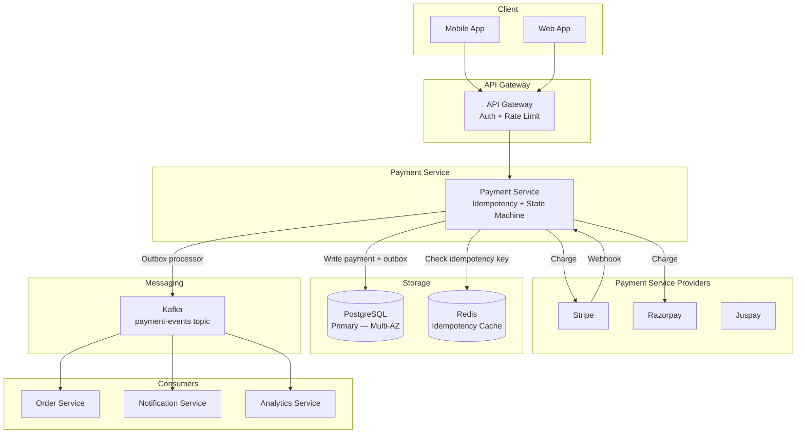
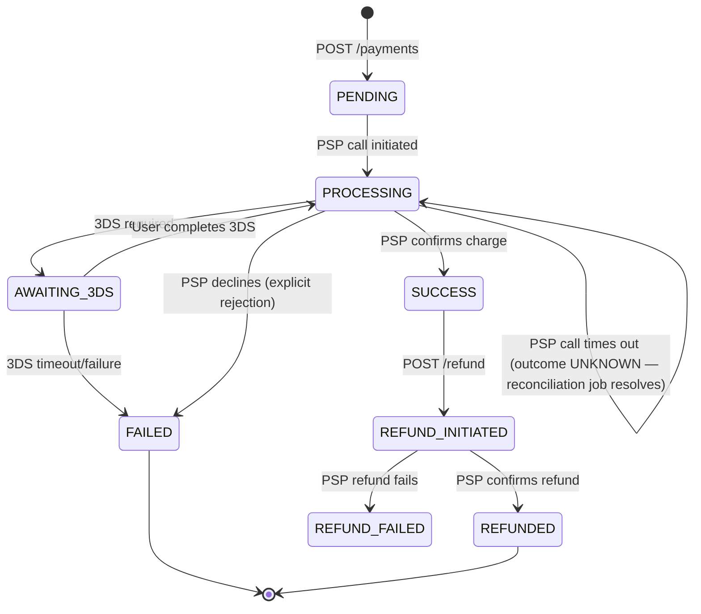

# Design: Payment Processing System

**Difficulty:** Senior/Staff | **Time:** 60–90 minutes

!!! warning "This is hard. That's the point."
    Payment systems are the canonical example of distributed systems correctness requirements. Money must never be created or destroyed. This design reveals most distributed systems challenges simultaneously.

---

## 1. Problem Statement

Design a payment processing system for an e-commerce platform. Users can pay for orders using cards or wallets. The system processes payments, handles failures gracefully, and never charges users incorrectly.

---

## 2. Clarifying Questions

??? question "What to ask"
    - **Payment methods:** Cards? Bank transfers? Wallets? Crypto?
    - **Integration:** Do we integrate with Stripe/Braintree or build PSP connections ourselves?
    - **Volumes:** Transactions per day? Peak TPS?
    - **Geographic scope:** Single country or global? Multiple currencies?
    - **Regulatory:** PCI DSS scope? 3D Secure? RBI regulations (India)?
    - **Refunds, disputes, chargebacks?**
    - **Idempotency:** What if a client retries a payment?
    - **SLA:** How long can payment be unavailable?

---

## 3. Functional Requirements

- Accept payments (card, wallet) for orders
- Process refunds
- Query payment status
- Handle failures with retries — never double-charge
- Audit trail: every state change persisted
- Notify order service of payment result

## 4. Non-Functional Requirements

| Property | Requirement | Reasoning |
|----------|-------------|-----------|
| Exactly-once processing | Critical | Double charge destroys user trust |
| Availability | 99.99% | Revenue directly impacted |
| Latency | < 3s p99 (card), < 500ms p99 (wallet) | User experience |
| Durability | Never lose a transaction record | Regulatory + trust |
| Consistency | Strong (no eventual) | Money correctness |
| Audit | Immutable event log | Regulatory, disputes |

---

## 5. Capacity Estimation

```
E-commerce platform:
  1M orders/day peak (sale season)
  70% paid by card, 30% by wallet
  1M / 86,400s ≈ 11.5 TPS average
  Peak (10×): ~115 TPS

Payment record storage:
  Per transaction: ~2 KB (all fields + audit)
  1M/day × 2 KB = 2 GB/day
  3-year retention: ~2 TB

Refunds: ~5% of transactions = 50K/day
```

!!! note "Note on TPS"
    115 TPS is not technically demanding. The challenge is **correctness** under failure, not raw throughput. Payment systems are hard because of distributed transactions, not scale.

---

## 6. API Design

```
POST /v1/payments
Request:
  {
    "idempotency_key": "order-789-attempt-1",  ← CRITICAL
    "order_id": "order-789",
    "amount": { "value": 2999, "currency": "INR" },
    "payment_method": {
      "type": "card",
      "token": "tok_visa_xxxx"    ← tokenized by frontend SDK
    },
    "return_url": "https://merchant.com/payment/complete"
  }
Response:
  {
    "payment_id": "pay_abc123",
    "status": "PENDING",      ← async processing
    "redirect_url": "https://3ds.bank.com/authenticate?..."
  }

GET /v1/payments/{payment_id}
Response: { "payment_id": "...", "status": "SUCCESS|FAILED|PENDING|REFUNDED" }

POST /v1/payments/{payment_id}/refund
Request:  { "amount": { "value": 2999, "currency": "INR" }, "reason": "customer_request" }
Response: { "refund_id": "ref_xyz", "status": "PENDING" }
```

!!! warning "Production Trap ⚠️"
    **Never handle raw card numbers** in your service. Use a frontend tokenization SDK (Stripe.js, Braintree SDK) — the card token is sent to PSP, not your server. This removes you from PCI DSS scope entirely.

---

## 7. Data Model

```sql
-- Payments table (source of truth)
CREATE TABLE payments (
    id              UUID PRIMARY KEY DEFAULT gen_random_uuid(),
    idempotency_key VARCHAR(255) UNIQUE NOT NULL,
    order_id        UUID NOT NULL,
    user_id         UUID NOT NULL,
    amount          BIGINT NOT NULL,      -- in smallest currency unit (paise, cents)
    currency        CHAR(3) NOT NULL,
    status          VARCHAR(20) NOT NULL, -- PENDING, PROCESSING, SUCCESS, FAILED, REFUNDED
    psp_reference   VARCHAR(255),         -- reference from Stripe/Braintree
    failure_reason  VARCHAR(500),
    created_at      TIMESTAMP NOT NULL DEFAULT NOW(),
    updated_at      TIMESTAMP NOT NULL DEFAULT NOW(),
    version         INT NOT NULL DEFAULT 0,  -- optimistic locking
    INDEX idx_order_id (order_id),
    INDEX idx_idempotency_key (idempotency_key),
    INDEX idx_user_id (user_id)
);

-- Immutable audit log (append-only)
CREATE TABLE payment_events (
    id          UUID PRIMARY KEY DEFAULT gen_random_uuid(),
    payment_id  UUID NOT NULL REFERENCES payments(id),
    event_type  VARCHAR(50) NOT NULL,  -- CREATED, PROCESSING, SUCCEEDED, FAILED, REFUND_INITIATED
    event_data  JSONB NOT NULL,
    created_at  TIMESTAMP NOT NULL DEFAULT NOW(),
    INDEX idx_payment_id (payment_id)
);

-- Outbox for reliable event publishing (Transactional Outbox Pattern)
CREATE TABLE payment_outbox (
    id          UUID PRIMARY KEY DEFAULT gen_random_uuid(),
    payment_id  UUID NOT NULL,
    event_type  VARCHAR(50) NOT NULL,
    payload     JSONB NOT NULL,
    published   BOOLEAN DEFAULT FALSE,
    created_at  TIMESTAMP DEFAULT NOW(),
    INDEX idx_unpublished (published, created_at)
);
```

---

## 8. Architecture



---

## 9. Critical Design: Idempotency

**The core problem:** Network failures cause clients to retry. Without idempotency, the same payment is processed multiple times.

```
Client                    Payment Service         Stripe

POST /payments ───────────→ Processing...
                           ──────────────→ Charge $29.99
(timeout!)                 ←────────────── Success!
Client doesn't know if
payment succeeded...
POST /payments (retry) ──→ ????
                          Should this create a new charge?
                          NO! Stripe already charged the user.
```

**Solution: Idempotency Key**

```python
class PaymentService:
    def create_payment(self, request: PaymentRequest) -> Payment:
        # 1. Check idempotency cache first
        cached = redis.get(f"idem:{request.idempotency_key}")
        if cached:
            return Payment.from_json(cached)  # return previous result

        # 2. Check DB for existing payment
        existing = db.query(
            "SELECT * FROM payments WHERE idempotency_key = ?",
            request.idempotency_key
        )
        if existing:
            redis.setex(f"idem:{request.idempotency_key}", 86400, existing.to_json())
            return existing

        # 3. Create new payment (with DB-level unique constraint)
        try:
            payment = Payment(
                idempotency_key=request.idempotency_key,
                status="PENDING",
                amount=request.amount,
                currency=request.currency,
            )
            db.insert(payment)
            redis.setex(f"idem:{request.idempotency_key}", 86400, payment.to_json())
            return payment
        except UniqueConstraintViolation:
            # Race condition: another request inserted first
            existing = db.query("SELECT * FROM payments WHERE idempotency_key = ?", ...)
            return existing
```

---

## 10. Payment State Machine



**A PSP timeout is not a decline — it's an unknown outcome, and must not be mapped to FAILED.** A decline is the PSP explicitly telling you "no" — safe to treat as terminal. A timeout means the request may never have reached the PSP, may have reached it and be pending, or may have already succeeded with the response lost in transit — you genuinely don't know, and the charge may have gone through. Transitioning straight to FAILED on timeout is a real production bug: if the charge actually succeeded, the customer is now charged for an order the system believes failed — no product, a support ticket, and a manual refund. The correct handling is to leave the payment in PROCESSING (or a dedicated `AWAITING_RECONCILIATION` state) and let the reconciliation job (§13, "PSP Timeout" failure mode) query the PSP by `psp_reference`/idempotency key for the authoritative outcome before making any state change.

**State transitions must be atomic and persisted before external calls:**

```python
def process_payment(payment_id: str):
    with db.transaction():
        payment = db.select_for_update("SELECT * FROM payments WHERE id = ? AND status = 'PENDING'")
        if not payment:
            return  # already processed (concurrent call)

        # Persist state change first
        db.execute("UPDATE payments SET status = 'PROCESSING', version = version + 1 WHERE id = ? AND version = ?",
                   payment_id, payment.version)
        db.execute("INSERT INTO payment_events (payment_id, event_type) VALUES (?, 'PROCESSING')", payment_id)

    # Now call external PSP (outside transaction — idempotency handles retries)
    result = stripe.charge(payment.psp_token, payment.amount)

    with db.transaction():
        new_status = 'SUCCESS' if result.success else 'FAILED'
        db.execute("UPDATE payments SET status = ?, psp_reference = ? WHERE id = ?",
                   new_status, result.reference, payment_id)
        db.execute("INSERT INTO payment_outbox (...) VALUES (...)", ...)
```

---

## 11. Transactional Outbox Pattern

**Problem:** After a payment succeeds, we need to notify the Order Service. How do we guarantee the notification is sent without creating a distributed transaction?

**Wrong approach:**
```
1. UPDATE payments SET status = 'SUCCESS'
2. kafka.publish("payment-succeeded")  ← what if this fails after step 1?
```

**Correct approach (Transactional Outbox):**
```
1. BEGIN TRANSACTION
2. UPDATE payments SET status = 'SUCCESS'
3. INSERT INTO payment_outbox (event_type, payload)  ← same DB transaction
4. COMMIT

Background process:
5. SELECT * FROM payment_outbox WHERE published = FALSE
6. kafka.publish(event)
7. UPDATE payment_outbox SET published = TRUE
```

Steps 2 + 3 are atomic (same DB transaction). The outbox poller handles step 6 reliably, with retries.

---

## 12. Handling PSP Webhooks

PSPs (Stripe, Razorpay) send webhooks for async events (3DS completion, refund confirmation). Webhooks can be delivered multiple times.

**The naive SETNX-then-process pattern has a real data-loss bug, and it's worth walking through exactly why.** Setting the dedup key *before* processing (`SETNX` succeeds → then call `process_stripe_event`) means: if the process crashes or errors *after* the SETNX but *before* processing finishes, the key is already set — every subsequent retry from the PSP sees "already handled" and skips the event **permanently**. The event is gone. Worse, the 24-hour expiry on that key means that if a genuinely new, unrelated event later reuses tooling that collides with the same key window (or if you're debugging and a retry arrives after the key expires), you can also get a late duplicate. Both failure directions — permanent loss on crash, duplicate after expiry — come from treating the dedup key as if it were the durability guarantee, when it's only a fast-path optimization.

**The correct order: durably record receipt in its own committed transaction first, then atomically claim-and-process in a second transaction** — receipt and processing cannot share one transaction, because a crash during processing would roll the receipt back too, leaving nothing to resume from. Claiming must be atomic (one conditional UPDATE, not a separate read-then-write) so two concurrent deliveries of the same event can't both start processing, and the claim needs a lease timeout so a worker that crashes mid-processing doesn't strand the event forever:

```mermaid
sequenceDiagram
    participant PSP as Stripe/Razorpay
    participant WH1 as Webhook Handler (request A)
    participant WH2 as Webhook Handler (request B, concurrent duplicate)
    participant DB as Payments DB (webhook_events table)

    PSP->>WH1: POST /webhooks/stripe (event_id=evt_1, raw body, signature)
    WH1->>WH1: verify_webhook_signature(RAW BODY, signature, secret)
    PSP->>WH2: POST /webhooks/stripe (event_id=evt_1, retry — arrives concurrently)
    WH2->>WH2: verify_webhook_signature(RAW BODY, signature, secret)

    Note over WH1,DB: TRANSACTION 1 (receipt) — commits independently, on its own
    WH1->>DB: BEGIN; INSERT ... ON CONFLICT DO NOTHING; COMMIT
    DB-->>WH1: committed — row exists with status='received'
    WH2->>DB: BEGIN; INSERT ... ON CONFLICT DO NOTHING; COMMIT
    DB-->>WH2: conflict, no-op — row already exists (A's insert landed first)

    Note over WH1,WH2,DB: TRANSACTION 2 (atomic claim) — A and B now race on the SAME conditional UPDATE
    WH1->>DB: UPDATE ... SET status='processing' WHERE status='received' (or lease expired)
    DB-->>WH1: 1 row updated — A holds the claim
    WH2->>DB: UPDATE ... SET status='processing' WHERE status='received' (or lease expired)
    DB-->>WH2: 0 rows updated — claim already taken, lease not expired — B exits, no processing

    WH1->>DB: apply business-state change (e.g. UPDATE payments SET status=...) — TRANSACTION 3
    WH1->>DB: UPDATE webhook_events SET status='processed'; COMMIT
    DB-->>WH1: committed
    WH1-->>PSP: 200 OK
    WH2-->>PSP: 200 OK (nothing left to do — A's claim covers it)

    Note over WH1,DB: If A crashes AFTER claiming but BEFORE completing: row is stuck at<br/>status='processing' until claimed_at + lease expires, then the NEXT<br/>retry's claim UPDATE matches the "expired lease" clause and reclaims it
```

In code, that's a receipt transaction, then a separate atomic-claim-with-lease step, then the processing transaction:

```python
@app.post("/webhooks/stripe")
def handle_stripe_webhook(raw_body: bytes, signature: str):
    # 1. Verify signature against the RAW, UNMODIFIED request body — not a
    #    parsed/re-serialized dict. Stripe's signature is an HMAC over the
    #    exact bytes it sent; parsing to a dict and re-serializing changes
    #    whitespace and key order, which changes the bytes, which breaks
    #    the HMAC. This is a documented Stripe requirement, not an
    #    implementation nicety — frameworks that eagerly parse the body
    #    (many do, by default) will silently break this check unless you
    #    explicitly capture the raw bytes before any parsing happens.
    if not stripe.verify_webhook_signature(raw_body, signature, WEBHOOK_SECRET):
        return Response(status=401)

    payload = json.loads(raw_body)  # safe to parse only AFTER verification
    event_id = payload["id"]

    # 2. TRANSACTION 1 — durably record receipt, and ONLY that. This
    #    transaction must be short and must commit before we do anything
    #    else, so that a crash after this point still leaves a row behind
    #    to resume from. status='received' means "durably captured,
    #    not yet claimed by anyone."
    with db.transaction():
        db.execute(
            "INSERT INTO webhook_events (event_id, payload, status) "
            "VALUES (?, ?, 'received') ON CONFLICT (event_id) DO NOTHING",
            event_id, payload,
        )

    # 3. Process synchronously right after acknowledging receipt (or hand
    #    off to a background worker reading webhook_events — either way,
    #    this step goes through the SAME atomic-claim logic below).
    process_webhook_event(event_id, payload)

    return Response(status=200)


def process_webhook_event(event_id: str, payload: dict) -> None:
    # TRANSACTION 2 — atomically CLAIM the event before touching it.
    # This single UPDATE is the concurrency boundary: it only succeeds
    # for a row that is 'received' OR 'processing' with an EXPIRED lease
    # (a prior worker crashed after claiming, before finishing). Two
    # concurrent callers (a live duplicate delivery AND a retry after a
    # crash) racing on this UPDATE: exactly one WHERE clause matches at
    # a time under the DB's own row-level locking, so exactly one caller
    # gets rowcount=1 and proceeds; the other gets rowcount=0 and exits.
    LEASE_SECONDS = 120
    with db.transaction():
        claimed = db.execute(
            "UPDATE webhook_events SET status = 'processing', "
            "claimed_at = NOW() "
            "WHERE event_id = ? AND ("
            "  status = 'received' "
            "  OR (status = 'processing' AND claimed_at < NOW() - INTERVAL ? SECOND)"
            ") "
            "RETURNING event_id",
            event_id, LEASE_SECONDS,
        )
        if claimed is None:
            # Someone else already claimed it and their lease hasn't
            # expired (concurrent duplicate, still in-flight) — OR it's
            # already 'processed'. Either way, not our job right now.
            return

    # We hold the claim. Apply the business-state change and mark done —
    # own transaction, so a crash here leaves status='processing' with a
    # claimed_at timestamp that will simply expire and become
    # re-claimable by the next delivery/retry, per the lease check above.
    with db.transaction():
        process_stripe_event(payload)
        db.execute("UPDATE webhook_events SET status = 'processed' WHERE event_id = ?", event_id)
```

!!! warning "Production Trap ⚠️"
    **"Always return 200" is only safe once the event has been durably accepted** — written to storage that survives a crash — not merely signature-verified. Stripe's own guidance is to handle events asynchronously: acknowledge quickly once you've durably captured the event, then process it, and keep retrying on your own side if processing didn't complete, rather than relying on the PSP to retry indefinitely. Returning 200 the instant signature verification passes, before the event is durably stored, means a crash between verification and storage silently drops the event — the PSP considers it delivered and won't retry a 200. The two-transaction design above is what actually delivers on that: transaction 1 (receipt) must commit on its own so a crash afterward still leaves a resumable row; transaction 2 (claim-then-process) uses an atomic, lease-timed claim so concurrent deliveries can't double-process and a crash mid-processing doesn't strand the event forever — a single transaction spanning receipt through completion can't provide either property, since a crash before commit discards the receipt along with everything else.

---

## 13. Failure Modes

=== "PSP Timeout"
    - **Symptom:** Payment stuck in PROCESSING state
    - **Detection:** `payments WHERE status = 'PROCESSING' AND updated_at < NOW() - INTERVAL '5 min'`
    - **Fix:** Background job queries PSP for status using `psp_reference`; updates payment record; retries if PSP has no record

=== "Database Primary Fails During Payment"
    - **Symptom:** Payments fail to persist; PSP may have charged
    - **Risk:** PSP charged → our DB didn't record → revenue loss + user angry
    - **Fix:** Charge PSP only after DB confirms PROCESSING state; reconciliation job compares PSP records vs DB daily

=== "Double Processing Race Condition"
    - **Symptom:** Two servers process same payment simultaneously
    - **Fix:** `SELECT FOR UPDATE` on payment record; `version` column for optimistic locking; DB unique constraint on `idempotency_key`

=== "Kafka Outbox Processing Failure"
    - **Symptom:** Order Service not notified of payment success
    - **Fix:** Outbox has retry logic; Order Service periodically queries payment status as fallback; eventual consistency is acceptable here (order status, not money)

---

## 14. Observability

```
Critical alerts (PagerDuty immediately):
- Payment failure rate > 2%
- PSP latency p99 > 10 seconds
- Payments stuck in PROCESSING > 10 minutes
- Revenue drop > 20% from baseline

Metrics:
- payment_success_rate (by PSP, by method, by currency)
- payment_latency_p50/p95/p99
- psp_timeout_rate
- idempotency_key_collision_rate (indicates client retry behavior)
- outbox_processing_lag

Dashboards:
- Real-time transaction volume + success rate (revenue dashboard)
- PSP performance comparison (use when routing between PSPs)
- Error breakdown by failure type (insufficient funds vs fraud vs timeout)
```

---

## 15. Security

- Card numbers never touch your servers — use PSP tokenization SDK
- Store only PSP payment tokens, never raw card data
- Sign PSP webhooks and verify signatures
- Rate limit payment attempts by user/card (3 failed attempts → 24h block)
- Fraud detection: ML model or use PSP's built-in (Stripe Radar)
- All payment data encrypted at rest
- Audit log immutable — no UPDATE/DELETE on payment_events

---

## 16. Alternative Architectures

| Approach | Pros | Cons | Use When |
|---|---|---|---|
| Synchronous charge (no outbox, no queue) | Simple, immediate confirmation | DB write and PSP charge aren't atomic — crash between them loses money or double-charges | Never at real scale; toy demos only |
| Transactional outbox (this design) | Atomic with the DB write, replayable, decouples downstream consumers | Extra table, extra relay process, added latency (poll interval) | Default choice for payment-adjacent writes |
| Saga with compensating transactions | Handles multi-step flows (charge → reserve inventory → ship) without distributed locks | Complex to reason about; compensations must be idempotent too | Multi-service order flows, not a single charge |
| Direct PSP webhook as source of truth (no local state machine) | Less code, PSP owns status | You can't reconcile against your own business rules; hard to reason about partial refunds | Very small integrations, not for a platform with its own ledger |

## 17. Interview Follow-ups

1. **"Why not just call the PSP and update the DB in the same request?"** — No atomicity across a network call and a DB write. If the process dies after the PSP charges the card but before the DB commits, you've taken money with no record of it. The outbox pattern makes "charge succeeded" and "we know about it" the same transaction.
2. **"How do you avoid double-charging on client retry?"** — Client-generated idempotency key, unique-constrained in the DB. Second request with the same key returns the first result instead of re-charging.
3. **"What if the PSP's webhook never arrives?"** — Don't rely on webhooks alone; poll PSP status for anything stuck in PROCESSING past a threshold, matching §13.
4. **"How would you support a second PSP without rewriting the payment core?"** — Adapter interface per PSP (charge/refund/status mapped to your internal state machine); route by cost/availability as in the Multi-PSP Routing extension below.

---

## Staff Engineer Extensions

=== "Multi-PSP Routing"
    Route payments to cheapest PSP for each combination of currency + card type. When Stripe has an outage, automatically route to Razorpay. Maintain per-PSP success rates; reduce routing to degraded PSPs automatically.

=== "Global Multi-Region"
    Each region (US, EU, IN) has its own payment stack. EU payments stay in EU (GDPR). Global reconciliation job aggregates across regions. Cross-region payment (APAC user, EUR transaction) routes to EU region, processes there, replicates result back.

=== "30% Cost Reduction"
    Negotiate volume-based rates with PSPs. Route domestic transactions to local PSP (lower interchange). Batch small refunds (process daily instead of immediately). Implement intelligent retry strategies (failed card → retry at different time reduces auth decline fees).

---

## Self-Assessment

- [ ] Can I explain why idempotency keys are required, with a concrete failure scenario?
- [ ] Can I draw the payment state machine from memory?
- [ ] Can I explain the transactional outbox pattern and why it's needed?
- [ ] Can I describe what happens when the database fails after the PSP charge succeeds?
- [ ] Can I explain why we never store raw card numbers?
