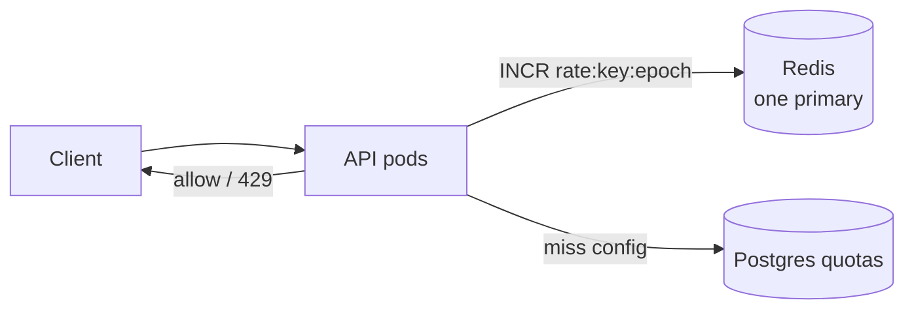
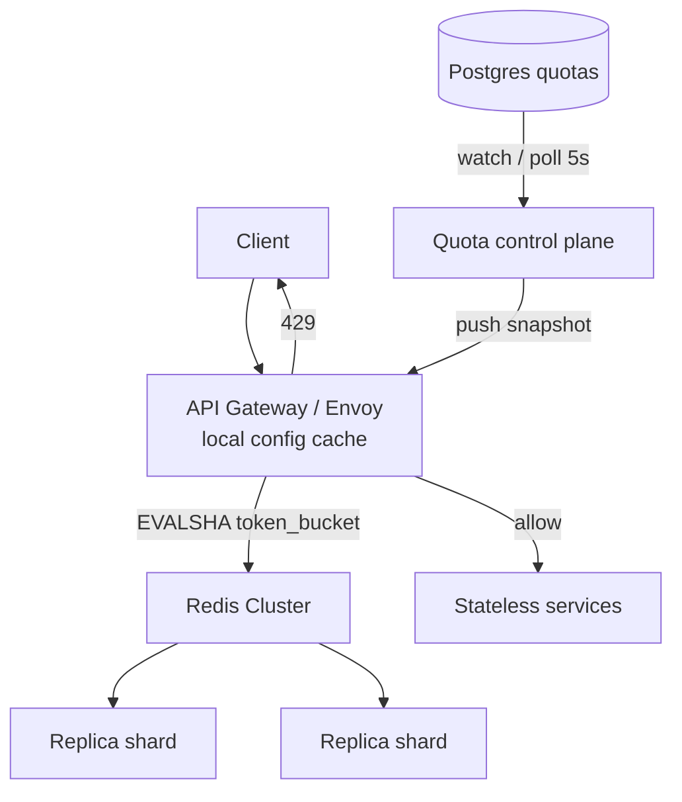

# Design: Distributed Rate Limiter

**Difficulty:** Foundation → Senior | **Time:** 45–60 minutes

!!! note "Instructions"
    Cover each section and work it yourself first. The [Rate Limiting](../reliability/rate-limiting.md) concept page has the algorithm simulator; this page is the *system design* — where the limiter lives, how it fails, and how you operate it.

---

## 1. Problem Statement

You run a public API platform. Product wants every caller held to a quota: *N* requests per time window, configurable per API key, per endpoint, and later per plan (free vs paid). Excess traffic must be rejected quickly, with a response the client can act on. Legitimate bursts (a mobile app retrying after a blip) should not look identical to a scrape.

Do not jump to Redis. First decide *what* you are limiting, *where* the decision happens, and *what is wrong* if you get it slightly wrong.

---

## 2. Clarifying Questions

Practice asking these before drawing boxes:

??? question "What questions should you ask?"
    - **Who is the subject?** API key, user id, IP, tenant, or a combination?
    - **What is limited?** All endpoints equally, or read vs write separately?
    - **Hard reject or delay?** 429 immediately, or queue / leak?
    - **Burst policy?** Strict *N*/window, or allow a short spike above the average?
    - **Accuracy vs cost?** Exact count, or is ±5–10% acceptable?
    - **Fail-open or fail-closed** if the limiter store is down?
    - **Scope:** One region or global quota? Data residency for keys?
    - **Volume:** Requests/second, unique keys, peak multiplier?
    - **Where does it sit?** Gateway, sidecar, or inside each service?

---

## 3. Functional Requirements

- Enforce a configured limit per subject (start with API key) and optionally per route
- Reject over-limit requests with **429** and `Retry-After`
- Support distinct quotas (e.g. 10 rps free, 200 rps paid)
- Allow a controlled burst, then settle to the sustained rate
- Expose remaining quota to the caller (`X-RateLimit-*` headers)
- Change limits without redeploying application pods

## 4. Non-Functional Requirements

| Property | Requirement | Reasoning |
|----------|-------------|-----------|
| Decision latency | < 2ms p99 added | Must not become the API |
| Accuracy | ±5% under partition is OK for free tier; paid writes tighter | Cost vs fairness |
| Availability | Limiter outage must not take the API to 0% *or* to unbounded | Explicit fail policy |
| Scale | 200K rps peak, 20M unique keys / day | Hot keys + cardinality |
| Durability | Counters can be lossy; config cannot | Quotas are product contracts |

!!! tip "Interview Insight 🎯"
    Rate limiting is not one problem. It is **admission control** (protect the system), **fairness** (one tenant cannot starve others), and **monetization** (plans). Name which one you are optimizing before picking an algorithm.

---

## 5. Capacity Estimation

```
Platform traffic:
  20K rps average, 10× peak → 200K rps
  Unique API keys / day: 20M
  Active keys in a 1-minute window: ~2M (power-law)

Per-decision work:
  1 read + 1 write on a counter (or one Lua eval)
  200K evals/s → not a single Redis core

Memory (sliding log, worst):
  200K rps × 60s × 16 bytes ≈ 192 MB/min of timestamps
  At 20M keys this explodes — sliding log is a tax on cardinality

Memory (token bucket, 32 bytes/key):
  2M hot keys × 32 B ≈ 64 MB  → fits one cache node
  20M keys with TTL 2 min, most idle → still tens of GB if never evicted

Header / config:
  Limit table: 50K plans × 1 KB = 50 MB  (load in each gateway)
```

!!! abstract "Mental Model"
    You are buying a **shared integer** that many stateless pods must mutate. Every design after V1 is about making that integer cheap, local enough, and wrong in a *safe* direction.

---

## 6. API Design

```
# Applied at the edge. App handlers stay unaware of counters.

GET  /v1/resources
POST /v1/resources
  → 200 / 201 on allow
  → 429 Too Many Requests on deny

Response headers (always, including 200):
  X-RateLimit-Limit: 100
  X-RateLimit-Remaining: 17
  X-RateLimit-Reset: 1723500000
  Retry-After: 3          # seconds; only on 429

# Control plane (internal, authenticated)
PUT  /internal/quotas/{api_key}
     { "algorithm": "token_bucket", "rate": 100, "burst": 200, "unit": "second" }
GET  /internal/quotas/{api_key}
```

!!! warning "Production Trap ⚠️"
    Returning 429 *without* `Retry-After` trains clients to hammer you. Returning 500 when the limiter is uncertain trains them to retry even harder. Pick the status code as carefully as the algorithm.

---

## 7. Data Model

```sql
-- Durable config. Not the hot path.
CREATE TABLE quotas (
    subject_id   VARCHAR(128) PRIMARY KEY,  -- api_key or tenant
    algorithm    VARCHAR(32) NOT NULL,      -- token_bucket | sliding_window | leaky_bucket
    rate         INT NOT NULL,              -- tokens per interval
    burst        INT NOT NULL,              -- bucket capacity
    interval_ms  INT NOT NULL DEFAULT 1000,
    fail_mode    VARCHAR(16) NOT NULL,      -- open | closed
    updated_at   TIMESTAMPTZ NOT NULL
);

-- Optional audit (sampled)
CREATE TABLE limit_events (
    subject_id   VARCHAR(128) NOT NULL,
    route        VARCHAR(128),
    allowed      BOOLEAN NOT NULL,
    remaining    INT,
    ts           TIMESTAMPTZ NOT NULL,
    INDEX idx_subject_ts (subject_id, ts)
);
```

Hot state (not SQL):

```
rate:{subject}:{window}     → integer counter     (fixed / sliding window)
tb:{subject}                → {tokens, ts} hash   (token / leaky bucket)
log:{subject}               → sorted set of ts    (sliding log)
```

---

## 8. Algorithms — pick with a cost model

The concept page animates these. Here you choose one *for a quota*.

=== "Fixed window"
    Count requests in `[T, T+W)`. `INCR` + `EXPIRE`. O(1) memory per key.
    **Breaks at the boundary:** 100 at `00:00.999` and 100 at `00:01.001` = 2× limit in 2ms.
    Use for coarse, cheap limits (login attempts / hour) where a 2× spike is tolerable.

=== "Sliding window (counter)"
    Weighted sum of previous window + current window. Still O(1) memory.
    Removes most of the boundary spike. Slightly over-admits a true sliding window.
    Default for **HTTP API quotas** at this scale.

=== "Sliding log"
    Store every timestamp. Exact. Memory = requests in the window.
    Fine for 10 rps / user. Fatal at 200K rps with millions of keys.

=== "Token bucket"
    Tokens refill at `rate`, cap at `burst`. Allows a configured spike, then clamps.
    Best match for “paid plan = 100 rps, burst 200”. Needs a compare-and-set or Lua.

=== "Leaky bucket"
    Queue drains at constant rate. Smooths bursts instead of admitting them.
    Use when *downstream* cannot absorb a spike (payment authorizations, SMS).
    In HTTP, “queue” usually means **delay or 429**, not an unbounded in-memory list.

!!! tip "Interview Insight 🎯"
    Interviewers listen for: *boundary spike* (fixed window), *memory* (sliding log), *burst vs smooth* (token vs leaky). Naming the four without a trade-off is a mid-level answer.

---

## 9. Version 1 — simplest thing that works

One process, in-memory map. Client → API process → decision. No shared store.


```python
# per-process token bucket — V1
import time

class MemoryLimiter:
    def __init__(self, rate, burst):
        self.rate, self.burst = rate, burst
        self.tokens, self.ts = burst, time.monotonic()

    def allow(self) -> bool:
        now = time.monotonic()
        self.tokens = min(self.burst, self.tokens + (now - self.ts) * self.rate)
        self.ts = now
        if self.tokens >= 1:
            self.tokens -= 1
            return True
        return False
```

Ship this behind a feature flag for a single-instance admin API. Then hunt the bottleneck — do not add infrastructure yet.

---

## 10. Identify the bottleneck

???+ question "You scale the API to 40 pods. What is now false?"
    - Each pod has its *own* bucket. Effective limit ≈ `N × 40`. Product quota is fiction.
    - A rolling deploy resets every bucket → a burst of free traffic after every release.
    - The hottest key (`partner-export`) pins one pod's CPU if you shard poorly later — but right now the bug is **no shared counter**.
    - A single Postgres row per key, `UPDATE counters SET n = n+1`, will serialize 200K rps on one tuple. SQL is the wrong hot path.

---

## 11. Version 2 — shared counter

Introduce a cache that all pods can `INCR`. Fixed window is enough to restore a *global* quota.



```python
def allow_fixed(r, key: str, limit: int, window_s: int = 1) -> tuple[bool, int]:
    window = int(time.time()) // window_s
    redis_key = f"rate:{key}:{window}"
    n = r.incr(redis_key)
    if n == 1:
        r.expire(redis_key, window_s + 1)
    return n <= limit, max(0, limit - n)
```

**Still wrong for production:** Redis primary is a single core; `INCR` is atomic but **not atomic with `EXPIRE`** without a script (crash between them → immortal key); clocks on the app boxes define `window`; one celebrity key hashes to one slot.

---

## 12. Version 3 — production admission path

Move the limiter to the **gateway** (one hop, consistent headers). Store config in Postgres, cache in each gateway process. Hot state in a Redis cluster. Decision is a Lua script so refill + consume is one round trip.



```lua
-- token bucket, Redis TIME (not app clock)
-- KEYS[1]=tb:{subject}  ARGV=rate, burst, cost
local rate  = tonumber(ARGV[1])
local burst = tonumber(ARGV[2])
local cost  = tonumber(ARGV[3])
local t     = redis.call('TIME')
local now   = tonumber(t[1]) + tonumber(t[2]) / 1e6
local data  = redis.call('HMGET', KEYS[1], 'tokens', 'ts')
local tokens = tonumber(data[1]) or burst
local ts     = tonumber(data[2]) or now
tokens = math.min(burst, tokens + (now - ts) * rate)
local allowed = 0
if tokens >= cost then
  tokens = tokens - cost
  allowed = 1
end
redis.call('HSET', KEYS[1], 'tokens', tokens, 'ts', now)
redis.call('EXPIRE', KEYS[1], 120)
return {allowed, math.floor(tokens)}
```

**Local admission (optional V3.1):** each gateway holds a *slice* of the bucket (`rate / N_gateways`, periodically reconciled). Cuts Redis QPS by 10–50×. Drift is the price; pull the slice back if remaining is low.

!!! abstract "Staff Engineer Lens"
    Put the limiter **in front of** the thing you are protecting. A limiter inside the payment service does not protect Postgres connections already checked out on the way in. Gateway + sidecar for service-to-service is the usual split.

---

## 13. Failure analysis

=== "Redis is gone"
    All `EVAL` time out. Fail-closed: API goes to 429 / 503 — you just DDoSed yourself with safety. Fail-open: quotas vanish — a retry storm finishes the job Redis started.
    **Policy:** fail-open for read-only public GETs with a *local* emergency cap (e.g. 5× plan); fail-closed for auth, password reset, SMS, payments. Cache last-known remaining for 30s. Circuit-break Redis after N errors.

=== "Clock skew"
    App `time.time()` on two pods 800ms apart splits a 1s window — double admit. Token bucket using app clocks refills faster on the fast node.
    **Fix:** `TIME` from Redis (or HLC / hybrid). NTP everywhere is necessary but not sufficient; do not trust the caller’s `Date` header.

=== "Network partition"
    Gateway A can reach Redis, gateway B cannot. Split brain on remaining tokens.
    **Mitigation:** local slice already assumed partition; tighten local cap. Do not run two Redis clusters “for HA” without a single writer per key.

=== "Hot key"
    One partner does 80K rps. Cluster-wide CPU looks fine; **one hash slot** sits at 100%.
    **Signals:** `redis_slowlog`, per-slot ops, p99 only on that tenant.
    **Mitigation:** local token cache for that key; split `rate:{key}:{shard}` and sum; isolate the tenant on a dedicated limiter pool.

=== "Config push fails"
    Gateways keep stale unlimited plans after a downgrade.
    **Fix:** versioned snapshots, `max_age` on cached quotas, default-deny for unknown keys.

---

## 14. Consistency, fairness, bursts

- **Counters are AP.** Losing 2 seconds of tokens after a failover is acceptable; charging a tenant for traffic you dropped is not.
- **Read-your-writes on config:** after `PUT /quotas`, the next request from that key must see the new limit (push + short TTL, not “eventual someday”).
- **Fairness ≠ equal.** Weighted fair queuing (paid 10× free) is a *scheduler*. A single global token bucket is not fair under one greedy key — add a *per-key* bucket *and* a *global* bucket.
- **Bursts:** token bucket burst = UX for mobile. Leaky bucket = protect a fragile downstream. Do not advertise burst = 10× rate if the database pool is sized for the average.

---

## 15. Reliability

- Redis: cluster + replica per shard, client timeouts **shorter** than the API SLO (1–2ms budget).
- Lua replication: scripts must be deterministic (`TIME` is allowed in modern Redis; document the version).
- Deploy gateways with connection pooling and pipelining; one new TCP handshake per request will miss the 2ms budget.
- Shadow mode first: compute allow/deny, emit metrics, do not enforce. Compare against abuse reports before flipping.

---

## 16. Security

- Limit by **authenticated identity**, not only IP (NAT, mobile CGNAT, IPv6).
- Still apply a coarse IP cap to unauthenticated endpoints (login, signup).
- Quotas are confidential — do not leak another tenant’s remaining count.
- Control plane is admin-auth only; an attacker who can `PUT` their burst to 1e9 owns you.
- 429 is an oracle for valid API keys if you 401 unknown keys and 429 known ones — keep shapes similar.

---

## 17. Observability

```
Metrics:
  ratelimit_decisions{result=allow|deny,tenant,route}
  ratelimit_redis_rtt_ms p50/p99
  ratelimit_failmode_trips
  ratelimit_hot_key_ops  (top-K subjects)
  remaining_tokens histogram

Alerts:
  deny_ratio > 20% globally          (you are the outage)
  redis_rtt_p99 > 5ms
  single_key_share > 15% of evals
  fail_open_active > 30s

Traces:
  span on the Lua eval; attribute subject_hash (not raw key)
```

---

## 18. Cost

```
Redis cluster (6 shards × primary+replica, 16 GB):   ~$2,400/mo
Gateway CPU (limiter is ~15% of edge):                 already paid
Control plane + Postgres:                              ~$150/mo
Sliding-log alternative at this QPS:                   5–10× memory → reject

Cost lever: local slices drop Redis QPS from 200K to ~20K
  → 2 shards instead of 6  →  ~$800/mo
```

---

## 19. Alternative architectures

=== "Envoy global rate limit service"
    Out-of-process gRPC limiter (Lyft pattern). Gateways stay dumb. Extra hop: budget it. Nice multi-language story.

=== "CDN / WAF"
    Cloudflare/Fastly IP + path rules. Great for volumetric DDoS. Cannot see your API key plans or paid bursts. Use *in front of* the app limiter, not instead.

=== "Per-pod limiter only"
    Valid when the goal is *protect this process* (CPU, pool). Invalid as a billing quota.

---

## 20. Interview follow-ups

1. **Fixed vs sliding vs token?** Boundary spike, memory, burst. Pick one and say what you gave up.
2. **How do you rate-limit a GraphQL API?** Cost is per-query, not per-HTTP. Assign point costs; token bucket consumes `cost`, not `1`.
3. **Distributed increment without Redis?** Per-pod quotas + periodic gossip. Weaker fairness, survives Redis death.
4. **How do you test this?** Deterministic clock, replay a trace of timestamps, assert deny count within ±5%.

---

## 21. Staff Engineer Extensions

=== "100× traffic (20M rps)"
    You cannot `EVAL` 20M times/s on one cluster. Push coarse limits to CDN, local token buckets on every edge node, Redis only for reconciliation every 100ms. Sample decisions. Shard by `hash(subject)` across *many* independent clusters — there is no single global integer at this QPS.

=== "Cut cost 30%"
    Local slices + shorter TTLs on idle keys + one replica per shard instead of two + move free-tier to fixed window. Paid tenants keep token bucket. Measure deny-ratio regression before celebrating the invoice.

=== "Global quota"
    A user bouncing US ↔ EU must not get 2×. Cross-region Redis is a latency and partition trap. Prefer **regional quotas** (document it) or a home-region counter with a cached remainder at the edge (stale by RTT). True global exactness and <2ms are incompatible; say so.

=== "Data residency"
    EU API keys’ counters stay in EU. Control plane replicates *config* globally, not request logs. A US gateway serving an EU key either routes to EU limiter or applies a conservative local cap and settles asynchronously.

=== "Regional failure"
    If EU Redis dies, EU gateways fall to the fail-mode matrix; US is unaffected. Do not fail over counters to US if that violates residency. Shed EU write traffic first.

=== "Zero-downtime algorithm change"
    Dual-run: new Lua writes a second key, old key still enforces. Compare deny rates 24h. Flip `algorithm` in Postgres per tenant. Never change the script and the key layout in one deploy.

---

## Self-Assessment

- [ ] I can explain the fixed-window boundary spike with numbers
- [ ] I can defend fail-open vs fail-closed per endpoint class
- [ ] I know why app clocks and `INCR`+`EXPIRE` are racy
- [ ] I can describe a hot-key mitigation that is not “bigger Redis”
- [ ] I can say when a global quota is the wrong product requirement
