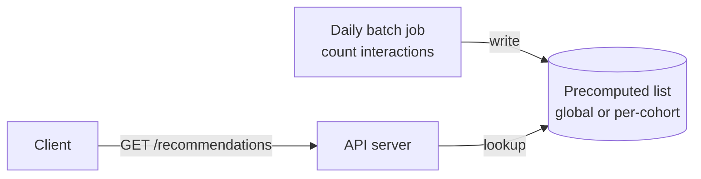
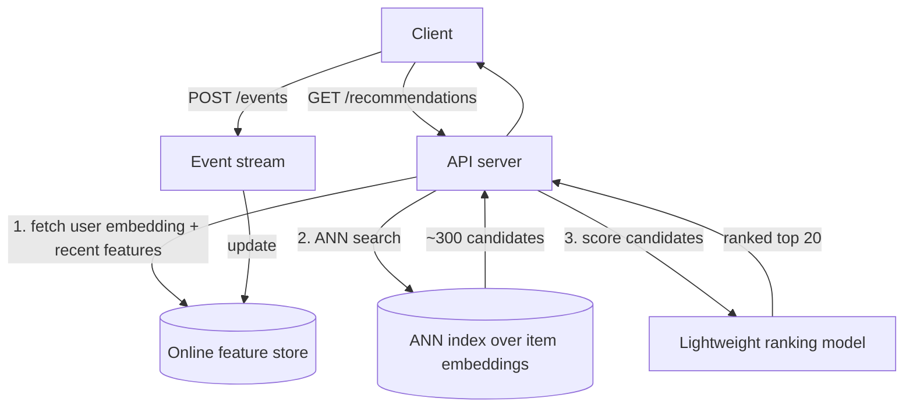
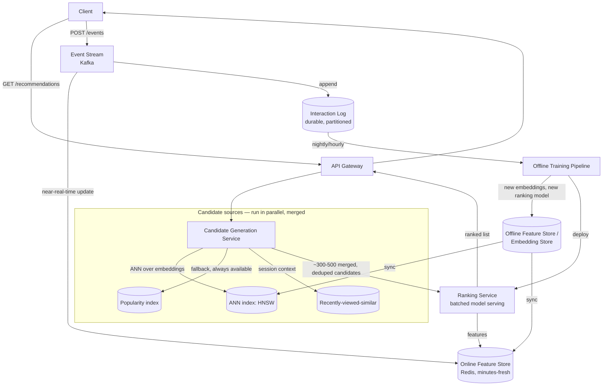

# Design: Recommendation System (e.g. "Videos for you" / "Products you may like")

**Difficulty:** Senior/Staff | **Time:** 60–75 minutes

!!! note "Instructions"
    Cover each section and work it yourself first. This exercise is won on the **candidate generation → ranking funnel**, not on naming a specific ML framework. [Model Serving](../ai-native/model-serving.md) covers *how* to host a model cheaply at low latency — this page assumes that mechanic and focuses on what's specific to recommendations: which candidates to score, how to rank them, and how to keep them fresh.

---

## 1. Problem Statement

Design the system behind a "Videos for you" or "Products you may like" surface: given a user (and maybe a context — what they're currently viewing), return a small, personalized, ranked list of items from a catalog of millions to billions.

The naive framing — "score every item for every user, return the top K" — is intractable, and saying so precisely is the first thing an interviewer listens for. If you have 500M users and a 50M-item catalog, and each user×item scoring call costs even 1ms on a capable model, a full scan is `500M × 50M × 1ms` — not a number you can make up with more machines. You cannot rank everything for every user on every request.

The industry-standard answer is a **two-stage funnel**:

1. **Candidate generation** — cheaply narrow billions of items down to a few hundred *plausible* candidates for this user, using lightweight methods (embeddings + approximate nearest-neighbor search, popularity, co-occurrence). Optimizes for recall: don't miss good items, false positives are fine because ranking will filter them.
2. **Ranking** — expensively and precisely score those few hundred candidates with a heavier model that can use rich features (user history, item metadata, context, cross-features), and order them. Optimizes for precision on a small set, because that's the only place you can afford to spend real compute per request.

This split is the entire architecture. Every version below is either improving candidate generation, improving ranking, or improving the freshness of the data both stages read from. For the *mechanics* of hosting the ranking model itself — batching, GPU autoscaling, cold starts — see [Model Serving](../ai-native/model-serving.md); this page is about what candidates to feed it and how to score them for *this* problem, not general inference infrastructure.

---

## 2. Clarifying Questions

??? question "What questions should you ask?"
    - **Domain:** Video feed, e-commerce product recs, music, news? (Catalog size and interaction signal differ wildly.)
    - **Context-dependent or standing?** Homepage "for you" (long-lived context) vs. "related to what you're watching now" (session context)?
    - **Explicit or implicit feedback?** Star ratings, or only clicks/watches/purchases (the common case, noisier)?
    - **Objective:** Optimize for clicks, watch time, purchases, or a blended/long-term retention metric? (Changes what the ranking model's label even is.)
    - **Freshness requirement:** How fast must a brand-new item (just uploaded) become recommendable? How fast must a user's last 10 minutes of activity shift their recommendations?
    - **Cold start:** New users with no history? New items with no interactions? Both need an answer.
    - **Diversity/fairness constraints:** Must the list avoid showing 10 near-duplicate items? Any business rules (no more than N items from one seller/creator)?
    - **Scale:** DAU, catalog size, requests/second, p99 latency budget?
    - **Explainability/regulatory:** Any requirement to explain *why* an item was recommended (increasingly relevant for ad-adjacent or minor-facing products)?

---

## 3. Functional Requirements

- Return a ranked list of N personalized items for a given user + optional context (e.g. "currently viewing item X")
- Log user interaction/feedback events (impression, click, watch/purchase, dwell time) as they happen
- Exclude items the user has already interacted with (configurable — "seen" filtering) and items ineligible for the user (region-locked, out of stock)
- Support both a "for you" homepage surface and a "related items" contextual surface from the same underlying pipeline
- Recommendations must incorporate a user's very recent activity, not just historical behavior

## 4. Non-Functional Requirements

| Property | Requirement | Reasoning |
|----------|-------------|-----------|
| Serving latency | End-to-end < 150ms p99 (candidate gen + ranking + assembly) | Sits on the critical render path of the home screen |
| Freshness — new item | Discoverable within minutes of upload, not next day's batch job | An item invisible for 24h has already lost its "new" momentum |
| Freshness — user action | A click/watch 5–10 minutes ago should influence the *next* request | Stale personalization reads as "the app doesn't know me" |
| Availability | 99.9% — always return *something*, never a blank/error surface | A broken recommender is worse than a mediocre one; fall back, don't fail |
| Scale | 50M items catalog, 200M DAU, tens of thousands of recs requests/sec at peak | Drives the candidate-gen vs. full-rank decision from Section 1 |
| Throughput of the ranking stage | Must score ~200–500 candidates per request within the latency budget | Ranking cost is per-candidate × candidates/request × requests/sec |

!!! tip "Interview Insight 🎯"
    Notice the two *different* freshness numbers — new-item freshness (minutes) and new-action freshness (minutes, but on the *next request*, not batch). Conflating them into one "freshness requirement" is a signal you haven't separated candidate generation (which needs the item to exist in an index) from ranking/personalization (which needs the *user's* recent signal). They're solved by different mechanisms later.

---

## 5. Capacity Estimation

```
Users & catalog:
  200M DAU, 500M total users
  Item catalog: 50M items (video/product scale), growing ~200K new items/day

Requests:
  200M DAU × 8 recommendation surface loads/day ≈ 1.6B requests/day
  ≈ 18,500 rps average, ~5x peak ≈ 92,500 rps

Candidate generation (per request):
  ANN search over embedding index: top ~500 candidates from a few sources
    (embedding similarity ~300, popularity fallback ~100, recently-viewed-similar ~100)
  ANN query latency budget: single-digit ms per source, run in parallel

Ranking (per request):
  ~300-500 deduplicated candidates scored by the ranking model
  ~50-150 features per (user, item) pair: user embedding, item embedding,
    recency features, cross features (user-category affinity), context features
  92,500 rps × 400 candidates ≈ 37M scoring calls/second at peak
    — this number is why ranking must be a BATCHED model-serving problem
      (see Model Serving) and why it only ever runs on the narrowed
      candidate set, never the full 50M-item catalog

Event log (training data source):
  1.6B requests/day × ~10 impressions shown ≈ 16B impression events/day
  Plus click/watch/purchase events, maybe 5-10% of impressions ≈ 1-1.5B/day
  At ~200 bytes/event ≈ 3.5TB/day raw event volume (before compaction/aggregation)

Embedding storage:
  User embeddings: 200M users × 128 dims × 4 bytes ≈ 102GB
  Item embeddings: 50M items × 128 dims × 4 bytes ≈ 25GB
  Both must be servable at low latency — this is a "fits in a fast KV/vector
  store" budget, not a "scan a table" budget
```

!!! abstract "Mental Model"
    Candidate generation is buying **recall cheaply** over billions of items. Ranking is buying **precision expensively** over hundreds. Every number above exists to justify why those two stages use fundamentally different techniques and different cost budgets per item.

---

## 6. API Design

```
GET /v1/recommendations
  ?user_id=...&context=home|item_detail&context_item_id=...&limit=20
  → {
      items: [{ item_id, score, reason_code }],
      request_id            # for feedback correlation
    }

POST /v1/events
  {
    request_id,             # ties feedback back to the serving request that showed it
    user_id, item_id,
    event_type: "impression" | "click" | "watch" | "purchase" | "dismiss",
    dwell_ms?,
    ts
  }
  → 202 Accepted   # fire-and-forget, never on the critical UX path

# Internal, not client-facing
GET  /internal/embeddings/user/{user_id}
GET  /internal/embeddings/item/{item_id}
POST /internal/reindex   # trigger ANN index rebuild/merge (admin)
```

`request_id` on the recommend call and its echo on the feedback event is what makes the interaction log usable as *labeled* training data later — without it you have impressions and clicks in two streams with no reliable way to join them at the granularity a ranking model needs.

---

## 7. Data Model

```sql
-- User features: durable profile signal, refreshed by the offline pipeline.
-- NOT the hot serving path by itself — see the online feature store below.
CREATE TABLE user_features (
    user_id        UUID PRIMARY KEY,
    embedding      VECTOR(128),         -- learned representation
    top_categories JSONB,               -- affinity summary, small
    updated_at     TIMESTAMPTZ NOT NULL
);

-- Item features: catalog metadata + learned embedding.
CREATE TABLE item_features (
    item_id        UUID PRIMARY KEY,
    embedding      VECTOR(128),
    category       VARCHAR(64),
    popularity_7d  BIGINT,
    created_at     TIMESTAMPTZ NOT NULL,
    is_active      BOOLEAN DEFAULT TRUE
);

-- Interaction/event log: append-only, the SOURCE of training data.
-- Partitioned by day, never updated in place.
CREATE TABLE interaction_events (
    request_id     UUID NOT NULL,
    user_id        UUID NOT NULL,
    item_id        UUID NOT NULL,
    event_type     VARCHAR(16) NOT NULL,
    dwell_ms       INT,
    ts             TIMESTAMPTZ NOT NULL,
    INDEX idx_user_ts (user_id, ts)
) PARTITION BY RANGE (ts);
```

```
Hot serving state (not SQL):
  online_features:{user_id}   → recent-interaction feature vector, TTL minutes
                                 (what makes "clicked 10 min ago" usable NOW)
  ann_index:items             → HNSW/IVF index over item embeddings, served in-memory
```

The split mirrors [Pastebin](pastebin.md)'s metadata/blob split for a different reason: here it's not object size, it's **update cadence**. `user_features`/`item_features` are batch-refreshed (hours); the online feature store is refreshed per-event (seconds). Mixing them into one store means either the whole thing is slow-to-update (kills freshness) or the whole thing is written on every event (kills the batch training pipeline's ability to read a stable snapshot).

---

## 8. Version 1 — simplest thing that works

No personalization, no real-time anything. A batch job computes "most popular items" (or basic item-item co-occurrence: "users who interacted with A also interacted with B") once a day, and every user gets served from that precomputed list.



```python
# V1: daily batch job, no per-request personalization
def compute_popular_items(interaction_log_yesterday):
    counts = Counter()
    for event in interaction_log_yesterday:
        if event.type in ("click", "watch", "purchase"):
            counts[event.item_id] += 1
    top_items = counts.most_common(500)
    cache.set("popular:global", top_items, ttl=86400)

def get_recommendations(user_id, limit=20):
    # everyone gets the same list — or a coarse cohort (e.g. by region/category)
    return cache.get(f"popular:{cohort_of(user_id)}")[:limit]
```

This ships fast, is trivial to reason about, and beats an empty screen. Do not add ML infrastructure yet — confirm this is actually where it breaks.

---

## 9. Identify the bottleneck

???+ question "What's wrong with V1, and when does it actually start to hurt?"
    - **No personalization.** Every user in a cohort sees the identical list. A user who has watched nothing but cooking videos for a year gets the same homepage as one who watches nothing but sports — the product's entire value proposition ("for you") doesn't exist yet.
    - **Batch cadence can't react to intent.** A user who clicked three running-shoe listings ten minutes ago should see running shoes climb the list *now*. A once-a-day batch job means that signal isn't incorporated until tomorrow's run — by then the user has moved on or bought elsewhere.
    - **Coarse cohorting is a band-aid, not a fix.** Splitting "popular" by region/category narrows the list a little but still can't distinguish two users in the same cohort with opposite tastes — it's a step toward personalization, not personalization.
    - **What's NOT the bottleneck yet:** the batch job's throughput (counting interactions once a day over even billions of events is a solved, cheap problem); serving latency (a cache lookup is fast regardless).
    - The lesson: this version's failure mode is entirely about *relevance and recency*, not scale. Fixing it means introducing per-user signal and a faster feedback loop, not more infrastructure for the same computation.

---

## 10. Version 2 — embeddings + lightweight ranking, near-real-time features

Two additions: (1) represent users and items as embedding vectors and use **approximate nearest-neighbor (ANN) search** to generate candidates specific to this user, and (2) a lightweight model scores those candidates, reading features that update from recent interactions rather than only yesterday's batch.

**Candidate generation via embeddings, conceptually:** a model (trained offline on interaction history — e.g. two-tower: one tower encodes users, one encodes items, trained so that a user's vector is close to vectors of items they engaged with) produces a fixed-size vector per user and per item. "Find items this user would like" becomes "find item vectors close to this user's vector" — a nearest-neighbor search. Doing that *exactly* over 50M items per request is too slow, so an **approximate** index (e.g. HNSW — a layered graph structure where search hops through progressively finer layers to reach a near-neighborhood in roughly logarithmic time instead of scanning all 50M vectors) trades a small amount of recall for orders-of-magnitude faster lookup. You don't need to derive HNSW's internals in an interview — naming that ANN indexing exists and *why* (sublinear search over a high-cardinality vector space) is the expected depth.



```python
def get_recommendations(user_id, limit=20):
    user_vec = feature_store.get_user_embedding(user_id)
    recent = feature_store.get_online_features(user_id)   # last N interactions, minutes-fresh

    candidates = ann_index.search(user_vec, k=300)          # cheap: vector search
    candidates = filter_seen_and_ineligible(candidates, user_id)

    scored = ranking_model.score_batch(user_id, recent, candidates)  # one batched call
    return sorted(scored, key=lambda x: -x.score)[:limit]

def on_interaction_event(event):
    # near-real-time: feeds the NEXT request's candidate generation and ranking
    feature_store.append_online_feature(event.user_id, event.item_id, event.type, event.ts)
```

The key structural change from V1: `feature_store.get_online_features` reads state that was written *minutes* ago by the event stream, not by last night's batch job — this is what makes "clicked 10 minutes ago" actually show up in the next request.

---

## 11. Identify the next bottleneck

???+ question "V2 personalizes and reacts to recent activity. What breaks next, and for whom?"
    - **Ranking cost at scale.** Scoring 300 candidates per request, 92,500 requests/second at peak (Section 5), is ~28M scoring calls/second. A ranking model that's fast enough for one request can still blow the latency budget if each candidate is scored one-at-a-time instead of batched — this is exactly the batching/throughput problem described in [Model Serving](../ai-native/model-serving.md): pack candidates for a request (and ideally across concurrent requests) into a batch, don't score them as 300 separate model calls.
    - **Cold start, both directions.** A brand-new user has no embedding worth trusting (trained on zero interactions) — ANN search over their embedding returns near-random neighbors. A brand-new item has no embedding either (nothing has interacted with it yet), so it can *never* surface via embedding-based candidate generation no matter how good it is, until it accumulates some interaction history — a chicken-and-egg problem V2 doesn't solve on its own.
    - **Single point of candidate generation.** If ANN is the *only* candidate source, an ANN index outage or a cold-start user produces zero candidates and zero recommendations — no fallback path exists yet.

---

## 12. Version 3 — production architecture

Add multiple candidate sources (so no single failure or cold-start case yields an empty list), split the feature store into online (low-latency, event-driven) and offline (training-time, batch) halves, and make the ranking service a proper batched model-serving component.



Key production decisions:

- **Candidate generation fans out to multiple sources in parallel**, not just ANN. Popularity is the cheap, always-available fallback (never zero results, matches V1's role exactly — it doesn't disappear, it becomes one input among several). Recently-viewed-similar handles the contextual "related items" surface using session signal rather than the standing user embedding.
- **Ranking service is a proper batched model server** — candidates for a request are scored as one batch (see [Model Serving](../ai-native/model-serving.md) for continuous batching and why per-item scoring calls don't scale). Precompute/cache item-side features per candidate so the ranking call only needs to combine them with the user's features at request time, not recompute both from scratch.
- **Online vs. offline feature store split**, matching the freshness split from Section 4: online store (Redis-class, TTL'd, event-driven) answers "what has this user done in the last few minutes" for ranking; offline store (data warehouse / offline embedding store) is what the training pipeline reads to produce the next embedding and ranking model versions. They're kept in sync by periodic export, not by being the same store — training needs a stable snapshot, serving needs sub-second writes.
- **Event stream (Kafka-class) decouples "user acted" from "feature updated."** This is what makes near-real-time freshness possible without every event handler being on the request's critical path.
- **Offline training pipeline runs on a schedule** (hourly embedding refresh, daily/weekly full model retrain), reading the durable interaction log — the same log doubles as the audit trail and the labeled-training-data source (impression + subsequent click within a session = a positive label).

---

## 13. Failure analysis

=== "Ranking model serving degraded/slow"
    The ranking service's p99 latency spikes (GPU contention, a bad deploy, an oversized batch — see [Model Serving](../ai-native/model-serving.md) failure modes for the underlying causes).
    **Mitigation:** fall back to a cheaper, cached ranking — e.g. rank candidates by a simple cached popularity/affinity score instead of the full model, or serve the previous request's ranked list if very recent. Circuit-break the ranking call after N consecutive timeouts and degrade rather than block the response.
    **User-visible:** a slightly less-personalized list for a short window, never a blank screen or a 5-second spinner.

=== "Feature store staleness"
    The online feature store falls behind (event stream lag, a replica desync) and ranking reads a user's state from an hour ago instead of minutes ago.
    **Mitigation:** attach a staleness timestamp to the online feature read; if it exceeds a threshold, either widen the ranking model's reliance on more stable offline features for that request or flag it in serving metrics. Never silently rank on data the system doesn't know is stale.
    **User-visible:** recommendations feel a step behind — noticeable but not broken, as long as it's bounded and monitored.

=== "Cold-start user or item"
    A new user has no reliable embedding; a new item has no interaction history and can't be found by ANN search.
    **Mitigation (user):** fall back to popularity/trending candidates and coarse attribute-based candidates (signup survey, device/locale) until enough interactions accumulate to trust a learned embedding — same fallback path as the "always available" popularity source in V3, not a special case.
    **Mitigation (item):** seed a new item's initial embedding from its metadata (category, text/image content embedding via a content-based model) rather than waiting for interaction data, and explicitly boost new items into a fraction of candidate slots (exploration) so they can accumulate the interaction signal needed to earn a collaborative embedding later.

=== "Event stream lag"
    Kafka consumer lag delays "just clicked X" from reaching the online feature store — the near-real-time personalization promise breaks first here.
    **Mitigation:** monitor consumer lag as a first-class SLO-relevant metric, not just an infra metric; alert before it crosses the freshness requirement (Section 4's "minutes," not "eventually"). Partition the stream so one noisy topic/producer can't starve the lag budget for the rest.
    **User-visible:** the specific "reacted to what I just did" effect disappears while lag persists; the rest of personalization (standing embeddings, ranking) is unaffected since it doesn't depend on the stream.

---

## 14. Consistency considerations

- **Most of this pipeline is eventual consistency by design, and that's fine.** Embedding updates from the offline training pipeline propagate to the ANN index and feature stores on the order of hours — nobody notices a few hours' lag in "this item's learned embedding got slightly better."
- **Near-real-time freshness (Section 4) is a *bounded* staleness requirement, not strong consistency.** "Within minutes" is an SLA on an eventually-consistent pipeline (event stream → online feature store), not a demand for synchronous read-after-write.
- **Where staleness visibly degrades UX:** the online feature store lagging past its freshness budget (users notice "it doesn't know what I just did"), and the popularity fallback being stale during a fast-moving trending event (a viral item not yet reflected in the popularity index looks like a miss).
- **Where it doesn't matter at all:** offline feature/embedding freshness, training pipeline cadence, and the interaction log's replication lag to the data warehouse (nothing serving-critical reads from there directly).

---

## 15. Observability

```
Latency / infra metrics:
  recs_request_latency_p50/p99{stage=candidate_gen|ranking|total}
  ann_search_latency_p99
  ranking_batch_size, ranking_queue_wait_ms   (see Model Serving for the batching angle)
  online_feature_store_staleness_s
  event_stream_consumer_lag_s

ML-specific metrics — first-class, not an afterthought:
  recs_ctr{surface=home|item_detail}            click-through rate on shown items
  recs_engagement_rate                          watch/purchase rate among clicks
  recs_diversity_score                          category spread within a returned list
  cold_start_candidate_share                    % of served list from fallback vs. embedding path
  model_offline_vs_online_auc_delta             training-serving skew signal
  new_item_time_to_first_impression             validates the "minutes" freshness requirement

Alerts:
  recs_ctr drops > X% week-over-week for a cohort (silent relevance regression)
  ann_search_latency_p99 > budget
  event_stream_consumer_lag_s > freshness SLA
  cold_start_candidate_share spikes (embedding pipeline broken, not actually more new users)
```

!!! tip "Interview Insight 🎯"
    A recommendation system's most important dashboard is not latency — it's **click-through/engagement rate by cohort**, tracked continuously. A system can be fast, available, and 100% within SLA while quietly recommending garbage after a bad model deploy; latency dashboards will never catch that, only the engagement metrics will. Say this explicitly — it's the one observability point specific to ML-backed systems that a pure-infra design misses.

---

## 16. Cost analysis

```
Ranking model serving (GPU/CPU, batched): the dominant line item — driven by
  candidates/request × requests/sec (Section 5's ~28M scoring-calls/sec peak).
  See Model Serving's cost model (GPU-hours, batch size, quantization) for the levers.

ANN index (in-memory, HNSW-class):        tens of GB (Section 5), sized to fit in memory
  across a small cluster                                          ~$1,500-3,000/mo

Online feature store (Redis-class):        ~100GB+ hot working set, replicated  ~$800-1,500/mo

Event stream (Kafka-class):                throughput-sized to interaction volume ~$500-1,000/mo

Offline training pipeline (batch compute, periodic not continuous): spiky,
  amortized well below serving cost                                ~$1,000-2,000/mo

Interaction log storage (object/columnar, cheap, append-only):      ~$200-500/mo

Cost lever: ranking model batch size and candidate-set size (300 vs 500 candidates
  per request) trade recommendation quality against the dominant serving cost line —
  this is the single biggest knob, same as the batch-size lever in Model Serving.
```

---

## 17. Alternative architectures

=== "Collaborative filtering only"
    Candidates/ranking derived purely from user-item interaction patterns (who liked what), no content features. Strong when interaction data is dense; useless for cold-start items/users since it has nothing to key off of until interactions accumulate.

=== "Content-based only"
    Candidates derived from item attributes (category, text/image embeddings) matched to a user's historical preferences. Solves item cold-start cleanly (a new item's content embedding exists on day one) but tends to over-recommend near-duplicates of what a user already engaged with — weaker at surfacing genuinely novel-but-relevant items than collaborative signal.

=== "Hybrid (what V3 actually is)"
    Blend collaborative (learned embeddings from interactions) and content-based (metadata/content embeddings, especially for cold-start) signals as different candidate sources feeding the same ranking stage. This is the standard production answer — say explicitly that "hybrid" isn't a vague middle ground, it's collaborative signal for warm items/users and content-based signal specifically covering the gap collaborative filtering can't: cold start.

=== "Precomputed (batch) recommendations vs. real-time"
    Precomputing a ranked list per user in a nightly batch job is cheap and simple (V1-adjacent) but can't react to what a user did 10 minutes ago and wastes compute precomputing for users who won't open the app before the next batch. Full real-time (V3) costs more per request but delivers the freshness requirement from Section 4. **The actual production answer is hybrid serving:** precompute/cache a baseline candidate set or ranking during low-traffic windows for cost efficiency, and let the real-time path only handle the personalization delta (recent-interaction re-ranking, session context) on top of that cached baseline — full real-time scoring for every request, every time, is rarely worth its cost once a baseline can absorb most of the work.

---

## 18. Staff Engineer Extensions

=== "100× traffic"
    92,500 rps becomes ~9.25M rps. Ranking cost (already the dominant line, Section 16) becomes the forcing function: shrink the candidate set per request, increase ranking batch sizes aggressively (Model Serving's batching math), and shard the ANN index horizontally with request routing by user-hash so no single index node is a bottleneck. Popularity fallback needs its own horizontal scaling story too — it looks free at today's scale but isn't at 100×.

=== "Multi-region"
    Serve from the region closest to the user for latency; the online feature store and ANN index should be region-local replicas, refreshed from a global offline pipeline (same "cache is derived, rebuildable from source" pattern as other systems in this series — see [Social Feed](social-feed.md)'s regional-failure handling). The interaction log can be regional-write, globally-aggregated for training, since training doesn't need synchronous cross-region reads.

=== "Data residency / privacy"
    Recommendation systems are a genuine privacy-sensitive surface: user embeddings and the interaction log *are* a behavioral profile, arguably more sensitive than the raw events that built them, since an embedding can encode inferred attributes the user never explicitly disclosed. Home a user's embedding, online features, and interaction log in their residency region; ensure the offline training pipeline either trains region-local models or anonymizes/aggregates before any cross-region training join. Provide a real deletion path — deleting a user's account must also purge or exclude their contribution from stored embeddings and the interaction log, not just stop future collection, which has real implications for how the offline pipeline retrains (a full retrain periodically, not "delete and hope the old embedding ages out").

=== "Zero-downtime migration to a new ranking model"
    Never hard-cutover a ranking model — shadow-score first: run the new model alongside the old one on live traffic, log both sets of scores, serve only the old model's ranking, and compare offline (would the new model's ranking have produced better engagement, estimated from logged data) before it ever affects a real user. Then move to a small A/B rollout (1% → 10% → 50%) gated on the engagement metrics from Section 15, not just error rate — a new ranking model can be "healthy" (no errors, normal latency) while quietly recommending worse content, which only the CTR/engagement dashboards catch.

---

## 19. Interview follow-ups

1. **Why can't you just rank the whole catalog for every user?** Say the multiplication out loud: users × catalog size × per-item scoring cost is intractable at any real scale (Section 1's numbers) — this is the entire reason the funnel exists, and naming it precisely is worth more than any diagram.
2. **How do you handle a brand-new item with zero interactions?** Content-based candidate generation (seed an embedding from metadata/content) plus deliberate exploration slots in the candidate set so it can accumulate interaction signal — pure collaborative filtering structurally cannot surface it (Section 13).
3. **How would you A/B test a new ranking model safely?** Shadow scoring first to compare against logged outcomes without affecting users, then a staged rollout gated on engagement metrics specifically, not just latency/error rate (Section 18) — a broken ranking model is often invisible to infra monitoring.
4. **What's different about serving a ranking model here versus a general LLM-serving problem?** Candidate count per request is small and bounded (hundreds, not an open-ended generation), so the [Model Serving](../ai-native/model-serving.md) batching mechanics still apply, but the interesting system design here is upstream of the model server — which candidates even reach it, and how fresh their features are — not the serving stack itself.

---

## Self-Assessment

- [ ] I can explain the candidate-generation → ranking funnel and why it's not optional at scale, with the multiplication that proves it
- [ ] I can distinguish the two freshness requirements (new item vs. new user action) and name the mechanism that satisfies each
- [ ] I can describe cold-start handling for both new users and new items, and why they need different mitigations
- [ ] I can explain why click-through/engagement rate belongs on the observability dashboard alongside latency, and what a latency-only dashboard would miss
- [ ] I can describe shadow scoring and staged rollout for a new ranking model, and why a hard cutover is the wrong move
