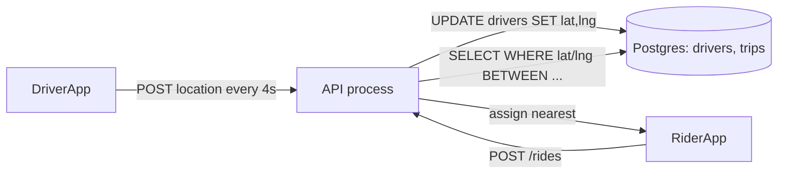
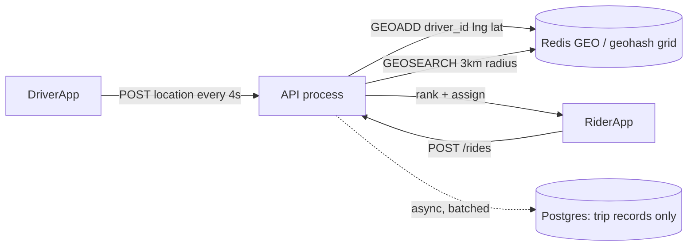
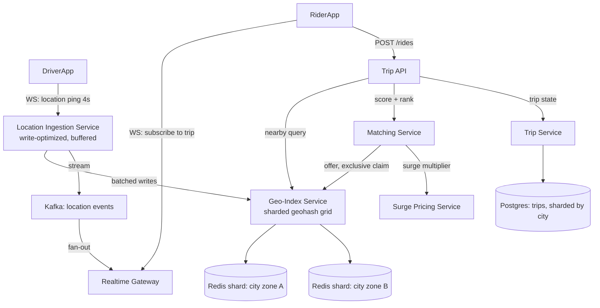
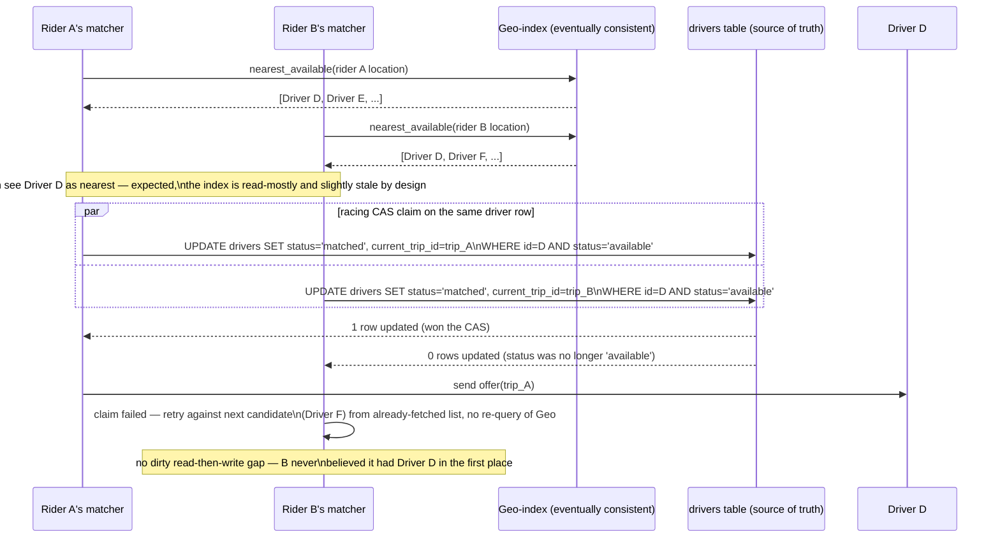

# Design: Uber / Ride-Hailing

**Difficulty:** Senior → Staff | **Time:** 60–75 minutes

!!! note "Instructions"
    Cover each section and work it yourself first. Before every "Version N" reveal there is a `???` box — commit to an answer before you open it. This exercise folds in **live location tracking** as a core section rather than a separate exercise — a driver's live GPS trail and "find nearby drivers" are the same underlying data structure problem, not two systems.

---

## 1. Problem Statement

Design a ride-hailing platform: a rider requests a trip from point A to point B, the system finds and assigns a nearby available driver, both parties see each other's live location on a map until pickup and again until drop-off, and the trip is priced and closed out at the end.

Every other exercise on this site reduces to caching, fan-out, or a shared counter — a hot key, a viral read, a shared integer. **This is the first exercise where the core hard problem is genuinely geospatial**: hundreds of thousands of drivers are continuously moving points, and the central query is "who are the K nearest available points to *this* moving point, right now?" That query has no cache-friendly answer — the answer set changes every few seconds as drivers move, and a naive relational index (`WHERE lat BETWEEN ... AND lng BETWEEN ...`) degrades badly at city scale. Say this distinction out loud early: you are not looking for a hot key to shard away, you are looking for a spatial data structure.

---

## 2. Clarifying Questions

??? question "What questions should you ask?"
    - **Matching model:** Does the system pick the "best" driver and push the request to them, or broadcast to nearby drivers and let one accept (like a job queue)?
    - **Location update frequency:** How often does the driver app report GPS — every second, every few seconds?
    - **Matching latency SLA:** How long can a rider wait before seeing *a* driver assigned?
    - **Trip lifecycle:** What states does a trip go through, and which transitions are driver-initiated vs rider-initiated vs system-initiated (timeout, cancellation)?
    - **Geography:** One city, or global? Can matching for a rider in Austin ever consider a driver in Dallas? (No — this bounds the whole problem.)
    - **Surge:** Does pricing change with supply/demand imbalance? Does that affect matching order?
    - **Driver state:** Available, en route to pickup, on trip, offline — who owns these transitions and what happens if the app crashes mid-trip?
    - **Consistency:** Can two riders ever be shown/assigned the same driver simultaneously? (This must be "no" — it is the central correctness bug of this whole design.)
    - **Scale:** Drivers per city, concurrent trips at peak, ping volume?

---

## 3. Functional Requirements

- Rider requests a trip (pickup, destination); system returns a matched driver or a wait state
- Driver app reports live location continuously; rider app reports pickup/drop-off location
- Rider and driver each see the other's live position on a map during an active trip
- Driver can accept or reject/timeout a match offer
- Trip progresses through a defined lifecycle (requested → matched → en route → in progress → completed/cancelled)
- Fare is computed at trip completion (base + distance/time + surge multiplier)

## 4. Non-Functional Requirements

| Property | Requirement | Reasoning |
|----------|-------------|-----------|
| Location update frequency | Driver app pings every 4s while online | Balances live-tracking fidelity against battery/bandwidth and write volume |
| Matching latency | Rider sees a matched driver in < 10s p99 | Beyond ~10s, riders abandon the request |
| Location staleness shown to rider | < 5s old on the live map | A driver "on the map" 30s stale looks broken, not live |
| Availability | 99.95% for request/match path | A down matching service is a down business, not a degraded feature |
| Matching correctness | Exactly one active assignment per driver at any instant | Double-booking a driver is a worse failure than a slow match |
| Scale | 100K concurrent online drivers per major city, 25K matches/sec citywide at peak surge | Drives every downstream capacity number |

!!! tip "Interview Insight 🎯"
    Notice two *different* latency budgets: matching latency (rider-facing, "give me an answer") and location staleness (map-facing, "keep the picture live"). Conflating them leads candidates to over-engineer the matching path for freshness it doesn't need, or under-engineer the tracking path assuming match-path SLAs are enough.

---

## 5. Capacity Estimation

```
Drivers (one major city, peak):
  100K online drivers
  Ping every 4s → 100K / 4 = 25,000 location writes/second, this city alone
  20 major-city deployments → 500K writes/second location-ingest, globally

Geospatial index size:
  100K drivers x (driver_id 8B + lat/lng 16B + geohash 8B + status 1B + ts 8B) ≈ 41B/driver
  100K x 41B ≈ 4 MB per city in the hot geo-index — trivially memory-resident
  Even 20 cities: ~80 MB total live driver state. This is NOT a storage problem, it's a query-shape problem.

Matching:
  Normal: ~500 ride requests/sec citywide
  Rush-hour surge (concert letting out, 30K people in 10 minutes): burst to 3,000 requests/sec
    in one ~1km² zone → we called this "25K matches/sec at peak" citywide across zones/cities combined
  Each match: 1 nearby-driver query + 1 conditional assignment write

Live-tracking fan-out:
  Each active trip has 2 observers (rider + driver) polling/subscribing to the other's position
  500K concurrent trips globally x 2 = 1M live location subscriptions
  At a 4s cadence that's 250K location pushes/sec to end-user devices — a WebSocket/pub-sub problem, not a DB problem

Trip records:
  15M trips/day x ~2KB (route, fare, timestamps) ≈ 30 GB/day, cheap relational/append storage
```

!!! abstract "Mental Model"
    Two workloads with opposite shapes share this system: a **tiny, extremely hot, constantly-mutating** dataset (100K drivers' current positions — read and rewritten every few seconds) and a **large, cold, append-only** dataset (completed trips). Almost every design decision below is about not letting the first workload's write rate touch the second workload's storage engine.

---

## 6. API Design

```
# Rider
POST /v1/rides
  { "pickup": {"lat":37.77,"lng":-122.41}, "destination": {...}, "ride_type": "standard" }
  → 202 { "request_id": "r_abc", "status": "searching" }

GET  /v1/rides/{request_id}
  → { "status": "matched", "driver": {...}, "eta_seconds": 180, "trip_id": "t_123" }

WS   /v1/rides/{trip_id}/stream        # live driver location + status pushes to rider

# Driver
POST /v1/driver/location
  { "driver_id": "d_1", "lat":37.78, "lng":-122.40, "heading": 90, "ts": 1755400000 }
  → 200 (fire-and-forget cadence: every 4s while online)

POST /v1/driver/offers/{offer_id}/respond
  { "response": "accept" | "reject" }
  → 200, or 409 if the offer already expired/was taken by matching another driver's accept

POST /v1/driver/trips/{trip_id}/status
  { "status": "arrived" | "picked_up" | "completed" }

# Internal (matching → driver app), pushed not polled
Offer pushed over WS: { "offer_id": "o_1", "trip_request_id": "r_abc", "pickup": {...}, "expires_in_ms": 8000 }
```

!!! warning "Production Trap ⚠️"
    Naively polling `GET /v1/rides/{request_id}` from the rider app every second at 100K concurrent riders is 100K rps of pointless polling. Push over WebSocket/SSE from the moment a request is accepted — polling is only acceptable for the pre-match "searching" state, and even that should be capped.

---

## 7. Data Model

**Driver location store — the one decision that defines this exercise.**

The naive option is a relational table: `drivers(id, lat, lng, updated_at)` with `WHERE lat BETWEEN ? AND ? AND lng BETWEEN ? AND ?`. This works at small scale but has two problems that get worse with driver count: (1) a lat/lng range scan on a B-tree index over two independent columns can't prune efficiently — a bounding box query still has to intersect two range scans and filter, and (2) every one of 100K drivers rewrites their row every 4 seconds, meaning the index is being rebalanced continuously under a query workload that also hits it constantly.

Pick **geohashing** for this design (over quadtree/S2), and say why: a geohash is a single string computed directly from `(lat, lng)` — no tree structure to maintain, so a driver's location update is an O(1) upsert keyed by geohash prefix, and "nearby drivers" becomes a set lookup on the current cell plus its 8 neighbors, not a tree traversal. The trade-off you're accepting: geohash cells are **not uniform area** (they distort near the poles and are rectangular, not circular, so a naive single-cell query can miss a nearby driver just across a cell boundary — hence always querying the 3x3 neighbor grid, not just the exact cell) and cell edges don't align with actual "distance," so a driver 50m away in an adjacent cell and one 50m away in the same cell are indistinguishable by cell alone — you still rank candidates by real haversine distance after the cell lookup narrows the candidate set. Quadtrees adapt cell size to driver density (better in sparse suburbs) and S2 cells handle Earth's curvature more precisely (better at global scale spanning many latitudes) — either is defensible; geohash wins here because updates are O(1) with no rebalancing, which matters when the write rate (25K/s) dwarfs the query rate.

```
Hot store (Redis, or an in-memory geo-indexed service):
  geo:{city}:{geohash6}  → SET of driver_ids currently in that ~1.2km x 0.6km cell
  driver:{driver_id}     → HASH {lat, lng, geohash6, status, heading, updated_at}

Redis GEO commands map directly onto this:
  GEOADD  drivers:{city} lng lat driver_id
  GEOSEARCH drivers:{city} FROMLONLAT lng lat BYRADIUS 3 km ASC COUNT 20
```

```sql
-- Cold, durable trip record — small write volume, standard relational store
CREATE TABLE trips (
    id              VARCHAR(20) PRIMARY KEY,
    rider_id        VARCHAR(20) NOT NULL,
    driver_id       VARCHAR(20),
    pickup_lat      DOUBLE, pickup_lng DOUBLE,
    dest_lat        DOUBLE, dest_lng DOUBLE,
    status          VARCHAR(20) NOT NULL,   -- see state machine below
    requested_at    TIMESTAMPTZ NOT NULL,
    matched_at      TIMESTAMPTZ,
    picked_up_at    TIMESTAMPTZ,
    completed_at    TIMESTAMPTZ,
    fare_cents      INT,
    surge_multiplier DECIMAL(3,2) DEFAULT 1.0,
    INDEX idx_driver_status (driver_id, status),
    INDEX idx_rider_ts (rider_id, requested_at)
);
```

**Trip state machine:**

| State | Entered when | Valid next states |
|-------|--------------|--------------------|
| `requested` | Rider submits a ride request | `matching`, `cancelled` |
| `matching` | Matcher begins searching nearby drivers | `matched`, `no_drivers_found`, `cancelled` |
| `matched` | A driver accepts the offer | `en_route_to_pickup`, `cancelled` (rider or driver) |
| `en_route_to_pickup` | Driver confirms heading to pickup | `arrived`, `cancelled` |
| `arrived` | Driver location within pickup geofence | `in_progress`, `cancelled` (no-show) |
| `in_progress` | Rider confirmed onboard | `completed` |
| `completed` | Driver marks drop-off | *(terminal)* |
| `cancelled` | Either party cancels, or timeout | *(terminal)* |

---

## 8. Version 1 — simplest thing that works

Single region, driver locations in a relational table, matching does a naive bounding-box scan.



```python
def find_nearby_drivers(pickup_lat, pickup_lng, radius_km=3):
    lat_delta = radius_km / 111.0                       # rough km-per-degree latitude
    lng_delta = radius_km / (111.0 * cos(radians(pickup_lat)))
    rows = db.query("""
        SELECT driver_id, lat, lng FROM drivers
        WHERE status = 'available'
          AND lat BETWEEN %s AND %s
          AND lng BETWEEN %s AND %s
    """, pickup_lat - lat_delta, pickup_lat + lat_delta,
         pickup_lng - lng_delta, pickup_lng + lng_delta)
    return sorted(rows, key=lambda r: haversine(pickup_lat, pickup_lng, r.lat, r.lng))[:20]

def match_ride(request):
    candidates = find_nearby_drivers(request.pickup_lat, request.pickup_lng)
    for driver in candidates:
        if try_assign(driver.driver_id, request.id):    # simple UPDATE ... WHERE status='available'
            return driver
    return None  # no_drivers_found
```

This works for a pilot city with a few thousand drivers. Do not add infrastructure yet — find the actual bottleneck first.

---

## 9. Identify the bottleneck

???+ question "At 100K drivers online in one city, where does V1 actually break?"
    - The bounding-box `WHERE lat BETWEEN ... AND lng BETWEEN ...` cannot use a single B-tree index efficiently across two independent columns — Postgres will use one column's index and filter the rest, effectively scanning a large fraction of all "available" drivers on every match. At 100K drivers and hundreds of match requests/second, this is thousands of large filtered scans per second.
    - **Every driver rewrites their row every 4 seconds.** 25,000 UPDATEs/sec on the same table the matcher is scanning means the matcher is constantly reading a table under continuous write pressure — lock contention and index churn compound the scan cost.
    - A full city's drivers do not fit a cheap radius query this way: the table has no notion of "nearby" beyond raw column ranges, so the query cost grows with *total online drivers*, not with *drivers actually near the rider* — exactly backwards from what you want.
    - The fix is not "add an index" (a composite B-tree on lat,lng doesn't give you 2D locality) — it's a data structure that groups nearby points together physically, so "nearby" is a cheap key lookup instead of a range filter.

---

## 10. Version 2 — geospatial indexing

Move driver locations out of Postgres entirely into an in-memory, geo-indexed store keyed by geohash. Matching becomes a bounded lookup: compute the rider's cell, check that cell plus its 8 neighbors, rank the (small) candidate set by real distance.



```python
def find_nearby_drivers(pickup_lat, pickup_lng, radius_km=3):
    return redis.geosearch(
        "drivers:sf", longitude=pickup_lng, latitude=pickup_lat,
        radius=radius_km, unit="km", sort="ASC", count=20
    )  # backed by a geohash-sorted set — neighbor cells checked internally
```

Location writes now hit an in-memory structure sized for exactly this (~4 MB of hot state per city, see capacity estimate) instead of a durable relational table. Postgres only ever sees trip records — a few writes per trip, not per ping.

---

## 11. Identify the next bottleneck

???+ question "You move to geohash-indexed Redis. What breaks next, and when?"
    - **Write amplification from pings, not matching.** 100K drivers x 1 ping/4s = 25,000 writes/sec against Redis, every single second, whether or not anyone is requesting a ride. This dwarfs match-query volume (hundreds/sec normally) — the system is now dominated by a workload that produces zero business value on its own (nobody rides because a driver's dot moved 4s ago) but has to stay near-real-time anyway because riders are watching the map.
    - **Hot geohash cell during a surge event.** A concert lets out: 30,000 riders request in a ~1km² area within 10 minutes. That area is 1–2 geohash cells. Every match query and every driver ping in that footprint hits the same Redis key/cell — a hot-key problem, structurally identical to the rate limiter's hot key, but here it's *geographic* rather than tenant-based, and it appears suddenly and predictably (event end times are known in advance).
    - A single Redis primary for one city's `drivers:{city}` key space becomes a single point of contention for both the write flood (pings) and the query spike (surge matching) at exactly the same moment — the worst-case demand pattern hits both workloads simultaneously.

---

## 12. Version 3 — production architecture



Key production decisions:

- **Location ingestion is a dedicated write-optimized service, not a direct DB write per ping.** Pings land in a short-lived buffer/ring and are flushed to the geo-index in small batches (e.g. every 500ms), and simultaneously published to a stream (Kafka) so the realtime gateway can fan them out to subscribed rider/driver apps without ever touching the geo-index for reads. This decouples "update where I think this driver is" from "tell everyone watching this driver where they are."
- **Geo-index is sharded by city/region**, each shard a Redis (or equivalent) instance owning one geographic partition. A hot cell during a surge gets extra read replicas or a temporary finer-grained cell split for that zone specifically — you don't need to over-provision every city for one stadium's surge.
- **Matching service claims a driver exclusively**, not just reads their position — this is the mechanism that prevents double-booking (see Consistency section below).
- **Surge pricing** reads live supply/demand ratio per zone (candidates found vs requests in the last N seconds) and multiplies the base fare; it does not gate matching, it only affects price shown before confirm.
- **Trip service and Postgres are sharded by city** — a trip in Austin never needs a trip in Tokyo's shard, which is the geographic shardability called out in Staff Extensions below.

---

## 13. Failure analysis

=== "Location ingestion backlog"
    Kafka/buffer lag builds during a burst (every driver app in a city reconnects after a network blip and re-sends). Driver positions shown to riders go stale — a driver dot frozen 30s ago while the real car has moved several blocks.
    **Mitigation:** track `ingestion_lag_ms` per shard; when lag exceeds a threshold, degrade the rider-facing map to "approximate ETA, no live dot" rather than show a confidently wrong position; shed non-critical pings (skip a ping if the previous one for that driver is still unflushed) before shedding trip-critical writes.

=== "Matching service race — two riders matched to the same driver"
    Two match requests run concurrently, both query the geo-index, both see the same available driver before either has claimed him, both attempt to assign. Without an atomic claim, the driver gets two offers, or worse, two trips are created against one driver.
    **Mitigation:** this is the central correctness bug of the whole design — see Consistency Considerations. The short version: assignment is a single atomic conditional write (`UPDATE drivers SET status='matched' WHERE id=? AND status='available'`), and only the request that wins the compare-and-swap gets the driver; the loser immediately re-queries for the next-nearest candidate.

=== "Geo-index hot cell during a surge event"
    A concert lets out; one geohash cell/shard takes 10x normal query and write volume for 15 minutes. Query latency on that shard climbs, degrading matching latency city-wide if that shard also happens to be co-located with unrelated cells.
    **Mitigation:** isolate hot cells onto dedicated shard capacity (detected via per-cell QPS metrics, not just per-shard); pre-split a cell into 4 finer sub-cells when its density crosses a threshold, so the "neighbor lookup" fan-out stays bounded instead of one cell absorbing an entire stadium's worth of drivers and riders.

=== "Driver app goes offline mid-trip"
    Phone dies, tunnel with no signal, app crashes — the last location ping is minutes old but the trip is still `in_progress`. Rider's live map freezes; billing/fare calculation at drop-off has no recent GPS to compute distance from.
    **Mitigation:** if no ping arrives for > 30s during an active trip, mark the trip `location_stale` (not cancelled — the ride may genuinely be continuing) and fall back to last-known-route + destination for fare estimation; require an explicit driver "trip completed" action rather than inferring completion from GPS silence; surface a rider-facing "driver's location signal is weak" state instead of a frozen dot with no explanation.

=== "Trip service database partition unreachable"
    A city's Postgres shard is unreachable during active trips.
    **Mitigation:** trip *state* for in-flight trips should be cached/replayable from the stream (Kafka) so an active trip can be reconstructed and continued even if the durable store is briefly down; new trip requests in that city fail closed (better to show "temporarily unavailable" than silently drop a request that was never durably recorded).

---

## 14. Consistency considerations — the double-booking race

This is the correctness problem the whole exercise turns on, so make the mechanism explicit rather than hand-waving "use a lock."

**The race:** Rider A and Rider B both request rides at nearly the same instant. Both match queries return Driver D as the nearest available candidate — this is expected and fine, the geo-index is a read-mostly view that can be slightly stale by design. The bug appears if *both* matching attempts proceed to assign Driver D to a trip.

**The fix — assignment must be a single atomic conditional write against one source of truth for driver status**, not a read-then-write:

```sql
UPDATE drivers
SET status = 'matched', current_trip_id = %s
WHERE id = %s AND status = 'available'
RETURNING id;
```

If this returns zero rows, the driver was already claimed — the losing matcher immediately retries against the next-nearest candidate from its already-fetched candidate list (no need to re-query the geo-index for a small miss). This is the same compare-and-swap pattern as the rate limiter's token bucket and pastebin's burn-after-read delete — "check and mutate" must be one atomic operation against a single authoritative row, never two round trips with a gap an interleaved request can land in.



- **The geo-index is allowed to be eventually consistent** (a driver shown as "available" 200ms after they were actually claimed is fine — the CAS above is what actually enforces correctness, not index freshness).
- **Driver status is the one place strong consistency is non-negotiable.** Everything else in this system (location display, ETA estimates, surge pricing snapshots) can tolerate seconds of staleness; driver assignment cannot tolerate even a few milliseconds of a dirty read-then-write gap.
- **Idempotency on offer response:** a driver's "accept" arriving twice (retry after a flaky network) must not double-assign — key the accept on `offer_id`, and a second accept on an already-resolved offer is a no-op 409, not a re-run of the assignment.

---

## 15. Observability

```
Metrics:
  match_latency_ms p50/p99 (SLO: p99 < 10s)
  location_ingestion_lag_ms per shard
  geo_index_query_latency_ms
  driver_claim_conflict_rate (CAS losses / total claim attempts — should be low outside surge)
  drivers_online, drivers_available, drivers_on_trip (gauge, per city)
  offer_accept_rate, offer_timeout_rate
  hot_cell_qps (top-K geohash cells by query+write volume)

Alerts:
  match_latency_p99 > 10s for 5 min
  location_ingestion_lag > 15s
  driver_claim_conflict_rate > 5% (surge is expected to spike this, but a sustained high rate outside surge means matching is broken, e.g. two matcher instances racing without the CAS)
  any single geohash cell > 20% of citywide QPS
```

---

## 16. Cost analysis

```
Location ingestion (25K writes/sec x 20 cities = 500K/s globally):
  Kafka/streaming cluster:                          ~$3,000/mo
  Buffered flush to Redis (reduces effective write rate 5-10x): keeps Redis cluster small

Geo-index (Redis, sharded per city, ~4-8 shards/major city):
  20 cities x 4 shards x $150/mo (small memory footprint, this is a QPS-sized cluster not a storage-sized one): ~$12,000/mo

Trip storage (Postgres, sharded by city, 15M trips/day, ~30GB/day):
  ~$4,000/mo across shards + replicas

Realtime gateway (WebSocket fan-out, 1M concurrent connections):
  ~$5,000/mo (connection-count-driven, not bandwidth-driven at this payload size)

Total: ~$24,000/mo at 20-city global scale

Cost lever: location ping cadence. Dropping from 4s to 6s during low-demand hours
  cuts ingestion + geo-index write volume by ~35% with negligible UX impact when few riders are watching maps.
```

---

## 17. Alternative architectures

=== "Centralized matching vs. broadcast/accept"
    This design has the matcher pick a driver and push one offer at a time (with fallback to next-nearest on timeout/reject). The alternative — broadcast the request to all nearby available drivers and let the fastest "accept" win — reduces matching latency (no serial retry chain) but multiplies notification volume and still needs the exact same atomic CAS to resolve which acceptance wins. Broadcast is a UX/latency optimization on top of the same consistency mechanism, not a replacement for it.

=== "S2 cells vs. geohash vs. quadtree"
    Geohash: O(1) updates, simple, but non-uniform cell size and rectangular boundary artifacts. Quadtree: adapts cell size to driver density (fewer, larger cells in the suburbs; many small cells downtown) — better for uneven density, but updates require tree rebalancing, costlier under 25K writes/sec. S2 cells: near-uniform area cells that follow Earth's curvature properly — the right choice at global, multi-continent scale where geohash's latitude distortion actually matters, but adds real implementation complexity for hierarchy/neighbor lookups that geohash gives for free as string-prefix operations. For a single-city, single-country deployment, geohash's cheap updates win; S2 becomes worth it once you're operating across enough latitudes that distortion affects match quality.

=== "Poll-based rider location updates vs. WebSocket push"
    Polling is simpler to operate (stateless, works behind any load balancer) but at 1M concurrent trips x poll-every-2s that's 500K rps of mostly-empty responses. WebSocket push cuts that to near-zero idle cost but requires sticky connections and a fan-out layer (the realtime gateway) that polling doesn't need. Push wins decisively at this scale; polling might be defensible for a < 1,000-trip pilot.

---

## 18. Staff Engineer Extensions

=== "100x traffic (a major city event, e.g. a marathon)"
    Not "100x everywhere" — 100x in one geographic footprint for a bounded time window (a few hours). The right response is pre-provisioned, not reactive: know event calendars in advance, pre-split geohash cells covering the event footprint, pre-warm extra geo-index shard capacity for that zone, and raise surge pricing proactively to throttle demand rather than let matching latency degrade for everyone in the city. This is fundamentally different from the rate limiter's "100x everywhere, all the time" case — geography bounds the blast radius here.

=== "Multi-region"
    Unlike every other exercise on this site, **this system is naturally shardable by geography** — a rider in Austin can never be matched with a driver in Tokyo, so there is no cross-region query, no cross-region consistency requirement, and no "home region" routing puzzle for the hot path. Each city/metro region runs an effectively independent stack (geo-index, matching, trip service, even its own Postgres shard). The only cross-region concerns are account/profile data (a rider traveling to a new city needs their account visible there) and global aggregate reporting — both are far easier problems than the per-request routing multi-region forces onto the rate limiter or pastebin designs.

=== "Data residency"
    Because the system already shards by city/region for load reasons, residency mostly falls out for free: EU riders' trip and location data lives in EU-region infrastructure because EU cities' shards are physically in EU infrastructure. The one place to double check: cross-region analytics/ML pipelines (ETA models, fraud detection) must not silently pull EU trip data into a US-region training job — tag shards by residency requirement and enforce it at the pipeline's data-source boundary, not just at the primary datastore.

=== "Zero-downtime migration of the geo-index structure"
    Moving from geohash to S2 cells (say, after expanding to a country spanning many latitudes) without a matching outage: dual-write driver location pings to both the old geohash index and a new S2-cell index; run matching queries against the old index only, while shadow-querying the new index and comparing candidate sets/latency in a metrics pipeline (not user-facing); once shadow results match within tolerance for a full high-traffic period (including a surge event), flip a fraction of matching traffic to the new index, monitor `driver_claim_conflict_rate` and `match_latency_p99` specifically (a subtle indexing bug would show up as either), then ramp to 100% and decommission the old index last — never migrate the index and the CAS/claim logic in the same rollout.

---

## 19. Interview follow-ups

1. **How would you estimate ETA?** Not raw straight-line distance — needs a routing graph (road network) and historical/live traffic data. Briefly: precomputed road-segment travel-time estimates, updated from aggregate driver GPS trails, queried per candidate during ranking (not just nearest-by-distance — nearest-by-distance can pick a driver on the wrong side of a highway).
2. **How does surge pricing actually get computed?** Briefly: per-zone ratio of open ride requests to available drivers over a short rolling window, mapped to a multiplier; must update fast enough to reflect a sudden supply shock (concert ending) but not oscillate wildly request-to-request — usually smoothed/bucketed rather than continuous.
3. **How do you rank multiple nearby candidates, not just pick the closest?** Distance is one input; also consider driver's current heading (moving away vs toward pickup), acceptance-rate history (a driver who reliably rejects offers wastes the 8s timeout), and fairness (rotate among idle drivers rather than always picking the single closest to avoid starving drivers at the edge of a cell).
4. **What happens to a request during the exact moment a driver's app is mid-reconnect?** The geo-index may show them "available" from stale state even though their connection just dropped — this is why the CAS assignment step re-validates against the authoritative driver-status row, not the geo-index snapshot, at the moment of claim.

---

## Self-Assessment

- [ ] I can explain why this exercise's hard problem is geospatial, not caching or fan-out
- [ ] I can justify geohash over quadtree/S2 with a concrete trade-off, not just a name-drop
- [ ] I can walk through the double-booking race and why it needs an atomic CAS, not a lock or a queue
- [ ] I can separate the "matching latency" SLA from the "location staleness" SLA and explain why they need different mechanisms
- [ ] I can explain why this system shards naturally by geography where other exercises on this site cannot
