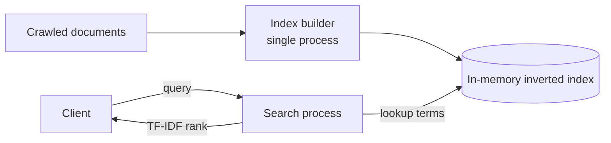
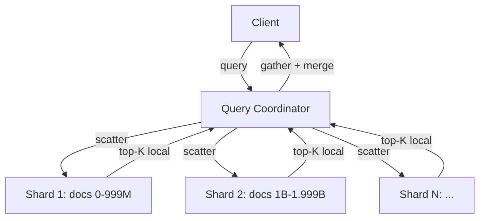
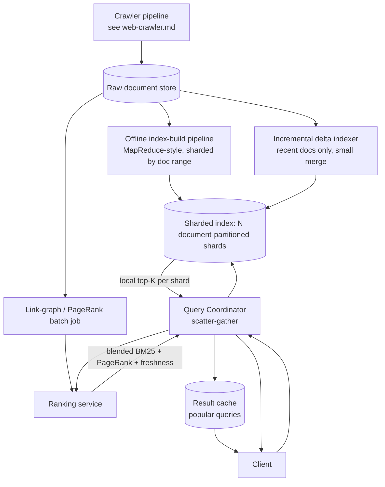

# Design: Web Search Engine

**Difficulty:** Staff | **Time:** 60–75 minutes

!!! note "Instructions"
    Cover each section and work it yourself first. Use "Hint" tabs if stuck. This exercise assumes a corpus already exists — see [Web Crawler](web-crawler.md) for how pages get discovered and fetched. Practice explaining out loud — the way you communicate matters as much as the solution.

---

## 1. Problem Statement

Design the system behind a web search engine: given a corpus of crawled documents, build a structure that answers "which documents contain this term, and in what order should they be shown" in under 200ms, over billions of documents and millions of unique terms.

This is a different problem shape than the other two search-adjacent exercises on this site. [Web Crawler](web-crawler.md) covers *discovery* — how pages get found and fetched into a corpus; it stops at "content is stored." [Autocomplete](autocomplete.md) covers *prefix search* over a bounded set of past queries, ranked by frequency. Neither builds an **inverted index** or does **relevance ranking** over free-text queries against a full-web corpus — that's what's new here: index-then-query, at a scale where the index itself doesn't fit on one machine.

Out of scope: crawling/fetching mechanics (link to web-crawler.md), typeahead-as-you-type suggestions (link to autocomplete.md), and the crawler's freshness scheduling. In scope: turning crawled documents into a queryable index, ranking results, and serving queries fast at scale.

---

## 2. Clarifying Questions

Practice asking these before designing:

??? question "What questions should you ask?"
    - **Corpus size:** How many documents? Growing at what rate?
    - **Query volume:** Queries/second at peak, and average query length (terms)?
    - **Latency target:** What's the end-to-end budget for a search results page?
    - **Freshness:** Does a page need to be searchable minutes after crawl, or is daily reindexing acceptable?
    - **Ranking inputs:** Term frequency only, or also link authority (PageRank-like), freshness, click-through data?
    - **Query features:** Exact phrase, boolean operators, typo tolerance, personalization?
    - **Result format:** Top-10 with snippets, or paginated deep results?
    - **Content removal:** Do takedown/right-to-be-forgotten requests need to propagate, and how fast?

---

## 3. Functional Requirements

- Ingest crawled documents and build a searchable inverted index (term → documents containing it)
- Accept a free-text query and return the top-K most relevant documents
- Rank results by relevance (term frequency/rarity at minimum; link authority as a stretch signal)
- Support incremental index updates as new/changed documents arrive from the crawler
- Support content removal (a document must stop appearing in results)

## 4. Non-Functional Requirements

| Property | Requirement | Reasoning |
|----------|-------------|-----------|
| Query latency | < 200ms p99 end-to-end | Users perceive anything slower as broken |
| Scale | 10B+ documents, 5M+ unique terms | Index cannot fit in one machine's memory |
| Query throughput | 100K+ queries/second at peak | Front page of the internet |
| Freshness | New/changed docs searchable within hours, not real-time | Batch indexing is far cheaper than per-write updates |
| Availability | 99.99% — search is the whole product | A slow shard must not stall the whole query |
| Consistency | Eventual is fine — a few hours of index staleness is invisible to users | Correctness of ranking matters more than millisecond freshness |

!!! tip "Interview Insight 🎯"
    Say the shape of the problem out loud: this is **index-then-query** — an expensive offline build (index construction, ranking-signal computation) feeding a cheap, latency-critical online path (scatter-gather over shards). Almost every design decision below is about keeping those two phases from blocking each other.

---

## 5. Capacity Estimation

```
Corpus:
  10B documents, avg 2 KB extracted text (post-HTML-stripping) → 20 TB raw text
  Avg distinct terms per document: ~500 (after stopword removal, stemming)
  Unique terms across corpus: ~5M (Zipfian — long tail of rare terms)

Index size (postings):
  Total postings = 10B docs × 500 terms/doc = 5 trillion postings
  Per posting (doc_id + term_freq + position list, compressed): ~4-8 bytes avg
  Raw index size: 5T × 6 bytes ≈ 30 TB (before compression)
  With delta-encoding + variable-byte compression: ~8-12 TB

Postings list skew:
  Common term ("the", "search"): appears in ~30% of docs → 3B postings, tens of GB for ONE term
  Rare term: appears in a handful of docs → a few bytes
  This 6-7 order-of-magnitude spread is the central sizing problem — see bottleneck below.

Query load:
  100K qps peak, avg query = 3 terms → 300K term lookups/second
  Query latency budget: 200ms total → ~50-80ms for index scatter-gather, rest for ranking + network

Index build:
  10B docs reindexed on a rolling basis; incremental deltas (new/changed docs) ~50M/day
  Full rebuild (e.g. new ranking signal): 10B docs, parallelized across thousands of workers, hours not minutes
```

!!! abstract "Mental Model"
    You are building a **dictionary lookup that returns a list**, at a scale where both the dictionary and the lists are too big for one machine, and where the lists are wildly uneven in size. Every version below is about (1) making the lookup cheap, (2) keeping the uneven lists from dominating latency, and (3) refreshing the whole thing without stopping queries.

---

## 6. API Design

```
GET /v1/search?q={query}&k=10&offset=0
Response:
  {
    "results": [
      { "doc_id": "...", "url": "...", "title": "...", "snippet": "...", "score": 8.42 }
    ],
    "total_estimate": 4210000,
    "latency_ms": 87
  }

# Ingestion (internal, called by the crawler pipeline / indexing job)
POST /internal/index/documents
  { "doc_id": "...", "url": "...", "text": "...", "crawled_at": "...", "links_out": ["..."] }
  → 202 Accepted (queued for batch indexing, not synchronous)

DELETE /internal/index/documents/{doc_id}   -- takedown / removal request
  → tombstones the doc; must be honored before the next full rebuild completes
```

!!! tip "Interview Insight 🎯"
    Notice the ingestion endpoint returns `202`, not `200` — indexing is a batch/async process, not a synchronous write. If you design this as "call POST and the doc is searchable," you've implied a per-write index update at 10B-document scale, which is the wrong default (see Version 2's freshness discussion).

---

## 7. Data Model

```
Inverted index (the core structure):
  term → postings_list
  postings_list = sorted list of (doc_id, term_frequency, [positions])

  Example:
    "search"  → [(doc_42, tf=3, [12, 88, 340]), (doc_901, tf=1, [5]), ...]
    "engine"  → [(doc_42, tf=1, [13]), (doc_1055, tf=7, [...]), ...]

Document store (separate from the index — parallels pastebin's metadata/blob split):
  doc_id → { url, title, raw_text_pointer, links_out, crawled_at, pagerank_score }
  Lives in a KV/blob store, keyed by doc_id — the index only ever stores doc_ids, never full text.
```

```sql
-- Document metadata, small and hot — lives near the ranking service
CREATE TABLE documents (
    doc_id        BIGINT PRIMARY KEY,
    url           TEXT NOT NULL,
    title         VARCHAR(512),
    content_ptr   VARCHAR(256),    -- pointer into blob storage for full text/snippet generation
    pagerank      FLOAT DEFAULT 0,
    crawled_at    TIMESTAMPTZ NOT NULL,
    removed       BOOLEAN DEFAULT FALSE  -- tombstone for takedowns
);
```

**Why the index doesn't fit on one machine:** 8-12 TB of postings alone exceeds any single machine's usable RAM, and disk-only serving blows the 200ms budget once you account for seek time across a structure this large. Beyond raw size, a single popular term's postings list can be tens of GB by itself — one machine holding the full index still has to scan gigabytes for one term in one query. The index must be **partitioned** — the only question is by what axis (Version 2).

---

## 8. Version 1 — simplest thing that works

Single machine. Build the entire inverted index in memory (or memory-mapped from disk) from a small corpus, rank with brute-force TF-IDF, no sharding.



```python
from collections import defaultdict
import math

def build_index(documents: dict[str, str]) -> dict[str, list[tuple[str, int]]]:
    index = defaultdict(list)
    for doc_id, text in documents.items():
        counts = defaultdict(int)
        for term in tokenize(text):
            counts[term] += 1
        for term, tf in counts.items():
            index[term].append((doc_id, tf))
    return index

def search(index, documents, query: str, k: int = 10):
    terms = tokenize(query)
    n_docs = len(documents)
    scores = defaultdict(float)
    for term in terms:
        postings = index.get(term, [])
        idf = math.log(n_docs / (1 + len(postings)))
        for doc_id, tf in postings:
            scores[doc_id] += tf * idf          # brute-force TF-IDF
    return sorted(scores.items(), key=lambda x: -x[1])[:k]
```

This works for a corpus that fits in memory — thousands to low millions of documents. Ship it, then find the actual bottleneck before adding infrastructure.

---

## 9. Identify the bottleneck

???+ question "You grow the corpus toward the real target (10B documents). What breaks first?"
    - **Index size exceeds one machine.** 8-12 TB of postings does not fit in RAM on any single box, and paging from disk for every query blows the 200ms budget — disk seeks across a structure this large dominate latency.
    - **A single popular term's postings list is enormous on its own.** A query containing "the," "search," or any common word forces a scan of a postings list with billions of entries — even if the *rest* of the index were somehow small enough to fit, this one list alone can take longer than the entire latency budget to scan and score.
    - **Brute-force ranking doesn't scale with list length.** Scoring every posting in a multi-billion-entry list per query is O(list length), not O(k) — you need either a smarter data structure (skip lists to jump ahead) or a way to avoid touching the full list at all.
    - What's *not* the bottleneck yet: query throughput at V1 scale, or write volume (indexing is batch, not per-request).

---

## 10. Version 2 — shard the index

Partition the index across many machines. Two axes, and the choice matters:

- **Document-based sharding:** each shard holds a random/hashed subset of *documents*, with its own complete mini-index over just those docs. A query fans out to **every** shard (each might hold a matching doc), each shard scores its local candidates, and a coordinator merges top-K results. Load balances evenly — no shard is disproportionately hot, because "the" is just as common in every shard's subset. Cost: every query touches every shard, so tail latency is dictated by the slowest shard among thousands.
- **Term-based sharding:** each shard owns a range of *terms*, holding the complete postings list for those terms across the whole corpus. A query for "python tutorial" only needs to contact the 1-2 shards owning "python" and "tutorial" — far less fan-out per query. Cost: postings-list size is Zipfian, so shards owning common terms are wildly bigger and hotter than shards owning rare terms — a rebalancing and hot-shard problem that document-based sharding doesn't have.

**Pick document-based sharding.** At this scale, predictable per-query fan-out cost (touch everything, but evenly) is easier to reason about and load-balance than chasing an ever-shifting hot-shard problem on term ranges. It's also what lets index-building parallelize trivially — each shard builder only needs its own document subset, no global coordination on term boundaries.



Ranking also gets smarter here. Raw TF-IDF ignores document length and over-rewards term stuffing; production systems use **BM25** (TF-IDF's successor — saturates term-frequency contribution and normalizes for document length) as the base relevance signal, often blended with a link-based authority signal like **PageRank** (a document linked-to by many other important documents ranks higher, independent of query terms). Both are conceptual here — the exercise is knowing *that* they exist and *why* they're additive signals, not deriving the math.

---

## 11. Identify the next bottleneck

???+ question "Sharding fixes single-machine limits. What breaks next, at 100K qps and a constantly-changing web?"
    - **Tail latency from fan-out.** Every query hits every shard (document-based sharding), so p99 latency is governed by the *slowest* shard on that query, not the average — see [Tail Latency](../performance/tail-latency.md). One GC pause or one overloaded shard degrades every query that happens to land on it, not just its own traffic.
    - **Index staleness.** The web changes constantly, but rebuilding a 10B-document, 8-12 TB index is a multi-hour batch job. If freshness requirements tighten (e.g. "breaking news searchable in 15 minutes"), a full rebuild cadence can't deliver that — you need a way to layer in recent changes without waiting for the next full rebuild.
    - **Ranking-signal staleness compounds this** — PageRank-like link scores are computed from the link graph, which itself needs a batch job over the whole corpus; a newly-created highly-linked page won't get its authority boost until that job reruns.

---

## 12. Version 3 — production architecture



Key production decisions:

- **Batch index build stays the backbone.** Full rebuilds run on a schedule (daily/weekly) across thousands of workers, sharded by the same document ranges the serving layer uses — no reshuffle needed between build and serve.
- **A small incremental delta index absorbs freshness.** New/changed documents since the last full build go into a much smaller delta structure per shard, merged into query results alongside the main index and folded into the next full rebuild. This is the same pattern as an LSM tree's memtable-plus-SSTables — a cheap, fast-changing layer sitting in front of an expensive, rarely-rebuilt one.
- **Scatter-gather coordinator with per-shard timeouts.** The coordinator issues parallel requests to all shards and returns as soon as it has enough (e.g. after a fixed deadline or after N-of-M shards respond), rather than waiting on the single slowest one — trading a small amount of recall for a bounded p99.
- **Ranking is a separate service**, not baked into each shard, so relevance-signal changes (new features, model updates) deploy independently of the index itself.
- **Result cache in front of the coordinator** absorbs repeat/popular queries — a large fraction of query volume in practice is a small set of head queries, so caching there cuts scatter-gather load dramatically.

---

## 13. Failure analysis

=== "One index shard is slow or down"
    Scatter-gather degrades to N-1 shards, or the coordinator's deadline cuts off a slow shard's response. **Mitigation:** bounded per-shard timeout with partial results returned (missing a small slice of the corpus beats a slow full page); replicate each shard (2-3x) so the coordinator can route around one bad replica instead of losing that shard's documents entirely; track per-shard p99 and auto-drain a consistently slow replica from rotation.

=== "Index build pipeline falls behind"
    The full rebuild cadence slips — a bug, a capacity shortfall, or a burst of crawled volume — and the delta index grows past what it was sized for, slowing every query that has to merge a large delta on top of the stale main index. **Mitigation:** alert on delta-index size and on rebuild-job age; delta indexes are meant to stay small (hours to a day of documents) — if they're not, prioritize finishing the rebuild over shipping new ranking features.

=== "A viral query causes cache stampede on a previously-rare term"
    A term that never got cached (or expired) suddenly gets hit by a burst of identical queries — a breaking-news term, for instance — and every request misses the result cache simultaneously, all landing on the shards at once. **Mitigation:** single-flight/request-coalescing at the coordinator (one in-flight scatter-gather per unique query, others wait on it rather than triggering duplicates); short TTL with jitter to avoid synchronized expiry; pre-warm cache for known trending terms if a trends signal exists upstream.

=== "Link-graph ranking signal goes stale"
    The PageRank-like batch job is expensive and runs infrequently; a newly popular, heavily-linked page doesn't get its authority boost for days, so it under-ranks against older, well-established competitors. **Mitigation:** blend a fast-moving freshness/recency signal alongside the slow authority signal so new content isn't purely dependent on link-graph recompute; treat link-graph staleness as an accepted trade-off and monitor the age of the last successful run rather than trying to make it real-time.

---

## 14. Consistency considerations

- **Eventual consistency is the correct default for search results.** A document being searchable a few hours after it's crawled, or a stale ranking score for a day, is invisible to users and far cheaper than trying to keep the index synchronously up to date.
- **Freshness vs. latency is the core trade-off, not freshness vs. correctness.** Making the index "more real-time" (smaller, more frequent delta merges) costs query latency (more structures to merge per query) and build infrastructure cost; making it batchier costs freshness. Pick a target (e.g. "searchable within a few hours") and design the delta-index size around it rather than chasing "instant."
- **Takedowns/removals are the one place strong-ish consistency matters.** A tombstone (`removed = true`) must be checked at query time regardless of index build state — same pattern as pastebin's TTL check — so a removal is *effective* immediately even if the document isn't physically purged from the index until the next rebuild.

---

## 15. Observability

```
Metrics:
  query_latency_p50/p95/p99 (SLO: p99 < 200ms)
  shard_response_time_p99 (per shard — find the slow one)
  shard_timeout_rate
  coordinator_partial_result_rate (how often we return without all shards)
  cache_hit_rate{cache=result_cache}
  index_build_duration, index_build_age
  delta_index_size (alert if it grows past expected bound)
  ranking_signal_age (link-graph job last-success timestamp)

Alerts:
  p99 query latency > 300ms
  any shard p99 > 3x fleet median
  delta_index_size > 2x expected
  full_rebuild_age > 2x scheduled cadence
  cache_hit_rate drop > 20% (possible stampede or cold cache after deploy)
```

---

## 16. Cost analysis

```
Index storage (8-12 TB compressed, replicated 3x for availability): ~30-36 TB
  On SSD-backed shard hosts: ~$3,000-5,000/month depending on provider

Serving fleet (thousands of shard replicas + coordinators):
  Dominated by compute for scatter-gather fan-out at 100K qps — largest line item

Batch index-build pipeline (periodic, not always-on):
  Thousands of worker-hours per full rebuild; amortized cost depends on cadence
  Daily rebuild is far more expensive than weekly — tune cadence against freshness requirement, not habit

Result cache (Redis/similar, sized for head-query set):
  Small relative to index/serving cost — but the highest-leverage cost lever, since
  a small cache absorbing a large fraction of query volume directly cuts shard fan-out cost

Cost lever: term-based sharding would reduce per-query shard fan-out (fewer machines touched
  per query) but reintroduces the hot-shard rebalancing cost this design deliberately avoided —
  revisit only if serving-fleet cost dominates and hot-shard tooling already exists.
```

---

## 17. Alternative architectures

=== "Term-partitioned index"
    Each shard owns a term range; a query only fans out to the 1-2 shards owning its terms. Lower per-query fan-out and lower average latency, at the cost of severe load imbalance (a shard owning "the" is orders of magnitude hotter than one owning a rare term) and much harder rebalancing as the term distribution shifts. Better fit when queries are short and the term-frequency distribution is well understood and can be actively rebalanced.

=== "Real-time incremental indexing"
    Instead of batch rebuild + delta merge, update the index in near-real-time per document (closer to a search database like Elasticsearch's near-real-time refresh). Much fresher, but a per-write index update at 10B-document scale is dramatically more expensive in aggregate than batch, and complicates ranking-signal consistency (a link-graph score can't be recomputed per-write). Reasonable for a smaller, more dynamic corpus (e.g. a product catalog); not the default choice for open-web search.

=== "Single mega-index with tiered storage (hot/cold)"
    Keep the whole index logically together but tier by document popularity/freshness — hot documents in memory, cold in cheaper storage — rather than sharding by range. Simplifies query routing (no coordinator fan-out) but reintroduces the single-machine-index scaling wall this design exists to avoid; only viable at a much smaller corpus size than the web.

---

## 18. Staff Engineer Extensions

=== "100x traffic (10M qps)"
    Result cache hit rate becomes the dominant lever — a large majority of that volume is repeat head queries, so cache capacity and hit rate matter more than shard count. Beyond that, horizontally add shard replicas (read-only, cheap to scale) rather than more primary shards — replicas don't need to participate in index builds, only serve reads.

=== "Multi-region"
    Replicate the built index globally (read-only artifact, easy to ship region-to-region once built) so queries stay in-region for latency. Keep the index-build pipeline **centralized** in one region — it's a batch job reading from a single raw-document store, and running it redundantly per region multiplies build cost without a freshness benefit. Ship the finished index artifact, not the raw corpus, to each region.

=== "Data residency / right-to-be-forgotten"
    A genuinely hard constraint here: removal must propagate everywhere the index is replicated, and "everywhere" includes region copies and any delta indexes in flight. Tombstone at the document store first (checked at query time regardless of index state, same pattern as takedowns above) so the removal is *effective* immediately, then propagate the physical purge through the next full rebuild in every region. Track propagation lag per region and alert if a tombstoned document is still being served past an SLA window — this is one of the few places in this design where "eventually consistent" needs a hard upper bound, not just a best effort.

=== "Zero-downtime index-schema migration"
    Changing the postings-list format (e.g. adding a new ranking feature per posting) or the ranking-signal set can't mean taking shards offline. Build the new-format index alongside the old one from the same raw corpus (dual index-build pipelines, more build cost temporarily), validate relevance metrics against a shadow query stream, then cut the coordinator over shard-by-shard behind a flag. Never change the postings-list binary format and the ranking algorithm in the same rollout — isolate variables so a relevance regression is traceable to one change.

---

## 19. Interview follow-ups

1. **"Why document-based sharding and not term-based?"** — Predictable, even load per query beats lower average latency with a chronic hot-shard problem. Say this trade-off explicitly; both are valid answers if justified.
2. **"How would you support phrase queries ('exact phrase' search)?"** — Requires position information in postings (already in the data model), and intersecting position lists across terms to confirm adjacency — more expensive per query than a bag-of-words match, so it's often a distinct, more selective query path.
3. **"How is this different from the autocomplete exercise?"** — Autocomplete ranks a bounded, pre-known set of past queries by frequency against a *prefix*; this ranks an open-ended corpus of documents against free-text *content* match plus relevance signals. Different data structure (trie/precomputed suggestion lists vs. inverted index), different ranking problem entirely.
4. **"What happens if two documents have near-identical content (mirrors, syndication)?"** — Out of scope for this exercise's core, but flag it: near-duplicate detection belongs in the crawler/ingestion pipeline (see web-crawler.md) before documents ever reach the indexer, not as a query-time dedup step.

---

## Self-Assessment

- [ ] I can explain why the index doesn't fit on one machine, with the postings-list size numbers
- [ ] I can justify document-based sharding over term-based sharding, including what it gives up
- [ ] I can describe why the delta-index-plus-batch-rebuild pattern resolves freshness vs. latency
- [ ] I can name a scatter-gather tail-latency mitigation that isn't "make every shard faster"
- [ ] I can explain why search results are eventually consistent but takedowns need a stricter bound
