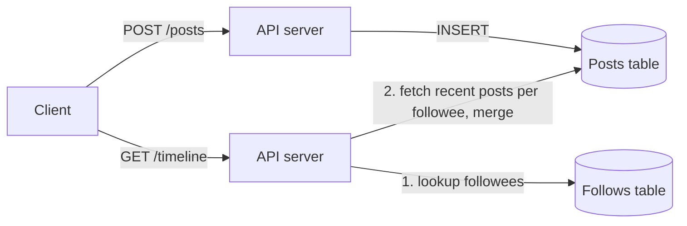
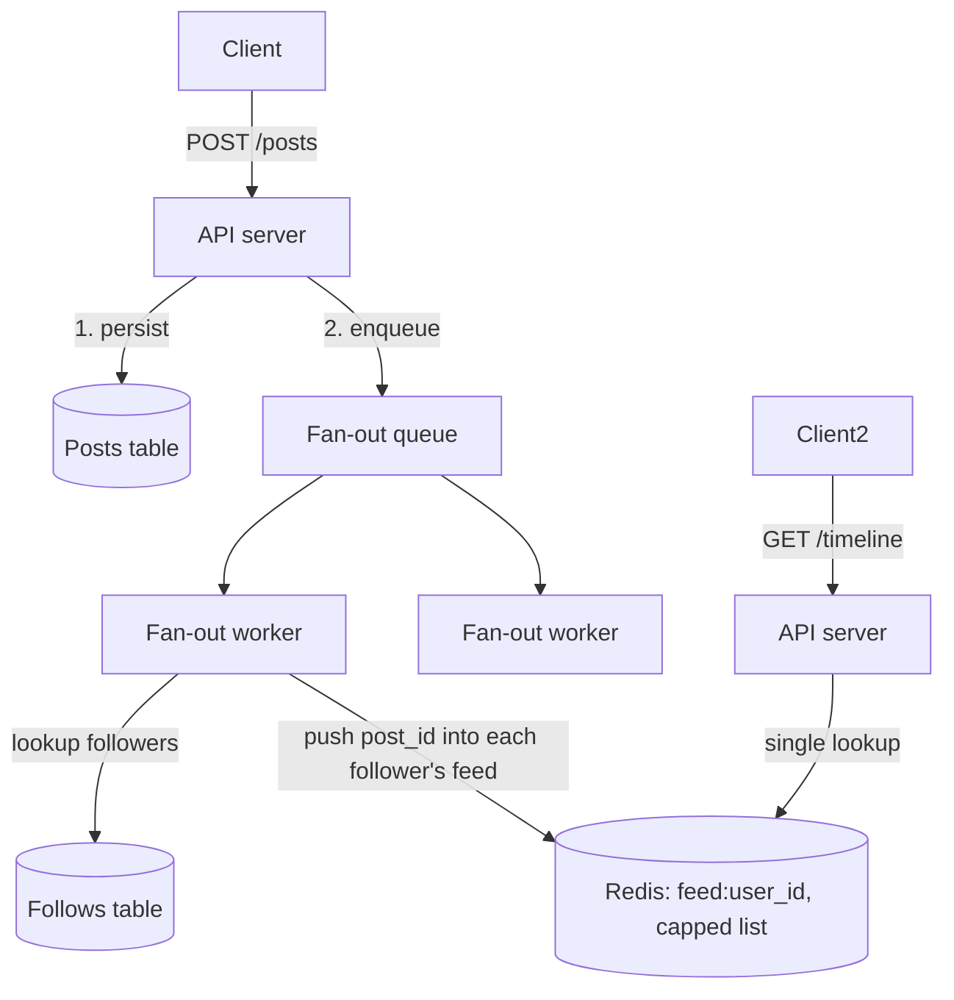

# Design: Social Media Feed (Twitter/X-style)

**Difficulty:** Senior/Staff | **Time:** 60–75 minutes

!!! note "Instructions"
    Cover the solution sections. Draw V1 yourself before opening later diagrams. The interview is won on the **fan-out trade-off** and the **celebrity problem**, not on naming Cassandra.

---

## 1. Problem Statement

Design a home timeline like Twitter/X. A user follows other users. When they open the app, they see a feed of recent posts from everyone they follow, newest-ish first. Posting should feel instant. Reading the feed should feel instant. Some accounts have 100M+ followers; some users follow tens of thousands of accounts. Both extremes have to work on the same system.

Start from that product. Do not start from Kafka.

---

## 2. Clarifying Questions

??? question "What questions should you ask?"
    - **Chronological or ranked?** Strict reverse-chron, or a ranking model reordering the last N posts?
    - **Who can post to whom?** Public follow graph (Twitter-style) vs mutual friends (different fan-out shape)?
    - **Celebrity accounts:** what's the follower distribution — is there a long tail with a handful of 10M+ accounts, or is it flatter?
    - **Feed freshness SLA:** does a post need to appear in a follower's feed within seconds, or is a minute acceptable?
    - **Feed depth:** how far back does "the feed" go — last 24h, last 800 posts, infinite scroll to the beginning of time?
    - **Retweets/reposts and replies:** do they fan out too? Does a like count as an engagement signal that reorders things?
    - **Read vs write ratio:** how many feed reads per post write?
    - **Scale:** DAU, posts/day, average followee count, p99 feed-load time?
    - **Multi-region?** Data residency requirements?

---

## 3. Functional Requirements

- Follow / unfollow a user (directed, not mutual)
- Post a short text/media update
- View a home timeline: posts from followees, reverse-chronological (V1), rankable later
- Paginate/scroll back through the feed
- Handle accounts with very large follower counts without falling over

Out of scope for V1: ranking model internals, retweets, replies-as-threads, DMs, trending topics.

## 4. Non-Functional Requirements

| Property | Requirement | Reasoning |
|----------|-------------|-----------|
| Feed read latency | < 200ms p99 | Feed loads on every app open |
| Post write latency | < 200ms p99 (ack to author) | Poster should not wait for fan-out |
| Fan-out completion | < 10s p99 for accounts under threshold; best-effort for celebrities | "New post" should feel near-live for normal users |
| Availability | 99.95% read path | Feed is the product; writes can degrade before reads do |
| Staleness | A follower may miss a post for a bounded window, never silently forever | Eventual, not "eventually never" |
| Durability | No post lost after write-ack, even if fan-out fails | Trust in the write path |

---

## 5. Capacity Estimation

```
300M DAU, 500M total users
  Avg user: posts 0.5×/day, follows 200 accounts, has 200 followers (median, NOT mean)
  Celebrity accounts: ~1,000 accounts with 1M–50M followers each (long tail)

Writes (posts):
  500M users × 0.5 posts/day ≈ 250M posts/day ≈ 2,900 posts/s average, ~10x peak ≈ 29K posts/s

Naive fan-out-on-write cost (writing post-id into every follower's feed):
  Average post: 200 followers → 250M × 200 ≈ 50B feed-writes/day just for average users
  One celebrity post (50M followers): 50M individual feed-writes for ONE post
  If 1,000 celebrities post 2×/day: 1,000 × 2 × 25M avg followers ≈ 50B MORE feed-writes/day
  → celebrities alone roughly double total fan-out volume despite being 0.0002% of accounts

  At 50M writes for one post, even at 500K writes/s per fan-out cluster,
  that ONE post takes 100 seconds to fully propagate — during which the write queue
  for every other post backs up behind it. This is why naive fan-out-on-write breaks.

Reads (feed loads):
  300M DAU × 6 feed loads/day ≈ 1.8B reads/day ≈ 21K reads/s average, ~5x peak ≈ 100K reads/s
  Read:write ratio ≈ 7:1 on requests, but fan-out-on-write turns 1 post into 200–50M
  downstream writes — so the SYSTEM's write amplification is what dominates capacity,
  not the read:write ratio you'd guess from request counts alone.

Storage:
  Post body: ~300B text + metadata ≈ 500B/post × 250M/day × 365 × 3yr ≈ 137TB (posts, cheap, append-only)
  Per-user feed cache: cap at 800 post-IDs × 8 bytes × 500M users ≈ 3.2TB (Redis/Cassandra, must fit hot tier)
```

!!! tip "Interview Insight 🎯"
    The number that should stop you cold is **50M writes for a single post**. That single number is the entire justification for a hybrid fan-out strategy — say it out loud before you draw anything. Interviewers are listening for "I will not fan out on write above some follower threshold," not for a diagram.

---

## 6. API Design

```
POST /v1/posts
  { text, media_ids? }
  → { post_id, created_at }

GET /v1/timeline/home?cursor=&limit=20
  → { posts: [{ post_id, author_id, text, created_at, ... }], next_cursor }

POST /v1/follow/{user_id}
DELETE /v1/follow/{user_id}

GET /v1/users/{id}/followers?cursor=   (paginated — can be tens of millions)
GET /v1/users/{id}/following?cursor=

# Internal, not client-facing
POST /internal/fanout   (queue message: { post_id, author_id })
```

`cursor` on the home timeline is an opaque offset into the precomputed feed (V1/V2) or a merge cursor across sources (V3 hybrid) — never a raw offset, so pagination survives new posts arriving mid-scroll.

---

## 7. Data Model

```sql
-- Social graph: sharded by user_id, NOT by post. You look up "who does X follow"
-- and "who follows X" far more than any post-centric join, so shard on the person.
CREATE TABLE follows (
    follower_id   UUID NOT NULL,
    followee_id   UUID NOT NULL,
    created_at    TIMESTAMPTZ NOT NULL,
    PRIMARY KEY (follower_id, followee_id)
);
CREATE INDEX idx_followee ON follows (followee_id, follower_id);  -- "who follows X"

-- Posts: sharded by post_id / author_id. Source of truth, immutable, append-only.
CREATE TABLE posts (
    post_id       UUID PRIMARY KEY,
    author_id     UUID NOT NULL,
    text          TEXT NOT NULL,
    media_ids     UUID[],
    created_at    TIMESTAMPTZ NOT NULL
);
CREATE INDEX idx_author ON posts (author_id, created_at DESC);

-- Per-user feed: a capped list, not a table you JOIN at read time.
-- Redis: LPUSH + LTRIM to 800 entries, key = feed:{user_id}
-- Cassandra alt: partition key = user_id, clustering key = created_at DESC, capped by TTL/compaction
```

The feed is deliberately **not** `SELECT posts WHERE author_id IN (SELECT followee_id FROM follows WHERE follower_id = ?) ORDER BY created_at DESC` at read time for most users — that join is fine at 100 QPS and catastrophic at 100K QPS with users following 200 accounts each. Precompute it.

---

## 8. Version 1 — the simplest thing that works

One post table, one query, fan-out-on-read for everyone. No precomputed feed at all.



**Write path:** insert the post. Done. No fan-out at all.
**Read path:** look up who you follow, fetch their recent posts, merge-sort by time, return top 20.

This teaches the core trade-off directly: writes are trivial, reads do all the work.

**It dies at** a few thousand feed reads/second — every read is now a scatter-gather across up to hundreds of followee shards, then a merge. That is the point of V1: you now feel exactly where fan-out-on-read hurts.

---

## 9. Bottlenecks

???+ question "Where does V1 break first?"
    - **Read amplification:** one feed load = N lookups (N = followee count, up to thousands for power users) + a merge. Users following 500 accounts turn one page load into 500 point queries.
    - **Hot followees:** a celebrity's posts get fetched independently by millions of concurrent feed reads — same rows, read constantly, no caching layer.
    - **No caching story:** every feed load recomputes from scratch; nothing amortizes across requests even though most users refresh the same feed repeatedly.
    - **Tail latency:** feed latency is bounded by the *slowest* followee shard you have to query — one slow shard slows every follower's feed.

---

## 10. Version 2 — fan-out on write, precomputed feeds

Flip the trade-off: pay the cost at write time so reads are a single lookup.



**Write path:** persist the post, ack the author immediately, enqueue a fan-out job asynchronously. Workers pull the job, look up the follower list, and push the `post_id` onto each follower's capped feed list in the fast store.

**Read path:** `LRANGE feed:{user_id} 0 19` — one lookup, done. This is why fan-out-on-write wins on reads: the expensive scatter-gather has already happened, off the critical path, before anyone asked for it.

**Still missing:** this is exactly the naive approach from Section 5 — a 50M-follower account still means 50M individual writes per post, queued behind everyone else's fan-out. There is no ranking insertion point. There is no plan for a fan-out worker crashing halfway through 50M writes.

---

## 11. Version 3 — hybrid fan-out, production-grade

Split strategy by follower count. Most accounts fan out on write, as in V2. Accounts above a threshold (e.g. 1M followers) skip fan-out entirely — their posts are merged in at read time.

```mermaid
graph TD
    subgraph Write
      Post[New post] --> Classify{Author follower count\n> threshold?}
      Classify -->|No: fan-out on write| Q[Fan-out queue]
      Classify -->|Yes: celebrity, skip fan-out| Skip[Write to posts table only]
      Q --> W[Fan-out workers\nidempotent, checkpointed]
      W --> FeedStore[(Feed store: Redis/Cassandra\ncapped per-user list)]
      Skip --> CelebPosts[(Celebrity posts index\nby author, recent-first)]
    end
    subgraph Read
      Client -->|GET /timeline| Merger[Feed service]
      Merger -->|1. read precomputed feed| FeedStore
      Merger -->|2. read celebrity followees' recent posts| CelebPosts
      Merger -->|3. merge-sort, optional rank| Ranker[Ranking pass — insertion point only]
      Ranker --> Client
    end
    Merger -->|which celebrities does this user follow?| Follows[(Follows service, sharded by user)]
```



**Threshold policy:** an account crosses into "celebrity" fan-out-on-read treatment once its follower count exceeds a configured cutoff (e.g. 1M). This is a small, dynamically-updated set — check membership on every post (cache it, do not re-query the graph per post).

**Fan-out worker idempotency:** each fan-out job is `(post_id, author_id)`. A worker claims a batch of follower shards, and for each shard performs `SADD feed_written:{post_id} {shard_id}` (or a per-job checkpoint row) *before* moving to the next shard. If the worker crashes mid-fanout, a retry re-reads the checkpoint and resumes from the first unwritten shard instead of re-pushing to followers who already have it — feed lists use a capped/deduped structure (e.g. `ZADD` by timestamp instead of blind `LPUSH`) so a duplicate push is a no-op, not a duplicate entry. Some followers seeing the post before others during the crash-and-resume window is expected and acceptable; a follower *never* seeing it permanently is not — that is what the checkpoint guarantees.

**Ranking insertion point:** V1–V2 return the precomputed feed as-is (reverse-chronological). In V3, the merge step produces a candidate set (recent posts from precomputed feed + celebrity followees), and a ranking pass reorders that bounded candidate set (e.g. last 200–500 candidates) before returning the top 20. The ranking model itself — features, training, freshness decay — is a separate system and out of scope here; the interview-relevant point is only that ranking operates on a small, already-assembled candidate list, not on the whole graph.

**Social graph as its own service:** `follows` is sharded by `user_id` (both follower and followee lookups need to be fast, so it's indexed both directions but partitioned by follower for the common "who do I follow" read). This is a distinct service/store from posts and feeds because its access pattern (graph traversal, "who follows X" for a celebrity can be tens of millions of rows) and its write pattern (follow/unfollow are low-volume, latency-insensitive) are nothing like the posts or feed stores. Sharding it by post would make "who does this user follow" a scatter-gather across every shard — exactly the mistake to avoid.

---

## 12. Read amplification vs write amplification, worked both ways

It helps to say both halves of the trade-off out loud, with numbers, rather than asserting "fan-out-on-write is faster to read."

```
Fan-out-on-read cost per feed load (average user, 200 followees):
  200 point lookups (or a few range scans if followee posts are pre-grouped) + merge-sort
  At 100K feed reads/s peak → up to 20M downstream point queries/s. This is the number
  that kills pure fan-out-on-read: it is READ amplification, hiding inside what looks
  like one API call.

Fan-out-on-write cost per post (average user, 200 followers):
  200 feed-list writes, async, off the critical path of the post-ack. Cheap per-post,
  and it happens once per post rather than once per read — the classic write-once,
  read-many amortization argument.

Fan-out-on-write cost per post (celebrity, 50M followers):
  50M feed-list writes for ONE post. This inverts the amortization argument: a celebrity
  post is read by a small fraction of 50M followers before the next post arrives, so
  most of those 50M writes are wasted work nobody will read before it scrolls off.
  This is exactly why celebrities get read-time merge instead — merge-at-read only
  does work proportional to feed LOADS, not to follower COUNT.
```

The hybrid isn't "the best of both" in a hand-wavy sense — it is applying fan-out-on-write only where write-once-read-many actually holds (bounded follower counts) and fan-out-on-read only where per-post write cost would otherwise be wasted at massive scale (celebrities).

---

## 13. Failure analysis

=== "Fan-out worker crashes mid-fanout"
    A worker is 60% through pushing a post to a celebrity-adjacent account's 2M followers when the pod is killed.
    **Mitigation:** checkpoint progress per shard batch (Section 11); retry resumes from the checkpoint, not from zero. Feed writes are idempotent (`ZADD` keyed by `post_id`, not append), so a resumed job that re-pushes to an already-written follower is harmless.
    **User-visible:** some followers see the post seconds before others — acceptable staleness, not a correctness bug. It becomes a bug only if the job is never retried.
    **Prevention:** fan-out queue has at-least-once delivery with dead-letter after N retries; alert on jobs stuck incomplete past an SLA.

=== "Feed store (Redis/Cassandra) node down"
    A shard holding a slice of users' precomputed feeds is unavailable.
    **Mitigation:** replicated feed store (each user's feed list replicated to 2+ nodes); on total shard loss, fall back to fan-out-on-read for the affected users' feeds until the shard is rebuilt from posts + follows (feeds are a derived/rebuildable cache, not the source of truth).
    **Prevention:** replica count ≥ 2, automated shard rebuild pipeline replaying recent posts for affected users.

=== "Fan-out queue backs up (celebrity storm)"
    Several large accounts post within the same minute; queue depth spikes, normal users' fan-out jobs get stuck behind celebrity-adjacent jobs.
    **Mitigation:** separate queues/priority lanes by author size — small-follower-count fan-out jobs should never wait behind a large one. Celebrity accounts already skip fan-out-on-write (Section 11), which is precisely why this policy exists.
    **Fix:** rate-limit and shard the queue by author-size class; auto-scale fan-out workers on queue depth.

=== "Feed missing recent posts (staleness)"
    A user opens the app and doesn't see a post from 3 minutes ago because the fan-out job for that post is delayed.
    **Mitigation:** this is expected eventual consistency, not a bug — see [Consistency Models](../distributed-systems/consistency-models.md) for the general trade-off. Bound it: alert if fan-out lag p99 exceeds the SLA (Section 4), and for celebrity-adjacent posts (read-merged, not fanned out) staleness is naturally near-zero since there's no queue to lag behind.
    **User-visible:** pull-to-refresh should re-merge from source, not just re-read a stale cached feed, so a manual refresh always self-heals.

=== "Social graph service degraded"
    Follows lookups slow down or fail; fan-out workers can't resolve follower lists, and read-time merge can't resolve celebrity followees.
    **Mitigation:** cache the celebrity-threshold list and each user's celebrity-followee set (small, changes rarely) separately from the full graph, so celebrity merge-at-read keeps working even if the general graph service is degraded. Fan-out jobs queue up and drain once the graph service recovers — posts are already durably persisted, nothing is lost.

---

## 14. Consistency

- **Post durability is the line.** Once a post is written and acked, it must never be lost — fan-out failure delays visibility, it must never cause data loss (the post row is the source of truth; feeds are a derived, rebuildable index).
- **Feed visibility is eventually consistent by design**, not an accident. State that explicitly: a follower's feed converges to include a new post within the fan-out SLA, and read-time merge for celebrity followees converges even faster since there's no queue.
- **Read-your-own-writes for the author:** the author should always see their own post immediately (read it directly from `posts`, or self-insert into their own view), even before fan-out to followers completes.
- **No global ordering needed.** Ordering is per-feed (by timestamp, or by rank score), never a cross-user total order.

---

## 15. Reliability

- Post write is the durability boundary: persist → ack → enqueue fan-out. Never ack before the post row exists.
- Fan-out is at-least-once with idempotent writes into feed lists (Section 11) — safe to retry, safe to duplicate-process.
- Feed store is a cache/derived index: any shard can be rebuilt from `posts` + `follows` if lost, which is why it's acceptable to run it on a fast-but-less-durable store (Redis) rather than treating it like the system of record.
- Circuit-break the celebrity read-merge path independently from the precomputed-feed read path, so one slow dependency doesn't take down both halves of the merge.

---

## 16. Security

- Authorization on every post read: private/protected accounts must filter out non-approved followers at the merge step, not rely on the client.
- Rate-limit posts and follows per account (see [Rate Limiter](rate-limiter.md)) — unbounded follow/unfollow churn is a cheap way to abuse the fan-out threshold classification.
- Blocked/muted users must be filtered before the ranking pass, not after — never let a blocked account's content reach the client and rely on client-side hiding.
- Media URLs signed and short-lived, same pattern as other systems in this series.

---

## 17. Observability

```
post_write_ack_ms                         p50 / p99
fanout_job_lag_s{author_size_class}       time from post persisted → fan-out complete
fanout_jobs_stuck_incomplete_total        (should be ~0, alerts if not)
feed_read_ms{path=precomputed|hybrid_merge}
celebrity_merge_ms                        p99 for read-time merge specifically
feed_store_replica_lag_s
graph_lookup_ms{op=followees|followers}

Alerts:
  fanout_job_lag_s p99 > SLA for non-celebrity authors
  fanout_jobs_stuck_incomplete_total > 0 for > 5 min
  feed_read_ms p99 > 200ms
  celebrity_threshold_list staleness > 1h (missed a newly-crossed-threshold account)
```

---

## 18. Cost (order of magnitude)

```
Fan-out worker fleet:          scales with post rate × avg follower count — largest compute line
Feed store (Redis/Cassandra):  ~3TB hot working set, replicated ×2-3 — significant memory-tier cost
Posts store:                   ~137TB over 3 years, append-only, cheap object/columnar storage
Social graph store:            smaller than posts/feeds, but latency-sensitive, needs its own tier
Ranking service:                separate cost center, out of scope here

Lever: raise the celebrity threshold to push more accounts into read-time merge (cuts fan-out
compute, adds read-time merge cost) — this knob is the single biggest cost lever in the system.
Cap feed list length aggressively (800, not 8,000) — most users never scroll past the first 40.
```

---

## 19. Alternatives

=== "Pure fan-out-on-read for everyone"
    Simplest write path, V1 of this doc. Falls over on read QPS long before fan-out-on-write falls over on write QPS, because reads vastly outnumber writes (Section 5). Fine for a small/internal tool, wrong for consumer scale.

=== "Pure fan-out-on-write for everyone"
    Simplest read path. Breaks immediately on celebrity accounts (Section 5's 50M-write number) — this is the mistake the hybrid design exists to avoid. Workable only if the product forbids large follower counts (some enterprise/team chat tools do this deliberately).

=== "Push-based feed via a pub/sub broadcast"
    Treat fan-out as a literal pub/sub topic per user, subscribed to their followees — see [Messaging Patterns](../messaging/patterns.md) for the general fan-out pattern this maps to. Workable at moderate scale; still needs the same celebrity carve-out once one topic has 50M subscribers, so it doesn't remove the core trade-off, just relocates it into the messaging layer.

---

## 20. Interview follow-ups

1. **Why not just cache the fan-out-on-read query instead of building a whole hybrid system?** Caching helps hot followees but the read is still a scatter-gather across hundreds of followee shards per request; caching reduces per-shard cost, not the fan-in cost of merging hundreds of sources on every feed load.
2. **How do you pick the celebrity threshold?** Empirically: the threshold where fan-out-on-write's write cost for that account exceeds the read-time merge cost across all its followers' feed loads. In practice a round number like 1M-10M followers, revisited as the graph grows.
3. **What happens to a user who unfollows a celebrity right after a post was read-merged into their feed?** The merge is stateless per-request — the next feed load simply won't include that celebrity's posts anymore. No cleanup needed, unlike fan-out-on-write where a stale push would need explicit removal.
4. **How do replies and retweets change the fan-out shape?** They fan out too, often to a different graph (repost fans out to the reposter's followers, not the original author's), which can multiply write amplification — worth flagging as a follow-on design question, not solving live.
5. **Where would you cache feed reads, given they're already a single fast-store lookup?** See [Cache Strategies](../performance/cache-strategies.md) — even a single-lookup feed read benefits from an edge/CDN-adjacent cache for the top-N unauthenticated or rarely-changing portion, and from client-side caching to avoid re-fetching on every app foreground.

---

## 21. Staff Engineer Extensions

=== "100× traffic"
    29K posts/s becomes 2.9M posts/s. The celebrity carve-out becomes non-negotiable — even "normal" accounts at this scale need a lower fan-out threshold. Shard the fan-out queue by author-size class from day one; consider fanning out only to *active* followers (skip users who haven't opened the app in 30 days, backfill on their next open) to cut write volume for accounts that are merely large, not necessarily engaged.

=== "Cut cost 30%"
    Lower the celebrity threshold (shifts cost from fan-out compute to read-time merge, which is cheaper in aggregate since reads are already paying for a lookup regardless). Shrink capped feed list length. Fan out only to followers active in the last N days; lazily backfill others on next open instead of maintaining their feed continuously. Compress/tier posts older than 90 days out of the hot store.

=== "Global expansion"
    Feed reads should hit the region closest to the reader; posts should replicate to all regions asynchronously since a post is immutable and eventually-consistent replication is already the model. The follows graph is read far more than written — replicate it broadly, accept eventual consistency on follow/unfollow propagation (a few seconds of "I unfollowed but still saw one more post" is acceptable).

=== "Data residency"
    A user's follow-graph edges and feed cache can be considered their data — home them in-region like the per-user stores in other designs in this series. The harder case: an EU user follows a US celebrity. The post content still needs to reach the EU reader; residency rules typically apply to *storage of the user's personal data* (their follow list, their feed), not to *reading* public content across the border — confirm this distinction explicitly in an interview rather than assuming no cross-region read is ever allowed.

=== "Regional failure"
    If a region hosting a slice of the feed store goes down, degrade to fan-out-on-read for affected users rather than serving an empty feed — the posts and follows data still exist (replicated), just not the precomputed cache. This is the same "cache is rebuildable, source of truth is not" property from Section 12, now applied at regional scale.

=== "Zero-downtime feed-store migration"
    Dual-write new fan-out jobs to old and new feed stores; backfill existing users' feeds into the new store in the background by replaying `posts` + `follows`; shift reads store-by-store once backfill for that shard is verified caught up; keep the old store live until the new one has absorbed a full fan-out SLA window with no read discrepancies.

---

## Self-Assessment

- [ ] I can state the 50M-writes-for-one-post number without being prompted
- [ ] I can explain why fan-out-on-write and fan-out-on-read are both individually wrong at scale, and why the hybrid isn't a compromise but a different tool for a different follower-count regime
- [ ] I can describe how a crashed fan-out worker resumes without double-delivering or silently dropping followers
- [ ] I know why the social graph is sharded by user, not by post
- [ ] I can name the ranking insertion point without pretending to design the ranking model itself
