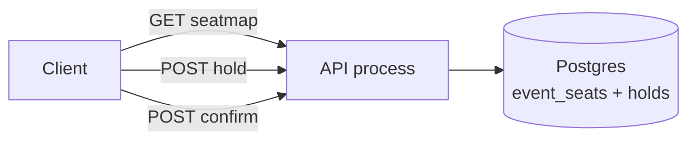
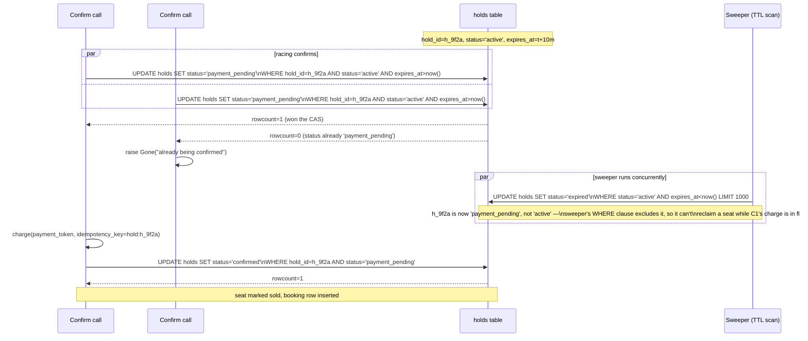
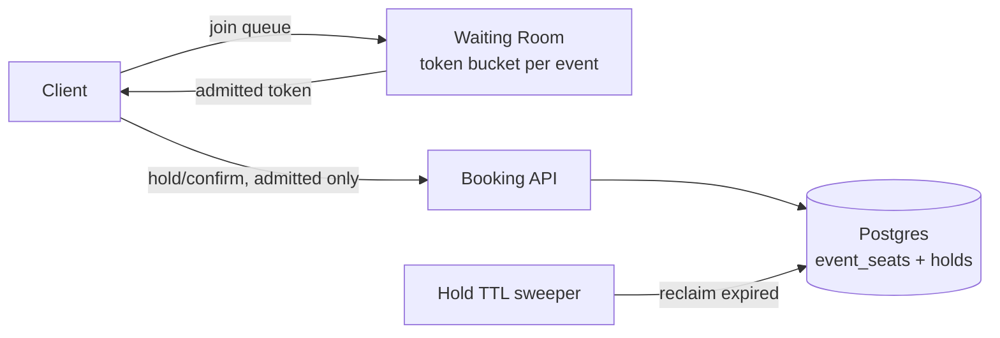
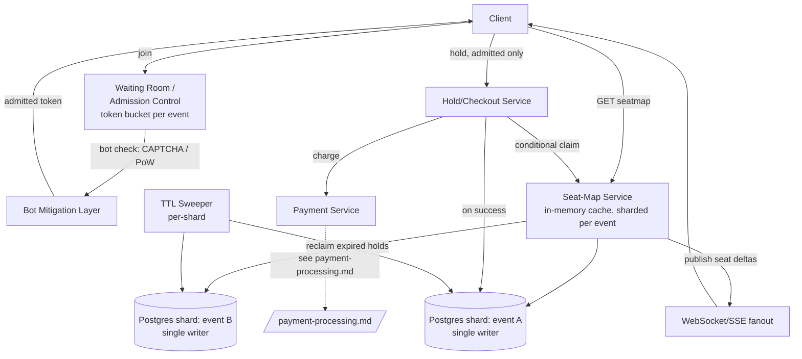

# Design: Ticket Booking (Ticketmaster / BookMyShow)

**Difficulty:** Senior | **Time:** 60–75 minutes

!!! note "Instructions"
    Cover each section and work it yourself first. Before every "Version N" reveal there is a `???` box — commit to an answer before you open it. This exercise is not "another inventory system" — the whole point is figuring out *why* it isn't one before you draw a single box.

---

## 1. Problem Statement

Design a service for booking seats to a specific event — a movie showtime or a concert. A user browses to an event, sees a seat map, picks specific seats (`A12`, `A13`), holds them while they enter payment, and confirms. Compare this to checking out a t-shirt on an e-commerce site: there, "inventory" is a count (`stock = 47`), and any 47 units are interchangeable. Decrementing a counter with an atomic `UPDATE ... SET stock = stock - 1 WHERE stock > 0` solves that problem completely.

Here, inventory is **fixed, enumerated, and addressable**. Seat `A12` is not a fungible unit of "one ticket" — it is a specific physical location the UI must render, let the user click, and hold *for that user* while every other concurrent shopper sees it turn gray. You cannot sell "a seat" and assign it later; the user chose that seat because it's next to their friend in `A13`. This turns checkout into a per-row contention problem across thousands of rows, not a single counter.

Now add the demand shape that makes this a systems problem instead of a CRUD problem: a superstar's tour goes on sale for one night at one 20,000-seat arena, and **500,000 people** hit "buy" inside the first 60 seconds. That's 25 people fighting over every seat, simultaneously, against a seat map that must stay visually and transactionally correct for all of them at once. A stock counter under this load just serializes fast decrements. A seat map under this load has 20,000 separate hot rows, a UI that must reflect state changes within seconds, bots trying to hold every seat before a human's browser finishes rendering, and a real-world consequence — a double-sold seat is a fistfight at will-call, not a refunded order.

---

## 2. Clarifying Questions

??? question "What questions should you ask?"
    - **Granularity:** Named/numbered seats (reserved seating) or general admission (just a headcount)? This exercise assumes reserved seating — it's the harder case.
    - **Hold duration:** How long does a user get to hold selected seats before checkout must complete?
    - **Group size:** Can a user hold multiple seats in one transaction (buying 4 tickets together)?
    - **Fairness:** Is this strict first-come-first-served, or does the business want a lottery/raffle for extreme-demand events?
    - **Bots:** What's the expected scale of automated/scalper traffic, and is CAPTCHA or proof-of-humanity acceptable at admission?
    - **Payment:** Is payment collected before or after seats are held? (Almost always: hold first, pay second — never charge a card for a seat you might lose.)
    - **Cancellations/refunds:** Do seats go back on sale after a cancellation, and how fast must that be reflected?
    - **Scale of a single on-sale moment:** Peak concurrent users, seats in the venue, and how "hot" is this one event relative to normal daily traffic?
    - **Multi-event isolation:** Does a popular concert's traffic pattern need to be isolated so it can't degrade ticket sales for unrelated events?

---

## 3. Functional Requirements

- Show a real-time seat map for an event (available / held / sold)
- Let a user select one or more specific seats and place a **time-limited hold**
- Let a user complete checkout (payment) against a held selection, converting hold → sold
- Automatically release an expired hold back to available
- Admit users into the booking flow in a way that's fair, not a race decided by client network latency
- Prevent the same seat from being sold to two different users under any concurrency

## 4. Non-Functional Requirements

| Property | Requirement | Reasoning |
|----------|-------------|-----------|
| Seat-state consistency | Strongly consistent — no seat may show "available" to two users who can both purchase it | A seat sold twice is a real-world conflict at the venue door, not an eventually-consistent inconvenience |
| Hold duration | 10 minutes from seat selection to checkout completion, then auto-release | Long enough to enter payment details, short enough that bots can't sit on inventory |
| Fairness | Admission order determined by a queue, not by who has the fastest client/network/bot; no automated line-cutting | The business's reputation (and legal exposure) depends on this being seen as fair |
| Checkout latency | < 300ms p99 for hold; < 2s p99 for payment confirmation | User is mid-transaction; a stall reads as "did it work?" |
| Availability | Seat map read path: 99.95%; write path (hold/confirm) can degrade to queued admission before it fails | Read (browsing) traffic dwarfs write traffic even at peak |
| Scale | 20,000 seats, 500,000 concurrent users, first 60 seconds of on-sale | This is the entire design problem — everything below is sized against this number |
| Isolation | One event's on-sale storm must not degrade unrelated events | A Tuesday matinee booking shouldn't 503 because a stadium tour goes on sale at the same moment |

!!! tip "Interview Insight 🎯"
    Say this out loud early: **the contention target here is a set of ~20,000 individually addressable rows, not one counter.** That's what breaks a naive "just use a transaction" answer — you don't have one hot row, you have thousands of hot rows in the same table, all being fought over by the same crowd at the same instant. The fix is not "bigger database," it's "fewer people allowed to fight at once."

---

## 5. Capacity Estimation

```
Event:
  20,000 seats, single popular concert on-sale

Demand:
  500,000 concurrent users in the first 60 seconds
  = 25 requesting users per seat, all within one minute

Booking requests/second at peak (naive, no admission control):
  500,000 users / 60s ≈ 8,300 req/s hitting "select seat" or "hold" endpoints
  Each hold attempt = 1 conditional UPDATE against the seat table
  8,300 conditional UPDATEs/s against 20,000 rows in ONE table/event
    → far worse than a single-item flash sale: the lock contention isn't
      on one row, it's spread across (and re-colliding on) thousands of
      rows all being hammered by the same crowd simultaneously

Hold-expiry rate:
  If holds are 10 minutes and ~90% of holders never complete checkout
  (browsing, comparison shopping, bots probing), the sweeper must reclaim
  up to 18,000 seats within a 10-minute rolling window just from this
  one event → ~30 releases/second sustained, bursty at the 10-minute mark
  after on-sale (a release "wave")

Waiting room admission (target):
  Seat-map/booking service sized for ~2,000 concurrently active bookers
  per event (people who currently hold at least one seat) — NOT 500,000.
  Admission rate tuned to roughly match seat-release rate once the initial
  20,000 are held, so the queue drains as people complete or abandon.

Payment:
  Peak confirm rate ≈ seats / hold-window ≈ 20,000 / 600s ≈ 33 req/s
  sustained during the first wave — trivial for a payment gateway;
  the bottleneck was never payment, it's admission to the seat map.
```

!!! abstract "Mental Model"
    You are not protecting **one shared integer** (rate limiter) or **one blob** (pastebin). You are protecting **20,000 individually addressable rows from 500,000 simultaneous claimants**, where the fix isn't sharding the rows (they're already independent) — it's **controlling how many claimants are allowed to touch the table at once.**

---

## 6. API Design

```
GET  /api/v1/events/{event_id}/seatmap
Response: { "seats": [ { "id": "A12", "status": "available" }, ... ] }
  # Read-heavy, cacheable, near-real-time — NOT the transactional path

POST /api/v1/events/{event_id}/holds
Request:  { "seat_ids": ["A12", "A13"] }
Response: { "hold_id": "h_9f2a", "seat_ids": ["A12","A13"], "expires_at": "..." }
Status: 201 Created, 409 Conflict (one or more seats no longer available)

POST /api/v1/holds/{hold_id}/confirm
Request:  { "payment_token": "..." }
Response: { "booking_id": "b_71c3", "seat_ids": ["A12","A13"], "status": "confirmed" }
Status: 200, 410 Gone (hold expired before payment completed)

DELETE /api/v1/holds/{hold_id}      -- explicit release, e.g. user changes selection

# Admission control (waiting room), fronting the above for hot events
POST /api/v1/events/{event_id}/queue/join
Response: { "queue_token": "...", "position_estimate": 48213 }
GET  /api/v1/events/{event_id}/queue/status?token=...
Response: { "status": "waiting" | "admitted", "admitted_until": "..." }
  # Only an "admitted" token is accepted by /holds and /confirm above
```

!!! warning "Production Trap ⚠️"
    Do not let `POST /holds` be reachable directly by unauthenticated clients on a hot event. If the waiting room is a separate hop that clients can simply skip by calling the booking API straight, you built a rate limiter with a hole in the wall next to the door.

---

## 7. Data Model

```sql
-- One row per physical seat, per event. Small table (tens of thousands
-- of rows), but every row is a potential hot-contention target.
CREATE TABLE event_seats (
    event_id     BIGINT NOT NULL,
    seat_id      VARCHAR(16) NOT NULL,   -- e.g. "A12"
    status       VARCHAR(16) NOT NULL DEFAULT 'available', -- available|held|sold
    hold_id      UUID,                    -- set when status='held'
    price_cents  INT NOT NULL,
    PRIMARY KEY (event_id, seat_id)
);

-- Hold has an explicit TTL. This table is the thing a background
-- sweeper scans; event_seats is the thing the UI and checkout touch.
CREATE TABLE holds (
    hold_id      UUID PRIMARY KEY,
    event_id     BIGINT NOT NULL,
    user_id      BIGINT NOT NULL,
    seat_ids     TEXT[] NOT NULL,
    created_at   TIMESTAMPTZ NOT NULL,
    expires_at   TIMESTAMPTZ NOT NULL,
    status       VARCHAR(16) NOT NULL DEFAULT 'active', -- active|payment_pending|confirmed|expired|released
                                                          -- sweeper only ever matches 'active' — 'payment_pending'
                                                          -- is deliberately unsweepable so a slow charge can't race the TTL
    INDEX idx_expiry (status, expires_at)
);

-- Durable record only after payment succeeds
CREATE TABLE bookings (
    booking_id   UUID PRIMARY KEY,
    event_id     BIGINT NOT NULL,
    user_id      BIGINT NOT NULL,
    seat_ids     TEXT[] NOT NULL,
    payment_ref  VARCHAR(128) NOT NULL,
    confirmed_at TIMESTAMPTZ NOT NULL
);
```

`idx_expiry` is what lets a sweeper run `WHERE status='active' AND expires_at < now() LIMIT 1000` cheaply and repeatedly, instead of scanning every hold.

---

## 8. Version 1 — simplest thing that works

Single API process, single Postgres database, synchronous request/response. No queueing layer yet.



```python
def hold_seats(event_id, seat_ids, user_id) -> str:
    hold_id = uuid4()
    with db.transaction():
        updated = db.execute(
            """UPDATE event_seats
               SET status='held', hold_id=%s
               WHERE event_id=%s AND seat_id = ANY(%s) AND status='available'""",
            hold_id, event_id, seat_ids
        )
        if updated.rowcount != len(seat_ids):
            raise Conflict("one or more seats already taken")  # rolls back the whole hold
        db.execute(
            """INSERT INTO holds (hold_id, event_id, user_id, seat_ids, created_at, expires_at, status)
               VALUES (%s,%s,%s,%s, now(), now() + interval '10 minutes', 'active')""",
            hold_id, event_id, user_id, seat_ids
        )
    return hold_id

def confirm_hold(hold_id, payment_token) -> str:
    # Step 1: atomically claim the hold OUT of the sweeper's reach before charging anything.
    # Checking status/expiry and THEN charging leaves a window where two concurrent confirm calls both
    # read 'active', both charge, and both proceed — or the sweeper's TTL scan reclaims the seat while a
    # slow charge is still in flight. The CAS below closes that window: only one caller can win the
    # active -> payment_pending transition, and 'payment_pending' is excluded from the sweeper's query.
    with db.transaction():
        claimed = db.execute(
            "UPDATE holds SET status='payment_pending' WHERE hold_id=%s AND status='active' AND expires_at > now()",
            hold_id
        )
        if claimed.rowcount == 0:
            raise Gone("hold expired, already confirmed, or already being confirmed by a concurrent call")
        hold = db.query_one("SELECT * FROM holds WHERE hold_id=%s", hold_id)

    # idempotency_key derived from hold_id — a client retry (network timeout, double-tap) hits the payment
    # gateway's dedup path instead of charging twice; see payment-processing.md for the contract this relies on.
    payment = charge(payment_token, hold.seat_ids, idempotency_key=f"hold:{hold_id}")

    if not payment.success:
        # revert to 'active' so the user can retry before the original TTL; extend slightly if it already lapsed
        db.execute(
            "UPDATE holds SET status='active', expires_at=GREATEST(expires_at, now() + interval '2 minutes') "
            "WHERE hold_id=%s AND status='payment_pending'",
            hold_id
        )
        raise PaymentFailed()

    booking_id = uuid4()
    with db.transaction():
        confirmed = db.execute(
            "UPDATE holds SET status='confirmed' WHERE hold_id=%s AND status='payment_pending'",
            hold_id
        )
        if confirmed.rowcount == 0:
            # unreachable in normal operation ('payment_pending' is unsweepable and only this function
            # transitions it) — treat as a hard invariant violation and route to manual refund, not a
            # silent double-sell; see the "double-sold seat" failure tab below.
            raise HoldCommitConflict(payment_id=payment.id)
        db.execute("UPDATE event_seats SET status='sold' WHERE event_id=%s AND seat_id = ANY(%s)",
                    hold.event_id, hold.seat_ids)
        db.execute("INSERT INTO bookings (...) VALUES (...)")
    return booking_id
```

This is correct — the conditional `UPDATE ... WHERE status='available'` is atomic per row, so two concurrent holds on the same seat can't both succeed. Ship it for a small venue with modest traffic. Then find the actual bottleneck before adding anything.

The same CAS discipline is what keeps `confirm_hold` correct under concurrency. Two racing confirms for the *same* hold (double-tap, retried request) and a concurrently running sweeper all target the same `active -> payment_pending` transition — only one of the three can win it:



The invariant that makes this safe: `payment_pending` is a state only `confirm_hold` ever writes into and out of, and the sweeper's query never matches it. Whichever caller wins the first CAS effectively holds an exclusive lease on charging the card and finishing the booking; the loser and the sweeper are both locked out by the same `WHERE status='active'` / `WHERE status='payment_pending'` predicates, not by an explicit mutex.

---

## 9. Identify the bottleneck

???+ question "500,000 people click 'buy' in the same 60 seconds for one popular event. What breaks first?"
    - This is **not** the e-commerce flash-sale case of one hot row (`stock` counter on one item). It's **thousands of hot rows in the same table**, all being contended by the same crowd within the same second. Every one of those ~8,300 req/s is issuing a conditional `UPDATE` against `event_seats` for this one `event_id` — Postgres serializes writes per row, but with 20,000 rows all under simultaneous attack, you get catastrophic **lock contention and connection exhaustion** on a single table/event, not just slow throughput on one key.
    - Connection pools saturate: every request holds a transaction (even a fast one) for the duration of a round trip; at 8,300 req/s with any tail latency, the pool backs up and requests start queueing behind each other, which increases latency, which increases queueing — a classic collapse spiral.
    - **Nothing rate-limits how many people can even attempt a hold.** A scripted client (bot) can fire holds far faster than a human clicking a seat map, and with no admission control, bots can claim a meaningful fraction of the 20,000 seats in the opening seconds — with 10-minute holds and no distinction between a human mid-checkout and a bot that will never pay, real users see "sold out" almost immediately while a chunk of inventory sits locked and going nowhere.
    - Read traffic compounds it: 500,000 people are also polling `GET /seatmap` to see what's still open, and if that hits the same primary Postgres instance as the write path, reads and writes fight for the same resource.

---

## 10. Version 2 — admission control in front of booking

The fix is not a bigger database — it's **bounding how many people are allowed to attempt a hold at once**, so the seat table only ever sees a manageable number of concurrent writers regardless of how many humans (or bots) showed up.

Introduce a **virtual waiting room**: every user joining a hot event's sale gets a queue token; a rate-controlled admission gate lets a bounded number through per second, matched roughly to how fast seats are actually being held/released. This is the same *admission-control* problem the [rate limiter exercise](rate-limiter.md) solves for API quotas — reuse its **token-bucket** mechanism here as the release valve for the queue rather than re-deriving it: the waiting room's "admit" decision is a token bucket keyed by `event_id`, refilled at a rate the seat-map service can actually sustain.



```python
# admission is the SAME token-bucket primitive as the rate limiter exercise,
# keyed per event instead of per API key
def try_admit(event_id, user_token) -> bool:
    return token_bucket_allow(key=f"queue:{event_id}", rate=SEATS_RELEASE_RATE, burst=CONCURRENT_BOOKERS_CAP)
```

Pair this with the hold's explicit TTL (already in the data model) and a background sweeper that runs continuously:

```python
def sweep_expired_holds():
    # status='active' only — 'payment_pending' holds are excluded by construction, so a hold that's
    # mid-charge can never be reclaimed out from under an in-flight payment. But between this SELECT
    # and the release below, confirm_hold could still win the active -> payment_pending race on a row
    # this sweeper already read — so releasing the hold and freeing its seats must happen only if a
    # conditional CAS on the hold actually succeeds, never unconditionally.
    candidates = db.query(
        "SELECT hold_id, event_id, seat_ids FROM holds "
        "WHERE status='active' AND expires_at < now() LIMIT 1000"
    )
    for h in candidates:
        with db.transaction():
            expired = db.execute(
                "UPDATE holds SET status='expired' WHERE hold_id=%s AND status='active'",
                h.hold_id
            )
            if expired.rowcount == 1:   # we actually won the race for this hold
                db.execute("UPDATE event_seats SET status='available', hold_id=NULL "
                           "WHERE event_id=%s AND seat_id = ANY(%s) AND status='held'",
                           h.event_id, h.seat_ids)
            # rowcount == 0 means confirm_hold claimed it first (active -> payment_pending) between
            # the SELECT and here — do nothing; the seats stay held for that in-flight payment
```

The conditional `WHERE hold_id=%s AND status='active'` — not the initial `SELECT` — is what actually closes the race against `confirm_hold`. It's also what makes running multiple sweeper replicas safe (two replicas racing the same hold just means one gets `rowcount=1`, the other `rowcount=0`), though for efficiency, not correctness, the `SELECT` should still use `FOR UPDATE SKIP LOCKED` so concurrent replicas pull disjoint batches instead of repeatedly colliding on the same candidates.

Now the seat table only ever sees traffic from the bounded number of users the waiting room has admitted — not all 500,000 at once.

---

## 11. Identify the next bottleneck

???+ question "The waiting room caps concurrent bookers. What still breaks, and at what scale?"
    - **Bots skip the line, not the gate.** A token bucket admits *some* fixed rate of requests — it doesn't know if the request came from a human or a script. Without bot detection, automated clients join the queue the instant it opens and can occupy a disproportionate share of admission slots, elbowing out real users who are still loading the page. You need friction at the *join* step (CAPTCHA, proof-of-work, device/behavior signals), not just a rate cap.
    - **Even with only real, admitted humans, it's still a hot shard.** If you admit 2,000 concurrent bookers for one event, that's still 2,000 people fighting over 20,000 seats on one event's row set — far denser contention than that same booking service handles for its other 200 events running concurrently. A single-tenant seat-map service design lets this one event's load degrade every other event sharing its database/connection pool.
    - **The queue itself needs to be honest.** If `position_estimate` doesn't move or admission stalls because the seat-map service is still overloaded downstream, the waiting room has just relocated the thundering herd to a polling loop instead of eliminating it.

---

## 12. Version 3 — production architecture



Key production decisions:

- **Waiting room / admission control** as a distinct service in front of everything else. Token-bucket admission per `event_id` (mechanism: [rate-limiter.md](rate-limiter.md)); rate tuned to the seat-map shard's sustainable write throughput, not to demand.
- **Bot mitigation at the *join* step**, not the hold step. CAPTCHA or proof-of-work when joining the queue for a known hot event; behavioral signals (join velocity, headless-browser fingerprints) to deprioritize suspected bots' position in queue rather than relying on the token bucket alone to filter them.
- **Seat-map service sharded per event.** Each event's seat state lives in an in-memory hot cache (and backing store) that is *independent* of every other event's. A stadium tour's on-sale storm can pin its own shard at 100% without a single other request to a Tuesday matinee noticing. This is the direct fix for "hot shard even after admission control" — you don't share the resource across events in the first place.
- **Single writer per seat-map shard.** Within one event's shard, holds are serialized through one authoritative writer (or a database with row-level atomicity, as in V1) — this is what makes "no seat sold twice" actually true rather than probabilistically true.
- **Hold/checkout service** owns the TTL contract: sets `expires_at` on hold, the sweeper (per shard, so it scales with shard count) reclaims expired holds, and checkout re-validates the hold hasn't expired *at the payment-confirmation instant*, not just at hold-creation time.
- **Payment integration** happens only after a hold is secured, and only within the hold's TTL window — see [payment-processing.md](payment-processing.md) for the payment-service contract (idempotency keys, async confirmation, retries). The seat system's job is to hand payment a validated hold, not to reimplement payment idempotency itself.
- **Real-time seat map** pushed via WebSocket/SSE from the seat-map service so browsing clients see holds/sells within seconds without hammering `GET /seatmap` in a poll loop.

---

## 13. Failure analysis

=== "Hold-expiry sweeper falls behind"
    Expired holds aren't reclaimed; seats stay "held" long after the holder abandoned checkout. To users still in queue, the event looks sold out even though a third of its seats are dead holds. **Mitigation:** shard the sweeper per event (matching the seat-map sharding) so one hot event's sweep volume doesn't starve another's; alert on `sweeper_lag_seconds` per shard; as a backstop, `confirm_hold` should double-check `expires_at` at confirmation time regardless of sweeper state, so *correctness* never depends on sweeper timeliness — only *seat availability perception* does.

=== "Waiting room admits too fast and the seat service falls over anyway"
    The token bucket's rate was set generously (or the bot layer let a burst of automated joins through) and the seat-map shard for this event gets the same 8,300 req/s the waiting room was supposed to prevent. **Mitigation:** the admission rate must be derived from load-tested shard capacity, not from demand or guesswork; add a circuit breaker so the seat-map shard can signal "too hot" back to the waiting room and have it throttle admission dynamically, not just on a static rate.

=== "Payment succeeds but the hold already expired — double-sold seat"
    User's payment provider takes 45 seconds under load; without the fix below, the 10-minute hold TTL being fine on average wouldn't stop this user's hold from expiring mid-confirmation due to clock/queueing variance, letting the seat get re-sold to someone else in the interim — two people with a valid-looking payment for `A12`. **Mitigation:** this is exactly why `confirm_hold` (§8) atomically transitions `active → payment_pending` *before* calling the payment provider, and why `payment_pending` is excluded from the sweeper's query entirely — there is no window in which a hold that's mid-charge can be reclaimed. The only remaining edge case is the `payment_pending → confirmed` transition itself finding 0 rows matched (§8's `HoldCommitConflict`), which should be structurally unreachable but is treated as a P1 operational incident (manual seat reassignment/refund) rather than something the code silently papers over, precisely because "unreachable" and "impossible" aren't the same claim.

=== "Event goes on sale simultaneously across regions"
    A global tour announces the same on-sale instant in US and EU; if the seat-map shard for that event has writers in both regions (e.g. a naive multi-region active-active setup), two regional writers can both accept a hold for `A12` in the same millisecond before replication catches up — a cross-region race the single-writer model was supposed to prevent. **Mitigation:** route all writes for a given event's shard to one home region (the single-writer-per-shard rule extends across regions, not just across processes within one region); other regions proxy writes to the home region rather than accepting them locally, accepting the added latency as the cost of correctness.

---

## 14. Consistency considerations

- **Seat state must be strongly consistent — there is no tolerance for eventual consistency here.** Unlike a paste's metadata or a cached rate-limit counter, a seat sold twice isn't an inconvenience that resolves itself; it's two people showing up to the same physical chair with a "confirmed" ticket. The cost of a stale read (seat looks available) or a stale write (two holds both accepted) is a real-world, in-person conflict, refunds, and reputational damage — there's no "eventually correct" version of that.
- **Single-writer-per-shard is how strong consistency is achieved without a distributed lock service.** Because each event's seat map is sharded and owned by exactly one writer (one Postgres instance/leader, or one in-memory authoritative process), a conditional `UPDATE ... WHERE status='available'` is *sufficient* — there's no other writer racing it. This trades global scalability for per-event correctness, which is the right trade: no single event needs more write throughput than one well-provisioned shard can serve once admission control has bounded the concurrency hitting it.
- **Reads can be slightly stale.** The browsing seat map (WebSocket push) can lag the true state by a second or two — a user might click a seat that was just taken and get a 409 on hold. That's an acceptable, recoverable UX moment. It is categorically different from letting the *write* path be inconsistent.
- **Cross-shard/cross-region writes are the one place this breaks** if you're not careful — hence routing all writes for a given event to its home region/shard rather than allowing any writer, anywhere, to accept a hold for that event.

---

## 15. Observability

```
Metrics:
  queue_join_rate, queue_admit_rate, queue_depth (per event)
  hold_attempt_result{result=success|conflict|denied}
  hold_conflict_rate (proxy for contention intensity per event)
  sweeper_lag_seconds (per shard)
  active_holds_count vs seats_available (per event)
  payment_confirm_latency_p99
  bot_score_distribution at queue join

Alerts:
  hold_conflict_rate > 40% sustained         (shard is thrashing)
  sweeper_lag_seconds > 60s                   (seats appearing falsely sold out)
  queue_admit_rate == 0 while queue_depth > 0 (waiting room stalled)
  seat_state_mismatch (reconciliation job finds a seat 'sold' in two bookings)

Traces:
  span across join → admit → hold → confirm, tagged by event_id and shard
```

---

## 16. Cost analysis

```
Seat-map service (sharded, per active on-sale event):    ~$50-150/mo per hot event shard,
                                                            scaled down between on-sales
Waiting room / token-bucket admission (shared Redis):     ~$400/mo (reused across all events,
                                                            same primitive as rate-limiter.md)
Bot mitigation (CAPTCHA/PoW provider):                     ~$0.001-0.01 per verification
                                                            × peak joins, spiky
Postgres per-shard (small tables, high write burst):       ~$150/mo per active hot shard
WebSocket/SSE fanout (500K concurrent connections,
  brief burst):                                            ~$300-600/mo, provisioned to burst
                                                            and scale back down within hours

Cost lever: seat-map shards and fanout capacity are provisioned PER ON-SALE EVENT and
scaled to near-zero between sales — this is spiky, scheduled load, not steady-state, so
autoscaling around known on-sale timestamps (you know them in advance) beats
over-provisioning a standing fleet.
```

---

## 17. Alternative architectures

=== "Lottery / raffle allocation instead of first-come-first-served"
    For extreme-demand events, skip real-time contention entirely: open a registration window, randomly select winners, then let winners book in a scheduled, low-contention window each. Eliminates the thundering-herd problem at its root — no one is racing anyone. Trade-off: users lose the ability to pick a *specific* seat next to a specific friend in real time (unless winners are processed in groups); this is the model several real ticketing platforms use for the highest-demand tours precisely because FCFS at 500K:20K odds feels — and is — unfair to the vast majority regardless of engineering effort.

=== "In-memory seat map (Redis) vs. relational with row locks"
    Redis (or an in-memory grid) gives sub-millisecond conditional claims (`SET seat:A12 held NX EX 600`) and trivially handles the write burst, but durability requires an append-only log or periodic snapshot to reconstruct state after a crash — you cannot treat Redis as the seat map's system of record without one. Relational (Postgres, as in V1-V3) gives durability and transactional guarantees for free at the cost of lower raw throughput per shard. In practice: Redis (or an equivalent in-memory store) as the hot claim path *backed by* a durable log/Postgres as source of truth for reconciliation is the common production shape — treat the choice as "which is primary," not "pick one and discard the other."

---

## 18. Staff Engineer Extensions

=== "100× traffic (global tour on-sale across many venues simultaneously)"
    50M concurrent users across 50 cities' on-sales at once isn't "the same problem times 50" — it's 50 *independent* instances of this exact design running concurrently, because each venue's seat map is already its own shard. The actual new risk is shared infrastructure: one waiting-room admission-control cluster and one bot-mitigation provider serving all 50 events at once. Size those as multi-tenant shared services with per-event rate isolation (a token bucket per event, not one global bucket), so one city's on-sale storm can't starve admission for another city's.

=== "Multi-region"
    Fans for one arena's show are overwhelmingly local/regional, but ticket platforms serve global tours. Route by venue's home region for writes (single-writer-per-shard, per the consistency section) while serving reads (seat map browsing, queue status) from regional read replicas/edge caches. A fan in Asia buying a US arena show pays the cross-region write latency on hold/confirm — that's an acceptable, disclosed trade-off versus risking write-side correctness by allowing local writes.

=== "Data residency"
    EU ticket buyers' personal/payment data must stay in EU-controlled storage even though the seat-map shard's *authoritative write region* is wherever the venue's home region is. Split concerns: seat state (not personal data) can live wherever the shard's single writer is; booking/payment records tied to an EU user's identity get residency-tagged and stored/processed in EU infrastructure, with the seat-map service only holding a reference (booking_id), not the underlying PII.

=== "Zero-downtime migration of the seat-map service during peak on-sale"
    You basically can't, and the honest answer is to say so: mid-migration state (old shard vs. new shard disagreeing on a seat's status even briefly) is exactly the failure mode this whole design exists to prevent. The practical answer is a **deploy freeze window** around every known on-sale moment — no schema changes, no service deploys, no config pushes to the seat-map or admission-control path for N hours before/after a scheduled on-sale. This pushes real engineering discipline earlier: canary and load-test any seat-map change against a *simulated* on-sale (replayed traffic at 8,300 req/s against a shadow shard) days before the real one, because you don't get to iterate live. It also means on-call and rollback plans must be rehearsed, not improvised, since "just redeploy and see" is not an option once 500,000 people are already in the queue.

---

## 19. Interview follow-ups

1. **"Why can't you just use the e-commerce inventory-counter pattern here?"** — A counter treats units as fungible; seats are individually addressable and user-visible. The UI requirement (pick *this* seat) forces per-row contention across thousands of rows instead of one atomic decrement, and that's the entire reason this design needs admission control that a stock counter never would.
2. **"How would you handle a user who wants seats for their whole party but only some are still available by the time they check out?"** — The hold request should be all-or-nothing (as in the V1 `UPDATE` returning a row count check) — partial holds create a worse UX (some seats reserved, group split up) than a clean 409 telling them to reselect. Surface which specific seats failed so the client can re-render the map immediately.
3. **"What happens if the payment provider itself is slow or down during the on-sale?"** — Don't let it be a hard dependency of the hold path — holds succeed independent of payment; only confirmation calls payment. If payment is degraded, extend hold TTLs proactively (a policy decision, communicated to users) rather than letting holds expire and forcing everyone to re-queue through the waiting room.
4. **"How do you test a system designed for a once-a-year traffic spike?"** — You can't wait for the real event. Load-test with replayed/synthetic traffic against a shadow shard sized identically to production, rehearse the admission-control tuning (token-bucket rate vs. actual shard capacity) against that shadow load, and treat every real on-sale as a live-fire exercise you instrument heavily and debrief afterward — feeding learnings into the next simulated test, not the next real on-sale.

---

## Self-Assessment

- [ ] I can explain why fixed, enumerated, addressable inventory breaks the stock-counter pattern
- [ ] I can describe the waiting room's admission-control mechanism and connect it to the rate limiter's token bucket
- [ ] I can justify sharding the seat-map service per event rather than sharing one table across all events
- [ ] I can explain why seat state needs strong consistency while browsing reads can tolerate staleness
- [ ] I can walk through the double-sold-seat failure mode (payment succeeds after hold expiry) and its fix
- [ ] I can defend why zero-downtime deploys during an on-sale window are effectively off the table, and what that implies for pre-launch testing
