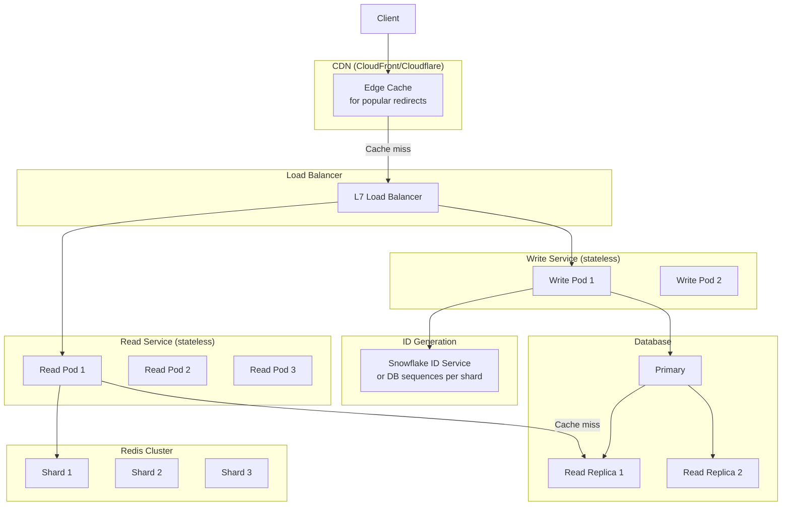

# Design: URL Shortener

**Difficulty:** Foundation | **Time:** 45–60 minutes

!!! note "Instructions"
    **Cover the solution sections** and work through each step yourself first. Use "Hint" tabs if stuck. Practice explaining out loud — the way you communicate matters as much as the solution.

---

## 1. Problem Statement

Design a URL shortening service (like bit.ly). Users submit a long URL and receive a short URL (e.g., `https://sho.rt/abc123`). Anyone with the short URL is redirected to the original URL.

---

## 2. Clarifying Questions

Practice asking these before designing:

??? question "What questions should you ask?"
    - **Traffic:** How many URLs shortened per day? How many redirects?
    - **URL lifetime:** Do shortened URLs expire? User-configurable TTL?
    - **Custom aliases:** Can users choose their own short code (`sho.rt/my-brand`)?
    - **Analytics:** Do we need click tracking (count, geo, device)?
    - **Global?** Single region or worldwide?
    - **Auth:** Do users need accounts? Are anonymous URLs allowed?
    - **Deletion:** Can creators delete their URLs?

---

## 3. Functional Requirements

- User submits a long URL → receives a unique short URL
- Anyone with the short URL is redirected to the original URL
- Short URLs should be as short as possible
- Optional: custom aliases, expiration, click analytics

## 4. Non-Functional Requirements

| Property | Requirement |
|----------|-------------|
| Latency | Redirect < 10ms p99 (cache hit), < 100ms (cache miss) |
| Availability | 99.99% — redirect failures directly impact user experience |
| Read/Write ratio | ~1000:1 (heavy reads) |
| Scale | 100M URLs, 1B redirects/day |
| Durability | URLs should persist indefinitely (unless explicitly deleted) |

---

## 5. Capacity Estimation

```
Writes (URL creation):
  100M total URLs
  Growing at ~1M new URLs/day
  1M / 86,400s ≈ 12 writes/second

Reads (redirects):
  1B redirects/day
  1B / 86,400s ≈ 11,500 reads/second (avg)
  Peak (10×): ~115,000 reads/second

Storage:
  Long URL: avg 200 bytes
  Short code: 7 bytes
  Metadata: ~100 bytes
  Per URL: ~300 bytes
  100M URLs × 300 bytes = 30 GB total
  (very manageable — easily fits in RAM for caching)

Bandwidth:
  Read: 11,500 req/s × 200 bytes (URL) ≈ 2.3 MB/s
  Write: 12 req/s × 200 bytes ≈ 2.4 KB/s
```

!!! tip "Interview Insight 🎯"
    Note the ~1,000:1 read/write ratio (1B reads/day vs. 1M writes/day). This tells you: optimize aggressively for reads, even at the cost of write complexity. Caching is the key lever.

---

## 6. API Design

```
POST /api/v1/shorten
Request:  { "long_url": "https://...", "custom_alias": "optional", "ttl_days": 365 }
Response: { "short_url": "https://sho.rt/abc123", "short_code": "abc123", "expires_at": "..." }
Status: 201 Created

GET /{short_code}
Response: 301/302 Redirect to long_url
Status: 301 (permanent — browser caches) or 302 (temporary — we control)

DELETE /api/v1/urls/{short_code}
Response: 204 No Content

GET /api/v1/urls/{short_code}/analytics
Response: { "total_clicks": 42000, "clicks_by_day": [...] }
```

!!! note "301 vs 302"
    **301 (Permanent):** Browser caches the redirect → fewer hits to our service → lower load.
    **302 (Temporary):** Every redirect hits our service → accurate click analytics, can change destination.
    **Choice:** If analytics matter, use 302. If you want to reduce load, use 301 (but you lose analytics and control).

---

## 7. Short Code Generation

How do we generate `abc123`?

=== "Option A: Random / UUID"
    ```python
    import random, string
    def generate():
        chars = string.ascii_letters + string.digits  # 62 chars
        return ''.join(random.choices(chars, k=7))
        # 62^7 = 3.5 trillion combinations — enough
    ```
    **Problem:** Collisions — must check DB before using. Under high write load, collision retries add latency.

=== "Option B: Auto-increment ID + Base62"
    ```python
    def encode(num: int) -> str:
        chars = "0123456789abcdefghijklmnopqrstuvwxyzABCDEFGHIJKLMNOPQRSTUVWXYZ"
        result = []
        while num > 0:
            result.append(chars[num % 62])
            num //= 62
        return ''.join(reversed(result)).zfill(7)

    # DB auto-increment: ID=1 → "0000001", ID=577313869870 → "aaaaaaa"
    # (577,313,869,870 is "aaaaaaa"'s actual base62 value — 7 a's, where
    # 'a' is digit 10 in this charset)
    # 62^7 = 3.5 trillion unique 7-character codes (IDs 0 through 62^7 - 1);
    # the ID 3,521,614,606,208 (=62^7 itself) is the first ID that
    # DOESN'T fit in 7 digits — it needs an 8th character
    ```
    **Pros:** No collisions, predictable length
    **Cons:** Sequential IDs are guessable — users can enumerate URLs (`aaaaaab` after `aaaaaaa`)

=== "Option C: Hash-based"
    ```python
    import hashlib
    def generate(long_url: str) -> str:
        h = hashlib.md5(long_url.encode()).hexdigest()
        return h[:7]  # take first 7 hex chars
    ```
    **Do not ship 7 hex characters as the short code.** MD5 hex is base-16, so `h[:7]` is only \(16^7 \approx 268\) million codes — well below 100M URLs with no headroom, and birthday collisions show up far earlier. Two identical long URLs also collide by design (sometimes desired). If you hash, **base62-encode more bits** (e.g. 64+ bits of a cryptographic hash → 11 base62 chars, same length class as option B) rather than truncating hex.

**Recommended:** Option B (auto-increment + Base62) with ID generation service. Hash-based is fine only after encoding enough bits; 7 hex chars is not a short-code scheme.

---

## 8. Data Model

```sql
-- Core URL table
CREATE TABLE urls (
    id          BIGINT PRIMARY KEY AUTO_INCREMENT,
    short_code  VARCHAR(10) UNIQUE NOT NULL,
    long_url    TEXT NOT NULL,
    user_id     BIGINT,
    created_at  TIMESTAMP DEFAULT NOW(),
    expires_at  TIMESTAMP,
    is_deleted  BOOLEAN DEFAULT FALSE,
    INDEX idx_short_code (short_code)
);

-- Optional: click analytics (separate service)
CREATE TABLE clicks (
    id          BIGINT PRIMARY KEY AUTO_INCREMENT,
    short_code  VARCHAR(10) NOT NULL,
    clicked_at  TIMESTAMP DEFAULT NOW(),
    country     VARCHAR(2),
    device      VARCHAR(20),
    referer     TEXT,
    INDEX idx_short_code_time (short_code, clicked_at)
);
```

---

## 9. Basic Architecture (Version 1)

```mermaid
graph LR
    Client -->|POST /shorten| WS[Write Service]
    Client -->|GET /{code}| RS[Read Service]
    WS -->|INSERT| DB[(PostgreSQL\nPrimary)]
    RS -->|SELECT| Cache[(Redis Cache\nHot URLs)]
    RS -->|Cache miss| DB
    DB -->|Replication| DR[(Read Replica)]
    RS -->|Read replica| DR
```

This handles moderate load. **Identify the bottleneck** before adding more components.

---

## 10. Identify Bottlenecks

???+ question "Where does this design break at 115K reads/second?"
    - **Cache:** Redis can handle 100K+ ops/second on a single node — this is fine
    - **DB read replica:** At 115K rps with most hitting cache, only ~10% hit DB = 11.5K DB reads/s — manageable on one replica
    - **Single cache node:** If Redis goes down, all 115K rps hit DB → DB overloads
    - **ID generation:** Single DB auto-increment → bottleneck for write scaling

---

## 11. Scaled Architecture (Version 2)



---

## 12. Failure Modes

=== "Redis Cluster Fails"
    - All redirects fall through to DB
    - With 115K rps hitting DB: overload, cascading failure
    - **Mitigation:** Circuit breaker at read service; fallback to read replicas with connection pooling; warm cache proactively; Redis cluster with replicas per shard

=== "Database Primary Fails"
    - Writes fail until failover completes (RTO: 30–60 seconds)
    - Read replicas still serve reads (with potential lag)
    - **Mitigation:** Automated failover (RDS Multi-AZ, Patroni); queue writes during failover window

=== "ID Service Unavailable"
    - URL creation fails
    - **Mitigation:** Pre-allocate ID ranges to write services (each pod has a range of IDs to use); fall back to UUIDs + deduplication

=== "Hot Short Code"
    - A viral URL (e.g., from a major news site) gets 10K rps
    - Single Redis key gets 10K lookups/second — Redis handles this fine
    - But if it exceeds single-shard capacity: replicate hot keys to multiple Redis nodes
    - **Detection:** Per-key access rate metric; alert on keys > N rps

---

## 13. Consistency Considerations

- **Eventual consistency acceptable:** If a new URL takes 1–2 seconds to become visible, that's fine
- **Read-your-writes required:** The user who created a URL should immediately be able to use it
- **Solution:** Write to primary, invalidate cache; reads go to replica except for the creator's next immediate request (route by cookie/session to primary for 1–2 seconds)

---

## 14. Observability

```
Key metrics:
- redirect_latency_p50/p95/p99 (SLO: p99 < 100ms)
- cache_hit_rate (target: > 90%)
- url_creation_rate (writes/second)
- 404_rate (invalid short codes — could indicate enumeration attack)
- redis_memory_usage (eviction risk)
- db_connection_pool_utilization

Alerts:
- p99 redirect latency > 200ms
- Cache hit rate drops below 80%
- Error rate > 0.1%
```

---

## 15. Cost Analysis

```
Redis (3-shard cluster, 30 GB cache):   ~$500/month
PostgreSQL (Multi-AZ, r5.xlarge):       ~$400/month
2 read replicas:                         ~$400/month
Application servers (10 pods):           ~$200/month
CDN (~30B HTTP requests/month, at 1B/day):
  CloudFront-class request pricing is ~$0.0075 / 10K HTTP requests
  30B / 10K × $0.0075 ≈ $22,500/month (request charges dominate;
  redirect bodies are tiny, so egress is a rounding error next to this)
  At Pastebin's $0.005/1K blended rate, 30B would be ~$150K/month —
  treat ~$20K–$150K as the realistic band, not ~$100.
Total:                                   ~$24,000/month (CDN-dominated)

Cost per redirect:
  1B redirects/day × ~30 days/month ≈ 30B redirects/month
  $24,000 / 30,000,000,000 ≈ $0.0000008 per redirect
  (a month has ~2.6M seconds; 1B/day ÷ 86,400s ≈ 11,500 rps average)
```

---

## 16. Alternative Architectures

=== "Key-Value Store Only (No SQL)"
    Use DynamoDB or Redis as primary store instead of PostgreSQL. Short code → long URL is a pure key-value lookup. DynamoDB handles billions of items with sub-10ms latency. Trade-off: harder ad-hoc queries, no SQL analytics.

=== "Serverless"
    Lambda + API Gateway + DynamoDB. Zero ops overhead, cost-per-request. At 1B redirects/day ≈ 30B requests/month the CDN bill is already ~$20K–$150K/month on *either* architecture (you still need an edge for <10ms hits). Putting API Gateway (~$1–$3.50/million) plus Lambda invocations in front of origin on the miss path adds tens of thousands more; that stack does not beat the ~$24,000/month dedicated origin + CDN baseline from the Cost Analysis above — this is the crossover serverless-vs-dedicated discussions hinge on (see [Serverless vs. Containers](../architecture-patterns/serverless-vs-containers.md)). Trade-off: cold start latency (not acceptable for redirects without provisioned concurrency), vendor lock-in. Serve the hot path from the CDN; don't put a per-request function on 30B redirects.

---

## 17. Staff Engineer Extensions

=== "100× Traffic"
    At 11.5M reads/second (100× the 115,000 peak RPS baseline): CDN handles ~95% (popular URLs cached at edge), remaining 5% hits our cache, 0.5% hits DB. CDN is the key lever — invest in cache-control headers and CDN configuration. DB sharding if write volume grows proportionally.

=== "Multi-Region"
    Deploy to 3 regions (US, EU, APAC). Redirect reads are served locally (each region has its own cache + DB read replica). URL creation writes to global primary. Cross-region replication lag: 10–50ms — acceptable for eventual consistency on redirects.

=== "Data Residency (GDPR)"
    URLs created by EU users must be stored in EU region. Tag URLs with user region. Route API calls to correct regional endpoint. EU reads never leave EU. Complexity: global analytics requires aggregation across regional stores.

=== "Zero-Downtime Migration (PostgreSQL → DynamoDB)"
    1. Dual-write to both stores
    2. Backfill historical data to DynamoDB
    3. Validate consistency between stores
    4. Switch reads to DynamoDB (% rollout)
    5. Remove PostgreSQL writes after validation period

---

## 18. Interview Follow-ups

1. **"How would you handle custom aliases colliding?"** — Check uniqueness before accepting, return error with suggestion if taken
2. **"What if we need to support analytics per URL?"** — Separate analytics service, async writes via Kafka, time-series DB (ClickHouse/Druid)
3. **"How do you handle URL scanning (phishing links)?"** — Async scanning pipeline; don't block creation; mark unsafe and serve warning page
4. **"How do you prevent enumeration attacks?"** — Rate limit on short code lookups by IP; monitor 404 rate spikes; use random codes not sequential

---

## Self-Assessment

- [ ] Can I explain why Base62 over random UUIDs for URL generation?
- [ ] Can I justify the 301 vs 302 decision for the analytics requirement?
- [ ] Can I walk through what happens when Redis goes down?
- [ ] Can I estimate the cost within 2× accuracy?
- [ ] Can I design the analytics feature without impacting redirect latency?
