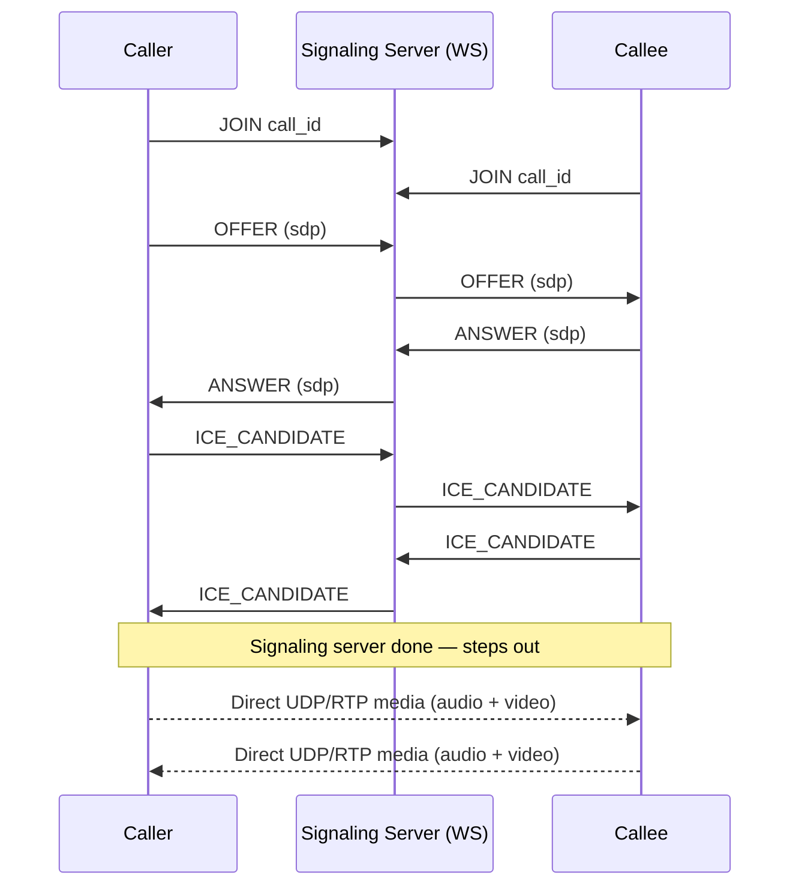
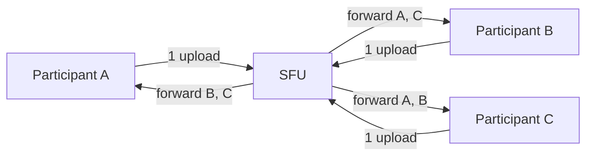
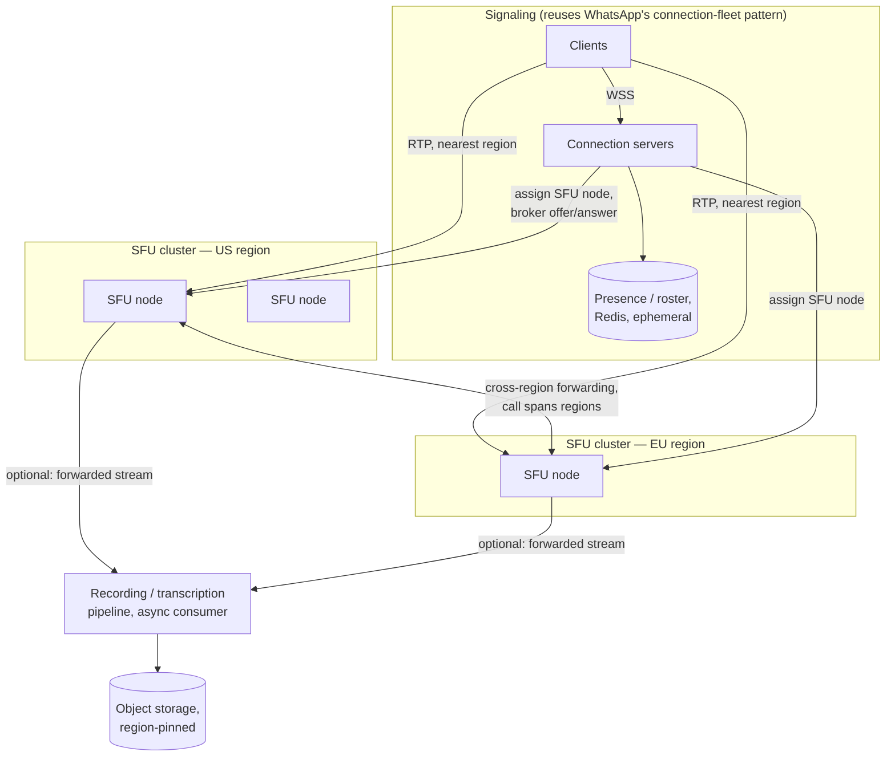

# Design: Video Calling (Zoom/Google Meet)

**Difficulty:** Senior/Staff | **Time:** 60–75 minutes

!!! note "Instructions"
    Cover the solution sections. Draw V1 yourself before opening later diagrams. This exercise is won on *media transport* and *loss handling* — a fluent answer about signaling alone is table stakes, not the differentiator.

---

## 1. Problem Statement

Design a video calling product: two or more people join a call, see and hear each other in near real time, with acceptable quality on typical home networks. Support 1:1 calls and group calls up to some bound.

Read [WhatsApp](whatsapp.md) first if you haven't — call **setup** (invite, ring, join, presence, "who's online") is the same signaling problem as messaging: a control-plane message routed to a connection, over a WebSocket, with the same connection-fleet and presence patterns. Reuse that answer; do not re-derive it here.

What's genuinely new is the **media itself**. A WhatsApp text message that's delayed 300ms is invisible to the user, and if it's dropped, TCP retransmits it — the user never knows. Neither is true for video:

- **Deadline-aware loss recovery, not "never retransmit."** A video frame or audio packet has a use-by date measured in milliseconds. If it arrives late, it's useless. WebRTC does **not** go "UDP only, no retries": it uses **NACK + RTX** (retransmit a packet if there is still time before playback), **FEC** (repair without a round trip), and **keyframe requests (PLI/FIR)** when a reference frame is gone. Unbounded TCP-style retry is the thing you refuse — head-of-line blocking that stalls the stream. Loss that misses the deadline is **concealed**; loss that still has budget is repaired.
- **A brutal latency budget.** ITU-T guidance puts one-way audio delay under ~150ms before humans start noticing unnatural pauses and talking over each other; round-trip conversational delay above ~300–400ms feels broken. Compare to a chat app's multi-second delivery tolerance.

Those two facts flip the transport choice: messaging rides TCP (reliable, ordered, will wait) because a chat message *can* wait. Calling rides **UDP**, specifically **RTP** (Real-time Transport Protocol) over UDP, often with SRTP, because a video frame *can't* wait on TCP head-of-line blocking — better to drop or deadline-repair than freeze the whole stream. Everything downstream in this exercise — jitter buffers, NACK/RTX, FEC, SFU vs MCU — is a consequence of committing to "on time, repair only if the deadline still allows" over "reliable but possibly late."

---

## 2. Clarifying Questions

??? question "What questions should you ask?"
    - **1:1 calls or group calls?** This changes the architecture completely — direct peer-to-peer is a legitimate answer for 1:1, but it does not scale to groups (explained below). Ask this before drawing anything.
    - **What's the max participants in a group call?** 4-person friend call vs. 50-person team meeting vs. 10,000-person webinar are three different systems, not one system at three scales.
    - **Audio-only fallback needed?** Poor networks often can't sustain video.
    - **Recording / transcription in scope?**
    - **Screen sharing?** (Another media stream, same transport question.)
    - **Is this browser-based (WebRTC) or a native app with its own media stack?**
    - **Does presence/signaling reuse an existing chat system**, or is this greenfield?
    - **Regulatory:** recordings containing PII, data residency for stored media?
    - **Scale:** concurrent calls at peak, average participants per call?

---

## 3. Functional Requirements

- Start a call (1:1 or group), invite/join by link or contact
- Exchange live audio and video between participants
- Mute/unmute, camera on/off, leave/end call
- Show who's currently speaking (active speaker)
- Adapt quality to each participant's network (don't force everyone to the worst connection)
- Optional: screen share, recording, transcription

Out of scope for V1: recording, transcription, virtual backgrounds.

## 4. Non-Functional Requirements

| Property | Requirement | Reasoning |
|----------|-------------|-----------|
| End-to-end audio latency | < 150ms one-way (< 300ms round trip) | Above this, conversation feels laggy — humans start talking over each other |
| Packet loss tolerance | Expected; repair only while the playback deadline still allows (NACK/RTX/FEC), else conceal | Unbounded TCP-style retry is worse than a concealed gap; design for loss as normal operation |
| Call setup time | < 2s from "join" to first frame | Users abandon calls that take longer to connect than to have |
| Availability | 99.9% of calls complete without a server-caused drop | A dropped call mid-conversation is a severe UX failure |
| Scale (1:1) | P2P direct connection where NAT allows | No server media cost for the common case |
| Scale (group) | Must not require each participant to upload once per other participant | N² upload does not survive past a handful of people |

!!! tip "Interview Insight 🎯"
    Say the inversion out loud early: messaging optimizes for *never losing data* and tolerates *latency*; calling optimizes for *low latency* and tolerates *losing data*. If your failure-analysis section talks about "retry the dropped packet," you've imported the wrong exercise's reliability model.

---

## 5. Capacity Estimation

```
Concurrent calls at peak:              500K calls
Avg participants per call:             2.4 (mostly 1:1, some small groups)
Concurrent participants:               500K × 2.4 ≈ 1.2M

Bandwidth per video stream (adaptive, multiple quality tiers):
  Low   (180p):   ~150 Kbps
  Mid   (360p):   ~400 Kbps
  High  (720p):   ~1.5 Mbps
  Audio (Opus):   ~40  Kbps  — negligible next to video, but latency-critical

1:1 call (P2P, no server media cost):
  Each side sends ~1.5 Mbps video + 40 Kbps audio ≈ 1.55 Mbps up/down
  Zero SFU bandwidth — media never touches your infrastructure

Group call via SFU, 6 participants, everyone on 720p:
  Upload per participant to SFU:        1.55 Mbps  (one stream, always)
  Download per participant from SFU:    5 other streams × 1.55 Mbps ≈ 7.75 Mbps
  SFU total per call:  6 × 1.55 Mbps in  +  6 × 7.75 Mbps out ≈ 9.3 Mbps in, 46.5 Mbps out
  → the SFU's OUTBOUND bandwidth scales with participants², not participants —
    this is the number that breaks a naive SFU at large call sizes (see V2 bottleneck)

Large webinar, 1 host + 200 viewers, SFU forwarding host video to all:
  200 × 1.5 Mbps ≈ 300 Mbps out for ONE call
  1,000 such large calls concurrently → 300 Gbps — this needs a CDN-like fanout,
  not "just add more SFU boxes," once you're past a few hundred viewers per call
```

!!! tip "Interview Insight 🎯"
    Two numbers should drive the whole design: **150ms** (kills TCP retransmission as a loss-recovery strategy) and **SFU egress scaling with participants² per call** (kills "just relay everything at full quality" past a modest group size). Everything from V2 onward is downstream of these two facts.

---

## 6. API Design

Signaling is HTTP + WebSocket, reusing [WhatsApp](whatsapp.md)'s connection-server pattern. Media itself never goes through this API — it's a separate UDP/RTP path negotiated *by* signaling but not carried *over* it.

```
POST /v1/calls
  { "type": "1:1" | "group", "participants": [...] }
  → { "call_id", "signaling_ws_url" }

# WebSocket signaling channel (per participant, per call)
→ JOIN     { call_id, device_id }
← ROSTER   { participants: [{user_id, media_state}] }

# WebRTC offer/answer exchange — brokered by the server, opaque payload to us
→ OFFER    { call_id, to: user_id, sdp: "<opaque SDP blob>" }
← OFFER    { from: user_id, sdp }
→ ANSWER   { call_id, to: user_id, sdp }
← ANSWER   { from: user_id, sdp }
→ ICE_CANDIDATE { call_id, to: user_id, candidate }
← ICE_CANDIDATE { from: user_id, candidate }

→ LEAVE    { call_id }
← PARTICIPANT_LEFT { user_id }
← PARTICIPANT_JOINED { user_id }
```

We don't derive the SDP (Session Description Protocol) format here — treat it as an opaque blob WebRTC generates client-side, describing codecs, resolutions, and network paths each side supports. The signaling server's job is just to **get that blob from A to B**; it never inspects or modifies it. Conceptually: offer/answer is a negotiation handshake ("here's what I can send and receive"), and ICE candidates are "here's how to reach me" (your IP:port options, since both sides are usually behind NAT).

---

## 7. Data Model

This is where video calling diverges hardest from every other exercise on this site. Pastebin and the URL shortener are fundamentally *persistence* problems — the whole design is organized around storing something durably and serving it back. A video call has almost nothing durable about it: the call **is** the ephemeral state of who's connected and what they're sending, live, right now. Once it ends, there's no "call" left to query — only artifacts you *chose* to keep (a recording, a log entry).

```sql
-- The only durable rows: a record that a call happened, not its content
CREATE TABLE call_records (
    call_id       UUID PRIMARY KEY,
    type          VARCHAR(8) NOT NULL,     -- 1:1 | group
    started_at    TIMESTAMPTZ NOT NULL,
    ended_at      TIMESTAMPTZ,
    host_user_id  UUID NOT NULL,
    recording_url VARCHAR(256)             -- NULL unless recorded
);

CREATE TABLE call_participants_history (
    call_id       UUID NOT NULL,
    user_id       UUID NOT NULL,
    joined_at     TIMESTAMPTZ NOT NULL,
    left_at       TIMESTAMPTZ,
    PRIMARY KEY (call_id, user_id, joined_at)
);
```

Everything else — who's in the call *right now*, which SFU they're connected to, their current media state (muted, camera off), current active speaker, current negotiated bitrate — lives only in memory on the signaling and SFU processes for the call's duration:

```
call:{call_id}:roster       → set of {user_id, connection_id, sfu_node}
call:{call_id}:media_state  → {user_id: {muted, video_on, current_tier}}
active_speaker:{call_id}    → user_id, updated every ~1s from audio levels
```

If the signaling server or SFU restarts, this state is gone — and that's acceptable, because the client renegotiates on reconnect. There is no "replay the last 10 minutes of video the way you'd replay chat history." Once a frame is gone, it's gone; the only thing worth persisting is the *fact* that the call happened and, optionally, a recording captured as a side effect.

---

## 8. Version 1 — direct peer-to-peer (1:1 only)

Simplest system that works: two participants, one WebRTC connection directly between their devices. The signaling server's only job is to broker the offer/answer/ICE-candidate handshake, then it's out of the media path entirely — audio and video flow device-to-device.



```python
# client-side pseudocode — signaling only, media is handled by the WebRTC stack
def start_call(peer_id):
    pc = RTCPeerConnection(ice_servers=STUN_SERVERS)
    pc.add_track(local_audio_track)
    pc.add_track(local_video_track)

    offer = pc.create_offer()
    signaling_ws.send({"type": "OFFER", "to": peer_id, "sdp": offer})

def on_answer(sdp):
    pc.set_remote_description(sdp)   # media starts flowing directly, P2P

def on_ice_candidate(candidate):
    pc.add_ice_candidate(candidate)
```

This handles a 1:1 call between two devices on reasonable networks well, and it's *cheap* — the server never touches a single audio or video byte. Do not add a media server yet; this works for the case it's built for.

---

## 9. Identify the bottleneck

???+ question "You extend V1 naively to a 10-person group call by having every participant connect P2P to every other participant. What breaks?"
    - **Upload bandwidth explodes per participant, not per call.** In a full-mesh P2P topology, each participant must *send* their own video stream to every *other* participant directly. A 10-person call means each participant uploads 9 simultaneous copies of their own video. At 1.5 Mbps per 720p stream, that's ~13.5 Mbps of *upload* from a single laptop on a home connection that's lucky to have 10–20 Mbps up — before accounting for the 9 *incoming* streams they're also downloading. This is O(N²) total connections and O(N) upload per participant; it looks fine at N=3, and falls over by N=6–8 on typical consumer uplinks.
    - **NAT traversal fails outright for a meaningful fraction of pairs.** Two participants behind restrictive NATs (common on corporate/mobile networks) frequently cannot establish a direct P2P path at all, even with STUN. Without a relay fallback, that pair simply gets no media — not degraded, absent. P2P alone has no answer for this; you need a TURN relay (covered under Alternative Architectures) as a fallback path, and even then it doesn't fix the N² upload problem for groups.
    - The fix for both isn't "add a relay to every pairwise P2P connection" — that just moves the N² cost onto a server without reducing it. The fix is changing the *topology*: one upload per participant, not N-1.

---

## 10. Version 2 — Selective Forwarding Unit (SFU)

Each participant uploads **exactly one** stream — to a central media server, not to every peer. The server forwards each participant's stream to the others who need it, selecting per-viewer what to send (e.g. skip a stream for a participant whose tile is off-screen, send lower quality to a tile shown small, prioritize the active speaker's stream).

This is a **Selective Forwarding Unit**, and it's a deliberate middle point between two alternatives:

- **Raw P2P (what V1 does):** upload doesn't scale — solved above.
- **MCU (Multipoint Control Unit):** the server *decodes* every incoming stream, composites/mixes them into one combined stream (e.g. a single video with everyone in a grid), and re-encodes that for each viewer. This gives viewers a single simple stream and lets a thin client join a huge call, but decoding+re-encoding N streams per call server-side costs real CPU (video encoding is expensive) and adds real latency (decode → composite → encode is not free), directly working against the ~150ms budget. An SFU just forwards encoded packets — it doesn't touch the bits — so it adds routing latency, not codec latency.

```python
# SFU forwarding logic (conceptual) — no decode/encode, just selective relay
def on_rtp_packet(call_id, from_user, packet):
    for viewer in active_participants(call_id):
        if viewer == from_user:
            continue
        if should_forward(call_id, from_user, viewer, packet):
            # e.g. skip if viewer muted this tile, or send only the low-tier
            # simulcast stream if this tile is small on viewer's screen
            forward_to(viewer, select_quality(from_user, viewer, packet))
```



Upload is now O(1) per participant regardless of call size; the SFU absorbs the O(N) fanout on the download/forwarding side, which is a server-side scaling problem — one you can throw compute and bandwidth at — rather than a fixed constraint of someone's home Wi-Fi.

---

## 11. Identify the next bottleneck

???+ question "The SFU handles a 10-person call fine. What breaks at 100+ participants (a webinar), or when one participant is on a bad connection?"
    - **Per-viewer forwarding bandwidth still scales with call size.** From the capacity estimate: a 200-viewer webinar forwarding one 720p host stream to everyone is ~300 Mbps out of *one* SFU node for *one* call. That's a single-machine NIC/CPU ceiling, not a per-participant client problem anymore — it's now squarely the SFU's problem, and it needs either more SFU capacity behind that call or a fundamentally different fanout for large one-to-many calls (cascade to regional SFUs, or a CDN-like edge fanout for pure broadcast).
    - **One weak connection shouldn't punish everyone.** If a participant on a bad hotel Wi-Fi can only sustain 300 Kbps, naively you'd have to drop *everyone* in the call to a quality that fits their link, or drop them entirely. Neither is right. The fix is **simulcast**: each sender encodes and uploads *multiple* quality tiers of their own stream simultaneously (e.g. 180p + 360p + 720p), and the SFU picks which tier to forward to each *viewer* independently based on that viewer's bandwidth and screen real estate — a viewer on a bad connection gets the 180p tier of everyone; a viewer on fiber gets 720p of the active speaker and 180p thumbnails of everyone else. This costs the sender some extra upload and encode CPU, but it decouples one participant's bad network from everyone else's experience.

---

## 12. Version 3 — production architecture



Key production decisions:

- **Signaling stays a thin control plane**, structurally identical to [WhatsApp](whatsapp.md)'s connection-server + presence design — same WebSocket fleet, same routing-table-in-Redis pattern, same "connection servers are cattle, clients reconnect and resume" philosophy. Nothing about call setup needed reinventing; only the media path did.
- **SFU nodes are geographically distributed**; each participant connects to the nearest one (lowest RTT for their upload). For a single-region call, all participants land on the same SFU node.
- **Cross-SFU forwarding** handles a call that spans regions (a US and an EU participant on the same call): each region's SFU forwards the streams it holds to the other region's SFU once, not once per remote participant — same N² avoidance logic as V1→V2, just one level up.
- **Simulcast / adaptive bitrate** as described above — senders upload multiple tiers, each SFU picks per-viewer.
- **Recording/transcription is a separate consumer** that subscribes to the SFU's already-forwarded streams rather than participants uploading a second copy — it never sits on the latency-critical path, and if it lags or fails, live call quality is unaffected.

---

## 13. Failure analysis

=== "SFU node crashes mid-call"
    All participants connected to that node lose media instantly — audio/video freezes, then drops. **Mitigation:** clients detect the RTP stream stall (no packets within ~2–3s) and trigger automatic reconnection: rerun ICE, get reassigned to a healthy SFU node by the signaling server, and re-negotiate a fresh offer/answer against the new node. This is a visible ~1–3s glitch, not a silent recovery — set expectations accordingly. **Prevention:** SFU nodes are stateless enough (per-call state can be reconstructed from each client's re-offer) that failover doesn't need replicated media state, only fast detection and reassignment.

=== "NAT traversal fails, no TURN fallback available"
    STUN alone gets each side's public IP:port, but symmetric NATs (common on corporate networks, some mobile carriers) still can't find a path that works for both sides. Without a **TURN relay** as fallback, this pair gets silence — not degraded quality, no connection at all. **Mitigation:** always deploy TURN servers as the last-resort path (see Alternative Architectures) — a relayed connection through TURN is worse (added hop, added cost) but works where direct P2P/SFU connection cannot. **Signal:** track ICE connection state; if `failed` outcomes spike for a network/ISP segment, that's the flag to investigate TURN capacity or geographic placement.

=== "Packet loss during a call"
    Some percentage of UDP packets are simply lost in transit — this is normal and expected. Recovery is **deadline-aware**, not "never retransmit": **NACK/RTX** re-sends a packet if the jitter buffer still has room before playback; **FEC** repairs a loss without a round trip; **PLI/FIR** asks for a new keyframe when a reference frame is gone. If the deadline has already passed, conceal: **jitter buffer** reorders/paces tens of ms of packets; Opus PLC extrapolates missing audio; video freezes the last good frame or waits for the next keyframe. Unbounded retry is the bug; selective, time-bounded repair is the product.

=== "Call spans two regions and the cross-SFU link fails"
    US participants and EU participants each still hear/see each other fine locally; the *cross-region* audio/video freezes for both groups while local media continues. **Mitigation:** detect cross-SFU link health independently of individual client connections; on failure, attempt reconnection over a backup network path between regions before falling back to routing all participants through a single region's SFU (works, but adds RTT for whichever side has to cross the ocean either way). **Signal to the user:** distinguish "your call is fine, the *other region* dropped" from a full call failure — don't reset local participants' connections over a remote-only failure.

---

## 14. Consistency considerations

Every other exercise on this site has a consistency section about *data*: does everyone see the same row, in what order, how stale can a replica be. That framing barely applies here — there's no shared mutable data structure participants are reading and writing. Reframe "correctness" for real-time media entirely:

- **Correctness is "close enough, on time," not "exact, eventually."** A participant seeing a slightly-stale active-speaker indicator, or a frame that's a concealed approximation of what was actually sent, is *correct behavior* for this system — not a bug to fix with stronger consistency. The alternative (block and wait for the exact right data) is strictly worse for a live conversation.
- **There is no canonical source of truth to converge to.** Messaging's consistency model asks "will every replica eventually agree on the message log." Video calling has no log to agree on — once a frame has played or been concealed, there's nothing left to reconcile. The closest analog to "read-your-writes" is signaling state (roster, mute status), which *does* need to converge quickly (a UI showing someone as unmuted when they're actually muted is confusing), but that's a small, ordinary piece of ephemeral state — not the media itself.
- **Ordering within a stream matters locally, not globally.** RTP sequence numbers let a receiver detect loss and reorder within a short jitter-buffer window; there's no cross-participant or cross-call ordering guarantee needed, unlike a chat conversation's per-conversation `seq`.

---

## 15. Observability

Call-quality metrics are first-class here — not an afterthought behind request throughput, because "the request succeeded" tells you almost nothing about whether the call was usable.

```
Call-quality metrics (per participant, per call):
  packet_loss_pct           — target < 1-2% before users report choppiness
  jitter_ms                 — variance in packet arrival timing; feeds jitter buffer sizing
  round_trip_time_ms        — target < 150ms one-way equivalent
  concealment_events_total  — how often FEC/PLC had to paper over a gap
  bitrate_actual vs bitrate_target  — is adaptive bitrate keeping up with the network

System metrics:
  call_setup_time_ms        (SLO: < 2s to first frame)
  sfu_cpu_pct, sfu_bandwidth_mbps per node
  ice_connection_failed_ratio  (proxy for NAT traversal / TURN capacity)
  active_calls, active_participants
  sfu_node_failover_count

Alerts:
  packet_loss_pct p95 > 3% for any region/ISP segment
  call_setup_time_ms p99 > 4s
  ice_connection_failed_ratio > 5%
  any SFU node > 85% bandwidth capacity
```

!!! tip "Interview Insight 🎯"
    If your observability section only has request latency and error rate, you've described a REST API, not a call. The metric an interviewer wants to hear is **packet loss / jitter / RTT per participant** — those predict "did the call feel bad" far better than server-side throughput ever will.

---

## 16. Cost analysis

```
SFU compute (video forwarding is CPU/NIC-bound, not storage-bound):
  ~1,200 concurrent group-call participants per mid-size SFU node (rule of thumb,
  varies heavily with resolution mix and simulcast tier count)
  1.2M concurrent participants / 1,200 per node ≈ 1,000 SFU nodes at peak

Bandwidth (the dominant cost line, not compute):
  Group-call egress dominates — recall a 6-person 720p call is ~46.5 Mbps out
  per call. At meaningful concurrent-call volume this is the largest single
  cost driver, priced per GB egressed, not per request served.

TURN relay fallback (only for connections that fail direct/SFU path):
  Relayed traffic costs 2× (in + out) vs a direct/SFU path — keep the
  fallback rate low; a spike in TURN usage is itself a signal something's
  wrong with NAT traversal, not just a cost issue.

Recording/transcription pipeline: usage-based, scales with # of recorded
  calls × duration, entirely separate cost line from live call serving.
```

!!! tip "Interview Insight 🎯"
    Every other exercise here scales cost with **requests** (rps × price-per-request). This one scales with **concurrent participants** and **minutes of live bandwidth** — a call that runs for an hour with nobody talking still costs the same forwarding bandwidth as one with constant chatter. That's a genuinely different cost model; say so explicitly if asked to estimate cost.

---

## 17. Alternative architectures

=== "P2P vs SFU vs MCU"
    | | P2P | SFU | MCU |
    |---|---|---|---|
    | Server media cost | None | Forwarding bandwidth only | Highest — decode+encode every stream |
    | Scales to | ~2-4 participants | Hundreds (per node), thousands with cascading | Hundreds, bounded by transcode CPU |
    | Added latency | Lowest (direct) | Low (relay only, no transcode) | Highest (decode → composite → encode) |
    | Client complexity | Higher (N-1 connections) | Lower (1 connection, server does selection) | Lowest (1 stream in, 1 stream out) |
    | NAT traversal | Fails for a real fraction of pairs without TURN | Server has a stable public address — mostly solves it | Same as SFU |
    | Best fit | 1:1 calls | Group calls, most production video products | Legacy hardware endpoints, thin/low-power clients that can't decode multiple streams |

=== "TURN relay as NAT-traversal fallback"
    When direct P2P (or even a direct path to the SFU) fails due to restrictive NAT/firewall, TURN (Traversal Using Relays around NAT) relays the media through a server that both sides *can* reach. It's strictly a fallback — every packet now makes an extra hop, adding latency and doubling bandwidth cost (relay receives once, forwards once) — but a call that works through TURN beats one that doesn't connect at all. Production systems deploy TURN servers geographically distributed for the same reason SFUs are — a relayed hop to a nearby TURN server is far better than one to a distant one.

---

## 18. Staff Engineer Extensions

=== "100× traffic"
    120M concurrent participants instead of 1.2M. SFU nodes scale roughly linearly with participant count (unlike a database, there's no shared state to contend on), so this is mostly "provision ~100,000 SFU nodes across regions" — a fleet-management and bin-packing problem (which calls go to which node, keeping call size within a node's bandwidth budget) more than an architectural one. The real pressure point is **geographic distribution of SFU capacity** matching where load actually is, and TURN relay capacity for the NAT-traversal-failure tail, which also scales with participant count.

=== "Multi-region calls"
    A call with participants split across US, EU, and APAC needs to pick SFU placement to minimize *aggregate* latency across all participants — not just "nearest SFU to whoever joined first." Naively pinning to the first joiner's region can leave a remote participant with a bad RTT while everyone else is fine. The right framing: for a call spanning regions, run cascaded SFUs (one per region with a meaningful participant cluster) with cross-SFU forwarding, so each participant's upload only travels to their *nearest* SFU, and only the aggregated cross-region link pays the long-haul cost once, not per-participant.

=== "Data residency"
    Live media typically isn't "at rest" anywhere and mostly escapes strict residency rules by virtue of being ephemeral — but **recordings** are a different story: once you persist a call to storage, it's regulated data (possibly containing faces, voices, and conversation content) and residency rules apply exactly like [Pastebin](pastebin.md)'s data-residency extension. An EU participant's recorded call must be stored (and processed by transcription) in EU infrastructure; route the recording pipeline's storage target by the *host's* (or strictest participant's) region, and treat the live SFU path and the recording path as separately governed even though they share a source stream.

=== "Zero-downtime SFU version migration"
    You cannot simply restart SFU nodes to deploy a new version — every live call on that node drops. Approach: bring up new-version SFU nodes alongside old ones; stop assigning *new* calls to old nodes; let in-progress calls on old nodes drain naturally as they end; for long-running calls that must move, trigger the same client-side reconnect-and-renegotiate path used for a crashed node (Section 13), but proactively and on a schedule rather than reactively — the client-side recovery mechanism you built for failures doubles as your migration mechanism. Cap how many calls you force-migrate concurrently so you don't recreate a thundering-herd reconnection storm on the new fleet.

---

## 19. Interview follow-ups

1. **"Why can't you just use TCP for video like you did for chat?"** — TCP's head-of-line blocking means one lost packet stalls *everything behind it* waiting for retransmission, and by the time it arrives it's past its playback deadline anyway. UDP/RTP lets you drop *or* NACK/RTX/FEC-repair only if the deadline still allows, and keep the stream moving — worse unbounded reliability, better actual experience.
2. **"How do you decide who gets forwarded high quality in a 50-person call?"** — Active speaker plus a small number of recently-active speakers get their high tier forwarded; everyone else gets low-tier or audio-only, driven by simulcast and the SFU's per-viewer selection logic, not by forwarding every stream at full quality to every viewer.
3. **"How would screen sharing change this?"** — It's just another media stream (usually higher resolution, lower frame rate, more static content — good for delta compression) negotiated the same way as camera video; same SFU forwarding logic applies, with its own quality tier since "readable text" and "smooth motion" have different bitrate/framerate trade-offs.
4. **"What's different about a webinar (1 host, 1000 silent viewers) vs. a meeting?"** — Fanout becomes overwhelmingly one-directional (nobody's uploading back), which starts to look more like video streaming/CDN delivery than a bidirectional call — at high enough viewer counts you'd cascade through edge nodes the way a CDN does, rather than have one SFU serve 1000 direct forwarding connections.

---

## Self-Assessment

- [ ] I can explain why calling uses UDP/RTP while chat uses TCP, with the latency-budget number behind it
- [ ] I can name the N² upload problem with full-mesh P2P and the participant count where it breaks
- [ ] I can explain SFU vs MCU with a latency and cost trade-off, not just a definition
- [ ] I can describe deadline-aware recovery (NACK/RTX, FEC, PLI) vs concealment, and why unbounded TCP retry is the wrong model
- [ ] I can say why this exercise's consistency and data-model sections look different from every persistence-heavy exercise on the site
