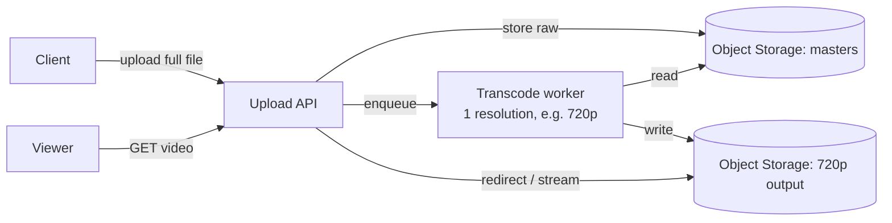
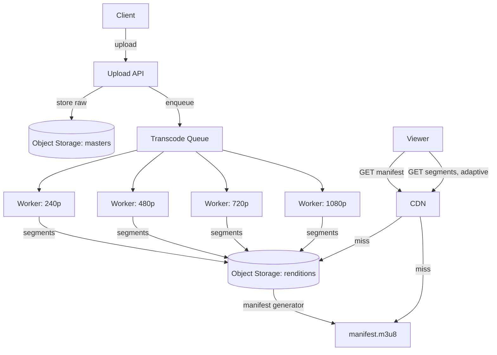
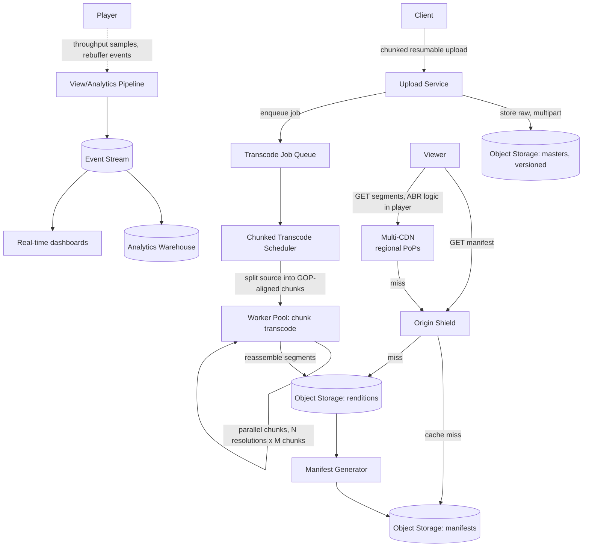

# Design: YouTube / Netflix (Video Streaming Platform)

**Difficulty:** Senior → Staff | **Time:** 60–75 minutes

!!! note "Instructions"
    Cover each section and work it yourself first. Before every "Version N" reveal there is a `???` box — commit to an answer before you open it. This exercise's whole point is a size problem: every prior architecture in this series assumed the object fit in a cache or a single S3 GET. Here it doesn't.

---

## 1. Problem Statement

Design a platform where users upload video, and other users watch it on connections ranging from a fiber line to a congested phone tower. Core loop: upload → process → store → deliver → play.

Two facts break every assumption carried over from [pastebin](pastebin.md) or the URL shortener:

- **Size.** A pastebin blob is KBs to a few MB. A raw video upload is **gigabytes**. You cannot treat it as "one more object type" in the content store — it needs chunked upload, asynchronous processing measured in minutes, and storage/egress costs that dominate every other line item on this site.
- **Playback must adapt to a connection you don't control, in real time.** A pastebin read either succeeds or it doesn't. A video read is 90+ minutes of continuous delivery where the client's bandwidth can drop mid-stream — serve one fixed resolution and it either stalls on a bad connection or wastes bandwidth on a great one.

These two facts are why this is a different exercise, not "pastebin but bigger." Don't reach for "just put it in object storage and CDN it" until you've named what happens between upload and a byte being playable.

---

## 2. Clarifying Questions

??? question "What questions should you ask?"
    - **Upload source:** User-generated (YouTube — any resolution, any codec, any length) or a managed catalog (Netflix — studio masters, known formats, licensing metadata)? This changes the transcoding pipeline's inputs drastically.
    - **Live or VOD?** Live streaming has a latency budget and no "process fully, then serve" luxury. Assume VOD (video-on-demand) unless told otherwise; call out live as a follow-up.
    - **Upload size/duration limits?** A 15-second clip vs. a 3-hour lecture changes chunking and transcode parallelism.
    - **Which resolutions/bitrates must playback support?** 240p to 4K, or a narrower band?
    - **DRM / licensing?** Netflix needs content restricted by region and device; YouTube largely doesn't.
    - **Read:write ratio?** Assume extreme skew — a small fraction of uploads account for the overwhelming majority of views (power law / "hot" catalog).
    - **Do we need view analytics in real time**, or is a daily batch acceptable?
    - **Scale:** Uploads/day, concurrent viewers at peak, total catalog size?

---

## 3. Functional Requirements

- Accept a video upload (large file, resumable) and confirm receipt before processing finishes
- Transcode the source into multiple resolutions/bitrates for adaptive playback
- Serve a manifest (HLS/DASH) describing available renditions
- Stream video to a player that adapts quality to live bandwidth, with minimal startup delay
- Basic metadata (title, description, owner, duration, view count)

## 4. Non-Functional Requirements

| Property | Requirement | Reasoning |
|----------|-------------|-----------|
| Upload reliability | Resumable; survive a dropped connection mid-upload | A 4 GB upload over Wi-Fi *will* drop at least once |
| Time-to-first-playable | < 2–10 min after upload (not instant) | Transcoding is CPU-bound; set expectations, don't fake it |
| Playback start latency | < 2s to first frame | Users abandon at ~3s of spinner |
| Playback smoothness | Rebuffer ratio < 0.5% of watch time | Stalls are the #1 churn driver |
| Availability (playback) | 99.95%+ | Playback is the revenue path; upload can tolerate more downtime |
| Scale | Millions of views/day, tens of thousands of concurrent streams at peak | Egress-bound, not request-bound |
| Durability | Source master never lost; renditions regenerable | Master is expensive/impossible to re-acquire; renditions are just compute |

!!! tip "Interview Insight 🎯"
    Every other exercise on this site optimizes a read path against a small object. Here the *write* path (upload → transcode) is itself a multi-minute pipeline, and the *read* path must renegotiate quality every few seconds against a moving target (bandwidth). Naming both halves as distinct problems — not one "store and serve" problem — is what separates a senior answer from a mid-level one.

---

## 5. Capacity Estimation

```
Uploads:
  500K uploads/day → ~6/second average, ~60/s at 10x peak
  Average video: 10 minutes, source bitrate ~20 Mbps (1080p H.264 master)
  Average source size: 10 min x 60s x 20 Mbps / 8 ≈ 1.5 GB per upload

Upload ingest bandwidth:
  6/s x 1.5 GB ... spread over upload duration, not instantaneous like a read
  Sustained ingest: ~500K x 1.5 GB / day ≈ 750 TB/day written by uploaders

Storage growth (source + renditions):
  Source masters: 750 TB/day x 365 ≈ 274 PB/year (before any deletion/cold-tiering)
  Transcoded renditions (5 resolutions, ~1.5x source size combined): +~1.1 PB/day
  → Storage is a *cost* problem, not a *latency* problem: solved with tiering, not caching

Views:
  200M views/day, average watch session 8 minutes
  Peak concurrent streams: ~500K (evening peak, ~6x average)

Egress bandwidth — THE central number:
  Average bitrate delivered per stream (mixed renditions): ~3 Mbps
  500K concurrent streams x 3 Mbps ≈ 1.5 Tbps sustained peak egress
  Daily egress: 200M views x 8 min x 3 Mbps / 8 ≈ 3.6 PB/day
```

!!! abstract "Mental Model"
    Every prior exercise on this site tops out in the tens of MB/s. This one tops out in **terabits per second**. Pastebin's peak read bandwidth was ~11.5 MB/s; here a single moment in time pushes over a hundred thousand times that. This is *the* number that forces a CDN and multi-region origin into the design from day one — not as an optimization, but as a load-bearing requirement. If your V1 doesn't mention this number, you haven't found the real problem yet.

---

## 6. API Design

```
# Upload (chunked/resumable)
POST /api/v1/videos                                  -- initiate
Request:  { "title": "...", "size_bytes": 1610000000, "content_type": "video/mp4" }
Response: { "video_id": "v_9k2A", "upload_url": "...", "chunk_size": 8388608 }

PUT /api/v1/videos/{video_id}/chunks/{chunk_index}    -- per chunk, resumable
Response: 200, or 308 Resume Incomplete with received-chunk bitmap

POST /api/v1/videos/{video_id}/complete                -- finalize, triggers transcode
Response: { "status": "processing" }

GET /api/v1/videos/{video_id}/status
Response: { "status": "processing" | "ready" | "failed", "progress_pct": 62 }

# Playback
GET /api/v1/videos/{video_id}/manifest.m3u8            -- HLS master playlist
GET /api/v1/videos/{video_id}/manifest.mpd              -- DASH equivalent
Response: renditions list (resolution, bitrate, segment URLs)

GET /cdn/{video_id}/{rendition}/{segment}.ts            -- actual media segments, served via CDN
```

!!! warning "Production Trap ⚠️"
    Returning `ready` only when *all* renditions finish means a viewer waits for the slowest (4K) rendition before watching *any* quality. Mark `ready` as soon as the lowest usable rendition (e.g. 480p) exists, and let the manifest grow as higher renditions land. Time-to-first-playable, not time-to-fully-processed, is the metric that matters.

---

## 7. Data Model

```sql
-- Metadata: small, hot, indexed.
CREATE TABLE videos (
    id            VARCHAR(16) PRIMARY KEY,
    owner_id      VARCHAR(32) NOT NULL,
    title         VARCHAR(200),
    duration_ms   INT,
    status        VARCHAR(16) NOT NULL,      -- uploading | processing | ready | failed
    source_key    VARCHAR(256) NOT NULL,     -- pointer to raw master in object storage
    view_count    BIGINT DEFAULT 0,
    created_at    TIMESTAMPTZ DEFAULT NOW(),
    INDEX idx_owner (owner_id)
);

-- One row per finished rendition; grows independently of the video row.
CREATE TABLE renditions (
    video_id      VARCHAR(16) NOT NULL,
    resolution    VARCHAR(8) NOT NULL,        -- 240p | 480p | 720p | 1080p | 4K
    bitrate_kbps  INT NOT NULL,
    codec         VARCHAR(16) NOT NULL,       -- h264 | h265 | av1
    storage_key   VARCHAR(256) NOT NULL,      -- segment prefix in object storage
    status        VARCHAR(16) NOT NULL,       -- pending | ready | failed
    PRIMARY KEY (video_id, resolution, codec)
);
```

```
Object storage layout (not SQL):
  masters/{video_id}/source.mp4                          -- raw upload, write-once
  renditions/{video_id}/{resolution}/{codec}/segment_*.ts -- transcoded chunks
  manifests/{video_id}/master.m3u8                        -- generated once renditions exist
```

The manifest (HLS/DASH) is the concept that makes adaptive delivery possible: it's a small text file listing every available rendition's bitrate and the URL pattern for its segments. The player reads it once, then chooses which rendition's segments to request — and can switch renditions between segments without restarting the stream. Think of it as the video equivalent of pastebin's metadata/content split, except the "metadata" here also drives runtime quality decisions, not just a lookup.

---

## 8. Version 1 — simplest thing that works

Single upload → single transcode job → single resolution → direct serve. No adaptive bitrate, no CDN.



```python
def handle_upload(file_bytes: bytes, title: str) -> str:
    video_id = generate_id()
    source_key = f"masters/{video_id}/source.mp4"
    s3.put_object(Bucket="videos", Key=source_key, Body=file_bytes)
    db.execute(
        "INSERT INTO videos (id, title, source_key, status) VALUES (%s,%s,%s,'processing')",
        video_id, title, source_key
    )
    transcode_queue.enqueue(video_id)   # single worker picks this up
    return video_id

def transcode_worker(video_id: str):
    source = s3.get_object(Bucket="videos", Key=f"masters/{video_id}/source.mp4")
    output = ffmpeg_transcode(source, resolution="720p", codec="h264")   # single rendition
    out_key = f"renditions/{video_id}/720p/output.mp4"
    s3.put_object(Bucket="videos", Key=out_key, Body=output)
    db.execute("UPDATE videos SET status='ready' WHERE id=%s", video_id)
```

Ship this for an internal beta with a few hundred uploaders. Then find the actual bottleneck — don't add infrastructure yet.

---

## 9. Identify the bottleneck

???+ question "You onboard 10,000 uploaders and traffic grows. What breaks first?"
    - **Transcode queue backlog.** One worker (or even ten) transcoding whole files sequentially can't keep pace once uploads hit dozens per second — a 10-minute 1080p source can take several minutes of CPU time to transcode even to one rendition. The queue depth grows unbounded and "time to playable" balloons from minutes to hours.
    - **One resolution stalls slow connections.** Every viewer gets the same 720p stream regardless of their bandwidth. A viewer on a congested 3-bar LTE connection rebuffers constantly; there's no lower-bitrate fallback to drop to.
    - **Origin bandwidth exhaustion.** Every playback request hits the single object storage bucket directly. At even a few thousand concurrent viewers, you're pushing gigabits/second out of one region's storage egress — this is the 1.5 Tbps number from capacity estimation waiting to happen, and V1 has no CDN to absorb it.
    - Of these, transcode backlog is usually the first to page someone (uploads visibly stuck at "processing"), but origin bandwidth is the one that will eventually take the whole platform down if traffic grows before it's fixed.

---

## 10. Version 2 — adaptive bitrate + basic CDN

Address all three: parallelize transcoding into multiple renditions, generate an ABR manifest, and put a CDN in front of segment delivery.



**What changed and why:**

- **Parallel per-resolution transcode jobs.** Splitting one video into N independent jobs (one per target resolution) means the queue drains in parallel instead of serially — a 10-minute backlog for one resolution doesn't block the other three.
- **HLS/DASH manifest.** The source is split into short segments (2–10s each) per rendition. The player fetches the manifest once, starts on a conservative bitrate, measures actual throughput per segment, and switches renditions up or down between segments — this is what "adapts to live bandwidth" means concretely. It's a client-driven decision; the server just needs every rendition's segments available at the same segment boundaries.
- **CDN for segment delivery.** Segments are immutable once written (like a paste, once created) — ideal for aggressive edge caching. This is what keeps origin egress from becoming the 1.5 Tbps bottleneck directly; the CDN absorbs the fan-out.

---

## 11. Identify the next bottleneck

???+ question "CDN and ABR are live. What breaks next, and at what scale?"
    - **Transcode cost/latency at scale.** Transcoding every resolution for *every* upload, upfront, whether or not it's ever watched, burns CPU-hours on videos that get 3 views total — this is a real cost problem at 500K uploads/day (see Cost Analysis below).
    - **CDN cold-start for a new upload.** A brand-new video has zero cache hits anywhere — the first viewers of a just-published video all miss the CDN edge and hit origin simultaneously. If that video happens to go viral in its first hour (a trending clip), you get a thundering herd against origin before the CDN has had a chance to warm up.
    - **Long-tail catalog.** Millions of old videos each get a handful of views/month. CDN edge caches evict them for hot content; every long-tail view is effectively an origin fetch, at scale.
    - **Live vs. VOD.** Nothing above works for live streaming — there's no "finished file" to transcode ahead of time. Live needs continuous segment-by-segment transcoding with a strict latency budget, a fundamentally different pipeline (covered under Alternative Architectures).

---

## 12. Version 3 — production architecture



Key production decisions:

- **Chunked/parallelizable transcoding.** Split the source at GOP (group-of-pictures) boundaries into independent chunks, transcode each chunk to each target resolution in parallel across a worker pool, then reassemble. Turns a 10-minute serial transcode into a job that finishes in roughly `source_duration / worker_parallelism`, and lets the queue absorb bursty upload traffic (viral creators, batch imports) without one giant video hogging one worker for an hour.
- **Origin shield.** A single caching layer between the CDN edges and object storage. Without it, N CDN PoPs each miss independently on a cold video and each hit origin — the shield deduplicates that into one origin fetch per shield region, directly addressing the thundering-herd problem.
- **Multi-CDN.** No single CDN provider has uniform global PoP density or is immune to its own outages; route by region/provider health. Also mitigates the cold-start problem somewhat — different providers warm independently, and you can pre-warm a predicted-viral upload across providers.
- **ABR logic lives in the player**, not the server: it measures recent segment download throughput, tracks buffer health, and picks the next segment's rendition. The server's only job is making every rendition's segments available at consistent boundaries.
- **View/analytics pipeline is decoupled and async** — rebuffer events and quality-switch telemetry stream through Kafka, not the playback hot path, so an analytics outage never affects a viewer's stream.

---

## 13. Failure analysis

=== "Transcode pipeline backlog"
    A surge of uploads (viral creator, batch migration) floods the queue; videos sit in "processing" for hours instead of minutes.
    **Mitigation:** autoscale the worker pool on queue depth; prioritize the lowest usable rendition (e.g. 480p) per video so *something* is playable fast, then backfill higher renditions; shed load by rate-limiting upload accept rate before it hits the queue, with clear "processing, try later" status rather than silent stalling.

=== "CDN / origin failure"
    A CDN provider has a regional outage; viewers in that region can't fetch segments even though origin and other CDNs are healthy.
    **Mitigation:** multi-CDN with health-based routing at the player/DNS layer; player-side fallback to a secondary CDN URL in the manifest if segment requests fail repeatedly; origin shield means a full CDN failure only pushes traffic back to shield + origin, not directly to under-provisioned storage.

=== "Popular new upload — thundering herd before CDN warms"
    A just-published video goes viral in its first 30 minutes; every viewer is a cache miss hitting origin simultaneously.
    **Mitigation:** origin shield deduplicates concurrent misses into one origin fetch; predictive pre-warming for known high-profile uploads (verified creators, scheduled premieres) by pushing segments to edge PoPs proactively; request coalescing at the shield layer so 10,000 simultaneous misses for the same segment become one origin request with 10,000 waiters.

=== "Partial upload / resume"
    A 4 GB upload drops at 60% over a flaky mobile connection.
    **Mitigation:** chunked upload with a server-side received-chunk bitmap (shown in API design); client resumes by asking which chunks are missing rather than restarting; chunks are content-addressed (hash) so a resumed upload after a client crash can be verified before triggering transcode, avoiding a corrupted master.

---

## 14. Consistency considerations

- **Read-your-writes for the uploader:** after `complete`, the uploader should see `status: processing` immediately and be able to poll progress — they should never see a 404 for their own just-uploaded video.
- **Eventual consistency for renditions is fine and expected:** the manifest grows as renditions land; a viewer arriving 30 seconds after upload may only see 480p available, and that's correct behavior, not a bug.
- **View counts are AP, not CP.** Losing a few seconds of view-count increments during a failover is acceptable; blocking playback to synchronously update a counter is not — batch/async aggregate view events instead.
- **Manifest generation must not race rendition writes.** Generate/update the manifest only after a rendition's segments are fully and atomically written (e.g. write to a staging key, then an atomic rename/pointer swap) — a manifest referencing a half-written segment produces a stall or corrupt frame mid-playback, which is a worse experience than the rendition simply not being listed yet.

---

## 15. Observability

```
Metrics:
  upload_success_rate, upload_resume_rate
  transcode_queue_depth, transcode_job_duration_p50/p99
  time_to_first_playable_rendition (the "ready" metric that matters)
  cdn_cache_hit_rate{provider,region}
  origin_egress_bps (watch this against your capacity ceiling)
  player_rebuffer_ratio, player_startup_latency_p99
  abr_downshift_rate (how often players drop quality — proxy for network conditions)

Alerts:
  transcode_queue_depth growing for > 15 minutes
  cdn_cache_hit_rate < 85% in any region
  origin_egress_bps approaching provisioned ceiling
  rebuffer_ratio > 1% globally
  time_to_first_playable_rendition p99 > 15 minutes

Traces:
  span across upload -> queue -> transcode -> manifest-ready, to localize "why is this video stuck"
```

---

## 16. Cost analysis

```
Transcoding compute (dominant line item #1):
  500K uploads/day x 10 min avg x 5 renditions x ~0.5 CPU-min/min-of-source-per-rendition
  ≈ 12.5M CPU-minutes/day ≈ ~8,700 CPU-hours/day
  At ~$0.05/CPU-hour (spot/reserved compute): ~$435/day ≈ ~$13,000/month
  (GPU-accelerated encoding lowers wall-clock time but shifts, not eliminates, this cost)

CDN egress (dominant line item #2):
  3.6 PB/day delivered, blended CDN egress rate ~$0.02/GB at this volume: ~$72,000/day
  ≈ ~$2.1M/month — this dwarfs every other cost on the platform, by far

Storage (secondary):
  274 PB/year of masters + renditions, tiered (hot for recent, cold/Glacier-class for old):
  Hot tier (~10% of catalog, recently uploaded/viewed): ~$2M/month at Standard rates
  Cold tier (~90%, rarely viewed): ~$500K/month at archival rates
  → Tiering by recency/view-frequency is the lever here, same principle as pastebin's lifecycle policy, at far larger scale

Levers:
  - Lazy/on-demand transcoding: only produce a rendition when first requested at that
    quality, cache the result. Cuts transcode compute for the long tail (most videos are
    watched at 1-2 resolutions, never all 5) at the cost of a slower first request for an
    uncommon rendition.
  - Reduce CDN egress via better ABR tuning (don't over-serve 1080p to viewers who'd be
    fine at 720p) and regional multi-CDN contracts negotiated on committed volume.
  - Cold-tier old, rarely-viewed renditions; regenerate on-demand if requested (compute is
    cheaper than storing forever).
```

!!! warning "Production Trap ⚠️"
    Transcoding every resolution for every upload upfront ("eager") is the intuitive default and the wrong one at this scale — most uploads are watched a handful of times, often at only one or two resolutions. Eager transcoding pays full compute cost for renditions nobody requests. Lazy transcoding trades a slower first view of an uncommon rendition for a large compute savings on the long tail; which one wins depends on your catalog's view distribution — say that trade-off out loud rather than picking eager by default.

---

## 17. Alternative architectures

=== "Live streaming vs. VOD"
    VOD transcodes a finished file at leisure, prioritizing completeness over speed. Live has no finished file — it's continuous segment-by-segment transcoding (encode a few seconds, package, publish, repeat) under a hard latency budget (seconds, not minutes). There's no "process fully then serve"; the pipeline and the player's buffering strategy are both fundamentally different, and DVR/rewind on a live stream means retroactively stitching the already-published segments into a VOD-like manifest.

=== "P2P-assisted delivery"
    Viewers relay segments to nearby viewers (WebRTC data channels), cutting CDN egress for very popular, currently-live content. Reduces the dominant cost line item directly, but adds complexity (NAT traversal, freeloader/fairness incentives) and doesn't help the long tail (nobody to peer with on a video with 3 concurrent viewers). Useful as a supplement to CDN for the hottest content, not a replacement.

=== "Lazy vs. eager transcoding"
    Eager (transcode all renditions upfront): predictable time-to-fully-ready, higher guaranteed compute cost, best for high-view-probability content (verified creators, licensed catalog). Lazy (transcode on first request per rendition, cache result): lower average compute cost, unpredictable first-request latency for rare renditions, best for long-tail user-generated content. A real platform often mixes both — eager for the most likely-to-be-popular resolutions (e.g. 480p/720p), lazy for the rest (4K, obscure codecs).

---

## 18. Staff Engineer Extensions

=== "100x traffic"
    50M concurrent streams, ~150 Tbps egress. No single CDN contract or origin footprint absorbs this — you need committed capacity across multiple CDN providers negotiated well ahead of the traffic, aggressive predictive pre-warming for anticipated hot content, and P2P-assisted delivery for the very top of the popularity curve to shave real Tbps off the CDN bill. Transcode compute also scales with upload volume, not view volume, so it grows independently — don't assume "100x traffic" means "100x transcode cost" if uploads grow slower than views.

=== "Multi-region"
    Uploads should land in a region near the uploader (lower upload latency, avoids one region absorbing all ingest bandwidth); masters replicate asynchronously to a durability region. Playback should always prefer the nearest CDN PoP regardless of where the master lives — that's the entire point of the CDN layer. The one place region matters for correctness, not just latency, is licensing (next).

=== "Data residency / content licensing by geography"
    This is where Netflix genuinely diverges from YouTube: a title licensed for the US catalog cannot be served to a French viewer, independent of where the bytes physically sit. This is enforced at the manifest/playback-authorization layer, not the CDN — the API checks viewer geo (IP-based, imperfect) plus account region against a licensing table before issuing a signed manifest URL, and CDN edge nodes honor a short-TTL signed URL so a leaked link doesn't grant indefinite geo-bypassed access. Content storage itself can still be global/replicated; it's the *authorization to fetch* that's geo-gated.

=== "Zero-downtime codec migration (e.g. AV1)"
    New uploads start producing AV1 renditions alongside existing H.264/H.265 ones (dual-encode), with the manifest listing both and the player picking whichever the device supports — this is exactly what ABR manifests are built for, so no player-side migration logic is needed beyond codec capability detection. Backfilling AV1 for the existing catalog is a background re-transcode job, prioritized by view volume (re-encode the hot 10% first, since that's where the bandwidth savings actually land), rate-limited so it doesn't compete with live upload transcoding. Never delete the H.264 rendition until AV1 adoption and error rates are verified across the device fleet — some older devices/browsers never gain AV1 decode support at all.

---

## 19. Interview follow-ups

1. **"Why can't you just treat video like pastebin's blob storage and CDN it directly?"** — Size and adaptivity. A pastebin object is fetched whole, once; a video is fetched incrementally over minutes and must renegotiate quality as bandwidth changes. That requires segmenting, a manifest, and a client-side ABR algorithm — none of which pastebin needs.
2. **"How would you cut time-to-first-playable in half?"** — Prioritize transcoding the lowest usable rendition first and mark the video playable as soon as it exists (already in V2+); parallelize per-resolution and per-chunk transcoding (V3); consider GPU-accelerated encoders for the first rendition specifically.
3. **"A specific video is suddenly getting 100x its normal traffic — walk me through what happens."** — CDN edge caches it after the first few misses (fast, since segments are immutable); origin shield deduplicates the initial thundering herd of near-simultaneous cache misses across edges; if it's *predicted* in advance (scheduled premiere), pre-warm CDN edges proactively instead of reacting.
4. **"How is Netflix's version of this different from YouTube's?"** — Upload path is nearly irrelevant (studio masters via a managed ingest pipeline, not millions of arbitrary user uploads), so transcode cost is more predictable and can be eager rather than lazy. The genuinely new problem is geo-licensing enforcement at the authorization layer — a concern YouTube mostly doesn't have.

---

## Self-Assessment

- [ ] I can explain why video breaks the "just cache the blob" pattern that worked for pastebin
- [ ] I can describe what a manifest (HLS/DASH) actually contains and why ABR logic lives client-side
- [ ] I can name the two dominant cost line items (transcode compute, CDN egress) and one lever for each
- [ ] I can walk through what happens when a brand-new upload goes viral before the CDN has warmed
- [ ] I can explain why geo-licensing is enforced at the authorization layer, not the storage layer
