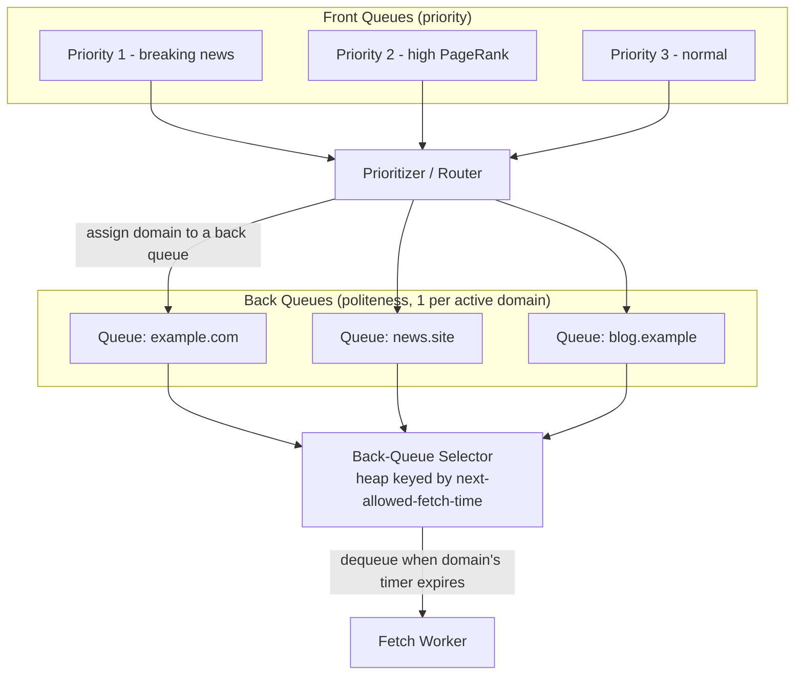
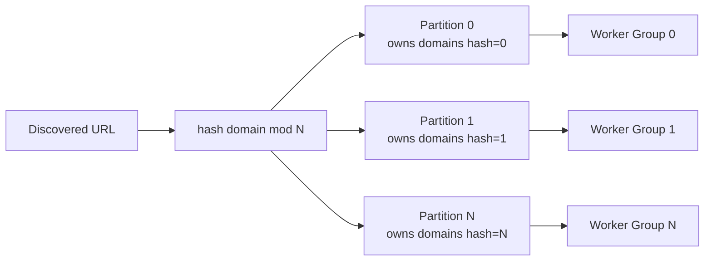
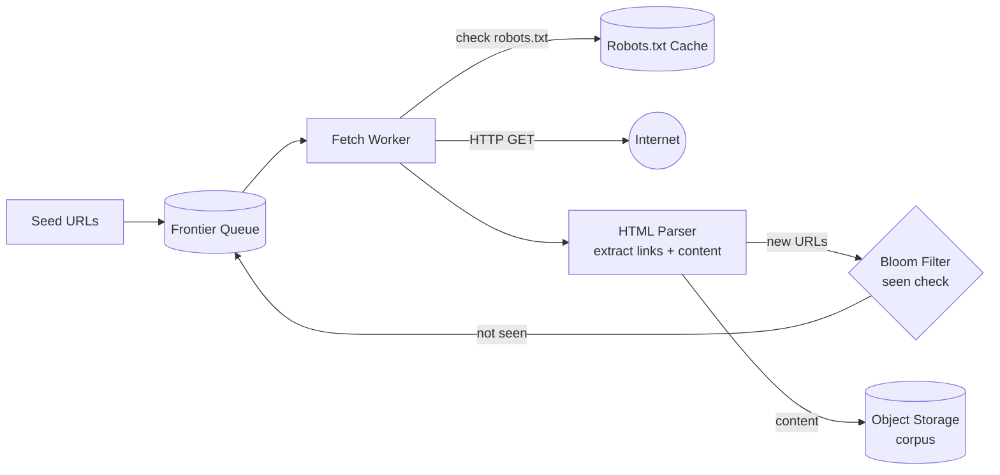
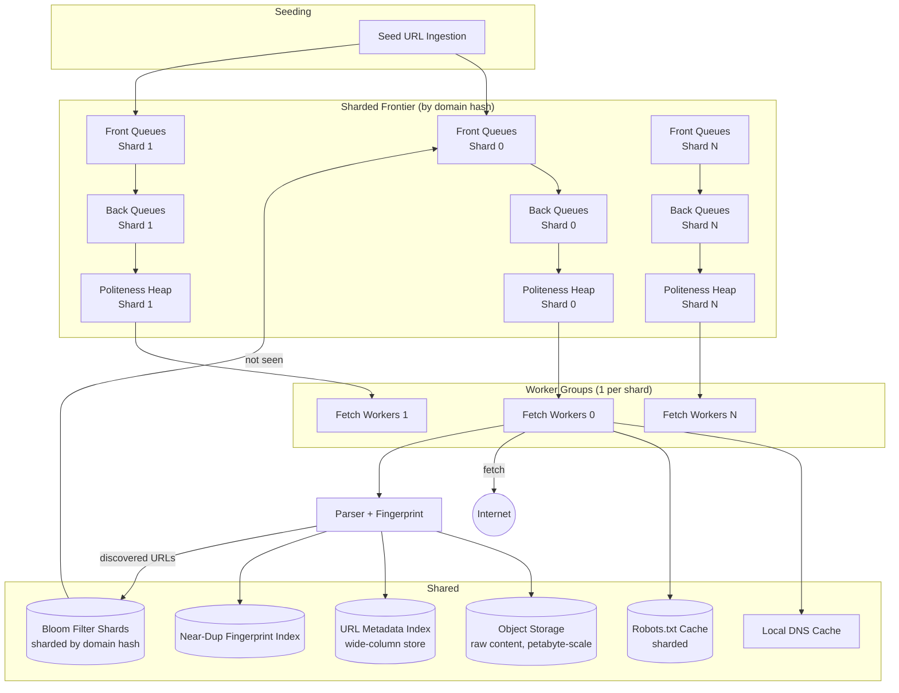

# Design: Web Crawler

**Difficulty:** Senior/Staff | **Time:** 60–75 minutes

!!! note "Instructions"
    **Cover the solution sections** and work through each step yourself first. Use "Hint" tabs if stuck. Practice explaining out loud — the way you communicate matters as much as the solution.

---

## 1. Problem Statement

Design a distributed web crawler that discovers and fetches web pages at scale, similar to what powers a search engine's index. Starting from a set of seed URLs, the crawler must follow links to discover new pages, fetch billions of pages over time, avoid re-crawling the same content unnecessarily, respect each site's crawling rules, and store the fetched content for downstream indexing.

---

## 2. Clarifying Questions

Practice asking these before designing:

??? question "What questions should you ask?"
    - **Scale:** How many pages total? How many new/refresh fetches per day?
    - **Freshness:** Do pages need periodic re-crawling (news sites daily, static pages monthly)?
    - **Scope:** Crawl the entire public web, or a bounded set of domains/seed sites?
    - **Content types:** HTML only, or also PDFs, images, JS-rendered SPAs?
    - **Politeness:** What crawl-rate constraints must we respect per domain (robots.txt, crawl-delay)?
    - **Dedup:** Do we need exact duplicate detection only, or near-duplicate (mirrors, syndicated content)?
    - **Priority:** Are some pages (high-PageRank, breaking news) crawled more urgently than others?
    - **Storage/downstream:** Who consumes the crawled corpus — an indexer, an analytics pipeline, both?
    - **Legal/ethical:** Do we need to honor `noindex`, `nofollow`, opt-out lists, and rate limits set by site owners?

---

## 3. Functional Requirements

- Start from seed URLs and discover new URLs by parsing outbound links from fetched pages
- Fetch page content (HTML at minimum) and store it for downstream processing
- Avoid fetching the same URL redundantly within a freshness window
- Respect `robots.txt` rules and per-domain crawl-delay
- Prioritize URLs for crawling (some pages more important/time-sensitive than others)
- Detect and avoid infinite crawl spaces (crawler traps)
- Detect near-duplicate content to avoid wasting storage/index space

## 4. Non-Functional Requirements

| Property | Requirement |
|----------|-------------|
| Scale | 10B+ pages in the corpus; 1B+ fetches/day sustained |
| Politeness | Never exceed a configurable per-domain request rate (e.g., 1 req/sec/domain default) |
| Throughput | Sustained fetch rate high enough to keep the corpus reasonably fresh |
| Fault tolerance | Worker crashes must not lose frontier state or duplicate excessive work |
| Storage | Append-mostly, write-heavy; petabyte-scale corpus |
| Extensibility | Pluggable parsers for new content types (HTML, PDF, JSON-LD) |

---

## 5. Capacity Estimation

```
Fetch throughput:
  1B pages/day
  1B / 86,400s ≈ 11,600 fetches/second (avg)
  Peak (2×): ~23,000 fetches/second

Politeness constraint:
  Default: 1 request per domain per second
  To sustain 11,600 fetches/second while being polite, we need to be
  crawling ≥ 11,600 distinct domains concurrently at any instant
  → with millions of domains in the frontier, this is achievable,
    but a naive single-queue-per-worker design cannot enforce it (see Section 7)

Storage:
  Avg page size (compressed HTML): ~30 KB
  10B pages × 30 KB ≈ 300 TB raw content
  Plus metadata (URL, headers, fetch time, checksum): ~500 bytes/page
  10B × 500 bytes = 5 TB metadata
  Total corpus: ~300+ TB, growing continuously — object storage, not a single DB

Frontier size:
  Discovered-but-not-yet-fetched URLs can exceed the fetched corpus by 5-10×
  Assume 50B URLs in frontier at steady state
  URL string avg 80 bytes + priority/metadata ~40 bytes = 120 bytes/entry
  50B × 120 bytes = 6 TB — frontier itself must be a distributed, sharded store, not in-memory on one box

Bloom filter for seen-URL dedup:
  50B+ URLs to test membership against
  Target false-positive rate: 0.1%
  Bits needed ≈ n × ln(1/p) / (ln2)^2 ≈ 50B × 9.97 / 0.48 ≈ ~1 TB of bits (~125 GB)
  Compare to a hash-set of full URLs at ~50B × 80 bytes = 4 TB — Bloom filter is ~30× smaller
```

!!! tip "Interview Insight 🎯"
    Two numbers matter more than raw throughput here: the **frontier-to-corpus ratio** (discovered URLs vastly outnumber fetched pages) and the **politeness constraint** (you need concurrency across domains, not just raw worker count, to hit throughput without violating per-domain rate limits). A candidate who jumps straight to "add more workers" without addressing politeness will hit a wall immediately in the deep dive.

---

## 6. API Design

A crawler is largely an internal system, but it exposes control and query interfaces:

```
POST /api/v1/seeds
Request: { "urls": ["https://example.com"], "priority": "high" }
Response: { "accepted": 1 }
Status: 202 Accepted

GET /api/v1/crawl-status?domain=example.com
Response: { "domain": "example.com", "pages_crawled": 45210, "last_crawl": "...", "robots_txt_status": "allowed", "crawl_delay_seconds": 1 }

GET /api/v1/pages/{url_hash}
Response: { "url": "...", "fetched_at": "...", "content_hash": "...", "storage_ref": "s3://corpus/..." }

POST /api/v1/domains/{domain}/exclude
Response: 204 No Content   // manual opt-out / legal takedown

Internal (not public):
POST /internal/frontier/enqueue     — add discovered URLs to the frontier
GET  /internal/frontier/dequeue?worker_id=...  — a worker claims a batch of URLs it's allowed to fetch now
```

!!! note "Pull, not push, for worker assignment"
    Workers *pull* batches of URLs they're currently allowed to fetch (respecting per-domain rate limits), rather than having a central scheduler push assignments. This keeps the scheduler simple and lets worker capacity scale independently — the scheduler's job is just "what's fetchable right now," not "which specific worker gets it."

---

## 7. Core Deep Dive: The Frontier, Politeness, and Partitioning

This is the hard problem in crawler design — everything else (parsing, storage) is comparatively standard. Three concerns are tightly coupled: **prioritization** (what to crawl next), **politeness** (not hammering one domain), and **partitioning** (how thousands of workers coordinate without stepping on each other).

**The frontier is not one queue.** A single FIFO queue of URLs cannot enforce per-domain politeness — if 10,000 URLs from `example.com` happen to cluster together, workers pulling from the front of the queue would blast `example.com` far past its allowed rate while other domains starve. The standard solution (used by Mercator and its descendants) is a **two-level queue structure**:



- **Front queues** hold URLs ordered by priority (breaking news, high-PageRank pages get fetched sooner).
- URLs are routed from front queues into **back queues**, with (in the simplest version) one back queue per active domain — this is what physically enforces politeness, since a worker can only ever pull the *front* of a specific domain's queue.
- A **min-heap keyed by "next allowed fetch time" per domain** selects which back queue is eligible to release its next URL. A domain that was just fetched sits in the heap with a future timestamp (`now + crawl_delay`) and isn't eligible until that time passes.

**Partitioning across distributed workers.** At billions of URLs, no single machine holds the frontier. The standard approach is to **shard the frontier by domain hash**, so all URLs for a given domain land on the same partition/worker group. This is what makes politeness enforcement tractable in a distributed system: politeness is a *local* property (rate-limit state per domain lives in one place) rather than a *global coordination* problem (which would require distributed locks or a shared rate-limit service hit by every worker for every fetch). This is the same insight behind [rate limiting](../reliability/rate-limiting.md) generally — colocate the limiter's state with the thing being limited rather than centralizing a hot counter.



**robots.txt compliance.** Before a domain's back queue is populated, the crawler fetches and caches that domain's `robots.txt` (with its own TTL, typically 24h). Disallowed paths are filtered out at enqueue time (cheap, avoids wasted fetches) and re-checked at fetch time (in case the cached robots.txt is stale and rules tightened). `Crawl-delay` directives in robots.txt directly set the domain's rate-limit interval in the politeness heap, overriding the crawler's default.

---

## 8. Duplicate URL Detection at Scale: Bloom Filters

Before enqueueing a discovered URL, the crawler must check "have I already seen this URL?" — otherwise the frontier grows unboundedly with re-discovered links (nearly every page links back to its own site's homepage, for instance).

At 50B+ URLs, an exact set (hash table of full URL strings) costs ~4 TB. A **Bloom filter** trades a small, tunable false-positive rate for a ~30x space reduction (see Section 5 math: ~125 GB for the same 50B URLs at 0.1% FP rate).

```python
class URLSeenFilter:
    def __init__(self, expected_items, false_positive_rate=0.001):
        self.bit_array = BitArray(size=optimal_bits(expected_items, false_positive_rate))
        self.hash_count = optimal_hash_count(expected_items, false_positive_rate)

    def might_have_seen(self, url: str) -> bool:
        return all(self.bit_array[h(url, seed=i)] for i in range(self.hash_count))

    def mark_seen(self, url: str):
        for i in range(self.hash_count):
            self.bit_array[h(url, seed=i)] = 1
```

**The trade-off to name explicitly in an interview:** a Bloom filter has false positives (says "seen" when it wasn't) but never false negatives (never says "not seen" for something actually seen). A false positive means we *skip* crawling a URL we've never actually fetched — a permanently lost page, not a crash or a duplicate fetch. At 0.1% FP rate on 50B URLs, that's up to ~50M URLs silently never crawled — usually an acceptable trade for the 30× space savings, but worth stating as a conscious choice, and worth periodically reconciling against a smaller exact store for high-priority seed domains where every page matters.

The filter itself must be sharded the same way the frontier is (by domain hash) so each partition owns its own filter shard and duplicate checks stay local, not a call to a centralized filter service for every one of billions of discovered links.

---

## 9. Crawler Traps and Near-Duplicate Content

**Crawler traps** are URL spaces that are effectively infinite — a calendar widget that links "next month" forever, session IDs appended to every URL creating infinite variations of the same page, or auto-generated faceted-search URLs (`?color=red&size=M&sort=price&page=9999...`). Left unchecked, a trap can consume a disproportionate share of crawl budget on a single low-value domain.

Mitigations:

- **Per-domain crawl budget:** cap total pages fetched per domain per time window regardless of how many URLs are discovered there; once exhausted, remaining discovered URLs for that domain wait for the next window
- **URL depth/pattern limits:** cap link-following depth from the seed, and detect repeating URL patterns (same path template with only a query parameter incrementing) to collapse them into a single crawl decision
- **Content-based trap detection:** if consecutive pages within a domain hash to near-identical content (see below), stop following that link pattern

**Near-duplicate content detection** matters because exact-hash dedup (simple checksum) only catches byte-identical pages — but the web is full of near-duplicates: syndicated news articles, mirrored documentation, pages differing only by a timestamp or ad slot. The classic techniques:

- **Shingling:** break page text into overlapping n-word sequences ("shingles"), hash each, and represent the page as a set of shingle hashes. Two pages with a high Jaccard similarity of their shingle sets are near-duplicates.
- **SimHash:** compress a page's feature set into a single fixed-size fingerprint (e.g., 64 bits) such that similar pages produce fingerprints with small Hamming distance. This is cheaper to compare and index than full shingle sets — comparing two SimHash fingerprints is a fast XOR + popcount, and finding "near" fingerprints across a corpus can use bucketing on fingerprint prefixes rather than pairwise comparison.

Both are computed at ingest time (after fetch, before/alongside storage) and the fingerprint is stored alongside the page metadata so downstream indexing can cluster or suppress near-duplicates without re-fetching.

---

## 10. Basic Architecture (Version 1)



This works for a small-scale, single-machine crawler. It cannot enforce politeness correctly at scale (one shared queue) and cannot handle billions of URLs (one machine, one filter instance).

---

## 11. Identify Bottlenecks

???+ question "Where does this design break at 11,600 fetches/second?"
    - **Single frontier queue:** cannot enforce per-domain politeness once concurrent workers pull from anywhere in the queue — needs the front-queue/back-queue partitioned structure from Section 7
    - **Single Bloom filter instance:** at 50B+ URLs and thousands of workers doing lookups, one instance becomes a network/lock bottleneck — needs sharding by domain hash, colocated with the frontier partition
    - **DNS resolution:** resolving a hostname per fetch at 11K+ fetches/second will overwhelm naive DNS lookups — needs a caching, pre-warmed DNS resolver layer local to each worker group
    - **Storage writes:** 11K pages/second × 30KB ≈ 350 MB/s sustained write — object storage handles this, but the metadata index (for URL → storage location lookups) needs to be a horizontally scalable KV store, not a single relational table
    - **robots.txt fetch-per-domain overhead:** fetching robots.txt synchronously before every new domain's first crawl adds latency — needs async pre-fetching and aggressive caching (24h TTL)

---

## 12. Scaled Architecture (Version 2)



Each frontier shard owns its own front/back queues, politeness heap, Bloom filter shard, and worker group — this is what lets the system scale horizontally by adding shards, while politeness enforcement stays a cheap local operation per shard rather than a distributed coordination problem.

---

## 13. Failure Modes

=== "Worker Crashes Mid-Fetch"
    - In-flight URLs (claimed but not yet acked as fetched) are lost from tracking if not handled carefully
    - **Mitigation:** claimed URLs get a visibility timeout (like an SQS-style lease); if not acked within the timeout, they return to the back queue automatically for another worker to pick up

=== "A Domain Returns 500s or Times Out Repeatedly"
    - Naive retry-forever wastes crawl budget and can look like an accidental DoS against a struggling site
    - **Mitigation:** exponential backoff per domain on repeated failures, capped retry count, and a temporary domain-level cooldown (e.g., skip for 1 hour) tracked in the politeness heap alongside normal crawl-delay

=== "Bloom Filter Shard Grows Beyond Capacity"
    - False-positive rate creeps up as more items are added than the filter was sized for, silently causing more URLs to be skipped
    - **Mitigation:** monitor filter fill ratio, provision with headroom (size for 2-3× expected items), and support online resizing (rebuild into a larger filter from a periodic exact-URL log if fill ratio crosses a threshold)

=== "Crawler Trap Consumes a Worker Group's Entire Budget"
    - One misbehaving domain's infinite URL space keeps a shard's workers busy fetching low-value pages, starving other domains on the same shard
    - **Mitigation:** per-domain crawl budget cap (Section 9) enforced independently of overall frontier size, and anomaly detection on discovered-URL growth rate per domain (a domain suddenly producing 100x its normal link-discovery rate is a trap signal)

---

## 14. Consistency Considerations

- **Eventual consistency is the norm:** the corpus is inherently a snapshot-in-time of a constantly changing web; there is no "correct" global state to stay consistent with, only a freshness target
- **Seen-URL filter can tolerate rare false negatives if it had them (it doesn't, by construction) but not false positives silently dropping high-value URLs** — this is why priority/seed domains may warrant a secondary exact-dedup check rather than relying solely on the probabilistic filter
- **Frontier partition reassignment (rebalancing when adding shards) must not duplicate or drop in-flight domain state** — rebalancing should happen at domain-hash-range boundaries with the old shard draining its back queues before handoff, not an abrupt cutover
- **Metadata index and object storage can lag each other briefly** (content written, index update pending) — acceptable for a system without a real-time read requirement, but downstream indexers should treat "in metadata index" as the ready signal, not "in object storage"

---

## 15. Storage of the Crawled Corpus

The corpus is a **write-heavy, append-mostly workload**: billions of new or re-fetched pages are written continuously, individual pages are rarely updated in place (a re-crawl writes a new version rather than mutating), and reads are dominated by downstream batch jobs (indexers, analytics) scanning large ranges rather than single-key point lookups from a live user-facing request path.

This shape argues strongly against a general relational database as the primary content store — see [SQL vs NoSQL](../databases/sql-vs-nosql.md) for the underlying trade-off axes. In practice:

- **Raw page content** goes to object storage (S3-class), keyed by a content hash or URL hash — cheap, durable, scales horizontally, and naturally append-mostly since each fetch is a new object
- **URL → storage-location and crawl-metadata** goes in a wide-column store (Bigtable/Cassandra-class) — optimized for exactly this workload: extremely high write throughput, range scans by domain or crawl-time, no need for cross-row transactions
- **A relational store is reserved for small, low-volume control-plane data** — domain configuration, manual excludes, crawl policy overrides — where transactional guarantees and ad-hoc joins actually matter

---

## 16. Observability

```
Key metrics:
- fetch_rate (pages/second, overall and per-shard)
- politeness_violations (should be ~zero — alert immediately if nonzero)
- frontier_depth (per shard — growing unboundedly signals a trap or a stuck downstream)
- bloom_filter_fill_ratio (per shard — approaching capacity risks FP rate creep)
- robots_txt_cache_hit_rate
- fetch_error_rate (by error class: timeout, 4xx, 5xx, DNS failure)
- crawl_budget_exhaustion_events (per domain — trap detection signal)
- corpus_growth_rate (bytes/day, pages/day)
- near_duplicate_rate (fraction of fetches identified as near-dup — trending up may indicate a trap or low-value domain to deprioritize)

Alerts:
- Any politeness_violations > 0
- frontier_depth growing without bound on a shard
- bloom_filter_fill_ratio > 80% of provisioned capacity
- fetch_error_rate > 5% sustained (possible IP block / user-agent issue)
```

---

## 17. Cost Analysis

```
Object storage (300+ TB corpus, growing):        ~$7,000/month
Wide-column metadata store (5+ TB, high write):   ~$3,500/month
Worker fleet (thousands of fetch workers):        ~$15,000/month
Bandwidth (outbound fetch requests, 1B/day):      ~$2,000/month
Bloom filter + frontier infra (in-memory/SSD):    ~$1,200/month
SimHash/near-dup index:                           ~$800/month
Total:                                            ~$29,500/month

Cost per page crawled:
  $29,500 / (1B/day × 30 days) ≈ $0.00000098 per page
  At this scale, worker fleet (fetch + parse compute) dominates cost, not storage —
  optimizing fetch efficiency (connection reuse, concurrent fetches per worker) matters more than storage tiering
```

---

## 18. Alternative Architectures

=== "Centralized Rate Limiter Instead of Domain-Sharded Frontier"
    Every worker calls a shared rate-limiting service before each fetch instead of partitioning the frontier by domain. Simpler mental model, but the shared service becomes a bottleneck and single point of failure at scale — every one of 20K+ fetches/second needs a round trip to it. The domain-sharded frontier trades some rebalancing complexity for making politeness a local, lock-free property.

=== "Focused/Vertical Crawler"
    Instead of general web-scale crawling, restrict scope to a bounded set of domains or a topic (e.g., only e-commerce product pages, or only a company's own approved partner sites). Dramatically smaller frontier and corpus, simpler dedup (exact hash set suffices, no need for Bloom filters), but doesn't generalize — this is the right answer when the actual requirement is narrower than "crawl the web."

---

## 19. Staff Engineer Extensions

=== "100× Traffic"
    At 1M+ fetches/second, DNS and TCP/TLS connection overhead per fetch becomes the dominant cost — invest in persistent connection pools per domain and HTTP/2 multiplexing where servers support it. Frontier shard count scales with domain cardinality, not raw URL count, since politeness is per-domain — verify the domain-hash distribution isn't skewed by a few mega-domains needing their own dedicated shard (a "hot key" problem identical to any hash-partitioned system).

=== "Cut Cost by 90%"
    Reduce re-crawl frequency for low-value/rarely-changing domains using an adaptive freshness policy (track historical change rate per domain, crawl less often if content is static) instead of a fixed re-crawl schedule. Tier storage — move corpus content older than N days to cheaper cold storage, keep only recent crawls hot. Reduce worker fleet by improving per-worker fetch concurrency (async I/O) rather than horizontal worker count.

=== "Global Expansion"
    Deploy fetch worker groups in multiple regions so fetches originate geographically close to target domains (lower latency, and some sites geo-restrict or geo-optimize responses). Frontier sharding stays by domain hash globally, but a domain's shard can be pinned to the region with the best network path to that domain's hosting location.

=== "Data Residency"
    Less directly applicable than in user-data systems, since the corpus is public web content — but crawl logs/metadata that include operator PII (which worker/IP fetched what) may still be subject to regional handling rules if the crawling operation itself is run as a regulated service; keep control-plane audit logs regionally partitioned as a precaution.

=== "Regional Failure"
    If a region's worker groups go down, their owned frontier shards should be reassigned to healthy regions rather than sitting idle — this requires the frontier shard ownership to be a soft assignment (lease-based, like the worker-crash mitigation in Section 13) rather than a hard-coded region pinning, so failover is automatic.

=== "Zero-Downtime Frontier Resharding"
    1. Stand up new shard count in parallel, compute new domain-hash-to-shard mapping
    2. Dual-write newly discovered URLs to both old and new shard mapping during a transition window
    3. Drain old shards' back queues (stop accepting new enqueues, let in-flight work complete)
    4. Cut worker groups over to the new shard mapping
    5. Decommission old shards once drained and verified empty

---

## 20. Interview Follow-ups

1. **"Why not just use a hash set instead of a Bloom filter for seen-URL tracking?"** — At 50B+ URLs, an exact hash set costs ~30× more memory/storage (Section 5/8 math); the Bloom filter's false-positive trade-off (occasionally skipping a never-fetched URL) is acceptable at web-crawl scale, whereas the storage cost of an exact set is not.
2. **"How do you avoid crawling the same page twice if it's reachable via two different URLs (with/without trailing slash, different query param order)?"** — URL normalization/canonicalization (lowercase host, strip default ports, sort query params, resolve `.`/`..` in paths, strip session-ID-like params via known patterns) before the seen-check and before enqueueing — dedup only works if equivalent URLs hash identically.
3. **"How would you prioritize re-crawling a news site over a static personal blog?"** — Maintain a per-domain/per-page change-frequency estimate from crawl history; feed that into the front-queue priority score alongside PageRank/importance signals, so high-change-rate + high-importance pages get shorter re-crawl intervals.
4. **"What stops a malicious site from feeding the crawler an infinite redirect loop?"** — Cap redirect-follow depth (e.g., 5 hops) per fetch attempt and treat exceeding it as a fetch failure, not an infinite retry.
5. **"How do you handle JavaScript-rendered pages where content isn't in the raw HTML?"** — A separate, more expensive rendering pipeline (headless browser pool) for domains/pages flagged as JS-heavy, used selectively rather than for every fetch, since headless rendering costs 10-100× a plain HTTP fetch in compute.

---

## Self-Assessment

- [ ] Can I explain why a single frontier queue can't enforce politeness, and how the front-queue/back-queue design fixes it?
- [ ] Can I justify sharding the frontier and Bloom filter by domain hash rather than by URL hash?
- [ ] Can I walk through the Bloom filter's false-positive trade-off with the actual math (bits needed vs. exact set size)?
- [ ] Can I describe at least two concrete crawler-trap mitigations?
- [ ] Can I explain why the corpus is a write-heavy workload and what that implies for storage choice?
- [ ] Can I estimate cost within 2× accuracy and identify which component dominates it?
