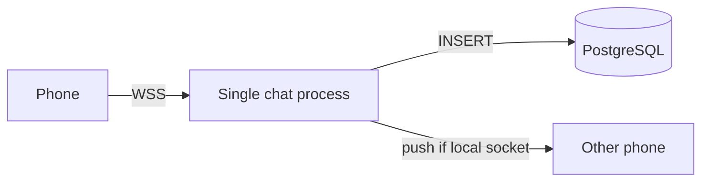
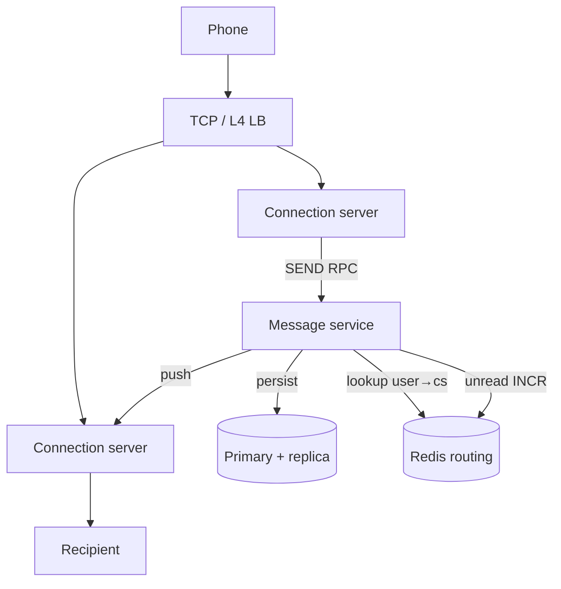
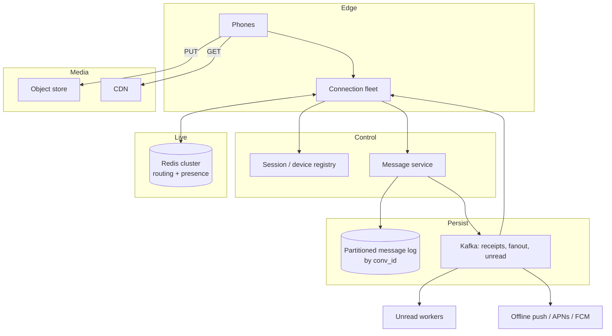
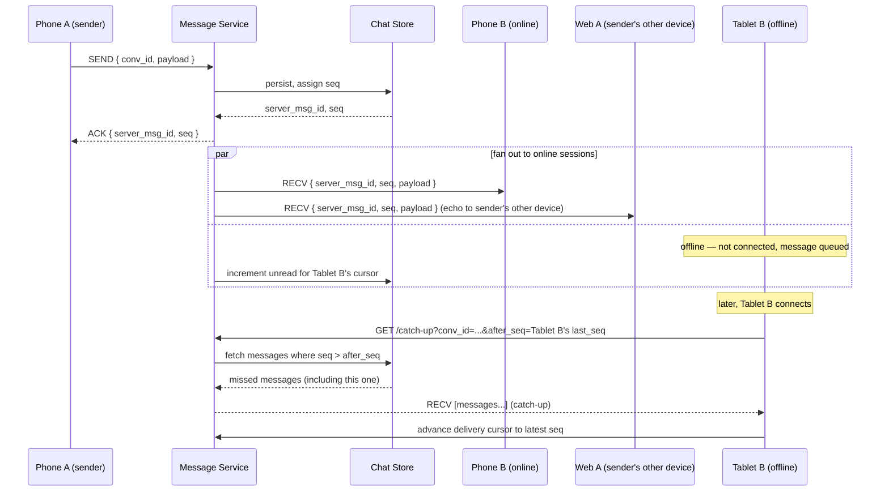

# Design: WhatsApp / Real-Time Messaging

**Difficulty:** Senior/Staff | **Time:** 60–75 minutes

!!! note "Instructions"
    Cover the solution sections. Draw V1 yourself before opening later diagrams. The interview is won on *message path* and *failure*, not on naming Cassandra.

---

## 1. Problem Statement

Design a mobile messaging product. A user types a text (and later a photo) to one person or a group. Recipients see the message quickly if they are online, catch up when they open the app, and can tell whether it was sent, delivered, and read. They expect last night’s chat to still be there, and a green dot when a friend is online.

Start from that product. Do not start from Kafka.

---

## 2. Clarifying Questions

??? question "What questions should you ask?"
    - **1:1 only, or groups?** Group size cap (256 vs 10K broadcast)?
    - **Delivery semantics:** at-least-once is fine if the client dedups?
    - **History:** lifetime? Search? Multi-device catch-up?
    - **Online presence** and typing indicators — freshness SLA?
    - **Media:** size cap, encryption, download-on-open vs prefetch?
    - **Multi-device:** phone + web + tablet, all live?
    - **E2E encryption** in scope for this interview, or later?
    - **Scale:** DAU, messages/day, p99 send-to-notify?
    - **Regions / residency?** Can EU history leave the EU?

---

## 3. Functional Requirements

- Send and receive 1:1 messages
- Group chats with a bounded member list (start at 256)
- Delivery status: sent → delivered → read
- Persistent history, scroll-back, unread counts
- Online / last-seen presence
- Image / video attachments (metadata in chat, bytes elsewhere)
- Multiple devices for one account (V3+)

Out of scope for V1: voice/video calls, status stories, payments.

## 4. Non-Functional Requirements

| Property | Requirement | Reasoning |
|----------|-------------|-----------|
| Send ack | < 200ms p99 same region | “Single tick” feel |
| Online fanout | < 500ms p99 to an online recipient | Conversation, not email |
| Availability | 99.99% send path | Chat is the product |
| Ordering | Per-conversation, not global | Users notice inversions in a thread |
| Durability | No silent drop after send-ack | Trust |
| Catch-up | 1K messages < 2s on open | Multi-device, new phone |

---

## 5. Capacity Estimation

```
200M DAU
  50 messages / user / day  →  10B messages / day
  10B / 86,400 ≈ 116K messages/s average
  Peak 8× (evening): ~900K messages/s

Connections:
  30% of DAU connected at peak ≈ 60M long-lived sockets
  60M / 50K sockets per connection box ≈ 1,200 connection servers

Payload:
  Text avg 200 B + metadata 200 B ≈ 400 B
  900K × 400 B ≈ 360 MB/s ingest
  Media: 15% of messages, avg 200 KB → object store, not the chat DB

History:
  10B/day × 400 B × 365 × 5 years ≈ 7.3 PB compressed less
  Must shard. Cannot be one Postgres.

Groups:
  Avg size 8, p99 128, max 256
  Fanout-on-write at 256 × 900K would be ugly if every message were a max group —
  most are 1:1. Design for the distribution, not the max × peak product.
```

!!! tip "Interview Insight 🎯"
    Two numbers dominate: **60M idle sockets** and **history volume**. Chat is a connection-management problem *and* a time-series storage problem. Treating it as “a REST API with a table of messages” fails both.

---

## 6. API Design

HTTP for session/bootstrap; a long-lived connection for events.

```
POST /v1/sessions
  → { access_token, ws_url, device_id }

# WebSocket (or HTTP/2 stream)
→ AUTH { token, device_id }
→ SEND { client_msg_id, conv_id, type, ciphertext_or_text, reply_to? }
← ACK  { client_msg_id, server_msg_id, seq, ts }
← RECV { server_msg_id, conv_id, from, seq, payload, ts }
→ DELIVERED { server_msg_id }
→ READ     { conv_id, up_to_seq }
← RECEIPT  { server_msg_id, status, by, ts }
← PRESENCE { user_id, state, last_seen? }

GET  /v1/conversations/{id}/messages?after_seq=&limit=50
GET  /v1/conversations?cursor=
POST /v1/media/upload-url     → { put_url, media_id }
```

`client_msg_id` is the idempotency key. Retransmit on missing `ACK`.

---

## 7. Data Model

```sql
CREATE TABLE conversations (
    id            UUID PRIMARY KEY,
    type          VARCHAR(8) NOT NULL,   -- dm | group
    created_at    TIMESTAMPTZ NOT NULL
);

CREATE TABLE conversation_members (
    conv_id       UUID NOT NULL,
    user_id       UUID NOT NULL,
    joined_seq    BIGINT NOT NULL DEFAULT 0,
    last_read_seq BIGINT NOT NULL DEFAULT 0,
    PRIMARY KEY (conv_id, user_id)
);

-- Hot path is usually a wide-column / partitioned store keyed (conv_id, seq)
CREATE TABLE messages (
    conv_id       UUID NOT NULL,
    seq           BIGINT NOT NULL,       -- monotonic per conversation
    server_msg_id UUID NOT NULL,
    client_msg_id UUID NOT NULL,
    sender_id     UUID NOT NULL,
    kind          VARCHAR(16) NOT NULL,  -- text | media | system
    body          BYTEA NOT NULL,        -- plaintext V1; ciphertext later
    created_at    TIMESTAMPTZ NOT NULL,
    PRIMARY KEY (conv_id, seq)
);
CREATE UNIQUE INDEX uq_client_msg ON messages (sender_id, client_msg_id);
```

Ephemeral: device → connection-server routing table; presence TTL keys; unread counters.

---

## 8. Version 1 — one chat box

One API process holds all WebSockets. Messages go to Postgres. If the recipient has a socket on this process, push; else they poll history on open.



This teaches the product loop: **persist first, then ACK, then attempt push**. Never ACK before the row exists.

**It dies at** ~50K sockets, one DB writer, and any deploy (all connections drop). That is the point of V1 — you now know what to split.

---

## 9. Bottlenecks

???+ question "Where does V1 break first?"
    - **File descriptors / memory** on the one process (60M sockets is a fleet).
    - **Postgres** as both history and a queue: every group message is N inserts or one insert + N notify rows; vacuum and indexes will not keep 900K/s.
    - **Sticky connection:** sender and receiver are almost never on the same box once you scale out naively.
    - **Unread and presence** as `UPDATE users` — hot rows.
    - **Media bytes** through the chat process — do not.

---

## 10. Version 2 — split connections from messages



**Send path:**

1. Connection server authenticates the socket, registers `user_id, device_id → cs_id` in Redis with a heartbeat.
2. `SEND` is an RPC to the message service. Message service allocates `seq` (per-conversation generator), inserts, then `ACK`.
3. For each *online* member, look up `cs_id` and push `RECV`. Offline members only increment unread.

**Still missing for WhatsApp-scale:** group fanout throughput, multi-device, media, presence storms, and a history store that is not a single primary.

---

## 11. Version 3 — production chat

Separate the planes.



**Groups — fanout policy:**

| Group size | Strategy |
|------------|----------|
| 1:1 and ≤ 32 | Fanout-on-write: push to each online device; write one canonical log |
| 33–256 | Write once; fanout *online* members via Kafka; offline read the log on open |
| Broadcast / huge | Not this product. Channels are a different system (fanout-on-read) |

**Unread:** not `COUNT(*)`. A counter per `(user, conv)` updated by a worker. Open conversation → set to 0. Badge = sum of counters (cached).

**Ordering:** `seq` is assigned by a single writer per `conv_id` (hash the conversation onto a message-service shard / partition). Clients render by `seq`, buffer out-of-order `RECV`.

**Media:** client uploads to a signed URL, then `SEND` with `media_id` + thumbnail. Chat path never sees megabytes.

**Presence:** Redis key `presence:{user}` TTL 30s, refreshed on heartbeat. Subscribers of *open chats only* get updates via pub/sub. Broadcasting 200M last-seens is a self-DDoS.

**Offline:** if no device is registered, publish to a push worker. APNs/FCM are best-effort; history is source of truth.

---

## 12. Multi-device and catch-up

Each device has its own connection and its own **delivery cursor** (`last_seq` per conversation, plus a global event log of receipts).

```
Phone A sends → persist → ACK to A
             → RECV to Phone B (online)
             → RECV to Web session of sender (echo)
             → RECV to Tablet of B when it next connects (catch-up GET after_seq)
```



Do not store “delivered” as a single boolean on the message. Store receipts per device or at least per user; multi-device read receipts are a product decision (WhatsApp: read on one device reads for the account).

---

## 13. Failure analysis

=== "Redis gone"
    Routing table and presence vanish. Sockets are still up, but the message service cannot find `cs_id`.
    **Mitigation:** connection servers also announce on a gossip / etcd map as backup; degrade presence to “unknown”; fall back to recipient pulling on a short poll. Do not block `ACK` on Redis — persist already succeeded.
    **Prevention:** Redis cluster, registration writes to two AZs, local LRU of recent routes.

=== "Kafka down"
    Live 1:1 push can stay on RPC. Group fanout, receipts, unread, and offline push lag.
    **Mitigation:** synchronous push for conversations with ≤ N online members; queue receipts on local disk; unread becomes eventually correct (recompute from `last_read_seq` vs max seq).
    **User-visible:** ticks stuck on “sent”, badges stale. Communicate that — do not silently drop.

=== "A message shard at 70% CPU / 70% disk"
    One celebrity group or a hot `conv_id` hash.
    **Signals:** p99 send-ack only for some `conv_id`s; Kafka partition lag on that key; disk on one log volume.
    **Mitigation:** shed media and receipts first; split the conversation log (epoch + new partition); rate-limit that group’s senders.
    **Fix:** rehash large groups; per-group writer pool; cap group size.

=== "Region lost"
    All users pinned to that region cannot send. Other regions healthy.
    **Mitigation:** DNS / Anycast away from the dead region; devices reconnect. History is in the lost region — **do not** serve empty chat. Read-only replica in a paired region if RPO allows, or show “history temporarily unavailable” while send goes to a new writer (hard — seq holes).
    **Staff call:** prefer **regional homes** with async copy over “every message in three regions synchronously” at 900K/s.

=== "Replica 20 minutes behind"
    Catch-up `GET` if routed to the replica returns a hole; user thinks messages vanished, then they “reappear.”
    **Mitigation:** send path and catch-up read the **primary** (or a replica with lag SLO << 1s). Analytics can use the stale replica. Alert `replication_lag > 5s` on the chat store.

---

## 14. Consistency

- **Send-ack is the durability line.** After ACK, another device of the sender must be able to see the message (read-your-writes → primary).
- **Cross-conversation order is irrelevant.** Do not run a global sequence.
- **Receipts are eventual.** A read receipt can arrive before `RECV` on a slow socket — client must tolerate it.
- **Unread is a cache.** Wrong badge is recoverable; lost message after ACK is not.

---

## 15. Reliability

- Persist → ACK → push. Push retries from the log, not from RAM.
- Connection servers are cattle; clients reconnect with backoff and resume from `after_seq`.
- Idempotency on `(sender_id, client_msg_id)` so a retry after a lost ACK does not double-post.
- Poison payloads (huge, corrupt) isolated; do not stall the conversation `seq` generator.

---

## 16. Security

- Auth tokens bound to `device_id`; steal-a-token ≠ steal-all-devices without the device key.
- Authorization on every `SEND` / history GET (membership).
- Media URLs signed and short-lived.
- Rate-limit sends per user and per group (see [Rate Limiter](rate-limiter.md)).
- E2E (staff): server stores ciphertext; `seq`, membership, timestamps, and push metadata remain visible. Key exchange (Signal-style) is a *client* protocol; multi-device is the hard part (sender keys / device list). Do not pretend the server can search E2E bodies.

---

## 17. Observability

```
send_ack_ms{region}              p50 / p99
push_online_ms
connected_sockets per CS
routing_lookup_fail_ratio
kafka_lag{topic=fanout|receipts}
unread_recompute_rate
replication_lag_s{shard}
messages_persisted_total vs acks_total   (must match)

Alerts:
  acks_total << persist_total
  any shard replication_lag_s > 5
  CS socket drop > 20% in 2 min (bad deploy / LB)
```

---

## 18. Cost (order of magnitude)

```
Connection fleet (1,200 × 8-core):     largest compute line
Message log cluster (sharded SSD):     largest storage line
Kafka + Redis:                         substantial but smaller
Object storage + CDN for media:        usage-based, often #1 $ if video is popular
APNs/FCM:                              cheap vs sockets

Lever: do not persist typing indicators; sample presence; compress history; tier cold chat to cheaper storage after 90 days.
```

---

## 19. Alternatives

=== "Pure pull (no push)"
    Slack-in-2008. Simpler ops, worse UX, more load on open. Fine for enterprise with 10K DAU, not WhatsApp.

=== "Matrix / federation first"
    Multiple servers exchange with a protocol. Right for sovereignty, wrong as the V1 of a single consumer app.

=== "One Kafka topic as the user inbox"
    Every user is a partition key. 200M keys, rebalance hell. Prefer a log per conversation + a lightweight inbox offset.

---

## 20. Interview follow-ups

1. **How do you assign `seq` without a hot row?** Per-conversation memory sequencer on the owner shard; persist `seq` with the message in one write; on failover, read `MAX(seq)`.
2. **What if two devices send at once in a group?** Owner shard serializes; clients reconcile by `seq`.
3. **Delete for everyone?** Tombstone in the log; devices hide on next sync. E2E: you can only ask clients to delete.
4. **Push notification content?** If E2E, the push is “New message”, not the body.

---

## 21. Staff Engineer Extensions

=== "100× traffic"
    90M messages/s is a multicast problem. More CS pods, regional Kafka, conversation shards in the thousands, edge caches for media. Drop features that amplify (forwarded broadcasts) behind dedicated channels.

=== "Cut cost 30%"
    Idle-disconnect sockets after 2 min to push (mobile radio already sleeps); colder history to object storage; presence only for open chats; merge tiny groups’ partitions.

=== "Global + residency"
    User has a **home region**. History and `seq` live there. A traveler’s CS is local; `SEND` RPCs home (one extra 100–200ms). EU bodies do not replicate to US. Cross-home DMs: two homes, or pick the smaller user’s home and pin the conversation.

=== "Regional failure"
    Fail open *connections* elsewhere; do not fail open an empty database. If the home region’s writer is gone, enter read-only from the paired replica (if lag < few seconds) or freeze send. 20-minute replica lag → freeze. Document RPO.

=== "Zero-downtime store migration"
    Dual-write new messages; backfill by `conv_id`; catch-up reads compare; shift `GET` to the new store per shard; keep old store until receipt workers drain.

=== "E2E at staff depth"
    Identity keys, signed prekeys, sender keys for groups (rekey on membership change), encrypted media (key in the message payload). Server-side: honest-but-curious. Metadata minimization is the remaining privacy work (sealed sender is extra credit).

---

## Self-Assessment

- [ ] I persist before ACK and can say why
- [ ] I can choose fanout-on-write vs on-read with a group-size cutoff
- [ ] I can walk Redis-down, Kafka-down, and 20-minute replica lag
- [ ] I did not put media bytes in the message table
- [ ] I can explain multi-device catch-up with `after_seq`
